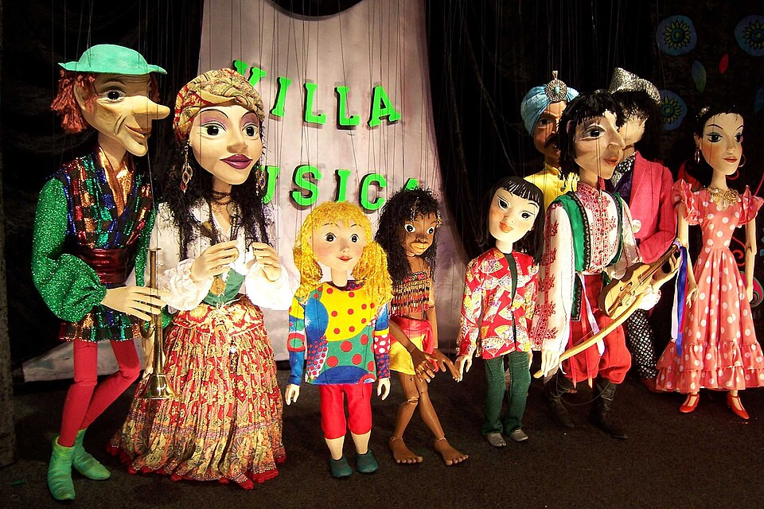

# Урок 50 — Rigify: профессиональный риг за минуты ⚡🦴

**Модуль 6 | 2 академических часа (1,5 часа)**

> 🔁 В начале урока — [повторение урока 49](повторение.md) (викторина по ходьбе, 5–7 мин)

> 🎬 За уроки 46–49 мы собрали риг **вручную** — и теперь понимаем, как он устроен. А сегодня — **волшебная кнопка**: аддон **Rigify** соберёт **профессиональный риг** (с удобными контролами и переключателем FK/IK) за минуты. Сначала научились «руками», теперь ускоряемся, как в студии.

---

## Цель урока

- Понять, что такое **Rigify** и **мета-риг** (шаблон скелета)
- Подогнать мета-риг под персонажа и **сгенерировать** проф-риг
- Понять **контрол-риг** (ручки-контролы) vs **деформ-кости**
- Освоить **переключатель FK/IK** на готовом риге
- Сохранить наборы контролов через **Bone Selection Sets**

---

## Часть 1 — Теория: что такое Rigify (18 минут)

### 1.1. Риг с «ручками» = марионетка 🎎

Профессиональный риг — это не голые кости, а **контролы-ручки**: круги, стрелки, за которые удобно «дёргать» персонажа. Точно как **марионетка**: кукловод не трогает саму куклу — он двигает **крестовину и нити**, а кукла повторяет:

*Марионетки. [Wikimedia Commons, CC BY-SA](https://commons.wikimedia.org/wiki/File:PloenMarionetten_1.jpg). Кукловод тянет **нити/крестовину** (контролы) — кукла двигается. Контрол-риг Rigify — те же «ручки»: берёшь контрол стопы или кисти, и персонаж принимает позу.*

### 1.2. Rigify = генератор рига ⚙️

**Rigify** — встроенный аддон. Он работает в два шага:
1. **Мета-риг** — готовый шаблон скелета (например, «Human»). Ты двигаешь его кости, **подгоняя под своего персонажа**.
2. **Generate Rig** — одна кнопка: Rigify строит из мета-рига **полный контрол-риг** — с IK/FK, контролами пальцев, лица, позвоночника. То, что мы делали уроками, — за секунды.

> 🧠 **Под капотом — почему это не «читерство»:** Rigify собирает ровно то, что мы делали руками (кости, веса-группы, IK-цели, Pole, ограничители) — только автоматически и аккуратно. Мы **сначала научились вручную (46–49)**, поэтому теперь **понимаем**, что Rigify сделал, и сможем это чинить. Кнопка без понимания — опасна; кнопка с пониманием — суперсила.

### 1.3. Два типа костей в готовом риге

| Тип | Зачем | Видно |
|-----|-------|-------|
| **Контролы** (контрол-кости, фигуры-ручки) | **ими анимируешь** (тянешь руку/стопу) | да, цветные фигуры |
| **DEF-кости** (deform) | реально **гнут кожу** (к ним привязан меш) | спрятаны |
| **MCH/ORG** (механизм) | служебные, считают IK/Pole | спрятаны |

> Ты трогаешь только **контролы**. Остальное Rigify крутит сам.

### 1.4. Переключатель FK/IK

У руки и ноги Rigify-рига есть **свойство FK/IK** (ползунок 0..1): 0 = FK (махи), 1 = IK (опора). Помнишь урок 48 — когда что? Здесь это **переключается одним числом** на лету.

> 🔬 **Проверь сам (1 мин):** после генерации выдели контрол руки → в `N`-панели → вкладка **Item/Rig Main Properties** найди **IK-FK** → покрути 0↔1. Увидишь, как рука переключает поведение. То, что мы строили вручную, — здесь ползунком.

---

## Часть 2 — Включаем Rigify и добавляем мета-риг (12 минут)

**Шаг 1. Включи аддон.**
1. `Edit → Preferences → Add-ons` → поиск **«Rigify»** → поставь ✅. Закрой.
   ✅ *Должно получиться:* в `Shift+A → Armature` появились мета-риги.

> 💡 **Аддон — Rigify (повтор каталога):** встроенный, мастхэв для персонажей. Каталог — [справочники/аддоны.md](../../справочники/аддоны.md).

**Шаг 2. Добавь человеческий мета-риг.**
1. Открой своего человечка (меш из уроков 46–49; старую ручную арматуру можно скрыть/удалить — сделаем новый риг).
2. `Shift+A → Armature → Human (Meta-Rig)`.
   ✅ *Должно получиться:* появился готовый скелет-шаблон человека (с пальцами и лицом).

---

## Часть 3 — Подгоняем мета-риг под персонажа (20 минут)

Мета-риг нужно «надеть» на твою модель — подвинуть кости в суставы.

**Шаг 1. Масштаб и позиция.**
1. В Object Mode подгони общий размер мета-рига под рост персонажа (`S`), поставь по центру.
2. Включи **In Front** (Object Data → Viewport Display) и **X-Ray** (`Alt+Z`).

**Шаг 2. Двигай кости (Edit Mode).**
1. `Tab` → двигай **головы/кончики** костей в нужные суставы: плечи, локти, запястья, бёдра, колени, щиколотки, шея, голова.
2. Включи **X-Axis Mirror** (Edit Mode → Tool/Options) — правишь левую сторону, правая повторяется.
   ✅ *Должно получиться:* кости мета-рига совпали с суставами персонажа (как при ручном скелете, урок 46 — те же правила: кости в суставах!).

> 💡 **Фишка — подгоняй спокойно:** качество рига = насколько точно кости в суставах. Криво поставишь колено — Rigify сгенерит кривой сгиб. Это ровно тот навык из урока 46, только на готовом шаблоне.

> 📷 **[Вставь сюда картинку: мета-риг Human подогнан под человечка →](изображения.md#metarig)**

---

## Часть 4 — Генерируем риг (8 минут)

**Шаг 1. Кнопка.**
1. Выдели мета-риг → Properties → **Object Data Properties** → раздел **Rigify** → **Generate Rig**.
   ✅ *Должно получиться:* появился новый объект **`RIG`** с цветными контролами-фигурами (круги у стоп/кистей, дуги у тела). Это профессиональный риг! ⚡

> 💡 **Фишка — мета-риг больше не трогаем:** анимируем **сгенерированный RIG**. Нужно что-то поправить в костях — правь **мета-риг** и жми Generate снова (он обновит RIG). Мета-риг можно спрятать.

---

## Часть 5 — Привязка и проба (20 минут)

**Шаг 1. Привязать кожу к ригу.**
1. Выдели **меш**, потом `Shift`-**RIG** (активен) → `Ctrl+P → With Automatic Weights` (как урок 46 — Rigify сам пометил DEF-кости для деформации).
   ✅ *Должно получиться:* меш привязан к проф-ригу.

**Шаг 2. Позируй контролами.**
1. Выдели RIG → **Pose Mode**. Тяни **контрол стопы** (IK) — нога красиво сгибается; крути **контрол кисти/плеча**; контрол груди — наклон корпуса.
   ✅ *Должно получиться:* персонаж послушно позируется за «ручки» — без возни с каждым суставом. 🎉

**Шаг 3. FK/IK на лету.**
1. Выдели контрол руки → `N` → найди **IK-FK** ползунок → переключи (0 FK мах / 1 IK опора).
   ✅ *Должно получиться:* рука меняет поведение одним числом.

> 💡 **Фишка — анимируем как раньше:** дальше всё по-прежнему — ключи `I`, Graph Editor, Paste Flipped, цикл ходьбы (уроки 41–49). Просто теперь под рукой — удобные контролы и FK/IK-переключатель.

> 📷 **[Вставь сюда картинку: персонаж позируется за контролы Rigify →](изображения.md#rigpose)**

---

## Часть 6 — Bone Selection Sets + итог (12 минут)

Контролов много — сохраним группы для быстрого выбора.

**Шаг 1. Аддон.**
1. `Edit → Preferences → Add-ons` → **«Bone Selection Sets»** → ✅.

**Шаг 2. Набор.**
1. Pose Mode → выдели контролы (напр. всю руку) → Object Data Properties → **Selection Sets** → **+** (создай `Рука.L`).
2. Теперь жмёшь набор — выделяется вся группа.
   ✅ *Должно получиться:* быстрый выбор групп контролов (рука/нога/лицо) одной кнопкой.

> 💡 **Аддон — Bone Selection Sets:** ускоряет анимацию сложного рига. Каталог — [справочники/аддоны.md](../../справочники/аддоны.md).

- **Сохрани** (`Ctrl+S`).

> 💡 **Фишка — когда Rigify, когда вручную:** для **человекоподобных** и стандартных существ — Rigify (быстро, надёжно). Для **необычных** (лампа, щупальце, механизм) — ручной риг (уроки 46–48). Профи владеют обоими.

---

## Что мы узнали

- **Rigify** генерирует проф-риг из **мета-рига** (шаблона) одной кнопкой **Generate Rig**.
- Подгонка мета-рига = те же правила, что ручной скелет (кости в суставах, X-Mirror).
- **Контролы** (ручки) — ими анимируешь; **DEF/MCH** — спрятаны, работают сами.
- **FK/IK переключатель** — ползунок на лету (итог урока 48).
- Привязка к RIG — `Automatic Weights` (урок 46); анимация — как раньше (41–49).
- **Bone Selection Sets** — быстрый выбор групп контролов.

**Дальше (урок 51):** **Shape Keys** — мимика! Заставим лицо персонажа **улыбаться, удивляться, моргать** (морфинг форм). 😊

---

## Лайфхак урока

👉 [лайфхак.md](лайфхак.md) — **Rigify за 5 минут**: быстрый чек-лист «мета-риг → подгонка → Generate → привязка» (показывается в Частях 2–5)

## Практика

👉 [практика.md](практика.md) — самостоятельная работа: **Rigify своего персонажа** (монстр из Модуля 5 / животное из урока 49 — квадро-мета-риг) — пробуем проф-риг на своём

---

## Навигация

⬅️ [Урок 49 — Поза и ходьба](../урок-49/урок.md)  ·  🔁 [Повторение](повторение.md)  ·  ➡️ [Урок 51 — Shape Keys (мимика)](../урок-51/урок.md)
