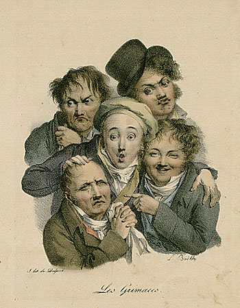
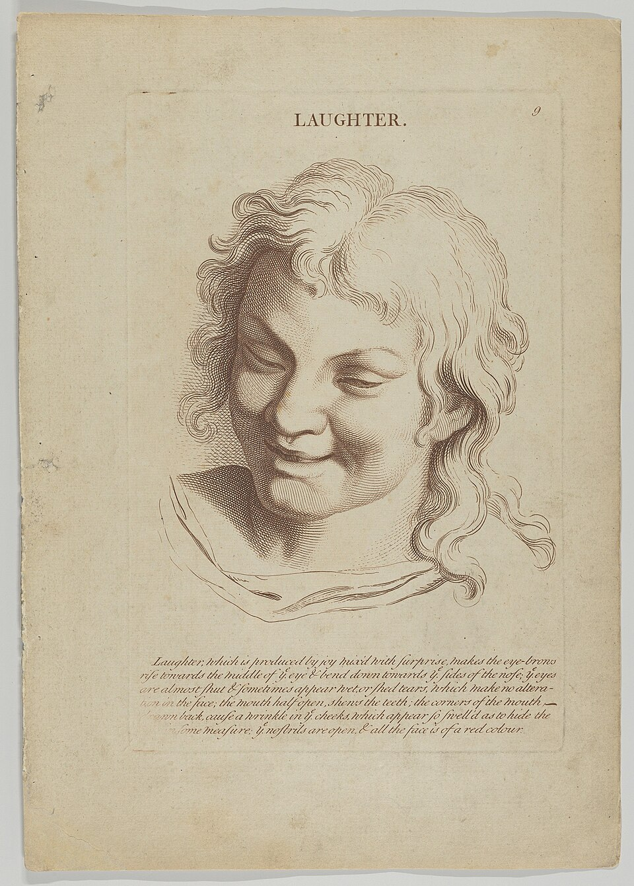

# Урок 51 — Shape Keys: мимика персонажа 😊😮😉

**Модуль 6 | 2 академических часа (1,5 часа)**

> 🔁 В начале урока — [повторение урока 50](повторение.md) (викторина по Rigify, 5–7 мин)

> 🎬 Наш персонаж ходит и машет — но лицо у него **каменное**. Сегодня оживим **лицо**: научим его **улыбаться, удивляться и моргать**. Для тонкой мимики кости неудобны — тут работает другой инструмент: **Shape Keys** (ключи формы) — «морфинг» между выражениями лица.

---

## Цель урока

- Понять, что такое **Shape Key** (ключ формы) и **морфинг**
- Понять, когда **кости**, а когда **Shape Keys** (крупное vs тонкое)
- Создать **Basis** и целевые формы: **улыбка**, **удивление**, **моргание**
- **Анимировать** мимику ключами на Value
- Повесить **Driver** на Shape Key (мимика «сама», повтор урока 44)

---

## Часть 1 — Теория: что такое Shape Keys (20 минут)

### 1.1. Одно лицо — много выражений

Лицо человека принимает десятки выражений — двигаются брови, веки, уголки рта:

*«Les Grimaces», Луи-Леопольд Буальи, 1823. [Wikimedia Commons, PD](https://commons.wikimedia.org/wiki/File:Louis_L%C3%A9opold_Boilly_-_Les_grimaces.jpg). Одна и та же «конструкция» лица — а выражения разные. Каждое выражение в 3D мы сохраним как **Shape Key**.*

А вот классический «разбор» одной эмоции — что именно двигается при **смехе**:

*«Laughter» (по рисунку Шарля Лебрена, XVII век). [The Met / Wikimedia, PD](https://commons.wikimedia.org/wiki/File:Laughter_(from_Heads_Representing_the_Various_Passions_of_the_Soul;_as_they_are_Expressed_in_the_Human_Countenance-_Drawn_by_that_Great_Master_Monsieur_Le_Brun)_MET_DP854026.jpg). При смехе: брови приподняты, глаза прищурены, уголки рта **вверх и назад**, щёки надуты. Именно эти **сдвиги вершин** мы и запишем в Shape Key «улыбка».*

### 1.2. Shape Key = «запомненная форма» ⚙️

**Shape Key (ключ формы)** — это **сохранённое положение всех вершин** меша. У объекта есть:
- **Basis** — базовая форма (нейтральное лицо);
- **целевые ключи** — «Улыбка», «Удивление», «Моргание» (то же лицо, но с передвинутыми вершинами).

У каждого ключа есть ползунок **Value (0…1)**:
- **0** — форма выключена (лицо нейтральное);
- **1** — форма включена полностью (полная улыбка);
- **0.5** — на полпути (полуулыбка!).

> 🧠 **Под капотом — морфинг:** Shape Key хранит для каждой вершины **сдвиг** «из Basis в цель». При Value 0.7 Blender сдвигает каждую вершину на **70% пути**. Поэтому переход **плавный**: между «серьёзным» и «улыбкой» существуют все промежуточные лица. Это называется **морфинг** — так в кино «превращают» одно лицо в другое.

### 1.3. Кости или Shape Keys — когда что?

| Задача | Инструмент | Почему |
|--------|-----------|--------|
| Руки, ноги, тело, повороты головы | **Кости** (уроки 46–50) | крупные движения «вокруг суставов» |
| Улыбка, брови, веки, щёки | **Shape Keys** | тонкие сдвиги сотен вершин — костями замучаешься |
| Челюсть (открыть рот) | часто **кость** | она и правда «на шарнире» |

> 💡 **Фишка — они дружат:** у профи лицо = кости (челюсть, глаза) **+** Shape Keys (улыбка, брови, веки). Rigify-риг лица так и устроен. Мы сделаем мимику ключами формы — это ядро приёма.

> 🔬 **Проверь сам (2 минуты):** куб → Object Data Properties (зелёный треугольник) → **Shape Keys → +** (появится Basis) → ещё **+** (Key 1) → выдели Key 1 → `Tab` → вытяни верхние вершины вверх → `Tab` обратно → двигай **Value** 0↔1 — куб плавно «вырастает» и «сдувается». Ты сделал морфинг!

---

## Часть 2 — Готовим лицо и симметрию (10 минут)

**Шаг 1. Открой персонажа и настрой вид.**
1. Открой человечка с лицом (Модуль 5). Выдели **меш** головы/тела (ЛКМ).
2. Встань **лицом к персонажу**: `Numpad 1` (вид спереди), при желании ортовид `Numpad 5`. Так удобно лепить симметричную мимику.
   ✅ *Должно получиться:* лицо персонажа смотрит прямо на тебя.

**Шаг 2. Создай базовый ключ (Basis).**
1. Справа открой **Object Data Properties** — иконка **зелёный перевёрнутый треугольник** (данные меша).
2. Найди раздел **Shape Keys** → нажми **`+`**.
   ✅ *Должно получиться:* в списке появился ключ **Basis** — это «нейтральное лицо», точка отсчёта.

> ⚠️ **Важно — Basis неприкосновенен:** все выражения строятся «от Basis». Испортишь Basis — «поедут» **все** ключи. Железное правило: сначала **`+`** для нового ключа, **потом** лепим (и только при **выделенном** этом ключе с **Value = 1**).

**Шаг 3. Включи симметрию X (лепим половину — вторая сама).**
1. `Tab` → **Edit Mode**. В **шапке** редактора (вверху справа) найди кнопки **Mesh Symmetry** — включи ось **X**.
   ✅ *Должно получиться:* теперь двигаешь вершину слева — **симметричная справа** повторяет. Улыбка и веки выйдут ровными без двойной работы. (Работает, если лицо симметрично и центр по оси X.)
2. `Tab` → Object Mode (пока).

---

## Часть 3 — Лепим выражения (30 минут)

> 🔁 **Общий порядок для КАЖДОГО выражения (запомни!):** `+` новый ключ → переименовать → **выделить его в списке** → поставить **Value = 1** → `Tab` (Edit Mode) → лепить → `Tab` (Object Mode) → проверить Value 0↔1.

### 3.1 Улыбка 😊

1. В Shape Keys нажми **`+`** → появился **Key 1** → **двойной клик** по имени → назови `Улыбка`.
2. Убедись: `Улыбка` **выделена** (подсвечена в списке), ползунок **Value = 1.000** (иначе не увидишь, что лепишь).
3. `Tab` → **Edit Mode**. Вверху слева включи **режим вершин** (клавиша **`1`**). Включи **Proportional Editing** — клавиша **`O`** (повтор урока 2!).
4. Выдели **вершины уголков рта** (по одной с каждой стороны; при Symmetry X хватит одной стороны). Нажми **`G`** → веди **вверх и чуть назад** → **колесом мыши** подбери радиус мягкости (чтобы тянулась щека, а не одна точка) → ЛКМ.
5. (Живее) Чуть приподними **вершины щёк** тем же `G` с Proportional.
6. `Tab` → Object Mode. Медленно потяни ползунок **Value** от 0 к 1.
   ✅ *Должно получиться:* лицо **плавно расплывается в улыбке** и возвращается к нейтрали. Первый морф! 🎉

> 💡 **Фишка — Proportional Editing здесь король:** мимика = «мягкие» сдвиги. Тянешь одну вершину — соседи едут по убыванию, кожа гнётся плавно. Без него лицо будет «мятым, гранёным». Радиус крути **колесом мыши прямо во время** движения.

### 3.2 Удивление 😮

1. Shape Keys → **`+`** → назови `Удивление` → **выдели** его → **Value = 1** → `Tab`.
2. Подними **надбровные вершины** вверх (`G` + Proportional) — брови «взлетели».
3. Собери **вершины губ в колечко «О»** и чуть вытяни вперёд (по `Y`).
4. Приоткрой **веки шире** (верхние — чуть вверх).
5. `Tab` → проверь **Value 0↔1**.
   ✅ *Должно получиться:* лицо «ахнуло» — брови вверх, рот колечком, глаза широкие.

### 3.3 Моргание 😉

1. Shape Keys → **`+`** → назови `Моргание` → **выдели** → **Value = 1** → `Tab`.
2. Выдели **вершины верхних век** → `G Z` вниз → опусти до **смыкания** с нижним веком (Symmetry X закроет оба глаза сразу).
3. `Tab` → **Value 0↔1**.
   ✅ *Должно получиться:* глаза **плавно закрываются и открываются**.

> 💡 **Фишка — ключи складываются:** включи `Улыбка = 1` **и** `Моргание = 1` — выйдет «жмурится от радости». Value смешиваются, как слои. Из 3–4 базовых ключей — десятки выражений (полный «пульт» — в лайфхаке).

> 📷 **[Вставь сюда картинку: три Shape Keys человечка (улыбка/удивление/моргание) →](изображения.md#shapes)**

---

## Часть 4 — Анимируем мимику (13 минут)

**Value** ключа — обычное числовое свойство. Значит, его можно **анимировать ключами** (`I`, урок 41). Разыграем сценку «удивился → обрадовался».

> Где ставить ключ: наведи курсор **прямо на ползунок Value** нужного ключа (в панели Shape Keys) и нажми **`I`** — поле станет **жёлтым** (ключ поставлен, как в уроке 41).

1. Current Frame = **1**. Все ключи `Value = 0` → наведи на **каждый** ползунок → **`I`** (зафиксировали нейтраль).
   ✅ жёлтые поля Value на кадре 1.
2. Current Frame = **15**. `Удивление → Value = 1`, наведи → **`I`**. (Персонаж что-то увидел!)
   ✅ на кадре 15 лицо удивлённое.
3. Current Frame = **35**. `Удивление → 0` (`I`) и `Улыбка → 1` (`I`). (Понял и обрадовался!)
   ✅ удивление плавно перешло в улыбку.
4. Current Frame = **45**: `Моргание → 1` (`I`); Current Frame = **48**: `Моргание → 0` (`I`). (Быстрый морг.)
5. Поставь **End = 60**, нажми **`Пробел`**.
   ✅ *Должно получиться:* персонаж **играет эмоцию** — удивился, расплылся в улыбке, моргнул. Настоящая актёрская сценка! 🎭

> 💡 **Фишка — моргание быстрое:** смыкание 2–4 кадра, размыкание 3–5. Медленный морг = «сонный». И моргай каждые 2–4 секунды, иначе взгляд «стеклянный».

---

## Часть 5 — Driver на Shape Key (12 минут)

Помнишь драйверы (урок 44)? **Value** ключа формы тоже можно **вычислять формулой** — и моргание заработает **само**, без ручных ключей.

**Авто-моргание синусом:**
1. Убери ручные ключи `Моргание` (если ставил в Части 4): наведи на ползунок → `Alt+I`.
2. **ПКМ по ползунку Value** ключа `Моргание` → в меню **Add Driver**.
3. В окошке драйвера: **Type = Scripted Expression** → в поле **Expression** впиши:
   `max(0, sin(frame * 0.35) ** 16)`
4. Закрой окошко, нажми **`Пробел`**.
   ✅ *Должно получиться:* персонаж **периодически моргает сам** (поле Value стало **сиреневым** — драйвер работает). Ни одного ключа!

> 💡 **Фишка — как читать формулу:** `sin(...)` качается −1…1; степень `** 16` «прижимает» волну почти к нулю и оставляет **короткие пики** (быстрое смыкание век); `max(0, …)` отрезает отрицательную часть. Итог — редкие быстрые «морги». Меняй `0.35` → частота моргания (больше — чаще).

> 🎯 **ЛАЙФХАК — показать здесь!** **Морфинг между формами** — как из пары ключей собрать целый «пульт эмоций», смешивать выражения и управлять ими с одного места (кость-слайдер) — в [лайфхак.md](лайфхак.md).

---

## Часть 6 — Итог и сохранение (5 минут)

- Проверь: Basis не тронут, 3 ключа работают, сценка играется, авто-моргание живёт.
- **Сохрани** (`Ctrl+S`) — мимика пригодится в итоговом ролике (урок 56).

> 💡 **Фишка — мимика оживляет сильнее всего:** зритель всегда смотрит в **лицо**. Персонаж с простой походкой, но живым лицом выглядит лучше, чем идеальная походка с каменным лицом. Пара Shape Keys — огромный вклад в «жизнь».

---

## Что мы узнали

- **Shape Key** — сохранённая форма меша; **Basis** + целевые ключи; **Value 0…1**.
- **Морфинг** — плавный переход: Blender сдвигает каждую вершину на долю пути.
- **Кости** — для крупного (тело), **Shape Keys** — для тонкого (мимика); вместе — риг лица.
- Ключи **смешиваются** (улыбка + моргание = жмурится от радости).
- Value **анимируется** ключами `I` (урок 41) и **драйвером** (урок 44: авто-моргание `sin`).
- Лепить мимику удобно с **Proportional Editing** (`O`).

**Дальше (урок 52):** **Particles** — волосы для персонажа 💇 и эффекты (дым, огонь, искры) ✨.

---

## Лайфхак урока

👉 [лайфхак.md](лайфхак.md) — **Морфинг между формами**: «пульт эмоций» из Shape Keys, смешивание и управление (показывается в Части 5)

## Практика

👉 [практика.md](практика.md) — самостоятельная работа: **оживший предмет с эмоциями** (смоделируй мультяшный предмет-персонажа: чашка/яблоко/тыква/будильник → лицо → Shape Keys → сценка эмоций)

---

## Навигация

⬅️ [Урок 50 — Rigify](../урок-50/урок.md)  ·  🔁 [Повторение](повторение.md)  ·  ➡️ [Урок 52 — Particles (волосы и эффекты)](../урок-52/урок.md)
