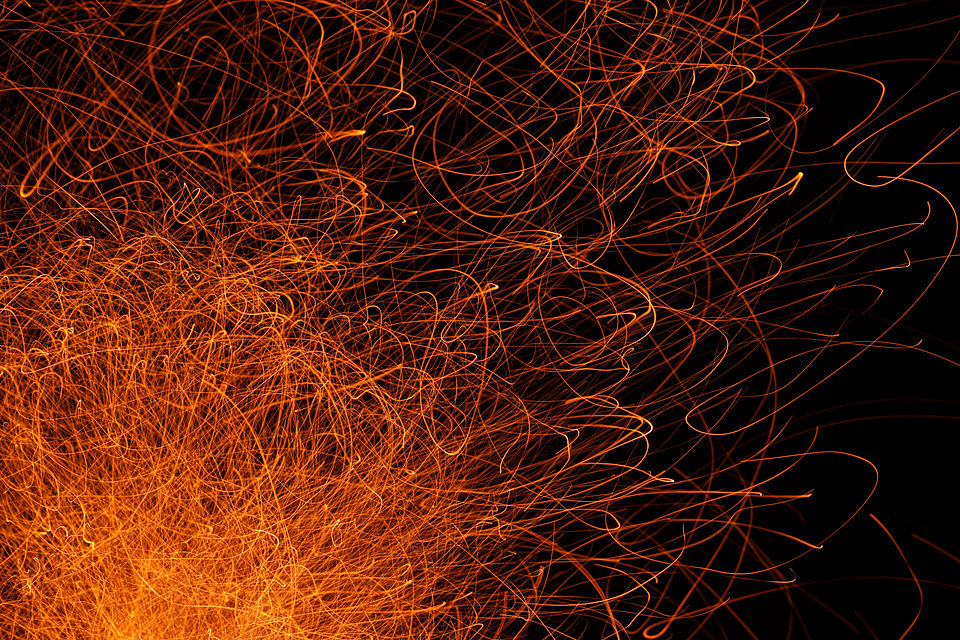
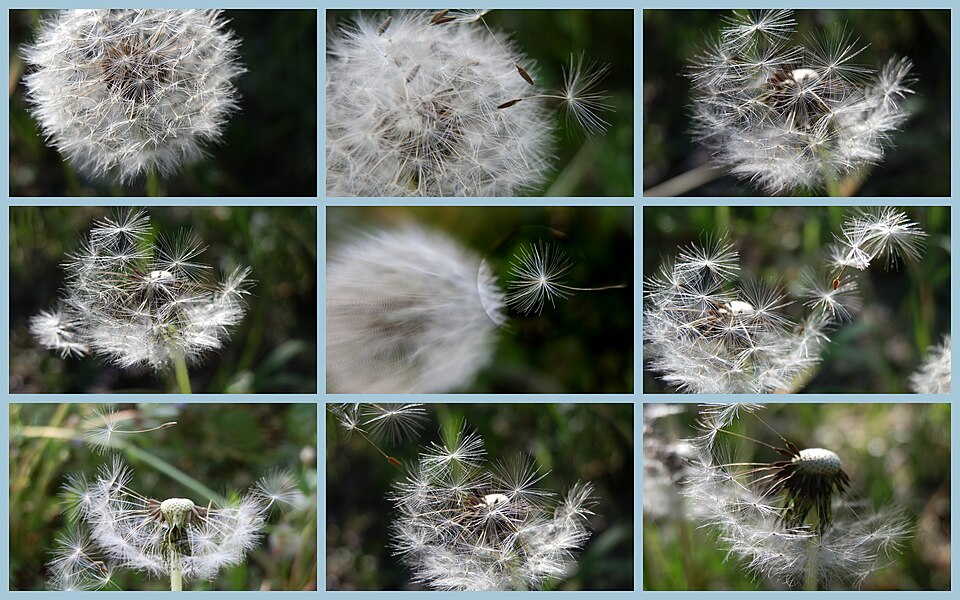

# Урок 52 — Particles: волосы и эффекты 💇✨

**Модуль 6 | 2 академических часа (1,5 часа)**

> 🔁 В начале урока — [повторение урока 51](повторение.md) (викторина по Shape Keys, 5–7 мин)

> 🎬 До сих пор мы двигали цельные объекты. А как сделать **тысячи мелких** — волосы, траву, искры, дым, волшебные блёстки? Вручную — невозможно. Для этого есть **система частиц (Particles)**: одна настройка рождает сотни частиц сразу. Сегодня дадим персонажу **причёску** и добавим **волшебные искры** ✨.

> 🖥 **ВАЖНО — слабые ПК:** частицы — самое «тяжёлое» в курсе. Держим количество **небольшим**, используем **Children** (дёшево) и **печём** симуляции. Все значения в уроке уже щадящие.

---

## Цель урока

- Понять **систему частиц** и её два типа: **Emitter** (летят и гибнут) и **Hair** (растут)
- Дать персонажу **волосы/шерсть** (Hair) и причесать их
- Сделать **эффект-эмиттер**: волшебные искры ✨ (скорость, гравитация, время жизни)
- Управлять частицами через **Force Fields** (ветер, вихрь)
- Узнать про **Quick Effects** — быстрый дым/огонь/мех в один клик

---

## Часть 1 — Теория: что такое частицы (20 минут)

### 1.1. Частицы = много мелкого из поверхности

**Система частиц** «рождает» из поверхности объекта **множество мелких частиц**. Ты задаёшь правила (сколько, куда летят, сколько живут) — Blender сам расставляет и двигает сотни штук.

Два типа частиц:

| Тип | Что делает | Примеры |
|-----|-----------|---------|
| **Emitter** (эмиттер) | частицы **рождаются, летят и гибнут** | искры, дым, дождь, снег, магия, брызги |
| **Hair** (волосы) | частицы — **неподвижные волоски**, «растут» из поверхности | волосы, шерсть, трава, шипы, перья |

### 1.2. Эмиттер — рождение, полёт, смерть 🔥

Частицы-эмиттеры ведут себя как **искры от костра**: вылетают из источника, летят вверх, гаснут:

*Искры костра. [Wikimedia Commons, CC BY-SA](https://commons.wikimedia.org/wiki/File:Campfire_and_sparks_in_Anttoora_3.jpg). Каждая искра **родилась** у огня, получила **скорость** вверх, летит по дуге (гравитация тянет вниз) и **гаснет**. Ровно так работает Emitter: Number (сколько), Velocity (скорость), Lifetime (сколько живёт).*

> 🧠 **Под капотом:** за кадры от **Start** до **End** система «выпускает» N частиц. Каждой даёт стартовую **скорость** (напр. вдоль нормали поверхности + чуть случайности), потом каждый кадр двигает её **физикой** (гравитация, Force Fields). Через **Lifetime** кадров частица **исчезает**. Меняешь эти числа — получаешь дождь, искры, фонтан, дым.

### 1.3. Force Fields — «ветер» для частиц 🌬️

Частицы можно **подталкивать** силовыми полями. Как ветер уносит **семена одуванчика**:

*Одуванчик на ветру. [Wikimedia Commons, CC BY-SA](https://commons.wikimedia.org/wiki/File:Dandelion_in_the_wind.jpg). Семена оторвались и **разлетаются потоком воздуха**. В Blender это **Force Field → Wind** (ровный поток) или **Turbulence** (хаотичные завихрения). Ими «дуют» на искры, дым, волосы.*

### 1.4. Hair — застывшие волоски

**Hair**-частицы не летают — это **волоски**, растущие из поверхности. Их можно **причесать** (режим Particle Edit) и размножить дёшево через **Children**. Так делают волосы, шерсть, траву (повтор разброса из Модуля 2, но «ворсом»).

> 🔬 **Проверь сам (1 мин):** плоскость → Particle Properties → **+** → Type **Hair** → плоскость «обросла» ворсом. Смени Type на **Emitter** → `Пробел` → частицы **посыпались** вниз (гравитация). Одна кнопка — два разных мира.

---

## Часть 2 — Волосы персонажа (Hair) (22 минуты)

> 🎯 **ЛАЙФХАК — показать здесь!** **Hair для волос, эмиттер для эффектов** — как выбрать тип и не «повесить» слабый ПК. Разбор — в [лайфхак.md](лайфхак.md).

**Шаг 1. Зона роста волос.**
1. Выдели голову персонажа. Чтобы волосы росли **только на макушке**, лучше задать **Vertex Group** (как веса, урок 46): в Edit Mode выдели вершины «шапочки» → Object Data → Vertex Groups → **+** `Волосы` → **Assign**.

**Шаг 2. Частицы Hair.**
1. Properties → **Particle Properties** (иконки-искорки) → **+** → Type = **Hair**.
2. Настрой (щадяще):
   - **Number = 300** (немного «направляющих» — остальное добавят Children).
   - **Hair Length = 0.1** (короткая стрижка; подбери под масштаб).
3. В разделе **Vertex Groups → Density** укажи группу `Волосы` — волосы вырастут только на макушке.
   ✅ *Должно получиться:* голова обросла торчащими волосками на макушке.

**Шаг 3. Причёсываем (Particle Edit).**
1. Смени режим (слева вверху) на **Particle Edit**. Инструмент **Comb** (расчёска) — приглаживай волосы по форме головы. Кисть **Length** — подрезать; **Puff** — приподнять у корней.
   ✅ *Должно получиться:* аккуратная причёска, а не «взрыв на макаронной фабрике».

**Шаг 4. Густота дёшево — Children.**
1. Object Mode → в Particle Properties → раздел **Children → Interpolated**. **Amount = 10–20**.
   ✅ *Должно получиться:* из 300 «направляющих» стало густо — но считается **легко** (Children почти бесплатны для ПК).

**Шаг 5. Цвет волос.**
1. Дай волосам материал (отдельный слот): коричневый/чёрный. В разделе Render галочка на использование материала.
   ✅ *Должно получиться:* причёска нужного цвета.

> 💡 **Фишка — слабый ПК:** мало **Number** (направляющих) + много **Children** = густо и легко. Никогда не гони Number в тысячи — ПК «ляжет». 300 + Children 20 хватает.

> 📷 **[Вставь сюда картинку: персонаж с причёской (Hair + Children) →](изображения.md#hair)**

---

## Часть 3 — Волшебные искры (Emitter) — подробно (22 минуты)

Сделаем **магические блёстки**, летящие из руки/посоха ✨. Разберём каждый шаг.

**Шаг 1. Источник искр.**
1. `Shift+A → Mesh → Icosphere`, уменьши до маленькой (`S 0.1`), поставь у ладони/на кончик посоха. Назови `Источник-искр`.
   ✅ *Должно получиться:* маленький шарик там, откуда полетят искры (при рендере его спрячем — искры важнее самого шарика).

**Шаг 2. Добавляем систему частиц.**
1. Выдели `Источник-искр`. Справа в Properties найди вкладку **Particle Properties** — иконка похожа на **несколько точек-искорок** (под вкладкой Physics).
2. Нажми **+** (New) → в списке появилась система → в самом верху **Type** переключи на **Emitter**.
   ✅ *Должно получиться:* нажми `Пробел` — из шарика вниз **посыпались частицы** (пока падают от гравитации).

**Шаг 3. Сколько, когда, как долго (раздел Emission).**
1. Разверни раздел **Emission**:
   - **Number = 200** (сколько всего искр — щадяще для ПК).
   - **Frame Start = 1**, **End = 60** (в какие кадры «выпускаются»).
   - **Lifetime = 40** (сколько кадров живёт каждая искра до исчезновения).
   - **Lifetime Randomness = 0.5** (одни гаснут раньше, другие позже — живее).
   ✅ *Должно получиться:* поток искр идёт с 1 по 60 кадр, каждая живёт ~40 кадров.

**Шаг 4. Куда летят (раздел Velocity).**
1. Разверни **Velocity**:
   - **Normal = 2** (искры вылетают **от поверхности** источника во все стороны).
   - **Randomize = 0.5** (разброс направлений — «фонтанчик», а не струя).
   ✅ *Должно получиться:* искры **брызжут** из шарика веером.

**Шаг 5. Чтобы взлетали, а не падали (Field Weights).**
1. Разверни раздел **Field Weights** → **Gravity = 0.15** (почти выключили земное притяжение — магия «парит»).
   ✅ *Должно получиться:* искры взлетают и **медленно оседают**, а не камнем падают.

**Шаг 6. Как искры ВЫГЛЯДЯТ (раздел Render) — тут появляется магия.**
1. Разверни раздел **Render** → **Render As**:
   - Простой путь (легко для ПК): **Halo** — светящиеся точки.
   - Красивый путь: **Object** → ниже в **Instance Object** выбери маленькую **звёздочку/иглу** (сделай заранее: `Shift+A → Mesh → Icosphere` крошечная, или звезда из Extra Objects).
2. **Scale = 0.03**, **Scale Randomness = 0.5** (искры разного размера).
3. **Материал свечения:** дай объекту-искре (или источнику при Halo) материал **Emission** (Shading, урок 18): цвет голубой/золотой, **Strength = 5**.
4. Включи **Bloom** (EEVEE: Render Properties → Bloom) — вокруг искр появится **ореол-сияние**.
   ✅ *Должно получиться:* из руки летят **светящиеся волшебные искры** ✨ (переключи вьюпорт в **Rendered**, чтобы видеть свечение).

**Шаг 7. Ветер закручивает искры (Force Field).**
1. `Shift+A → Force Field → **Turbulence**` (хаотичные завихрения) рядом с источником. Или **Wind** (ровный поток в одну сторону).
2. В свойствах поля покрути **Strength = 2–4**, **Flow**.
   ✅ *Должно получиться:* искры **завихряются и уносятся**, как семена одуванчика на ветру. 🌬️

> 💡 **Фишка — «включить/выключить» поток:** хочешь, чтобы магия появлялась по команде? Анимируй **Number** или подвинь источник ключами (урок 41): нет источника в кадре — нет искр.

> 💡 **Фишка — печём (Bake) обязательно:** чтобы искры не пересчитывались каждый раз (и не тормозили) — раздел **Cache → Bake**. Посчитал один раз → играется мгновенно. На слабых ПК — всегда.

> 📷 **[Вставь сюда картинку: волшебные искры из руки (Emitter + Emission + Turbulence) →](изображения.md#sparks)**

---

## Часть 4 — Огонь, дым и мех (Quick Effects) — подробно (22 минуты)

Самое зрелищное! Blender умеет **симулировать огонь и дым** и **обрастать мехом** — и почти всё делают **готовые пресеты** `Object → Quick Effects`. Разберём по шагам.

> 🖥 **ВНИМАНИЕ — дым и огонь ТЯЖЁЛЫЕ:** это объёмная симуляция. На слабых ПК держим **низкое разрешение** и **обязательно печём (Bake)**; часто это показывает **учитель на своём ПК** как демо. Мех тоже держим щадящим (Density поменьше).

### 4.1 Дым 💨 (Quick Smoke)

**Шаг 1. Источник дыма.**
1. Возьми объект, из которого пойдёт дым (например, цилиндр-«труба» или полено-куб). Выдели его.

**Шаг 2. Одна кнопка.**
1. `Object → Quick Effects → **Quick Smoke**`.
   ✅ *Должно получиться:* вокруг объекта появился **большой куб — Domain** (область, внутри которой живёт дым). Сам объект стал **Flow** (источником).

**Шаг 3. Смотрим дым.**
1. Переключи вьюпорт в **Material Preview** или **Rendered** (шарики справа вверху) → нажми **`Пробел`**.
   ✅ *Должно получиться:* из объекта **поднимается дым**, заполняя куб.

**Шаг 4. Настройка под слабый ПК (Domain).**
1. Выдели **Domain** (большой куб) → **Physics Properties** → раздел **Fluid → Settings** → **Resolution Divisions = 32** (чем меньше — тем грубее дым, но легче ПК; 32 — щадяще).
   ✅ *Должно получиться:* дым «кубическее», зато считается быстро.

**Шаг 5. Печём (Bake) — обязательно.**
1. Выдели **Domain** → Physics → Fluid → раздел **Cache** → **Bake Data** (или Bake All). Подожди, пока посчитает.
   ✅ *Должно получиться:* дым **проигрывается мгновенно** (не пересчитывается каждый раз). 💨

### 4.2 Огонь 🔥 (тот же Domain, меняем тип)

**Шаг 1. Переключаем источник на огонь.**
1. Выдели **объект-источник** (Flow, не Domain!) → **Physics Properties** → **Fluid → Settings** → **Flow Type** — смени с `Smoke` на **`Fire + Smoke`**.

**Шаг 2. Пере-печём.**
1. Выдели **Domain** → Physics → Fluid → **Cache** → сначала **Free** (сбросить старый расчёт), затем **Bake Data** снова.
   ✅ *Должно получиться:* из источника **поднимается огонь с дымом** — пламя светится снизу, дым идёт выше.

**Шаг 3. Красивее (по желанию).**
1. В EEVEE огонь **сам светится** (Quick Smoke создал объёмный материал, где пламя даёт свечение). Включи **Bloom** — пламя «горит» ярче.
   ✅ *Должно получиться:* живой костёр/факел. 🔥

> 💡 **Фишка — что где:** **Flow** (источник) решает, ЧТО испускать (дым / огонь / огонь+дым). **Domain** (куб) решает, ГДЕ это живёт и в каком **разрешении**. Печём всегда **Domain**.

### 4.3 Мех 🧸 (Quick Fur)

**Шаг 1. Одна кнопка.**
1. Выдели объект-«зверька» (например, сфера или твоё животное) → `Object → Quick Effects → **Quick Fur**`.
   ✅ *Должно получиться:* объект **оброс мехом**.

**Шаг 2. Настрой длину и густоту (сразу после — панель F9).**
1. Слева внизу нажми панель **«Quick Fur»** (или `F9`) → покрути **Fur Length** (длина) и **Density** (густота — держи **умеренной** для слабого ПК).
   ✅ *Должно получиться:* мех нужной длины и густоты.

**Шаг 3. Причесать и покрасить.**
1. Пригладить мех можно кистью **Comb** в режиме правки волос (как причёску в Части 2). Дай материал-цвет.
   ✅ *Должно получиться:* аккуратный пушистый зверёк.

> 💡 **Фишка — Quick Effects = быстрый старт:** пресет собирает всё сам (Domain, материалы, настройки), а ты потом крутишь пару значений. Отличный способ понять, «из чего собран» сложный эффект, не строя его с нуля.

> 📷 **[Вставь сюда картинку: огонь/дым (Quick Smoke) и пушистый зверёк (Quick Fur) →](изображения.md#fire)**

---

## Часть 5 — Итог и сохранение (7 минут)

- Проверь: причёска причёсана, искры летят и сдуваются ветром, (демо) дым идёт.
- **Bake** частицы, чтобы не тормозило. **Сохрани** (`Ctrl+S`).

> 💡 **Фишка — мера решает:** эффекты «дорого выглядят», но легко перегрузить сцену. Правило: **минимум частиц, максимум Children и Bake**. Красиво ≠ миллион частиц.

---

## Что мы узнали

- **Частицы** рождают много мелкого из поверхности; два типа: **Emitter** (летят/гибнут) и **Hair** (растут).
- **Hair**: Number (направляющие) + **Children** (густо и дёшево) + Particle Edit (причесать) + Vertex Group (где растут).
- **Emitter** (искры/магия): Number/Lifetime/Velocity + физика (Gravity, **Force Fields** — ветер/вихрь) + Render As Object с **Emission** + Bloom.
- **Огонь/дым** (Quick Smoke): **Flow** (источник — что испускать: дым / огонь+дым) + **Domain** (куб — где, разрешение) + **Bake**.
- **Мех** (Quick Fur): кнопкой, потом Length/Density (щадяще) + причесать.
- **Quick Effects** — готовые пресеты сложных эффектов; **Bake** — посчитать один раз.
- 🖥 Слабые ПК: мало Number, много Children, обязательно Bake.

**Дальше (урок 53):** **Rigid Body** — физика твёрдых тел: башня из кубиков рушится, домино падает, шар-разрушитель! 🧱

---

## Лайфхак урока

👉 [лайфхак.md](лайфхак.md) — **Hair для волос, эмиттер для эффектов**: как выбрать тип и не повесить слабый ПК (показывается в Части 2)

## Практика

👉 [практика.md](практика.md) — самостоятельная работа: **смоделируй костёр / факел / волшебный посох** и дай ему эффекты (искры/магия эмиттером + ветер) — моделирование + частицы

---

## Навигация

⬅️ [Урок 51 — Shape Keys](../урок-51/урок.md)  ·  🔁 [Повторение](повторение.md)  ·  ➡️ [Урок 53 — Rigid Body (физика)](../урок-53/урок.md)
