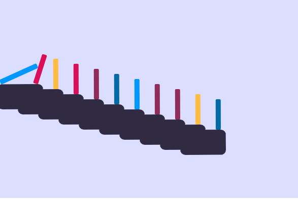
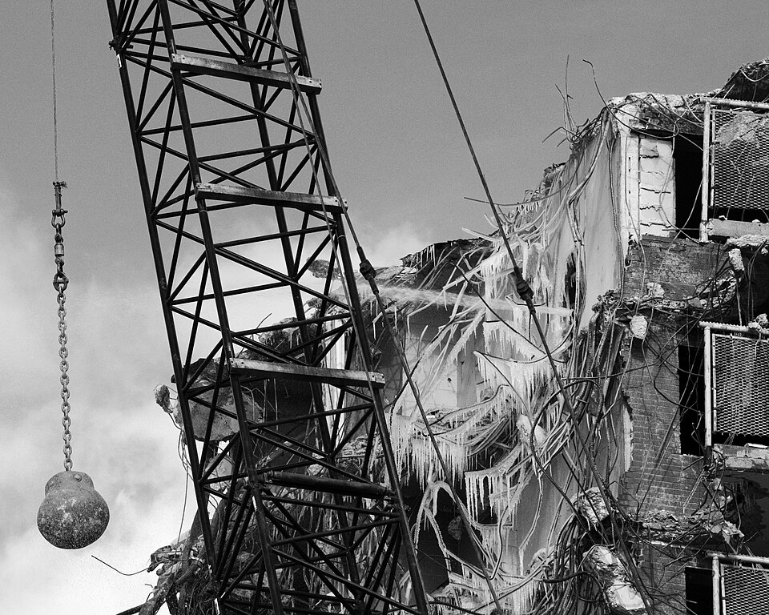

# Урок 53 — Rigid Body: физика твёрдых тел 🧱💥

**Модуль 6 | 2 академических часа (1,5 часа)**

> 🔁 В начале урока — [повторение урока 52](повторение.md) (викторина по частицам, 5–7 мин)

> 🎬 До сих пор мы двигали объекты **вручную** — ключами. А что если Blender сам посчитает, как **падают, сталкиваются и рушатся** предметы, по законам физики? Сегодня уроним **башню из кубиков**, выстроим **домино** и разнесём стену **шаром-разрушителем** 💥. И всё это — **без единого ключа**, физика сама.

---

## Цель урока

- Понять **Rigid Body** (физику твёрдых тел) и типы **Active / Passive**
- Разобрать свойства: **Mass**, **Friction**, **Bounciness**, **Collision Shape**
- Уронить **башню из кубиков** и выстроить **домино**
- Сделать **шар-разрушитель** (анимированное тело ломает стену)
- Понять **Rigid Body World** и **Bake** (запечь симуляцию)

---

## Часть 1 — Теория: как работает физика (18 минут)

### 1.1. Rigid Body = «настоящая» физика падения

**Rigid Body (твёрдое тело)** — это симуляция: Blender сам считает, как объект **падает** (гравитация), **сталкивается** и **отскакивает**. «Rigid» = твёрдый: тело не мнётся, а именно **бьётся и катится** (в отличие от мягкой ткани — урок 54). Ты не ставишь ключей — только задаёшь **правила**, а движок считает движение.

Классика — **эффект домино**: толкнул первую костяшку, и по цепочке падают все:

*Эффект домино. [Wikimedia Commons, CC BY-SA](https://commons.wikimedia.org/wiki/File:Domino_effect_008.gif). Ты толкаешь только **одну** костяшку — дальше физика делает всё сама: столкновение → падение → толчок следующей. В Blender так же: задал правила, нажал Play — и цепная реакция посчиталась.*

### 1.2. Два типа: Active и Passive

| Тип | Что делает | Примеры |
|-----|-----------|---------|
| **Active** (активное) | **участвует** в физике: падает, катится, сталкивается | кубики башни, костяшки домино, шар |
| **Passive** (пассивное) | стоит на месте, но об него **бьются** | пол, стены, земля, стол |

> 🧠 **Под капотом:** физический движок (**Bullet**) разбивает секунду на много крошечных шажков. На каждом шаге он: тянет **Active**-тела вниз гравитацией; проверяет, не **пересеклись** ли два тела; если да — **отталкивает** их врозь (тем сильнее, чем больше масса и скорость); **Passive** не двигается, но **останавливает** Active. Сотни таких проверок в секунду и складываются в реалистичное падение, качение и разлёт. Именно поэтому важно, чтобы тела стояли **точно** (без пересечений) — иначе на первом же шаге движок их «выстрелит».

### 1.3. Свойства тела (где искать)

Все настройки физики — во вкладке **Physics Properties** (иконка **синий «отскакивающий шарик»**, в правой колонке Properties), в разделе **Rigid Body** (появляется после добавления физики):

| Свойство | Раздел | Что задаёт |
|----------|--------|-----------|
| **Type** (Active/Passive) | Settings | участвует в физике или только стоит |
| **Mass** (масса) | Settings | тяжёлое давит лёгкое (шар-разрушитель тяжелее кубиков) |
| **Animated** | Settings | тело едет по ключам, но толкает физику (шар-разрушитель) |
| **Collision Shape** | Collisions | **Box** (кубики), **Sphere** (шар), Convex Hull, Mesh (точно, но дорого) |
| **Friction** (трение) | Surface Response | скользкое (лёд) ↔ цепкое (резина) |
| **Bounciness** (упругость) | Surface Response | мячик прыгает (высокая) ↔ мешок с песком (0) |

> 💡 **Фишка — Collision Shape решает скорость и стабильность:** для кубиков/домино бери **Box**, для шара — **Sphere**. Это **дёшево** и не «дёргается». **Mesh** (точная форма) — тяжело и нестабильно; на слабых ПК не нужен.

### 1.4. Rigid Body World и Bake

Как только ты дал первому объекту физику, Blender создал **Rigid Body World** — «контейнер всей физики сцены» (**Scene Properties** → раздел **Rigid Body World**). Симуляция **пересчитывается** при каждом Play (и может выходить чуть иначе). Чтобы не тормозило и результат «застыл» — симуляцию **пекут (Bake)**: посчитал один раз → играется мгновенно и одинаково.

> 🔬 **Проверь сам (1 мин):** плоскость + куб над ней. Кубу: Physics Properties → **Rigid Body** → Type **Active**. Плоскости: **Rigid Body** → Type **Passive**. Нажми `Пробел` — **куб падает и лежит** на плоскости. Ни одного ключа — физика посчитала сама!

> 🔬 **Проверь сам-2 (упругость):** тому же кубу подними **Bounciness** до **0.9** → `Пробел` → куб **скачет как мячик**. Верни 0.3 — «шлёпается» и лежит. Одно число меняет «характер» материала.

---

## Часть 2 — Первая физика: кубик падает (10 минут)

Соберём простейшую сцену «куб падает на пол» — на ней поймём Active/Passive.

**Шаг 1. Пол (Passive).**
1. Новый файл, удали стартовый куб (`X`). `Shift+A → Mesh → Plane` → увеличь: **`S 10 Enter`** (большая «земля»).
2. Плоскость выделена. В **верхнем меню вьюпорта** нажми **Object → Rigid Body → Add Passive**.
   *(То же самое: справа Physics Properties (синий шарик) → кнопка **Rigid Body** → в разделе Settings поставь Type = **Passive**.)*
   ✅ *Должно получиться:* пол — «твёрдая земля»: сам не двигается, но об него будут биться предметы.

**Шаг 2. Кубик (Active).**
1. `Shift+A → Mesh → Cube` → подними: **`G Z 5 Enter`** → наклони, чтобы упал интереснее: **`R X 20 Enter`**.
2. В верхнем меню: **Object → Rigid Body → Add Active**.
3. Открой **Physics Properties** → раздел **Rigid Body**:
   - **Settings → Mass = 1**.
   - **Collisions → Shape = Box**.
   - **Surface Response → Bounciness = 0.3**.
   ✅ *Должно получиться:* нажми **`Пробел`** — кубик **падает, ударяется о пол и слегка подпрыгивает**. Без единого ключа! Останови (`Пробел`), вернись на кадр 1 (`⏮`).

> 💡 **Фишка — где живут настройки:** тип (Active/Passive), Mass, Animated — в **Settings**; форма — в **Collisions**; трение/упругость — в **Surface Response**. Всё внутри **Physics Properties → Rigid Body**.

---

## Часть 3 — Башня из кубиков (18 минут)

Построим башню и красиво уроним её шаром.

**Шаг 1. Строим башню (точно!).**
1. Выдели кубик из Части 2 (Active). Сделай его небольшим: **`S 0.5 Enter`** (теперь ребро ≈ 1 м).
2. Опусти его на пол: **`G Z 0.5 Enter`** (низ кубика ровно на Z=0).
3. Ставь копии **точно друг на друга**: **`Shift+D → Z → 1 → Enter`** (дубликат ровно на высоту кубика вверх). Повтори **6–8 раз** (`Shift+R` повторяет последнее действие!).
   ✅ *Должно получиться:* аккуратный столбик из 7–9 кубиков **без зазоров и пересечений** (это важно для стабильной физики).

> 💡 **Фишка — почему точно:** если кубики чуть пересекаются или висят с зазором — на первом шаге симуляции движок их «оттолкнёт», башня задрожит и рассыплется сама. Числовой ввод (`Z 1`) гарантирует идеальную стопку.

**Шаг 2. Раздаём физику всем разом (Copy from Active).**
1. Выдели **все кубики** башни (рамкой `B` или `A`, если в сцене только они и пол — пол не выделяй).
2. `Shift`-клик по кубику, у которого физика **уже настроена** — он станет **активным** (светлее контур).
3. Верхнее меню: **Object → Rigid Body → Copy from Active**.
   ✅ *Должно получиться:* у **всех** кубиков появилась физика (Active, Box) — как у образца.

**Шаг 3. Шар-таран по горке.**
Чтобы шар сам вкатился в башню — сделаем ему горку (чистая физика, без ключей).
1. **Горка:** `Shift+A → Mesh → Plane` → `S 3` → наклони `R Y 30` → подвинь так, чтобы её низ упирался в основание башни, а верх был приподнят сбоку. Дай ей **Rigid Body → Add Passive** (горка твёрдая, но неподвижная).
2. **Шар:** `Shift+A → UV Sphere` → положи на **верх горки**. Дай **Rigid Body → Add Active**, в Physics: **Mass = 5** (тяжёлый), **Collisions → Shape = Sphere**.
3. **`Пробел`**.
   ✅ *Должно получиться:* шар **скатывается по горке**, влетает в башню — и она **разлетается**! 🧱💥 (не понравилось — подвинь шар/горку и запусти снова.)

---

## Часть 4 — Домино (15 минут)

**Шаг 1. Одна костяшка (точные пропорции).**
1. `Shift+A → Mesh → Cube`. Сделай её плоской и высокой: **`S X 0.4 Enter`**, затем **`S Y 0.1 Enter`** (тонкая), затем **`S Z 0.8 Enter`** (высота ≈ 1.6 м).
2. Поставь на пол: **`G Z 0.8 Enter`** (низ на Z=0).
   ✅ *Должно получиться:* тонкая высокая плашка-костяшка стоит на полу.

**Шаг 2. Ряд костяшек (шаг < высоты!).**
1. Дублируй с **шагом меньше высоты**: **`Shift+D → X → 0.9 → Enter`** (высота 1.6 — шаг 0.9, падающая точно достанет соседа).
2. Повтори **`Shift+R`** 8–14 раз. Можно вести дугой (после дубля добавляй лёгкий `R Z`).
   ✅ *Должно получиться:* дорожка из 9–15 костяшек с равным шагом.

**Шаг 3. Физика всем (Copy from Active).**
1. Первой костяшке дай **Rigid Body → Add Active**, **Shape = Box**.
2. Выдели все костяшки → активной сделай настроенную → **Object → Rigid Body → Copy from Active**.
   ✅ *Должно получиться:* все костяшки — физические (Active, Box).

**Шаг 4. Толкаем первую.**
1. `Shift+A → UV Sphere` → `S 0.3` → помести **над первой костяшкой и чуть сбоку** (со стороны, куда должна падать цепочка). Дай **Rigid Body → Add Active**, Shape **Sphere**.
2. **`Пробел`**.
   ✅ *Должно получиться:* шарик падает, толкает первую костяшку → она вторую → **волна домино** бежит до конца! 🁢

> 💡 **Фишка — цепочка встала после первой:** шаг между костяшками **больше их высоты** — падающая не достаёт следующую. Сдвинь костяшки ближе (шаг < высоты) и запусти снова.

---

## Часть 5 — Шар-разрушитель (15 минут)

Как настоящий **шар-разрушитель** сносит здание:

*Шар-разрушитель. [Wikimedia Commons, PD](https://commons.wikimedia.org/wiki/File:Wrecking_ball.jpg). Тяжёлый шар на цепи **раскачивается** и с размаху бьёт по стене — она рушится. Соберём такое в Blender.*

**Шаг 1. Стена из блоков.**
1. Возьми маленький кубик (Active, как в Части 3). Построй из копий **стену**: несколько рядов в ширину и высоту (напр. **5 в ширину × 4 в высоту = 20 блоков**), укладывая точно (`Shift+D` по X на ширину блока; новый ряд — по Z на высоту). Кладку можно «в кирпич» (смещая ряды на полблока).
2. Выдели все блоки → **Copy from Active** (Active, Box). Пол — **Passive** (если ещё нет).
   ✅ *Должно получиться:* ровная стена из физических блоков на твёрдом полу.

**Шаг 2. Тяжёлый шар.**
1. `Shift+A → UV Sphere` → `S 1.5` (крупный) → поставь **сбоку и повыше** стены (замах).
2. **Rigid Body → Add Active**: **Mass = 20** (очень тяжёлый!), **Shape = Sphere**.
   ✅ *Должно получиться:* большой шар в стороне от стены.

**Шаг 3. Анимируем размах (ключи, урок 41).**
1. Current Frame = **1**. Шар в отведённой позиции (вбок-вверх). Наведи курсор на вьюпорт → **`I` → Location** (ключ старта).
2. Current Frame = **12**. Передвинь шар **в стену** (`G` — вжать в блоки). → **`I` → Location** (ключ удара).
   ✅ *Должно получиться:* при перемотке 1→12 шар «влетает» в стену (пока просто проходит сквозь — сейчас исправим).

**Шаг 4. Волшебная галочка Animated.**
1. Выдели **шар** → Physics Properties → Rigid Body → **Settings** → включи **✅ Animated**.
2. **`Пробел`**.
   ✅ *Должно получиться:* шар по твоим ключам влетает в стену — и **блоки разлетаются** от удара! 💥

> 💡 **Фишка — Animated = «мостик» между ключами и физикой:** галочка **Animated** говорит движку: «двигай это тело по **моим ключам**, но пусть оно **толкает** физические тела вокруг». Так ты **режиссируешь** удар (куда и когда бьёт шар), а разлёт блоков честно считает физика.

> 📷 **[Вставь сюда картинку: шар-разрушитель ломает стену из блоков →](изображения.md#wreck)**

---

## Часть 6 — Bake (запекаем) и итог (9 минут)

Сейчас симуляция пересчитывается при каждом Play. Запечём её — станет мгновенной и стабильной.

**Шаг 1. Зададим длину симуляции.**
1. **Scene Properties** (иконка-конус+шар) → раздел **Rigid Body World** → **Cache** → поставь **Simulation Start = 1**, **End = 120** (или под длину эффекта).
   ✅ *Должно получиться:* физика будет считаться на кадрах 1–120.

**Шаг 2. Печём.**
1. Способ А (просто): **Object → Rigid Body → Bake To Keyframes** — превратит физику в **обычные ключи** (можно потом править вручную, и не зависит от симуляции).
2. Способ Б (весь мир): Scene → Rigid Body World → Cache → **Bake** — запечёт расчёт в кэш.
   ✅ *Должно получиться:* нажми `Пробел` — разрушение **проигрывается мгновенно**, не пересчитывается.

- **Сохрани** (`Ctrl+S`). Разрушения пойдут в итоговый ролик (урок 56)!

> 🎯 **ЛАЙФХАК — показать здесь!** **Rigid Body World + Bake** — где живёт симуляция, как задать длину, **замедлить (Speed 0.3 — слоу-мо)** и «застыть» результат. Разбор — в [лайфхак.md](лайфхак.md).

> 💡 **Фишка — слабый ПК:** держи **Box/Sphere**-формы (не Mesh), число тел умеренным (20–40), и **обязательно Bake**. Тогда даже слабая машина потянет разрушение.

---

## Что мы узнали

- **Rigid Body** — физика твёрдых тел: падение, столкновения, отскок — **без ключей**.
- **Active** (участвует) vs **Passive** (пол/стены, стоит но сталкивается).
- Свойства: **Mass** (тяжесть), **Friction** (трение), **Bounciness** (упругость), **Collision Shape** (Box/Sphere — дёшево).
- **Copy from Active** — раздать физику на много объектов разом.
- **Animated** — анимированное тело толкает физические (шар-разрушитель).
- **Rigid Body World + Bake** — где живёт симуляция и как её «запечь».

**Дальше (урок 54):** **Cloth** — симуляция **ткани**: плащ и флаг персонажа развеваются на ветру! 🦸

---

## Лайфхак урока

👉 [лайфхак.md](лайфхак.md) — **Rigid Body World + Bake**: длина симуляции и запекание для плавного показа (показывается в Части 6)

## Практика

👉 [практика.md](практика.md) — самостоятельная работа: **боулинг или крепость на снос** (смоделируй кегли+шар / крепость из блоков → урони физикой) — моделирование + Rigid Body

---

## Навигация

⬅️ [Урок 52 — Particles](../урок-52/урок.md)  ·  🔁 [Повторение](повторение.md)  ·  ➡️ [Урок 54 — Cloth (ткань)](../урок-54/урок.md)
