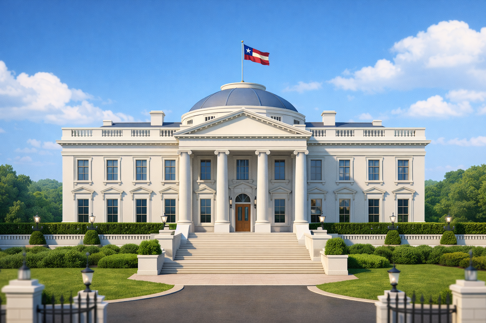
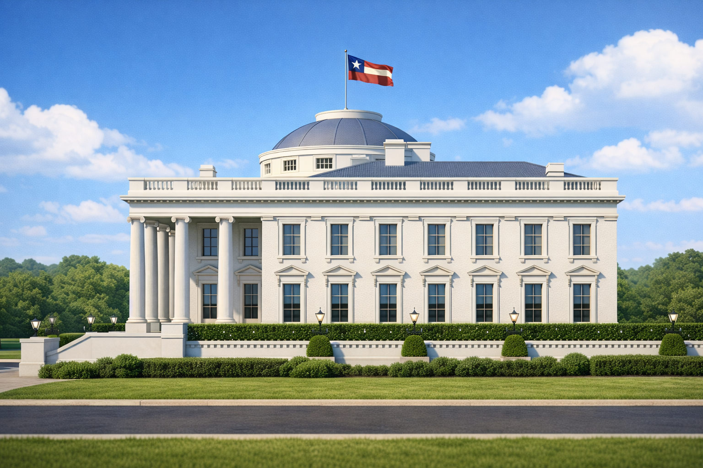
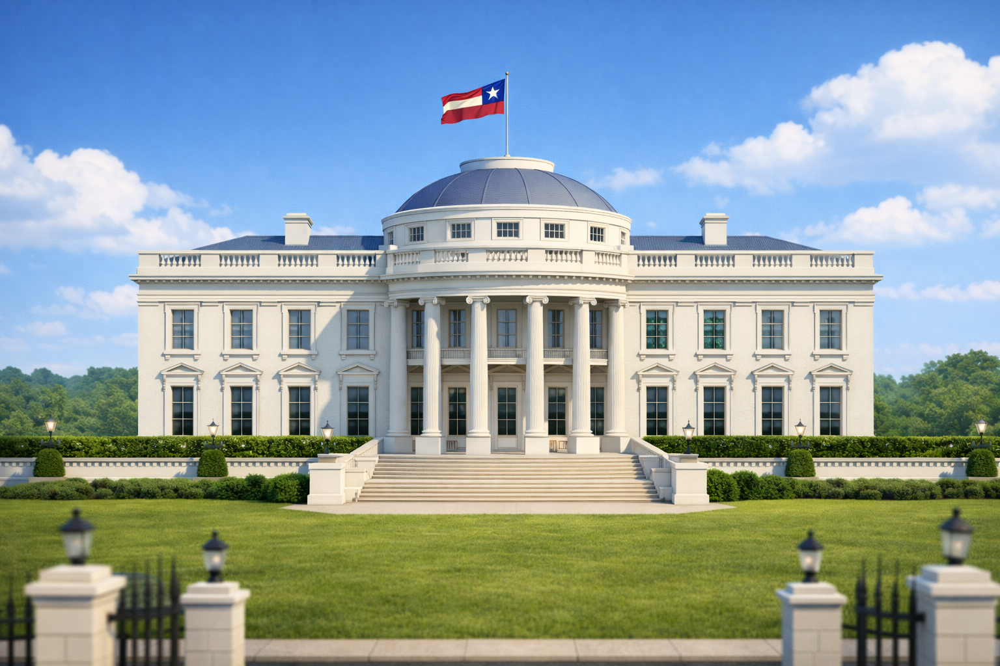
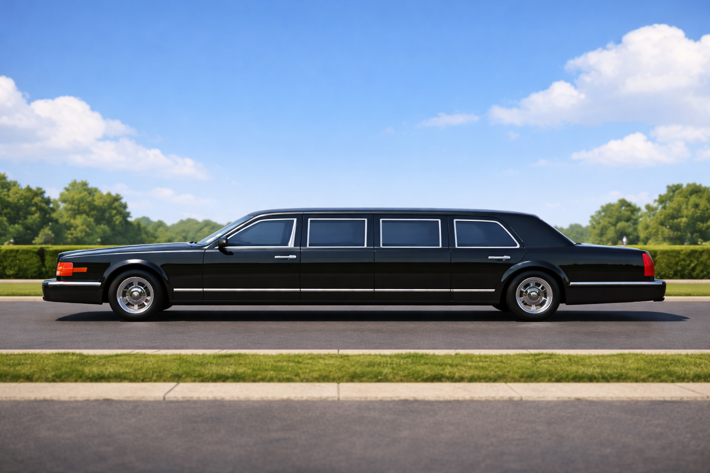
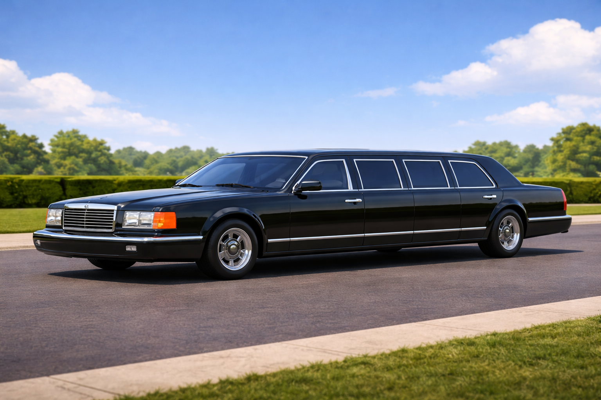

# Самостоятельная работа — Урок 54: Резиденция президента 🏛️🚙🚩

> 🧑‍🎓 Большой **закрепляющий проект** (на несколько занятий / с домашней работой). Ты соберёшь **резиденцию президента**, поднимешь над ней **развевающийся флаг** (ткань этого урока!) и снимешь **анимацию**: к воротам подъезжает **лимузин**, **ворота открываются** — и он въезжает. Здесь повторяется **весь курс**: моделирование, материалы, ткань, анимация, драйверы, камера.

*Цель: белая резиденция с колоннами, куполом и **флагом** на крыше; впереди — **ворота** и подъездная дорога, по которой приедет лимузин.*

---

## Референсы (модель по ним, «со всех ракурсов»)

| Резиденция сбоку | Резиденция сзади |
|------------------|------------------|
|  |  |

| Лимузин сбоку | Лимузин под углом |
|---------------|-------------------|
|  |  |

> 💡 **Модель по референсу:** вставь картинку в сцену как фон — аддон **Import Images as Planes** (урок 1) — и моделируй поверх. Держи **low-poly**: сложное здание собирается из простых форм.

---

## Этап 1 — Резиденция (моделирование, Модули 1–2)

Разбери здание на простые формы:
- **Основной корпус** — вытянутый **Cube** (+ **Bevel** углов).
- **Колонны** — **Cylinder** → **Array** (ряд одинаковых, урок 3).
- **Купол** — половина **UV Sphere** (`S`, удалить низ).
- **Портик/фронтон** (треугольник над колоннами) — призма из куба.
- **Окна** — **Inset + Extrude** внутрь, размножить **Array** (ряды, урок 2/16). Стёкла — тёмное стекло (урок 27).
- **Ступени** — Array плоских кубов.
- **Ограда + ворота** — столбики (Array) + прутья (Array); две створки ворот — отдельными объектами (пригодятся для анимации!).

🎨 **Материалы (Shading):** белый камень корпуса (Roughness средняя), тёмный купол, стекло окон, металл ограды. Чистое затенение — **Shade Smooth + Auto Smooth + Weighted Normal** (📚 [нормали](../../справочники/глубокое-погружение/нормали-сглаживание.md)).

✅ *Итог этапа:* узнаваемая резиденция с воротами и подъездной дорогой.

---

## Этап 2 — Флаг (материалы + ткань этого урока!) 🚩

1. **Древко** на крыше (Cylinder) + **полотнище** — **Grid** (40×25).
2. **Придумай или найди флаг** своей страны/города/выдуманного государства. Нанеси рисунок:
   - **Image Texture** (урок 24): картинку флага → Base Color по UV, **или**
   - **Texture Paint** (урок 28): нарисуй флаг кистью прямо на полотне.
3. **Оживи ткань** (тема урока): **Vertex Group `Pin`** на край у древка → **Cloth → Shape → Pin Group** → **Force Field Wind** → флаг **развевается**.
4. **Bake** ткань.

✅ *Итог этапа:* над резиденцией **развевается твой флаг**.

---

## Этап 3 — Лимузин (моделирование + драйвер колёс)

1. **Кузов** — очень вытянутый **Cube** (лимузин длинный!), скругли **Bevel**; окна — Inset тёмного стекла; фары/решётка — мелкие детали.
2. **Колёса** — 4 **Cylinder** (`R X 90`), диски — Emission/металл; **Mirror** для парных.
3. 🎨 Материал: **чёрная глянцевая краска** (Metallic низкий, Roughness низкая — глянец), хром (Metallic 1).
4. **Колёса крутятся от движения** — **драйвер** `x / радиус` (лайфхак урока 44): анимируешь кузов, колёса едут сами.

✅ *Итог этапа:* чёрный лимузин, у которого колёса катятся при движении.

---

## Этап 4 — Ворота открываются (анимация + точка опоры)

1. Каждая **створка ворот** должна вращаться вокруг **петли** (края), а не центра. Перенеси **Origin** створки на петлю: `Object → Set Origin → Origin to 3D Cursor` (курсор поставь на петлю, `Shift+S`) — повтор урока 3.
2. Анимируй **распахивание** ключами (урок 41): кадр 1 — закрыты (`Rotation Z = 0`); кадр 20 — открыты (`R Z 90` внутрь, `I`). Дай **Easing** (урок 42) — мягко.
   *(Вторую створку — зеркально: `R Z -90`.)*

✅ *Итог этапа:* ворота плавно распахиваются.

---

## Этап 5 — Синхронная сцена: лимузин въезжает 🎬

Собери тайминг (как светофор↔машина в уроке 45): **сначала ворота, потом машина**.

| Кадры | Что происходит |
|-------|----------------|
| 1–20 | лимузин подъезжает и **тормозит** перед воротами (ключи Location + Easing) |
| 15–35 | **ворота открываются** (начали раньше, чем машина тронулась) |
| 40–90 | лимузин **трогается и въезжает** в открытые ворота (Ease In), колёса катятся (драйвер) |
| 90–110 | (по желанию) ворота **закрываются** за ним |

✅ *Итог этапа:* цельная сценка «подъехал → ворота открылись → въехал».

---

## Этап 6 — Камера, свет, рендер (Модуль 4)

1. **Камера** — красивый ракурс (можно **Track To** на въезд или **облёт** по Follow Path, урок 43).
2. **Свет** — Sun (день) + мягкий World/HDRI (урок 31); флаг и хром заиграют.
3. **Рендер** — EEVEE, 1920×1080; запись анимации (кадры → видео освоим на уроке 56).

✅ *Итог:* эффектный кадр/ролик резиденции с приездом лимузина.

---

## Требования (чек-лист)

- [ ] Резиденция **смоделирована сама** (корпус, колонны-Array, купол, окна, ворота)
- [ ] Материалы назначены (камень, стекло, металл) в Shading
- [ ] **Флаг** с собственным рисунком (Image Texture / Texture Paint) **развевается** (Cloth + Pin + Wind + Bake)
- [ ] **Лимузин** смоделирован; колёса **катятся от движения** (драйвер)
- [ ] **Ворота** открываются на **петле** (Origin) с **Easing**
- [ ] **Синхронная анимация**: ворота открылись **до** въезда лимузина
- [ ] Камера/свет выставлены; файл сохранён

---

## 💡 Подсказки (что повторить)

- **Array** (урок 3) — колонны, окна, ступени, прутья ограды.
- **Inset+Extrude** (урок 2) — окна, детали.
- **Origin на петлю** (урок 3) — чтобы ворота вращались от края.
- **Флаг-рисунок** — Image Texture (урок 24) или Texture Paint (урок 28); ткань — Cloth+Pin+Wind (этот урок).
- **Колёса от движения** — драйвер `x/радиус` (урок 44).
- **Тайминг ворота↔машина** — как светофор↔машина (урок 45): сверь кадры.
- **Easing** (урок 42) — плавные подъезд/въезд/распах ворот.
- **🖥 Слабый ПК:** флаг — умеренная сетка + Bake; всё low-poly.

---

## 📥 Что скачать (по желанию)

- Флаг: возьми готовый (Wikimedia — флаги стран, PD) или **придумай свой** и нарисуй.
- Текстуры камня/асфальта/металла — CC0 **Poly Haven** (`Ctrl+Shift+T`): напр. [concrete_floor](https://polyhaven.com/textures), [asphalt](https://polyhaven.com/textures). Каталог — [справочники/где-скачать.md](../../справочники/где-скачать.md).

---

## Что сдать

`.blend` + запись сцены (5–15 сек: подъезд → ворота → въезд) + кадры модели. Подпиши: где какие приёмы повторил (Array, флаг-ткань, драйвер колёс, тайминг ворот).

> 💡 **Перекличка:** это почти **дипломный уровень** — резиденция, флаг и лимузин отлично впишутся в итоговый ролик (урок 56) и в диплом (Модуль 7).
