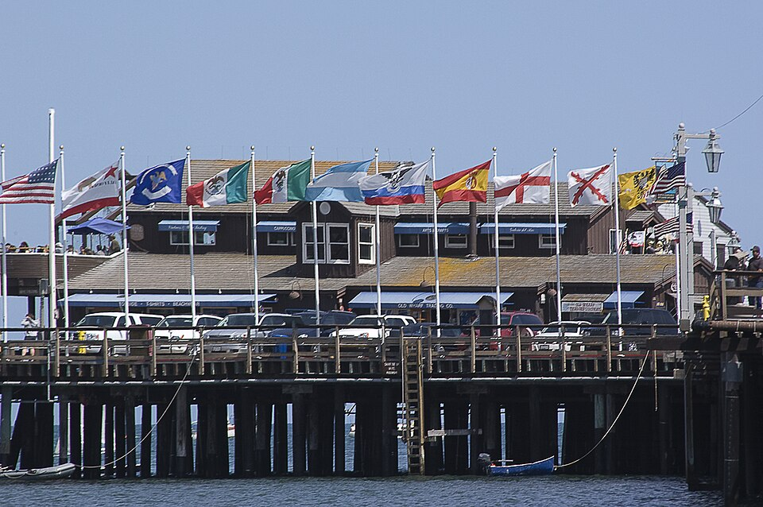

# Урок 54 — Cloth: симуляция ткани 🦸🚩

**Модуль 6 | 2 академических часа (1,5 часа)**

> 🔁 В начале урока — [повторение урока 53](повторение.md) (викторина по Rigid Body, 5–7 мин)

> 🎬 На прошлом уроке падали **твёрдые** тела. А как оживить **мягкое** — плащ супергероя, флаг, занавеску, парус? Они **мнутся, провисают и развеваются**. Для этого есть **Cloth** — симуляция ткани. Сегодня повесим **флаг на ветру** 🚩 и накинем **плащ** на персонажа 🦸.

> 🖥 **Слабые ПК:** ткань — тяжёлая симуляция (много точек, много связей). Держим сетку **умеренной** (не тысячи делений), качество среднее и **обязательно печём (Bake)**.

---

## Цель урока

- Понять **Cloth** (симуляцию ткани) и её механику «сетка на пружинках»
- Уронить ткань на предмет (**Collision**)
- Сделать **флаг**: закрепить край (**Pin Group**) и подуть **ветром**
- Накинуть **плащ** на персонажа (ткань сталкивается с телом и следует за ним)
- Понять **Bake** и настройки под слабый ПК

---

## Часть 1 — Теория: как «думает» ткань (18 минут)

### 1.1. Cloth = сетка точек на пружинках ⚙️

**Cloth (ткань)** — это симуляция мягкой поверхности. Настоящая ткань висит, качается и складывается — Blender считает это сам.

Классика — **флаг на ветру**: полотнище закреплено у древка, а свободный край **волнами** ходит по ветру:

*Флаги на набережной. [Wikimedia Commons, CC BY](https://commons.wikimedia.org/wiki/File:Waving_in_the_wind_-_Flags_on_Stearns_Wharf_(3628919702).jpg). Каждый флаг **прикреплён к древку одним краем** (остальное свободно) и **ходит волнами** по ветру. Это ровно то, что мы соберём: закреплённый край + ветер.*

> 🧠 **Под капотом — «сетка на пружинках»:** Blender представляет ткань как **сетку точек (вершин)**, соединённых **пружинками** (рёбрами). Каждый крошечный шаг времени: гравитация тянет точки вниз; пружинки **сопротивляются** растяжению и сжатию (ткань не рвётся и не «разъезжается»); **Force Fields** (ветер) толкают точки; **Collision** не даёт точкам пройти сквозь предметы и тело. Тысячи таких «переговоров» между соседними точками и складываются в живые складки и волны. Вот почему **чем гуще сетка — тем красивее ткань, но тяжелее ПК**.

### 1.2. Pin Group — «прибитые» точки 📌

Если у ткани не закрепить точки — она просто **упадёт на пол**. **Pin Group** — это группа вершин, которые **приколоты** и не двигаются (флаг у древка, плащ на плечах, занавеска на карнизе). Остальная ткань висит и качается от них.

### 1.3. С чем ткань «дружит»

| Инструмент | Роль |
|-----------|------|
| **Collision** (на предмете/теле) | чтобы ткань **ложилась** на объект, а не проваливалась сквозь |
| **Force Field → Wind** | ветер, который развевает |
| **Pin Group** | закреплённые точки (край флага, ворот плаща) |
| **Cache → Bake** | посчитать симуляцию один раз |

> 💡 **Фишка — Cloth ≠ Soft Body:** есть похожая физика **Soft Body** — для «желейных» объёмных объектов (мячик-антистресс, флаг тоже можно). **Cloth** заточена именно под **тонкую ткань** (складки, ветер) — её и берём для плащей/флагов.

> 🔬 **Проверь сам (2 минуты):** `Shift+A → Mesh → Grid` (это сетка!) → подними повыше → Physics Properties → **Cloth**. Ниже поставь сферу. Сфере дай **Collision**. `Пробел` — ткань **падает и обтекает шар**, как платок! Точки-пружинки в действии.

---

## Часть 2 — Первая ткань: платок на шаре (12 минут)

Поймём Cloth на простом: кусок ткани падает и обтекает шар.

**Шаг 1. Ткань = густая сетка.**
1. `Shift+A → Mesh → Grid`. В левом нижнем углу разверни панель **«Add Grid»** → **X Subdivisions = 30**, **Y Subdivisions = 30** (сетка 30×30 — достаточно складок, но не тяжело).
2. Увеличь: `S 2`. Подними над сценой: **`G Z 3 Enter`**.
   ✅ *Должно получиться:* плоский «платок» из густой сетки висит в воздухе.

> 💡 **Фишка — почему Grid, а не Plane:** обычный Plane — это **одна грань** (4 точки), пружинкам не из чего строить складки. **Grid** сразу даёт сетку из сотен точек. (Plane тоже можно — но тогда его надо много раз **Subdivide**.)

**Шаг 2. Включаем Cloth.**
1. Ткань выделена → **Physics Properties** (синий отскакивающий шарик) → нажми кнопку **Cloth**.
   ✅ *Должно получиться:* появился раздел настроек Cloth (модификатор Cloth добавился сам).

**Шаг 3. Препятствие с Collision.**
1. `Shift+A → Mesh → UV Sphere` → помести **под платком**.
2. Сфера выделена → **Physics Properties** → нажми **Collision**.
   ✅ *Должно получиться:* у сферы включена физика столкновения.

**Шаг 4. Роняем.**
1. Нажми **`Пробел`**.
   ✅ *Должно получиться:* платок **падает и красиво обтекает шар**, свисая складками по бокам. 🧣 (Верни на кадр 1 — `⏮`.)

> 💡 **Фишка — проваливается сквозь шар?** У сферы не включён **Collision**, либо ткань слишком редкая. Проверь Collision на сфере; при необходимости увеличь **Quality Steps** в настройках Cloth (об этом в Части 5).

---

## Часть 3 — Флаг на ветру (Pin Group) (22 минуты)

Теперь главный приём — **закрепим край** ткани и подуем ветром.

**Шаг 1. Полотнище и древко.**
1. `Shift+A → Mesh → Grid` → **X Subdivisions = 40**, **Y Subdivisions = 25** → `S` растяни в прямоугольник-флаг. Поверни вертикально к древку: расположи так, чтобы **левый край** был у будущего древка.
2. (Декор) `Shift+A → Mesh → Cylinder`, тонкий и длинный — **древко** слева.
   ✅ *Должно получиться:* прямоугольное полотнище-сетка рядом с древком.

**Шаг 2. Создаём Pin Group (какой край прибит).**
1. Выдели **флаг** → `Tab` → **Edit Mode** → режим **вершин** (`1`).
2. `Alt+A` (снять всё) → выдели **левый столбик вершин** (тот, что у древка) — рамкой `B`.
3. Справа: **Object Data Properties** (зелёный треугольник) → **Vertex Groups** → **`+`** → назови **`Pin`** → **Weight = 1.0** → кнопка **Assign**.
   ✅ *Должно получиться:* группа `Pin` содержит левый край. (Проверка: `Alt+A` → **Select** у группы — подсветится столбик у древка.)
4. `Tab` → Object Mode.

**Шаг 3. Привязываем Pin к ткани.**
1. **Physics Properties** → **Cloth** (включи, если ещё нет) → разверни раздел **Shape** → поле **Pin Group** → выбери **`Pin`**.
   ✅ *Должно получиться:* теперь левый край **приколот**, остальное свободно.

> 🎯 **ЛАЙФХАК — показать здесь!** **Pin Group для крепления ткани** — как «прибить» нужные точки (край флага, ворот плаща, углы занавески), чтобы ткань не упала, а красиво висела и развевалась. Разбор — в [лайфхак.md](лайфхак.md).

**Шаг 4. Ветер.**
1. `Shift+A → Force Field → **Wind**` → поставь **перед флагом**, чтобы дуло на полотнище (стрелка поля — направление ветра; поверни `R`, чтобы смотрела на флаг).
2. В свойствах поля (Physics Properties): **Strength = 300–800** (ткань лёгкая — ветер нужен ощутимый), **Flow = 1** (чуть турбулентности).
   ✅ *Должно получиться:* нажми **`Пробел`** — флаг **развевается волнами** от древка! 🚩 Слабо колышется — подними Strength; «улетает» — снизь.

> 💡 **Фишка — ткань «улетает» с прибитого края?** Значит Pin Group пустой/не выбран, или ветер запредельный. Проверь Pin Group в разделе Shape и умерь Strength.

> 📷 **[Вставь сюда картинку: флаг на ветру — Pin Group у древка + Wind →](изображения.md#flag)**

---

## Часть 4 — Плащ на персонаже (18 минут)

Накинем плащ на нашего человечка — и он будет **следовать за телом** и развеваться.

**Шаг 1. Заготовка плаща.**
1. `Shift+A → Mesh → Grid` → **X Subdivisions = 30**, **Y Subdivisions = 40** → `S` растяни в вытянутый прямоугольник (плащ длиннее, чем шире).
2. Помести его **за спиной** персонажа, верхним краем **на уровне плеч**, чуть касаясь спины.
   ✅ *Должно получиться:* полотнище-плащ висит за спиной.

**Шаг 2. Pin — ворот на плечах.**
1. `Tab` → Edit Mode → выдели **верхний край** плаща (у плеч/шеи) → Object Data → Vertex Groups → **`+`** → `Pin` → **Assign** (Weight 1). `Tab`.
2. Physics → **Cloth** → **Shape → Pin Group = `Pin`**.
   ✅ *Должно получиться:* верх плаща «пришит» к плечам, низ свободен.

**Шаг 3. Тело — препятствие (Collision).**
1. Выдели **меш персонажа** → Physics Properties → **Collision**.
   ✅ *Должно получиться:* плащ теперь не пройдёт сквозь тело, будет ложиться по спине.

**Шаг 4. Оживаем.**
1. Чтобы плащ развевался при движении — либо добавь **Wind** (как флаг), либо **анимируй персонажа** (шаг/поворот, уроки 41/49): при движении тела плащ **отстаёт и колышется** сам (инерция ткани).
2. **`Пробел`**.
   ✅ *Должно получиться:* плащ **следует за спиной и развевается** — герой ожил! 🦸

> 💡 **Фишка — прикрепить плащ к движущемуся персонажу:** чтобы Pin-край ездил **вместе** с плечами, сделай плащ **ребёнком** арматуры/кости плеч (`Ctrl+P`) — тогда приколотый ворот двигается с телом, а полотнище свободно колышется.

---

## Часть 5 — Bake, качество и слабый ПК (10 минут)

**Шаг 1. Качество и вес.**
1. В настройках **Cloth** есть **Quality Steps** (в разделе сверху): выше — стабильнее (ткань не проваливается), но медленнее. Для класса **7–10** достаточно.
2. Слишком тяжело — уменьши **Subdivisions** сетки (например 20×20) или включи **Simplify** (Render Properties).

**Шаг 2. Печём (Bake) — обязательно.**
1. Physics Properties → Cloth → раздел **Cache** → задай **Simulation Start/End** → нажми **Bake**.
   ✅ *Должно получиться:* ткань проигрывается **мгновенно**, не пересчитывается каждый раз. Меняешь сцену — **Free Bake**, потом Bake заново.

- **Сохрани** (`Ctrl+S`). Плащ и флаг пойдут в итоговый ролик (урок 56)!

> 💡 **Фишка — пресеты ткани:** в настройках Cloth есть выпадающий список **пресетов** (Cotton, Silk, Denim, Leather, Rubber). **Silk** — лёгкая, летящая (плащ героя); **Denim/Leather** — тяжёлая, почти не колышется. Быстрый способ задать «характер» материала.

---

## Что мы узнали

- **Cloth** — симуляция ткани: сетка **точек на пружинках** + гравитация + столкновения + ветер.
- Ткани нужна **густая сетка** (Grid / Subdivide) — иначе нет складок.
- **Collision** на предмете/теле — чтобы ткань ложилась, а не проваливалась.
- **Pin Group** — приколотые точки (край флага, ворот плаща), чтобы ткань не упала.
- **Force Field → Wind** развевает; **пресеты** (Silk/Denim) задают «характер».
- **Quality Steps** + **Bake** — стабильность и скорость (важно для слабых ПК).

**Дальше (урок 55):** **NLA Editor** — соберём разные действия персонажа (ходьба, взмах, прыжок) в **одну связную сцену**, как из кубиков! 🎬

---

## Лайфхак урока

👉 [лайфхак.md](лайфхак.md) — **Pin Group для крепления ткани**: как «прибить» нужные точки, чтобы ткань висела и развевалась, а не падала (показывается в Части 3)

## Практика

👉 [практика.md](практика.md) — самостоятельная работа: **смоделируй флаг / парус кораблика / палатку / занавеску** и оживи ветром (Cloth + Pin + Wind) — моделирование + ткань

---

## Навигация

⬅️ [Урок 53 — Rigid Body](../урок-53/урок.md)  ·  🔁 [Повторение](повторение.md)  ·  ➡️ [Урок 55 — NLA Editor](../урок-55/урок.md)
