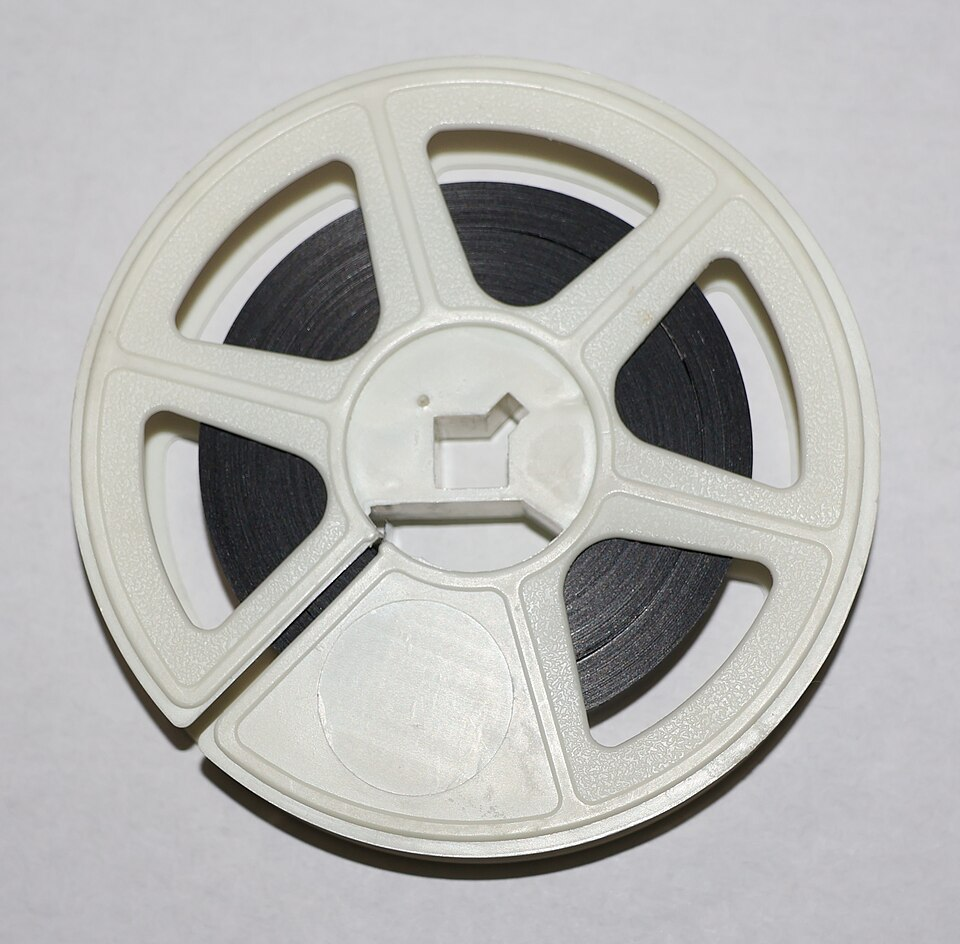
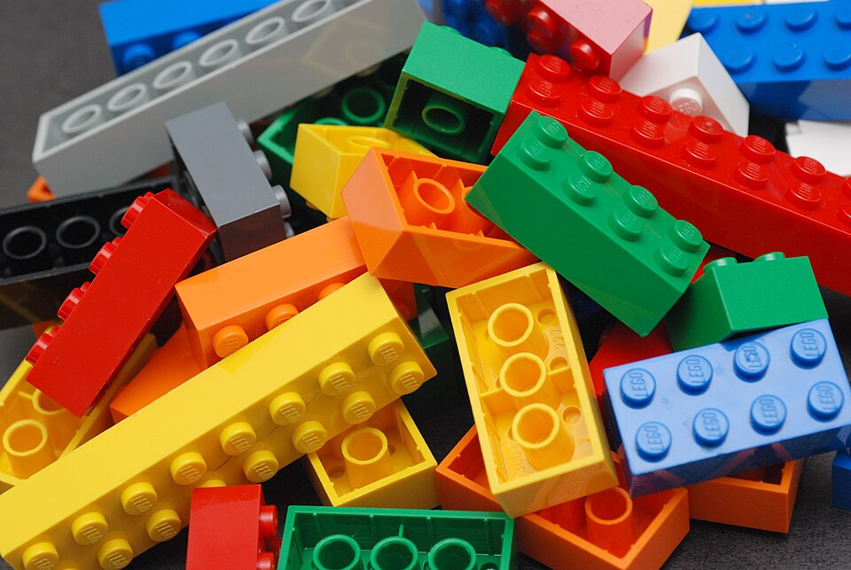

# Урок 55 — NLA Editor: собираем анимации как кубики 🎬🧱

**Модуль 6 | 2 академических часа (1,5 часа)**

> 🔁 В начале урока — [повторение урока 54](повторение.md) (викторина по ткани, 5–7 мин)

> 🎬 За модуль ты сделал разные движения персонажа: **ходьбу**, **взмах**, **прыжок**. Но как соединить их в **одну сцену** — «идёт → машет → прыгает» — да ещё **переиспользовать** без переделки? Для этого есть **NLA Editor**: он превращает каждую анимацию в **клип-кубик**, который двигаешь, повторяешь и смешиваешь, как в видеоредакторе.

---

## Цель урока

- Понять **Action** (клип анимации) и **NLA** (нелинейную анимацию)
- Сохранять и называть **действия** (Action Editor)
- **Push Down** — превратить действие в **клип-полоску** (strip) в NLA
- **Собрать** сцену из клипов: последовательность, повтор, смешивание
- **Переиспользовать** один клип много раз

---

## Часть 1 — Теория: клипы и дорожки (18 минут)

### 1.1. Action = один клип движения 🎞️

Каждая анимация (все её ключи) хранится как **Action (действие)** — отдельный **клип** с именем: `Ходьба`, `Взмах`, `Прыжок`. Как кадры, свёрнутые в **киноленту** — готовый кусочек:

*Кинолента. [Wikimedia Commons, CC BY-SA](https://commons.wikimedia.org/wiki/File:16_mm_Film_Reel_(With_Film).jpg). Фильм — это **клипы, собранные в ленту**. Так и сцена персонажа: отдельные действия-клипы (`Ходьба`, `Взмах`) склеиваются в один «фильм». NLA — твой монтажный стол.*

### 1.2. Проблема, которую решает NLA

На **одной** временной шкале анимации **мешают** друг другу: поставил ходьбу на кадры 1–25, а взмах хочешь на 26–50 — но это уже другой набор ключей, и они «спорят». Держать всё в куче неудобно и **невозможно переиспользовать**.

**NLA (Non-Linear Animation)** решает это: каждое действие — **отдельная полоска-клип** на **дорожке** (track). Полоски двигаешь по времени, **повторяешь**, **растягиваешь** (скорость) и **смешиваешь** — как клипы в видеоредакторе или дорожки в музыкальном.

### 1.3. Переиспользование — как из кубиков Lego 🧱

Главная сила NLA — **один клип можно вставить сколько угодно раз**. Сделал `Взмах` один раз — маши им хоть 10 раз, в разных местах, на разных персонажах:

*Кубики Lego. [Wikimedia Commons, CC BY-SA](https://commons.wikimedia.org/wiki/File:Lego_Color_Bricks.jpg). Из одних и тех же деталей собирают тысячи построек. Действия в NLA — те же «кубики»: `Ходьба`, `Взмах`, `Прыжок` переставляешь и повторяешь, собирая любую сцену.*

> 🧠 **Под капотом — дорожки и смешивание:** каждая **полоска** ссылается на **Action** (его ключи). NLA считает дорожки **снизу вверх**: нижняя даёт базовую позу, каждая верхняя её **смешивает** — либо **заменяет** (Replace), либо **добавляет** сверху (Add), с силой **Influence** 0…1. Полоски умеют **плавно перетекать** (Blend In/Out) — так «ходьба» без рывка переходит во «взмах». Ты не переписываешь ключи — ты **монтируешь готовые клипы**.

> 🔬 **Проверь сам (1 мин):** внизу переключи редактор (Dope Sheet) в режим **Action Editor** — увидишь имя текущего действия (например `Ходьба`). Рядом кнопка **New** создаёт **пустой** новый клип. Так живут и называются действия-«кубики».

---

## Часть 2 — Готовим действия (Actions) (15 минут)

Соберём 2–3 коротких действия персонажа. (Если ходьба из урока 49 уже есть — отлично, будет первым клипом.)

**Шаг 1. Открой Action Editor.**
1. Внизу — редактор **Dope Sheet**. В его **шапке** нажми выпадающий список режимов → выбери **Action Editor**.
   ✅ *Должно получиться:* появилась строка с именем текущего действия и кнопками (New, кнопка **F** — «фейк-юзер», ⤓ Push Down).

**Шаг 2. Назови первое действие.**
1. Выдели арматуру → **Pose Mode**. Если ходьба уже анимирована — в Action Editor **двойным кликом** переименуй действие в **`Ходьба`**.
2. Нажми кнопку **F** (Fake User) рядом с именем — чтобы клип **не потерялся**, даже если сейчас не используется.
   ✅ *Должно получиться:* действие названо `Ходьба`, у него «фейк-юзер» (щит-иконка).

**Шаг 3. Создай второе действие — `Взмах`.**
1. В Action Editor нажми **New** — создался **пустой** новый клип (персонаж «замер»).
2. Анимируй короткий **взмах рукой** (Pose Mode + Auto Keying, урок 47): кадр 1 рука внизу → кадр 12 рука вверх → кадр 24 внизу.
3. Переименуй клип в **`Взмах`**, нажми **F**.
   ✅ *Должно получиться:* два действия-«кубика»: `Ходьба` и `Взмах`.

> 💡 **Фишка — где список всех действий:** рядом с именем есть кнопка-«браузер» (иконка со стрелочками) — по ней выбираешь любое сохранённое действие. `F` (Fake User) не даёт Blender удалить неиспользуемый клип при сохранении.

---

## Часть 3 — Push Down: клип → полоска в NLA (15 минут)

**Шаг 1. Открой NLA Editor.**
1. Переключи нижний редактор (или заведи второй) в тип **Nonlinear Animation** (иконка со «слоями-полосками»).
   ✅ *Должно получиться:* пустой NLA с именем активного действия сверху (Action-строка).

**Шаг 2. «Опусти» действие в дорожку.**
1. Убедись, что активно действие `Ходьба` (в Action Editor/наверху NLA). Нажми кнопку **Push Down** (иконка **⤓**, слева от имени действия).
   ✅ *Должно получиться:* `Ходьба` превратилась в **полоску-клип** на новой дорожке NLA, а «активный слот» освободился (персонаж больше не проигрывает её напрямую — теперь ею рулит NLA).

**Шаг 3. Проверь.**
1. `Пробел` — персонаж по-прежнему идёт (но теперь это **клип** в NLA, а не «сырые» ключи).
   ✅ *Должно получиться:* ходьба играет из полоски NLA.

> 💡 **Фишка — что такое Push Down:** он «сталкивает» текущее действие **вниз**, в дорожку NLA, превращая его в переставляемый клип. После этого можно взять **новое** действие в активный слот и тоже опустить — так дорожки набираются клипами.

---

## Часть 4 — Собираем сцену из клипов (22 минуты)

Сложим «идёт → машет»: две полоски по очереди.

**Шаг 1. Добавь `Взмах` как полоску.**
1. В NLA слева кликни по **дорожке** `Ходьба` (или создай новую: **Add → Add Tracks**).
2. Меню NLA: **Add → Add Action Strip** → выбери **`Взмах`**.
   ✅ *Должно получиться:* появилась вторая полоска-клип `Взмах`.

**Шаг 2. Поставь клипы по очереди.**
1. Выдели полоску `Взмах` → **`G`** → передвинь её **вправо**, чтобы она началась **после** ходьбы (например, ходьба кадры 1–25, взмах 26–50).
   ✅ *Должно получиться:* персонаж сперва **идёт**, потом **машет** — две анимации склеены в последовательность!

**Шаг 3. Повтори ходьбу (loop) — переиспользование.**
1. Выдели полоску `Ходьба` → панель **`N`** (в NLA) → вкладка **Strip** → раздел **Playback** → **Repeat = 3** (клип повторится 3 раза).
   ✅ *Должно получиться:* персонаж идёт **дольше** (цикл повторился), не переделывая ключи.

> 🎯 **ЛАЙФХАК — показать здесь!** **Переиспользование действий** — как один клип (`Взмах`, `Шаг`) вставлять много раз, менять скорость и собирать длинные сцены из коротких «кубиков». Разбор — в [лайфхак.md](лайфхак.md).

**Шаг 4. Скорость клипа.**
1. Та же панель `N → Strip → Playback → Scale`: **>1** — быстрее, **<1** — медленнее (замедлил взмах — стал «важным»).
   ✅ *Должно получиться:* можешь ускорять/замедлять отдельные клипы, не трогая ключи.

> 📷 **[Вставь сюда картинку: NLA — полоски Ходьба/Взмах на дорожках →](изображения.md#nla)**

---

## Часть 5 — Плавные переходы (Blend) (10 минут)

Чтобы между клипами не было **рывка**, сделаем **перетекание**.

**Шаг 1. Наложи клипы внахлёст.**
1. Передвинь `Взмах` так, чтобы его **начало** чуть **заходило** на конец `Ходьбы` (перекрытие 3–5 кадров). Полоски лучше на **разных дорожках** (взмах выше ходьбы).

**Шаг 2. Blend In/Out.**
1. Выдели `Взмах` → `N → Strip → **Blending**` → задай **Blend In = 4** (плавный вход). Тип **Replace** (заменяет позу) или **Add** (добавляет поверх — например, махать рукой **во время** ходьбы!).
   ✅ *Должно получиться:* переход стал **плавным**; а с **Add** персонаж **машет на ходу** (взмах наложился на ходьбу). 🎬

> 💡 **Фишка — Replace vs Add:** **Replace** — верхний клип **заменяет** нижний (сначала иду, потом отдельно машу). **Add** — верхний **добавляется** к нижнему (машу **во время** ходьбы). Так из 2 клипов рождается третье, новое движение!

---

## Часть 6 — Итог и сохранение (5 минут)

- Проиграй сцену: персонаж идёт (цикл), плавно переходит во взмах, всё без рывков.
- **Сохрани** (`Ctrl+S`) — эта «нарезка» — репетиция перед **итоговым роликом** (урок 56).

> 💡 **Фишка — NLA = монтаж:** ты работаешь как режиссёр монтажа: клипы двигаешь, повторяешь, смешиваешь. Одни и те же действия-«кубики» → бесконечно разные сцены. Это профессиональный подход в играх и кино.

---

## Что мы узнали

- **Action** — сохранённый клип анимации (все ключи одного движения) с именем.
- **Action Editor** — создать/назвать действия; **F** (Fake User) сохраняет клип.
- **NLA Editor** — монтаж клипов: **полоски** на **дорожках**.
- **Push Down** — опустить действие в дорожку (сделать клипом).
- Клипы: **двигать** (`G`), **повторять** (Repeat), **ускорять** (Scale), **смешивать** (Blend, Replace/Add).
- **Переиспользование** — один клип много раз; из коротких «кубиков» — длинные сцены.

**Дальше (урок 56):** **Итоговый ролик модуля** — собираем всё (персонаж, физика, эффекты) в **анимированную сцену 10–15 секунд** и рендерим в видео! 🎥

---

## Лайфхак урока

👉 [лайфхак.md](лайфхак.md) — **Переиспользование действий**: один клип — много раз, разная скорость, длинные сцены из коротких «кубиков» (показывается в Части 4)

## Практика

👉 [практика.md](практика.md) — самостоятельная работа: **собери мини-сценку** из клипов своего персонажа (idle → идёт → машет → прыгает), с повтором и плавными переходами

---

## Навигация

⬅️ [Урок 54 — Cloth](../урок-54/урок.md)  ·  🔁 [Повторение](повторение.md)  ·  ➡️ [Урок 56 — Итоговый ролик](../урок-56/урок.md)
