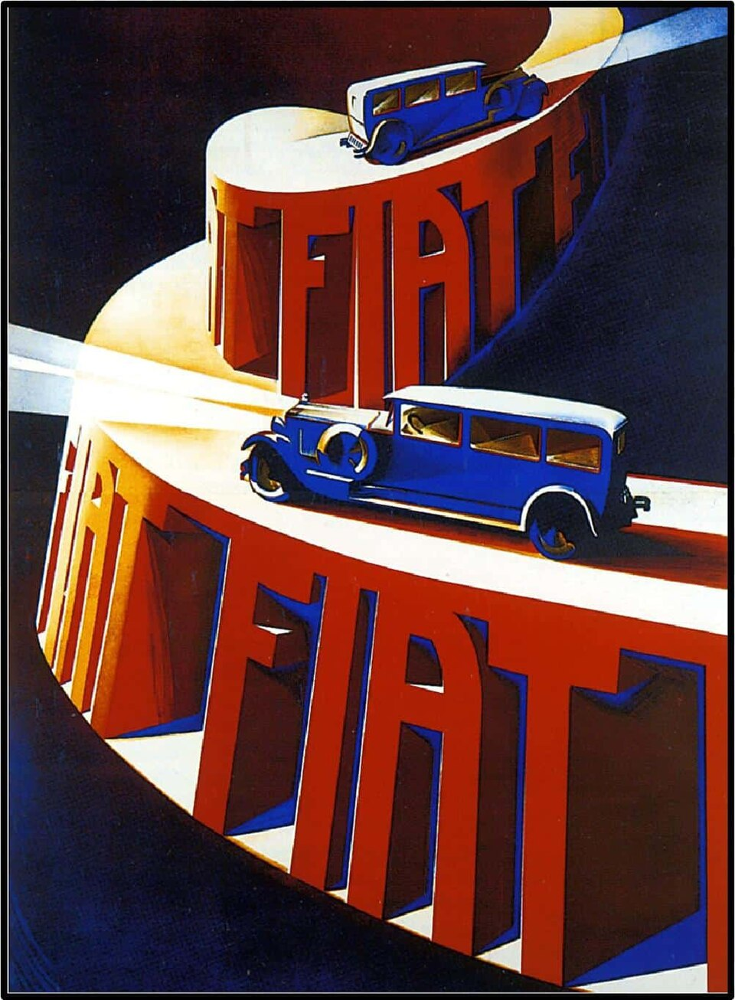
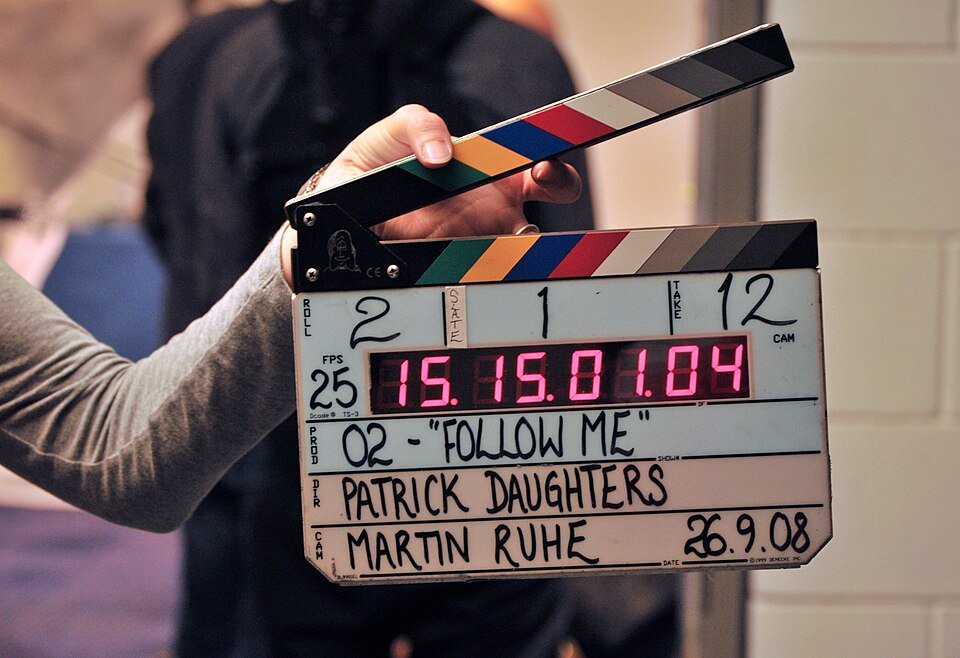

# Урок 56 — Итоговый проект модуля: РЕКЛАМА продукта 📺🎥

**Модуль 6 | Итоговый проект (несколько занятий) | 4+ академических часа**

> 🔁 В начале — [повторение урока 55](повторение.md) (викторина по NLA, 5–7 мин)

> 🏁 Это **финал самого большого модуля курса!** За 15 уроков ты научился двигать объекты, строить кривые движения, собирать скелет, ходить, лепить мимику, запускать частицы, физику и монтировать клипы в NLA. Пора собрать **всё вместе** в один эффектный результат — **рекламный ролик 10–15 секунд** про **твой собственный продукт**. И, наконец, узнать главное: **как превратить анимацию в готовое видео-файл**, который можно показать всем. 🎬

---

## Цель урока

- Понять, **как устроена реклама** и какие приёмы делают её «цепляющей»
- Понять «под капотом», **как кадры анимации становятся видео** (FPS, кодек, контейнер)
- **Собрать сцену-рекламу ВМЕСТЕ**: продукт → материалы (Shading) → анимация → облёт камеры → свет → слоган
- Освоить **главный новый навык — рендер анимации в видео** (Output Properties → FFmpeg) — по шагам
- Освоить **надёжный путь**: рендер **кадрами PNG → склейка** в видео
- Довести **свою рекламу**, оценить по рубрике и **защитить** проект

---

## Часть 1 — Теория: что такое реклама и как рождается видео (25 минут)

### 1.1. Реклама = продукт + притягательный образ + слоган

Реклама за 10–15 секунд должна: **показать продукт красиво**, **вызвать эмоцию** («хочу!») и **запомниться** коротким слоганом. Посмотри, как это делали 100 лет назад — принципы те же:



*Винтажный плакат Fiat. [Wikimedia Commons, Public Domain](https://commons.wikimedia.org/wiki/File:Fiat-Automobile-Vintage-Poster-1900.jpg). Разбери приёмы: **герой-продукт** (машина) — крупно и в центре; **драматичный свет** (диагональный луч выхватывает кузов из темноты); **огромный бренд** FIAT-слоган; **динамика** (спираль дороги = движение). Ровно это мы соберём в 3D: крупный план + эффектный свет + слоган + движение камеры.*

**4 приёма рекламы, которые мы применим в 3D:**

| Приём | Что делает | Чем сделаем (наш модуль/курс) |
|-------|-----------|-------------------------------|
| **Крупный план (hero-shot)** | продукт занимает кадр, видно детали | камера близко + DOF (Модуль 4) |
| **Облёт камеры** | продукт «поворачивается», как в магазине | камера по кругу через **Follow Path** (урок 43) |
| **Эффектный свет** | блики, контраст, «дорого» | прожектор Spot + тёмный фон (Модуль 4) + Bloom |
| **Слоган-текст** | название и фраза врезаются в память | 3D-текст (Text-объект) с анимацией появления |

### 1.2. Как кадры превращаются в видео 🧠

Мы уже знаем (урок 41): **анимация = быстрая смена кадров**, и глаз из-за **инерции зрения** видит движение. Видео устроено так же — это **последовательность картинок (кадров)**, показанных быстро одна за другой.



*Съёмочная хлопушка (clapperboard). [Wikimedia Commons, CC BY 2.0](https://commons.wikimedia.org/wiki/File:Clapperboard,_O2_film,_September_2008.jpg). Видишь надпись **FPS 25**? Это **частота кадров** — сколько картинок в секунду. Именно её мы зададим Blender. А «FOLLOW ME» — прямо намёк на наш облёт камеры Follow Path 🙂.*

> 🧠 **Под капотом — что делает Blender при рендере видео:**
> 1. **Рисует каждый кадр** сцены по очереди (кадр 1, 2, 3, … — как ты видел на Timeline).
> 2. Каждый кадр — это **картинка** (Full HD = 1920×1080 = ~2 млн пикселей).
> 3. **Кодек (codec)** — «упаковщик» — сравнивает соседние кадры и хранит **только то, что изменилось** (фон не двигался — не пересохраняем его 300 раз). Так огромная гора картинок ужимается в маленький файл. Наш кодек — **H.264**.
> 4. **Контейнер (container)** — «коробка»-файл (`.mp4`), куда кодек складывает сжатый видеопоток (и звук, если есть). H.264 + контейнер MP4 = обычное видео, которое откроется где угодно.

**Три числа, которые всё решают:**
- **Разрешение** — размер кадра в пикселях. **1920×1080** (Full HD) — стандарт.
- **FPS (кадров/сек)** — плавность. **24** = кино, **25** = ТВ, **30** = веб. Мы возьмём **25**.
- **Длительность** — сколько кадров всего. **12 секунд × 25 fps = 300 кадров** (Frame End = 300).

> 🔬 **Проверь сам (1 мин):** открой любую свою анимацию из модуля, внизу на **Timeline** покрути ползунок кадров туда-сюда медленно — ты «листаешь кадры руками». Рендер видео = Blender сам пролистывает их по 25 в секунду и записывает в файл.

### 1.3. Два пути получить видео

| Путь | Как | Плюс | Минус |
|------|-----|------|-------|
| **А. Сразу в видео (FFmpeg)** | Output → File Format = **FFmpeg Video** → жмёшь «Render Animation» → получаешь `.mp4` | быстро, один файл | если Blender упал на кадре 200 — рендер с нуля |
| **Б. Кадрами PNG → склейка** | рендеришь как **PNG**-картинки (`0001.png…`), потом склеиваешь в видео | надёжно (упал — продолжишь), кадры можно поправить | два шага |

Путь **А** разберём в Части 5 (основной), путь **Б** — в Части 6 (лайфхак, для длинных/тяжёлых роликов).

---

## Часть 2 — Раскадровка: сценарий на 12 секунд (10 минут)

Прежде чем нажимать кнопки — **придумай, что происходит в кадре**. Это **раскадровка** (storyboard): ролик по секундам. Наш демо-продукт (делаем ВМЕСТЕ) — **энергетик «ВОЛЬТ» ⚡**. Твой продукт в практике — любой (телефон, кроссовок, игрушка, напиток, гаджет).

| Кадры (сек) | Что в кадре | Приём |
|-------------|-------------|-------|
| 1–50 (0–2 с) | тёмная сцена, продукт **вырастает** из темноты под лучом света | hero-reveal (ключи Scale + Easing) |
| 50–200 (2–8 с) | камера **облетает** продукт по кругу, блики играют | Follow Path облёт |
| 150–220 (6–9 с) | из-под крышки взлетают **искры** ⚡ | Particles (урок 52) |
| 220–300 (9–12 с) | выезжает **слоган** «ВОЛЬТ — заряди себя!» | 3D-текст + анимация |

> 💡 **Фишка — раскадровка экономит часы:** решив заранее «что и когда», ты не переделываешь анимацию 10 раз. Профи всегда рисуют раскадровку до 3D.

> 📷 **[Вставь сюда картинку: раскадровка ролика ВОЛЬТ по кадрам →](изображения.md#storyboard)**

---

## Часть 3 — Собираем сцену ВМЕСТЕ: моделируем продукт + материалы (35 минут)

Реклама начинается с **продукта**. Смоделируем баночку-бутылку энергетика (low-poly, повтор Модулей 1–2), материалы соберём **нодами в раскладке Shading** (упор курса).

### Шаг 1. Тело бутылки

1. `Shift+A → Mesh → Cylinder`. В левом нижнем углу (панель **Operator**) поставь **Vertices = 24**, Radius = 0.4, Depth = 2.
   ✅ *Должно получиться:* аккуратный невысокий цилиндр — корпус.
2. **Tab** (Edit Mode) → выдели верхнее кольцо (`Alt+клик` по ребру) → `E → S` (Extrude + Scale) сузь в **горлышко**, потом ещё раз `E Z` вытяни горлышко вверх.
   ✅ *Должно получиться:* бутылка с плечиками и горлышком.
3. **Tab** назад → ПКМ → **Shade Smooth**; добавь модификатор **Bevel** (лёгкая фаска) — блики лягут красиво (повтор Модуля 1).

### Шаг 2. Крышка

1. `Shift+A → Cylinder` (Vertices 24, Radius 0.22, Depth 0.25) → подними на горлышко (`G Z`).
   ✅ *Должно получиться:* крышка сидит на горлышке.

### Шаг 3. Материалы в раскладке Shading 🎨

Вверху окна переключись на раскладку **Shading** (callback Модуль 3).

**А. Стекло/пластик корпуса.** Выдели корпус → в Shader Editor **New**:
- На ноде **Principled BSDF** поставь **Transmission = 1** (прозрачный, callback урок 27 «стекло/IOR»), **Roughness = 0.05**, **IOR = 1.45**.
   ✅ *Должно получиться:* корпус стал прозрачным, как бутылка.

**Б. Светящийся логотип-молния ⚡ (Emission нодами).** Крышку/этикетку сделаем светящейся — это «фишка» бренда. Добавим ноды:

```
   [Emission]  Color = голубой (#33AAFF), Strength = 5
        │ Emission
        ▼
   [Material Output]  Surface
```
Чтобы собрать: на этикетке/крышке **New** → в Shader Editor `Shift+A → Shader → Emission` → соедини **Emission [Emission] → Material Output [Surface]** (заменив Principled). Цвет — голубой, Strength = 5.

| 🧩 Нод | Аналогия | Что делает | Сокеты |
|--------|----------|-----------|--------|
| **Emission** | лампочка | заставляет поверхность **светиться** собственным светом | вход Color/Strength → выход Emission |
| **Material Output** | розетка | финальная точка материала | вход Surface |

   ✅ *Должно получиться:* крышка/логотип **светятся** голубым.

**В. Жидкость внутри (по желанию).** Ещё один цилиндр чуть меньше корпуса → Principled: **Transmission 1** + добавь `Shift+A → Shader → Volume Absorption` в сокет **Volume** (цвет синий) — напиток «прокрашивает» свет (callback урок 27).
   ✅ *Должно получиться:* внутри виден цветной «энергетик».

> 💡 **Фишка — Bloom для свечения:** включи **Render Properties → Bloom (✅)** — голубой логотип даст мягкое сияние, как в настоящей рекламе (повтор Модуля 4).

### Шаг 4. Сцена-студия

1. **Постамент**: `Shift+A → Cylinder` плоский и широкий под бутылкой (тёмный глянец: Principled, Roughness 0.1).
2. **Фон**: большая **Plane** сзади, тёмно-синяя.
   ✅ *Должно получиться:* продукт стоит на подиуме в тёмной студии — как в рекламе.

---

## Часть 4 — Анимация рекламы: свет, облёт, слоган (40 минут)

Теперь **оживим** сцену по раскадровке. Три коротких «клипа-действия» — потом соберём их (при желании) через NLA (урок 55).

### 4.1. Hero-reveal: продукт вырастает (ключи + Easing)

1. Кадр **1**: выдели бутылку → `S` уменьши почти в ноль (Origin внизу!) → `I → Scale` (ключ).
2. Кадр **50**: `S` верни в полный размер → `I → Scale`.
3. Открой **Graph Editor** → выдели кривые → `T → Sinusoidal` + `Ctrl+E → Ease Out` (плавно «вырастает», урок 42).
   ✅ *Должно получиться:* продукт **эффектно вырастает** из подиума за 2 секунды.

### 4.2. Эффектный свет (Модуль 4)

1. `Shift+A → Light → Spot` над продуктом → в **Object Data Properties** (лампочка): **Power** повыше, **Spot Size** ~45°, **Blend** 0.3 — узкий музейный луч (повтор урока 31).
2. Мир тёмный: **World Properties → Color** почти чёрный.
   ✅ *Должно получиться:* продукт выхвачен лучом из темноты — «дорого».

### 4.3. Облёт камеры по кругу (Follow Path, урок 43) 🎯

1. `Shift+A → Curve → Circle` → масштабируй, чтобы окружность шла **вокруг** продукта; приподними (`G Z`) на высоту камеры.
2. Выдели **камеру** → зажми `Ctrl`, добавь к выделению окружность → `Ctrl+P → **Follow Path**`.
3. Камеру нужно развернуть **на продукт**: добавь камере **Constraint → Track To** (Target = продукт), оси To **−Z**, Up **Y** (повтор урока 43).
4. Заставь ехать: выдели **окружность** → **Object Data Properties (иконка кривой) → Path Animation** → задай **Frames = 300** (за 300 кадров камера пройдёт круг). Поставь галочку по необходимости и проверь `Пробел`.
   ✅ *Должно получиться:* камера **плавно облетает** продукт, всегда глядя на него — блики играют по стеклу. 🎥

> 🎯 **ЛАЙФХАК — показать здесь!** **Рендер кадрами PNG → склейка в видео** — надёжный способ получить ролик, устойчивый к сбоям (Blender упал — продолжишь с того же кадра). Разбор — в [лайфхак.md](лайфхак.md).

### 4.4. Слоган — 3D-текст

1. `Shift+A → Text` → **Tab** (Edit Mode) сотри и напиши **`ВОЛЬТ`**; ниже второй Text: **`заряди себя!`**.
   *(Русский шрифт: в Object Data Properties → Font загрузи `.ttf` с кириллицей, если стандартный не показывает буквы.)*
2. **Extrude** тексту объём: Object Data Properties → **Geometry → Extrude = 0.05**. Материал — светящийся (Emission, как логотип).
3. Анимируй **появление** к концу ролика: кадр 220 текст маленький/прозрачный → кадр 260 полный (ключи Scale/`I`, Easing).
   ✅ *Должно получиться:* в финале **выезжает светящийся слоган**.

### 4.5. Искры ⚡ (по желанию, урок 52)

Из-под крышки — короткий залп искр: маленький объект-эмиттер → **Particle System → Emitter**, Number ~80, Lifetime 30, Velocity вверх, Render As → Object (звёздочка с Emission). **Bake** (урок 52). Для слабых ПК — по желанию/на дом.

### 4.6. (По желанию) Сборка через NLA (урок 55)

Каждое действие (`Появление`, `Слоган`) можно сохранить как **Action**, **Push Down** в NLA и расставить полосками по времени — как монтаж. Для короткого ролика можно и без NLA (все ключи на одной шкале), но если действий много — NLA удобнее.

---

## Часть 5 — 🎬 ГЛАВНОЕ: рендер анимации в видео (Output Properties) (25 минут)

Вот он, **новый навык урока**. Всё настраивается во вкладке **Output Properties** — иконка **принтера** 🖨️ в Properties (правая колонка).

### Шаг 1. Размер и частота кадров (панель Format)

1. **Resolution X = 1920**, **Y = 1080** (Full HD), **% = 100**.
2. **Frame Rate = 25 fps** (как на хлопушке!).
   ✅ *Должно получиться:* кадр Full HD, 25 кадров/сек.

### Шаг 2. Сколько кадров рендерить (панель Frame Range)

1. **Frame Start = 1**, **Frame End = 300** (= 12 сек × 25).
   ✅ *Должно получиться:* Blender отрендерит ровно ролик 12 секунд.

### Шаг 3. Куда и в каком виде (панель Output)

1. **Путь сохранения**: кликни по строке с папкой → выбери, куда класть файл (например `//реклама/`). `//` = рядом с `.blend`.
2. **File Format**: раскрой список → выбери **FFmpeg Video**.
   ✅ *Должно получиться:* появились подпанели **Encoding** (кодек/контейнер).

### Шаг 4. Кодек и контейнер (панель Encoding)

1. **Container = MPEG-4** (даст файл `.mp4`).
2. **Video Codec = H.264** (совместим со всем).
3. **Output Quality = High Quality** (или Medium — меньше файл).
4. **Encoding Speed = Good** (баланс скорость/качество).
   ✅ *Должно получиться:* Blender готов записать `.mp4` с H.264 — обычное видео.

### Шаг 5. Проверь движок и рендер (слабые ПК!)

1. **Render Properties → Render Engine = EEVEE** (быстро; Cycles — долго). Bloom ✅ включён.
2. Меню сверху: **Render → Render Animation** (или `Ctrl+F12`).
   ✅ *Должно получиться:* Blender рисует кадр за кадром (видно счётчик 1/300, 2/300…), потом сам собирает их в `.mp4` в твоей папке. Открой файл — это **твоя реклама-видео!** 🎉

> 💡 **Фишка — сначала тест-рендер:** прежде чем гнать все 300 кадров, поставь **% = 50** и Frame End = 50 — за минуту увидишь, всё ли на месте (свет, камера, слоган). Потом верни 100% и 300 кадров.

> ⚠️ **Частая ошибка:** нажать «Render **Image**» (`F12`) вместо «Render **Animation**» — получишь **один кадр**, а не видео. Нужен именно **Render Animation** (`Ctrl+F12`).

---

## Часть 6 — Надёжный путь: кадры PNG → склейка (15 минут)

Если ролик длинный/тяжёлый или Blender падает — рендерь **картинками**, потом склей.

**Рендер в PNG:**
1. Output → **File Format = PNG**, путь — **пустая папка** `//кадры/`.
2. **Render → Render Animation** — Blender сохранит `0001.png, 0002.png, … 0300.png`.
   ✅ *Должно получиться:* папка с пронумерованными кадрами (упал на 150-м — продолжишь с него, не теряя первые 150).

**Склейка кадров в видео (Video Sequencer):**
1. Вверху выбери раскладку **Video Editing**.
2. **Add → Image/Sequence** → зайди в папку `кадры` → выдели **все** PNG (`A`) → **Add Image Strip**.
   ✅ *Должно получиться:* на таймлайне видеомонтажа появилась полоса из твоих кадров.
3. Output → File Format = **FFmpeg Video** (MPEG-4 / H.264, как в Части 5) → **Render → Render Animation**.
   ✅ *Должно получиться:* из кадров собран `.mp4` — тот же результат, но надёжнее.

> 💡 **Фишка — почему профи рендерят кадрами:** большие студии всегда пишут PNG/EXR-кадрами: сбой не убивает всю работу, кадры можно поправить в фотошопе/композере, а склейку сделать в конце. FFmpeg-видео напрямую — удобно для коротких роликов.

---

## Часть 7 — Итог, рубрика и защита

- У тебя есть **готовый видеофайл** рекламы — покажи его классу!
- Оцени себя по **рубрике** (в [практика.md](практика.md)): продукт, материалы, анимация, облёт камеры, свет, слоган, рендер в видео.
- **Защита:** расскажи (1–2 мин): что за продукт, какие приёмы модуля применил (ключи/Easing/Follow Path/частицы/NLA), как настроил рендер видео.

> 🏆 Это финал Модуля 6 — самого большого в курсе. Ты прошёл путь от одного ключевого кадра (урок 41) до **собственного рекламного видеоролика**. Впереди — **Модуль 7: дипломный проект**, где ты соберёшь всё мастерство курса в один большой проект!

---

## Что мы узнали

- **Реклама** = герой-продукт + эффектный свет + движение камеры + слоган.
- **Видео** = последовательность кадров; **FPS** — кадров в секунду; **кодек** (H.264) сжимает, **контейнер** (MP4) хранит.
- **Собрали рекламу**: продукт (Shading-материалы) → hero-reveal (ключи+Easing) → облёт **Follow Path** → эффектный свет → 3D-слоган → искры → (NLA).
- **Рендер в видео** (Output → FFmpeg Video → MPEG-4/H.264 → Render Animation) — по шагам.
- **Надёжный путь**: PNG-кадры → склейка в Video Sequencer.

**Дальше:** ➡️ **Модуль 7 — Дипломный проект!** Большой финальный проект курса + защита.

---

## Лайфхак урока

👉 [лайфхак.md](лайфхак.md) — **Рендер кадрами PNG → видео**: почему это надёжнее, как настроить и склеить (показывается в Части 4/6)

## Практика

👉 [практика.md](практика.md) — **твоя реклама**: придумай продукт, собери ролик 10–15 сек по всем приёмам, отрендери в видео + рубрика оценки и защита

---

## Навигация

⬅️ [Урок 55 — NLA Editor](../урок-55/урок.md)  ·  🔁 [Повторение](повторение.md)  ·  ➡️ [Модуль 7 — Дипломный проект](../../модуль-07-дипломный-проект/README.md)
