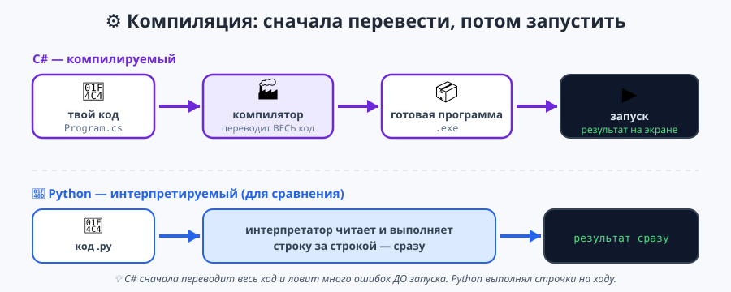
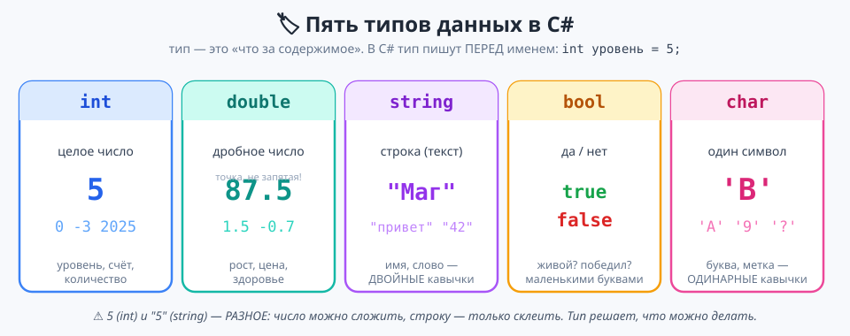
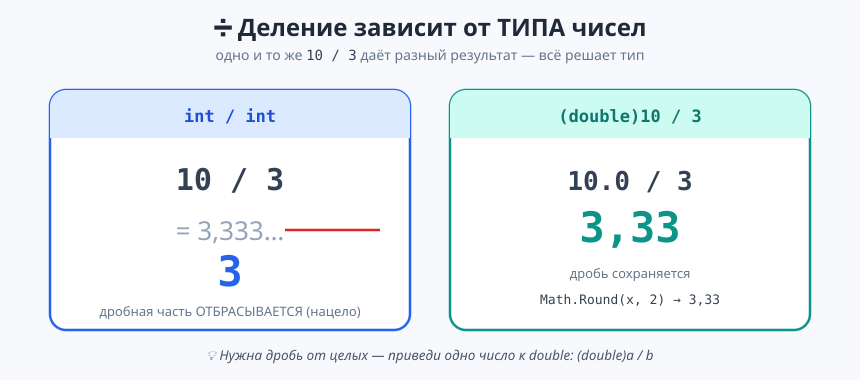
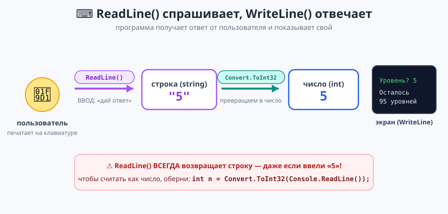

# Урок 1 — 🚀 «Старт C#»: ввод-вывод и типы данных 🧊

**Блок 1 · Синтаксис C# + ООП · Урок 1 из 12 | 2 ак.ч. (1,5 часа)**

> ⬅️ Предыдущий: — (это первый урок курса) · [Все уроки блока](../README.md) · [План курса](../../ПЛАН-КУРСА.md) · Следующий: [Урок 2 «Строки и дата»](../урок-02-строки-и-дата/урок.md) ➡️

> 🔁 В начале — [разминка/повтор](повторение.md) (5 мин).
> 📌 Быстро вспомнить материал урока — [итого.md](итого.md) (шпаргалка).
> 👨‍🏫 Сценарий с хронометражом — в [преподавателю.md](преподавателю.md).
> 🖼 Что показать на проекторе — в [изображения.md](изображения.md).
> 🆘 **Пропустил урок или хочешь закрепить?** Открой [самоучитель.md](самоучитель.md) — теория + задания с подсказками.
> 🧰 Трюки и частые ошибки — в [лайфхак.md](лайфхак.md).

> 🧭 **Как читать урок.** Это **первый урок нового языка**. Целый год вы писали на Python — почти всё уже знакомо (вывод, ввод, переменные, типы). Сегодня мы **переносим знакомые идеи на C#** и знакомимся с новинками: **точка с запятой `;`**, **фигурные скобки `{}`**, **обязательные типы** и класс **`Math`**. К концу урока сделаем **живую программу-анкету**.

> ✍️ **Про имена переменных.** В C# принято называть переменные и методы **по-английски**: переменные — `camelCase` (`heroName`, `playerScore`), методы и константы — `PascalCase` (`Attack`, `MaxLevel`). Мы сразу приучаемся к этому стилю (тексты на экране и комментарии — по-русски, а вот **имена — латиницей**). C# технически разрешает русские имена, но так писать не принято.

---

## 🎮 Что мы сделаем сегодня и что получим

**Задача:** установить среду, написать и **запустить** первую программу, разобраться с типами, научиться **выводить и вводить** данные, считать (в т.ч. через `Math`) и собрать интерактивную «Анкету героя».

**В итоге получится** программа, которая **разговаривает** с пользователем:

```
Как зовут героя? Рыцарь
Какой у героя уровень? 5
=== ВИЗИТКА ГЕРОЯ ===
Имя: Рыцарь
Уровень: 5
До максимума: 95 уровней
```

**Главные навыки урока:** запустить проект C# · вывод `Console.WriteLine` · `;` и `{}` · **типы** `int / double / string / bool / char` · переменная `тип имя = значение;` · интерполяция `$"..."` · **арифметика** `+ - * / %` и деление по типу · **класс `Math`** · **ввод** `Console.ReadLine()` · приведение `Convert.ToInt32(...)` · комментарии.

> 💡 **Главная мысль урока:** в C# **у каждой переменной есть тип, а каждая команда заканчивается `;`**. И ещё: **`ReadLine()` всегда возвращает строку** — чтобы считать как число, её надо превратить (как `int(input())` в Python).

---

## Часть 0 — Разминка: чем C# отличается от Python (5 минут)

**Python (прошлый год):**
```python
name = input("Как зовут? ")
print("Привет,", name)
```

**C# (сегодня):**
```csharp
Console.Write("Как зовут? ");
string name = Console.ReadLine();
Console.WriteLine("Привет, " + name);
```

| Python | C# | Что изменилось |
|--------|-----|----------------|
| `print(...)` | `Console.WriteLine(...)` | другая команда вывода |
| `input(...)` | `Console.ReadLine()` | другая команда ввода |
| `name = "..."` | `string name = "...";` | нужно **сказать тип** и поставить **`;`** |
| отступы задают блок | блок задают **`{ }`** | скобки вместо отступов |
| запускается сразу | сначала **компилируется** | язык проверяет код заранее |

> 🐍 **Мостик из Python.** Идея — та же. Меняется **оформление**: типы, `;`, `{}`. За урок глаз привыкнет.

---

## Часть 1 — Среда и первая программа (7 минут)

C# — **компилируемый** язык: сначала программа-**компилятор** переводит весь ваш код в готовое приложение, и только потом оно запускается. (Python был **интерпретируемым** — выполнял строчки сразу.)



**Дети работают в Visual Studio на Windows.** Учитель на Mac — в VS Code (свёрнутый блок ниже).

### 🪟 Visual Studio (Windows) — основной путь

1. Открой **Visual Studio 2022** → **Create a new project** (Создать новый проект).
2. В поиске набери **Console App**, выбери **Console App (C#)** → **Next**.
3. Имя проекта — например `FirstApp` → **Next**.
4. Framework — **.NET 10.0** → **Create**.
5. Откроется файл **`Program.cs`** со строкой `Console.WriteLine("Hello, World!");`.
6. Нажми зелёную **▶ (Start / F5)** — снизу откроется чёрное окно-консоль с надписью.

🎉 Это твоя первая **скомпилированная** и запущенная программа на C#!

<details>
<summary>🍎 <b>На Mac в VS Code</b> (для учителя) — те же шаги через терминал</summary>

```bash
dotnet --version        # проверить .NET (нужен .NET 10)
dotnet new console      # создать новое консольное приложение
dotnet restore          # пересобрать/восстановить файлы проекта
dotnet run              # скомпилировать и запустить
```
Три главные команды в VS Code: **`dotnet new console`** (создать) → **`dotnet restore`** (пересборка) → **`dotnet run`** (запуск). Полный справочник — в [`справочники/среда-VisualStudio-и-VSCode.md`](../../справочники/среда-VisualStudio-и-VSCode.md).
</details>

> 💡 **Лайфхаки среды.** Напечатай `cw` и дважды нажми **Tab** — Visual Studio сам развернёт `Console.WriteLine();`. А чтобы чёрное окно консоли **не закрывалось сразу** — запускай через **Ctrl+F5** (останется надпись «Press any key»).

> ✍️ **Мини-задание 1 (2 мин):** запусти проект и поменяй текст в кавычках на `Привет, мир C#!`. Запусти снова — текст должен измениться.
> <details><summary>💡 подсказка</summary>Меняешь только то, что <b>внутри кавычек</b>. Не трогай <code>;</code> в конце.</details>

---

## Часть 2 — Вывод, `;`, `{}` и комментарии (10 минут)

**Вывод на экран** — команда `Console.WriteLine(...)`:

```csharp
Console.WriteLine("Первая строка");
Console.WriteLine("Вторая строка");
```

- `WriteLine` («write line») печатает текст и **переходит на новую строку**.
- `Write` — печатает **без** перехода на новую строку:
  ```csharp
  Console.Write("Привет, ");
  Console.Write("мир!");     // получится: Привет, мир!
  ```

**Точка с запятой `;`** — в конце **каждой команды** (как точка в конце предложения).
**Фигурные скобки `{}`** обозначают **блок** — группу команд (позже — тело цикла, условия). В Python это делали отступы.
**Комментарии** — заметки для человека, компьютер их пропускает:
```csharp
// однострочный комментарий (как # в Python)
Console.WriteLine("работаю");   // можно и в конце строки
/* комментарий
   на несколько строк */
```

> ✍️ **Мини-задание 2 (2 мин):** выведи тремя командами три любимые игры (каждую с новой строки) и добавь `//`-комментарий над ними.
> <details><summary>💡 подсказка</summary>Три строки <code>Console.WriteLine("...");</code> — не забудь <code>;</code>.</details>

---

## Часть 3 — Переменные и типы данных (15 минут)

**Переменная** — коробка с именем, куда кладут значение. Отличие от Python: **надо заранее написать тип**.

Схема: `тип   имя   =   значение ;` (имя — по-английски, `camelCase`).

Пять базовых типов на сегодня:

```csharp
int level = 5;             // целое число
double health = 87.5;      // дробное число (через ТОЧКУ!)
string name = "Рыцарь";    // строка (текст) — в ДВОЙНЫХ кавычках
bool alive = true;         // логический: true или false
char heroClass = 'В';      // ОДИН символ — в ОДИНАРНЫХ кавычках
```



Важные детали C# (которых не было в Python):

- **`string` — двойные кавычки `"..."`, `char` — одинарные `'...'`.** `"В"` — строка, `'В'` — один символ. Это разные типы!
- **Дробь в коде — через точку:** `double health = 87.5;` (запятая в коде — ошибка!).
- **`bool` — `true`/`false`** с маленькой буквы (в Python было `True`/`False`).

> 🖥 **Точка в коде — запятая на экране.** В коде дробь всегда через точку (`87.5`), но на **русской** Windows при выводе она покажется **через запятую**: `Здоровье: 87,5`. Это не ошибка — программа подстраивается под страну.

> 💡 **Зачем типы?** Компьютер заранее знает: `level` — целое число, и не даст записать туда текст. Так ошибки ловятся **до** запуска.

**Ещё пример — те же типы про телефон:**
```csharp
string model = "iPhone";   // текст
int memoryGb = 128;        // целое
double priceK = 79.9;      // дробное
bool isNew = false;        // да/нет
char grade = 'A';          // один символ
```
- 👀 Тип подбираем **по смыслу данных**: «сколько штук» — `int`, «с дробью» — `double`, «текст» — `string`, «да/нет» — `bool`, «одна буква» — `char`.

Ещё две мелочи: **`var`** — «сам догадайся о типе» (`var city = "Москва";` — поймёт `string`), и **`const`** — постоянная, которую нельзя менять (`const int MaxLevel = 100;`).

> ✍️ **Мини-задание 3 (3 мин):** заведи 4 переменные о себе: `string name`, `int age`, `double height` (`1.62`), `bool likesCoding`. Пока не выводи — просто объяви.
> <details><summary>💡 подсказка</summary>Каждая строка: <code>тип имя = значение;</code>. Рост — с точкой (<code>double</code>), имя — в двойных кавычках.</details>

---

## Часть 4 — Красивый вывод: интерполяция через `$` (10 минут)

Чтобы вставить переменную прямо в текст, перед кавычками ставят **`$`**, а переменную — в **`{ }`**. Это как **f-строки в Python**, только буква другая:

**Python:** `print(f"Уровень: {level}")`
**C#:** `Console.WriteLine($"Уровень: {level}");`

```csharp
string name = "Маг";
int level = 7;
Console.WriteLine($"Герой {name}, уровень {level}");   // Герой Маг, уровень 7
Console.WriteLine($"Через уровень будет {level + 1}"); // внутри {} можно считать!
```

Можно и «по-старому» — склеить плюсом `+`:
```csharp
Console.WriteLine("Герой " + name + ", уровень " + level);
```
Но `$"..."` читается приятнее — будем пользоваться им.

> ⚠️ Без `$` фигурные скобки выведутся буквально: `Console.WriteLine("Уровень: {level}")` напечатает `Уровень: {level}`. Нужна буква **`$`** перед кавычками!

> ⚠️ `+` у **чисел** складывает (`2 + 3` = `5`), у **строк** склеивает (`"2" + "3"` = `"23"`). Тип решает, что произойдёт.

> ✍️ **Мини-задание 4 (3 мин):** выведи через `$"..."`: `Меня зовут <name>, мне <age> лет`. Возьми переменные из мини-задания 3.
> <details><summary>💡 подсказка</summary><code>Console.WriteLine($"Меня зовут {name}, мне {age} лет");</code></details>

---

## Часть 5 — Арифметика и класс `Math` (13 минут)

Числа в C# считаются как в математике и Python — те же знаки:

```csharp
int a = 10, b = 3;
Console.WriteLine(a + b);   // 13  сложение
Console.WriteLine(a - b);   // 7   вычитание
Console.WriteLine(a * b);   // 30  умножение
Console.WriteLine(a % b);   // 1   ОСТАТОК от деления
```

**Приоритет как в математике:** сначала `*` и `/`, потом `+` и `-`; скобки главнее:
```csharp
Console.WriteLine(2 + 3 * 4);     // 14  (сначала 3*4)
Console.WriteLine((2 + 3) * 4);   // 20  (скобки главнее)
```

⭐ **Тонкость C#, которой не было в Python: деление зависит от типа чисел.**
```csharp
Console.WriteLine(10 / 3);     // 3     — оба int, делится НАЦЕЛО (дробь отбрасывается)
Console.WriteLine(10.0 / 3);   // 3,33… — есть double, делится дробно
```
Если целые лежат в переменных, а нужна дробь — приведи одно к `double`:
```csharp
int a = 10, b = 3;
Console.WriteLine((double)a / b);                // 3,333…
```



### 🧮 Класс `Math` — готовые математические функции

Не нужно писать формулы вручную — многое уже готово в классе **`Math`**:

```csharp
Math.Round(3.14159, 2)   // 3,14   — округлить до 2 знаков
Math.Max(7, 10)          // 10     — большее из двух
Math.Min(7, 10)          // 7      — меньшее из двух
Math.Abs(-5)             // 5      — модуль (число без знака)
Math.Pow(2, 10)          // 1024   — степень: 2 в 10-й
Math.Sqrt(144)           // 12     — квадратный корень
Math.PI                  // 3,1415… — число пи
```

Пример — площадь круга через `Math`:
```csharp
double r = 5;
double area = Math.PI * Math.Pow(r, 2);          // π·r²
Console.WriteLine($"Площадь круга: {Math.Round(area, 2)}");   // 78,54
```

- 👀 `%` (остаток) полезен: `n % 2 == 0` проверяет чётность. `Math.Round(x, 2)` округляет. `Math.Max/Min` избавляют от лишних `if`.

> ✍️ **Мини-задание 5 (3 мин):** заведи `int apples = 17` и `int kids = 5`. Выведи, сколько яблок каждому (`apples / kids`) и сколько останется (`apples % kids`). Потом выведи `Math.Max(apples, kids)`.
> <details><summary>💡 подсказка</summary>Целое деление <code>17 / 5</code> = 3, остаток <code>17 % 5</code> = 2. <code>Math.Max(17, 5)</code> = 17.</details>

---

## Часть 6 — Ввод с клавиатуры: `ReadLine` и приведение (15 минут)

Пока программа только «говорила». Научим её **слушать** — читать то, что пользователь напечатал.

**Ввод — команда `Console.ReadLine()`.** Она ждёт, пока пользователь напечатает строку и нажмёт Enter, и **возвращает введённый текст**:

```csharp
Console.Write("Как тебя зовут? ");
string name = Console.ReadLine();
Console.WriteLine($"Привет, {name}!");
```

- 👀 Обычно перед вводом делают `Console.Write(...)` (без `Line`) — чтобы курсор остался на той же строке, сразу после вопроса.

> ⚠️ **Главная ловушка (как в Python!):** `ReadLine()` **всегда возвращает строку** — даже если пользователь ввёл число. Строку **нельзя** складывать как число:
> ```csharp
> Console.Write("Твой возраст? ");
> string age = Console.ReadLine();
> // age + 1  ← так НЕЛЬЗЯ: age это текст, а не число
> ```

**Чтобы считать введённое как число — его надо превратить (привести к типу).** В Python оборачивали в `int(...)`, в C# — используем `Convert.ToInt32(...)`:



```csharp
Console.Write("Твой возраст? ");
int age = Convert.ToInt32(Console.ReadLine());   // строку → в целое число
Console.WriteLine($"Через год тебе {age + 1}");   // теперь считается верно
```

Сравни: **Python** `age = int(input("Возраст? "))` → **C#** `int age = Convert.ToInt32(Console.ReadLine());`. Та же идея: сначала спросить, потом превратить в число.

> 🟡 **Про жёлтую линию.** Visual Studio может подчеркнуть `Console.ReadLine()` **жёлтой** волнистой линией. Это **предупреждение, не ошибка** — программа работает. Причину (про «пустой ввод») разберём позже; пока не обращай внимания.

> ✍️ **Мини-задание 6 (3 мин):** спроси у пользователя его любимое число, прибавь к нему 10 и выведи результат.
> <details><summary>💡 подсказка</summary><code>int n = Convert.ToInt32(Console.ReadLine());</code>, затем <code>Console.WriteLine(n + 10);</code>.</details>

---

## Часть 7 — 🏆 Проект «Анкета героя» (10 минут)

Соберём всё вместе: программа спрашивает имя и уровень, считает и печатает визитку. Готовый код — в [`материалы/Program.cs`](материалы/Program.cs):

```csharp
// Анкета героя — спрашиваем, считаем, выводим
const int MaxLevel = 100;

Console.Write("Как зовут героя? ");
string name = Console.ReadLine();               // строка — как есть

Console.Write("Какой у героя уровень? ");
int level = Convert.ToInt32(Console.ReadLine());   // число — превращаем

Console.WriteLine("=== ВИЗИТКА ГЕРОЯ ===");
Console.WriteLine($"Имя: {name}");
Console.WriteLine($"Уровень: {level}");
Console.WriteLine($"До максимума: {MaxLevel - level} уровней");
```

Пример работы:
```
Как зовут героя? Рыцарь
Какой у героя уровень? 5
=== ВИЗИТКА ГЕРОЯ ===
Имя: Рыцарь
Уровень: 5
До максимума: 95 уровней
```

- 👀 Имя читаем как **строку**, уровень — **превращаем в число** через `Convert.ToInt32`, иначе `MaxLevel - level` не посчитается. Вывод — через `$"..."`.

> 🧩 **Для 5–7 классов:** спроси имя и уровень, выведи их через `$"..."`. 🎓 **Глубже:** добавь `level * 100` (очки опыта) и `const` максимум.

> ✍️ **Мини-задание 7 (3 мин):** доработай анкету — спроси ещё «сколько золота у героя?» (число) и выведи, сколько станет после награды `+50`.
> <details><summary>💡 подсказка</summary><code>int gold = Convert.ToInt32(Console.ReadLine());</code>, вывод <code>$"Станет: {gold + 50}"</code>.</details>

---

## 🐞 Разбор частых ошибок

| Симптом (что скажет C#) | Что случилось | Как починить |
|-------------------------|---------------|--------------|
| `; expected` | забыл точку с запятой | поставь `;` в конце команды |
| `} expected` / `{ expected` | не хватает фигурной скобки | скобки всегда парами `{ }` |
| `Console.Writeline не существует` | ошибка в регистре | правильно `Console.WriteLine` (большие W, L) |
| выводит `{name}` буквально | забыл `$` перед кавычками | `$"...{name}..."` |
| `cannot convert string to int` | сложил строку как число: `age + 1`, где age — текст | сначала `Convert.ToInt32(...)`, потом считай |
| `System.FormatException` при запуске | в число ввели не число (буквы/пусто) | вводить только цифры; проверку добавим позже |
| `'В' — too many characters` | в `char` больше одного символа или двойные кавычки | `char` — один символ в одинарных: `'В'` |
| дробь-ошибка | написал `87,5` в коде через запятую | в коде дробь через **точку**: `87.5` |
| `True`/`False` не работает | написал с большой буквы | в C# — `true`/`false` |

> ⚠️ **Главное правило:** `ReadLine()` даёт **строку**. Для счёта — оберни в `Convert.ToInt32(...)`. Тип + имя + `=` + значение + `;`.

---

## 🎓 Глубже

**Второй способ превратить строку в число** — `int.Parse`:
```csharp
int n = int.Parse(Console.ReadLine());   // то же, что Convert.ToInt32
```
Оба работают; `Convert.ToInt32` чуть «мягче». Для дробного — `Convert.ToDouble(...)`.

**Как выглядит «полная» программа.** Строка `Console.WriteLine(...)` живёт внутри метода `Main`. В новых проектах это спрятано (можно писать код сразу), но «под капотом»:
```csharp
class Program
{
    static void Main()
    {
        Console.WriteLine("Привет!");
    }
}
```
Вернёмся к `class` и `Main` в уроках про методы и ООП (10–11).

**Ещё из `Math`:** `Math.Floor(x)` (вниз), `Math.Ceiling(x)` (вверх), `Math.Truncate(x)` (отбросить дробь). Пригодятся дальше.

---

## 🧩 Для 5–7 классов

- Вывод: `Console.WriteLine("текст");` — не забудь `;`.
- Переменная: `тип имя = значение;` (имя латиницей: `int level = 5;`).
- 5 типов: `int`, `double` (точка!), `string` (`"..."`), `bool` (`true/false`), `char` (`'...'`).
- Красивый вывод: `Console.WriteLine($"Уровень: {level}");` (как f-строки).
- Арифметика: `+ - * / %`; `10 / 3` целых = `3` (нацело), для дроби — `(double)a / b`; `Math.Round/Max/Min`.
- Ввод: `string name = Console.ReadLine();`; число — `Convert.ToInt32(Console.ReadLine())`.
- Проект: анкета героя (спросить → посчитать → вывести).

---

## 🏁 Итог урока (5 минут)

Первый шаг в C# сделан — и программа уже **разговаривает**:

- ✅ Создали, **скомпилировали** и запустили проект (Visual Studio / VS Code).
- ✅ Вывод — `Console.WriteLine(...)`; команда заканчивается **`;`**, блоки — в **`{}`**.
- ✅ Пять типов: `int`, `double`, `string`, `bool`, `char`; имена переменных — **по-английски** (`camelCase`).
- ✅ Красивый вывод через **`$"...{переменная}..."`** (как f-строки).
- ✅ Арифметика `+ - * / %`; **деление зависит от типа**; класс **`Math`** (`Round/Max/Min/Abs/Pow/Sqrt`).
- ✅ Ввод — `Console.ReadLine()` (**всегда строка!**); число — через `Convert.ToInt32(...)`.
- ✅ Собрали интерактивную «Анкету героя».

> 🎉 **Ты перешёл с Python на C#!** Главное новое — **типы**, **`;`** и превращение ввода в число. Дальше — строки и дата, условия, циклы. Быстро повторить — в [итого.md](итого.md).

> 🎤 **Блиц:** чем вывести текст? что ставят в конце команды? зачем `$` перед кавычками? что вернёт `Math.Max(7, 10)`? что возвращает `ReadLine()`?

### 🎮 Викторина-закрепление
Открой **[викторина.html](викторина.html)** — вопросы по типам, вводу-выводу + смешные и «на подумать».

➡️ **Практика урока** — **[практика.md](практика.md)**: задачи в 3 уровнях.
🆘 **Пропустил / хочешь ещё?** — [самоучитель.md](самоучитель.md) (теория + задания с подсказками).
🧰 **Трюки и ошибки** — [лайфхак.md](лайфхак.md). 📌 **Шпаргалка** — [итого.md](итого.md).

---

## 🔗 Навигация и материалы

⬅️ **Предыдущий:** — · [Все уроки блока](../README.md) · [План курса](../../ПЛАН-КУРСА.md) · **Следующий:** [Урок 2 «Строки и дата»](../урок-02-строки-и-дата/урок.md) ➡️

**🧰 Инструменты:** [.NET 10 SDK](https://dotnet.microsoft.com/download) · **Windows:** [Visual Studio 2022](https://visualstudio.microsoft.com/) · **Mac:** [VS Code](https://code.visualstudio.com/) + C# Dev Kit. Настройка обеих сред — [`справочники/среда-VisualStudio-и-VSCode.md`](../../справочники/среда-VisualStudio-и-VSCode.md).
**📄 Готовый код:** [`материалы/Program.cs`](материалы/Program.cs) (анкета героя).
**⚙️ Учителю:** сценарий и частые ошибки — в [преподавателю.md](преподавателю.md).
