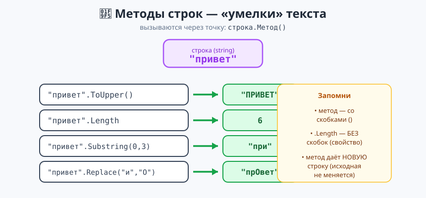
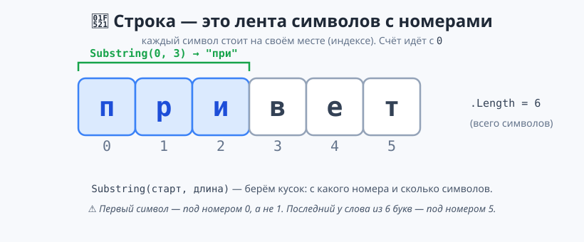

# Урок 2 — 🧵 «Строки»: работа с текстом + дата 🔡

**Блок 1 · Синтаксис C# + ООП · Урок 2 из 12 | 2 ак.ч. (1,5 часа)**

> ⬅️ Предыдущий: [Урок 1 «Старт C#: ввод-вывод и типы»](../урок-01-старт-и-типы/урок.md) · [Все уроки блока](../README.md) · [План курса](../../ПЛАН-КУРСА.md) · Следующий: [Урок 3 «Условия»](../урок-03-условия/урок.md) ➡️

> 🔁 В начале — [разминка/повтор](повторение.md) (5 мин).
> 📌 Быстро вспомнить материал урока — [итого.md](итого.md) (шпаргалка).
> 👨‍🏫 Сценарий с хронометражом — в [преподавателю.md](преподавателю.md).
> 🖼 Что показать на проекторе — в [изображения.md](изображения.md).
> 🆘 **Пропустил урок или хочешь закрепить?** Открой [самоучитель.md](самоучитель.md) — теория + задания с подсказками.
> 🧰 Трюки и частые ошибки — в [лайфхак.md](лайфхак.md).

> 🧭 **Как читать урок.** Сегодня целиком посвятим урок **тексту (строкам)** и **дате-времени** — с этим программы работают постоянно. У строки и у даты в C# есть **методы** — «умелки», которые вызываются через точку (`name.ToUpper()`, `date.AddDays(7)`). В конце соберём «Профиль / анализатор имени» с датой. Помни: **имена переменных — по-английски** (`camelCase`).

---

## 🎮 Что мы сделаем сегодня и что получим

**Задача:** обрабатывать текст (регистр, длина, куски, поиск, замена) и работать с датой (форматы, разница дат, «сколько дней до…»); собрать программу-профиль.

**В итоге получится** (пример работы):

```
Имя:   аня
Фамилия: Котова
=== ПРОФИЛЬ ===
Привет, АНЯ!
В имени 3 букв.
Первая буква: а
Инициалы: а.К.
Логин: аня6
Дата регистрации: 18.08.2026
```

**Главные навыки урока:** длина `.Length` · регистр `.ToUpper()/.ToLower()` · очистка `.Trim()` · замена `.Replace()` · кусок `.Substring()` · символ `s[0]` · поиск `.Contains()/.StartsWith()/.IndexOf()` · цепочки методов · **`DateTime`**: `.Year/.Month/.Day/.DayOfWeek`, форматы, разница дат `TimeSpan`, `.AddDays()`.

> 💡 **Главная мысль урока:** **строка и дата умеют многое — через методы (точка + действие).** Важно: методы строк **не меняют** строку, а **возвращают новую**; `.Length` пишется **без скобок**.

---

## Часть 0 — Разминка: строки в Python и C# (5 минут)

| Что | Python | C# |
|-----|--------|-----|
| Длина | `len(s)` | `s.Length` (без скобок!) |
| ВЕРХНИЙ регистр | `s.upper()` | `s.ToUpper()` |
| нижний регистр | `s.lower()` | `s.ToLower()` |
| Кусок строки | `s[0:3]` | `s.Substring(0, 3)` |
| Первый символ | `s[0]` | `s[0]` (так же!) |
| Замена | `s.replace("а","о")` | `s.Replace("а","о")` |

> 🐍 **Мостик:** идеи те же, но методы в C# — **с большой буквы** и через точку. И `Length` — **свойство** (без скобок).

---

## Часть 1 — Склейка, длина и интерполяция (10 минут)

**Склейка строк** — плюсом `+`, как в Python:
```csharp
string firstName = "Гарри";
string lastName = "Поттер";
Console.WriteLine(firstName + " " + lastName);     // Гарри Поттер
```

**Но удобнее — интерполяция `$"..."`** (с прошлого урока):
```csharp
Console.WriteLine($"{firstName} {lastName}");       // Гарри Поттер
Console.WriteLine($"Полное имя: {firstName} {lastName}, привет!");
```

**Длина строки — свойство `.Length`** (без скобок!):
```csharp
Console.WriteLine(firstName.Length);                // 5
string password = "qwerty123";
Console.WriteLine($"Длина пароля: {password.Length} символов");  // 9
```

> ⚠️ `.Length` — **без** скобок (это свойство). Со скобками `Length()` — ошибка.

> ✍️ **Мини-задание 1 (3 мин):** заведи `string word = "программирование"` и выведи `В слове ... букв`.
> <details><summary>💡 подсказка</summary><code>word.Length</code> внутри <code>$"..."</code>.</details>

---

## Часть 2 — Регистр и очистка: `ToUpper`, `ToLower`, `Trim`, `Replace` (12 минут)

У строки есть **методы** — действия через точку `строка.Метод()`:

```csharp
string word = "Привет";
Console.WriteLine(word.ToUpper());        // ПРИВЕТ  — всё заглавными
Console.WriteLine(word.ToLower());        // привет  — всё строчными
Console.WriteLine(word.Replace("и", "О"));// ПрОвет  — заменить букву
```



**`Trim()` — убирает пробелы по краям** (частая проблема при вводе), а методы **соединяются цепочкой**:
```csharp
string input = "   аня   ";
Console.WriteLine(input.Trim());            // "аня"
Console.WriteLine(input.Trim().ToUpper());  // "АНЯ" — сначала обрезали, потом заглавными
```

**Второй пример — оформляем город, введённый неаккуратно:**
```csharp
string city = "  москва  ";
string pretty = city.Trim().ToUpper();      // "МОСКВА"
Console.WriteLine($"Город: {pretty}");
```

> ⚠️ **Метод возвращает НОВУЮ строку, а старую не меняет!**
> ```csharp
> string s = "привет";
> s.ToUpper();              // результат никуда не сохранили — s осталась "привет"
> s = s.ToUpper();          // ✅ вот так s станет "ПРИВЕТ"
> ```

> ✍️ **Мини-задание 2 (3 мин):** спроси город (можно с пробелами) и выведи его без пробелов и ЗАГЛАВНЫМИ.
> <details><summary>💡 подсказка</summary><code>Console.ReadLine().Trim().ToUpper()</code>.</details>

---

## Часть 3 — Куски строки: `Substring` и индексы (12 минут)

Строка — это **лента символов**, у каждого свой **номер (индекс)**. Счёт идёт **с 0**:



**Один символ — по индексу** (как в Python), **кусок — метод `Substring(старт, длина)`:**
```csharp
string s = "привет";
Console.WriteLine(s[0]);               // п — первый символ (номер 0!)
Console.WriteLine(s.Substring(0, 3));  // при  — с 0-го символа, 3 штуки
Console.WriteLine(s.Substring(3));     // вет  — с 3-го и до конца
```

**Пример — прячем телефон, показываем только последние цифры:**
```csharp
string phone = "9161234567";
Console.WriteLine($"***{phone.Substring(phone.Length - 4)}");  // ***4567
```

- 👀 `phone.Length - 4` — индекс, с которого начинаются последние 4 цифры. Индекс последнего символа = `Length - 1`.

> ⚠️ Не выходи за границы: у слова из 6 букв индексы `0..5`. `s[6]` или `Substring(10)` → ошибка `IndexOutOfRange` / `ArgumentOutOfRange`.

> ✍️ **Мини-задание 3 (3 мин):** заведи `string word = "динозавр"` и выведи его первые 4 буквы и первый символ отдельно.
> <details><summary>💡 подсказка</summary><code>word.Substring(0, 4)</code> и <code>word[0]</code>.</details>

---

## Часть 4 — Поиск в строке: `Contains`, `StartsWith`, `IndexOf` (10 минут)

Иногда нужно проверить, **есть ли** что-то в строке:

```csharp
string phrase = "я люблю программировать";
Console.WriteLine(phrase.Contains("люблю"));    // True  — есть ли внутри
Console.WriteLine(phrase.StartsWith("я"));      // True  — начинается ли с
Console.WriteLine(phrase.EndsWith("вать"));     // True  — заканчивается ли на
Console.WriteLine(phrase.IndexOf("люблю"));     // 2     — с какого индекса (или -1, если нет)
```

- 👀 `Contains/StartsWith/EndsWith` дают `true`/`false` (тип `bool` — пригодится в «Условиях»). `IndexOf` возвращает **номер** или **-1**.

```csharp
string email = "ivan@mail.ru";
Console.WriteLine($"Похоже на почту: {email.Contains("@")}");   // True
```

> 💡 **Лайфхак: поиск учитывает регистр.** `"Кот".Contains("кот")` даст `False`. Чтобы искать без учёта регистра — приведи к одному: `phrase.ToLower().Contains("кот")`.

> ✍️ **Мини-задание 4 (3 мин):** спроси слово и проверь (`true/false`), содержит ли оно букву «а».
> <details><summary>💡 подсказка</summary><code>word.Contains("а")</code>.</details>

---

## Часть 5 — ⭐ Дата и время: `DateTime` и `TimeSpan` (16 минут)

Дата и время — целый мир методов. Текущий момент даёт **`DateTime.Now`**, а из него можно достать **части**:

```csharp
DateTime now = DateTime.Now;
Console.WriteLine(now.Year);        // год, напр. 2026
Console.WriteLine(now.Month);       // номер месяца (8)
Console.WriteLine(now.Day);         // число месяца (18)
Console.WriteLine(now.Hour);        // час
Console.WriteLine(now.Minute);      // минута
Console.WriteLine(now.DayOfWeek);   // день недели (по-английски: Tuesday)
```

**Формат вывода — `ToString(шаблон)`** (буквы формата важны!):
```csharp
Console.WriteLine(now.ToString("dd.MM.yyyy"));  // 18.08.2026  (день.месяц.год)
Console.WriteLine(now.ToString("HH:mm"));       // 19:18       (часы:минуты)
Console.WriteLine(now.ToString("dd.MM.yyyy HH:mm")); // дата и время вместе
```
- `dd` — день, `MM` — **месяц (большие буквы!)**, `yyyy` — год, `HH` — часы, `mm` — минуты.

**Конкретная дата — `new DateTime(год, месяц, день)`:**
```csharp
DateTime birthday = new DateTime(2013, 5, 20);
```

**Разница двух дат — это `TimeSpan` (промежуток):**
```csharp
TimeSpan lived = DateTime.Now - birthday;
Console.WriteLine($"Прожито дней: {lived.Days}");            // напр. 4838
Console.WriteLine($"Всего часов: {(int)lived.TotalHours}");  // напр. 116131
```
- 👀 `.Days` — целых дней; `.TotalHours` / `.TotalDays` — весь промежуток в часах/днях (дробное).

**Прибавить/отнять время — `AddDays`, `AddYears`…:**
```csharp
Console.WriteLine(DateTime.Now.AddDays(7).ToString("dd.MM.yyyy"));   // через неделю
Console.WriteLine(DateTime.Now.AddYears(1).ToString("dd.MM.yyyy"));  // через год
```

**Пример — сколько дней до Нового года:**
```csharp
DateTime newYear = new DateTime(DateTime.Now.Year + 1, 1, 1);
int daysLeft = (newYear - DateTime.Now).Days;
Console.WriteLine($"До Нового года: {daysLeft} дней");
```

> 🐍 **Мостик:** это как `datetime` в Python — «дата минус дата = промежуток». `.AddDays` — как `timedelta`.
> 🌍 День недели `DayOfWeek` выводится **по-английски** (`Tuesday`). Показывать по-русски научимся позже (форматирование по культуре).

> ✍️ **Мини-задание 5 (4 мин):** выведи сегодняшнюю дату в формате `дд.мм.гггг`, текущее время `HH:mm` и дату через 30 дней.
> <details><summary>💡 подсказка</summary><code>DateTime.Now.ToString("HH:mm")</code>, <code>DateTime.Now.AddDays(30).ToString("dd.MM.yyyy")</code>.</details>

---

## Часть 6 — 🏆 Проект «Профиль / анализатор имени» (14 минут)

Соберём всё в одну программу. Готовый код — в [`материалы/Program.cs`](материалы/Program.cs):

```csharp
Console.Write("Имя: ");
string firstName = Console.ReadLine().Trim();          // читаем и убираем пробелы
Console.Write("Фамилия: ");
string lastName = Console.ReadLine().Trim();

Console.WriteLine("=== ПРОФИЛЬ ===");
Console.WriteLine($"Привет, {firstName.ToUpper()}!");
Console.WriteLine($"В имени {firstName.Length} букв.");
Console.WriteLine($"Первая буква: {firstName[0]}");
Console.WriteLine($"Инициалы: {firstName.Substring(0, 1)}.{lastName.Substring(0, 1)}.");
Console.WriteLine($"Логин: {firstName.ToLower()}{lastName.Length}");   // напр. аня6
Console.WriteLine($"Дата: {DateTime.Now.ToString("dd.MM.yyyy")}");
```

Пример работы:
```
Имя:   аня
Фамилия: Котова
=== ПРОФИЛЬ ===
Привет, АНЯ!
В имени 3 букв.
Первая буква: а
Инициалы: а.К.
Логин: аня6
Дата: 18.08.2026
```

- 👀 `Console.ReadLine().Trim()` — прочитали и сразу очистили. Инициалы — через `Substring(0,1)`, логин — из имени строчными + длины фамилии.

> 🧩 **Для 5–7 классов:** выведи имя заглавными и его длину. 🎓 **Глубже:** добавь инициалы, логин, дату и «сколько дней ты живёшь» от своей даты рождения.

> ✍️ **Мини-задание 6 (3 мин):** добавь в профиль строку «Ты живёшь уже N дней» — посчитай `(DateTime.Now - new DateTime(2013,5,20)).Days`.
> <details><summary>💡 подсказка</summary>Заведи <code>DateTime birthday = new DateTime(...)</code> и выведи <code>(DateTime.Now - birthday).Days</code>.</details>

---

## 🐞 Разбор частых ошибок

| Симптом | Что случилось | Как починить |
|---------|---------------|--------------|
| `'string' does not contain 'Length()'` | написал `Length()` со скобками | `.Length` — **без** скобок |
| строка не изменилась после `ToUpper()` | метод возвращает НОВУЮ строку | `s = s.ToUpper();` или выведи результат |
| `IndexOutOfRangeException` (`s[10]`) | взял символ за границей | индексы `0..Length-1` |
| `ArgumentOutOfRangeException` (`Substring`) | кусок длиннее строки | не выходи за `Length` |
| `IndexOf` вернул `-1` | искомого нет в строке | `-1` значит «не найдено» |
| дата вывелась «наоборот» | перепутал формат | `dd.MM.yyyy` (дни-месяц-год); `MM` — большие! |
| `mm` вместо месяца | `mm` — это минуты | месяц — `MM` (заглавные) |

> ⚠️ **Главное правило:** методы строк (`.ToUpper()`, `.Substring()`) — со скобками, возвращают новую строку; `.Length` — без скобок. Дата: `ToString("dd.MM.yyyy")`, разница дат — `TimeSpan` с `.Days`.

---

## 🎓 Глубже

**Ещё методы строк:** `.Insert(i, "текст")`, `.Remove(i, n)`, `.PadLeft(n)`/`.PadRight(n)` (дополнить пробелами), `string.IsNullOrEmpty(s)` (пустая ли строка).

**Разбить строку на части — `Split`:**
```csharp
string fullName = "Иван Петров";
string[] parts = fullName.Split(' ');   // ["Иван", "Петров"] — массив (Урок 6)
Console.WriteLine(parts[0]);            // Иван
```

**Ещё про дату:** `DateTime.Today` (без времени), `DateTime.Now.AddMonths(3)`, `date.ToShortDateString()`, `TimeSpan.FromMinutes(90)`. Дни недели по-русски — через `CultureInfo` (позже).

**Спецсимволы в строке:** `\n` — новая строка, `\t` — табуляция, `\"` — кавычка внутри строки.

---

## 🧩 Для 5–7 классов

- Длина: `name.Length` (без скобок); регистр: `name.ToUpper()`, `name.ToLower()`.
- Очистка пробелов: `name.Trim()`; кусок: `name.Substring(0, 3)`; символ: `name[0]` (с 0).
- Поиск: `phrase.Contains("...")` → `true/false`.
- Дата: `DateTime.Now`, формат `ToString("dd.MM.yyyy")`, разница дат `.Days`, `AddDays()`.
- Проект: профиль из методов строк + дата.

---

## 🏁 Итог урока (5 минут)

Программа научилась работать с текстом и датой:

- ✅ Длина — `.Length` (без скобок); склейка `+` и `$"..."`.
- ✅ Регистр и очистка: `.ToUpper()/.ToLower()/.Trim()/.Replace()`; методы **возвращают новую строку**.
- ✅ Куски: `.Substring(старт, длина)`, символ `s[0]` (индексы с 0); поиск `.Contains()/.IndexOf()`.
- ✅ **`DateTime`**: части даты (`.Year/.Day/.DayOfWeek`), форматы `ToString(...)`, разница дат `TimeSpan.Days`, `.AddDays()`.
- ✅ Собрали «Профиль / анализатор имени».

> 🎉 Теперь программа управляется с текстом и датами. Дальше — **условия**: `Contains`/`bool` там очень пригодятся! Быстро повторить — в [итого.md](итого.md).

> 🎤 **Блиц:** как узнать длину строки? что вернёт `Substring(0,3)`? как вывести дату `дд.мм.гггг`? как узнать, сколько дней между датами? что делает `AddDays(7)`?

### 🎮 Викторина-закрепление
Открой **[викторина.html](викторина.html)** — вопросы по строкам и дате + смешные и «на подумать».

➡️ **Практика урока** — **[практика.md](практика.md)**: задачи в 3 уровнях.
🆘 **Пропустил / хочешь ещё?** — [самоучитель.md](самоучитель.md) (теория + задания с подсказками).
🧰 **Трюки и ошибки** — [лайфхак.md](лайфхак.md). 📌 **Шпаргалка** — [итого.md](итого.md).

---

## 🔗 Навигация и материалы

⬅️ **Предыдущий:** [Урок 1 «Старт C#: ввод-вывод и типы»](../урок-01-старт-и-типы/урок.md) · [Все уроки блока](../README.md) · [План курса](../../ПЛАН-КУРСА.md) · **Следующий:** [Урок 3 «Условия»](../урок-03-условия/урок.md) ➡️

**🧰 Инструменты:** [.NET 10 SDK](https://dotnet.microsoft.com/download) · **Windows:** [Visual Studio 2022](https://visualstudio.microsoft.com/) · **Mac:** [VS Code](https://code.visualstudio.com/) + C# Dev Kit. Настройка обеих сред — [`справочники/среда-VisualStudio-и-VSCode.md`](../../справочники/среда-VisualStudio-и-VSCode.md).
**📄 Готовый код:** [`материалы/Program.cs`](материалы/Program.cs) (профиль / анализатор имени).
**⚙️ Учителю:** сценарий и частые ошибки — в [преподавателю.md](преподавателю.md).
