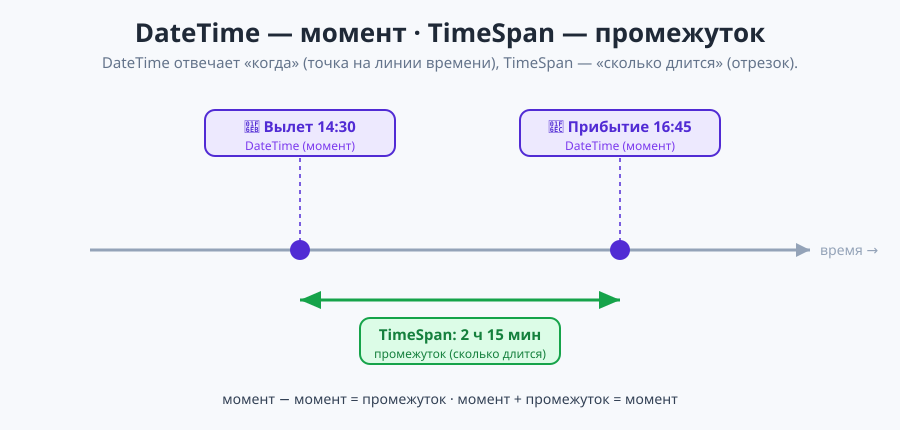
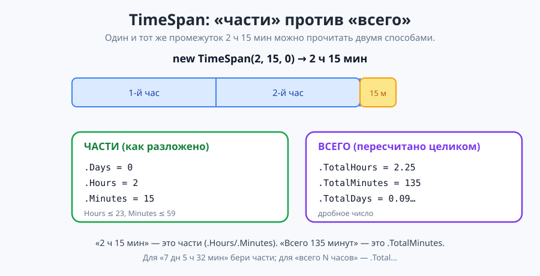

# Урок 2 — 🧵 «Строки»: работа с текстом + дата 🔡

**Блок 1 · Синтаксис C# + ООП · Урок 2 из 12 | 2 ак.ч. (1,5 часа)**

> ⬅️ Предыдущий: [Урок 1 «Старт C#: ввод-вывод и типы»](../урок-01-старт-и-типы/урок.md) · [Все уроки блока](../README.md) · [План курса](../../ПЛАН-КУРСА.md) · Следующий: [Урок 3 «Условия»](../урок-03-условия/урок.md) ➡️

> 🔁 В начале — [разминка/повтор](повторение.md) (5 мин).
> 📌 Быстро вспомнить материал урока — [итого.md](итого.md) (шпаргалка).
> 👨‍🏫 Сценарий с хронометражом — в [преподавателю.md](преподавателю.md).
> 🖼 Что показать на проекторе — в [изображения.md](изображения.md).
> 🆘 **Пропустил урок или хочешь закрепить?** Открой [самоучитель.md](самоучитель.md) — теория + задания с подсказками.
> 🧰 Трюки и частые ошибки — в [лайфхак.md](лайфхак.md).

> 🧭 **Как читать урок.** Сегодня целиком посвятим урок **тексту (строкам)** и **дате-времени** — с этим программы работают постоянно. У строки и у даты в C# есть **методы** — «умелки», которые вызываются через точку (`name.ToUpper()`, `date.AddDays(7)`). Особое внимание — **`DateTime` (момент) и `TimeSpan` (промежуток)**: их будем использовать дальше очень часто. В конце соберём «Табло аэропорта», которое считает время регистрации, посадки и прибытия. Помни: **имена переменных — по-английски** (`camelCase`).

---

## 🎮 Что мы сделаем сегодня и что получим

**Задача:** обрабатывать текст (регистр, длина, куски, поиск, замена) и работать с датой-временем (форматы, разница дат, «сколько времени до…»); собрать «Табло аэропорта».

**В итоге получится** (пример работы):

```
Откуда летим (город): Казань
Куда летим (город): Сочи
Дата и время вылета:
  год: 2026
  месяц: 9
  день: 20
  час: 14
  минуты: 30
За сколько минут до вылета регистрация: 120
За сколько минут до вылета посадка: 40
Сколько лететь:
  часов: 2
  минут: 15

=== ВАШ РЕЙС ===
Регистрация в аэропорту города Казань начнётся через 7 дн 1 ч 17 мин, а посадка — через 7 дн 2 ч 37 мин.
В аэропорт города Сочи прибудете через 7 дн 5 ч 32 мин — в 16:45 (20.09.2026).
Полёт продлится 2 ч 15 мин.
```

**Главные навыки урока:** длина `.Length` · регистр `.ToUpper()/.ToLower()` · очистка `.Trim()` · замена `.Replace()` · кусок `.Substring()` · символ `s[0]` · поиск `.Contains()/.StartsWith()/.IndexOf()` · цепочки методов · **`DateTime`** (момент): части `.Year/.Day/.DayOfWeek`, форматы · **`TimeSpan`** (промежуток): `.Days/.Hours/.Minutes` vs `.TotalHours/.TotalDays`, `new TimeSpan(...)`, `TimeSpan.FromMinutes(...)` · арифметика дат (`дата − дата = промежуток`, `дата ± промежуток = дата`), `.AddDays()`.

> 💡 **Главная мысль урока:** **строка и дата умеют многое — через методы (точка + действие).** А ещё запомни разницу: **`DateTime` — это МОМЕНТ** («когда», точка на календаре), **`TimeSpan` — это ПРОМЕЖУТОК** («сколько длится», отрезок). Методы строк **не меняют** строку, а **возвращают новую**; `.Length` — **без скобок**.

---

## Часть 0 — Разминка: строки в Python и C# (5 минут)

| Что | Python | C# |
|-----|--------|-----|
| Длина | `len(s)` | `s.Length` (без скобок!) |
| ВЕРХНИЙ регистр | `s.upper()` | `s.ToUpper()` |
| нижний регистр | `s.lower()` | `s.ToLower()` |
| Кусок строки | `s[0:3]` | `s.Substring(0, 3)` |
| Первый символ | `s[0]` | `s[0]` (так же!) |
| Замена | `s.replace("а","о")` | `s.Replace("а","о")` |

> 🐍 **Мостик:** идеи те же, но методы в C# — **с большой буквы** и через точку. И `Length` — **свойство** (без скобок).

---

## Часть 1 — Склейка, длина и интерполяция (10 минут)

**Склейка строк** — плюсом `+`, как в Python:
```csharp
string firstName = "Гарри";
string lastName = "Поттер";
Console.WriteLine(firstName + " " + lastName);     // Гарри Поттер
```

**Но удобнее — интерполяция `$"..."`** (с прошлого урока):
```csharp
Console.WriteLine($"{firstName} {lastName}");       // Гарри Поттер
Console.WriteLine($"Полное имя: {firstName} {lastName}, привет!");
```

**Длина строки — свойство `.Length`** (без скобок!):
```csharp
Console.WriteLine(firstName.Length);                // 5
string password = "qwerty123";
Console.WriteLine($"Длина пароля: {password.Length} символов");  // 9
```

> ⚠️ `.Length` — **без** скобок (это свойство). Со скобками `Length()` — ошибка.

> ✍️ **Мини-задание 1 (3 мин):** заведи `string word = "программирование"` и выведи `В слове ... букв`.
> <details><summary>💡 подсказка</summary><code>word.Length</code> внутри <code>$"..."</code>.</details>

---

## Часть 2 — Регистр и очистка: `ToUpper`, `ToLower`, `Trim`, `Replace` (12 минут)

У строки есть **методы** — действия через точку `строка.Метод()`:

```csharp
string word = "Привет";
Console.WriteLine(word.ToUpper());        // ПРИВЕТ  — всё заглавными
Console.WriteLine(word.ToLower());        // привет  — всё строчными
Console.WriteLine(word.Replace("и", "О"));// ПрОвет  — заменить букву
```


**`Trim()` — убирает пробелы по краям** (частая проблема при вводе), а методы **соединяются цепочкой**:
```csharp
string input = "   аня   ";
Console.WriteLine(input.Trim());            // "аня"
Console.WriteLine(input.Trim().ToUpper());  // "АНЯ" — сначала обрезали, потом заглавными
```

**Второй пример — оформляем город, введённый неаккуратно:**
```csharp
string city = "  москва  ";
string pretty = city.Trim().ToUpper();      // "МОСКВА"
Console.WriteLine($"Город: {pretty}");
```

> ⚠️ **Метод возвращает НОВУЮ строку, а старую не меняет!**
> ```csharp
> string s = "привет";
> s.ToUpper();              // результат никуда не сохранили — s осталась "привет"
> s = s.ToUpper();          // ✅ вот так s станет "ПРИВЕТ"
> ```

> ✍️ **Мини-задание 2 (3 мин):** спроси город (можно с пробелами) и выведи его без пробелов и ЗАГЛАВНЫМИ.
> <details><summary>💡 подсказка</summary><code>Console.ReadLine().Trim().ToUpper()</code>.</details>

---

## Часть 3 — Куски строки: `Substring` и индексы (12 минут)

Строка — это **лента символов**, у каждого свой **номер (индекс)**. Счёт идёт **с 0**:


**Один символ — по индексу** (как в Python), **кусок — метод `Substring(старт, длина)`:**
```csharp
string s = "привет";
Console.WriteLine(s[0]);               // п — первый символ (номер 0!)
Console.WriteLine(s.Substring(0, 3));  // при  — с 0-го символа, 3 штуки
Console.WriteLine(s.Substring(3));     // вет  — с 3-го и до конца
```

**Пример — прячем телефон, показываем только последние цифры:**
```csharp
string phone = "9161234567";
Console.WriteLine($"***{phone.Substring(phone.Length - 4)}");  // ***4567
```

- 👀 `phone.Length - 4` — индекс, с которого начинаются последние 4 цифры. Индекс последнего символа = `Length - 1`.

> ⚠️ Не выходи за границы: у слова из 6 букв индексы `0..5`. `s[6]` или `Substring(10)` → ошибка `IndexOutOfRange` / `ArgumentOutOfRange`.

> ✍️ **Мини-задание 3 (3 мин):** заведи `string word = "динозавр"` и выведи его первые 4 буквы и первый символ отдельно.
> <details><summary>💡 подсказка</summary><code>word.Substring(0, 4)</code> и <code>word[0]</code>.</details>

---

## Часть 4 — Поиск в строке: `Contains`, `StartsWith`, `IndexOf` (10 минут)

Иногда нужно проверить, **есть ли** что-то в строке:

```csharp
string phrase = "я люблю программировать";
Console.WriteLine(phrase.Contains("люблю"));    // True  — есть ли внутри
Console.WriteLine(phrase.StartsWith("я"));      // True  — начинается ли с
Console.WriteLine(phrase.EndsWith("вать"));     // True  — заканчивается ли на
Console.WriteLine(phrase.IndexOf("люблю"));     // 2     — с какого индекса (или -1, если нет)
```

- 👀 `Contains/StartsWith/EndsWith` дают `true`/`false` (тип `bool` — пригодится в «Условиях»). `IndexOf` возвращает **номер** или **-1**.

```csharp
string email = "ivan@mail.ru";
Console.WriteLine($"Похоже на почту: {email.Contains("@")}");   // True
```

> 💡 **Лайфхак: поиск учитывает регистр.** `"Кот".Contains("кот")` даст `False`. Чтобы искать без учёта регистра — приведи к одному: `phrase.ToLower().Contains("кот")`.

> ✍️ **Мини-задание 4 (3 мин):** спроси слово и проверь (`true/false`), содержит ли оно букву «а».
> <details><summary>💡 подсказка</summary><code>word.Contains("а")</code>.</details>

---

## Часть 5 — ⭐ Дата и время: `DateTime` и `TimeSpan` (22 минуты)

Это **самая важная часть урока** — с датой и временем мы будем работать постоянно (таймеры, расписания, «сколько осталось», возраст). Здесь два главных «героя», и их нельзя путать:

- **`DateTime`** — **МОМЕНТ** времени: «когда». Это **точка на календаре**: `20.09.2026 14:30`.
- **`TimeSpan`** — **ПРОМЕЖУТОК** времени: «сколько длится». Это **отрезок**: `2 часа 15 минут`, `7 дней`.



> 💡 **Простая аналогия.** `DateTime` — это как **адрес дома** (где именно). `TimeSpan` — это **расстояние** между домами (сколько идти). Момент и промежуток — разные вещи, хоть оба про время.

---

### 5.1. `DateTime` — момент («когда»)

Текущий момент даёт **`DateTime.Now`**, а из него достаём **части**:

```csharp
DateTime now = DateTime.Now;
Console.WriteLine(now.Year);        // год, напр. 2026
Console.WriteLine(now.Month);       // номер месяца (9)
Console.WriteLine(now.Day);         // число месяца (13)
Console.WriteLine(now.Hour);        // час
Console.WriteLine(now.Minute);      // минута
Console.WriteLine(now.DayOfWeek);   // день недели (по-английски: Saturday)
```

**Формат вывода — `ToString(шаблон)`** (буквы формата важны!):
```csharp
Console.WriteLine(now.ToString("dd.MM.yyyy"));       // 13.09.2026  (день.месяц.год)
Console.WriteLine(now.ToString("HH:mm"));            // 19:18       (часы:минуты)
Console.WriteLine(now.ToString("dd.MM.yyyy HH:mm")); // дата и время вместе
```
- `dd` — день, `MM` — **месяц (большие буквы!)**, `yyyy` — год, `HH` — часы, `mm` — минуты.

**Конкретный момент — `new DateTime(...)`** (год, месяц, день; можно добавить час и минуту):
```csharp
DateTime birthday = new DateTime(2013, 5, 20);          // только дата
DateTime departure = new DateTime(2026, 9, 20, 14, 30, 0); // дата и время (14:30)
```

**Прибавить/отнять — методы `Add...`** (возвращают **новый `DateTime`**):
```csharp
DateTime nextWeek = DateTime.Now.AddDays(7);    // через неделю
DateTime nextYear = DateTime.Now.AddYears(1);   // через год
DateTime soon = DateTime.Now.AddHours(3);       // через 3 часа
```

**📋 Методы и свойства `DateTime`:**

| Что | Как | Возвращает |
|-----|-----|------------|
| текущий момент | `DateTime.Now` | `DateTime` |
| только сегодня (без времени) | `DateTime.Today` | `DateTime` |
| создать момент | `new DateTime(2026, 9, 20)` / `(...,14,30,0)` | `DateTime` |
| части | `.Year` `.Month` `.Day` `.Hour` `.Minute` `.Second` | `int` |
| день недели | `.DayOfWeek` | (Monday…Sunday) |
| формат в строку | `.ToString("dd.MM.yyyy")` | `string` |
| прибавить время | `.AddDays(n)` `.AddHours(n)` `.AddMinutes(n)` `.AddYears(n)` | `DateTime` |

---

### 5.2. `TimeSpan` — промежуток («сколько длится»)

`TimeSpan` появляется тремя способами:

```csharp
// 1) разница двух моментов (момент − момент = промежуток)
TimeSpan lived = DateTime.Now - birthday;

// 2) собрать вручную: new TimeSpan(часы, минуты, секунды)
TimeSpan flight = new TimeSpan(2, 15, 0);       // 2 ч 15 мин

// 3) из одной единицы: TimeSpan.FromMinutes / FromHours / FromDays
TimeSpan registration = TimeSpan.FromMinutes(120);  // 120 минут = 2 часа
```

**❗ Самое важное про `TimeSpan` — «части» и «всего».** Их постоянно путают:

```csharp
TimeSpan t = new TimeSpan(2, 15, 0);   // 2 часа 15 минут
Console.WriteLine(t.Hours);        // 2    — ЧАСТЬ «часы» (0..23)
Console.WriteLine(t.Minutes);      // 15   — ЧАСТЬ «минуты» (0..59)
Console.WriteLine(t.TotalHours);   // 2.25 — ВЕСЬ промежуток в часах (дробное!)
Console.WriteLine(t.TotalMinutes); // 135  — ВЕСЬ промежуток в минутах
```



- **`.Days` / `.Hours` / `.Minutes`** — это **части** (как разложить промежуток на дни-часы-минуты). `.Hours` никогда не больше 23, `.Minutes` — не больше 59.
- **`.TotalDays` / `.TotalHours` / `.TotalMinutes`** — это **весь** промежуток, пересчитанный целиком в одну единицу (дробное число).

> 💡 **Как не запутаться:** «2 ч 15 мин» — это `Hours=2, Minutes=15` (**части**), но `TotalHours=2.25` и `TotalMinutes=135` (**всего**). Хочешь «7 дн 5 ч 32 мин» — бери **части** (`.Days/.Hours/.Minutes`). Хочешь «всего 173 часа» — бери **`.TotalHours`**.

**📋 Свойства `TimeSpan`:**

| Что | Свойство | Пример для `2 ч 15 мин` |
|-----|----------|--------------------------|
| часть: дни / часы / минуты / секунды | `.Days` `.Hours` `.Minutes` `.Seconds` | `0`, `2`, `15`, `0` |
| всего в днях (дробное) | `.TotalDays` | `0.09…` |
| всего в часах (дробное) | `.TotalHours` | `2.25` |
| всего в минутах | `.TotalMinutes` | `135` |
| собрать промежуток | `new TimeSpan(ч, м, с)` | — |
| из минут/часов/дней | `TimeSpan.FromMinutes(120)`, `FromHours(3)`, `FromDays(2)` | — |

---

### 5.3. Арифметика дат — как складывать момент и промежуток

Момент и промежуток отлично «дружат». Запомни три правила:

| Действие | Что получится | Пример |
|----------|---------------|--------|
| **момент − момент** | **промежуток** (`TimeSpan`) | `arrival - DateTime.Now` → сколько ждать |
| **момент + промежуток** | **момент** (`DateTime`) | `departure + flight` → время прибытия |
| **момент − промежуток** | **момент** (`DateTime`) | `departure - registration` → когда регистрация |

```csharp
DateTime departure = new DateTime(2026, 9, 20, 14, 30, 0);
TimeSpan flight = new TimeSpan(2, 15, 0);

DateTime arrival = departure + flight;         // 16:45 — это МОМЕНТ
TimeSpan wait = departure - DateTime.Now;      // сколько ждать — это ПРОМЕЖУТОК
```

> 🐍 **Мостик:** это как `datetime` и `timedelta` в Python: «дата − дата = промежуток», «дата + промежуток = дата».
> 🌍 День недели `DayOfWeek` выводится **по-английски** (`Saturday`). По-русски научимся позже (форматирование по культуре).

---

### 5.4. Пример — «Мой возраст и сколько до дня рождения»

Соберём мини-программу: по дате рождения посчитаем **примерный возраст** и **сколько дней до дня рождения** в этом году.

```csharp
DateTime birth = new DateTime(2013, 5, 20);     // поставь свою дату рождения
DateTime today = DateTime.Today;

// прожито всего дней (момент − момент = промежуток, берём .Days)
int daysLived = (today - birth).Days;

// примерный возраст: весь промежуток в годах ≈ TotalDays / 365.25
int age = (int)((today - birth).TotalDays / 365.25);

// день рождения в этом году и сколько до него дней
DateTime birthdayThisYear = new DateTime(today.Year, birth.Month, birth.Day);
int daysToBirthday = (birthdayThisYear - today).Days;

Console.WriteLine($"Прожито дней: {daysLived}");
Console.WriteLine($"Примерный возраст: {age} лет");
Console.WriteLine($"Дней до дня рождения (в этом году): {daysToBirthday}");
```

- 👀 Возраст считаем через **`TotalDays / 365.25`** — весь промежуток жизни в годах (0.25 — поправка на високосные годы), а `(int)` отбрасывает дробь.
- ⚠️ Если день рождения в этом году **уже прошёл**, `daysToBirthday` будет **отрицательным**. Как красиво это поправить (взять день рождения в следующем году) — узнаешь в **уроке 3 «Условия»**.

> ✍️ **Мини-задание 5 (5 мин):** поставь свою дату рождения и выведи: сколько дней ты живёшь, свой примерный возраст и текущее время в формате `HH:mm`.
> <details><summary>💡 подсказка</summary><code>(DateTime.Today - birth).Days</code>, <code>(int)((DateTime.Today - birth).TotalDays / 365.25)</code>, <code>DateTime.Now.ToString("HH:mm")</code>.</details>

> ✍️ **Мини-задание 6 (4 мин):** собери момент вылета `new DateTime(2026, 9, 20, 14, 30, 0)`, промежуток полёта `new TimeSpan(2, 15, 0)` и выведи **время прибытия** (`вылет + полёт`) в формате `HH:mm`.
> <details><summary>💡 подсказка</summary>Сложи <code>departure + flight</code> — получится <code>DateTime</code>, у него <code>.ToString("HH:mm")</code>.</details>

---

## Часть 6 — 🏆 Проект «Табло аэропорта» (16 минут)

Соберём программу, которая по данным о рейсе считает, **через сколько** регистрация, посадка и прибытие. Это идеальный проект для `DateTime` + `TimeSpan`. Готовый код — в [`материалы/Program.cs`](материалы/Program.cs). Разберём по кускам.

**Шаг 1. Города и момент вылета.** Города — строки, момент вылета собираем из чисел:
```csharp
Console.Write("Откуда летим (город): ");
string from = Console.ReadLine().Trim();
Console.Write("Куда летим (город): ");
string to = Console.ReadLine().Trim();

Console.WriteLine("Дата и время вылета:");
Console.Write("  год: ");    int year   = Convert.ToInt32(Console.ReadLine());
Console.Write("  месяц: ");  int month  = Convert.ToInt32(Console.ReadLine());
Console.Write("  день: ");   int day    = Convert.ToInt32(Console.ReadLine());
Console.Write("  час: ");    int hour   = Convert.ToInt32(Console.ReadLine());
Console.Write("  минуты: "); int minute = Convert.ToInt32(Console.ReadLine());
DateTime departure = new DateTime(year, month, day, hour, minute, 0);   // МОМЕНТ вылета
```

**Шаг 2. Промежутки** — за сколько до вылета регистрация/посадка и сколько лететь:
```csharp
Console.Write("За сколько минут до вылета регистрация: ");
int regMin = Convert.ToInt32(Console.ReadLine());
Console.Write("За сколько минут до вылета посадка: ");
int boardMin = Convert.ToInt32(Console.ReadLine());
Console.WriteLine("Сколько лететь:");
Console.Write("  часов: "); int flightH = Convert.ToInt32(Console.ReadLine());
Console.Write("  минут: "); int flightM = Convert.ToInt32(Console.ReadLine());

TimeSpan beforeReg   = TimeSpan.FromMinutes(regMin);      // ПРОМЕЖУТОК
TimeSpan beforeBoard = TimeSpan.FromMinutes(boardMin);
TimeSpan flight      = new TimeSpan(flightH, flightM, 0);
```

**Шаг 3. Считаем моменты** — из вылета ± промежуток (правила из части 5.3):
```csharp
DateTime registration = departure - beforeReg;   // момент − промежуток = момент
DateTime boarding     = departure - beforeBoard;
DateTime arrival      = departure + flight;       // момент + промежуток = момент
```

**Шаг 4. Сколько ждать** от текущего момента — момент минус момент:
```csharp
TimeSpan tillReg     = registration - DateTime.Now;   // момент − момент = промежуток
TimeSpan tillBoard   = boarding - DateTime.Now;
TimeSpan tillArrival = arrival - DateTime.Now;
```

**Шаг 5. Выводим табло** (для «через …» берём **части** `.Days/.Hours/.Minutes`):
```csharp
Console.WriteLine("=== ВАШ РЕЙС ===");
Console.WriteLine($"Регистрация в аэропорту города {from} начнётся через {tillReg.Days} дн {tillReg.Hours} ч {tillReg.Minutes} мин, а посадка — через {tillBoard.Days} дн {tillBoard.Hours} ч {tillBoard.Minutes} мин.");
Console.WriteLine($"В аэропорт города {to} прибудете через {tillArrival.Days} дн {tillArrival.Hours} ч {tillArrival.Minutes} мин — в {arrival.ToString("HH:mm")} ({arrival.ToString("dd.MM.yyyy")}).");
Console.WriteLine($"Полёт продлится {flight.Hours} ч {flight.Minutes} мин.");
```

Пример работы (вылет 20.09.2026 14:30, регистрация за 120 мин, посадка за 40 мин, полёт 2 ч 15 мин):
```
=== ВАШ РЕЙС ===
Регистрация в аэропорту города Казань начнётся через 7 дн 1 ч 17 мин, а посадка — через 7 дн 2 ч 37 мин.
В аэропорт города Сочи прибудете через 7 дн 5 ч 32 мин — в 16:45 (20.09.2026).
Полёт продлится 2 ч 15 мин.
```

- 👀 «через …» зависит от **текущего момента** (`DateTime.Now`) — у тебя числа будут другими. Вводи **будущую** дату вылета, иначе получатся отрицательные значения.
- 👀 Прибытие `16:45` = `14:30 + 2:15` — сложили момент и промежуток.

> 🧩 **Для 5–7 классов:** хватит вывести только время прибытия (`departure + flight`) и длительность полёта. 🎓 **Глубже:** добавь «через сколько» для регистрации/посадки и день недели вылета (`departure.DayOfWeek`).

> ✍️ **Мини-задание 7 (4 мин):** добавь в табло строку с днём недели вылета: `День вылета: {departure.DayOfWeek}`.
> <details><summary>💡 подсказка</summary>У <code>DateTime</code> есть свойство <code>.DayOfWeek</code> (печатается по-английски).</details>

---

## 🐞 Разбор частых ошибок

| Симптом | Что случилось | Как починить |
|---------|---------------|--------------|
| `'string' does not contain 'Length()'` | написал `Length()` со скобками | `.Length` — **без** скобок |
| строка не изменилась после `ToUpper()` | метод возвращает НОВУЮ строку | `s = s.ToUpper();` или выведи результат |
| `IndexOutOfRangeException` (`s[10]`) | взял символ за границей | индексы `0..Length-1` |
| `ArgumentOutOfRangeException` (`Substring`) | кусок длиннее строки | не выходи за `Length` |
| `IndexOf` вернул `-1` | искомого нет в строке | `-1` значит «не найдено» |
| дата вывелась «наоборот» | перепутал формат | `dd.MM.yyyy` (дни-месяц-год); `MM` — большие! |
| `mm` вместо месяца | `mm` — это минуты | месяц — `MM` (заглавные) |
| промежуток «странный» (2.25 вместо 2ч15м) | взял `.TotalHours` вместо частей | части — `.Hours`/`.Minutes`; всего — `.Total...` |
| «через …» отрицательное | момент вылета в прошлом | вводи **будущую** дату/время |

> ⚠️ **Главное правило:** методы строк (`.ToUpper()`, `.Substring()`) — со скобками, возвращают новую строку; `.Length` — без скобок. Дата: `ToString("dd.MM.yyyy")`, разница дат — `TimeSpan` с `.Days`.

---

## 🎓 Глубже

**Ещё методы строк:** `.Insert(i, "текст")`, `.Remove(i, n)`, `.PadLeft(n)`/`.PadRight(n)` (дополнить пробелами), `string.IsNullOrEmpty(s)` (пустая ли строка).

**Разбить строку на части — `Split`:**
```csharp
string fullName = "Иван Петров";
string[] parts = fullName.Split(' ');   // ["Иван", "Петров"] — массив (Урок 6)
Console.WriteLine(parts[0]);            // Иван
```

**Ещё про дату:** `DateTime.Today` (без времени), `DateTime.Now.AddMonths(3)`, `date.ToShortDateString()`, `TimeSpan.FromMinutes(90)`. Дни недели по-русски — через `CultureInfo` (позже).

**Спецсимволы в строке:** `\n` — новая строка, `\t` — табуляция, `\"` — кавычка внутри строки.

---

## 🧩 Для 5–7 классов

- Длина: `name.Length` (без скобок); регистр: `name.ToUpper()`, `name.ToLower()`.
- Очистка пробелов: `name.Trim()`; кусок: `name.Substring(0, 3)`; символ: `name[0]` (с 0).
- Поиск: `phrase.Contains("...")` → `true/false`.
- Дата: `DateTime.Now`, формат `ToString("dd.MM.yyyy")`, разница дат `.Days`, `AddDays()`.
- Проект: профиль из методов строк + дата.

---

## 🏁 Итог урока (5 минут)

Программа научилась работать с текстом и датой:

- ✅ Длина — `.Length` (без скобок); склейка `+` и `$"..."`.
- ✅ Регистр и очистка: `.ToUpper()/.ToLower()/.Trim()/.Replace()`; методы **возвращают новую строку**.
- ✅ Куски: `.Substring(старт, длина)`, символ `s[0]` (индексы с 0); поиск `.Contains()/.IndexOf()`.
- ✅ **`DateTime` — момент** («когда»): части `.Year/.Day/.DayOfWeek`, форматы `ToString(...)`, `new DateTime(...)`, `.AddDays()`.
- ✅ **`TimeSpan` — промежуток** («сколько»): части `.Days/.Hours/.Minutes` vs всего `.TotalHours/.TotalMinutes`, `new TimeSpan(...)`, `TimeSpan.FromMinutes(...)`.
- ✅ Арифметика: `момент − момент = промежуток`, `момент ± промежуток = момент`.
- ✅ Собрали «Табло аэропорта» (регистрация / посадка / прибытие).

> 🎉 Теперь программа управляется с текстом и датами-временем. `TimeSpan` встретится дальше очень часто — держи в голове разницу «момент vs промежуток». Дальше — **условия**: `Contains`/`bool` там очень пригодятся! Быстро повторить — в [итого.md](итого.md).

> 🎤 **Блиц:** чем `DateTime` отличается от `TimeSpan`? что получится из `дата − дата`? а из `дата + промежуток`? чем `.Hours` отличается от `.TotalHours`? как собрать промежуток `2 ч 15 мин`?

### 🎮 Викторина-закрепление
Открой **[викторина.html](викторина.html)** — вопросы по строкам и дате + смешные и «на подумать».

➡️ **Практика урока** — **[практика.md](практика.md)**: задачи в 3 уровнях.
🆘 **Пропустил / хочешь ещё?** — [самоучитель.md](самоучитель.md) (теория + задания с подсказками).
🧰 **Трюки и ошибки** — [лайфхак.md](лайфхак.md). 📌 **Шпаргалка** — [итого.md](итого.md).

---

## 🔗 Навигация и материалы

⬅️ **Предыдущий:** [Урок 1 «Старт C#: ввод-вывод и типы»](../урок-01-старт-и-типы/урок.md) · [Все уроки блока](../README.md) · [План курса](../../ПЛАН-КУРСА.md) · **Следующий:** [Урок 3 «Условия»](../урок-03-условия/урок.md) ➡️

**🧰 Инструменты:** [.NET 10 SDK](https://dotnet.microsoft.com/download) · **Windows:** [Visual Studio 2022](https://visualstudio.microsoft.com/) · **Mac:** [VS Code](https://code.visualstudio.com/) + C# Dev Kit. Настройка обеих сред — [`справочники/среда-VisualStudio-и-VSCode.md`](../../справочники/среда-VisualStudio-и-VSCode.md).
**📄 Готовый код:** [`материалы/Program.cs`](материалы/Program.cs) (табло аэропорта).
**⚙️ Учителю:** сценарий и частые ошибки — в [преподавателю.md](преподавателю.md).
