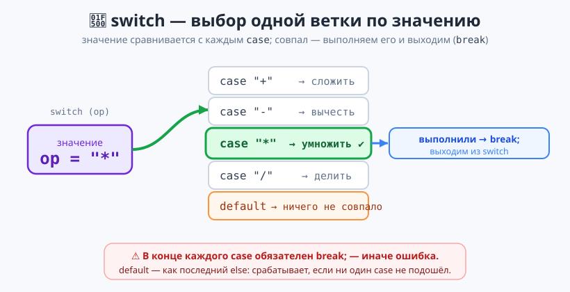

# Урок 3 — 🔀 «Условия»: программа принимает решения (+ `switch`) 🚦

**Блок 1 · Синтаксис C# + ООП · Урок 3 из 12 | 2 ак.ч. (1,5 часа)**

> ⬅️ Предыдущий: [Урок 2 «Строки: работа с текстом»](../урок-02-строки-и-дата/урок.md) · [Все уроки блока](../README.md) · [План курса](../../ПЛАН-КУРСА.md) · Следующий: [Урок 4 «Циклы»](../урок-04-циклы-for-while/урок.md) ➡️

> 🔁 В начале — [разминка/повтор](повторение.md) (5 мин).
> 📌 Быстро вспомнить материал урока — [итого.md](итого.md) (шпаргалка).
> 👨‍🏫 Сценарий с хронометражом — в [преподавателю.md](преподавателю.md).
> 🖼 Что показать на проекторе — в [изображения.md](изображения.md).
> 🆘 **Пропустил урок или хочешь закрепить?** Открой [самоучитель.md](самоучитель.md) — теория + задания с подсказками.
> 🧰 Трюки и частые ошибки — в [лайфхак.md](лайфхак.md).

> 🧭 **Как читать урок.** Условия (`if/else`) вы **хорошо знаете из Python** — по ним пройдём **быстро** (посмотрим отличия синтаксиса C#). Главное новое сегодня — **`switch`**: удобный выбор одного варианта из многих. С ним вы ещё не встречались, поэтому на нём **остановимся подробно**. В конце соберём «Меню-калькулятор». Имена переменных — **по-английски** (`camelCase`).

---

## 🎮 Что мы сделаем сегодня и что получим

**Задача:** научить программу выбирать, что делать — через `if/else`, логику и **`switch`**; собрать калькулятор с выбором действия.

**В итоге получится** (пример работы):

```
Первое число: 10
Действие (+, -, *, /): *
Второе число: 3
= 30
```

**Главные навыки урока:** `if / else if / else` (кратко) · сравнения `== != > < >= <=` · логика `&& || !` · тернарник `?:` · **`switch` подробно**: `case`, `break`, `default`, группировка, `switch`-выражение.

> 💡 **Главная мысль урока:** когда вариантов **много** и выбор идёт **по одному значению** (день недели, команда, знак действия) — вместо длинной лестницы `if-else if` удобнее **`switch`**.

---

## Часть 0 — Разминка: `if` в Python и C# (5 минут)

**Python (прошлый год):**
```python
if age >= 18:
    print("взрослый")
else:
    print("ребёнок")
```

**C# (сегодня):**
```csharp
if (age >= 18)
{
    Console.WriteLine("взрослый");
}
else
{
    Console.WriteLine("ребёнок");
}
```

| Python | C# |
|--------|-----|
| `if условие:` (двоеточие) | `if (условие)` — условие в **круглых скобках**, без двоеточия |
| блок по отступам | блок в **`{ }`** |
| `elif` | `else if` (два слова) |
| `and`, `or`, `not` | `&&`, `\|\|`, `!` |

> 🐍 **Мостик:** сама логика — 1:1 с Python. Меняются только «скобки»: условие в `( )`, тело в `{ }`.

---

## Часть 1 — `if / else` и сравнения (кратко) (10 минут)

Сравнения — те же, что в Python:

```csharp
int score = 75;
if (score >= 60)
{
    Console.WriteLine("Зачёт!");
}
else
{
    Console.WriteLine("Не сдал");
}
```

| Сравнение | Значит |
|-----------|--------|
| `==` | равно (в условии — **двойное**!) |
| `!=` | не равно |
| `>` `<` | больше / меньше |
| `>=` `<=` | больше-равно / меньше-равно |

> ⚠️ **Ловушка:** `=` — это «положи значение», а `==` — «сравни». В условии всегда **`==`**: `if (x == 5)`, не `if (x = 5)`.

Если в теле **одна** команда, `{}` можно опустить — но с ними надёжнее:
```csharp
if (score >= 60) Console.WriteLine("Зачёт!");   // так тоже можно
```

> ✍️ **Мини-задание 1 (3 мин):** спроси возраст и выведи «Можно» если `>= 12`, иначе «Рано».
> <details><summary>💡 подсказка</summary><code>int age = Convert.ToInt32(Console.ReadLine());</code>, затем <code>if (age >= 12) ... else ...</code></details>

---

## Часть 2 — Логика и `else if` (10 минут)

**Логические операции** (как `and/or/not` в Python):

```csharp
int age = 15;
bool hasTicket = true;
if (age >= 12 && hasTicket)          // && — И (оба условия истинны)
    Console.WriteLine("Проходи");
if (age < 7 || age > 65)             // || — ИЛИ (хотя бы одно)
    Console.WriteLine("Скидка");
if (!hasTicket)                      // ! — НЕ (переворачивает)
    Console.WriteLine("Нет билета");
```

Пригодится и результат методов строк из прошлого урока (`bool`!):
```csharp
string email = "ivan@mail.ru";
if (email.Contains("@"))
    Console.WriteLine("Похоже на почту");
```

**`else if` — лестница вариантов** (в Python было `elif`):
```csharp
int mark = 4;
if (mark == 5)       Console.WriteLine("отлично");
else if (mark == 4)  Console.WriteLine("хорошо");
else if (mark == 3)  Console.WriteLine("удовлетворительно");
else                 Console.WriteLine("плохо");
```

- 👀 Проверки идут **сверху вниз**, сработает **первая** подходящая, остальные пропускаются.

> ✍️ **Мини-задание 2 (3 мин):** спроси оценку (2–5) и выведи словами через `if / else if / else`.
> <details><summary>💡 подсказка</summary>Лестница: <code>if (mark == 5) ... else if (mark == 4) ... else ...</code></details>

---

## Часть 3 — ⭐ `switch`: выбор из многих (НОВОЕ, подробно) (22 минуты)

Когда мы выбираем **по одному значению** из многих вариантов, лестница `else if` получается длинной и однообразной. Для этого есть **`switch`** («переключатель») — его в Python не было, разбираем внимательно.



### Как устроен `switch`

```csharp
int day = 3;
switch (day)                        // смотрим на значение «day»
{
    case 1:                         // если day == 1
        Console.WriteLine("Понедельник");
        break;                      // выходим из switch
    case 2:
        Console.WriteLine("Вторник");
        break;
    case 3:
        Console.WriteLine("Среда");
        break;
    default:                        // если ни один case не подошёл
        Console.WriteLine("Другой день");
        break;
}
```

Разбираем по частям:
- **`switch (day)`** — «посмотри на значение `day`».
- **`case 3:`** — «а если оно равно 3?». Совпало — выполняем команды под ним.
- **`break;`** — «выйти из `switch`». **Обязателен** в конце каждого `case`!
- **`default:`** — «если ничего не совпало» (как последний `else`).

> ⚠️ **Главная ошибка новичка — забыть `break`.** Без него C# выдаст ошибку. В каждом `case` в конце — `break;`.

> 💡 **Лайфхак: не пиши `switch` руками.** Напечатай `switch` и нажми **Tab** — Visual Studio развернёт заготовку `switch/case/default`. А если поставить курсор на переменную и нажать **Ctrl+.** («лампочка») — можно сгенерировать `case`-ветки автоматически.

### Несколько значений — один ответ (группировка)

Если для разных значений действие одинаковое — `case`'ы ставят подряд:

```csharp
int day = 6;
switch (day)
{
    case 1: case 2: case 3: case 4: case 5:
        Console.WriteLine("Будний день 💼");
        break;
    case 6:
    case 7:
        Console.WriteLine("Выходной! 🎉");
        break;
    default:
        Console.WriteLine("Нет такого дня");
        break;
}
```

### `switch` работает и со строками

```csharp
string command = "стоп";
switch (command)
{
    case "старт":
        Console.WriteLine("Поехали 🚗");
        break;
    case "стоп":
        Console.WriteLine("Стоим 🛑");
        break;
    default:
        Console.WriteLine("Не понял команду");
        break;
}
```

### 🆕 Современный вид — `switch`-выражение

Когда в каждом варианте просто **возвращается значение**, есть короткая запись через `=>`:

```csharp
int mark = 4;
string text = mark switch
{
    5 => "отлично",
    4 => "хорошо",
    3 => "удовлетворительно",
    _ => "плохо"          // _ это «всё остальное» (как default)
};
Console.WriteLine(text);   // хорошо
```

- 👀 Здесь нет `case`, `break` и `{}` у веток — короче и аккуратнее. `_` заменяет `default`. Такой `switch` **сразу даёт значение**, которое кладём в переменную.

> 💡 **Когда что:** обычный `switch` — когда в ветках надо **делать** разное. `switch`-выражение — когда надо **выбрать одно значение**.

> ✍️ **Мини-задание 3 (4 мин):** через `switch` по числу 1–3 выведи цвет светофора: 1 — «красный», 2 — «жёлтый», 3 — «зелёный», иначе — «нет такого».
> <details><summary>💡 подсказка</summary><code>switch (n) { case 1: ... break; ... default: ... break; }</code> — не забудь <code>break</code>.</details>

---

## Часть 4 — Тернарный оператор `?:` (8 минут)

Для **короткого** выбора из двух есть тернарник — «условие ? если-да : если-нет»:

```csharp
int age = 15;
string who = age >= 18 ? "взрослый" : "ребёнок";
Console.WriteLine(who);                      // ребёнок
Console.WriteLine(age >= 18 ? "🔞" : "🧒");
```

Это короткая замена такого `if/else`:
```csharp
string who;
if (age >= 18) who = "взрослый";
else who = "ребёнок";
```

- 👀 Тернарник удобен, когда надо **выбрать одно из двух значений** в одну строку. Для сложной логики лучше обычный `if`.

> ✍️ **Мини-задание 4 (3 мин):** спроси число и через тернарник выведи «чётное» или «нечётное» (вспомни `% 2` из Урока 1).
> <details><summary>💡 подсказка</summary><code>n % 2 == 0 ? "чётное" : "нечётное"</code>.</details>

---

## Часть 5 — 🏆 Проект «Меню-калькулятор» (14 минут)

Соберём калькулятор, где действие выбирается через **`switch`**. Готовый код — в [`материалы/Program.cs`](материалы/Program.cs):

```csharp
Console.Write("Первое число: ");
int a = Convert.ToInt32(Console.ReadLine());
Console.Write("Действие (+, -, *, /): ");
string op = Console.ReadLine();
Console.Write("Второе число: ");
int b = Convert.ToInt32(Console.ReadLine());

switch (op)
{
    case "+": Console.WriteLine($"= {a + b}"); break;
    case "-": Console.WriteLine($"= {a - b}"); break;
    case "*": Console.WriteLine($"= {a * b}"); break;
    case "/":
        if (b == 0) Console.WriteLine("На ноль делить нельзя!");
        else        Console.WriteLine($"= {Math.Round((double)a / b, 2)}");
        break;
    default: Console.WriteLine("Не знаю такого действия");
        break;
}
```

- 👀 `switch (op)` выбирает ветку по знаку действия. В ветке `/` внутри — ещё `if` (проверка деления на ноль из Урока 1). `default` ловит всё лишнее.

> 🧩 **Для 5–7 классов:** сделай `switch` на `+` и `-`. 🎓 **Глубже:** добавь `*`, `/` с проверкой на ноль и `default`.

> ✍️ **Мини-задание 5 (3 мин):** добавь в калькулятор действие `%` (остаток) — новый `case "%"`.
> <details><summary>💡 подсказка</summary><code>case "%": Console.WriteLine($"= {a % b}"); break;</code></details>

---

## 🐞 Разбор частых ошибок

| Симптом | Что случилось | Как починить |
|---------|---------------|--------------|
| `Control cannot fall through... case` | забыл `break;` в `case` | в конце каждого `case` — `break;` |
| условие всегда истинно/ошибка | написал `=` вместо `==` | сравнение — **двойное** `==` |
| `else if` не сработал | забыл, что срабатывает только ПЕРВАЯ ветка | порядок веток важен |
| `switch` не зашёл ни в один `case` | значение не совпало точно (регистр/пробел) | проверь ввод; для строк — `.Trim()`, регистр |
| `; expected` у `case` | забыл двоеточие после `case 3` | `case 3:` — с двоеточием |
| `&&`/`\|\|` не работают | написал `and`/`or` как в Python | в C# — `&&`, `\|\|`, `!` |

> ⚠️ **Главное правило `switch`:** `switch (значение) { case X: ... break; default: ... break; }`. Не забывай `break` и `default`.

---

## 🎓 Глубже

**`switch` по диапазону (when):** можно проверять условие, а не только точное значение:
```csharp
int mark = 87;
string grade = mark switch
{
    >= 90 => "5",
    >= 75 => "4",
    >= 60 => "3",
    _     => "2"
};
```

**Вложенные условия:** `if` внутри `if` — как в проекте (проверка на ноль внутри ветки `/`).

**Цепочка сравнений.** В C# нельзя писать `if (5 < a < 10)` — надо через `&&`: `if (a > 5 && a < 10)`.

---

## 🧩 Для 5–7 классов

- `if (условие) { ... } else { ... }` — условие в круглых скобках, тело в фигурных.
- Сравнение — двойное `==`. Логика: `&&` (И), `||` (ИЛИ), `!` (НЕ).
- Много вариантов по одному значению — **`switch`**: `case значение: ... break;` + `default`.
- Не забывай **`break`** в каждом `case`.
- Короткий выбор из двух — тернарник `условие ? да : нет`.

---

## 🏁 Итог урока (5 минут)

Программа научилась принимать решения:

- ✅ `if / else if / else` — как в Python, но условие в `( )`, тело в `{ }`; сравнение `==`.
- ✅ Логика `&& || !`; можно использовать `bool` от `Contains` и т.п.
- ✅ **`switch`** — выбор из многих по одному значению: `case`, **`break`**, `default`, группировка, строки.
- ✅ **`switch`-выражение** `x switch { ... => ..., _ => ... }` — короткий выбор значения.
- ✅ Тернарник `?:` — выбор из двух в одну строку.
- ✅ Собрали «Меню-калькулятор» на `switch`.

> 🎉 Теперь программа умеет ветвиться. Дальше — **циклы**: научим её повторять действия (там есть отличия от Python!). Быстро повторить — в [итого.md](итого.md).

> 🎤 **Блиц:** чем `if` в C# отличается от Python? когда удобнее `switch`, чем `else if`? что обязательно в конце `case`? что делает `default`? как записать выбор из двух в одну строку?

### 🎮 Викторина-закрепление
Открой **[викторина.html](викторина.html)** — вопросы по условиям и `switch` + смешные и «на подумать».

➡️ **Практика урока** — **[практика.md](практика.md)**: задачи в 3 уровнях.
🆘 **Пропустил / хочешь ещё?** — [самоучитель.md](самоучитель.md) (теория + задания с подсказками).
🧰 **Трюки и ошибки** — [лайфхак.md](лайфхак.md). 📌 **Шпаргалка** — [итого.md](итого.md).

---

## 🔗 Навигация и материалы

⬅️ **Предыдущий:** [Урок 2 «Строки: работа с текстом»](../урок-02-строки-и-дата/урок.md) · [Все уроки блока](../README.md) · [План курса](../../ПЛАН-КУРСА.md) · **Следующий:** [Урок 4 «Циклы»](../урок-04-циклы-for-while/урок.md) ➡️

**🧰 Инструменты:** [.NET 10 SDK](https://dotnet.microsoft.com/download) · **Windows:** [Visual Studio 2022](https://visualstudio.microsoft.com/) · **Mac:** [VS Code](https://code.visualstudio.com/) + C# Dev Kit. Настройка обеих сред — [`справочники/среда-VisualStudio-и-VSCode.md`](../../справочники/среда-VisualStudio-и-VSCode.md).
**📄 Готовый код:** [`материалы/Program.cs`](материалы/Program.cs) (меню-калькулятор на switch).
**⚙️ Учителю:** сценарий и частые ошибки — в [преподавателю.md](преподавателю.md).
