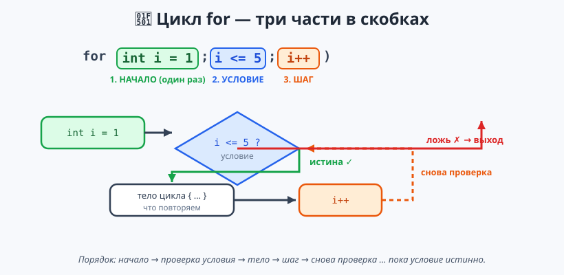

# Урок 4 — 🔁 «Циклы»: `for` и `while` (часть 1) 🔂

**Блок 1 · Синтаксис C# + ООП · Урок 4 из 12 | 2 ак.ч. (1,5 часа)**

> ⬅️ Предыдущий: [Урок 3 «Условия + switch»](../урок-03-условия/урок.md) · [Все уроки блока](../README.md) · [План курса](../../ПЛАН-КУРСА.md) · Следующий: [Урок 5 «Циклы: do-while, foreach, вложенные»](../урок-05-циклы-foreach-вложенные/урок.md) ➡️

> 🔁 В начале — [разминка/повтор](повторение.md) (5 мин).
> 📌 Быстро вспомнить материал урока — [итого.md](итого.md) (шпаргалка).
> 👨‍🏫 Сценарий с хронометражом — в [преподавателю.md](преподавателю.md).
> 🖼 Что показать на проекторе — в [изображения.md](изображения.md).
> 🆘 **Пропустил урок или хочешь закрепить?** Открой [самоучитель.md](самоучитель.md) — теория + задания с подсказками.
> 🧰 Трюки и частые ошибки — в [лайфхак.md](лайфхак.md).

> 🧭 **Как читать урок.** Циклы вы делали в Python, но здесь — **самые заметные отличия C#**, поэтому идём **подробно**. Главное новое — цикл **`for`** из **трёх частей** `for (начало; условие; шаг)`. `while` почти как в Python. Ещё подробно разберём **`Random`** (случайные числа). В конце соберём игру «Угадай число». Имена переменных — **по-английски**.

---

## 🎮 Что мы сделаем сегодня и что получим

**Задача:** научить программу **повторять** действия циклами `for` и `while`; управлять `break`/`continue`; получать случайные числа (`Random`); собрать игру «Угадай число».

**В итоге получится** (пример работы):

```
Угадай число от 1 до 100!
Твой вариант: 50
Загадано меньше ⬇
Твой вариант: 25
Загадано больше ⬆
Твой вариант: 37
🎉 Угадал за 3 попытки!
```

**Главные навыки урока:** `for (начало; условие; шаг)` · `i++` / `i--` / `i += 2` · `while` · `while (true)` · `break` / `continue` · **`Random`** (`Next`, `NextDouble`, диапазоны, seed).

> 💡 **Главная мысль урока:** `for` в C# — это **три части в скобках**: с чего начать (`int i = 0`), пока что повторять (`i < 10`) и как менять счётчик (`i++`).

---

## Часть 0 — Разминка: циклы в Python и C# (5 минут)

**Python (прошлый год):**
```python
for i in range(1, 6):
    print(i)

while n < 10:
    n = n + 1
```

**C# (сегодня):**
```csharp
for (int i = 1; i <= 5; i++)
    Console.WriteLine(i);

while (n < 10)
    n++;
```

| Python | C# |
|--------|-----|
| `for i in range(1, 6):` | `for (int i = 1; i <= 5; i++)` — **три части** в скобках |
| `range` сам считает | шаг пишем сами: `i++` |
| `while условие:` | `while (условие)` — условие в `( )` |
| `n = n + 1` | `n++` (короткая запись) |

> 🐍 **Мостик:** `while` почти не изменился. А `for` выглядит иначе — на нём и сосредоточимся.

---

## Часть 1 — ⭐ Цикл `for`: три части (16 минут)

`for` в C# состоит из **трёх частей**, разделённых `;`:

```csharp
for (int i = 1; i <= 5; i++)
{
    Console.WriteLine($"Шаг {i}");
}
```



Разбираем скобку `for (int i = 1; i <= 5; i++)`:
1. **`int i = 1`** — *начало*: заводим счётчик `i` (выполняется **один раз**).
2. **`i <= 5`** — *условие*: пока истинно, цикл повторяется (проверяется **перед каждым** повтором).
3. **`i++`** — *шаг*: как изменить счётчик после каждого повтора (`i++` = `i = i + 1`).

Порядок: `начало` → проверка `условия` → тело `{}` → `шаг` → снова проверка → …

**Несколько примеров:**
```csharp
// посчитать от 1 до 10
for (int i = 1; i <= 10; i++) Console.Write(i + " ");   // 1 2 3 ... 10

// таблица умножения на 7
for (int i = 1; i <= 10; i++) Console.WriteLine($"7 × {i} = {7 * i}");

// сумма чисел от 1 до 100 (накопитель)
int sum = 0;
for (int i = 1; i <= 100; i++) sum += i;
Console.WriteLine($"Сумма: {sum}");                     // 5050
```

> 💡 **Лайфхак: не пиши `for` руками.** Напечатай `for` и нажми **Tab** дважды — Visual Studio развернёт шаблон цикла, останется поменять границы.

> ✍️ **Мини-задание 1 (3 мин):** выведи `for`'ом все числа от 1 до 20.
> <details><summary>💡 подсказка</summary><code>for (int i = 1; i &lt;= 20; i++) Console.WriteLine(i);</code></details>

---

## Часть 2 — Шаг счётчика: `i++`, `i--`, `i += 2` (8 минут)

| Запись | Значит |
|--------|--------|
| `i++` | `i = i + 1` (плюс 1) |
| `i--` | `i = i - 1` (минус 1) |
| `i += 2` | `i = i + 2` (шаг 2) |
| `i -= 3` | `i = i - 3` |

**Обратный отсчёт** — стартуем сверху и уменьшаем:
```csharp
for (int i = 5; i >= 1; i--) Console.Write(i + " ");   // 5 4 3 2 1
Console.WriteLine("Поехали! 🚀");
```
**Через один** — шаг 2:
```csharp
for (int i = 0; i <= 10; i += 2) Console.Write(i + " ");   // 0 2 4 6 8 10
```

> ✍️ **Мини-задание 2 (3 мин):** выведи только чётные числа от 2 до 20 (шаг 2).
> <details><summary>💡 подсказка</summary><code>for (int i = 2; i &lt;= 20; i += 2) ...</code></details>

---

## Часть 3 — Цикл `while` (10 минут)

`while` повторяет тело, **пока условие истинно** (как в Python):

```csharp
int charge = 5;
while (charge > 0)
{
    Console.WriteLine($"Заряд: {charge}");
    charge--;                      // ОБЯЗАТЕЛЬНО меняем — иначе цикл вечный!
}
Console.WriteLine("Разрядился 🔋");
```

- 👀 В `while` **ты сам** отвечаешь за изменение переменной в условии. Забудешь `charge--` — цикл никогда не остановится.

**«Вечный» цикл `while (true)` + `break`** — когда заранее не знаем, сколько повторов:
```csharp
while (true)
{
    Console.Write("Скажи пароль: ");
    string word = Console.ReadLine();
    if (word == "открой")
        break;                     // выходим из цикла
    Console.WriteLine("Неверно, ещё раз...");
}
Console.WriteLine("Добро пожаловать!");
```

> 💡 **Лайфхак: зациклилось?** Если программа «висит» и без конца печатает — это **бесконечный цикл**. Останови **Ctrl+C** (как в Python) и проверь, меняется ли переменная в условии.

> ✍️ **Мини-задание 3 (3 мин):** `while`'ом посчитай от 10 до 1, уменьшая переменную.
> <details><summary>💡 подсказка</summary><code>int n = 10; while (n &gt;= 1) { Console.WriteLine(n); n--; }</code></details>

---

## Часть 4 — Управление циклом: `break` и `continue` (8 минут)

- **`break`** — **выйти** из цикла совсем.
- **`continue`** — **пропустить** текущий повтор и перейти к следующему.

```csharp
// break — остановиться на 5
for (int i = 1; i <= 10; i++)
{
    if (i == 5) break;
    Console.Write(i + " ");        // 1 2 3 4
}

// continue — пропустить число 3
for (int i = 1; i <= 5; i++)
{
    if (i == 3) continue;
    Console.Write(i + " ");        // 1 2 4 5
}
```

- 👀 `break` = «хватит, выхожу»; `continue` = «этот шаг пропускаю». Оба — как в Python.

> ✍️ **Мини-задание 4 (3 мин):** выведи числа от 1 до 10, но пропусти число 7 (через `continue`).
> <details><summary>💡 подсказка</summary><code>if (i == 7) continue;</code></details>

---

## Часть 5 — ⭐ Случайные числа: `Random` (подробно) (14 минут)

Для игр нужны случайные числа. Их даёт класс **`Random`**. Создаём генератор **один раз**, потом просим у него числа:

```csharp
Random rnd = new Random();     // генератор — ОДИН раз (до цикла)
```

**Разные способы получить случайное:**
```csharp
rnd.Next(6);        // целое 0..5    (граница 6 НЕ входит)
rnd.Next(1, 7);     // целое 1..6    (кубик; 7 не входит)
rnd.Next(1, 101);   // целое 1..100
rnd.NextDouble();   // дробное 0.0 .. почти 1.0
```

> ⚠️ **Верхняя граница НЕ входит!** `rnd.Next(1, 7)` даёт **1..6** (не 7). Для 1..100 — `Next(1, 101)`. А `Next(6)` (одно число) даёт **0..5**.

**Примеры:**
```csharp
int dice = rnd.Next(1, 7);                                   // кубик 1..6
string coin = rnd.Next(2) == 0 ? "орёл" : "решка";           // монетка
double chance = rnd.NextDouble();                            // 0.0..1.0
bool win = rnd.NextDouble() < 0.3;                           // выигрыш с шансом 30%
Console.WriteLine($"Кубик: {dice}, монетка: {coin}");
```

> 💡 **Лайфхак 1: `Random` — один раз до цикла.** Создашь `new Random()` внутри быстрого цикла — числа могут повторяться (генератор берёт время как «семечко»).
> 💡 **Лайфхак 2: `Random.Shared`** — готовый общий генератор, можно без `new`: `Random.Shared.Next(1, 7)`.
> 💡 **Лайфхак 3: одинаковые случайности для тестов.** `new Random(42)` — «зерно» (seed): каждый запуск даёт **ту же** последовательность (удобно проверять программу).

> ✍️ **Мини-задание 5 (3 мин):** «брось кубик» 3 раза — в цикле `for` выведи три случайных числа от 1 до 6.
> <details><summary>💡 подсказка</summary>Создай <code>rnd</code> до цикла, внутри — <code>rnd.Next(1, 7)</code>.</details>

---

## Часть 6 — 🏆 Проект «Угадай число» (12 минут)

Соберём всё: `Random` загадывает число, `while (true)` спрашивает варианты, `if/else` подсказывает, `break` завершает при победе, счётчик считает попытки. Готовый код — в [`материалы/Program.cs`](материалы/Program.cs):

```csharp
Random rnd = new Random();
int secret = rnd.Next(1, 101);    // 1..100
int count = 0;

Console.WriteLine("Угадай число от 1 до 100!");
while (true)
{
    Console.Write("Твой вариант: ");
    int guess = Convert.ToInt32(Console.ReadLine());
    count++;

    if (guess == secret)
    {
        Console.WriteLine($"🎉 Угадал за {count} попыток!");
        break;                       // победа — выходим
    }
    else if (guess < secret)
        Console.WriteLine("Загадано больше ⬆");
    else
        Console.WriteLine("Загадано меньше ⬇");
}
```

- 👀 Здесь встретилось всё из блока: цикл (`while`), условия (`if/else`), ввод (`Convert.ToInt32`), случайное число (`Random`), выход (`break`) и счётчик (`count++`).

> 🧩 **Для 5–7 классов:** сделай «Угадай число» от 1 до 10. 🎓 **Глубже:** добавь лимит попыток — замени `while (true)` на `while (count < 7)`.

> ✍️ **Мини-задание 6 (3 мин):** добавь в игру ограничение: если игрок не угадал за 7 попыток — выведи «Проиграл, число было ...» и `break`.
> <details><summary>💡 подсказка</summary>Внутри цикла: <code>if (count &gt;= 7) { Console.WriteLine($"Число было {secret}"); break; }</code></details>

---

## 🎨 Бонус: сделаем ярко — цвет и анимация (по времени)

Циклы + пара новых команд = эффектные программы. Готовый код — в [`материалы/бонус-анимация.cs`](материалы/бонус-анимация.cs).

**Новые команды:**
- `Console.ForegroundColor = ConsoleColor.Green;` — цвет текста (`Red`, `Yellow`, `Cyan`…), `Console.ResetColor();` — вернуть обычный.
- `System.Threading.Thread.Sleep(300);` — пауза 300 мс — из неё делают анимацию.

**Прогресс-бар «Загрузка»** — рисуем блоки по одному с паузой:
```csharp
Console.Write("Загрузка: ");
for (int i = 0; i < 20; i++)
{
    Console.Write("█");
    System.Threading.Thread.Sleep(100);   // видно, как полоса растёт
}
Console.WriteLine(" 100%");
```

**Анимированный бросок кубика** — быстро мелькают грани, потом итог зелёным:
```csharp
Random rnd = new Random();
Console.Write("Кручу кубик:");
for (int i = 0; i < 6; i++) { Console.Write(" " + rnd.Next(1, 7)); System.Threading.Thread.Sleep(150); }
Console.ForegroundColor = ConsoleColor.Green;
Console.WriteLine($"\nВыпало: {rnd.Next(1, 7)}!");
Console.ResetColor();
```

- 👀 Вся «магия» — обычный цикл `for` + пауза `Thread.Sleep`. Так делают загрузки, отсчёты, анимации.

> ✍️ **Мини-задание 7 (по желанию):** сделай цветной отсчёт «3 — 2 — 1 — Поехали!»: в цикле выводи число, меняй цвет и делай паузу.
> <details><summary>💡 подсказка</summary><code>for (int n = 3; n >= 1; n--) { Console.WriteLine(n); System.Threading.Thread.Sleep(500); }</code></details>

---

## 🐞 Разбор частых ошибок

| Симптом | Что случилось | Как починить |
|---------|---------------|--------------|
| цикл бесконечный, консоль «висит» | забыл менять переменную (`i++`, `n--`) | меняй счётчик; останови **Ctrl+C** |
| `for` разделён не тем | поставил `,` вместо `;` | три части `for` разделяются **`;`** |
| цикл выполнился на 1 раз больше/меньше | перепутал `<` и `<=` | реши: последнее число включаем (`<=`) или нет (`<`) |
| `Random` даёт одинаковые числа | создавал `new Random()` внутри цикла | создай **один раз** до цикла |
| `Next(1, 100)` не даёт 100 | верхняя граница не входит | для 1..100 пиши `Next(1, 101)` |
| `i` «не виден» после цикла | переменная из `for` живёт только внутри | заведи переменную снаружи, если нужна после |

> ⚠️ **Главное правило:** `for (начало; условие; шаг)` — три части через `;`. В `while` сам меняй переменную условия. Верхняя граница `Random.Next` **не включается**.

---

## 🎓 Глубже

**Сумма/произведение накопителем:** заводим переменную до цикла и копим (`sum += i`, `fact *= i`).

**`for` может считать по-разному:** `for (int i = 100; i > 0; i -= 10)` — от 100 до 10 с шагом 10.

**Случайное дробное с масштабом:** `rnd.NextDouble() * 10` — от 0 до 10; `rnd.Next(1, 7) + rnd.Next(1, 7)` — сумма двух кубиков (2..12).

**Цепочка сравнений — только через `&&`:** `while (x > 0 && x < 100)` (писать `0 < x < 100` нельзя).

---

## 🧩 Для 5–7 классов

- `for (int i = 1; i <= 5; i++)` — три части: начало, условие, шаг.
- `i++` = «плюс один»; `i--` = «минус один»; `i += 2` = шаг 2.
- `while (условие)` — повторять, пока истинно; сам меняй переменную!
- `break` — выйти, `continue` — пропустить шаг.
- `Random`: `new Random()` один раз, `rnd.Next(1, 7)` = 1..6 (7 не входит), `NextDouble()` = дробь.
- Проект: «Угадай число».

---

## 🏁 Итог урока (5 минут)

Программа научилась повторять:

- ✅ **`for (начало; условие; шаг)`** — три части через `;`; счётчик `i++`/`i--`/`i += 2`.
- ✅ `while (условие)` — повтор, пока истинно; `while (true)` + `break` — «до события».
- ✅ `break` (выйти) и `continue` (пропустить шаг).
- ✅ **`Random`**: `new Random()` один раз, `.Next(a, b)` (верх не входит), `.NextDouble()`, `Random.Shared`, seed.
- ✅ Собрали игру «Угадай число».

> 🎉 Циклы — мощнейший инструмент. Дальше (Урок 5) — `do-while`, `foreach` и **вложенные циклы** (узоры, поля). Быстро повторить — в [итого.md](итого.md).

> 🎤 **Блиц:** из каких трёх частей состоит `for`? чем `i++` отличается от `i += 2`? когда нужен `while (true)`? что делает `continue`? почему `Next(1, 7)` не даёт 7? что даёт `NextDouble()`?

### 🎮 Викторина-закрепление
Открой **[викторина.html](викторина.html)** — вопросы по `for`, `while`, `Random` + смешные и «на подумать».

➡️ **Практика урока** — **[практика.md](практика.md)**: задачи в 3 уровнях.
🆘 **Пропустил / хочешь ещё?** — [самоучитель.md](самоучитель.md) (теория + задания с подсказками).
🧰 **Трюки и ошибки** — [лайфхак.md](лайфхак.md). 📌 **Шпаргалка** — [итого.md](итого.md).

---

## 🔗 Навигация и материалы

⬅️ **Предыдущий:** [Урок 3 «Условия + switch»](../урок-03-условия/урок.md) · [Все уроки блока](../README.md) · [План курса](../../ПЛАН-КУРСА.md) · **Следующий:** [Урок 5 «Циклы: do-while, foreach, вложенные»](../урок-05-циклы-foreach-вложенные/урок.md) ➡️

**🧰 Инструменты:** [.NET 10 SDK](https://dotnet.microsoft.com/download) · **Windows:** [Visual Studio 2022](https://visualstudio.microsoft.com/) · **Mac:** [VS Code](https://code.visualstudio.com/) + C# Dev Kit. Настройка обеих сред — [`справочники/среда-VisualStudio-и-VSCode.md`](../../справочники/среда-VisualStudio-и-VSCode.md).
**📄 Готовый код:** [`материалы/Program.cs`](материалы/Program.cs) (игра «Угадай число») · [`материалы/бонус-анимация.cs`](материалы/бонус-анимация.cs) (цвет и анимация).
**⚙️ Учителю:** сценарий и частые ошибки — в [преподавателю.md](преподавателю.md).
