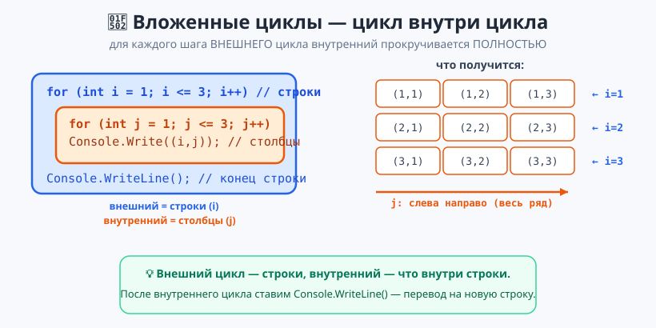

# Урок 5 — 🔂 «Циклы-2»: `do-while`, `foreach` и вложенные циклы 🎨

**Блок 1 · Синтаксис C# + ООП · Урок 5 из 12 | 2 ак.ч. (1,5 часа)**

> ⬅️ Предыдущий: [Урок 4 «Циклы: for и while»](../урок-04-циклы-for-while/урок.md) · [Все уроки блока](../README.md) · [План курса](../../ПЛАН-КУРСА.md) · Следующий: [Урок 6 «Массивы»](../урок-06-массивы/урок.md) ➡️

> 🔁 В начале — [разминка/повтор](повторение.md) (5 мин).
> 📌 Быстро вспомнить материал урока — [итого.md](итого.md) (шпаргалка).
> 👨‍🏫 Сценарий с хронометражом — в [преподавателю.md](преподавателю.md).
> 🖼 Что показать на проекторе — в [изображения.md](изображения.md).
> 🆘 **Пропустил урок или хочешь закрепить?** Открой [самоучитель.md](самоучитель.md) — теория + задания с подсказками.
> 🧰 Трюки и частые ошибки — в [лайфхак.md](лайфхак.md).

> 🧭 **Как читать урок.** В прошлый раз освоили `for` и `while`. Сегодня добавим три вещи: **`do-while`** (цикл, который выполнится хотя бы раз — идеален для меню), **`foreach`** (перебор без счётчика — как `for x in ...` в Python; сегодня разберём его **подробно**) и **вложенные циклы** (цикл в цикле → таблицы и узоры). В конце — яркий «Генератор узоров». Имена переменных — **по-английски**.

---

## 🎮 Что мы сделаем сегодня и что получим

**Задача:** освоить `do-while`, разобрать `foreach` вглубь и вложенные циклы; нарисовать узоры и собрать «Генератор узоров».

**В итоге получится** (пример — ёлочка размера 5):

```
Что нарисовать? (1-ёлочка, 2-пирамида, 3-шахматка): 1
Размер: 5
    *
   ***
  *****
 *******
*********
```

**Главные навыки урока:** `do-while` · **`foreach`** (перебор, накопление, подсчёт, поиск, преобразование) · **вложенные циклы** · рисование сеток и узоров · `new string(символ, n)` · цвет консоли.

> 💡 **Главная мысль урока:** **вложенный цикл = цикл внутри цикла** (внешний — строки, внутренний — что в строке). А **`foreach`** — самый удобный способ пройти по всем элементам чего угодно.

---

## Часть 0 — Разминка: что уже умеем (4 минуты)

```csharp
for (int i = 1; i <= 3; i++) Console.WriteLine(i);   // 1 2 3
int n = 3;
while (n > 0) { Console.Write(n + " "); n--; }        // 3 2 1
```

Сегодня — три «надстройки» над циклами. Поехали!

---

## Часть 1 — `do-while`: сначала сделать, потом проверить (10 минут)

`do-while` похож на `while`, но условие проверяется **после** тела — поэтому тело выполнится **хотя бы один раз**:

```csharp
int x = 5;
do
{
    Console.WriteLine(x);
    x--;
} while (x > 0);         // ← проверка ВНИЗУ; не забудь ; после while
```

**Где это удобно — меню.** Меню надо показать хотя бы раз, а потом повторять, пока не выберут «выход»:
```csharp
string choice;
do
{
    Console.Write("Меню [1 — играть, 0 — выход]: ");
    choice = Console.ReadLine();
    Console.WriteLine($"Выбрано: {choice}");
} while (choice != "0");
Console.WriteLine("Пока!");
```

- 👀 Обычный `while` может **ни разу** не выполниться; `do-while` — **минимум один раз**.

> ⚠️ После `} while (условие)` обязательна **точка с запятой** `;`.

> ✍️ **Мини-задание 1 (3 мин):** через `do-while` спрашивай число, пока не введут `0`. Каждое выводи с подписью «Ты ввёл …».
> <details><summary>💡 подсказка</summary><code>do { ... } while (n != 0);</code>, число читай внутри цикла.</details>

---

## Часть 2 — ⭐ `foreach`: перебор коллекции (подробно) (16 минут)

Когда нужно **пройти по всем элементам** (буквам строки, числам массива), а номер не важен — удобнее `foreach`. Прямой аналог `for x in ...` из Python:

**Python:** `for c in "привет": print(c)`
**C#:** `foreach (char c in "привет") Console.WriteLine(c);`

**1) Просто перебрать:**
```csharp
foreach (char letter in "кот")
    Console.WriteLine(letter);        // к, о, т (каждая с новой строки)

int[] scores = { 10, 25, 7, 42 };
foreach (int s in scores)
    Console.Write(s + " ");           // 10 25 7 42
```

**2) Накопить (сумма, произведение):**
```csharp
int sum = 0;
foreach (int s in scores) sum += s;
Console.WriteLine($"Сумма: {sum}");   // 84
```

**3) Посчитать по условию** (сколько гласных в слове):
```csharp
string word = "программа";
int vowels = 0;
foreach (char c in word)
    if ("аеёиоуыэюя".Contains(c)) vowels++;
Console.WriteLine($"Гласных: {vowels}");   // 3
```

**4) Найти (максимум):**
```csharp
int max = scores[0];
foreach (int s in scores)
    if (s > max) max = s;
Console.WriteLine($"Максимум: {max}");     // 42
```

**5) Преобразовать (перевернуть слово):**
```csharp
string reversed = "";
foreach (char c in "кот") reversed = c + reversed;
Console.WriteLine(reversed);               // ток
```

> ⚠️ **`foreach` не даёт номер элемента** и **не позволяет менять элемент**. Нужен номер (или менять) — заведи свой счётчик или бери `for`:
> ```csharp
> int index = 0;
> foreach (char c in "abc") { Console.WriteLine($"{index}: {c}"); index++; }
> ```

> 💡 **Лайфхак: `for` или `foreach`?** Нужен **номер** или **менять** элементы — `for`. Просто **пройти и почитать** — `foreach` (короче и без ошибок с границами).

> ✍️ **Мини-задание 2 (4 мин):** спроси слово и через `foreach` посчитай, сколько в нём букв «о».
> <details><summary>💡 подсказка</summary><code>foreach (char c in word) if (c == 'о') count++;</code></details>

---

## Часть 3 — ⭐ Вложенные циклы: цикл в цикле (14 минут)

**Вложенный цикл** — это цикл **внутри** другого. Внешний крутится медленно, внутренний быстро: для **каждого** шага внешнего внутренний проходит **весь путь**.



```csharp
for (int i = 1; i <= 3; i++)          // внешний: строки
{
    for (int j = 1; j <= 3; j++)      // внутренний: столбцы
        Console.Write($"({i},{j}) ");
    Console.WriteLine();              // конец строки — после внутреннего цикла
}
```
Выведет:
```
(1,1) (1,2) (1,3)
(2,1) (2,2) (2,3)
(3,1) (3,2) (3,3)
```

- 👀 `i` — номер строки, `j` — номер столбца. `Console.WriteLine()` после внутреннего цикла переводит на новую строку.

**Таблица умножения сеткой** (выравнивание `{число,4}` — ширина 4 символа):
```csharp
for (int a = 1; a <= 5; a++)
{
    for (int b = 1; b <= 5; b++)
        Console.Write($"{a * b,4}");   // ,4 — по правому краю
    Console.WriteLine();
}
```

> ✍️ **Мини-задание 3 (4 мин):** вложенными циклами выведи квадрат 4×4 из звёздочек.
> <details><summary>💡 подсказка</summary>Внешний — 4 строки, внутренний печатает <code>*</code> 4 раза, потом <code>Console.WriteLine()</code>.</details>

---

## Часть 4 — 🎨 Узоры из символов (12 минут)

Вложенные циклы + повтор символа = **ASCII-узоры**. Помощник — **`new string(символ, n)`** — строка из `n` одинаковых символов (как `"*" * n` в Python):

```csharp
Console.WriteLine(new string('*', 5));    // *****
```

**Пирамида:**
```csharp
int n = 5;
for (int i = 1; i <= n; i++)
    Console.WriteLine(new string('#', i));   // #, ##, ###, ####, #####
```

**Ёлочка** — отступ слева (пробелы) + нечётное число звёздочек:
```csharp
for (int row = 1; row <= n; row++)
{
    Console.Write(new string(' ', n - row));       // отступ уменьшается
    Console.WriteLine(new string('*', row * 2 - 1)); // 1,3,5,7,9 звёзд
}
```

**Шахматка** — клетка закрашена, если сумма координат чётная:
```csharp
for (int r = 0; r < n; r++)
{
    for (int c = 0; c < n; c++)
        Console.Write((r + c) % 2 == 0 ? "██" : "  ");
    Console.WriteLine();
}
```

> 💡 **Лайфхак: включи цвет!** Перед рисованием — `Console.ForegroundColor = ConsoleColor.Green;`, после — `Console.ResetColor();`.

> ✍️ **Мини-задание 4 (3 мин):** нарисуй пирамиду из `n` строк символом `@` (спроси `n`).
> <details><summary>💡 подсказка</summary><code>for (int i = 1; i &lt;= n; i++) Console.WriteLine(new string('@', i));</code></details>

---

## Часть 5 — 🏆 Проект «Генератор узоров» (14 минут)

Соединим **`switch`** (Урок 3), **ввод**, **вложенные циклы** и **цвет**. Готовый код — в [`материалы/Program.cs`](материалы/Program.cs):

```csharp
Console.Write("Что нарисовать? (1-ёлочка, 2-пирамида, 3-шахматка): ");
string choice = Console.ReadLine();
Console.Write("Размер: ");
int n = Convert.ToInt32(Console.ReadLine());

switch (choice)
{
    case "1":                                   // ёлочка
        Console.ForegroundColor = ConsoleColor.Green;
        for (int row = 1; row <= n; row++)
        {
            Console.Write(new string(' ', n - row));
            Console.WriteLine(new string('*', row * 2 - 1));
        }
        Console.ResetColor();
        break;
    case "2":                                   // пирамида
        for (int i = 1; i <= n; i++)
            Console.WriteLine(new string('#', i));
        break;
    case "3":                                   // шахматка
        for (int r = 0; r < n; r++)
        {
            for (int c = 0; c < n; c++)
                Console.Write((r + c) % 2 == 0 ? "██" : "  ");
            Console.WriteLine();
        }
        break;
    default:
        Console.WriteLine("Не знаю такой узор");
        break;
}
```

- 👀 `switch` выбирает узор, а рисуют его циклы (в ёлочке и шахматке — вложенные). Цвет включаем для ёлочки.

> 🧩 **Для 5–7 классов:** сделай только пирамиду и ёлочку. 🎓 **Глубже:** заверни всё в `do-while`, чтобы после рисунка спрашивать «ещё? (да/нет)».

> ✍️ **Мини-задание 5 (3 мин):** добавь узор `4` — «квадрат» размера `n×n` из символа `█`.
> <details><summary>💡 подсказка</summary><code>case "4":</code> вложенные циклы, внутренний печатает <code>█</code> n раз.</details>

---

## 🐞 Разбор частых ошибок

| Симптом | Что случилось | Как починить |
|---------|---------------|--------------|
| `; expected` после `do-while` | забыл `;` после `while (условие)` | `} while (условие);` — с точкой с запятой |
| строки узора «слиплись» в одну | нет `Console.WriteLine()` после внутреннего цикла | переводи строку в конце внешнего шага |
| узор «съехал» | перепутал `Write` и `WriteLine` внутри | внутри строки — `Write`, в конце — `WriteLine()` |
| `foreach` не даёт менять элемент / номер | `foreach` — только чтение, без индекса | нужен номер/менять → `for` c индексом |
| бесконечный `do-while` | условие никогда не станет ложным | меняй переменную внутри тела |
| цвет «залип» на весь экран | забыл `Console.ResetColor()` | после цветного вывода верни цвет |

> ⚠️ **Главное правило вложенных циклов:** внешний — строки, внутренний — то, что в строке. После внутреннего — `Console.WriteLine()`.

---

## 🎓 Глубже

**Треугольник «вверх ногами»:** внешний цикл считает вниз — `for (int i = n; i >= 1; i--)`.

**`foreach` по словам:** `foreach (string word in text.Split(' ')) ...` — перебор слов (`Split` из Урока 2 → массив, Урок 6).

**Ромб** = пирамида вверх + пирамида вниз: два цикла подряд.

**Три уровня вложенности** — куб из строк-столбцов-слоёв (редко, но бывает).

---

## 🧩 Для 5–7 классов

- `do-while` — цикл, который срабатывает **хотя бы раз** (проверка внизу); удобно для меню.
- `foreach (тип x in коллекция)` — перебор всех элементов без счётчика; удобно считать/суммировать.
- **Вложенный цикл** — цикл внутри цикла: внешний — строки, внутренний — столбцы.
- `new string('*', n)` — строка из `n` звёздочек. Узоры: пирамида, ёлочка.
- Проект: «Генератор узоров» (switch + циклы + цвет).

---

## 🏁 Итог урока (5 минут)

Циклы стали мощнее и красивее:

- ✅ **`do-while`** — тело выполняется хотя бы раз; удобно для меню (`;` после `while`!).
- ✅ **`foreach`** — перебор коллекции: суммировать, считать, искать, преобразовывать; без номера и без изменения (для этого — `for`).
- ✅ **Вложенные циклы** — строки × столбцы; после внутреннего — `WriteLine()`.
- ✅ Узоры через `new string(символ, n)`; цвет — `Console.ForegroundColor` / `ResetColor`.
- ✅ Собрали «Генератор узоров».

> 🎉 Циклы закрыты! Дальше (Урок 6) — **массивы**: хранить много значений и перебирать (`foreach` там будет как родной). Быстро повторить — в [итого.md](итого.md).

> 🎤 **Блиц:** чем `do-while` отличается от `while`? как `foreach` посчитать гласные? даёт ли `foreach` номер элемента? за что отвечает внешний цикл, а за что внутренний? что рисует `new string('*', 5)`?

### 🎮 Викторина-закрепление
Открой **[викторина.html](викторина.html)** — вопросы по `do-while`, `foreach`, вложенным циклам + смешные и «на подумать».

➡️ **Практика урока** — **[практика.md](практика.md)**: задачи в 3 уровнях.
🆘 **Пропустил / хочешь ещё?** — [самоучитель.md](самоучитель.md) (теория + задания с подсказками).
🧰 **Трюки и ошибки** — [лайфхак.md](лайфхак.md). 📌 **Шпаргалка** — [итого.md](итого.md).

---

## 🔗 Навигация и материалы

⬅️ **Предыдущий:** [Урок 4 «Циклы: for и while»](../урок-04-циклы-for-while/урок.md) · [Все уроки блока](../README.md) · [План курса](../../ПЛАН-КУРСА.md) · **Следующий:** [Урок 6 «Массивы»](../урок-06-массивы/урок.md) ➡️

**🧰 Инструменты:** [.NET 10 SDK](https://dotnet.microsoft.com/download) · **Windows:** [Visual Studio 2022](https://visualstudio.microsoft.com/) · **Mac:** [VS Code](https://code.visualstudio.com/) + C# Dev Kit. Настройка обеих сред — [`справочники/среда-VisualStudio-и-VSCode.md`](../../справочники/среда-VisualStudio-и-VSCode.md).
**📄 Готовый код:** [`материалы/Program.cs`](материалы/Program.cs) (генератор узоров).
**⚙️ Учителю:** сценарий и частые ошибки — в [преподавателю.md](преподавателю.md).
