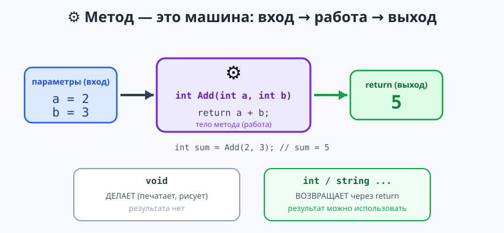

# Урок 7 — 🧩 «Методы»: свои команды для программы ⚙️

**Блок 1 · Синтаксис C# + ООП · Урок 7 из 12 | 2 ак.ч. (1,5 часа)**

> ⬅️ Предыдущий: [Урок 6 «Массивы»](../урок-06-массивы/урок.md) · [Все уроки блока](../README.md) · [План курса](../../ПЛАН-КУРСА.md) · Следующий: [Урок 8 «Коллекции: List и Dictionary»](../урок-08-коллекции-list/урок.md) ➡️

> 🔁 В начале — [разминка/повтор](повторение.md) (5 мин).
> 📌 Быстро вспомнить материал урока — [итого.md](итого.md) (шпаргалка).
> 👨‍🏫 Сценарий с хронометражом — в [преподавателю.md](преподавателю.md).
> 🖼 Что показать на проекторе — в [изображения.md](изображения.md).
> 🆘 **Пропустил урок или хочешь закрепить?** Открой [самоучитель.md](самоучитель.md) — теория + задания с подсказками.
> 🧰 Трюки и частые ошибки — в [лайфхак.md](лайфхак.md).

> 🧭 **Как читать урок.** Когда кусок кода повторяется, его выносят в **метод** — свою команду, которую пишешь **один раз**, а вызываешь сколько угодно (в Python это `def`). Сегодня разберём глубоко: **параметры с типами**, **`return`**, **передачу массивов в методы**, **`ref`/`out`** (менять оригинал и возвращать несколько значений) и **рекурсию** (метод вызывает сам себя). В конце — мини-игра «RPG-бой». Имена методов — **`PascalCase`** (`Attack`), переменных — **`camelCase`** (`heroHp`).

---

## 🎮 Что мы сделаем сегодня и что получим

**Задача:** писать свои методы (с параметрами, возвратом, массивами, `ref`/`out`, рекурсией) и собрать бой «Герой против Дракона».

**В итоге получится** (пример):

```
--- Ход 3 ---
Герой бьёт на 29!
Дракон  HP  55 ███████████
Дракон бьёт на 17!
Герой   HP  35 ███████
🐉 Дракон победил!
```

**Главные навыки урока:** метод = своя команда · `void` / типизированный + `return` · **параметры с типами** · **массив-параметр** · **`ref` / `out`** · **рекурсия** · разница «печатает» vs «возвращает».

> 💡 **Главная мысль урока:** метод — это **«машина»**: получает данные (**параметры**) и либо что-то **делает** (`void`), либо **возвращает** результат (`return`). Написал один раз — используешь много.

---

## Часть 0 — Разминка: `def` в Python → метод в C# (4 минуты)

**Python:**
```python
def greet(name):
    print("Привет,", name)

greet("Аня")
```

**C#:**
```csharp
void Greet(string name)
{
    Console.WriteLine($"Привет, {name}!");
}

Greet("Аня");
```

| Python | C# |
|--------|-----|
| `def greet(name):` | `void Greet(string name)` — есть **тип** результата и **тип** параметра |
| без типов | параметры **с типами**: `string name` |
| `return x` | `return x;` (а `void` — без возврата) |

> 🐍 **Мостик:** та же идея «своя команда». Новое в C# — **типы** и имена методов с большой буквы.

---

## Часть 1 — Метод и параметры с типами (14 минут)

Метод пишут **отдельно** (в конце `Program.cs`), а вызывают по имени. Самый простой — **`void`** (просто делает):

```csharp
Greeting();          // вызов — можно даже ДО того, как метод написан ниже
Greeting();          // вызвали второй раз — код не повторяем!

void Greeting()
{
    Console.WriteLine("========================");
    Console.WriteLine("   Добро пожаловать!    ");
    Console.WriteLine("========================");
}
```

**Параметры** — данные в скобках, у каждого **свой тип**:
```csharp
DrawLine('*', 10);      // 10 звёздочек
DrawLine('=', 20);      // 20 знаков равно

void DrawLine(char symbol, int length)
{
    Console.WriteLine(new string(symbol, length));
}
```

**Параметр по умолчанию** — если не передали, берётся заданное:
```csharp
Hi();            // Привет, гость!
Hi("Вика");      // Привет, Вика!

void Hi(string name = "гость") => Console.WriteLine($"Привет, {name}!");
```

> 💡 **Лайфхак: правило «не повторяйся».** Написал один и тот же код дважды — вынеси в метод. Поправить потом надо в **одном** месте.

> ✍️ **Мини-задание 1 (3 мин):** напиши метод `void Repeat(string text, int times)`, который печатает текст заданное число раз. Вызови `Repeat("Ура!", 3)`.
> <details><summary>💡 подсказка</summary>Внутри — цикл <code>for (int i = 0; i &lt; times; i++) Console.WriteLine(text);</code></details>

---

## Часть 2 — `return`: метод возвращает результат (14 минут)

Часто метод должен **посчитать и вернуть** результат. Тогда вместо `void` пишут **тип результата**, а в конце — **`return`**:



```csharp
int sum = Add(2, 3);              // метод вернул 5
Console.WriteLine(Add(10, 20) * 2);   // результат можно сразу использовать: 60

int Add(int a, int b)             // int — тип результата
{
    return a + b;                 // возвращаем сумму
}
```

**Короткая запись** для метода из одной строки — через `=>`:
```csharp
int Square(int x) => x * x;
bool IsEven(int n) => n % 2 == 0;
```

**⭐ «Печатает» vs «возвращает»** (как в Python `print` vs `return`):
```csharp
void PrintSquare(int x) => Console.WriteLine(x * x);   // печатает и всё
int  Square(int x)      => x * x;                       // возвращает — можно считать дальше

int r = Square(4);                 // r = 16 — можно продолжить
Console.WriteLine(r + 1);          // 17
```

**`return` может выйти раньше** (ранний возврат) — например, проверка в начале:
```csharp
string Grade(int score)
{
    if (score < 0) return "ошибка";   // сразу вышли
    if (score >= 90) return "5";
    if (score >= 75) return "4";
    return "3";                       // если ничего выше не сработало
}
```

> ✍️ **Мини-задание 2 (3 мин):** напиши метод `int Cube(int x)`, возвращающий `x * x * x`. Выведи `Cube(3)` и `Cube(2) + Cube(3)`.
> <details><summary>💡 подсказка</summary><code>int Cube(int x) => x * x * x;</code></details>

---

## Часть 3 — ⭐ Массив как параметр метода (12 минут)

В метод можно передать **целый массив** — тип параметра `int[]`. Так делают методы обработки данных (сумма, максимум, среднее):

```csharp
int[] scores = { 40, 90, 65, 20 };

Console.WriteLine(Sum(scores));      // 215
Console.WriteLine(Max(scores));      // 90
PrintAll(scores);                    // печатает все

int Sum(int[] a)
{
    int total = 0;
    foreach (int x in a) total += x;
    return total;
}

int Max(int[] a)
{
    int m = a[0];
    foreach (int x in a) if (x > m) m = x;
    return m;
}

void PrintAll(int[] a)
{
    foreach (int x in a) Console.Write(x + " ");
    Console.WriteLine();
}
```

- 👀 Метод получает **весь массив** и работает с ним внутри. Один раз написал `Sum` — считаешь сумму любого массива.

> ⚠️ Массив передаётся **по ссылке**: если метод **меняет ячейки** (`a[0] = ...`), изменения видны и снаружи (это не копия!).

> ✍️ **Мини-задание 3 (3 мин):** напиши метод `double Average(int[] a)` — среднее значение массива.
> <details><summary>💡 подсказка</summary>Внутри: сумма через <code>foreach</code>, потом <code>(double)total / a.Length</code>. Или просто <code>a.Average()</code>.</details>

---

## Часть 4 — ⭐ `ref` и `out`: менять оригинал и возвращать несколько значений (14 минут)

Обычно параметр — это **копия**: метод меняет её у себя, а снаружи всё по-старому:
```csharp
void TryChange(int x) { x = 999; }
int v = 10;
TryChange(v);
Console.WriteLine(v);   // 10 — не изменилось! (была копия)
```

**`ref` — работать с самим оригиналом** (метод меняет переменную снаружи):
```csharp
void AddBonus(ref int value, int bonus) { value += bonus; }

int coins = 10;
AddBonus(ref coins, 5);       // ref — и при вызове тоже!
Console.WriteLine(coins);     // 15 — изменилось!
```

**`out` — вернуть из метода СРАЗУ НЕСКОЛЬКО значений** (когда одного `return` мало):
```csharp
void MinMax(int[] a, out int min, out int max)
{
    min = a[0]; max = a[0];
    foreach (int x in a) { if (x < min) min = x; if (x > max) max = x; }
}

int[] nums = { 5, 2, 9, 1 };
MinMax(nums, out int lo, out int hi);
Console.WriteLine($"мин={lo}, макс={hi}");   // мин=1, макс=9
```

- 👀 `out` даёт из метода **два (и больше) результата сразу**. Ты уже видел `out` в деле: `int.TryParse("42", out int n)` — метод и проверяет, и возвращает число.

> ✍️ **Мини-задание 4 (3 мин):** напиши `void Swap(ref int a, ref int b)`, который меняет значения местами. Проверь на двух числах.
> <details><summary>💡 подсказка</summary>Через временную: <code>int t = a; a = b; b = t;</code></details>

---

## Часть 5 — ⭐ Рекурсия: метод вызывает сам себя (12 минут)

**Рекурсия** — когда метод вызывает **сам себя**. У неё всегда две части: **база** (когда остановиться) и **шаг** (вызов себя с меньшей задачей).

**Факториал** `n! = 1·2·…·n`:
```csharp
int Factorial(int n)
{
    if (n <= 1) return 1;              // база: 1! = 1, стоп
    return n * Factorial(n - 1);      // шаг: n · (n-1)!
}
Console.WriteLine(Factorial(5));       // 120
```
Как считается: `5 * Factorial(4)` → `5 * (4 * Factorial(3))` → … → `5*4*3*2*1 = 120`.

**Отсчёт до старта:**
```csharp
void Countdown(int n)
{
    if (n == 0) { Console.WriteLine("Поехали! 🚀"); return; }  // база
    Console.WriteLine(n);
    Countdown(n - 1);                                          // шаг
}
Countdown(3);   // 3, 2, 1, Поехали!
```

> ⚠️ **Без базы — бесконечная рекурсия** (программа упадёт с `StackOverflowException`). Всегда должно быть условие «когда остановиться».

> ✍️ **Мини-задание 5 (3 мин):** напиши рекурсивный метод `int Power(int a, int b)` — `a` в степени `b` (база: `b == 0` → 1).
> <details><summary>💡 подсказка</summary><code>if (b == 0) return 1; return a * Power(a, b - 1);</code></details>

---

## Часть 6 — 🏆 Проект «RPG-бой» из методов (12 минут)

Соберём бой «Герой против Дракона» из методов + цикл. Главный цикл будет коротким, потому что вся «сложность» спрятана в методы. Готовый код — в [`материалы/Program.cs`](материалы/Program.cs):

```csharp
Random rnd = new Random();
int heroHp = 100, dragonHp = 120;
int turn = 0;

Console.WriteLine("⚔  БОЙ: Герой против Дракона!\n");
while (heroHp > 0 && dragonHp > 0)
{
    turn++;
    Console.WriteLine($"--- Ход {turn} ---");

    dragonHp -= Damage();
    Console.WriteLine("Герой атакует!");
    DrawHp("Дракон", dragonHp);
    if (dragonHp <= 0) break;

    heroHp -= Damage();
    Console.WriteLine("Дракон атакует!");
    DrawHp("Герой", heroHp);
    Console.WriteLine();
}
ShowResult(heroHp > 0 ? "Герой 🎉" : "Дракон 🐉");

// --- методы ---
int Damage() => rnd.Next(15, 31);              // возвращает случайный урон 15..30

void DrawHp(string name, int hp)               // рисует полосу здоровья
{
    if (hp < 0) hp = 0;
    Console.ForegroundColor = hp > 30 ? ConsoleColor.Green : ConsoleColor.Red;
    Console.WriteLine($"{name,-7} HP {hp,3} {new string('█', hp / 5)}");
    Console.ResetColor();
}

void ShowResult(string who)                    // печатает итог жёлтым
{
    Console.ForegroundColor = ConsoleColor.Yellow;
    Console.WriteLine($"\nПобедил: {who}!");
    Console.ResetColor();
}
```

- 👀 Главный цикл читается «как рассказ»: ударил → показал HP → проверил. Вся сложность — в методах `Damage()`, `DrawHp()`, `ShowResult()`.

> 🧩 **Для 5–7 классов:** сделай метод `Damage()` и вызывай для героя и дракона (без полос). 🎓 **Глубже:** добавь метод `bool IsCritical()` (шанс двойного урона через `rnd.NextDouble() < 0.2`).

> ✍️ **Мини-задание 6 (3 мин):** добавь метод `int Heal(int hp, int amount)`, который возвращает `hp + amount` (но не больше 120), и «полечи» героя между ходами.
> <details><summary>💡 подсказка</summary><code>int Heal(int hp, int amount) => Math.Min(hp + amount, 120);</code></details>

---

## 🐞 Разбор частых ошибок

| Симптом | Что случилось | Как починить |
|---------|---------------|--------------|
| `not all code paths return a value` | метод с типом, но не везде есть `return` | верни значение из всех веток |
| `cannot convert ... to int` | тип аргумента не совпал с параметром | передавай значение нужного типа |
| метод «ничего не делает» | забыл его **вызвать** | определить мало — нужен вызов `Name(...)` |
| `ref`/`out` — ошибка при вызове | забыл `ref`/`out` при вызове | пиши `ref`/`out` и в объявлении, **и** в вызове |
| `use of unassigned out parameter` | `out`-параметр не получил значение | присвой всем `out`-параметрам внутри метода |
| `StackOverflowException` | рекурсия без базы | добавь условие «когда остановиться» |

> ⚠️ **Главное правило:** `тип Name(параметры) { ... return ...; }`. `void` — делает, типизированный — **возвращает**. Массив передаётся по ссылке; `ref`/`out` — тоже. У рекурсии всегда есть **база**.

---

## 🎓 Глубже

**`static` и класс.** Мы пишем методы как *локальные функции* (внизу `Program.cs`) — им `static` не нужен. Внутри класса (тема ООП, Урок 10) метод помечают `static`, чтобы вызвать из `Main`.

**`params` — сколько угодно аргументов:** `int Sum(params int[] nums)` — можно звать `Sum(1, 2, 3, 4)`.

**Перегрузка** (несколько методов с одним именем) — работает у методов класса; у локальных функций нет (вместо неё — параметр по умолчанию).

**Рекурсия vs цикл:** факториал можно и циклом; рекурсия красивее для «дерево/матрёшка»-задач (фракталы в Godot 2-го года — тоже рекурсия).

---

## 🧩 Для 5–7 классов

- Метод — своя команда: пишешь один раз, вызываешь много.
- `void Name(...)` — делает; `int Name(...) { return ...; }` — возвращает.
- Параметры — с типами; можно передать целый **массив** (`int[] a`).
- `ref` — метод меняет оригинал; `out` — метод возвращает несколько значений.
- Рекурсия — метод вызывает сам себя (обязательно с базой!).
- Проект: «RPG-бой» из методов.

---

## 🏁 Итог урока (5 минут)

Программа собрана из «своих команд»:

- ✅ **Метод** — код, написанный один раз и вызываемый много.
- ✅ `void` — **делает**; типизированный + `return` — **возвращает** (в т.ч. ранний `return`).
- ✅ **Параметры с типами**; можно передать **массив** (`int[] a`, по ссылке).
- ✅ **`ref`** — менять оригинал; **`out`** — вернуть несколько значений (как `TryParse`).
- ✅ **Рекурсия** — метод вызывает сам себя (с базой!).
- ✅ Собрали «RPG-бой» — главный цикл короткий и читаемый.

> 🎉 Методы — способ навести порядок в коде. Дальше (Урок 8) — **`List` и `Dictionary`** («массив, который растёт», и «словарь ключ→значение»). Быстро повторить — в [итого.md](итого.md).

> 🎤 **Блиц:** чем `void` отличается от типизированного? как передать массив в метод? зачем `ref`? что делает `out`? что обязательно должно быть у рекурсии?

### 🎮 Викторина-закрепление
Открой **[викторина.html](викторина.html)** — вопросы по методам + смешные и «на подумать».

➡️ **Практика урока** — **[практика.md](практика.md)**: задачи в 3 уровнях.
🆘 **Пропустил / хочешь ещё?** — [самоучитель.md](самоучитель.md) (теория + задания с подсказками).
🧰 **Трюки и ошибки** — [лайфхак.md](лайфхак.md). 📌 **Шпаргалка** — [итого.md](итого.md).

---

## 🔗 Навигация и материалы

⬅️ **Предыдущий:** [Урок 6 «Массивы»](../урок-06-массивы/урок.md) · [Все уроки блока](../README.md) · [План курса](../../ПЛАН-КУРСА.md) · **Следующий:** [Урок 8 «Коллекции: List и Dictionary»](../урок-08-коллекции-list/урок.md) ➡️

**🧰 Инструменты:** [.NET 10 SDK](https://dotnet.microsoft.com/download) · **Windows:** [Visual Studio 2022](https://visualstudio.microsoft.com/) · **Mac:** [VS Code](https://code.visualstudio.com/) + C# Dev Kit. Настройка обеих сред — [`справочники/среда-VisualStudio-и-VSCode.md`](../../справочники/среда-VisualStudio-и-VSCode.md).
**📄 Готовый код:** [`материалы/Program.cs`](материалы/Program.cs) (RPG-бой из методов).
**⚙️ Учителю:** сценарий и частые ошибки — в [преподавателю.md](преподавателю.md).
