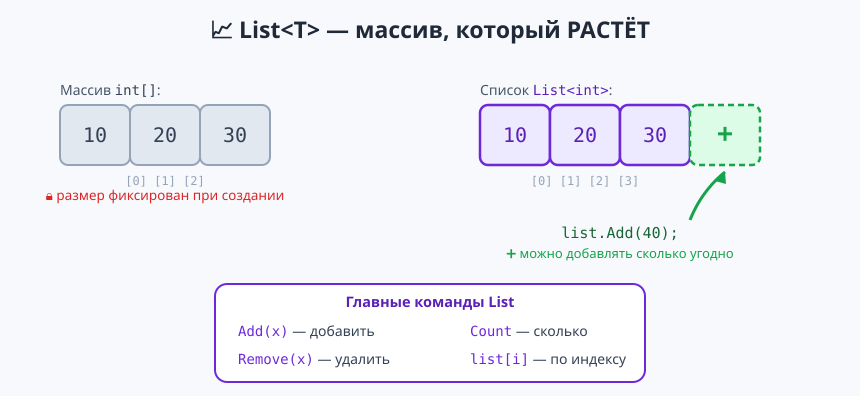
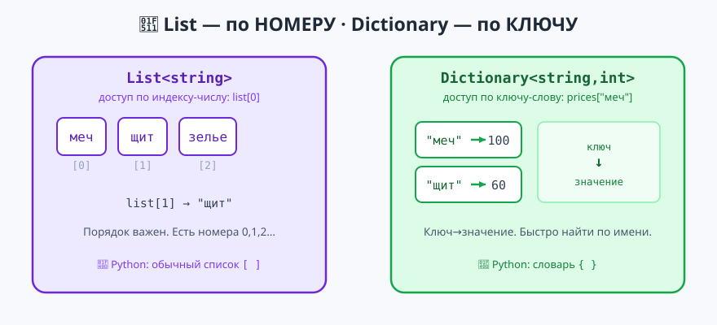

# Урок 8 — 🧩 «Коллекции: `List` и `Dictionary`» 🎒

**Блок 1 · Синтаксис C# + ООП · Урок 8 из 12 | 2 ак.ч. (1,5 часа)**

> ⬅️ Предыдущий: [Урок 7 «Методы»](../урок-07-методы/урок.md) · [Все уроки блока](../README.md) · [План курса](../../ПЛАН-КУРСА.md) · Следующий: [Урок 9 «Файлы и исключения»](../урок-09-файлы-исключения/урок.md) ➡️

> 🔁 В начале — [разминка/повтор](повторение.md) (5 мин).
> 📌 Быстро вспомнить материал урока — [итого.md](итого.md) (шпаргалка).
> 👨‍🏫 Сценарий с хронометражом — в [преподавателю.md](преподавателю.md).
> 🖼 Что показать на проекторе — в [изображения.md](изображения.md).
> 🆘 **Пропустил урок или хочешь закрепить?** Открой [самоучитель.md](самоучитель.md) — теория + задания с подсказками.
> 🧰 Трюки и частые ошибки — в [лайфхак.md](лайфхак.md).

> 🧭 **Как читать урок.** В Уроке 6 массив `int[]` был удобен, но у него **фиксированный размер** — сколько задал при создании, столько и будет. А в жизни данные **растут**: список дел, инвентарь, участники чата. Сегодня — **`List<T>`** («массив, который растёт»: `Add`, `Remove`, `Sort`…) и **`Dictionary<K,V>`** («словарь ключ→значение», как в Python `{ }`). В конце — интерактивный проект «Инвентарь героя». Имена: переменные — **`camelCase`** (`backpack`), методы — **`PascalCase`** (`ShowBackpack`).

---

## 🎮 Что мы сделаем сегодня и что получим

**Задача:** хранить данные, которые растут и меняются, — и собрать интерактивный «Инвентарь героя» с меню.

**В итоге получится** (пример):

```
=== ИНВЕНТАРЬ ГЕРОЯ ===
1 — добавить предмет
2 — удалить предмет
3 — показать рюкзак
...
Твой выбор: 3
В рюкзаке 3 предмет(ов):
  1. золото
  2. золото
  3. меч

Счётчик добычи:
  золото: 2 шт.
  меч: 1 шт.
```

**Главные навыки урока:** `List<T>` (создать, `Add`/`Insert`/`Remove`/`RemoveAt`) · `Count` и `list[i]` · `Contains`/`IndexOf` · `Sort`/`Reverse` · LINQ по списку (`Max/Sum/Average`) · `Dictionary<K,V>` (ключ→значение, `ContainsKey`, `TryGetValue`, перебор) · счётчик через словарь.

> 💡 **Главная мысль урока:** массив — это **полка с фиксированным числом ячеек**. `List` — **рюкзак**: клади и вынимай сколько нужно. `Dictionary` — **раздевалка с номерками**: по ключу (номерку) мгновенно находишь значение (куртку).

---

## Часть 0 — Разминка: список Python → `List` в C# (5 минут)

**Python:**
```python
quests = []
quests.append("Найти меч")
quests.append("Победить дракона")
print(len(quests))     # 2
print(quests[0])       # Найти меч
```

**C#:**
```csharp
List<string> quests = new List<string>();   // пустой список строк
quests.Add("Найти меч");
quests.Add("Победить дракона");
Console.WriteLine(quests.Count);   // 2
Console.WriteLine(quests[0]);      // Найти меч
```

| Python | C# |
|--------|-----|
| `quests = []` | `List<string> quests = new List<string>();` — тип элементов в `< >` |
| `quests.append(x)` | `quests.Add(x);` |
| `len(quests)` | `quests.Count` (без скобок — это свойство) |
| `quests[0]` | `quests[0]` (так же!) |
| `x in quests` | `quests.Contains(x)` |

> 🐍 **Мостик:** идея та же, что список в Python. Новое в C# — **тип элементов** пишем в угловых скобках: `List<string>`, `List<int>`. `<T>` читается «список **чего-то**» (T — type, тип).

---

## Часть 1 — `List<T>`: создаём, добавляем, читаем (14 минут)



**Создать** список можно пустым или сразу со значениями:
```csharp
List<string> heroes = new List<string>();          // пустой
List<int> scores = new List<int> { 40, 90, 65 };   // сразу с числами
```

**`Add`** — добавить в конец (список растёт!). **`Count`** — сколько сейчас элементов. **`list[i]`** — элемент по индексу (нумерация с 0, как в массиве):
```csharp
heroes.Add("Артур");
heroes.Add("Мерлин");
heroes.Add("Гвен");

Console.WriteLine($"Героев: {heroes.Count}");   // Героев: 3
Console.WriteLine(heroes[0]);                   // Артур
Console.WriteLine(heroes[heroes.Count - 1]);    // Гвен — последний
```

**Перебор** — `foreach` (как по массиву) или `for` с индексом:
```csharp
foreach (string name in heroes)
    Console.WriteLine("🛡 " + name);

for (int i = 0; i < heroes.Count; i++)
    Console.WriteLine($"{i + 1}. {heroes[i]}");   // с номерами: 1. Артур ...
```

> 💡 **Лайфхак: `Count`, а не `Length`.** У массива было `.Length`, у списка — **`.Count`** (оба без скобок). Частая путаница — запомни: спис**ок** → C**ount**.

**Второй пример — «очередь на аттракцион»** (список растёт по мере прихода):
```csharp
List<string> queue = new List<string>();
queue.Add("Аня");
queue.Add("Боря");
Console.WriteLine($"В очереди {queue.Count}: первый — {queue[0]}");
```

> ✍️ **Мини-задание 1 (3 мин):** заведи `List<string> playlist`, добавь 3 любимые песни, выведи их количество и первую в списке.
> <details><summary>💡 подсказка</summary><code>playlist.Add("...")</code> три раза; потом <code>playlist.Count</code> и <code>playlist[0]</code>.</details>

---

## Часть 2 — Методы `List`: вставить, удалить, найти (14 минут)

Список умеет не только расти, но и **менять содержимое** — вот главные команды:

**`Insert(i, x)`** — вставить на позицию `i` (остальные сдвинутся вправо):
```csharp
List<string> steps = new List<string> { "проснуться", "в школу" };
steps.Insert(1, "позавтракать");   // между ними
// проснуться, позавтракать, в школу
```

**`Remove(x)`** — удалить **первое** такое значение. **`RemoveAt(i)`** — удалить по индексу:
```csharp
List<string> bag = new List<string> { "меч", "щит", "меч", "лук" };
bag.Remove("меч");     // убрали ПЕРВЫЙ меч → щит, меч, лук
bag.RemoveAt(0);       // убрали элемент [0] (щит) → меч, лук
```

**`Contains(x)`** — есть ли такой элемент (`true`/`false`). **`IndexOf(x)`** — на каком он месте (или `-1`, если нет):
```csharp
Console.WriteLine(bag.Contains("лук"));   // True
Console.WriteLine(bag.IndexOf("лук"));    // 1
Console.WriteLine(bag.IndexOf("шлем"));   // -1 (нет такого)
```

**`Clear()`** — очистить весь список; после него `Count == 0`:
```csharp
bag.Clear();
Console.WriteLine(bag.Count);   // 0
```

> 💡 **Лайфхак: проверяй перед удалением.** `Remove` несуществующего элемента не ломает программу (просто вернёт `false`), а вот `RemoveAt(100)` при 3 элементах — **ошибка** `ArgumentOutOfRangeException`. Перед `list[i]`/`RemoveAt(i)` держи `i` в диапазоне `0..Count-1`.

**Второй пример — «список дел», вычёркиваем сделанное:**
```csharp
List<string> todo = new List<string> { "уроки", "погулять", "убраться" };
todo.Remove("уроки");     // сделал — убрали
Console.WriteLine($"Осталось дел: {todo.Count}");   // Осталось дел: 2
```

> ✍️ **Мини-задание 2 (3 мин):** заведи `List<string>` из 4 предметов. Вставь новый предмет на 2-е место (`Insert`), удали любой по значению (`Remove`) и проверь через `Contains`, остался ли он.
> <details><summary>💡 подсказка</summary><code>bag.Insert(1, "зелье");</code>, <code>bag.Remove("щит");</code>, <code>Console.WriteLine(bag.Contains("щит"));</code></details>

---

## Часть 3 — Сортировка и LINQ прямо по списку (10 минут)

Список умеет **сам себя сортировать** — метод меняет **сам список** (в отличие от `Array.Sort`, который сортировал массив на месте — тут похоже):
```csharp
List<int> scores = new List<int> { 40, 90, 65, 20 };
scores.Sort();        // по возрастанию: 20, 40, 65, 90
scores.Reverse();     // перевернуть: 90, 65, 40, 20

List<string> names = new List<string> { "Гена", "Аня", "Боря" };
names.Sort();         // по алфавиту: Аня, Боря, Гена
```

**Печать всего списка одной строкой** — через `string.Join`:
```csharp
Console.WriteLine(string.Join(", ", scores));   // 90, 65, 40, 20
```

> 💡 **Лайфхак: `string.Join(разделитель, список)`** склеивает все элементы через разделитель — удобно печатать список красиво, без цикла.

**LINQ работает и по списку** (мы знаем его с Урока 6 — там был массив). `Max`, `Min`, `Sum`, `Average`, `Count(условие)`:
```csharp
Console.WriteLine(scores.Max());              // 90
Console.WriteLine(scores.Sum());              // 215
Console.WriteLine(scores.Average());          // 53,75  (запятая — локаль ru-RU)
Console.WriteLine(scores.Count(x => x >= 50));// 2 — сколько ≥ 50
```

> 👀 `Count()` (без аргумента) = сколько всего; `Count(x => x >= 50)` = сколько подходит под условие. Не путай со свойством `.Count` (без скобок) — оно тоже даёт размер.

> ✍️ **Мини-задание 3 (3 мин):** заведи `List<int>` с оценками `{ 5, 3, 4, 5, 2 }`. Отсортируй, выведи через `string.Join`, найди среднее и сколько оценок «5» (`Count(x => x == 5)`).
> <details><summary>💡 подсказка</summary><code>marks.Sort();</code>, <code>string.Join(" ", marks)</code>, <code>marks.Average()</code>, <code>marks.Count(x => x == 5)</code>.</details>

---

## Часть 4 — ⭐ `Dictionary<K,V>`: ключ → значение (16 минут)



В списке ищем по **номеру** (`list[0]`). Но часто удобнее искать по **имени**: цена «меча», телефон «Ани», счёт команды «красных». Для этого — **`Dictionary<K,V>`** (в Python это словарь `{ }`): пара **ключ → значение**.

`<K,V>` — два типа: `K` — тип **ключа**, `V` — тип **значения**.
```csharp
Dictionary<string, int> prices = new Dictionary<string, int>();  // ключ-строка → значение-число
prices["меч"] = 100;     // положили пару
prices["щит"] = 60;
prices.Add("зелье", 25); // то же самое через Add
```

**Читаем по ключу** — как индекс, только в квадратных скобках стоит **слово**:
```csharp
Console.WriteLine(prices["меч"]);   // 100
prices["меч"] = 120;                // перезаписали значение
Console.WriteLine(prices["меч"]);   // 120
```

> ⚠️ Обратиться к **несуществующему ключу** (`prices["лук"]`) — **ошибка** `KeyNotFoundException`. Сначала проверь, что ключ есть.

**`ContainsKey`** — есть ли такой ключ. **`TryGetValue`** — безопасно взять значение (и проверить, и достать за один раз — как `out` в Уроке 7):
```csharp
if (prices.ContainsKey("щит"))
    Console.WriteLine($"Щит стоит {prices["щит"]}");

if (prices.TryGetValue("лук", out int price))
    Console.WriteLine($"Лук: {price}");
else
    Console.WriteLine("Лука нет в прайсе");   // сработает эта ветка
```

**`Remove(ключ)`**, **`Count`**, **перебор** пар через `foreach` (каждая пара — `pair.Key` и `pair.Value`):
```csharp
prices.Remove("зелье");
Console.WriteLine($"Товаров: {prices.Count}");

foreach (var pair in prices)
    Console.WriteLine($"{pair.Key} = {pair.Value}");   // меч = 120 ...
```

| Python | C# |
|--------|-----|
| `prices = {}` | `Dictionary<string,int> prices = new();` |
| `prices["меч"] = 100` | `prices["меч"] = 100;` |
| `"меч" in prices` | `prices.ContainsKey("меч")` |
| `for k, v in prices.items():` | `foreach (var pair in prices)` → `pair.Key`, `pair.Value` |
| `del prices["меч"]` | `prices.Remove("меч");` |

> 💡 **Лайфхак: `new()` без повтора типа.** Вместо `new Dictionary<string,int>()` можно написать короче: `Dictionary<string,int> prices = new();` — тип уже слева, C# сам поймёт. Работает и для `List`: `List<int> x = new();`.

**Второй пример — расписание уроков.** Это прямо «родная» задача для словаря: ключ — **день недели**, значение — **уроки в этот день**. Спрашиваем у пользователя день и мгновенно находим его расписание:
```csharp
Dictionary<string, string> schedule = new()
{
    ["Понедельник"] = "Математика, Русский, Физкультура",
    ["Вторник"]     = "История, Биология, Английский",
    ["Среда"]       = "Информатика, Химия, Литература",
};

Console.Write("Какой день? ");
string day = Console.ReadLine();
if (schedule.ContainsKey(day))
    Console.WriteLine($"Уроки: {schedule[day]}");    // нашли сразу по ключу-дню
else
    Console.WriteLine("В этот день уроков нет — выходной!");
```

- 👀 Ключ здесь — **слово** («Среда»), а не номер. Спросили «Среда» → мгновенно получили её уроки. В списке пришлось бы перебирать все элементы по очереди, а словарь находит по ключу сразу — в этом его сила.

> 💡 **Лайфхак: словарь + список вместе.** Если в дне не одна строка, а целый **набор** уроков, который надо считать и дополнять, — значением делают **список**: `Dictionary<string, List<string>>`. Тогда `plan["Понедельник"].Add("Классный час")` дописывает урок в этот день, а `plan["Понедельник"].Count` считает, сколько их. Это уже 🎓 для продвинутых — но показывает, как `List` и `Dictionary` работают в паре.

**⭐ Классика словаря — счётчик.** Считаем, сколько раз встречается каждое слово/предмет:
```csharp
string[] loot = { "золото", "золото", "меч", "золото" };
Dictionary<string, int> counter = new Dictionary<string, int>();

foreach (string item in loot)
{
    if (counter.ContainsKey(item)) counter[item]++;   // уже видели — +1
    else counter[item] = 1;                            // впервые — ставим 1
}
// золото → 3, меч → 1
```

> 👀 Это тот самый приём, который в проекте посчитает «сколько чего в рюкзаке». Запомни схему: `ContainsKey` → `++` иначе `= 1`.

> ✍️ **Мини-задание 4 (4 мин):** заведи `Dictionary<string,int> phones` (имя → номер как число не обязателен — пусть будет `string,string`). Добавь 2 контакта, выведи один по ключу и проверь через `ContainsKey`, есть ли «Петя».
> <details><summary>💡 подсказка</summary><code>Dictionary&lt;string,string&gt; phones = new();</code>, <code>phones["Аня"]="123";</code>, <code>phones.ContainsKey("Петя")</code>.</details>

---

## Часть 5 — 🏆 Проект «Инвентарь героя» (14 минут)

Соберём интерактивный рюкзак: `List<string>` хранит предметы (растёт!), меню в цикле `while(true)` даёт команды, а пункт «счётчик» строит `Dictionary`. Готовый код — в [`материалы/Program.cs`](материалы/Program.cs):

```csharp
List<string> backpack = new List<string>();

while (true)
{
    Console.ForegroundColor = ConsoleColor.Cyan;
    Console.WriteLine("\n=== ИНВЕНТАРЬ ГЕРОЯ ===");
    Console.ResetColor();
    Console.WriteLine("1 — добавить  2 — удалить  3 — показать  4 — сортировать  5 — счётчик  0 — выход");
    Console.Write("Твой выбор: ");
    string choice = Console.ReadLine();

    if (choice == "1")
    {
        Console.Write("Что положить? ");
        string item = Console.ReadLine();
        backpack.Add(item);                          // список растёт
        Console.WriteLine($"+ {item} (всего: {backpack.Count})");
    }
    else if (choice == "2")
    {
        Console.Write("Что выбросить? ");
        string item = Console.ReadLine();
        if (backpack.Contains(item)) { backpack.Remove(item); Console.WriteLine("Выброшено."); }
        else Console.WriteLine("Такого нет.");
    }
    else if (choice == "3") ShowBackpack(backpack);
    else if (choice == "4") { backpack.Sort(); ShowBackpack(backpack); }
    else if (choice == "5") ShowCounts(backpack);
    else if (choice == "0") break;
    else Console.WriteLine("Нет такого пункта.");
}

// печатает рюкзак с номерами
void ShowBackpack(List<string> items)
{
    if (items.Count == 0) { Console.WriteLine("Рюкзак пуст."); return; }
    for (int i = 0; i < items.Count; i++)
        Console.WriteLine($"  {i + 1}. {items[i]}");
}

// счётчик: сколько каждого предмета — через Dictionary
void ShowCounts(List<string> items)
{
    Dictionary<string, int> counts = new Dictionary<string, int>();
    foreach (string item in items)
    {
        if (counts.ContainsKey(item)) counts[item]++;
        else counts[item] = 1;
    }
    foreach (var pair in counts)
        Console.WriteLine($"  {pair.Key}: {pair.Value} шт.");
}
```

- 👀 Главный цикл — как «пульт»: нажал цифру → сработала команда. `List` держит предметы, `Dictionary` считает дубликаты. Вся «начинка» спрятана в методы (Урок 7!).

> 🧩 **Для 5–7 классов:** оставь пункты 1, 2, 3 (добавить/удалить/показать) — уже полноценный инвентарь. 🎓 **Глубже:** добавь пункт «поиск» (`IndexOf` — сообщить, на каком месте предмет) и лимит рюкзака (не больше 10 предметов через проверку `Count`).

> ✍️ **Мини-задание 5 (3 мин):** добавь в меню пункт «6 — сколько всего предметов» — печатает `backpack.Count`. И пункт «7 — очистить рюкзак» через `backpack.Clear()`.
> <details><summary>💡 подсказка</summary><code>else if (choice == "6") Console.WriteLine(backpack.Count);</code> и <code>else if (choice == "7") backpack.Clear();</code></details>

---

## 🐞 Разбор частых ошибок

| Симптом | Что случилось | Как починить |
|---------|---------------|--------------|
| `The type ... must be ...` / не создаётся | забыл тип в `< >` | пиши `List<string>`, `Dictionary<string,int>` |
| `.Length` не работает у списка | у `List` размер — `.Count` | замени `.Length` → `.Count` |
| `ArgumentOutOfRangeException` | `list[i]`/`RemoveAt(i)` с плохим `i` | держи `i` в `0..Count-1` |
| `KeyNotFoundException` | взял `dict[ключ]`, а ключа нет | проверь `ContainsKey` или используй `TryGetValue` |
| в словаре пропала пара | `dict[ключ] = ...` **перезаписал** старое значение | ключ уникален; тот же ключ = замена значения |
| `Remove` «не сработал» | удаляет только **первое** совпадение | вызови ещё раз или чисти циклом |

> ⚠️ **Главное правило:** `List<T>` — растущий список (индекс — число, размер — `Count`). `Dictionary<K,V>` — ключ→значение (доступ по ключу, ключи уникальны). Перед `dict[key]` проверяй `ContainsKey`/`TryGetValue`.

---

## 🎓 Глубже

**`var` для краткости:** `var heroes = new List<string>();` — тип виден справа, можно не дублировать слева.

**Коллекция объектов:** скоро (Урок 10–11 ООП) появится `List<Hero>` — список не строк, а целых **объектов-героев**. Инвентарь станет «умным». Проект Урока 12 — как раз `List` объектов.

**Другие коллекции (обзор):** `HashSet<T>` — множество без повторов (как `set` в Python); `Queue<T>` — очередь (первый пришёл — первый вышел); `Stack<T>` — стопка (последний пришёл — первый вышел). Пока хватит `List` и `Dictionary` — это 90% задач.

**`foreach` по словарю** даёт `KeyValuePair<K,V>` — поэтому `pair.Key` и `pair.Value`. Можно и по `dict.Keys` / `dict.Values` отдельно.

---

## 🧩 Для 5–7 классов

- `List<T>` — список, который **растёт**: `Add` добавить, `Remove` убрать, `Count` — сколько, `list[i]` — по номеру.
- Перебор — `foreach (var x in list)`.
- `Sort()` — отсортировать список.
- `Dictionary<K,V>` — «ключ → значение» (как словарь в Python): `dict["меч"] = 100`.
- Проект — «Инвентарь героя»: добавляй, удаляй, показывай.

---

## 🏁 Итог урока (5 минут)

Теперь данные могут расти и искаться по имени:

- ✅ **`List<T>`** — «массив, который растёт»: `Add`/`Insert`/`Remove`/`RemoveAt`, `Count`, `list[i]`.
- ✅ Поиск: **`Contains`**, **`IndexOf`**; порядок: **`Sort`**, **`Reverse`**; печать: `string.Join`.
- ✅ **LINQ по списку**: `Max/Min/Sum/Average/Count(условие)`.
- ✅ **`Dictionary<K,V>`** — ключ→значение: `dict[key]`, `ContainsKey`, `TryGetValue`, перебор пар.
- ✅ **Счётчик через словарь** (`ContainsKey` → `++` иначе `= 1`).
- ✅ Собрали интерактивный «Инвентарь героя» из `List` + `Dictionary` + методов.

> 🎉 `List` и `Dictionary` — рабочие лошадки любой программы. Дальше (Урок 9) — **файлы и исключения** (`try/catch`): сохраним инвентарь в файл, чтобы он не терялся. Быстро повторить — в [итого.md](итого.md).

> 🎤 **Блиц:** чем `List` лучше массива? как узнать размер списка? что делает `Contains`? чем `Dictionary` отличается от `List`? как безопасно взять значение по ключу?

### 🎮 Викторина-закрепление
Открой **[викторина.html](викторина.html)** — вопросы по `List`/`Dictionary` + смешные и «на подумать».

➡️ **Практика урока** — **[практика.md](практика.md)**: задачи в 3 уровнях.
🆘 **Пропустил / хочешь ещё?** — [самоучитель.md](самоучитель.md) (теория + задания с подсказками).
🧰 **Трюки и ошибки** — [лайфхак.md](лайфхак.md). 📌 **Шпаргалка** — [итого.md](итого.md).

---

## 🔗 Навигация и материалы

⬅️ **Предыдущий:** [Урок 7 «Методы»](../урок-07-методы/урок.md) · [Все уроки блока](../README.md) · [План курса](../../ПЛАН-КУРСА.md) · **Следующий:** [Урок 9 «Файлы и исключения»](../урок-09-файлы-исключения/урок.md) ➡️

**🧰 Инструменты:** [.NET 10 SDK](https://dotnet.microsoft.com/download) · **Windows:** [Visual Studio 2022](https://visualstudio.microsoft.com/) · **Mac:** [VS Code](https://code.visualstudio.com/) + C# Dev Kit. Настройка обеих сред — [`справочники/среда-VisualStudio-и-VSCode.md`](../../справочники/среда-VisualStudio-и-VSCode.md).
**📄 Готовый код:** [`материалы/Program.cs`](материалы/Program.cs) (интерактивный «Инвентарь героя»).
**⚙️ Учителю:** сценарий и частые ошибки — в [преподавателю.md](преподавателю.md).
