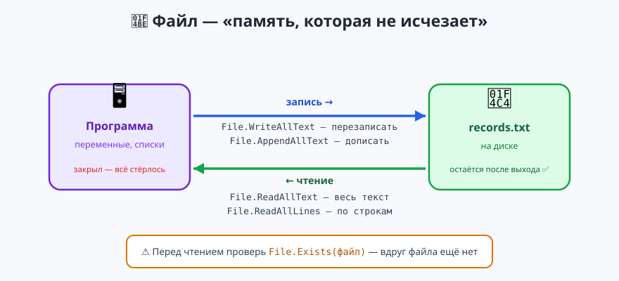
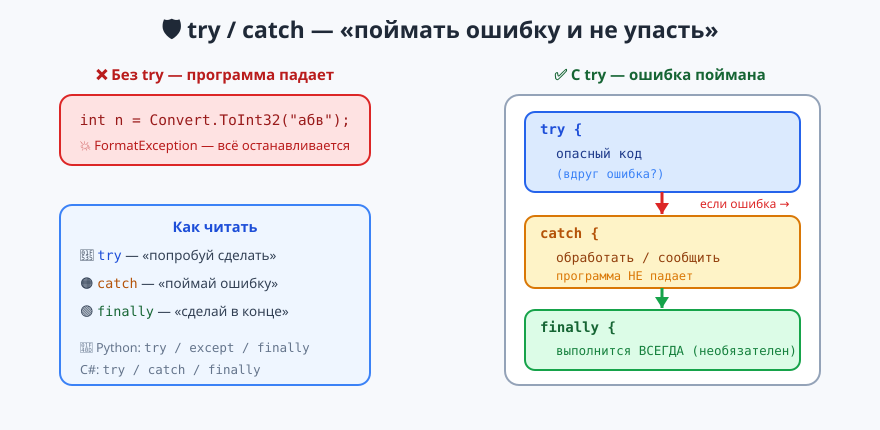

# Урок 9 — 🧩 «Файлы и исключения»: сохраняем данные и ловим ошибки 💾🛡

**Блок 1 · Синтаксис C# + ООП · Урок 9 из 12 | 2 ак.ч. (1,5 часа)**

> ⬅️ Предыдущий: [Урок 8 «Коллекции: List и Dictionary»](../урок-08-коллекции-list/урок.md) · [Все уроки блока](../README.md) · [План курса](../../ПЛАН-КУРСА.md) · Следующий: [Урок 10 «ООП: классы и объекты»](../урок-10-ооп-классы/урок.md) ➡️

> 🔁 В начале — [разминка/повтор](повторение.md) (5 мин).
> 📌 Быстро вспомнить материал урока — [итого.md](итого.md) (шпаргалка).
> 👨‍🏫 Сценарий с хронометражом — в [преподавателю.md](преподавателю.md).
> 🖼 Что показать на проекторе — в [изображения.md](изображения.md).
> 🆘 **Пропустил урок или хочешь закрепить?** Открой [самоучитель.md](самоучитель.md) — теория + задания с подсказками.
> 🧰 Трюки и частые ошибки — в [лайфхак.md](лайфхак.md).

> 🧭 **Как читать урок.** До сих пор все данные жили в памяти: закрыл программу — список и рекорды **исчезли**. Сегодня научимся **сохранять их в файл** (`File.WriteAllText`, `ReadAllText`…), чтобы они оставались после выхода. И вторая большая тема — **исключения**: программа больше не будет «падать» от кривого ввода или пропавшего файла. Мы будем **ловить ошибки** через **`try/catch/finally`** (в Python это `try/except`) и защищать ввод через **`int.TryParse`**. В конце — проект «Дневник рекордов». Имена: переменные — **`camelCase`**, методы — **`PascalCase`**.

---

## 🎮 Что мы сделаем сегодня и что получим

**Задача:** сохранять данные в файл и не давать программе падать от ошибок.

**В итоге получится** (пример — «Дневник рекордов»):

```
=== ДНЕВНИК РЕКОРДОВ ===
1 — добавить рекорд
...
Твой выбор: 1
Имя игрока: Артур
Очки (число): сто
Очки должны быть числом! Запись отменена.

Твой выбор: 2
Всего рекордов: 2
  Артур: 100 очков
  Мерлин: 90 очков
```

**Главные навыки урока:** запись в файл (`WriteAllText`/`AppendAllText`) · чтение (`ReadAllText`/`ReadAllLines`) · `File.Exists` · **`try/catch`** (не упасть при ошибке) · `finally` и `throw` · типы исключений (`FormatException`, `DivideByZeroException`, `FileNotFoundException`) · **`int.TryParse`** (защита ввода).

> 💡 **Главная мысль урока:** переменная — это память **на время работы** программы; файл — память **навсегда** (на диске). А `try/catch` — это **страховка**: опасное действие делаем «под присмотром», и если что-то ломается — ловим и продолжаем, а не рушимся.

---

## Часть 0 — Разминка: как это было в Python (5 минут)

**Python (файл и ошибки):**
```python
with open("data.txt", "w") as f:   # запись
    f.write("Привет")

try:
    n = int("абв")                 # ошибка!
except ValueError:
    print("это не число")
```

**C#:**
```csharp
File.WriteAllText("data.txt", "Привет");   // запись — одной строкой

try
{
    int n = Convert.ToInt32("абв");        // ошибка!
}
catch (FormatException)
{
    Console.WriteLine("это не число");
}
```

| Python | C# |
|--------|-----|
| `open(...).write(...)` | `File.WriteAllText(файл, текст)` — короче, без `open/close` |
| `f.read()` | `File.ReadAllText(файл)` |
| `try / except` | `try / catch` |
| `except ValueError:` | `catch (FormatException)` — у ошибки есть **тип** |
| `finally:` | `finally` (так же) |

> 🐍 **Мостик:** идея та же. В C# **не нужно вручную открывать и закрывать** файл — методы `File.*` делают всё за одну строку. А `except` называется `catch`.

---

## Часть 1 — Запись в файл: `WriteAllText` и `AppendAllText` (12 минут)



**`File.WriteAllText(файл, текст)`** — создать файл и записать текст. ⚠️ Если файл уже был — он **перезапишется** (старое сотрётся):
```csharp
File.WriteAllText("diary.txt", "Мой дневник\n");   // создали и записали
```

**`File.AppendAllText(файл, текст)`** — **дописать** в конец, ничего не стирая. Именно так копят записи:
```csharp
File.AppendAllText("diary.txt", "Сегодня выучил файлы\n");
File.AppendAllText("diary.txt", "Завтра — ООП\n");
```

Где появится файл? Рядом с программой (в Visual Studio — в папке `bin\Debug\...`). Можно указать и полный путь: `"C:\\temp\\diary.txt"`.

> 💡 **Лайфхак: `\n` — новая строка.** Чтобы записи не слиплись в одну строку, в конце каждой добавляй `\n` (перевод строки). Или используй `WriteAllLines`, который сам разложит массив по строкам.

**Второй пример — сохранить список счётчика посещений.** Собрали данные в программе — сбросили в файл одним махом:
```csharp
string[] visitors = { "Аня", "Боря", "Вера" };
File.WriteAllLines("visitors.txt", visitors);   // каждый — с новой строки
```

> ✍️ **Мини-задание 1 (3 мин):** создай файл `notes.txt`, запиши в него первую строку через `WriteAllText`, потом **допиши** ещё две строки через `AppendAllText`. Открой файл в проводнике и проверь, что все три строки на месте.
> <details><summary>💡 подсказка</summary>Сначала `WriteAllText` (перезапишет/создаст), потом два раза `AppendAllText`. Не забудь `\n` в конце каждой строки, иначе слипнутся.</details>

---

## Часть 2 — Чтение из файла: `ReadAllText`, `ReadAllLines`, `File.Exists` (12 минут)

**`File.ReadAllText(файл)`** — прочитать **весь файл** одной строкой:
```csharp
string text = File.ReadAllText("diary.txt");
Console.WriteLine(text);
```

**`File.ReadAllLines(файл)`** — прочитать в **массив строк** (каждая строка файла — элемент массива). Дальше — привычный `foreach`:
```csharp
string[] lines = File.ReadAllLines("diary.txt");
Console.WriteLine($"Записей: {lines.Length}");
foreach (string line in lines)
    Console.WriteLine("• " + line);
```

**⚠️ Главная опасность — файла может не быть** (первый запуск, удалили, опечатка в имени). Тогда `ReadAllText` **уронит программу**. Поэтому перед чтением проверяем **`File.Exists(файл)`**:
```csharp
if (File.Exists("diary.txt"))
{
    string text = File.ReadAllText("diary.txt");
    Console.WriteLine(text);
}
else
{
    Console.WriteLine("Дневник пока пуст — записей нет.");
}
```

> 💡 **Лайфхак: «проверь, потом читай».** `File.Exists` возвращает `true`/`false`. Это как `ContainsKey` у словаря из Урока 8: сначала убедись, что есть, — потом бери.

**Второй пример — посчитать строки в файле:**
```csharp
if (File.Exists("visitors.txt"))
{
    int count = File.ReadAllLines("visitors.txt").Length;
    Console.WriteLine($"Гостей записано: {count}");
}
```

> ✍️ **Мини-задание 2 (3 мин):** прочитай файл `notes.txt` из задания 1 через `ReadAllLines` и выведи каждую строку с номером (1., 2., 3.). Перед чтением обязательно проверь `File.Exists`.
> <details><summary>💡 подсказка</summary>Пробегись по массиву обычным <code>for</code> — тогда номер строки это <code>i + 1</code>, а сам текст <code>lines[i]</code>.</details>

---

## Часть 3 — ⭐ `try/catch`: поймать ошибку и не упасть (14 минут)



**Исключение (exception)** — это ошибка **во время работы** программы: ввели буквы вместо числа, поделили на ноль, попросили несуществующий файл. Обычно такая ошибка **рушит всю программу**. Пример «падения»:
```csharp
int n = Convert.ToInt32("абв");   // 💥 FormatException — программа остановилась
```

**`try/catch`** говорит: «**попробуй** сделать опасное; если сломается — **поймай** и продолжи»:
```csharp
try
{
    int n = Convert.ToInt32("абв");   // опасное действие
    Console.WriteLine(n);
}
catch (FormatException)               // ловим именно эту ошибку
{
    Console.WriteLine("Это не число! Введи цифры.");
}
Console.WriteLine("Программа продолжает работать 🙂");
```
Теперь программа **не падает** — она печатает сообщение и идёт дальше.

**У каждой ошибки есть тип.** Ловить можно конкретный:
```csharp
try
{
    int a = 10, b = 0;
    Console.WriteLine(a / b);          // деление на ноль
}
catch (DivideByZeroException)
{
    Console.WriteLine("На ноль делить нельзя!");
}
```

**Узнать, что случилось** — через объект ошибки `ex` и его `.Message`:
```csharp
try
{
    string text = File.ReadAllText("нет-файла.txt");
}
catch (FileNotFoundException ex)
{
    Console.WriteLine("Файл не найден: " + ex.Message);
}
```

> 💡 **Лайфхак: `catch (Exception ex)` ловит ЛЮБУЮ ошибку.** `Exception` — «главный» тип всех ошибок. Если не знаешь заранее, что сломается, лови его: `catch (Exception ex) { Console.WriteLine(ex.Message); }`. Но лучше ловить **конкретный** тип — так понятнее, что именно случилось.

> ✍️ **Мини-задание 3 (4 мин):** попроси у пользователя число (`Console.ReadLine`), переведи его через `Convert.ToInt32` **внутри `try`**. Если ввели не число — в `catch (FormatException)` напиши «Это не похоже на число».
> <details><summary>💡 подсказка</summary>Опасную строку <code>Convert.ToInt32(...)</code> положи внутрь <code>try { }</code>, а сообщение об ошибке — в <code>catch (FormatException) { }</code>.</details>

---

## Часть 4 — `finally` и `throw`: завершение и своя ошибка (12 минут)

**`finally`** — блок, который выполнится **в любом случае**: и когда всё хорошо, и когда была ошибка. В него кладут «уборку» (закрыть, сохранить, сообщить «готово»):
```csharp
try
{
    Console.WriteLine("Считаем...");
    int x = Convert.ToInt32("ой");     // упадёт
}
catch (FormatException)
{
    Console.WriteLine("Ошибка ввода.");
}
finally
{
    Console.WriteLine("Проверка завершена.");   // напечатается ВСЕГДА
}
```

**`throw`** — **самому бросить** ошибку, когда данные недопустимы (проверка правил). Пусть возраст не может быть отрицательным:
```csharp
void SetAge(int age)
{
    if (age < 0)
        throw new ArgumentException("Возраст не может быть отрицательным!");
    Console.WriteLine($"Возраст: {age}");
}

try
{
    SetAge(-5);                        // бросит ошибку
}
catch (ArgumentException ex)
{
    Console.WriteLine("Поймали: " + ex.Message);
}
```

- 👀 `throw` — как «стоп-кран»: обнаружил недопустимое — сразу сигналишь об ошибке, а тот, кто вызвал метод, ловит её в `catch`.

> ✍️ **Мини-задание 4 (3 мин):** напиши метод `void Divide(int a, int b)`, который печатает `a / b`, но если `b == 0` — сам бросает `throw new DivideByZeroException("Делить на ноль!")`. Вызови его в `try/catch` с `b = 0`.
> <details><summary>💡 подсказка</summary>Внутри метода: <code>if (b == 0) throw new DivideByZeroException(...);</code> — а вызов оберни в <code>try/catch (DivideByZeroException ex)</code>.</details>

---

## Часть 5 — ⭐ `int.TryParse`: защита ввода без падений (10 минут)

`try/catch` — мощно, но для «проверить, число ли ввели» есть приём проще и аккуратнее — **`int.TryParse`**. Он **пробует** превратить строку в число и возвращает `true`/`false` (а само число кладёт в `out`-переменную — помнишь `out` из Урока 7?):
```csharp
Console.Write("Введи число: ");
string input = Console.ReadLine();

if (int.TryParse(input, out int number))    // получилось превратить в число?
    Console.WriteLine($"Твоё число: {number}, удвоенное: {number * 2}");
else
    Console.WriteLine("Это не число! Попробуй ещё раз.");
```
Никакого падения и никакого `try/catch` — просто `if/else`.

**Сравни два подхода:**
| Подход | Когда удобно |
|--------|--------------|
| `int.TryParse` | «а вдруг ввели не число?» — обычная **проверка ввода** |
| `try/catch` | опасные операции пошире: файлы, деление, чужой код |

> 💡 **Лайфхак: цикл «пока не введёт число».** Совмести `TryParse` с `while` — и программа будет **переспрашивать**, пока не получит корректное число:
> ```csharp
> int age;
> while (!int.TryParse(Console.ReadLine(), out age))
>     Console.WriteLine("Нужно число! Повтори:");
> Console.WriteLine($"Принято: {age}");
> ```

> ✍️ **Мини-задание 5 (3 мин):** попроси возраст и через `int.TryParse` проверь ввод. Если число — напиши «Тебе N лет», если нет — «Возраст вводят цифрами».
> <details><summary>💡 подсказка</summary><code>if (int.TryParse(input, out int age)) ... else ...</code>. Внутри <code>if</code> переменная <code>age</code> уже готова к использованию.</details>

---

## Часть 6 — 🏆 Проект «Дневник рекордов» (14 минут)

Собираем всё вместе: рекорды игры **сохраняются в файл** (не теряются при перезапуске!), ввод очков **защищён** `TryParse`, а чтение — проверкой `File.Exists`. Меню — из методов (Урок 7). Полный код — в [`материалы/Program.cs`](материалы/Program.cs):

```csharp
string fileName = "records.txt";   // файл появится рядом с программой

while (true)
{
    Console.WriteLine("\n=== ДНЕВНИК РЕКОРДОВ ===");
    Console.WriteLine("1 — добавить  2 — показать  3 — лучший  0 — выход");
    Console.Write("Твой выбор: ");
    string choice = Console.ReadLine();

    if (choice == "1") AddRecord(fileName);
    else if (choice == "2") ShowRecords(fileName);
    else if (choice == "3") ShowBest(fileName);
    else if (choice == "0") break;
}

// добавляет "имя;очки" в файл, с защитой ввода
void AddRecord(string file)
{
    Console.Write("Имя игрока: ");
    string name = Console.ReadLine();
    Console.Write("Очки (число): ");
    if (!int.TryParse(Console.ReadLine(), out int score))   // защита!
    {
        Console.WriteLine("Очки должны быть числом! Запись отменена.");
        return;
    }
    File.AppendAllText(file, $"{name};{score}\n");          // дописываем
    Console.WriteLine($"Рекорд сохранён: {name} — {score}");
}

// показывает все рекорды из файла
void ShowRecords(string file)
{
    if (!File.Exists(file)) { Console.WriteLine("Пока нет рекордов."); return; }
    string[] lines = File.ReadAllLines(file);
    Console.WriteLine($"Всего рекордов: {lines.Length}");
    foreach (string line in lines)
    {
        string[] parts = line.Split(';');   // "имя;очки" → ["имя","очки"]
        Console.WriteLine($"  {parts[0]}: {parts[1]} очков");
    }
}
```

- 👀 Файл хранит рекорды **между запусками**: закрыл программу, открыл завтра — записи на месте. `TryParse` не даёт испортить файл кривыми данными, `File.Exists` — прочитать несуществующий файл. Метод `Split(';')` разбивает строку `"имя;очки"` на части (метод строк из Урока 2!).

> 🧩 **Для 5–7 классов:** оставь пункты 1 и 2 (добавить и показать) — уже полноценный дневник с сохранением. 🎓 **Глубже:** добавь пункт «лучший результат» (`ShowBest` — перебрать строки, найти максимум очков) и оберни чтение в `try/catch` на случай испорченного файла.

> ✍️ **Мини-задание 6 (3 мин):** добавь метод `ShowBest(file)`, который читает файл, разбивает каждую строку `Split(';')`, превращает очки в число (`int.TryParse`) и печатает игрока с максимумом очков.
> <details><summary>💡 подсказка</summary>Заведи <code>bestScore = -1</code> и <code>bestName</code>; в <code>foreach</code> по строкам сравнивай <code>score &gt; bestScore</code> и запоминай лучшего. Полный код — в <code>материалы/Program.cs</code>.</details>

---

## 🐞 Разбор частых ошибок

| Симптом | Что случилось | Как починить |
|---------|---------------|--------------|
| `FileNotFoundException` | читаешь файл, которого нет | проверь `File.Exists` перед чтением |
| файл «пропал» после записи | `WriteAllText` **перезаписал** старое | для дописывания бери `AppendAllText` |
| все записи в одну строку | забыл `\n` в конце | добавляй `\n` или используй `WriteAllLines` |
| `FormatException` | `Convert.ToInt32` от не-числа | оберни в `try/catch` или бери `int.TryParse` |
| `catch` не ловит | тип в `catch` не тот, что бросился | лови нужный тип или общий `Exception` |
| `use of unassigned ... out` | не проверил `TryParse`, а взял число | число из `TryParse` бери **внутри** ветки `if` (`true`) |
| файл не там, где искал | путь относительный (папка `bin`) | это нормально; для точного места — полный путь |

> ⚠️ **Главное правило:** запись — `WriteAllText` (перезапись) / `AppendAllText` (дописать); чтение — `ReadAllText`/`ReadAllLines` **после** `File.Exists`. Опасное действие — в `try`, ошибку — в `catch`, «всегда» — в `finally`. Проверка ввода — `int.TryParse`.

---

## 🎓 Глубже

**`using` и потоки.** `File.WriteAllText`/`ReadAllText` — простой способ «всё сразу». Для больших файлов есть `StreamReader`/`StreamWriter` с `using` (сами закрывают файл) — это позже.

**Несколько `catch` подряд.** Можно ловить разные ошибки по-разному:
```csharp
try { ... }
catch (FormatException)      { Console.WriteLine("не число"); }
catch (FileNotFoundException){ Console.WriteLine("нет файла"); }
catch (Exception ex)         { Console.WriteLine("другое: " + ex.Message); }
```
Порядок важен: **конкретные — выше**, общий `Exception` — последним.

**`double.TryParse`, `bool.TryParse`** — тот же приём для дробных и логических.

**Свои типы исключений** (`class MyException : Exception`) — когда захочешь именовать ошибки своей игры. Это уже после ООП (Урок 10–11).

---

## 🧩 Для 5–7 классов

- Файл — «память навсегда»: `File.WriteAllText` записать, `File.ReadAllText` прочитать.
- `AppendAllText` — **дописать** (не стереть). Перед чтением — `File.Exists`.
- Ошибка во время работы = **исключение**; программа падает.
- `try { опасное } catch { поймали } ` — программа не падает.
- `int.TryParse` — проверить, число ли ввели, без падения.
- Проект — «Дневник рекордов» с сохранением в файл.

---

## 🏁 Итог урока (5 минут)

Программа теперь помнит данные и не боится ошибок:

- ✅ **Запись:** `File.WriteAllText` (перезапись), `File.AppendAllText` (дописать), `WriteAllLines`.
- ✅ **Чтение:** `File.ReadAllText`, `File.ReadAllLines` — после проверки `File.Exists`.
- ✅ **`try/catch`** — ловим исключение, программа не падает; у ошибки есть **тип** (`FormatException`, `DivideByZeroException`, `FileNotFoundException`) и `.Message`.
- ✅ **`finally`** — выполнится всегда; **`throw`** — бросить свою ошибку.
- ✅ **`int.TryParse`** — аккуратная защита ввода без `try/catch`.
- ✅ Собрали «Дневник рекордов»: сохранение в файл + защита ввода.

> 🎉 Данные больше не теряются, а ошибки — под контролем. Дальше (Урок 10) — **ООП: классы и объекты**: научимся создавать свои типы (`Hero`, `Enemy`) со своими полями и методами. Быстро повторить — в [итого.md](итого.md).

> 🎤 **Блиц:** чем `WriteAllText` отличается от `AppendAllText`? зачем `File.Exists`? что делает `try/catch`? когда `finally`? зачем `int.TryParse`, если есть `try/catch`?

### 🎮 Викторина-закрепление
Открой **[викторина.html](викторина.html)** — вопросы по файлам и исключениям + смешные и «на подумать».

➡️ **Практика урока** — **[практика.md](практика.md)**: задачи в 3 уровнях.
🆘 **Пропустил / хочешь ещё?** — [самоучитель.md](самоучитель.md) (теория + задания с подсказками).
🧰 **Трюки и ошибки** — [лайфхак.md](лайфхак.md). 📌 **Шпаргалка** — [итого.md](итого.md).

---

## 🔗 Навигация и материалы

⬅️ **Предыдущий:** [Урок 8 «Коллекции: List и Dictionary»](../урок-08-коллекции-list/урок.md) · [Все уроки блока](../README.md) · [План курса](../../ПЛАН-КУРСА.md) · **Следующий:** [Урок 10 «ООП: классы и объекты»](../урок-10-ооп-классы/урок.md) ➡️

**🧰 Инструменты:** [.NET 10 SDK](https://dotnet.microsoft.com/download) · **Windows:** [Visual Studio 2022](https://visualstudio.microsoft.com/) · **Mac:** [VS Code](https://code.visualstudio.com/) + C# Dev Kit. Настройка обеих сред — [`справочники/среда-VisualStudio-и-VSCode.md`](../../справочники/среда-VisualStudio-и-VSCode.md).
**📄 Готовый код:** [`материалы/Program.cs`](материалы/Program.cs) (Дневник рекордов: файл + try/catch + TryParse).
**⚙️ Учителю:** сценарий и частые ошибки — в [преподавателю.md](преподавателю.md).
