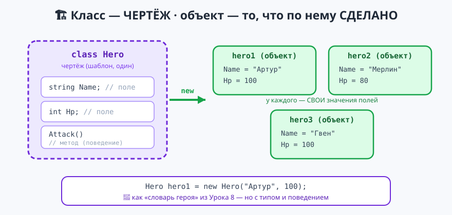

# Урок 10 — 🧩 «ООП: классы и объекты» — свои типы данных 🏗

**Блок 1 · Синтаксис C# + ООП · Урок 10 из 12 | 2 ак.ч. (1,5 часа)**

> ⬅️ Предыдущий: [Урок 9 «Файлы и исключения»](../урок-09-файлы-исключения/урок.md) · [Все уроки блока](../README.md) · [План курса](../../ПЛАН-КУРСА.md) · Следующий: [Урок 11 «ООП: наследование»](../урок-11-ооп-наследование/урок.md) ➡️

> 🔁 В начале — [разминка/повтор](повторение.md) (5 мин).
> 📌 Быстро вспомнить материал урока — [итого.md](итого.md) (шпаргалка).
> 👨‍🏫 Сценарий с хронометражом — в [преподавателю.md](преподавателю.md).
> 🖼 Что показать на проекторе — в [изображения.md](изображения.md).
> 🆘 **Пропустил урок или хочешь закрепить?** Открой [самоучитель.md](самоучитель.md) — теория + задания с подсказками.
> 🧰 Трюки и частые ошибки — в [лайфхак.md](лайфхак.md).

> 🧭 **Как читать урок.** До сих пор данные героя лежали россыпью: `string name`, `int hp`, `int power`… и легко перепутать, чьё что. Сегодня — большая тема: **ООП** (объектно-ориентированное программирование). Мы научимся создавать **свои типы** — **классы**. Класс — это **чертёж** (`class Hero`), а **объект** — конкретный герой, сделанный по чертежу (`Артур`, `Мерлин`). Разберём **поля** (данные), **методы** (поведение), **`this`**, **конструктор** (рождение объекта), **свойства** (`get/set` с проверкой), а также **`static`** и **перегрузку**. В конце — «Арена: Герой против Монстра» из двух классов. Имена: **классы, методы, свойства — `PascalCase`**; поля-переменные — `camelCase`.

---

## 🎮 Что мы сделаем сегодня и что получим

**Задача:** собрать собственные типы `Hero` и `Enemy` и устроить бой их объектов.

**В итоге получится** (пример — «Арена»):

```
=== АРЕНА: бой начинается! ===

Артур: HP=100, сила=22
Дракон: HP=130, сила=18

--- Ход 1 ---
Артур наносит 23 урона. Дракон: HP=107
Дракон наносит 14 урона. Артур: HP=86
...
Победил: Артур!
```

**Главные навыки урока:** `class` (свой тип) · объект через **`new`** · **поля** (данные) · **методы** (поведение) + **`this`** · **конструктор** · **свойства** `get/set` (с проверкой) · **`static`** (общее для всех) · **перегрузка** методов и конструкторов.

> 💡 **Главная мысль урока:** объект — это **«коробка», где вместе лежат и данные, и умения**. Раньше данные (`name`, `hp`) и функции, работавшие с ними, были разбросаны. Класс собирает их в один аккуратный тип: у героя есть его `Hp` — и он сам умеет `Attack()`.

---

## Часть 0 — Разминка: от россыпи переменных к объекту (5 минут)

Раньше, чтобы описать двух героев, мы плодили переменные:
```csharp
string hero1Name = "Артур"; int hero1Hp = 100;
string hero2Name = "Мерлин"; int hero2Hp = 80;   // легко запутаться!
```
В Уроке 8 стало чуть лучше — «словарь героя»: `Dictionary<string,object>`. Но это всё ещё неудобно и небезопасно.

**Класс решает это красиво** — описываем «героя» **один раз**, а потом штампуем сколько нужно:
```csharp
Hero hero1 = new Hero("Артур", 100);
Hero hero2 = new Hero("Мерлин", 80);
```

| Было | Стало (класс) |
|------|----------------|
| россыпь `hero1Name`, `hero1Hp`… | один объект `hero1` со своими полями |
| функция отдельно от данных | метод **внутри** объекта: `hero1.Attack()` |
| легко перепутать, чьё поле | у каждого объекта — свои данные |

> 🐍 **Мостик:** в Python это `class Hero:` и `hero = Hero(...)`. В Godot 2-го года каждый узел (нода) — тоже объект со своими полями и методами. C# — та же идея, только со строгими типами.

---

## Часть 1 — Класс и объект: чертёж и то, что по нему сделано (14 минут)



**Класс** — это **чертёж** (описание, какие у героя данные). Его пишут **внизу файла** (после основного кода). Данные внутри — **поля**:
```csharp
class Hero
{
    public string Name;   // поле — имя
    public int Hp;        // поле — здоровье
}
```
- `public` — «доступно снаружи» (позже, в Уроке 11, узнаем про `private`).
- Класс сам по себе ничего не делает — это только **чертёж**.

**Объект** — конкретный герой, сделанный по чертежу командой **`new`**. К полям обращаемся через точку:
```csharp
Hero hero = new Hero();     // создали объект по чертежу
hero.Name = "Артур";        // заполнили поля
hero.Hp = 100;
Console.WriteLine($"{hero.Name}, HP={hero.Hp}");   // Артур, HP=100
```

**Из одного класса — много объектов, у каждого свои данные:**
```csharp
Hero a = new Hero();  a.Name = "Артур";  a.Hp = 100;
Hero b = new Hero();  b.Name = "Мерлин"; b.Hp = 80;
Console.WriteLine($"{a.Name}={a.Hp}, {b.Name}={b.Hp}");   // Артур=100, Мерлин=80
```
`a` и `b` — **разные** объекты: поменяли `a.Hp` — на `b` это не влияет.

> 💡 **Лайфхак: класс — с большой буквы, `PascalCase`.** `Hero`, `Player`, `Enemy`, `Car`. Тип — как `int` или `string`, только твой собственный. Файл-«чертёж» пишут после основного кода (в больших проектах — в отдельном файле `Hero.cs`).

> ✍️ **Мини-задание 1 (4 мин):** опиши класс `Cat` с полями `Name` (строка) и `Age` (число). Создай двух котов через `new`, заполни поля и выведи обоих.
> <details><summary>💡 подсказка</summary>Класс — внизу файла: <code>class Cat { public string Name; public int Age; }</code>. Создание — <code>Cat c = new Cat(); c.Name = "...";</code>.</details>

---

## Часть 2 — Методы класса: поведение объекта + `this` (12 минут)

Объект умеет не только хранить данные, но и **действовать** — для этого внутри класса пишут **методы** (как в Уроке 7, но теперь они «живут» в объекте и видят его поля):
```csharp
class Hero
{
    public string Name;
    public int Hp;

    public void Introduce()               // метод-поведение
    {
        Console.WriteLine($"Я {Name}, HP={Hp}");   // видит поля своего объекта
    }

    public void TakeDamage(int amount)
    {
        Hp -= amount;                     // меняет поле ЭТОГО объекта
    }
}
```
Вызываем через объект — и метод работает с **его** данными:
```csharp
Hero hero = new Hero();  hero.Name = "Артур";  hero.Hp = 100;
hero.Introduce();          // Я Артур, HP=100
hero.TakeDamage(30);
hero.Introduce();          // Я Артур, HP=70
```

**`this`** — это «**я сам**», текущий объект. Часто помогает, когда имя параметра совпадает с полем:
```csharp
public void SetName(string name)
{
    this.Name = name;      // this.Name — поле объекта, name — параметр
}
```

> 💡 **Лайфхак: метод внутри класса `static` не нужен.** Это метод объекта — он вызывается через объект (`hero.Attack()`) и сам видит его поля. `static`-методы (без объекта) разберём в Части 5.

> ✍️ **Мини-задание 2 (3 мин):** добавь в класс `Cat` метод `Meow()`, который печатает «Кот {Name} говорит: Мяу!». Вызови его у своего кота.
> <details><summary>💡 подсказка</summary>Внутри класса: <code>public void Meow() => Console.WriteLine($"Кот {Name} говорит: Мяу!");</code>. Вызов — <code>c.Meow();</code></details>

---

## Часть 3 — Конструктор: рождение объекта с данными (14 минут)

Заполнять поля по одному после `new` — долго и легко забыть. **Конструктор** — особый метод, который создаёт объект **сразу с данными**. Он называется как класс и **не имеет типа возврата**:
```csharp
class Hero
{
    public string Name;
    public int Hp;

    public Hero(string name, int hp)    // конструктор
    {
        Name = name;                    // заполняем поля
        Hp = hp;
    }
}
```
Теперь герой рождается одной строкой:
```csharp
Hero hero = new Hero("Артур", 100);   // имя и HP сразу заданы!
Console.WriteLine($"{hero.Name}, HP={hero.Hp}");
```

- 👀 То, что в скобках у `new Hero(...)`, попадает в параметры конструктора. Это и есть «настройка объекта при рождении».

**⭐ Перегрузка конструктора** — можно сделать **несколько** конструкторов с разным набором параметров (то, чего не умели локальные функции из Урока 7!). Пусть у героя HP по умолчанию 100:
```csharp
public Hero(string name, int hp) { Name = name; Hp = hp; }
public Hero(string name) : this(name, 100) { }   // вызывает первый, hp=100
```
```csharp
Hero a = new Hero("Артур", 80);   // задали HP
Hero b = new Hero("Мерлин");      // HP = 100 по умолчанию
```
`: this(name, 100)` — «позови другой мой конструктор с этими аргументами», чтобы не повторять код.

> 💡 **Лайфхак: имена совпадают — используй `this`.** В конструкторе часто пишут так: `public Hero(string name) { this.Name = name; }`. Параметр `name` и поле `Name` различаются регистром, но `this.Name` делает намерение явным.

> ✍️ **Мини-задание 3 (4 мин):** добавь классу `Cat` конструктор `Cat(string name, int age)`. Создай кота одной строкой `new Cat("Барсик", 3)` и позови `Meow()`.
> <details><summary>💡 подсказка</summary>Конструктор — метод с именем класса без типа: <code>public Cat(string name, int age) { Name = name; Age = age; }</code>.</details>

---

## Часть 4 — ⭐ Свойства: «умные поля» с проверкой `get/set` (14 минут)

Публичное поле любой может испортить: `hero.Hp = -999;`. **Свойство** — «умное поле» с проверками. У него есть **`get`** (отдать значение) и **`set`** (принять, с проверкой). Внутри `set` доступно ключевое слово **`value`** — присваиваемое значение:
```csharp
class Hero
{
    public string Name;
    private int hp;                 // приватное «хранилище» (снаружи не видно)

    public int Hp                   // свойство
    {
        get { return hp; }
        set { hp = value < 0 ? 0 : value; }   // не даём HP уйти в минус
    }
}
```
Снаружи свойство выглядит как обычное поле, но защищено:
```csharp
Hero hero = new Hero();
hero.Hp = 100;    Console.WriteLine(hero.Hp);   // 100
hero.Hp = -50;    Console.WriteLine(hero.Hp);   // 0 — сеттер не пустил в минус!
```

**Авто-свойство** — если проверка не нужна, пишут коротко (C# сам создаёт хранилище):
```csharp
public string Name { get; set; }        // обычное свойство
public int Level { get; private set; }  // читать всем, менять — только внутри класса
```

**Вычисляемое свойство** (только `get`) — считается на лету:
```csharp
public bool IsAlive => Hp > 0;          // не хранится, а вычисляется
```
```csharp
Console.WriteLine(hero.IsAlive);        // True, пока HP > 0
```

> 💡 **Напоминание про стрелку `=>`.** `public bool IsAlive => Hp > 0;` — это **короткая запись** (та же `=>`, что у методов из [Урока 7](../урок-07-методы/урок.md)). Читается: «свойство `IsAlive` равно выражению `Hp > 0`». Это то же самое, что длинно: `public bool IsAlive { get { return Hp > 0; } }`. Стрелка `=>` = «равно этому выражению».

> 💡 **Лайфхак: поле-хранилище — с маленькой буквы.** Классика: приватное поле `hp` (маленькая) хранит данные, публичное свойство `Hp` (большая) даёт к ним безопасный доступ. Снаружи пользуются только `Hp`.

> ✍️ **Мини-задание 4 (4 мин):** сделай классу `Cat` свойство `Age` с проверкой: возраст не может быть меньше 0 (в `set` отрицательное превращай в 0). Проверь: `cat.Age = -5;` → должно стать 0.
> <details><summary>💡 подсказка</summary>Заведи приватное <code>private int age;</code> и свойство <code>public int Age { get { return age; } set { age = value < 0 ? 0 : value; } }</code>.</details>

---

## Часть 5 — ⭐ `static` и перегрузка (12 минут)

**`static`** — принадлежит **классу, а не объекту**. Такое поле — **общее для всех** объектов (одно на всех), а метод вызывается **без объекта**, прямо через класс.

Посчитаем, сколько всего героев создано:
```csharp
class Hero
{
    public string Name;
    public static int Count = 0;     // общее для всех — один счётчик

    public Hero(string name)
    {
        Name = name;
        Count++;                     // каждый новый герой увеличивает общий счётчик
    }
}
```
```csharp
Hero a = new Hero("Артур");
Hero b = new Hero("Мерлин");
Console.WriteLine(Hero.Count);       // 2 — обращаемся ЧЕРЕЗ КЛАСС, не через объект
```
Ты уже пользовался `static` не раз: `Math.Max`, `Console.WriteLine`, `Random.Shared`, `int.TryParse` — все они `static` (вызываются через тип, без создания объекта).

**⭐ Перегрузка метода** — несколько методов с **одним именем**, но **разными параметрами** (в Уроке 7 локальные функции так не умели — теперь в классе можно!):
```csharp
class Printer
{
    public static void Show(int x)    => Console.WriteLine("число: " + x);
    public static void Show(string x) => Console.WriteLine("строка: " + x);
    public static void Show(double x) => Console.WriteLine("дробь: " + x);
}
```
```csharp
Printer.Show(42);       // число: 42
Printer.Show("привет"); // строка: привет
Printer.Show(3.14);     // дробь: 3,14
```
C# сам выбирает нужный вариант по типу аргумента. Так же перегружают **конструкторы** (мы это сделали в Части 3).

> 💡 **Лайфхак: `static` — «одно на всех», обычное — «у каждого своё».** `Name` у каждого героя свой; `Count` — один общий для всего класса. Если данные про **весь класс** (счётчик, настройка) — делай `static`.

> ✍️ **Мини-задание 5 (3 мин):** добавь классу `Cat` статический счётчик `public static int Total`, увеличивай его в конструкторе, создай двух котов и выведи `Cat.Total`.
> <details><summary>💡 подсказка</summary>В конструкторе — <code>Total++;</code>. Вывод — через класс: <code>Console.WriteLine(Cat.Total);</code></details>

---

## Часть 6 — 🏆 Проект «Арена: Герой против Монстра» (12 минут)

Соберём два класса — `Hero` и `Enemy` — и устроим их бой. У каждого свои поля, свойство `Hp` с проверкой, вычисляемое `IsAlive`, конструктор и метод `Attack`. Полный код — в [`материалы/Program.cs`](материалы/Program.cs):

```csharp
Random rnd = new Random();
Hero hero = new Hero("Артур", 100, 22);        // имя, hp, сила
Enemy dragon = new Enemy("Дракон", 130, 18);

hero.Introduce();
dragon.Introduce();

int turn = 0;
while (hero.IsAlive && dragon.IsAlive)          // пока оба живы
{
    turn++;
    Console.WriteLine($"\n--- Ход {turn} ---");
    hero.Attack(dragon, rnd);                   // объект действует на объект
    if (!dragon.IsAlive) break;
    dragon.Attack(hero, rnd);
}
Console.WriteLine(hero.IsAlive ? $"Победил: {hero.Name}!" : $"Победил: {dragon.Name}!");

// --- класс героя ---
class Hero
{
    public string Name;
    public int Power;
    private int hp;

    public int Hp { get { return hp; } set { hp = value < 0 ? 0 : value; } }
    public bool IsAlive => Hp > 0;

    public Hero(string name, int hp, int power)   // конструктор
    {
        Name = name; Hp = hp; Power = power;
    }

    public void Introduce() => Console.WriteLine($"{Name}: HP={Hp}, сила={Power}");

    public void Attack(Enemy target, Random rnd)
    {
        int dmg = Power + rnd.Next(-4, 5);
        target.Hp -= dmg;                          // бьём по HP другого объекта
        Console.WriteLine($"{Name} наносит {dmg} урона. {target.Name}: HP={target.Hp}");
    }
}
// класс Enemy — почти такой же (см. материалы/Program.cs)
```

- 👀 Главный код читается «как рассказ»: герой и монстр представились, потом по очереди бьют друг друга, пока кто-то жив. Вся «начинка» — в классах.

> 🧩 **Для 5–7 классов:** сделай только класс `Hero` с полями `Name`/`Hp` и методом `Introduce()`, создай двух героев. Уже настоящий класс! 🎓 **Глубже:** заметь, что `Hero` и `Enemy` **почти одинаковые** — на Уроке 11 (наследование) мы уберём это повторение общим «родителем» `Character`.

> ✍️ **Мини-задание 6 (3 мин):** добавь классу `Hero` метод `Heal(int amount)`, который увеличивает `Hp` (свойство само не даст переполнить в минус). Полечи героя между ходами.
> <details><summary>💡 подсказка</summary><code>public void Heal(int amount) => Hp += amount;</code>. Присвоение идёт через свойство <code>Hp</code>, так что проверка сработает.</details>

---

## 🐞 Разбор частых ошибок

| Симптом | Что случилось | Как починить |
|---------|---------------|--------------|
| `NullReferenceException` | забыл `new` — объекта нет | создай объект: `Hero h = new Hero(...)` |
| `... does not contain a constructor that takes N arguments` | вызвал `new` не с теми аргументами | передавай столько же, сколько у конструктора |
| поле «не видно» снаружи | оно `private` или забыл `public` | публичным полям/свойствам ставь `public` |
| метод не находит поле | обратился без объекта или опечатка | внутри класса поле видно по имени; снаружи — через объект |
| `Hp` можно сделать отрицательным | это поле, а не свойство | сделай свойство с проверкой в `set` |
| `static`-поле у каждого своё | перепутал `static` и обычное | общее для всех — `static`, личное — без `static` |

> ⚠️ **Главное правило:** `class Имя { поля; конструктор; методы; свойства; }` — чертёж. Объект — `new Имя(...)`. Данные — поля/свойства, поведение — методы. `static` — общее для класса; перегрузка — методы с одним именем и разными параметрами.

---

## 🎓 Глубже

**Объект — ссылочный тип.** `Hero b = a;` копирует **ссылку**, а не героя: `b` и `a` — один и тот же объект (поменяешь через `b` — увидишь через `a`). Число (`int`) копируется по значению, а объект — по ссылке. (Массив из Урока 6 — тоже ссылочный, помнишь?)

**`null`** — «объекта нет». Если объект не создан (`Hero h = null;`), обращение `h.Name` даст `NullReferenceException`. Отсюда жёлтые предупреждения про nullable из прошлых уроков.

**`ToString()`** — можно научить объект «красиво печататься»: `public override string ToString() => $"{Name} ({Hp})";` — тогда `Console.WriteLine(hero)` покажет это. `override` подробно — в Уроке 11.

**Record (обзор):** для простых «контейнеров данных» есть краткая запись `record`. Позже.

---

## 🧩 Для 5–7 классов

- **Класс** — чертёж (`class Hero`), **объект** — герой по чертежу (`new Hero(...)`).
- **Поля** — данные объекта (`Name`, `Hp`), **методы** — что он умеет (`Attack()`).
- **Конструктор** создаёт объект сразу с данными: `new Hero("Артур", 100)`.
- **Свойство** — умное поле с проверкой (`Hp` не станет отрицательным).
- Проект — класс `Hero`, создаём и знакомим героев.

---

## 🏁 Итог урока (5 минут)

Мы научились делать **свои типы данных**:

- ✅ **`class`** — чертёж; **объект** — `new Класс(...)`; данные объекта — **поля**.
- ✅ **Методы** класса — поведение; **`this`** — «текущий объект».
- ✅ **Конструктор** — создаёт объект с данными; можно **перегрузить** (`: this(...)`).
- ✅ **Свойства** `get/set` — «умные поля» с проверкой; авто- и вычисляемые (`=> ...`).
- ✅ **`static`** — общее для всего класса (счётчик); **перегрузка** — методы с одним именем.
- ✅ Собрали «Арену» из классов `Hero` и `Enemy`.

> 🎉 Теперь программа состоит из понятных «кирпичиков»-объектов. Дальше (Урок 11) — **наследование**: `Hero` и `Enemy` получат общего «родителя» `Character`, и повторение исчезнет. Быстро повторить — в [итого.md](итого.md).

> 🎤 **Блиц:** чем класс отличается от объекта? что такое поле, а что метод? зачем конструктор? чем свойство лучше поля? что значит `static`?

### 🎮 Викторина-закрепление
Открой **[викторина.html](викторина.html)** — вопросы по классам и объектам + смешные и «на подумать».

➡️ **Практика урока** — **[практика.md](практика.md)**: задачи в 3 уровнях.
🆘 **Пропустил / хочешь ещё?** — [самоучитель.md](самоучитель.md) (теория + задания с подсказками).
🧰 **Трюки и ошибки** — [лайфхак.md](лайфхак.md). 📌 **Шпаргалка** — [итого.md](итого.md).

---

## 🔗 Навигация и материалы

⬅️ **Предыдущий:** [Урок 9 «Файлы и исключения»](../урок-09-файлы-исключения/урок.md) · [Все уроки блока](../README.md) · [План курса](../../ПЛАН-КУРСА.md) · **Следующий:** [Урок 11 «ООП: наследование»](../урок-11-ооп-наследование/урок.md) ➡️

**🧰 Инструменты:** [.NET 10 SDK](https://dotnet.microsoft.com/download) · **Windows:** [Visual Studio 2022](https://visualstudio.microsoft.com/) · **Mac:** [VS Code](https://code.visualstudio.com/) + C# Dev Kit. Настройка обеих сред — [`справочники/среда-VisualStudio-и-VSCode.md`](../../справочники/среда-VisualStudio-и-VSCode.md).
**📄 Готовый код:** [`материалы/Program.cs`](материалы/Program.cs) (Арена: классы Hero и Enemy).
**⚙️ Учителю:** сценарий и частые ошибки — в [преподавателю.md](преподавателю.md).
