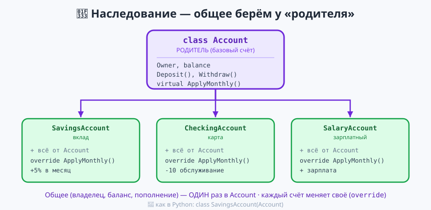
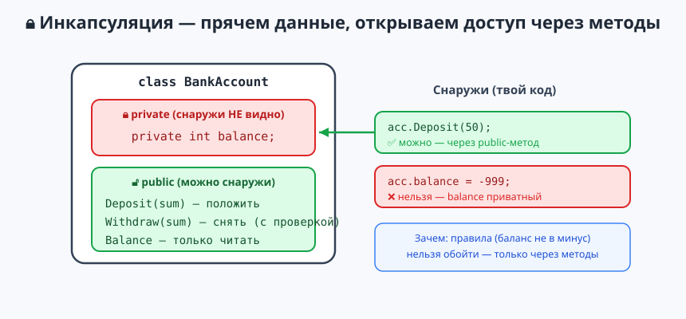

# Урок 11 — 🧩 «ООП: наследование и инкапсуляция» 🌳🔒

**Блок 1 · Синтаксис C# + ООП · Урок 11 из 12 | 2 ак.ч. (1,5 часа)**

> ⬅️ Предыдущий: [Урок 10 «ООП: классы и объекты»](../урок-10-ооп-классы/урок.md) · [Все уроки блока](../README.md) · [План курса](../../ПЛАН-КУРСА.md) · Следующий: [Урок 12 «Финальный проект: Медиатека»](../урок-12-проект-медиатека/урок.md) ➡️

> 🔁 В начале — [разминка/повтор](повторение.md) (5 мин).
> 📌 Быстро вспомнить материал урока — [итого.md](итого.md) (шпаргалка).
> 👨‍🏫 Сценарий с хронометражом — в [преподавателю.md](преподавателю.md).
> 🖼 Что показать на проекторе — в [изображения.md](изображения.md).
> 🆘 **Пропустил урок или хочешь закрепить?** Открой [самоучитель.md](самоучитель.md) — теория + задания с подсказками.
> 🧰 Трюки и частые ошибки — в [лайфхак.md](лайфхак.md).

> 🧭 **Как читать урок.** В Уроке 10 мы делали свои классы — и они часто выходили **почти одинаковыми**. Сегодня разберём это на **банковском примере**: у банка есть разные счета — обычный, вклад, зарплатный — и у всех общее (владелец, баланс, пополнение), но своё поведение. Копировать код в каждый класс — плохо. **Наследование** позволяет написать общее **один раз** в «родителе» `Account`, а `SavingsAccount`, `CheckingAccount`, `SalaryAccount` унаследуют это и добавят только своё. Разберём **`: Base`**, **`base`**, **`virtual`/`override`**, **полиморфизм** (`List<Account>`) и **инкапсуляцию** (`private`/`protected` — прятать баланс). В конце — мини-банк. Имена: классы/методы/свойства — `PascalCase`, поля-хранилища — `camelCase`.

---

## 🎮 Что мы сделаем сегодня и что получим

**Задача:** описать разные типы банковских счетов через общего родителя и провести «конец месяца».

**В итоге получится** (пример — проект «Банк»):

```
=== Клиенты банка ===
Аня: баланс 1000
Боря: баланс 500
Вера: баланс 0

=== Конец месяца (полиморфизм) ===
Аня: начислены проценты +5% -> 1050
Боря: списано обслуживание -10 -> 490
Вера: зарплата +300 -> 300
```

**Главные навыки урока:** наследование **`class Child : Parent`** · **`base(...)`** (конструктор родителя) · **`virtual`/`override`** (переопределить поведение) · **`base.Method()`** · **полиморфизм** (`List<Account>`) · **инкапсуляция** (`private`/`protected`/`public`).

> 💡 **Главная мысль урока:** наследование — это «**взять готовое и добавить своё**». Общее для всех счетов (владелец, баланс, пополнение) пишем **один раз** в родителе; каждый вид счёта получает это бесплатно и меняет только своё правило. Меньше кода — меньше ошибок.

---

## Часть 0 — Разминка: боль повторения (5 минут)

Опишем два вида счёта «в лоб», без наследования, — и получим близнецов:
```csharp
class SavingsAccount   // вклад
{
    public string Owner; public int Balance;
    public void Deposit(int sum) { Balance += sum; }   // ← общее
}
class CheckingAccount  // карта
{
    public string Owner; public int Balance;
    public void Deposit(int sum) { Balance += sum; }   // ← ТО ЖЕ САМОЕ, скопировали!
}
```
Владелец, баланс, пополнение — **скопированы**. А если поправить `Deposit` — придётся менять в **двух** местах (и не забыть ни одного). Появится третий счёт — копипаста утроится.

**Наследование решает это:** общее — в родителе `Account`, различия — в детях.
```csharp
class Account { public string Owner; public int Balance; public void Deposit(int s) { Balance += s; } }
class SavingsAccount  : Account { }    // берёт всё от Account
class CheckingAccount : Account { }    // тоже берёт всё
```

| Было | Стало (наследование) |
|------|----------------------|
| копипаста полей и `Deposit` в каждом | общее — один раз в `Account` |
| правка в двух-трёх местах | правка в одном |
| классы «не связаны» | связаны: `SavingsAccount` — это `Account` |

> 🐍 **Мостик:** в Python это `class SavingsAccount(Account):`. В Godot 2-го года твой скрипт писал `extends Node2D` — это тоже наследование (брал готовую ноду и добавлял своё). C# — та же идея через двоеточие.

---

## Часть 1 — Наследование: `class Child : Parent` и `base` (14 минут)



**Родитель** (базовый класс) — общее для всех. **Наследник** пишется через **двоеточие**: `class SavingsAccount : Account`. Он **автоматически** получает все поля и методы родителя:
```csharp
class Account                          // родитель
{
    public string Owner;
    protected int balance;             // прячем баланс (про protected — Часть 4)
    public int Balance => balance;
    public Account(string owner, int start) { Owner = owner; balance = start; }
    public void Deposit(int sum) { if (sum > 0) balance += sum; }   // общее для всех
}

class SavingsAccount : Account         // вклад — уже умеет всё, что Account!
{
    public SavingsAccount(string owner, int start) : base(owner, start) { }
    public void AddInterest() => balance += balance / 20;   // своё: +5%
}
```
```csharp
SavingsAccount s = new SavingsAccount("Аня", 1000);
s.Deposit(500);          // Deposit — унаследован от Account
s.AddInterest();         // AddInterest — свой, только у вклада
Console.WriteLine(s.Balance);   // 1575  (1000 + 500, потом +5%)
```

> 💡 **Напоминание про стрелку `=>`.** Запись `public int Balance => balance;` и `AddInterest() => ...` — это **короткая форма** (мы её проходили в [Уроке 7](../урок-07-методы/урок.md) для методов и в [Уроке 10](../урок-10-ооп-классы/урок.md) для свойств): `=>` заменяет `{ ... }` (а если что-то возвращается — ещё и `return`). То есть `int Double(int x) => x * 2;` — то же, что `int Double(int x) { return x * 2; }`. Не путай со стрелкой в LINQ (`x => x > 50` из Урока 6) — там это «для каждого `x`…».

**`base(...)`** — вызвать **конструктор родителя**. Наследник не заполняет `Owner`/`balance` заново — он передаёт их родителю через `: base(owner, start)`. Родитель уже умеет это делать.

> 💡 **Лайфхак: «наследник ЕСТЬ родитель».** `SavingsAccount` — это `Account` (вклад — это счёт). Читай двоеточие как «является»: `SavingsAccount : Account` = «SavingsAccount является Account». Поэтому вкладу доступно всё «счётное».

> ✍️ **Мини-задание 1 (4 мин):** сделай ещё одного наследника `CheckingAccount : Account` (карту). Ничего нового пока не добавляй. Создай карту, положи на неё деньги `Deposit` (метод унаследован!) и выведи баланс.
> <details><summary>💡 подсказка</summary>Наследник пишут через двоеточие: <code>class CheckingAccount : Account { public CheckingAccount(string owner, int start) : base(owner, start) { } }</code>. <code>Deposit</code> уже есть — он от родителя.</details>

---

## Часть 2 — ⭐ `virtual` / `override`: наследник меняет поведение (14 минут)

Разные счета по-разному ведут себя **в конце месяца**: вклад начисляет проценты, карта списывает обслуживание. Метод в родителе помечают **`virtual`** («можно переопределить»), а в наследнике — **`override`** («вот моя версия»):
```csharp
class Account
{
    public string Owner;
    protected int balance;
    public Account(string owner, int start) { Owner = owner; balance = start; }

    public virtual void ApplyMonthly()                     // virtual — разрешаем менять
        => Console.WriteLine($"{Owner}: без изменений, баланс {balance}");
}

class SavingsAccount : Account
{
    public SavingsAccount(string owner, int start) : base(owner, start) { }
    public override void ApplyMonthly()                    // override — своя версия
    {
        balance += balance / 20;                           // +5%
        Console.WriteLine($"{Owner}: начислены проценты, баланс {balance}");
    }
}

class CheckingAccount : Account
{
    public CheckingAccount(string owner, int start) : base(owner, start) { }
    public override void ApplyMonthly()
    {
        balance -= 10;                                     // -10 обслуживание
        Console.WriteLine($"{Owner}: списано обслуживание, баланс {balance}");
    }
}
```
```csharp
Account a = new SavingsAccount("Аня", 1000);
Account b = new CheckingAccount("Боря", 500);
a.ApplyMonthly();   // Аня: начислены проценты, баланс 1050
b.ApplyMonthly();   // Боря: списано обслуживание, баланс 490
```
Один и тот же вызов `ApplyMonthly()` — разное поведение. Это и есть **полиморфизм** («много форм»).

**`base.Method()`** — «сделай сначала как родитель, потом добавь своё». Пусть зарплатный счёт сначала выполнит общий расчёт родителя, а потом начислит зарплату:
```csharp
class SalaryAccount : Account
{
    private int salary;
    public SalaryAccount(string owner, int start, int salary) : base(owner, start)
        => this.salary = salary;

    public override void ApplyMonthly()
    {
        base.ApplyMonthly();                               // общий расчёт родителя
        balance += salary;                                 // и своё сверху
        Console.WriteLine($"{Owner}: зарплата +{salary}, баланс {balance}");
    }
}
```

> 💡 **Лайфхак: `virtual` в родителе, `override` в ребёнке — парой.** Забудешь `virtual` — наследнику нечего переопределять (ошибка). Забудешь `override` — C# подумает, что это новый метод, и предупредит. Всегда вместе.

> ✍️ **Мини-задание 2 (4 мин):** переопредели `ApplyMonthly()` в своей `CheckingAccount` из задания 1 так, чтобы она списывала не 10, а 15. Создай карту и вызови `ApplyMonthly()`.
> <details><summary>💡 подсказка</summary>В родителе метод уже <code>virtual</code>. В наследнике — <code>public override void ApplyMonthly() { balance -= 15; ... }</code>. Слова <code>virtual</code> и <code>override</code> идут в паре.</details>

---

## Часть 3 — ⭐ Полиморфизм: список из разных счетов (10 минут)

Раз `SavingsAccount`, `CheckingAccount`, `SalaryAccount` — все они `Account`, их можно сложить в **один список** типа родителя и обработать одинаково — а каждый сработает по-своему:
```csharp
List<Account> accounts = new List<Account>
{
    new SavingsAccount("Аня", 1000),
    new CheckingAccount("Боря", 500),
    new SalaryAccount("Вера", 0, 300),
};

foreach (Account a in accounts)
    a.ApplyMonthly();          // у каждого своё правило — C# сам выберет нужное!
```
```
Аня: начислены проценты, баланс 1050
Боря: списано обслуживание, баланс 490
Вера: зарплата +300, баланс 300
```

- 👀 В списке лежат **разные** типы счетов, но обращаемся к ним как к `Account`. Каждый объект **помнит свой настоящий тип** и выполняет свою версию `ApplyMonthly()`. Одна строка `a.ApplyMonthly()` — три разных поведения. Это и есть смысл полиморфизма.

> 💡 **Лайфхак: полиморфизм = «пиши общее, работай с разным».** Не нужно `if (это вклад) ... else if (это карта) ...`. Просто зови `a.ApplyMonthly()` — правильный вариант выберется сам. Так делают начисления в банке, обработку заказов в магазине, отряды в играх.

> ✍️ **Мини-задание 3 (3 мин):** сложи в `List<Account>` вклад и карту (из заданий 1–2) и в цикле вызови у каждого `ApplyMonthly()`. Один цикл — разное поведение.
> <details><summary>💡 подсказка</summary>Тип списка — родитель: <code>List&lt;Account&gt; bank = new() { new SavingsAccount(...), new CheckingAccount(...) };</code>, затем <code>foreach</code> и <code>a.ApplyMonthly()</code>.</details>

---

## Часть 4 — ⭐ Инкапсуляция: `private`, `protected`, `public` (14 минут)



Обрати внимание: во всех примерах `balance` мы прятали. **Инкапсуляция** — «прятать внутренности и открывать только безопасный доступ». Данные помечают **закрытыми**, а работу с ними дают через **`public`**-методы с проверками:
```csharp
class Account
{
    public string Owner;
    protected int balance;               // 🔒 закрыт снаружи (снять/дорисовать нельзя)

    public int Balance => balance;       // только читать

    public Account(string owner, int start) { Owner = owner; balance = start; }

    public void Deposit(int sum)         // 🔓 положить — через метод
    {
        if (sum > 0) balance += sum;
    }
    public void Withdraw(int sum)        // 🔓 снять — с проверкой
    {
        if (sum > balance) { Console.WriteLine("Недостаточно средств"); return; }
        balance -= sum;
    }
}
```
Заведём счёт и проведём операции — баланс меняется **только через методы**:
```csharp
Account acc = new Account("Аня", 100);
Console.WriteLine($"{acc.Owner}: баланс {acc.Balance}");   // Аня: баланс 100
acc.Deposit(50);
Console.WriteLine(acc.Balance);   // 150 — положила на счёт
acc.Withdraw(120);
Console.WriteLine(acc.Balance);   // 30 — сняла со счёта
acc.Withdraw(500);                // Недостаточно средств — правило сработало
// acc.balance = 999999;          // ❌ ОШИБКА — balance закрыт, снаружи не достать
```

- 👀 Никто снаружи не может «дорисовать» себе денег: `balance` спрятан, а менять его можно только через `Deposit`/`Withdraw`, где действуют правила (нельзя снять больше, чем есть). Это защита данных от порчи.

**Модификаторы доступа:**
| Модификатор | Кто видит | Когда брать |
|-------------|-----------|-------------|
| `public` | все (снаружи и внутри) | методы, которыми пользуются извне |
| `private` | **только сам класс** (по умолчанию) | данные без наследников |
| `protected` | сам класс **и его наследники** | данные, нужные наследникам (как `balance`) |

Почему у нас `balance` — **`protected`**, а не `private`? Потому что наследники (`SavingsAccount`, `CheckingAccount`) сами меняют `balance` в своём `ApplyMonthly`. `private` они бы не увидели, а `protected` — «для семьи»: закрыт снаружи, но открыт наследникам. Если наследников нет — смело `private`.

> 💡 **Лайфхак: прячь поля, открывай методы/свойства.** Хорошая привычка: поля — `private` (или `protected`, если нужны наследникам), а наружу — `public`-свойства (`get/set` с проверкой) и методы. Тогда правила объекта нельзя обойти. Свойства из Урока 10 — как раз инструмент инкапсуляции.

> ✍️ **Мини-задание 4 (4 мин):** сделай класс `PinCode` с `private string pin` (задаётся в конструкторе) и методом `bool Check(string guess)` — возвращает `true`, если ПИН угадали. Сам ПИН прочитать снаружи нельзя, только проверить.
> <details><summary>💡 подсказка</summary>Поле <code>private string pin;</code> задай в конструкторе. Наружу — только <code>public bool Check(string guess) => guess == pin;</code>.</details>

---

## Часть 5 — 🏆 Проект «Банк: счета клиентов» (12 минут)

Соберём мини-банк: общий родитель `Account` (владелец, баланс, `Deposit`/`Withdraw`, `Show`), а три вида счёта переопределяют только `ApplyMonthly`. В «конце месяца» все счета обрабатываются одним циклом — каждый по-своему (полиморфизм). Полный код — в [`материалы/Program.cs`](материалы/Program.cs):

```csharp
List<Account> accounts = new()
{
    new SavingsAccount("Аня", 1000),      // вклад: +5%
    new CheckingAccount("Боря", 500),     // карта: -10 обслуживание
    new SalaryAccount("Вера", 0, 300),    // зарплатный: +зарплата
};

foreach (Account a in accounts) a.Show();

accounts[0].Deposit(500);                 // Аня положила
accounts[1].Withdraw(600);                // Боре не хватит

Console.WriteLine("=== Конец месяца ===");
foreach (Account a in accounts) a.ApplyMonthly();   // каждый по-своему

// --- родитель: всё общее ---
class Account
{
    public string Owner;
    protected int balance;
    public int Balance => balance;

    public Account(string owner, int start) { Owner = owner; balance = start; }
    public void Deposit(int sum) { if (sum > 0) balance += sum; }
    public void Withdraw(int sum)
    {
        if (sum > balance) { Console.WriteLine($"  {Owner}: недостаточно средств"); return; }
        balance -= sum;
    }
    public void Show() => Console.WriteLine($"{Owner}: баланс {balance}");
    public virtual void ApplyMonthly() => Console.WriteLine($"{Owner}: без изменений");
}

// --- наследники: меняют только правило конца месяца ---
class SavingsAccount : Account
{
    public SavingsAccount(string owner, int start) : base(owner, start) { }
    public override void ApplyMonthly()
    {
        balance += balance / 20;
        Console.WriteLine($"{Owner}: проценты +5% -> {balance}");
    }
}
// CheckingAccount и SalaryAccount — так же (см. материалы/Program.cs)
```

- 👀 Добавить новый вид счёта (кредитный, детский, валютный) — это **новый маленький класс-наследник** с одним переопределённым методом. Главный цикл `foreach ... ApplyMonthly()` менять не нужно — в этом сила наследования и полиморфизма.

> 🧩 **Для 5–7 классов:** сделай `Account` и один наследник `SavingsAccount` с переопределённым `ApplyMonthly` (+5%), создай пару счетов и вызови у них метод. 🎓 **Глубже:** добавь класс `CreditAccount : Account`, где `ApplyMonthly` начисляет 15% на **долг** (если баланс отрицательный), и вставь его в `List<Account>` — заработает без изменений в цикле.

> ✍️ **Мини-задание 5 (3 мин):** добавь класс `SalaryAccount : Account` с полем `salary` и `override ApplyMonthly()`, который прибавляет зарплату к балансу. Вставь такой счёт в список банка.
> <details><summary>💡 подсказка</summary>Конструктор принимает ещё и зарплату: <code>SalaryAccount(string owner, int start, int salary) : base(owner, start)</code>. Внутри <code>ApplyMonthly</code> — <code>balance += salary;</code>.</details>

---

## 🐞 Разбор частых ошибок

| Симптом | Что случилось | Как починить |
|---------|---------------|--------------|
| `does not contain a constructor that takes 0 arguments` | у родителя конструктор с параметрами, наследник не вызвал `base(...)` | добавь `: base(...)` в конструктор наследника |
| `no suitable method ... to override` | забыл `virtual` у родителя | пометь метод родителя `virtual` |
| `hides inherited member` (предупреждение) | забыл `override` | добавь `override` (или это правда новый метод) |
| наследник «не видит» поле родителя | поле `private` | сделай его `protected` (для наследников) |
| `balance` меняют снаружи | забыл спрятать поле | делай `private`/`protected`, наружу — методы |
| в списке все ведут себя одинаково | метод не `virtual`/`override` | нужен `virtual` в родителе и `override` в детях |

> ⚠️ **Главное правило:** `class Наследник : Родитель` берёт всё от родителя. Конструктор родителя — через `: base(...)`. Переопределение — `virtual` (родитель) + `override` (наследник); `base.Метод()` — вызвать версию родителя. Прячь данные `private`/`protected`, открывай `public`-методами.

---

## 🎓 Глубже

**`protected`** — «для семьи»: видно самому классу и его наследникам, но не снаружи. Именно так мы объявили `balance`, чтобы наследники-счета могли его менять.

**Один родитель — много уровней.** Наследник сам может стать родителем: `Account → SavingsAccount → PremiumSavings`. Цепочка наследования.

**`abstract`** — «класс-заготовка, который нельзя создать напрямую» (`new Account()` запрещён, только конкретные счета). И `abstract`-метод — «обязан быть переопределён». Это для больших иерархий, позже.

**`is` и приведение типов:** `if (a is SavingsAccount s) s.AddInterest();` — проверить настоящий тип объекта в списке и получить доступ к его особым методам.

**А как же игры?** Всё то же самое работает и для персонажей: общий `Character` (имя, HP, атака) и наследники `Warrior`/`Mage`/`Monster` со своим `Attack()`. Банк или арена — принцип наследования один.

---

## 🧩 Для 5–7 классов

- **Наследование** — взять готовый класс-родитель и добавить своё: `class SavingsAccount : Account`.
- Наследник получает **все** поля и методы родителя бесплатно (`Deposit` — от `Account`).
- **`virtual`/`override`** — наследник может делать метод **по-своему** (вклад +5%, карта −10).
- **`private`/`protected`** прячут данные (баланс), чтобы их нельзя было испортить снаружи.
- Проект — «Банк»: один родитель `Account`, счета-наследники.

---

## 🏁 Итог урока (5 минут)

Мы научились строить **семьи классов** без повторов:

- ✅ **Наследование** `class Child : Parent` — наследник берёт всё от родителя.
- ✅ **`base(...)`** — вызвать конструктор родителя; **`base.Method()`** — его версию метода.
- ✅ **`virtual`/`override`** — наследник переопределяет поведение (свой `ApplyMonthly`).
- ✅ **Полиморфизм** — `List<Account>` из разных счетов, каждый действует по-своему.
- ✅ **Инкапсуляция** — `private`/`protected` прячут баланс, `public`-методы дают безопасный доступ.
- ✅ Собрали «Банк»: общее — в `Account`, различия — в наследниках-счетах.

> 🎉 Ты знаешь все три кита ООП: **инкапсуляция** (прятать), **наследование** (переиспользовать), **полиморфизм** (много форм). Дальше (Урок 12) — **финальный проект блока**: «Медиатека» — каталог книг/фильмов (классы + `List` + меню + сохранение в файл). Быстро повторить — в [итого.md](итого.md).

> 🎤 **Блиц:** как записать наследование? зачем `base(...)`? чем `virtual` отличается от `override`? что такое полиморфизм? зачем баланс делать `private`/`protected`?

### 🎮 Викторина-закрепление
Открой **[викторина.html](викторина.html)** — вопросы по наследованию и инкапсуляции + смешные и «на подумать».

➡️ **Практика урока** — **[практика.md](практика.md)**: задачи в 3 уровнях.
🆘 **Пропустил / хочешь ещё?** — [самоучитель.md](самоучитель.md) (теория + задания с подсказками).
🧰 **Трюки и ошибки** — [лайфхак.md](лайфхак.md). 📌 **Шпаргалка** — [итого.md](итого.md).

---

## 🔗 Навигация и материалы

⬅️ **Предыдущий:** [Урок 10 «ООП: классы и объекты»](../урок-10-ооп-классы/урок.md) · [Все уроки блока](../README.md) · [План курса](../../ПЛАН-КУРСА.md) · **Следующий:** [Урок 12 «Финальный проект: Медиатека»](../урок-12-проект-медиатека/урок.md) ➡️

**🧰 Инструменты:** [.NET 10 SDK](https://dotnet.microsoft.com/download) · **Windows:** [Visual Studio 2022](https://visualstudio.microsoft.com/) · **Mac:** [VS Code](https://code.visualstudio.com/) + C# Dev Kit. Настройка обеих сред — [`справочники/среда-VisualStudio-и-VSCode.md`](../../справочники/среда-VisualStudio-и-VSCode.md).
**📄 Готовый код:** [`материалы/Program.cs`](материалы/Program.cs) (Банк: Account + наследники-счета).
**⚙️ Учителю:** сценарий и частые ошибки — в [преподавателю.md](преподавателю.md).
