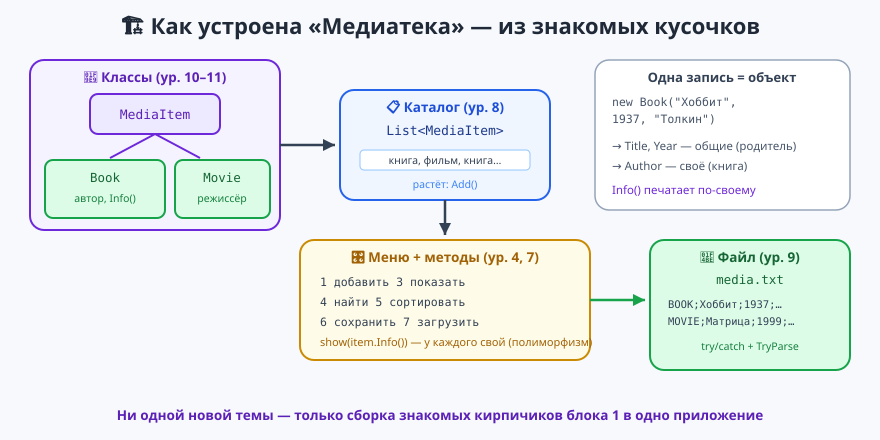

# Урок 12 — 🏆 Финальный проект блока: «Медиатека» 📚🎬

**Блок 1 · Синтаксис C# + ООП · Урок 12 из 12 (ФИНАЛ) | 2 ак.ч. (1,5 часа)**

> ⬅️ Предыдущий: [Урок 11 «ООП: наследование»](../урок-11-ооп-наследование/урок.md) · [Все уроки блока](../README.md) · [План курса](../../ПЛАН-КУРСА.md) · Следующий блок: [📱 MAUI](../../блок-2-maui/README.md) ➡️

> 🔁 В начале — [разминка/повтор](повторение.md) (5 мин).
> 📌 Быстро вспомнить материал урока — [итого.md](итого.md) (шпаргалка).
> 👨‍🏫 Сценарий с хронометражом — в [преподавателю.md](преподавателю.md).
> 🖼 Что показать на проекторе — в [изображения.md](изображения.md).
> 🆘 **Пропустил урок или хочешь закрепить?** Открой [самоучитель.md](самоучитель.md) — сборка проекта по шагам.
> 🧰 Трюки и частые ошибки — в [лайфхак.md](лайфхак.md).

> 🧭 **Как читать урок.** Это **финал блока 1** — не новая тема, а **сборка большого проекта из всего, что мы уже знаем**. Мы сделаем **«Медиатеку»** — программу-каталог твоих книг и фильмов: можно добавлять, искать, сортировать и **сохранять на диск**, чтобы список не терялся. Внутри соберутся вместе: **классы и наследование** (уроки 10–11), **`List`** (урок 8), **меню в цикле и методы** (уроки 4, 7), **файлы и `try/catch`** (урок 9). Соберём по кусочкам — Часть за Частью. Имена: классы/методы — `PascalCase`, переменные — `camelCase`.

---

## 🎮 Что мы построим сегодня

**Медиатека** — консольное приложение с меню. Пример работы:

```
=== МЕДИАТЕКА ===
1 — добавить книгу     5 — сортировать по году
2 — добавить фильм     6 — сохранить в файл
3 — показать всё       7 — загрузить из файла
4 — найти по названию  0 — выход
Твой выбор: 3
В каталоге 2 записей:
  [книга] "Хоббит" — Толкин, 1937
  [фильм] "Матрица" — реж. Вачовски, 1999
```

**Какие навыки блока соберём вместе:** свои классы `MediaItem`/`Book`/`Movie` (наследование + полиморфизм) · `List<MediaItem>` (растущий каталог) · меню `while(true)` + методы · `int.TryParse` (защита года) · `File.*` + `try/catch` (сохранение и загрузка).

> 💡 **Главная мысль урока:** большая программа собирается из **маленьких знакомых кирпичиков**. По отдельности мы всё это уже умеем — сегодня просто соединяем в одно рабочее приложение. Готовый код целиком — в [`материалы/Program.cs`](материалы/Program.cs).

---

## Часть 0 — Разминка: что у нас уже есть (5 минут)

За блок 1 мы научились многому. Отметь галочкой, что помнишь:

- ✅ типы, ввод-вывод, `if`, циклы `for`/`while`/`foreach` (уроки 1–5);
- ✅ массивы и `List`/`Dictionary` (уроки 6, 8);
- ✅ методы — свои команды (урок 7);
- ✅ файлы и `try/catch` (урок 9);
- ✅ классы, объекты, наследование, полиморфизм (уроки 10, 11).

Сегодня всё это **работает вместе**. Ни одной новой большой темы — только сборка.

> 🐍 **Мостик:** такой «каталог с сохранением» ты мог бы написать и на Python 2-го года (список словарей + файл). В C# то же самое, но данные хранятся в **объектах** классов — аккуратнее и надёжнее.

---

## Часть 1 — Классы каталога: `MediaItem`, `Book`, `Movie` (16 минут)



У книги и фильма много **общего** (название, год) и немного **своего** (у книги автор, у фильма режиссёр). Это прямая работа для **наследования** (урок 11): общее — в родителе `MediaItem`, различия — в наследниках.

**Родитель** — общее для любой записи каталога:
```csharp
class MediaItem
{
    public string Title;
    public int Year;

    public MediaItem(string title, int year) { Title = title; Year = year; }

    public virtual string Info() => $"\"{Title}\" ({Year})";   // можно переопределить
}
```

**Книга** и **фильм** наследуют это и добавляют своё + по-своему печатают `Info()`:
```csharp
class Book : MediaItem
{
    public string Author;
    public Book(string title, int year, string author) : base(title, year) => Author = author;
    public override string Info() => $"[книга] \"{Title}\" — {Author}, {Year}";
}

class Movie : MediaItem
{
    public string Director;
    public Movie(string title, int year, string director) : base(title, year) => Director = director;
    public override string Info() => $"[фильм] \"{Title}\" — реж. {Director}, {Year}";
}
```

Проверим:
```csharp
MediaItem b = new Book("Хоббит", 1937, "Толкин");
MediaItem m = new Movie("Матрица", 1999, "Вачовски");
Console.WriteLine(b.Info());   // [книга] "Хоббит" — Толкин, 1937
Console.WriteLine(m.Info());   // [фильм] "Матрица" — реж. Вачовски, 1999
```

- 👀 `Info()` у книги и фильма **разный** — это полиморфизм. Скоро он нам очень пригодится: покажем весь каталог одним циклом, а каждая запись напечатается по-своему.

> ✍️ **Мини-задание 1 (4 мин):** добавь третий вид записи — `Game : MediaItem` (игра) с полем `Platform` (платформа) и своим `Info()` вроде `[игра] "название" — платформа, год`. Создай игру и выведи её `Info()`.
> <details><summary>💡 подсказка</summary>Делается как <code>Book</code>: <code>class Game : MediaItem</code>, конструктор через <code>: base(title, year)</code>, и <code>override string Info()</code> со своим текстом.</details>

---

## Часть 2 — Каталог как `List<MediaItem>` (10 минут)

Каталог — это **список записей**, который растёт (урок 8). Тип списка — **родитель** `MediaItem`, поэтому в него можно класть и книги, и фильмы:
```csharp
List<MediaItem> catalog = new List<MediaItem>();

catalog.Add(new Book("Хоббит", 1937, "Толкин"));
catalog.Add(new Movie("Матрица", 1999, "Вачовски"));
catalog.Add(new Book("1984", 1949, "Оруэлл"));

Console.WriteLine($"В каталоге {catalog.Count} записей");
```

**Показать весь каталог** — один `foreach`, а каждая запись печатается по-своему (полиморфизм в деле!):
```csharp
foreach (MediaItem item in catalog)
    Console.WriteLine(item.Info());
```
```
[книга] "Хоббит" — Толкин, 1937
[фильм] "Матрица" — реж. Вачовски, 1999
[книга] "1984" — Оруэлл, 1949
```

- 👀 Никаких `if (это книга) ... else if (это фильм) ...`. Просто `item.Info()` — правильный вариант выбирается сам. Вот зачем нужны были наследование и полиморфизм.

> ✍️ **Мини-задание 2 (3 мин):** заведи `List<MediaItem>`, добавь 2 книги и 1 фильм, выведи их количество и весь список через `foreach`.
> <details><summary>💡 подсказка</summary><code>catalog.Add(new Book(...))</code>, потом <code>catalog.Count</code> и <code>foreach (MediaItem m in catalog) Console.WriteLine(m.Info());</code></details>

---

## Часть 3 — Меню и добавление записей (16 минут)

Обернём всё в **меню** (`while(true)`, урок 4) и разложим действия по **методам** (урок 7), чтобы главный цикл читался как оглавление:
```csharp
List<MediaItem> catalog = new List<MediaItem>();

while (true)
{
    Console.WriteLine("\n=== МЕДИАТЕКА ===");
    Console.WriteLine("1 — добавить книгу  2 — добавить фильм  3 — показать всё  0 — выход");
    Console.Write("Твой выбор: ");
    string choice = Console.ReadLine();

    if (choice == "1") AddBook(catalog);
    else if (choice == "2") AddMovie(catalog);
    else if (choice == "3") ShowAll(catalog);
    else if (choice == "0") break;
}

void AddBook(List<MediaItem> list)
{
    Console.Write("Название книги: ");
    string title = Console.ReadLine();
    Console.Write("Автор: ");
    string author = Console.ReadLine();
    int year = AskYear();                       // защита ввода — см. ниже
    list.Add(new Book(title, year, author));
    Console.WriteLine($"Книга добавлена (всего: {list.Count})");
}
```

**Защита ввода года** через `int.TryParse` (урок 9): если ввели не число — переспросим, а не упадём:
```csharp
int AskYear()
{
    int year;
    Console.Write("Год: ");
    while (!int.TryParse(Console.ReadLine(), out year))
        Console.Write("Нужно число! Год: ");
    return year;
}
```

> 💡 **Лайфхак: главный цикл — короткий.** Вся «начинка» спрятана в методы (`AddBook`, `ShowAll`…). Главный `while` только раздаёт команды. Так большие программы остаются понятными.

> ✍️ **Мини-задание 3 (3 мин):** напиши метод `AddMovie` по образцу `AddBook` (спрашивает название, режиссёра и год, добавляет `new Movie(...)`).
> <details><summary>💡 подсказка</summary>Скопируй <code>AddBook</code>, поменяй «Автор» на «Режиссёр» и <code>new Book</code> на <code>new Movie</code>.</details>

---

## Часть 4 — Поиск и сортировка (10 минут)

**Поиск по названию** — перебираем каталог и сравниваем (методы строк из урока 2, `Contains`):
```csharp
void Find(List<MediaItem> list)
{
    Console.Write("Что ищем: ");
    string query = Console.ReadLine().ToLower();
    foreach (MediaItem m in list)
        if (m.Title.ToLower().Contains(query))    // без учёта регистра
            Console.WriteLine(m.Info());
}
```

**Сортировка по году** — через LINQ `OrderBy` (урок 6):
```csharp
catalog = catalog.OrderBy(m => m.Year).ToList();   // от старых к новым
```

- 👀 `ToLower()` с обеих сторон — чтобы «матрица» находила «Матрица» (регистр не мешает). `OrderBy(m => m.Year)` — «упорядочить по году каждого `m`».

> ✍️ **Мини-задание 4 (3 мин):** добавь в меню пункт «сортировать по названию» — `catalog.OrderBy(m => m.Title).ToList()`.
> <details><summary>💡 подсказка</summary>Всё как с годом, только вместо <code>m.Year</code> — <code>m.Title</code>.</details>

---

## Часть 5 — ⭐ Сохранение и загрузка (файл + `try/catch`) (14 минут)

Чтобы каталог не терялся при закрытии, **сохраним его в файл** (урок 9). Каждую запись превратим в строку `тип;название;год;…`. Добавим классам метод `ToLine()`:
```csharp
// в MediaItem:
public virtual string ToLine() => $"MEDIA;{Title};{Year}";
// в Book:
public override string ToLine() => $"BOOK;{Title};{Year};{Author}";
// в Movie:
public override string ToLine() => $"MOVIE;{Title};{Year};{Director}";
```
**Сохранение** — собрать строки и записать:
```csharp
void Save(List<MediaItem> list, string file)
{
    List<string> lines = new List<string>();
    foreach (MediaItem m in list) lines.Add(m.ToLine());
    File.WriteAllLines(file, lines);
    Console.WriteLine($"Сохранено записей: {lines.Count}");
}
```
Файл получится такой:
```
BOOK;Хоббит;1937;Толкин
MOVIE;Матрица;1999;Вачовски
```

**Загрузка** — прочитать строки, разобрать `Split(';')` и восстановить нужный объект по типу. Оборачиваем в `try/catch` и проверяем год через `TryParse` — чтобы испорченная строка не уронила программу:
```csharp
List<MediaItem> Load(string file)
{
    List<MediaItem> result = new List<MediaItem>();
    if (!File.Exists(file)) { Console.WriteLine("Файла ещё нет."); return result; }

    foreach (string line in File.ReadAllLines(file))
    {
        try
        {
            string[] p = line.Split(';');                  // "BOOK;название;год;автор"
            if (!int.TryParse(p[2], out int year)) continue;
            if (p[0] == "BOOK")  result.Add(new Book(p[1], year, p[3]));
            else if (p[0] == "MOVIE") result.Add(new Movie(p[1], year, p[3]));
        }
        catch (Exception)
        {
            Console.WriteLine($"Пропущена строка: {line}");
        }
    }
    Console.WriteLine($"Загружено записей: {result.Count}");
    return result;
}
```

- 👀 Тут собрались сразу четыре темы: **файл** (`WriteAllLines`/`ReadAllLines`/`File.Exists`), **`try/catch`**, **`int.TryParse`** и **`Split`**. Всё из прошлых уроков — теперь вместе.

> ✍️ **Мини-задание 5 (4 мин):** сохрани каталог в файл (пункт 6), закрой программу, снова запусти и загрузи (пункт 7) — записи должны вернуться. Найди файл `media.txt` в папке `bin\Debug\net10.0` и открой в блокноте.
> <details><summary>💡 подсказка</summary>Сначала добавь пару записей, потом «сохранить». После перезапуска — «загрузить». Готовый код — в <code>материалы/Program.cs</code>.</details>

---

## Часть 6 — 🏆 Собираем всё вместе (12 минут)

Соедини части в один файл: классы `MediaItem`/`Book`/`Movie` внизу, меню `while(true)` сверху, действия — в методах (`AddBook`, `AddMovie`, `ShowAll`, `Find`, `Save`, `Load`). Полный проверенный код — в [`материалы/Program.cs`](материалы/Program.cs). Запусти и проверь весь путь: добавил → показал → отсортировал → сохранил → перезапустил → загрузил.

**Меню целиком:**
```
1 — добавить книгу     5 — сортировать по году
2 — добавить фильм     6 — сохранить в файл
3 — показать всё       7 — загрузить из файла
4 — найти по названию  0 — выход
```

> 🧩 **Для 5–7 классов:** хватит пунктов 1, 2, 3 (добавить книгу/фильм, показать всё) — уже настоящий каталог с полиморфизмом. Сохранение в файл — по желанию.
> 🎓 **Глубже:** добавь класс `Game` (Часть 1), пункт «удалить по названию» (`RemoveAll`), счётчик книг/фильмов (перебор + `is Book`), фильтр «только фильмы».

> ✍️ **Мини-задание 6 (по времени):** добавь пункт меню «сколько книг, сколько фильмов» — пройди по каталогу и посчитай через `is`: `if (m is Book) books++; else if (m is Movie) movies++;`.
> <details><summary>💡 подсказка</summary>Заведи два счётчика, перебери каталог <code>foreach</code>, проверяй тип через <code>is Book</code> / <code>is Movie</code>.</details>

---

## 🐞 Разбор частых ошибок

| Симптом | Что случилось | Как починить |
|---------|---------------|--------------|
| `NullReferenceException` при загрузке | в строке файла меньше частей, чем ждём (`p[3]`) | проверяй `p.Length` или лови в `try/catch` |
| после загрузки каталог пуст | забыл `catalog = Load(...)` (не присвоил результат) | `catalog = Load(fileName);` |
| год «съел» буквы | не использовал `TryParse` | спрашивай год через `AskYear` с `TryParse` |
| файл не находится | ищешь не в той папке | смотри `bin\Debug\net10.0` |
| поиск не находит «Матрица» по «матрица» | забыл `ToLower()` | приводи обе строки к нижнему регистру |
| все записи печатаются одинаково | `Info()` не `virtual`/`override` | пометь в родителе `virtual`, в наследниках `override` |

> ⚠️ **Главное правило проекта:** общее — в родителе `MediaItem`, различия — в `Book`/`Movie` (`override`). Каталог — `List<MediaItem>`. Ввод числа — через `TryParse`. Работа с файлом — под `try/catch` и `File.Exists`.

---

## 🎓 Идеи для расширения (по желанию)

- **Оценка** (`int Rating`) у каждой записи + сортировка по оценке.
- **Фильтр по году**: показать только записи новее 2000.
- **Свой тип каталога:** переделай медиатеку в «Каталог игр», «Рецепты», «Коллекцию марок» — структура та же.
- **Меню цветом**: заголовки `ConsoleColor.Cyan`, ошибки — `Red` (урок 4).
- **`Dictionary<string, MediaItem>`**: искать запись по названию мгновенно (урок 8).

---

## 🧩 Для 5–7 классов

- Проект = сборка знакомых кусочков: классы + `List` + меню + файл.
- Родитель `MediaItem`, наследники `Book`/`Movie` — у каждого свой `Info()`.
- Каталог — `List<MediaItem>`, показываем `foreach`.
- Год спрашиваем через `TryParse` (защита), сохраняем в файл.

---

## 🏁 Итог урока и БЛОКА 1 (5 минут) 🎉

Ты собрал **настоящее приложение** из всего, что прошёл:

- ✅ **Классы и наследование**: `MediaItem` → `Book`/`Movie`, полиморфный `Info()`.
- ✅ **`List<MediaItem>`** — растущий каталог.
- ✅ **Меню** `while(true)` + **методы** — понятная структура.
- ✅ **`int.TryParse`** — защита ввода года.
- ✅ **Файл + `try/catch`** — сохранение и загрузка каталога.

> 🏆 **Блок 1 завершён!** Ты прошёл путь от `Console.WriteLine` до собственного приложения с классами и сохранением данных. Это фундамент — дальше он понадобится везде.
> ➡️ **Следующий блок — 📱 MAUI**: те же классы и `List`, но теперь с **кнопками, полями и экранами** — сделаем приложение с настоящим окном (а медиатеку можно будет превратить в приложение с интерфейсом!).

> 🎤 **Блиц по блоку:** зачем нужен класс? что такое наследование и полиморфизм? как список хранит разные типы? как не дать программе упасть от плохого ввода? как сохранить данные, чтобы не потерялись?

### 🎮 Викторина-закрепление
Открой **[викторина.html](викторина.html)** — большая викторина по всему блоку 1 + смешные и «на подумать».

➡️ **Практика урока** — **[практика.md](практика.md)**: доработки медиатеки и свой каталог.
🆘 **Собираешь по шагам?** — [самоучитель.md](самоучитель.md).
🧰 **Трюки и ошибки** — [лайфхак.md](лайфхак.md). 📌 **Шпаргалка** — [итого.md](итого.md).

---

## 🔗 Навигация и материалы

⬅️ **Предыдущий:** [Урок 11 «ООП: наследование»](../урок-11-ооп-наследование/урок.md) · [Все уроки блока](../README.md) · [План курса](../../ПЛАН-КУРСА.md) · **Следующий блок:** [📱 MAUI](../../блок-2-maui/README.md) ➡️

**🧰 Инструменты:** [.NET 10 SDK](https://dotnet.microsoft.com/download) · **Windows:** [Visual Studio 2022](https://visualstudio.microsoft.com/) · **Mac:** [VS Code](https://code.visualstudio.com/) + C# Dev Kit. Настройка обеих сред — [`справочники/среда-VisualStudio-и-VSCode.md`](../../справочники/среда-VisualStudio-и-VSCode.md).
**📄 Готовый код:** [`материалы/Program.cs`](материалы/Program.cs) (Медиатека целиком).
**⚙️ Учителю:** сценарий и частые ошибки — в [преподавателю.md](преподавателю.md).
