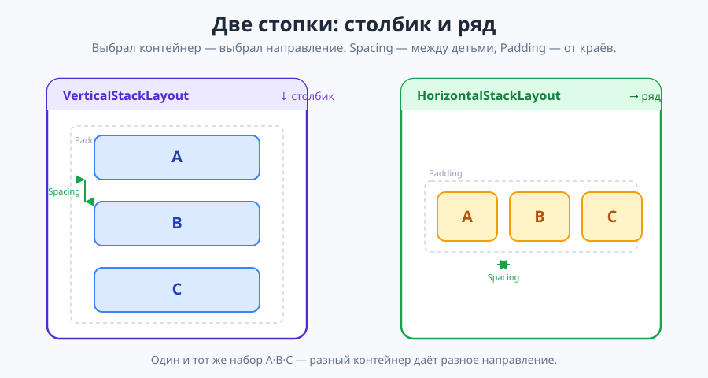
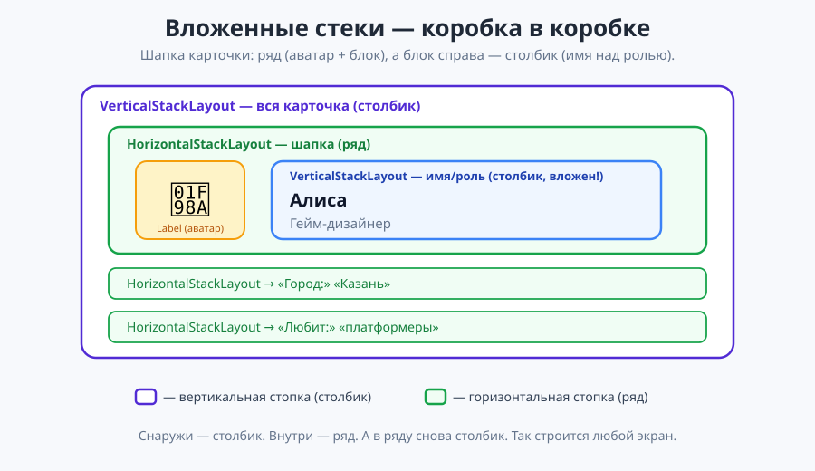

# Урок 2 (Блок 2). Макеты: стеки (Stack) + «Карточка профиля» 📐

**Блок 2 · Урок 2 | Как красиво расставлять элементы на экране**

> 🎯 **Сегодня мы:**
> 1. поймём, зачем нужны **макеты** (контейнеры) и почему без них элементы «налезают» друг на друга;
> 2. разберём две главные «стопки»: **`VerticalStackLayout`** (столбик) и **`HorizontalStackLayout`** (ряд);
> 3. научимся управлять расстояниями — **`Spacing`** и **`Padding`** — и выравниванием (**`HorizontalOptions` / `VerticalOptions`**);
> 4. освоим **вложенные стеки** — стопка внутри стопки (это главный приём всего блока!);
> 5. соберём красивую **«Карточку профиля»** и научимся менять макет **из кода**.
>
> ⏳ Идём маленькими шагами. После каждого куска — **запускаем и смотрим**, как двигаются элементы. Сегодня мы почти не пишем логику — учимся **расставлять**.

---

## 🌉 Часть 0. Вспомним урок 1 (мостик)

В прошлом уроке мы сделали «Счётчик» и познакомились с первыми элементами:

| Элемент | Что это |
|---------|---------|
| `Label` | текст на экране |
| `Button` | кнопка |
| `VerticalStackLayout` | контейнер — ставит элементы **друг под другом** |

И с главным правилом связки XAML ↔ C#:
- `x:Name="..."` даёт элементу **имя**, чтобы менять его из кода;
- `Clicked="Метод"` связывает кнопку с **методом-обработчиком** `(object? sender, EventArgs e)`.

> 💡 В уроке 1 мы клали элементы в `VerticalStackLayout` и они послушно вставали столбиком. Сегодня разберёмся, **почему** они так встали, и научимся ставить их **как захотим**: в ряд, по центру, вложенно.

✍️ **Мини-задание 0 (устно).** Вспомни: чем отличается `MainPage.xaml` от `MainPage.xaml.cs`? Какой из них отвечает за расположение элементов?

---

## 📐 Часть 1. Зачем нужны макеты (теория, 7 мин)

Представь, что ты просто накидал на экран три надписи и кнопку, **не сказав**, как их расставить. Что будет? Элементы **не знают**, где им встать, — и налезут друг на друга в одном углу. Получится каша.

**Макет (layout)** — это специальный **контейнер-«коробка»**. Мы кладём элементы внутрь, а коробка сама **расставляет** их по правилу. Правило зависит от того, **какую** коробку взяли:

| Контейнер | Правило расстановки | Аналогия |
|-----------|---------------------|----------|
| **`VerticalStackLayout`** | элементы **друг под другом** (сверху вниз) | стопка тарелок 🍽 |
| **`HorizontalStackLayout`** | элементы **в ряд** (слева направо) | книги на полке 📚 |

Слово **Stack** и значит «стопка». Сегодня — именно про эти две стопки: вертикальную и горизонтальную.



> 💡 **Лайфхак для понимания:** выбираешь контейнер — выбираешь **направление**. Vertical = вниз, Horizontal = вбок. Дальше элементы встают сами. А если нужно «и так, и так» — стеки **вкладывают** друг в друга (об этом в Части 5).

✍️ **Мини-задание 1 (устно).** Какой контейнер взять, чтобы поставить аватар и имя **рядом** (в одну строку)? А чтобы поставить три строки информации **друг под другом**?

---

## 🧱 Часть 2. Вертикальная стопка (`VerticalStackLayout`)

Это наш знакомый из урока 1. Кладём внутрь элементы — они встают **столбиком**:

```xml
<VerticalStackLayout>
    <Label Text="Первая строка" />
    <Label Text="Вторая строка" />
    <Label Text="Третья строка" />
</VerticalStackLayout>
```

На экране:
```
Первая строка
Вторая строка
Третья строка
```

Порядок в коде = порядок сверху вниз. Переставишь строки местами в XAML — переставятся и на экране.

### Два важных свойства: `Spacing` и `Padding`

У любой стопки есть два «рычажка» расстояний:

```xml
<VerticalStackLayout Spacing="20" Padding="30">
    ...
</VerticalStackLayout>
```

- **`Spacing="20"`** — расстояние **между** элементами внутри стопки (как «межстрочный интервал»).
- **`Padding="30"`** — **внутренний отступ** от краёв контейнера до элементов (чтобы не липли к рамке).

> 💡 **Как запомнить:** `Spacing` — **между** детьми; `Padding` — **вокруг** (поле от краёв). Разные вещи, хотя оба про «воздух».

**Два примера — почувствуй разницу:**

```xml
<!-- тесно: элементы почти слиплись -->
<VerticalStackLayout Spacing="2" Padding="5"> ... </VerticalStackLayout>

<!-- просторно: много воздуха -->
<VerticalStackLayout Spacing="30" Padding="40"> ... </VerticalStackLayout>
```

✍️ **Мини-задание 2.** Сделай вертикальную стопку из трёх `Label`. Сначала поставь `Spacing="2"`, запусти, посмотри. Потом поменяй на `Spacing="30"` и снова запусти. Опиши словами, что изменилось.

---

## ➡️ Часть 3. Горизонтальная стопка (`HorizontalStackLayout`) — новое!

Тот же принцип, но элементы встают **в ряд**, слева направо:

```xml
<HorizontalStackLayout Spacing="10">
    <Label Text="🍎" FontSize="30" />
    <Label Text="🍌" FontSize="30" />
    <Label Text="🍇" FontSize="30" />
</HorizontalStackLayout>
```

На экране:
```
🍎  🍌  🍇
```

`Spacing` и `Padding` работают так же, только `Spacing` теперь раздвигает элементы **по горизонтали**.

**Где это нужно каждый день:**
- кнопки в один ряд (`+` и `−` рядом, как в практике урока 1);
- «иконка + текст» (значок и подпись бок о бок);
- «подпись: значение» (например, `Город:  Казань`).

```xml
<!-- иконка и текст рядом -->
<HorizontalStackLayout Spacing="8">
    <Label Text="🏆" FontSize="24" />
    <Label Text="Рекорд: 120" FontSize="20" />
</HorizontalStackLayout>
```

> 💡 **Лайфхак:** если элементы, которые должны быть в ряд, упрямо встают столбиком — почти всегда их случайно положили в `VerticalStackLayout`. Проверь, в какой контейнер они вложены.

✍️ **Мини-задание 3.** Поставь в ряд три эмодзи-звезды `⭐` через `HorizontalStackLayout` со `Spacing="12"`. Запусти — они должны стоять бок о бок, а не столбиком.

---

## 📏 Часть 4. Выравнивание: `HorizontalOptions` и `VerticalOptions`

Мы уже встречали `HorizontalOptions="Center"` в уроке 1 (ставили текст по центру). Разберём подробно. Эти свойства говорят элементу, **как прижаться** внутри своего места:

| Значение | Что делает (для `HorizontalOptions`) |
|----------|--------------------------------------|
| `Start` | прижать **влево** |
| `Center` | поставить **по центру** |
| `End` | прижать **вправо** |
| `Fill` | **растянуть** на всю ширину |

`VerticalOptions` — то же самое, но по вертикали (`Start` = вверх, `End` = вниз).

```xml
<Label Text="Я слева"  HorizontalOptions="Start" />
<Label Text="Я по центру" HorizontalOptions="Center" />
<Label Text="Я справа"  HorizontalOptions="End" />
```

> 💡 **Очень частый приём:** кнопку или заголовок ставят `HorizontalOptions="Center"`, чтобы они были посередине экрана. А `VerticalOptions="Center"` у внешней стопки (как в уроке 1) прижимает всё содержимое к центру по высоте.

### `Padding` бывает «умный»

`Padding` можно задать не одним числом, а по сторонам:

```xml
<VerticalStackLayout Padding="20">          <!-- одинаково со всех сторон -->
<VerticalStackLayout Padding="40,10">       <!-- 40 по бокам, 10 сверху/снизу -->
<VerticalStackLayout Padding="10,20,10,40"> <!-- слева, сверху, справа, снизу -->
```

Пока достаточно одного числа — но знай, что так можно.

✍️ **Мини-задание 4.** Сделай три метки: одну `Start`, одну `Center`, одну `End`. Запусти и убедись, что они прижались к разным краям.

---

## 🪆 Часть 5. Вложенные стеки — стопка внутри стопки (ключевой приём!)

Вот главная идея урока. Реальные экраны устроены так: **стопки вкладывают друг в друга**, как матрёшки. Снаружи — вертикальная, внутри — горизонтальные (и наоборот).

Разберём на «шапке» нашей карточки: **аватар слева, а справа — имя и роль друг под другом**.

### Шаг за шагом собираем шапку

**Кусок 1.** Хотим: аватар и блок-справа — **в ряд**. Значит, внешний контейнер шапки — горизонтальный:

```xml
<HorizontalStackLayout Spacing="16">
    <!-- сюда: слева аватар, справа блок -->
</HorizontalStackLayout>
```

**Кусок 2.** Слева — крупный эмодзи-аватар:

```xml
<Label Text="🦊" FontSize="64" VerticalOptions="Center" />
```

`VerticalOptions="Center"` выровняет аватар по центру относительно блока справа.

**Кусок 3.** Справа — имя и роль **друг под другом**. Значит, внутрь кладём **вертикальную** стопку:

```xml
<VerticalStackLayout Spacing="2" VerticalOptions="Center">
    <Label Text="Алиса" FontSize="28" FontAttributes="Bold" />
    <Label Text="Гейм-дизайнер" FontSize="16" TextColor="Gray" />
</VerticalStackLayout>
```

- **`FontAttributes="Bold"`** — новое свойство: делает текст **жирным**.

**Всё вместе** — вертикальная стопка (имя+роль) вложена в горизонтальную (аватар+блок):

```xml
<HorizontalStackLayout Spacing="16">
    <Label Text="🦊" FontSize="64" VerticalOptions="Center" />
    <VerticalStackLayout Spacing="2" VerticalOptions="Center">
        <Label Text="Алиса" FontSize="28" FontAttributes="Bold" />
        <Label Text="Гейм-дизайнер" FontSize="16" TextColor="Gray" />
    </VerticalStackLayout>
</HorizontalStackLayout>
```

Результат:
```
🦊   Алиса
     Гейм-дизайнер
```



> 💡 **Лайфхак — мысли «коробками».** Прежде чем писать XAML, нарисуй на бумаге прямоугольники: что в ряд — обведи горизонтальной коробкой, что столбиком — вертикальной. Потом просто переведи коробки в теги. Вложенная коробка = вложенный тег.

> ⚠️ **Главная ошибка с вложением — незакрытый тег.** У каждого `<HorizontalStackLayout>` должен быть свой `</HorizontalStackLayout>`, у каждого `<VerticalStackLayout>` — свой `</VerticalStackLayout>`. Делай отступы «лесенкой» — так сразу видно, что во что вложено.

✍️ **Мини-задание 5.** Собери шапку по образцу выше (можешь взять свой эмодзи и имя). Запусти — аватар должен стоять **слева**, а имя и роль — **справа, друг под другом**.

---

## 🧩 Часть 6. Собираем «Карточку профиля»

Теперь соберём весь экран. Это будет аккуратная визитка: шапка, пара строк информации и кнопка «Лайк». Идём сверху вниз.

### Шаг 1. Внешняя стопка и фон

В `MainPage.xaml` оставь внутри `<ContentPage>` одну внешнюю **вертикальную** стопку (всё остальное в ней):

```xml
<ContentPage xmlns="http://schemas.microsoft.com/dotnet/2021/maui"
             xmlns:x="http://schemas.microsoft.com/winfx/2009/xaml"
             x:Class="ProfileCard.MainPage"
             BackgroundColor="#F0F4FF">

    <VerticalStackLayout Padding="24" Spacing="18" VerticalOptions="Center">

        <!-- сюда кладём шапку, строки и кнопку -->

    </VerticalStackLayout>

</ContentPage>
```

- `BackgroundColor="#F0F4FF"` — мягкий голубой фон всей страницы.
- Внешняя стопка прижата к центру по высоте (`VerticalOptions="Center"`).

### Шаг 2. Шапка (из Части 5)

Первым элементом внутрь — нашу шапку «аватар + имя/роль»:

```xml
<HorizontalStackLayout Spacing="16" HorizontalOptions="Center">
    <Label Text="🦊" FontSize="64" VerticalOptions="Center" />
    <VerticalStackLayout Spacing="2" VerticalOptions="Center">
        <Label Text="Алиса" FontSize="28" FontAttributes="Bold" />
        <Label Text="Гейм-дизайнер" FontSize="16" TextColor="Gray" />
    </VerticalStackLayout>
</HorizontalStackLayout>
```

### Шаг 3. Строки информации «подпись: значение»

Каждая строка — маленькая **горизонтальная** стопка (подпись и значение в ряд):

```xml
<HorizontalStackLayout Spacing="8">
    <Label Text="Город:" FontSize="18" />
    <Label Text="Казань" FontSize="18" FontAttributes="Bold" />
</HorizontalStackLayout>

<HorizontalStackLayout Spacing="8">
    <Label Text="Любит:" FontSize="18" />
    <Label Text="платформеры" FontSize="18" FontAttributes="Bold" />
</HorizontalStackLayout>
```

Обрати внимание: эти две горизонтальные стопки лежат во **внешней вертикальной** — поэтому строки встают друг под другом, а внутри каждой слова идут в ряд. Вот оно, вложение!

### Шаг 4. Кнопка «Лайк» со счётчиком (повтор урока 1)

Внизу — кнопка и рядом число лайков. Число меняем из кода, значит ему нужен `x:Name`:

```xml
<HorizontalStackLayout Spacing="10" HorizontalOptions="Center">
    <Button Text="❤ Лайк" Clicked="OnLikeClicked" />
    <Label x:Name="LikesLabel" Text="0" FontSize="24" VerticalOptions="Center" />
</HorizontalStackLayout>
```

> ✅ **Весь `MainPage.xaml` целиком** — в [материалы/MainPage.xaml](материалы/MainPage.xaml). Сверься, если «поехало».

### Шаг 5. Логика лайка (`MainPage.xaml.cs`)

Это мы уже умеем по уроку 1 — счётчик нажатий:

```csharp
public partial class MainPage : ContentPage
{
    int likes = 0;                    // помним число лайков

    public MainPage()
    {
        InitializeComponent();
    }

    private void OnLikeClicked(object? sender, EventArgs e)
    {
        likes++;                              // +1 лайк
        LikesLabel.Text = likes.ToString();   // показать в метке
    }
}
```

Запусти. Карточка красиво собрана, а кнопка «Лайк» считает нажатия. 🎉

**Должно получиться (примерно):**
```
        🦊  Алиса
            Гейм-дизайнер

        Город:  Казань
        Любит:  платформеры

        [ ❤ Лайк ]   3
```

---

## 🔗 Часть 7. Меняем макет из кода (`x:Name` у стопки)

`x:Name` можно давать **не только** меткам и кнопкам, но и **самим контейнерам** — и менять их свойства из C#. Дадим внешней стопке имя:

```xml
<VerticalStackLayout x:Name="Card" Padding="24" Spacing="18" VerticalOptions="Center">
```

Теперь добавим кнопку «Сжать/растянуть», которая меняет `Spacing` у всей карточки:

```xml
<Button Text="Просторнее" Clicked="OnSpaceClicked" HorizontalOptions="Center" />
```

```csharp
private void OnSpaceClicked(object? sender, EventArgs e)
{
    Card.Spacing = 40;   // раздвинули всё содержимое карточки
}
```

Нажал — и карточка «раздышалась». Так же из кода можно менять `Card.Padding`, `Card.BackgroundColor` и другие свойства контейнера.

> 💡 **Главная мысль:** контейнер — **такой же элемент**, как метка или кнопка. Дал имя — управляй им из кода. Это пригодится, когда захотим перестраивать экран «на лету».

✍️ **Мини-задание 6.** Дай внешней стопке `x:Name="Card"` и добавь кнопку, которая меняет `Card.BackgroundColor` (подсказка: цвет в C# берётся из `Colors`, например `Colors.LightYellow`). Нажал — фон карточки поменялся.

---

## 🧠 Как всё связано (соберём картинку)

```
ContentPage (вся страница)
└─ VerticalStackLayout  ← всё содержимое столбиком
   ├─ HorizontalStackLayout   ← шапка: в ряд
   │  ├─ Label "🦊"           (аватар)
   │  └─ VerticalStackLayout  ← имя и роль столбиком (вложено!)
   │     ├─ Label "Алиса"
   │     └─ Label "Гейм-дизайнер"
   ├─ HorizontalStackLayout → "Город:" "Казань"
   ├─ HorizontalStackLayout → "Любит:" "платформеры"
   └─ HorizontalStackLayout → [Лайк]  LikesLabel
```

Любой, даже сложный, экран — это **стопки, вложенные друг в друга**. Снаружи решаем «столбик или ряд», внутрь кладём элементы или **ещё стопки**.

---

## 🎯 Итоги урока

- **Макет (layout)** — контейнер, который сам расставляет вложенные элементы.
- **`VerticalStackLayout`** — столбиком (сверху вниз), **`HorizontalStackLayout`** — в ряд (слева направо).
- **`Spacing`** — расстояние **между** элементами; **`Padding`** — отступ **от краёв** контейнера.
- **`HorizontalOptions` / `VerticalOptions`** (`Start`/`Center`/`End`/`Fill`) — как элемент прижимается в своём месте.
- **Вложенные стеки** — стопка внутри стопки; так строятся все реальные экраны.
- Контейнеру тоже можно дать **`x:Name`** и менять его свойства из кода.
- `FontAttributes="Bold"` — жирный текст.

➡️ Дальше — [практика.md](практика.md) (30 заданий на расстановку), затем [викторина.html](викторина.html).
🆘 Пропустил или собираешь дома — [самоучитель.md](самоучитель.md) (сборка карточки с нуля по шагам).
🧰 Что-то «поехало» — [лайфхак.md](лайфхак.md). Быстро вспомнить — [итого.md](итого.md).

> **В следующем уроке** возьмём макет **`Grid`** (сетка из строк и столбцов) и соберём на нём «Калькулятор» — там кнопки удобно расставлять таблицей.
