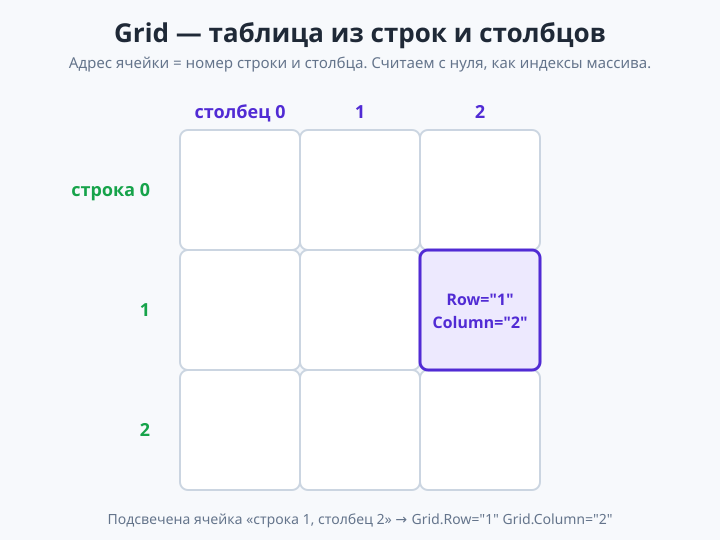
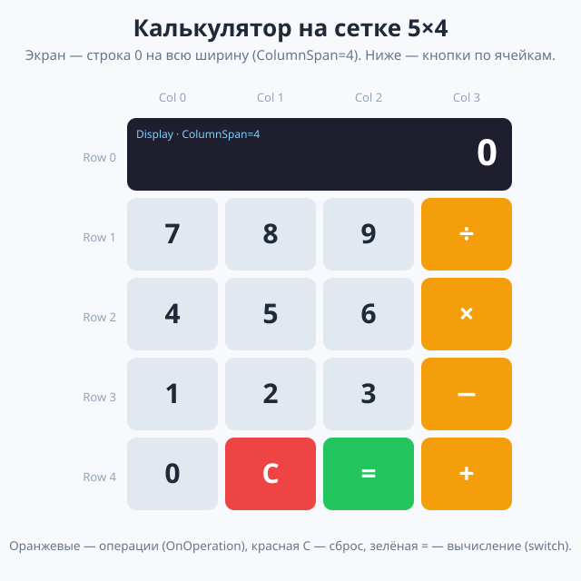

# Урок 3 (Блок 2). Сетка Grid + приложение «Калькулятор» 🧮

**Блок 2 · Урок 3 | Расставляем элементы по строкам и столбцам**

> 🎯 **Сегодня мы:**
> 1. поймём, зачем нужен макет **`Grid`** (сетка) и чем он сильнее стеков;
> 2. научимся задавать **строки и столбцы** (`RowDefinitions` / `ColumnDefinitions`) и их размеры;
> 3. будем **класть элемент в нужную ячейку** через `Grid.Row` и `Grid.Column`;
> 4. научим элемент **растягиваться** на несколько ячеек (`Grid.ColumnSpan` / `Grid.RowSpan`);
> 5. соберём настоящий **«Калькулятор»** с кнопками-сеткой и вычислением через `switch`.
>
> ⏳ Идём маленькими шагами. Сетку строим постепенно: сначала пустая таблица, потом раскладываем по ячейкам кнопки, и только в конце — логика вычислений.

---

## 🌉 Часть 0. Вспомним урок 2 и упрёмся в предел стеков

В прошлом уроке мы расставляли элементы **стеками**: `VerticalStackLayout` (столбик) и `HorizontalStackLayout` (ряд), вкладывали их друг в друга.

Стеки — отличные, но у них есть **слабое место**: с ними трудно сделать **ровную таблицу**. Вспомни прайс-лист и «развести элементы по краям» из практики урока 2 — приходилось подпирать `WidthRequest`, и всё равно неровно. А теперь представь **калькулятор**: 4 столбца кнопок, все одинаковой ширины, ровными рядами. Стеками это собирать мучительно.

Для таких раскладок есть специальный макет — **`Grid` (сетка)**. Именно про него сегодня.

| Макет | Когда удобен |
|-------|--------------|
| `VerticalStackLayout` / `HorizontalStackLayout` | простые списки: всё в столбик или в ряд |
| **`Grid`** | **таблицы и сетки**: ровные строки и столбцы, кнопки калькулятора, формы «подпись — поле» |

> 💡 **Правило выбора:** если элементы естественно ложатся в **таблицу** (ряды и колонки одинакового размера) — бери `Grid`. Если это просто «столбик» или «ряд» — хватит стека.

✍️ **Мини-задание 0 (устно).** Назови два примера экранов, которые удобнее собрать сеткой, чем стеками. (Подсказка: клавиатура, календарь, игровое поле «крестики-нолики».)

---

## 📊 Часть 1. Что такое Grid (теория, 8 мин)

**`Grid`** — это **таблица**: он делит своё место на **строки** (rows) и **столбцы** (columns). На пересечении строки и столбца получается **ячейка**. В каждую ячейку мы кладём элемент.

Главное отличие от стека: в стеке элементы встают **по порядку сами**, а в `Grid` мы **сами говорим каждому**, в какой строке и столбце ему стоять — по «координатам».

Координаты считаются **с нуля** (как индексы массива из блока 1!):
- строки нумеруются сверху вниз: `0`, `1`, `2`, …
- столбцы — слева направо: `0`, `1`, `2`, …

Ячейка «строка 1, столбец 2» — это `Grid.Row="1" Grid.Column="2"`.



> 💡 **Мостик из блока 1:** нумерация ячеек — как индексы в массиве: первый элемент имеет номер **0**, а не 1. Второй столбец — это `Column="1"`. Легко забыть и промахнуться на единицу.

✍️ **Мини-задание 1 (устно).** В сетке 4×4 какие координаты у левой верхней ячейки? А у правой нижней? *(Ответы — в конце файла делать не будем: левая верхняя — Row 0, Column 0; правая нижняя — Row 3, Column 3.)*

---

## 📐 Часть 2. Задаём строки и столбцы

Прежде чем класть элементы, нужно **сказать сетке, сколько в ней строк и столбцов** и какого они размера. Это делают свойства `RowDefinitions` и `ColumnDefinitions`.

Самый простой и современный способ — перечислить размеры через запятую:

```xml
<Grid RowDefinitions="100,70,70"
      ColumnDefinitions="*,*,*,*">
    <!-- сюда кладём элементы по ячейкам -->
</Grid>
```

- `RowDefinitions="100,70,70"` — **три строки**: первая высотой 100, две по 70.
- `ColumnDefinitions="*,*,*,*"` — **четыре столбца**, все со звёздочкой `*`.

### Что значат размеры

| Запись | Смысл |
|--------|-------|
| число (`70`) | ровно столько пикселей (фиксированная высота/ширина) |
| `*` | «займи всё оставшееся место», поровну делится между всеми `*` |
| `Auto` | «ровно столько, сколько нужно содержимому» |

- `*` — самый частый выбор для «резиновой» раскладки: четыре столбца `*,*,*,*` разделят ширину экрана на **4 равные части** — идеально для кнопок калькулятора.
- `Auto` удобен для строки, высота которой должна подстроиться под текст.

> 💡 **Лайфхак:** можно писать `2*` — такой столбец получит **вдвое** больше места, чем обычный `*`. Например `ColumnDefinitions="*,2*"` — второй столбец вдвое шире первого.

<details>
<summary>📝 <b>Как это же пишут «длинно»</b> (встретишь в интернете)</summary>

Короткая запись `RowDefinitions="100,70,70"` — это то же самое, что и «длинная» форма:
```xml
<Grid>
    <Grid.RowDefinitions>
        <RowDefinition Height="100" />
        <RowDefinition Height="70" />
        <RowDefinition Height="70" />
    </Grid.RowDefinitions>
    <Grid.ColumnDefinitions>
        <ColumnDefinition Width="*" />
        ...
    </Grid.ColumnDefinitions>
</Grid>
```
Обе записи работают одинаково. Мы будем пользоваться **короткой** — её быстрее писать и легче читать.
</details>

✍️ **Мини-задание 2.** Сделай `Grid` с `RowDefinitions="*,*"` и `ColumnDefinitions="*,*"` — это сетка 2×2. Пока пустая, но запусти — убедись, что приложение собирается.

---

## 📍 Часть 3. Кладём элемент в ячейку

Теперь кладём элементы. Каждому говорим его координаты через `Grid.Row` и `Grid.Column`:

```xml
<Grid RowDefinitions="*,*" ColumnDefinitions="*,*">

    <Label Text="Я в (0,0)" Grid.Row="0" Grid.Column="0" />
    <Label Text="Я в (0,1)" Grid.Row="0" Grid.Column="1" />
    <Label Text="Я в (1,0)" Grid.Row="1" Grid.Column="0" />
    <Label Text="Я в (1,1)" Grid.Row="1" Grid.Column="1" />

</Grid>
```

Каждая метка встала в **свою** ячейку сетки 2×2.

> 💡 **Важно:** если у элемента **не указать** `Grid.Row`/`Grid.Column`, он молча встанет в ячейку **(0, 0)** — и наложится на то, что там уже есть. «Пропал» элемент или два налезли друг на друга — первым делом проверь координаты.

**Ещё пример — форма «подпись : поле»:**
```xml
<Grid RowDefinitions="Auto,Auto" ColumnDefinitions="Auto,*">
    <Label Text="Имя:"    Grid.Row="0" Grid.Column="0" />
    <Label Text="Алиса"   Grid.Row="0" Grid.Column="1" />
    <Label Text="Возраст:" Grid.Row="1" Grid.Column="0" />
    <Label Text="14"      Grid.Row="1" Grid.Column="1" />
</Grid>
```
Вот теперь колонки **ровные** — то, чего так не хватало стекам в уроке 2!

✍️ **Мини-задание 3.** Собери сетку 2×2 из четырёх кнопок с текстами «A», «B», «C», «D» — каждая в своей ячейке. Запусти: должно получиться ровное поле 2×2.

---

## ⬌ Часть 4. Растягиваем на несколько ячеек (Span)

Иногда элемент должен занять **несколько ячеек** — например, экран калькулятора тянется на всю ширину поверх всех столбцов. Для этого есть:

- **`Grid.ColumnSpan="4"`** — растянуть на 4 столбца;
- **`Grid.RowSpan="2"`** — растянуть на 2 строки.

```xml
<Grid RowDefinitions="80,70" ColumnDefinitions="*,*,*,*">

    <!-- экран: строка 0, тянется на все 4 столбца -->
    <Label Text="0" Grid.Row="0" Grid.Column="0" Grid.ColumnSpan="4"
           FontSize="40" HorizontalOptions="End" />

    <!-- кнопка в строке 1, столбце 0 -->
    <Button Text="7" Grid.Row="1" Grid.Column="0" />

</Grid>
```

- `Grid.Column="0"` + `Grid.ColumnSpan="4"` — элемент **начинается** в столбце 0 и **накрывает** 4 столбца подряд.

> 💡 **Так работает «шапка» любой сетки:** заголовок/экран кладут в верхнюю строку и растягивают `ColumnSpan` на всю ширину, а ниже уже идут обычные ячейки.

> 📋 **`Grid` — свойства и события.**
> **Свойства:** `RowDefinitions` (`"100,70,*"`), `ColumnDefinitions` (`"*,*,*,*"`; размеры: число / `*` / `2*` / `Auto`), `RowSpacing`, `ColumnSpacing`, `Padding`, `BackgroundColor`, `x:Name`.
> **Присоединённые (ставятся у элементов внутри):** `Grid.Row`, `Grid.Column` (с нуля!), `Grid.RowSpan`, `Grid.ColumnSpan`.
> **События:** нет (контейнер). В C# ячейку задают так: `Grid.SetRow(label, 0); Grid.SetColumn(label, 1);`

✍️ **Мини-задание 4.** В сетке из мини-задания 3 добавь сверху ещё одну строку (`RowDefinitions="Auto,*,*"`) и положи в неё `Label` с текстом «Меню», растянув его `Grid.ColumnSpan="2"` на оба столбца.

---

## 🎨 Часть 5. Расстояния в сетке

У `Grid` свои «рычажки» воздуха — как `Spacing`/`Padding` у стеков, но раздельно для строк и столбцов:

```xml
<Grid RowDefinitions="*,*,*" ColumnDefinitions="*,*,*"
      RowSpacing="10" ColumnSpacing="10" Padding="16">
```

- **`RowSpacing="10"`** — расстояние **между строками**;
- **`ColumnSpacing="10"`** — расстояние **между столбцами**;
- **`Padding="16"`** — отступ от краёв сетки до содержимого (как у стеков).

> 💡 Без `RowSpacing`/`ColumnSpacing` кнопки в сетке будут вплотную, «слипшись». Небольшой зазор (8–12) сразу делает сетку аккуратной.

✍️ **Мини-задание 5.** Добавь своей сетке 2×2 `RowSpacing` и `ColumnSpacing` по 10 и `Padding="16"`. Запусти — кнопки «раздышались».

---

## 🔢 Часть 6. Собираем «Калькулятор» — внешность

Теперь соберём настоящий калькулятор. Внешность: **экран** сверху и **4×4 кнопки** под ним. Всё — на одной сетке `5 строк × 4 столбца`.

### Шаг 1. Каркас сетки

В `MainPage.xaml` внутри `<ContentPage>` поставь сетку. Странице зададим тёмный фон, как у настоящих калькуляторов:

```xml
<ContentPage ... BackgroundColor="#1E1E2E">

    <Grid RowDefinitions="100,70,70,70,70"
          ColumnDefinitions="*,*,*,*"
          RowSpacing="10" ColumnSpacing="10" Padding="16"
          VerticalOptions="Center">

        <!-- сюда: экран и кнопки -->

    </Grid>

</ContentPage>
```

- строка 0 высотой 100 — под экран; строки 1–4 по 70 — под кнопки;
- 4 столбца `*` — четыре равные колонки кнопок.

### Шаг 2. Экран (растянут на 4 столбца)

Первым — большой `Label` с именем `Display`, растянутый на всю ширину:

```xml
<Label x:Name="Display" Grid.Row="0" Grid.Column="0" Grid.ColumnSpan="4"
       Text="0" FontSize="48" TextColor="White"
       HorizontalOptions="End" VerticalOptions="Center" />
```

- `x:Name="Display"` — понадобится, чтобы менять текст из кода;
- `Grid.ColumnSpan="4"` — экран поверх всех столбцов;
- `HorizontalOptions="End"` — число прижато **вправо**, как на настоящих калькуляторах.

### Шаг 3. Первый ряд кнопок (7 8 9 ÷)

Строка 1, четыре кнопки по своим столбцам:

```xml
<Button Grid.Row="1" Grid.Column="0" Text="7" FontSize="24" Clicked="OnDigit" />
<Button Grid.Row="1" Grid.Column="1" Text="8" FontSize="24" Clicked="OnDigit" />
<Button Grid.Row="1" Grid.Column="2" Text="9" FontSize="24" Clicked="OnDigit" />
<Button Grid.Row="1" Grid.Column="3" Text="÷" FontSize="24" BackgroundColor="#F59E0B" Clicked="OnOperation" />
```

- три цифры зовут **один** метод `OnDigit`, а знак деления — `OnOperation` (операции покрасим оранжевым, чтобы отличались).

### Шаг 4. Ещё два ряда (4 5 6 × и 1 2 3 −)

По образцу, меняем только `Grid.Row`, `Grid.Column` и текст:

```xml
<Button Grid.Row="2" Grid.Column="0" Text="4" FontSize="24" Clicked="OnDigit" />
<Button Grid.Row="2" Grid.Column="1" Text="5" FontSize="24" Clicked="OnDigit" />
<Button Grid.Row="2" Grid.Column="2" Text="6" FontSize="24" Clicked="OnDigit" />
<Button Grid.Row="2" Grid.Column="3" Text="×" FontSize="24" BackgroundColor="#F59E0B" Clicked="OnOperation" />

<Button Grid.Row="3" Grid.Column="0" Text="1" FontSize="24" Clicked="OnDigit" />
<Button Grid.Row="3" Grid.Column="1" Text="2" FontSize="24" Clicked="OnDigit" />
<Button Grid.Row="3" Grid.Column="2" Text="3" FontSize="24" Clicked="OnDigit" />
<Button Grid.Row="3" Grid.Column="3" Text="−" FontSize="24" BackgroundColor="#F59E0B" Clicked="OnOperation" />
```

### Шаг 5. Нижний ряд (0 C = +)

```xml
<Button Grid.Row="4" Grid.Column="0" Text="0" FontSize="24" Clicked="OnDigit" />
<Button Grid.Row="4" Grid.Column="1" Text="C" FontSize="24" BackgroundColor="#EF4444" TextColor="White" Clicked="OnClear" />
<Button Grid.Row="4" Grid.Column="2" Text="=" FontSize="24" BackgroundColor="#22C55E" TextColor="White" Clicked="OnEquals" />
<Button Grid.Row="4" Grid.Column="3" Text="+" FontSize="24" BackgroundColor="#F59E0B" Clicked="OnOperation" />
```



> ✅ **Весь `MainPage.xaml` целиком** — в [материалы/MainPage.xaml](материалы/MainPage.xaml). Запусти сейчас: кнопки уже красиво стоят сеткой, но пока «не думают» — добавим логику.

✍️ **Мини-задание 6.** Собери внешность калькулятора и запусти. Кнопки должны стоять ровной сеткой 4×4 под экраном. Нажатия пока дадут ошибку «метод не найден» — это нормально, дальше пишем C#.

---

## 🧠 Часть 7. Логика калькулятора (`MainPage.xaml.cs`)

Теперь научим калькулятор считать. Нам нужно помнить три вещи, поэтому заведём три переменные **в классе**:

```csharp
public partial class MainPage : ContentPage
{
    string current = "";      // что набираем прямо сейчас (например "12")
    double stored = 0;        // запомненное первое число
    string op = "";           // выбранная операция: +, −, ×, ÷

    public MainPage()
    {
        InitializeComponent();
    }

    // методы кнопок — ниже ⬇️
}
```

### Кнопки-цифры — один метод на всех

Все десять цифр зовут **один** метод `OnDigit`. Как понять, какую именно нажали? У обработчика есть параметр **`sender`** — это «тот, кто позвал», то есть сама кнопка:

```csharp
private void OnDigit(object? sender, EventArgs e)
{
    Button b = (Button)sender!;   // sender — это нажатая кнопка
    current += b.Text;            // добавили её цифру справа к строке
    Display.Text = current;       // показали на экране
}
```

- `(Button)sender` — «приведение»: говорим C#, что `sender` — это `Button` (кнопка). Тогда у него можно взять `b.Text`.
- `current += b.Text;` — дописываем цифру: было `"1"`, нажали `2` → стало `"12"`.

> 💡 **Новое и полезное:** один обработчик на много кнопок через `sender` — это гораздо короче, чем писать `OnSeven`, `OnEight`, … Подробнее про `sender` будет в уроке про события; сейчас просто пользуемся.

### Кнопки-операции

Когда нажали `+`, `−`, `×` или `÷` — запоминаем набранное число и саму операцию, а строку очищаем под второе число:

```csharp
private void OnOperation(object? sender, EventArgs e)
{
    if (current == "") return;            // ещё ничего не набрали — выходим
    Button b = (Button)sender!;
    stored = Convert.ToDouble(current);   // запомнили первое число
    op = b.Text;                          // запомнили знак операции
    current = "";                         // готовимся ко второму числу
}
```

- `Convert.ToDouble(current)` — превращаем строку в число (как в блоке 1);
- `return;` — если ещё ничего не набрано, метод просто ничего не делает.

### Кнопка «=» — считаем через `switch`

Здесь пригодится **`switch`** из блока 1: выбираем действие по знаку операции:

```csharp
private void OnEquals(object? sender, EventArgs e)
{
    if (current == "" || op == "") return;
    double second = Convert.ToDouble(current);
    double result = 0;
    switch (op)
    {
        case "+": result = stored + second; break;
        case "−": result = stored - second; break;
        case "×": result = stored * second; break;
        case "÷": result = second != 0 ? stored / second : 0; break;
    }
    result = Math.Round(result, 4);       // подрезаем длинный «хвост» (Math из блока 1)
    Display.Text = result.ToString();
    current = result.ToString();          // с результатом можно считать дальше
    op = "";
}
```

- `switch (op)` — выбираем формулу по знаку;
- `÷` защищён: `second != 0 ? … : 0` — не делим на ноль (тернарник из блока 1);
- `Math.Round(result, 4)` — чтобы `10 ÷ 3` показывалось как `3,3333`, а не бесконечным хвостом.

> 💡 Обрати внимание, сколько всего из блока 1 здесь встретилось: `switch`, тернарник, `Convert.ToDouble`, `Math.Round`. MAUI — это тот же C#, просто с экраном.

### Кнопка «C» — сброс

```csharp
private void OnClear(object? sender, EventArgs e)
{
    current = "";
    stored = 0;
    op = "";
    Display.Text = "0";
}
```

> ✅ **Весь `MainPage.xaml.cs` целиком** — в [материалы/MainPage.xaml.cs](материалы/MainPage.xaml.cs).

**Должно получиться:** набираешь `12`, жмёшь `+`, набираешь `8`, жмёшь `=` → на экране `20`. Можно продолжить: `×`, `3`, `=` → `60`. 🎉

✍️ **Мини-задание 7.** Собери логику и проверь: `7 × 6 =` (должно быть 42), `9 − 4 =` (5), `8 ÷ 0 =` (0 — деление на ноль защищено), затем `C` (экран снова 0).

---

## 🧠 Как всё связано (соберём картинку)

```
Grid (5 строк × 4 столбца)
├─ строка 0: Display  (ColumnSpan=4 — на всю ширину)
├─ строка 1: 7  8  9  ÷
├─ строка 2: 4  5  6  ×
├─ строка 3: 1  2  3  −
└─ строка 4: 0  C  =  +

цифры  → OnDigit    (current += цифра)
операции → OnOperation (запомнить stored и op)
=      → OnEquals   (switch по op → result)
C      → OnClear    (всё обнулить)
```

`Grid` расставил кнопки ровной таблицей по координатам, а C# оживил их. Сетка + знакомая логика из блока 1 = настоящее приложение.

---

## 🎯 Итоги урока

- **`Grid`** — макет-**таблица** из строк и столбцов; нужен, когда элементы ложатся сеткой.
- **`RowDefinitions` / `ColumnDefinitions`** задают строки/столбцы; размеры — число, **`*`** (доля места), **`Auto`** (по содержимому).
- **`Grid.Row` / `Grid.Column`** ставят элемент в ячейку (нумерация **с нуля**, как индексы массива).
- **`Grid.ColumnSpan` / `Grid.RowSpan`** растягивают элемент на несколько ячеек.
- **`RowSpacing` / `ColumnSpacing` / `Padding`** — воздух в сетке.
- Один обработчик на много кнопок — через **`sender`** (`(Button)sender`).
- Внутри — знакомые из блока 1 **`switch`**, тернарник, `Convert.ToDouble`, `Math.Round`.

➡️ Дальше — [практика.md](практика.md) (30 заданий на сетку), затем [викторина.html](викторина.html).
🆘 Пропустил или собираешь дома — [самоучитель.md](самоучитель.md) (калькулятор с нуля по шагам).
🧰 Что-то «поехало» — [лайфхак.md](лайфхак.md). Быстро вспомнить — [итого.md](итого.md).

> **В следующем уроке** займёмся **полями ввода** (`Entry`, `Editor`): научимся читать то, что человек **напечатал**, — и сделаем анкету/профиль.
