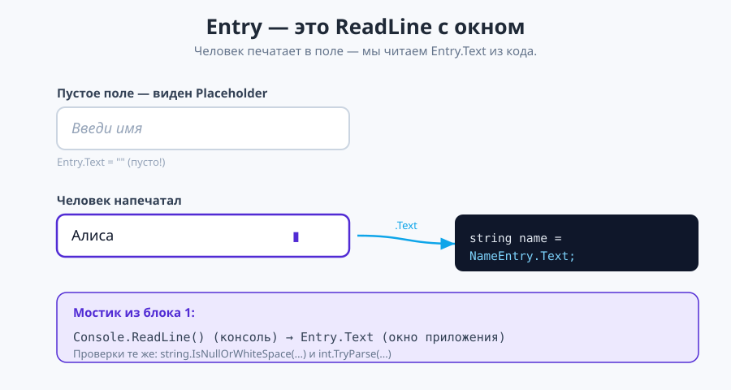
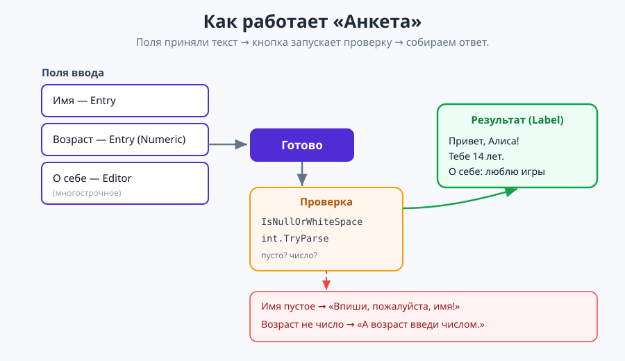

# Урок 4 (Блок 2). Поля ввода Entry и Editor + приложение «Анкета» ⌨️

**Блок 2 · Урок 4 | Как получить от человека текст, который он напечатал**

> 🎯 **Сегодня мы:**
> 1. познакомимся с полем ввода **`Entry`** — это «`Console.ReadLine` с окном»;
> 2. научимся **читать напечатанное** из кода через `.Text` и строить из него ответ;
> 3. настроим поле: подсказка **`Placeholder`**, цифровая клавиатура, скрытый пароль;
> 4. **проверим ввод** (пусто? число?) — вспомним `int.TryParse` из блока 1;
> 5. добавим многострочное поле **`Editor`** и «живой» ввод (**`TextChanged`**);
> 6. соберём приложение **«Анкета»**, которое собирает профиль из того, что ты напечатал.
>
> ⏳ Идём маленькими шагами. Каждое поле добавляем и **сразу запускаем** — смотрим, как оно ведёт себя при вводе.

---

## 🌉 Часть 0. Вспомним и поймём, чего не хватало

В прошлых уроках кнопки уже умели **делать** что-то по нажатию. Но всё, что мы показывали, было **задано заранее** (тексты в XAML) или набрано **кнопками** (как цифры в калькуляторе).

А как получить от человека **произвольный текст** — имя, город, сообщение? В блоке 1 для этого был **`Console.ReadLine()`**. В приложениях с окном его роль играет специальный элемент — **поле ввода `Entry`**.

| Было (консоль, блок 1) | Стало (MAUI) |
|------------------------|--------------|
| `string name = Console.ReadLine();` | поле **`Entry`**, у него читаем `Entry.Text` |
| приглашение «Введите имя:» | подсказка внутри поля — **`Placeholder`** |
| `int.Parse` / `int.TryParse` ввода | то же самое! проверяем `Entry.Text` |

> 💡 **Главная мысль урока:** `Entry` — это `ReadLine` с окошком. Человек печатает в поле, а мы в коде забираем текст через `Entry.Text` и работаем с ним как обычно.

✍️ **Мини-задание 0 (устно).** Чем `Label` отличается от `Entry`? (Подсказка: одно — только показывает текст, другое — позволяет человеку его **вводить**.)

---

## ⌨️ Часть 1. Поле ввода `Entry` (теория, 6 мин)

**`Entry`** — это **однострочное поле ввода**: рамка, в которую человек печатает текст.

```xml
<Entry x:Name="NameEntry" Placeholder="Введи имя" />
```

- **`x:Name="NameEntry"`** — имя, чтобы прочитать введённое из кода (как всегда, когда работаем с элементом из C#);
- **`Placeholder="Введи имя"`** — бледная **подсказка** внутри пустого поля (исчезает, как только начинают печатать). Это как приглашение «Введите имя:» в консоли.



> 💡 **Лайфхак:** `Placeholder` — это **не** текст поля! Это просто подсказка. Пока человек ничего не ввёл, `Entry.Text` пустой (даже если видна серая подсказка).

✍️ **Мини-задание 1.** Добавь на экран `Label` «Как тебя зовут?» и под ним `Entry` с `Placeholder="Введи имя"`. Запусти, щёлкни в поле, напечатай что-нибудь — подсказка исчезла, появился твой текст.

---

## 📖 Часть 2. Читаем введённое из кода

Теперь заберём напечатанное. Добавим кнопку и в её обработчике прочитаем `NameEntry.Text`:

```xml
<Button Text="Поздороваться" Clicked="OnHello" />
<Label x:Name="ResultLabel" FontSize="18" />
```

```csharp
private void OnHello(object? sender, EventArgs e)
{
    string name = NameEntry.Text;                 // забрали текст из поля
    ResultLabel.Text = $"Привет, {name}!";        // собрали ответ (интерполяция из блока 1)
}
```

- `NameEntry.Text` — то, что человек напечатал (обычная строка);
- `$"Привет, {name}!"` — **интерполяция строк** из блока 1: подставляем `name` внутрь текста.

Напечатал «Алиса», нажал кнопку → «Привет, Алиса!». Это ровно та же логика, что была с `ReadLine` в консоли, — только красиво.

> 💡 **Ещё пример — «эхо»:** возьми два поля (город и страна) и собери из них строку `$"{city}, {country}"`. Из нескольких полей легко собрать одну фразу.

✍️ **Мини-задание 2.** Допиши кнопку и метку из примера. Проверь: вводишь имя, жмёшь кнопку — под ней появляется приветствие с твоим именем.

---

## 🔢 Часть 3. Настраиваем поле

У `Entry` есть полезные свойства, которые делают ввод удобнее и аккуратнее:

```xml
<Entry Placeholder="Возраст" Keyboard="Numeric" />       <!-- цифровая клавиатура -->
<Entry Placeholder="Пароль"  IsPassword="True" />         <!-- точки вместо букв -->
<Entry Placeholder="Ник"     MaxLength="10" />            <!-- не длиннее 10 символов -->
```

| Свойство | Что делает |
|----------|-----------|
| `Keyboard="Numeric"` | на телефоне открывает **цифровую** клавиатуру (удобно для чисел) |
| `IsPassword="True"` | прячет ввод точками (для паролей) |
| `MaxLength="10"` | ограничивает длину ввода |

> 💡 **Лайфхак:** `Keyboard="Numeric"` **не запрещает** буквы на компьютере (там обычная клавиатура) — он лишь подсказывает удобную клавиатуру на телефоне. Поэтому число из поля всё равно нужно **проверять в коде** (об этом дальше).

✍️ **Мини-задание 3.** Добавь поле возраста с `Keyboard="Numeric"` и поле «секретное слово» с `IsPassword="True"`. Запусти и посмотри, как они себя ведут.

---

## 🛡 Часть 4. Проверяем ввод (пусто? число?)

Человек может оставить поле пустым или напечатать в возрасте «абвгд». Хорошее приложение это **проверяет**. Инструменты — знакомые из блока 1.

### Пусто ли поле?

```csharp
string name = NameEntry.Text;
if (string.IsNullOrWhiteSpace(name))
{
    ResultLabel.Text = "Впиши, пожалуйста, имя!";
    return;                                    // дальше не идём
}
```

- **`string.IsNullOrWhiteSpace(name)`** — `true`, если строка пустая или состоит из пробелов. Удобная проверка «поле не заполнили».
- **`return;`** — досрочно выходим из метода, если проверка не прошла.

### Число ли в поле возраста?

Тут пригодится **`int.TryParse`** из блока 1 (урок про файлы/исключения):

```csharp
if (int.TryParse(AgeEntry.Text, out int age))
    ResultLabel.Text = $"Тебе {age} лет.";     // получилось число
else
    ResultLabel.Text = "Возраст введи числом.";// не число
```

- `int.TryParse(текст, out int age)` — **пытается** превратить текст в число. Вышло → `true` и число лежит в `age`; не вышло → `false` (приложение не падает!).

> 💡 **Почему не `Convert.ToInt32`?** `Convert.ToInt32("абв")` **уронил бы** приложение с ошибкой. А `int.TryParse` спокойно вернёт `false` — и мы покажем вежливое сообщение. Для ввода от человека всегда берём `TryParse`.

✍️ **Мини-задание 4.** Добавь в кнопку проверку: если имя пустое — покажи «Впиши имя!»; если возраст не число — «Возраст введи числом!». Проверь оба случая.

---

## 📝 Часть 5. Многострочное поле `Editor`

`Entry` — для одной строки (имя, город). Для **длинного** текста (рассказ о себе, отзыв, сообщение) есть **`Editor`** — то же поле, но многострочное:

```xml
<Editor x:Name="AboutEditor" Placeholder="Пара слов о себе..." HeightRequest="100" />
```

- работает так же: читаем `AboutEditor.Text`;
- **`HeightRequest="100"`** — задаём высоту (чтобы влезло несколько строк);
- текст переносится на новые строки сам.

| Элемент | Для чего |
|---------|----------|
| `Entry` | одна строка: имя, город, возраст, пароль |
| `Editor` | много строк: рассказ, отзыв, заметка |

✍️ **Мини-задание 5.** Добавь `Editor` с подсказкой «Пара слов о себе...» и высотой 100. Напечатай пару строк — поле растит текст вниз.

---

## ⚡ Часть 6. «Живой» ввод — событие `TextChanged`

До сих пор мы читали поле **по кнопке**. Но можно реагировать на **каждый набранный символ** — через событие `TextChanged`. Сделаем приветствие, которое меняется прямо во время набора:

```xml
<Entry x:Name="NameEntry" Placeholder="Введи имя" TextChanged="OnNameChanged" />
<Label x:Name="HelloLabel" Text="Привет!" />
```

```csharp
private void OnNameChanged(object? sender, TextChangedEventArgs e)
{
    HelloLabel.Text = $"Привет, {e.NewTextValue}!";   // e.NewTextValue — что в поле сейчас
}
```

- **`TextChanged`** — событие «текст в поле изменился» (в отличие от `Clicked` у кнопки);
- у обработчика особый параметр — **`TextChangedEventArgs e`**, и в нём `e.NewTextValue` — **новый** текст поля прямо сейчас.

Печатаешь «А», «л», «и»… — а надпись сразу становится «Привет, Ал…», «Привет, Али…». Магия живого интерфейса! ✨

> 💡 Разные элементы шлют разные события: кнопка — `Clicked`, поле — `TextChanged`. У каждого события свой параметр (`EventArgs`, `TextChangedEventArgs`). Пока просто запоминаем нужные.

✍️ **Мини-задание 6.** Сделай живое приветствие по образцу. Убедись, что надпись меняется на **каждую** букву, без всякой кнопки.

---

## 🧩 Часть 7. Собираем приложение «Анкета»

Соберём всё вместе: имя, возраст, рассказ о себе — и кнопку, которая собирает профиль. Идём сверху вниз.

### Шаг 1. Прокручиваемая форма

Полей много, на телефоне клавиатура может закрыть нижние — поэтому обернём всё в **`ScrollView`** (прокрутку):

```xml
<ContentPage ... BackgroundColor="#F0F4FF">
    <ScrollView>
        <VerticalStackLayout Padding="24" Spacing="14">

            <!-- сюда: заголовок, поля, кнопка, результат -->

        </VerticalStackLayout>
    </ScrollView>
</ContentPage>
```

- **`ScrollView`** — контейнер с **одним** ребёнком, который позволяет прокручивать содержимое, если оно не влезло. Внутрь кладём нашу вертикальную стопку.

### Шаг 2. Заголовок и поле имени с живым приветствием

```xml
<Label Text="Моя анкета" FontSize="28" FontAttributes="Bold" HorizontalOptions="Center" />

<Label Text="Как тебя зовут?" FontSize="16" />
<Entry x:Name="NameEntry" Placeholder="Введи имя" TextChanged="OnNameChanged" />
<Label x:Name="HelloLabel" Text="Привет!" FontSize="16" TextColor="Gray" />
```

### Шаг 3. Возраст и рассказ о себе

```xml
<Label Text="Сколько тебе лет?" FontSize="16" />
<Entry x:Name="AgeEntry" Placeholder="Например, 14" Keyboard="Numeric" />

<Label Text="Расскажи о себе:" FontSize="16" />
<Editor x:Name="AboutEditor" Placeholder="Пара слов о себе..." HeightRequest="100" />
```

### Шаг 4. Кнопка и место для ответа

```xml
<Button Text="Готово" Clicked="OnDone" />
<Label x:Name="ResultLabel" FontSize="18" />
```

> ✅ **Весь `MainPage.xaml` целиком** — в [материалы/MainPage.xaml](материалы/MainPage.xaml).

### Шаг 5. Логика (`MainPage.xaml.cs`)

Два метода: живое приветствие и сборка анкеты по кнопке.

```csharp
public partial class MainPage : ContentPage
{
    public MainPage()
    {
        InitializeComponent();
    }

    private void OnNameChanged(object? sender, TextChangedEventArgs e)
    {
        HelloLabel.Text = $"Привет, {e.NewTextValue}!";
    }

    private void OnDone(object? sender, EventArgs e)
    {
        string name = NameEntry.Text;
        if (string.IsNullOrWhiteSpace(name))
        {
            ResultLabel.Text = "Впиши, пожалуйста, имя!";
            return;
        }

        string about = AboutEditor.Text;

        if (int.TryParse(AgeEntry.Text, out int age))
            ResultLabel.Text = $"Привет, {name}! Тебе {age} лет.\nО себе: {about}";
        else
            ResultLabel.Text = $"Привет, {name}! А возраст введи числом.";
    }
}
```

Разберём `OnDone` по шагам:
1. читаем имя, проверяем `IsNullOrWhiteSpace` — пусто → сообщение и `return`;
2. читаем рассказ о себе;
3. пробуем превратить возраст в число `int.TryParse` — вышло → полный профиль, нет → просим ввести число.

> ✅ **Весь `MainPage.xaml.cs` целиком** — в [материалы/MainPage.xaml.cs](материалы/MainPage.xaml.cs).

**Должно получиться:** печатаешь имя (сверху сразу живое «Привет, …!»), возраст, пару слов о себе, жмёшь «Готово» — внизу собирается профиль. Оставишь имя пустым — вежливая просьба вписать. 🎉

✍️ **Мини-задание 7.** Собери анкету целиком и проверь три случая: всё заполнено; пустое имя; в возрасте буквы.

---

## 🧠 Как всё связано (соберём картинку)

```
Человек печатает в Entry / Editor
        │  .Text
        ▼
   код читает строку  →  проверяет (IsNullOrWhiteSpace, int.TryParse)
        │
        ▼
   собирает ответ ($"...{name}...")  →  ResultLabel.Text
```



`Entry`/`Editor` — это «уши» приложения (принять текст), а `Label` — «рот» (показать ответ). Между ними — знакомая логика из блока 1.

---

## 🎯 Итоги урока

- **`Entry`** — однострочное поле ввода (аналог `Console.ReadLine`); читаем `Entry.Text`.
- **`Editor`** — многострочное поле (рассказ, отзыв).
- **`Placeholder`** — бледная подсказка в пустом поле (это **не** текст поля!).
- Настройки: `Keyboard="Numeric"`, `IsPassword="True"`, `MaxLength`.
- Проверка ввода — как в блоке 1: **`string.IsNullOrWhiteSpace`** и **`int.TryParse`** (не `Convert`, чтобы не падать).
- **`TextChanged`** — реагировать на каждый символ; в `e.NewTextValue` — текущий текст.
- Сборка ответа — интерполяцией строк `$"...{name}..."`.
- Много полей — оборачиваем в **`ScrollView`**.

➡️ Дальше — [практика.md](практика.md) (30 заданий на поля ввода), затем [викторина.html](викторина.html).
🆘 Пропустил или собираешь дома — [самоучитель.md](самоучитель.md) (анкета с нуля по шагам).
🧰 Что-то «поехало» — [лайфхак.md](лайфхак.md). Быстро вспомнить — [итого.md](итого.md).

> **В следующем уроке** возьмём **контролы выбора** (`Switch`, `Slider`, `Stepper`, `CheckBox`, `Picker`) — научимся не печатать, а **выбирать** мышью/пальцем.
