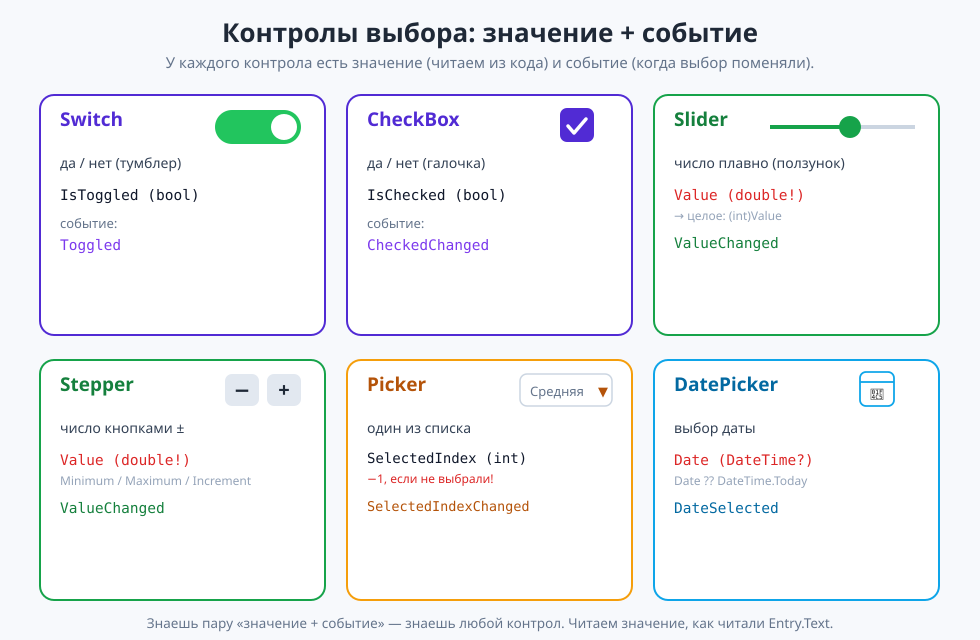

# Урок 5 (Блок 2). Контролы выбора + приложение «Собери пиццу» 🍕

**Блок 2 · Урок 5 | Когда не печатают, а выбирают: переключатели, ползунки, списки**

> 🎯 **Сегодня мы:**
> 1. познакомимся с **контролами выбора**: `Switch`, `CheckBox`, `Slider`, `Stepper`, `Picker`, `DatePicker`;
> 2. научимся **читать выбранное** из кода (`IsToggled`, `IsChecked`, `Value`, `SelectedIndex`, `Date`);
> 3. поймём новые события: `Toggled`, `ValueChanged`, `SelectedIndexChanged` — и сделаем «живые» подписи;
> 4. соберём приложение **«Собери пиццу»**, которое из выбранного считает цену заказа.
>
> ⏳ Добавляем контролы по одному и **сразу запускаем** — щёлкаем, двигаем, смотрим, что меняется.

---

## 🌉 Часть 0. Печатать — не всегда удобно

В прошлом уроке человек **печатал** текст в `Entry`. Но печатать удобно не всё! Представь: «включить уведомления», «выбрать размер», «поставить громкость», «указать дату». Тут печатать глупо — гораздо удобнее **выбрать**: щёлкнуть переключатель, подвинуть ползунок, ткнуть в список.

Для этого есть **контролы выбора** — готовые элементы, из которых человек выбирает мышкой или пальцем. Плюс: ошибиться почти невозможно (не введёшь «абв» вместо числа).

| Что нужно | Контрол |
|-----------|---------|
| да / нет (вкл-выкл) | **`Switch`** или **`CheckBox`** |
| число из диапазона плавно | **`Slider`** (ползунок) |
| число кнопками ± | **`Stepper`** |
| выбрать один из списка | **`Picker`** |
| выбрать дату | **`DatePicker`** |

> 💡 **Главная мысль урока:** у каждого контрола есть **свойство-значение** (что выбрано) и **событие-изменение** (когда выбор поменялся). Читаем значение — как читали `Entry.Text`.

✍️ **Мини-задание 0 (устно).** Каким контролом удобнее задать: громкость? включение Wi-Fi? день рождения? количество билетов?

---

## 🔘 Часть 1. Switch и CheckBox — «да / нет»

Оба отвечают на вопрос «да или нет», просто выглядят по-разному: `Switch` — тумблер, `CheckBox` — галочка.

```xml
<Switch x:Name="CheeseSwitch" />
<CheckBox x:Name="DeliveryCheck" />
```

Читаем выбор из кода — это `bool` (`true`/`false`):

```csharp
if (CheeseSwitch.IsToggled)   { /* тумблер включён */ }
if (DeliveryCheck.IsChecked)  { /* галочка стоит */ }
```

| Контрол | Свойство-значение | Событие |
|---------|-------------------|---------|
| `Switch` | `IsToggled` (bool) | `Toggled` |
| `CheckBox` | `IsChecked` (bool) | `CheckedChanged` |

> 📋 **`Switch` — свойства и события.**
> **Свойства:** `IsToggled` (bool), `OnColor` (цвет включённого), `ThumbColor` (цвет бегунка), `IsEnabled`.
> **События:** `Toggled` (`sender` = `Switch`, `e` = `ToggledEventArgs` → `e.Value`).

> 📋 **`CheckBox` — свойства и события.**
> **Свойства:** `IsChecked` (bool), `Color` (цвет галочки), `IsEnabled`.
> **События:** `CheckedChanged` (`e` = `CheckedChangedEventArgs` → `e.Value`).

> 💡 **Лайфхак:** у контрола обычно нет текста-подписи внутри. Ставь рядом `Label` (в `HorizontalStackLayout` из урока 2), чтобы человек понимал, за что отвечает переключатель.

```xml
<HorizontalStackLayout Spacing="10">
    <Label Text="Добавить сыр" VerticalOptions="Center" />
    <Switch x:Name="CheeseSwitch" />
</HorizontalStackLayout>
```

✍️ **Мини-задание 1.** Добавь `Switch` с подписью «Тёмная тема» и кнопку, которая по `IsToggled` пишет в метку «Тема: тёмная» или «Тема: светлая».

---

## 🎚 Часть 2. Slider — ползунок (число из диапазона)

**`Slider`** — плавный ползунок: тянешь — значение меняется от минимума до максимума.

```xml
<Slider x:Name="SpicySlider" Minimum="0" Maximum="10" />
```

- `Minimum` / `Maximum` — границы;
- значение — свойство **`Value`** (это `double`!).

Читаем:
```csharp
double v = SpicySlider.Value;      // например 6.37
int spicy = (int)SpicySlider.Value; // (int) отбросит дробную часть → 6
```

> 💡 **Важно:** `Value` — **дробное** (`double`). Если нужно целое (уровень остроты, громкость в процентах) — приводи `(int)`. Приведение `(int)` из блока 1: `(int)6.37` = `6`.

### Живая подпись: событие `ValueChanged`

Чтобы показывать значение прямо во время движения ползунка, ловим событие `ValueChanged`:

```xml
<Label x:Name="SpicyLabel" Text="Острота: 0/10" />
<Slider x:Name="SpicySlider" Minimum="0" Maximum="10" ValueChanged="OnSpicyChanged" />
```

```csharp
private void OnSpicyChanged(object? sender, ValueChangedEventArgs e)
{
    SpicyLabel.Text = $"Острота: {(int)e.NewValue}/10";   // e.NewValue — новое значение
}
```

- у обработчика особый параметр **`ValueChangedEventArgs e`**, в нём **`e.NewValue`** — новое значение ползунка (тоже `double`).

> 📋 **`Slider` — свойства и события.**
> **Свойства:** `Value` (**double**), `Minimum`, `Maximum` (double), `MinimumTrackColor`, `MaximumTrackColor`, `ThumbColor`.
> **События:** `ValueChanged` (`sender` = `Slider`, `e` = `ValueChangedEventArgs` → `e.NewValue`, `e.OldValue`); `DragStarted`, `DragCompleted`.

✍️ **Мини-задание 2.** Сделай ползунок громкости 0–100 и метку, которая на лету показывает «Громкость: N%».

---

## ➕ Часть 3. Stepper — число кнопками ±

**`Stepper`** — две кнопки «−» и «+»: удобно задать **точное целое** (количество товаров, порций).

```xml
<Stepper x:Name="QtyStepper" Minimum="1" Maximum="10" Increment="1" Value="1" />
```

- `Minimum` / `Maximum` — границы;
- `Increment` — на сколько меняется за нажатие (шаг);
- `Value` — текущее значение (снова **`double`**, приводим `(int)`).

Событие такое же, как у `Slider`, — **`ValueChanged`**:

```csharp
private void OnQtyChanged(object? sender, ValueChangedEventArgs e)
{
    QtyLabel.Text = $"Количество: {(int)e.NewValue}";
}
```

> 📋 **`Stepper` — свойства и события.**
> **Свойства:** `Value` (**double**), `Minimum`, `Maximum` (double), `Increment` (шаг), `IsEnabled`.
> **События:** `ValueChanged` (`e` = `ValueChangedEventArgs` → `e.NewValue`, `e.OldValue`).

> 💡 `Slider` и `Stepper` — «родственники»: у обоих `Value` (double) и событие `ValueChanged`. Разница только в виде: ползунок для «примерно», степпер для «ровно столько».

✍️ **Мини-задание 3.** Сделай `Stepper` числа гостей (1–20) и живую метку «Гостей: N».

---

## 📋 Часть 4. Picker — выбор из списка

**`Picker`** — выпадающий список: человек выбирает **один** вариант из нескольких.

```xml
<Picker x:Name="SizePicker" Title="Выбери размер">
    <Picker.Items>
        <x:String>Маленькая</x:String>
        <x:String>Средняя</x:String>
        <x:String>Большая</x:String>
    </Picker.Items>
</Picker>
```

- `Title` — подсказка, пока ничего не выбрано;
- варианты перечислены внутри `<Picker.Items>`.

Читаем выбор **двумя** способами:

```csharp
int index = SizePicker.SelectedIndex;      // номер выбранного: 0, 1, 2 (или -1, если не выбрали!)
object item = SizePicker.SelectedItem;      // сам текст: "Средняя"
```

> ⚠️ **Очень важно:** пока человек ничего не выбрал, `SelectedIndex` равен **−1**. Всегда проверяй это, прежде чем использовать выбор:

```csharp
if (SizePicker.SelectedIndex == -1)
{
    ResultLabel.Text = "Сначала выбери размер!";
    return;
}
```

> 💡 **Лайфхак — индекс как ключ к данным.** `SelectedIndex` (0, 1, 2…) удобно использовать как индекс массива (из блока 1!). Например, цены `int[] prices = {300, 450, 600};` — и `prices[SelectedIndex]` сразу даёт цену выбранного размера.

Событие выбора — **`SelectedIndexChanged`** (если нужно реагировать сразу на выбор).

> 📋 **`Picker` — свойства и события.**
> **Свойства:** `Title` (подсказка), `SelectedIndex` (int, **−1** если не выбрали), `SelectedItem` (object), `ItemsSource` (список из кода) / `<Picker.Items>` (в XAML), `TextColor`, `TitleColor`, `FontSize`.
> **События:** `SelectedIndexChanged` (`sender` = `Picker`, `e` = `EventArgs`).

✍️ **Мини-задание 4.** Сделай `Picker` с тремя городами и кнопку, которая пишет «Ты выбрал: ГОРОД». Не забудь проверку на −1.

---

## 📅 Часть 5. DatePicker — выбор даты

**`DatePicker`** — календарь для выбора даты.

```xml
<DatePicker x:Name="OrderDate" />
```

Читаем выбранную дату так (это знакомый **`DateTime`** из блока 1):

```csharp
DateTime d = OrderDate.Date ?? DateTime.Today;
ResultLabel.Text = $"Дата: {d:dd.MM.yyyy}";   // формат из блока 1
```

- **`?? DateTime.Today`** — «если дата не выбрана, взять сегодняшнюю». Это как `?? ""` для пустого поля в уроке 4: страховка на случай «нет значения».

> 💡 **Почему `??`?** В .NET 10 у `DatePicker` дата может быть «не выбрана» (тип `DateTime?` — «дата или ничего»). Оператор `??` даёт запасное значение. После этой строки `d` — обычный `DateTime` из блока 1, со всеми возможностями: `.Day`, `.Month`, `.DayOfWeek`, разница дат, формат `:dd.MM.yyyy`.

> 📋 **`DatePicker` — свойства и события.**
> **Свойства:** `Date` (**`DateTime?`** → бери `Date ?? DateTime.Today`), `MinimumDate`, `MaximumDate` (DateTime), `Format` (напр. `"dd.MM.yyyy"`), `TextColor`, `FontSize`.
> **События:** `DateSelected` (`sender` = `DatePicker`, `e` = `DateChangedEventArgs` → `e.NewDate`, `e.OldDate` — тоже `DateTime?`).

✍️ **Мини-задание 5.** Добавь `DatePicker` и кнопку, которая выводит выбранную дату в формате `dd.MM.yyyy` (не забудь `?? DateTime.Today`).

---

## 🍕 Часть 6. Собираем «Собери пиццу»

Соберём всё вместе: пусть человек выбирает пиццу контролами, а приложение считает цену. Форма длинная — оборачиваем в `ScrollView` (из урока 4).

### Шаг 1. Каркас и заголовок

```xml
<ContentPage ... BackgroundColor="#FFF7ED">
    <ScrollView>
        <VerticalStackLayout Padding="24" Spacing="14">

            <Label Text="🍕 Собери пиццу" FontSize="28" FontAttributes="Bold" HorizontalOptions="Center" />

            <!-- сюда: контролы, кнопка, итог -->

        </VerticalStackLayout>
    </ScrollView>
</ContentPage>
```

### Шаг 2. Размер (`Picker`) и количество (`Stepper`)

```xml
<Label Text="Размер:" FontSize="16" />
<Picker x:Name="SizePicker" Title="Выбери размер">
    <Picker.Items>
        <x:String>Маленькая</x:String>
        <x:String>Средняя</x:String>
        <x:String>Большая</x:String>
    </Picker.Items>
</Picker>

<Label x:Name="QtyLabel" Text="Количество: 1" FontSize="16" />
<Stepper x:Name="QtyStepper" Minimum="1" Maximum="10" Increment="1" Value="1"
         ValueChanged="OnQtyChanged" HorizontalOptions="Center" />
```

### Шаг 3. Сыр (`Switch`), острота (`Slider`), доставка (`CheckBox`)

```xml
<HorizontalStackLayout Spacing="10">
    <Label Text="Добавить сыр (+50)" FontSize="16" VerticalOptions="Center" />
    <Switch x:Name="CheeseSwitch" />
</HorizontalStackLayout>

<Label x:Name="SpicyLabel" Text="Острота: 0/10" FontSize="16" />
<Slider x:Name="SpicySlider" Minimum="0" Maximum="10" ValueChanged="OnSpicyChanged" />

<HorizontalStackLayout Spacing="10">
    <CheckBox x:Name="DeliveryCheck" />
    <Label Text="Доставка (+150)" FontSize="16" VerticalOptions="Center" />
</HorizontalStackLayout>
```

### Шаг 4. Дата, кнопка, итог

```xml
<Label Text="Дата заказа:" FontSize="16" />
<DatePicker x:Name="OrderDate" />

<Button Text="Оформить заказ" Clicked="OnOrder" />
<Label x:Name="ResultLabel" FontSize="18" />
```

> ✅ **Весь `MainPage.xaml` целиком** — в [материалы/MainPage.xaml](материалы/MainPage.xaml).

### Шаг 5. Живые подписи (C#)

```csharp
private void OnQtyChanged(object? sender, ValueChangedEventArgs e)
{
    QtyLabel.Text = $"Количество: {(int)e.NewValue}";
}

private void OnSpicyChanged(object? sender, ValueChangedEventArgs e)
{
    SpicyLabel.Text = $"Острота: {(int)e.NewValue}/10";
}
```

### Шаг 6. Считаем заказ по кнопке

```csharp
private void OnOrder(object? sender, EventArgs e)
{
    if (SizePicker.SelectedIndex == -1)                 // размер не выбран
    {
        ResultLabel.Text = "Сначала выбери размер пиццы!";
        return;
    }

    int[] prices = { 300, 450, 600 };                   // цены по индексу размера
    int basePrice = prices[SizePicker.SelectedIndex];   // индекс как ключ (из блока 1!)
    int qty = (int)QtyStepper.Value;
    int total = basePrice * qty;

    if (CheeseSwitch.IsToggled) total += 50 * qty;      // сыр к каждой пицце
    if (DeliveryCheck.IsChecked) total += 150;          // доставка один раз

    int spicy = (int)SpicySlider.Value;
    DateTime date = OrderDate.Date ?? DateTime.Today;   // дата (или сегодня, если не выбрали)
    ResultLabel.Text = $"{SizePicker.SelectedItem} ×{qty}, острота {spicy}/10\n"
                     + $"Дата: {date:dd.MM.yyyy}\n"
                     + $"Итого: {total} ₽";
}
```

Разбор:
1. проверяем, что размер выбран (`SelectedIndex != -1`);
2. по индексу берём базовую цену из массива, умножаем на количество;
3. прибавляем сыр (`Switch`) и доставку (`CheckBox`) по условиям;
4. собираем итог со всеми выбранными параметрами и датой.

> ✅ **Весь `MainPage.xaml.cs` целиком** — в [материалы/MainPage.xaml.cs](материалы/MainPage.xaml.cs).

**Должно получиться:** выбрал «Средняя», ×2, сыр включён, доставка — галочка → «Средняя ×2 … Итого: 1150 ₽». А если забыл размер — вежливая просьба выбрать. 🎉

✍️ **Мини-задание 6.** Собери приложение и проверь: разные размеры/количества, сыр вкл/выкл, доставка, дата; и случай «не выбрал размер».

---

## 🧠 Как всё связано (соберём картинку)

```
Контрол выбора      значение (читаем)     событие (когда поменяли)
──────────────      ─────────────────     ────────────────────────
Switch              IsToggled  (bool)      Toggled
CheckBox            IsChecked  (bool)      CheckedChanged
Slider              Value      (double)    ValueChanged
Stepper             Value      (double)    ValueChanged
Picker              SelectedIndex / SelectedItem   SelectedIndexChanged
DatePicker          Date       (DateTime?) DateSelected
```



Каждый контрол = **значение + событие**. Читаем значение (как `Entry.Text`), а событие помогает реагировать «на лету».

---

## 🎯 Итоги урока

- **Контролы выбора** — человек выбирает мышью/пальцем, а не печатает (ошибиться сложнее).
- **`Switch`/`CheckBox`** — да/нет (`IsToggled`/`IsChecked`, `bool`).
- **`Slider`/`Stepper`** — число (`Value`, **`double`** → приводим `(int)`); событие `ValueChanged` (`e.NewValue`).
- **`Picker`** — один из списка (`SelectedIndex` — **−1 если не выбрали!**, `SelectedItem`); индекс удобен как ключ к массиву.
- **`DatePicker`** — дата (`Date` — тип `DateTime?`; берём `Date ?? DateTime.Today`, дальше это обычный `DateTime` из блока 1).
- У каждого контрола: **свойство-значение** + **событие-изменение**.

➡️ Дальше — [практика.md](практика.md) (30 заданий на контролы), затем [викторина.html](викторина.html).
🆘 Пропустил или собираешь дома — [самоучитель.md](самоучитель.md) (пицца с нуля по шагам).
🧰 Что-то «поехало» — [лайфхак.md](лайфхак.md). Быстро вспомнить — [итого.md](итого.md).

> **В следующем уроке** займёмся **оформлением** (`Style`, цвета, шрифты, `Border`): научимся делать приложение красивым и единообразным без повторения свойств у каждого элемента.
