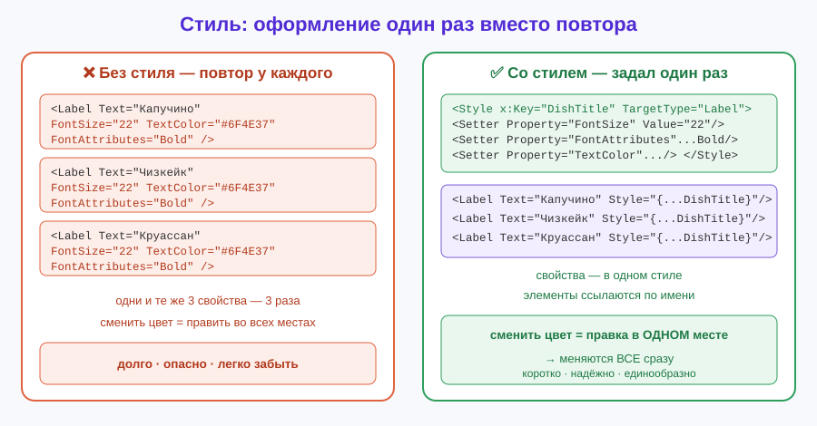
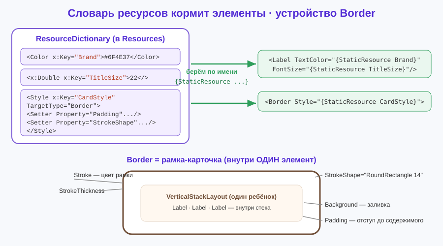

# Урок 6 (Блок 2). Стили и ресурсы + приложение «Меню кафе» ☕

**Блок 2 · Урок 6 | Красиво и единообразно: задаём оформление один раз**

> 🎯 **Сегодня мы:**
> 1. поймём, что такое **ресурс** и `ResourceDictionary`, и вынесем цвета/шрифты в одно место (`StaticResource`);
> 2. научимся делать **стиль** (`Style` + `Setter`) — набор свойств, который применяется сразу ко многим элементам;
> 3. разберём **неявный стиль** (без ключа) — «оформить все `Label` разом»;
> 4. познакомимся с **`Border`** — рамкой-карточкой, и с **`Image`** — картинкой;
> 5. соберём приложение **«Меню кафе»** из одинаково оформленных карточек — задав стиль **один раз**.
>
> ⏳ Главная идея урока: **не повторять свойства у каждого элемента, а описать оформление один раз** и переиспользовать.

---

## 🌉 Часть 0. Боль повторения

Вспомни уроки 1–5: у каждого `Label` мы отдельно писали `FontSize="18"`, `TextColor="..."`, `FontAttributes="Bold"`. Один-два элемента — не страшно. Но представь **меню кафе на 10 блюд**: 10 заголовков, и у каждого одни и те же три свойства. Это:

- **долго** — копируешь одно и то же;
- **опасно** — захотел поменять цвет фирменного стиля → правишь в 10 местах, где-то забыл;
- **некрасиво в коде** — глаза разбегаются от повторов.

> 💡 **Мостик из программирования.** Помнишь из блока 1: не повторять код, а вынести в **метод** и вызывать? Здесь та же мысль, но для **оформления**: вынести набор свойств в **стиль** и применять по имени. «Не повторяйся» — золотое правило и в логике, и в дизайне.

Решение MAUI — **ресурсы** и **стили**. Задал цвет/шрифт/набор свойств **один раз** — используешь везде. Поменял в одном месте — изменилось во всём приложении. Именно этим и займёмся.



✍️ **Мини-задание 0 (устно).** В приложении 8 кнопок, у всех `FontSize="20"` и скруглённые углы. Дизайнер попросил сделать шрифт 22. Сколько мест придётся править «в лоб»? А если бы был один стиль?

---

## 🎨 Часть 1. Ресурсы: цвет и размер в одном месте

**Ресурс** — это значение (цвет, число, шрифт, стиль), у которого есть **имя** (`x:Key`). Ты объявляешь его один раз в **`ResourceDictionary`** («словарь ресурсов»), а потом ссылаешься по имени через **`{StaticResource Имя}`**.

Словарь ресурсов страницы живёт в `<ContentPage.Resources>`:

```xml
<ContentPage.Resources>
    <ResourceDictionary>
        <Color x:Key="Brand">#6F4E37</Color>       <!-- кофейно-коричневый -->
        <Color x:Key="PageBg">#FFF8F0</Color>       <!-- цвет фона -->
        <x:Double x:Key="TitleSize">22</x:Double>   <!-- размер заголовка -->
    </ResourceDictionary>
</ContentPage.Resources>
```

- `<Color x:Key="Brand">#6F4E37</Color>` — цвет с именем `Brand`. Цвет пишем в HEX (как в CSS/уроке 1: `#RRGGBB`).
- `<x:Double x:Key="TitleSize">22</x:Double>` — число `double` с именем `TitleSize`. (`x:Double` — «это число типа double»; для строки был бы `x:String`.)

Теперь **ссылаемся** на ресурс в любом элементе:

```xml
<Label Text="Кафе «Уют»"
       TextColor="{StaticResource Brand}"
       FontSize="{StaticResource TitleSize}" />
```

`{StaticResource Brand}` = «подставь сюда значение ресурса с именем `Brand`». Захотел сменить фирменный цвет — правишь **одну** строчку в словаре, и все `Brand`-элементы перекрашиваются.

> 💡 **Лайфхак — палитра в одном месте.** Заведи ресурсы `Brand`, `PageBg`, `TextMain`, `Accent` в начале — и всё приложение говорит на одном «языке цветов». Это и есть основа фирменного стиля (как в настоящих приложениях).

> 📋 **`ResourceDictionary` — что важно.**
> - **Где живёт:** `<ContentPage.Resources>` (ресурсы одной страницы) или `App.xaml` (ресурсы всего приложения — см. Часть 6).
> - **Что кладём:** `<Color x:Key="...">`, `<x:Double x:Key="...">`, `<x:String x:Key="...">`, `<Style x:Key="...">`.
> - **Как берём:** `Свойство="{StaticResource Имя}"`.
> - **Правило:** у каждого ресурса — уникальное имя `x:Key` (кроме неявных стилей — см. Часть 3).

✍️ **Мини-задание 1.** Заведи в ресурсах страницы два цвета (`Brand` и `PageBg`) и число `BodySize=15`. Покрась фон страницы в `{StaticResource PageBg}`, а метку — в `{StaticResource Brand}` с размером `{StaticResource BodySize}`.

---

## 🧩 Часть 2. Style — набор свойств с именем

Отдельные цвета — хорошо, но обычно у элемента их **несколько сразу**: и цвет, и размер, и жирность. **`Style`** — это готовый **набор свойств** под именем. Внутри — список **`Setter`** («установщик»): каждый задаёт одно свойство.

```xml
<Style x:Key="DishTitle" TargetType="Label">
    <Setter Property="FontSize" Value="22" />
    <Setter Property="FontAttributes" Value="Bold" />
    <Setter Property="TextColor" Value="{StaticResource Brand}" />
</Style>
```

Разберём по частям:
- `x:Key="DishTitle"` — имя стиля (по нему будем ссылаться);
- `TargetType="Label"` — **для какого типа** элементов стиль (обязательно!);
- каждый `<Setter Property="..." Value="..." />` — «задай свойству такое значение». В `Value` можно подставлять ресурсы (`{StaticResource Brand}`).

Применяем стиль через свойство **`Style`**:

```xml
<Label Text="Капучино" Style="{StaticResource DishTitle}" />
<Label Text="Чизкейк"  Style="{StaticResource DishTitle}" />
```

Обе метки мгновенно получили жирный кофейный шрифт 22 — а мы написали набор свойств **один раз**. Захотел заголовки крупнее — меняешь `FontSize` в стиле, обновляются **все**.

> 💡 **Стиль ≠ элемент.** Стиль сам ничего не рисует — это «рецепт оформления». Рисует элемент (`Label`, `Button`, `Border`), а стиль лишь говорит, как он выглядит.

Ещё пример — стиль для цены:

```xml
<Style x:Key="PriceTag" TargetType="Label">
    <Setter Property="TextColor" Value="#B5651D" />
    <Setter Property="FontAttributes" Value="Bold" />
</Style>
```
```xml
<Label Text="180 ₽" Style="{StaticResource PriceTag}" />
```

✍️ **Мини-задание 2.** Сделай стиль `x:Key="Warning"` для `Label`: красный жирный текст размера 16. Примени его к двум разным меткам.

---

## 🪄 Часть 3. Неявный стиль — «оформить всех разом»

А что, если оформить **все** элементы одного типа, не приписывая `Style=` каждому? Для этого у стиля **убирают `x:Key`**. Такой стиль называется **неявным** — он применяется автоматически ко всем элементам этого `TargetType` в области видимости.

```xml
<Style TargetType="Label">        <!-- нет x:Key! -->
    <Setter Property="TextColor" Value="#3A2A1A" />
    <Setter Property="FontSize" Value="15" />
</Style>
```

Теперь **каждый** `Label` на странице по умолчанию тёмно-коричневый, размер 15 — без единого `Style=`. Это ровно то, чего мы хотели в Части 0: задать оформление один раз для всех.

```xml
<Label Text="Обычный текст" />          <!-- уже оформлен неявным стилем -->
<Label Text="И этот тоже" />            <!-- и этот -->
```

> 💡 **Как это сочетается с явным стилем и своими свойствами.** Работает «правило ближайшего»:
> 1. неявный стиль — «база» для всех;
> 2. явный `Style="{StaticResource ...}"` — перекрывает базу для конкретного элемента;
> 3. свойство прямо на элементе (`FontSize="30"`) — перекрывает и стиль.
>
> То есть чем «ближе» задано свойство, тем оно главнее. Удобно: общий вид — неявным стилем, исключения — точечно.

> ⚠️ **Осторожно с неявным стилем.** Он цепляет **все** элементы типа. Если вдруг какая-то метка выглядит «не так» — проверь, нет ли неявного стиля, который её задел. Для «особенных» элементов делай **явный** стиль с `x:Key`.

✍️ **Мини-задание 3.** Сделай неявный стиль для `Button`: скруглять углы (`CornerRadius="10"`) и фон `{StaticResource Brand}`. Проверь, что **все** кнопки страницы стали одинаковыми без `Style=`.

---

## 🖼 Часть 4. Border — рамка-карточка

Чтобы блюда в меню выглядели как **карточки** (белый прямоугольник со скруглёнными углами и тонкой рамкой), используем **`Border`**. Это контейнер: кладёшь внутрь один элемент (обычно стек), а `Border` рисует вокруг рамку и фон.

```xml
<Border Stroke="#E5D5C5" StrokeThickness="1" Background="#FFFFFF" Padding="16"
        StrokeShape="RoundRectangle 14">
    <VerticalStackLayout Spacing="4">
        <Label Text="Капучино" Style="{StaticResource DishTitle}" />
        <Label Text="Нежная молочная пенка на эспрессо." />
        <Label Text="180 ₽" Style="{StaticResource PriceTag}" />
    </VerticalStackLayout>
</Border>
```

- `Stroke` — цвет рамки (обводки);
- `StrokeThickness` — толщина рамки;
- `Background` — цвет заливки внутри;
- `Padding` — отступ от рамки до содержимого (как в стеках, урок 2);
- `StrokeShape="RoundRectangle 14"` — форма: прямоугольник со скруглением 14 (чем больше число, тем круглее углы).



И вот тут ресурсы играют в полную силу: вынесем оформление карточки в **стиль** `Border` — и все карточки меню станут одинаковыми одной строкой:

```xml
<Style x:Key="CardStyle" TargetType="Border">
    <Setter Property="Stroke" Value="#E5D5C5" />
    <Setter Property="StrokeThickness" Value="1" />
    <Setter Property="Background" Value="#FFFFFF" />
    <Setter Property="Padding" Value="16" />
    <Setter Property="StrokeShape" Value="RoundRectangle 14" />
</Style>
```
```xml
<Border Style="{StaticResource CardStyle}"> ... </Border>
<Border Style="{StaticResource CardStyle}"> ... </Border>
```

> 📋 **`Border` — свойства и события.**
> **Свойства:** `Stroke` — цвет рамки (`Colors.*`/HEX) · `StrokeThickness` (double) — толщина · `Background` — заливка · `StrokeShape` — форма (`RoundRectangle 14`, `Rectangle`, `Ellipse`) · `Padding` — отступ до содержимого · `StrokeDashArray` — пунктир · стандартные `WidthRequest`/`HeightRequest`/`HorizontalOptions`.
> **Содержимое:** ровно **один** дочерний элемент (обычно стек/`Grid` — а внутри уже много).
> **События:** своих особых нет; можно навесить жест нажатия (позже). Оформление — через свойства/`Style`.

> 💡 **`Border` vs `Frame`.** Раньше в MAUI карточки делали через **`Frame`** (`CornerRadius`, `HasShadow`). Он ещё работает, но команда MAUI рекомендует **`Border`** — он гибче (любая форма через `StrokeShape`). В нашем курсе используем **`Border`**; если встретишь `Frame` в чужом коде — знай, что это «старший брат» той же идеи.

✍️ **Мини-задание 4.** Оберни любую метку в `Border` со скруглением 20, серой рамкой и отступом 12. Затем вынеси это оформление в стиль `CardStyle` и примени к двум `Border`.

---

## 📷 Часть 5. Image — картинка

**`Image`** показывает картинку: логотип, фото блюда, иконку.

```xml
<Image Source="dotnet_bot.png" HeightRequest="90" Aspect="AspectFit" />
```

- `Source` — **имя файла картинки**;
- `HeightRequest`/`WidthRequest` — желаемый размер;
- `Aspect` — как вписывать: `AspectFit` (целиком, сохраняя пропорции), `AspectFill` (заполнить, обрезав), `Fill` (растянуть).

**Куда класть файл картинки?** В папку **`Resources/Images`** проекта. MAUI сам подхватит её при сборке, и в `Source` пишем **только имя файла** (без папки): `Source="logo.png"`.

> ⚠️ **Тонкости имени файла (частая ошибка).** Имя картинки должно быть **маленькими латинскими буквами, цифрами и `_`** — например `coffee_logo.png`. Никаких пробелов, дефисов и русских букв в имени файла, иначе MAUI её не соберёт.

> 💡 **Нет своей картинки?** В любом новом MAUI-проекте уже лежит `dotnet_bot.png` (робот-маскот .NET) — можно временно показать его. А для простых значков часто хватает **эмодзи в `Label`** (`Text="☕"` с большим `FontSize`) — картинка не нужна вовсе.

> 📋 **`Image` — свойства и события.**
> **Свойства:** `Source` — имя файла из `Resources/Images` (или URL) · `Aspect` — `AspectFit`/`AspectFill`/`Fill` · `HeightRequest`/`WidthRequest` · `IsAnimationPlaying` (для gif) · `Opacity`.
> **События:** особых событий выбора нет; клик добавляют жестом (позже).

✍️ **Мини-задание 5.** Добавь `Image` с `dotnet_bot.png` высотой 120 и `Aspect="AspectFit"`. Затем попробуй `AspectFill` — заметь разницу.

---

## 🌍 Часть 6. Ресурсы всего приложения (App.xaml) + тема

Пока стили жили в `<ContentPage.Resources>` — они видны **только на этой странице**. Но фирменные цвета и шрифты нужны **на всех** страницах. Их место — файл **`App.xaml`**, в общем `ResourceDictionary` приложения. Синтаксис **точно такой же**, просто оформляем не страницу, а всё приложение:

```xml
<!-- App.xaml -->
<Application.Resources>
    <ResourceDictionary>
        <ResourceDictionary.MergedDictionaries>
            <ResourceDictionary Source="Resources/Styles/Colors.xaml" />
            <ResourceDictionary Source="Resources/Styles/Styles.xaml" />
        </ResourceDictionary.MergedDictionaries>

        <!-- наши глобальные ресурсы -->
        <Color x:Key="Brand">#6F4E37</Color>
        <Style TargetType="Label">
            <Setter Property="TextColor" Value="#3A2A1A" />
        </Style>
    </ResourceDictionary>
</Application.Resources>
```

Теперь `{StaticResource Brand}` и неявный стиль `Label` работают **на любой странице** приложения. Это и есть **единая тема**: описал оформление в `App.xaml` — и всё приложение выглядит цельно.

> 💡 **Что за `MergedDictionaries`?** Шаблон MAUI уже кладёт туда заготовки `Colors.xaml`/`Styles.xaml`. `MergedDictionaries` — «подключить чужие словари ресурсов к нашему». Свои ресурсы дописываем рядом, ниже.

### Светлая и тёмная тема одной строкой (бонус)

Телефон может быть в светлой или тёмной теме. **`AppThemeBinding`** подставляет **разные значения** для светлой и тёмной темы автоматически:

```xml
<Label Text="Меню"
       TextColor="{AppThemeBinding Light=#3A2A1A, Dark=#FFF8F0}" />
```

В светлой теме текст тёмный, в тёмной — светлый. Ничего в коде переключать не нужно — MAUI сам следит за темой системы.

✍️ **Мини-задание 6.** Перенеси цвет `Brand` и неявный стиль `Label` из страницы в `App.xaml`. Убедись, что страница выглядит так же (ресурсы теперь глобальные).

---

## ☕ Часть 7. Собираем «Меню кафе»

Соберём меню из одинаковых карточек. Логики почти нет — сегодня главное **оформление**: покажем, как стиль экономит труд. Немного C# оставим для связи с прошлым (кнопка + `Stepper` из урока 5).

### Шаг 1. Ресурсы страницы (цвета, шрифты, стили)

```xml
<ContentPage.Resources>
    <ResourceDictionary>
        <Color x:Key="Brand">#6F4E37</Color>
        <Color x:Key="PageBg">#FFF8F0</Color>
        <Color x:Key="PriceColor">#B5651D</Color>
        <x:Double x:Key="TitleSize">22</x:Double>

        <!-- неявный: все Label -->
        <Style TargetType="Label">
            <Setter Property="TextColor" Value="#3A2A1A" />
            <Setter Property="FontSize" Value="15" />
        </Style>

        <!-- карточка -->
        <Style x:Key="CardStyle" TargetType="Border">
            <Setter Property="Background" Value="#FFFFFF" />
            <Setter Property="Stroke" Value="#E5D5C5" />
            <Setter Property="StrokeThickness" Value="1" />
            <Setter Property="Padding" Value="16" />
            <Setter Property="StrokeShape" Value="RoundRectangle 14" />
        </Style>

        <!-- заголовок блюда -->
        <Style x:Key="DishTitle" TargetType="Label">
            <Setter Property="FontSize" Value="{StaticResource TitleSize}" />
            <Setter Property="FontAttributes" Value="Bold" />
            <Setter Property="TextColor" Value="{StaticResource Brand}" />
        </Style>

        <!-- цена -->
        <Style x:Key="PriceTag" TargetType="Label">
            <Setter Property="TextColor" Value="{StaticResource PriceColor}" />
            <Setter Property="FontAttributes" Value="Bold" />
        </Style>
    </ResourceDictionary>
</ContentPage.Resources>
```

### Шаг 2. Каркас: фон из ресурса + прокрутка + логотип

```xml
<ContentPage ... BackgroundColor="{StaticResource PageBg}">
    <ScrollView>
        <VerticalStackLayout Padding="20" Spacing="16">

            <Image Source="dotnet_bot.png" HeightRequest="90" />
            <Label Text="☕ Кафе «Уют»" Style="{StaticResource DishTitle}"
                   HorizontalOptions="Center" />

            <!-- сюда карточки -->

        </VerticalStackLayout>
    </ScrollView>
</ContentPage>
```

### Шаг 3. Карточки блюд (все — одним стилем!)

```xml
<Border Style="{StaticResource CardStyle}">
    <VerticalStackLayout Spacing="4">
        <Label Text="Капучино" Style="{StaticResource DishTitle}" />
        <Label Text="Нежная молочная пенка на эспрессо." />
        <Label Text="180 ₽" Style="{StaticResource PriceTag}" />
    </VerticalStackLayout>
</Border>

<Border Style="{StaticResource CardStyle}">
    <VerticalStackLayout Spacing="4">
        <Label Text="Чизкейк" Style="{StaticResource DishTitle}" />
        <Label Text="Классический десерт из сливочного сыра." />
        <Label Text="250 ₽" Style="{StaticResource PriceTag}" />
    </VerticalStackLayout>
</Border>

<Border Style="{StaticResource CardStyle}">
    <VerticalStackLayout Spacing="4">
        <Label Text="Круассан" Style="{StaticResource DishTitle}" />
        <Label Text="Хрустящий, с шоколадной начинкой." />
        <Label Text="120 ₽" Style="{StaticResource PriceTag}" />
    </VerticalStackLayout>
</Border>
```

Посмотри: **три карточки, ни одного повтора свойств** — только `Style="{StaticResource CardStyle}"`. В этом вся сила урока.

### Шаг 4. Номер стола и вызов официанта (немного C#)

```xml
<Label x:Name="TableLabel" Text="Стол: 1" />
<Stepper x:Name="TableStepper" Minimum="1" Maximum="20" Increment="1" Value="1"
         ValueChanged="OnTableChanged" HorizontalOptions="Center" />
<Button Text="Позвать официанта" Clicked="OnCall" />
<Label x:Name="ResultLabel" Style="{StaticResource PriceTag}" HorizontalOptions="Center" />
```

> ✅ **Весь `MainPage.xaml` целиком** — в [материалы/MainPage.xaml](материалы/MainPage.xaml).

### Шаг 5. Код (повтор урока 5 — `Stepper` + событие)

```csharp
private void OnTableChanged(object? sender, ValueChangedEventArgs e)
{
    TableLabel.Text = $"Стол: {(int)e.NewValue}";      // Value — double, приводим (int)
}

private void OnCall(object? sender, EventArgs e)
{
    int table = (int)TableStepper.Value;
    ResultLabel.Text = $"Официант идёт к столу №{table}";
}
```

> ✅ **Весь `MainPage.xaml.cs` целиком** — в [материалы/MainPage.xaml.cs](материалы/MainPage.xaml.cs).

**Должно получиться:** аккуратное меню — логотип, заголовок, три одинаково оформленные карточки с блюдами и ценами; крутится ползунком номер стола, кнопка «Позвать официанта» пишет «Официант идёт к столу №N». А главное — попробуй поменять `Brand` или `CardStyle` **в одном месте** и увидишь, как меняется всё меню сразу. 🎉

✍️ **Мини-задание 7.** Добавь четвёртую карточку (своё блюдо и цену) — заметь, что писать оформление НЕ нужно, только текст и стиль. Потом смени `Brand` на другой цвет и посмотри, как перекрасились все заголовки.

---

## 🔧 Установка и запуск

<details>
<summary><b>💻 Visual Studio (Windows) — основной путь</b></summary>

1. Открой свой MAUI-проект (или создай новый: **Create a new project → .NET MAUI App**).
2. Открой `MainPage.xaml`, замени содержимое на код из [материалы/MainPage.xaml](материалы/MainPage.xaml).
3. Открой `MainPage.xaml.cs`, замени на [материалы/MainPage.xaml.cs](материалы/MainPage.xaml.cs).
4. Картинку `dotnet_bot.png` менять не нужно — она уже лежит в `Resources/Images`. (Свою картинку клади туда же, имя — латиницей.)
5. Вверху выбери **Windows Machine** и нажми ▶ (F5).

</details>

<details>
<summary><b>🍎 На Mac в VS Code</b></summary>

1. В терминале в папке проекта проверь workload: `dotnet workload install maui` (один раз).
2. Замени `MainPage.xaml` и `MainPage.xaml.cs` содержимым из папки `материалы/`.
3. Запусти: `dotnet build -t:Run -f net10.0-maccatalyst`.
4. Свою картинку клади в `Resources/Images`, в `Source` пиши только имя файла (латиницей).

</details>

> 💡 Если хочешь глобальную тему — перенеси цвета и неявный стиль `Label` в `App.xaml` (Часть 6). Пример — в [материалы/App.xaml](материалы/App.xaml).

---

## 🧠 Как всё связано

```
ResourceDictionary  ── хранит именованные ресурсы
   ├─ <Color x:Key="Brand">        цвет
   ├─ <x:Double x:Key="TitleSize"> число
   └─ <Style x:Key="CardStyle">    набор свойств (Setter'ы)
                                        │
элемент  ──  Style="{StaticResource CardStyle}"  ──►  берёт оформление по имени
элемент  ──  TextColor="{StaticResource Brand}"  ──►  берёт цвет по имени

неявный <Style TargetType="Label"> (без x:Key)  ──►  сам цепляет ВСЕ Label
App.xaml  ──►  те же ресурсы, но видны на ВСЕХ страницах (единая тема)
```

Идея одна: **оформление описано в одном месте → используется много раз → меняется один раз**.

---

## 🎯 Итоги урока

- **Ресурс** — именованное значение (`x:Key`) в `ResourceDictionary`; берём через `{StaticResource Имя}`.
- **`Style`** = набор `Setter`'ов (`Property`/`Value`) с `TargetType`; применяем через `Style="{StaticResource ...}"`.
- **Неявный стиль** (без `x:Key`) — сам оформляет все элементы своего `TargetType`.
- Приоритет: **свойство на элементе** > **явный стиль** > **неявный стиль**.
- **`Border`** — рамка-карточка (`Stroke`, `StrokeThickness`, `Background`, `Padding`, `StrokeShape`); вместо старого `Frame`.
- **`Image`** — картинка (`Source` из `Resources/Images`, `Aspect`); имя файла — латиницей.
- **`App.xaml`** — ресурсы всего приложения (единая тема); `AppThemeBinding` — свет/тьма одной строкой.

➡️ Дальше — [практика.md](практика.md) (30 заданий на стили и оформление), затем [викторина.html](викторина.html).
🆘 Пропустил или собираешь дома — [самоучитель.md](самоучитель.md) (меню кафе с нуля по шагам).
🧰 Что-то «поехало» — [лайфхак.md](лайфхак.md). Быстро вспомнить — [итого.md](итого.md).

> **В следующем уроке** займёмся **логикой глубже**: `sender`, всплывающие окна `DisplayAlert`, включение/выключение элементов — приложение начнёт «разговаривать» с человеком.
