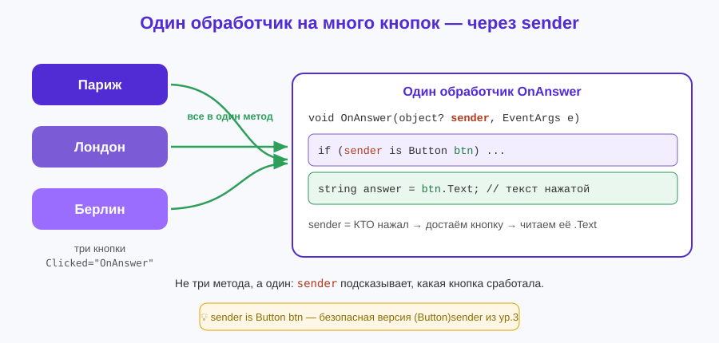
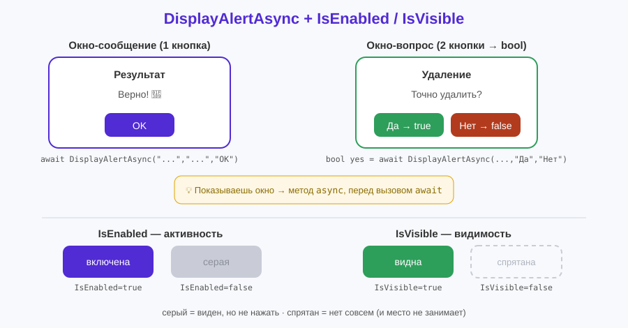

# Урок 7 (Блок 2). События и логика глубже + приложение «Викторина» 🎯

**Блок 2 · Урок 7 | Приложение начинает «разговаривать»: реагирует, спрашивает, подтверждает**

> 🎯 **Сегодня мы:**
> 1. разберёмся глубже с **событиями** и параметром **`sender`** — один обработчик на много кнопок;
> 2. научимся показывать **всплывающие окна** `DisplayAlertAsync` (сообщение и вопрос «Да/Нет»);
> 3. познакомимся с **`async`/`await`** — как «подождать» ответ человека;
> 4. будем **включать/выключать** и **показывать/прятать** элементы (`IsEnabled`, `IsVisible`);
> 5. соберём **«Викторину»**, которая реагирует на ответы, хвалит/поправляет и умеет начаться заново.
>
> ⏳ До этого урока приложение «молчало» — просто меняло текст. Теперь оно будет **общаться** с человеком.

---

## 🌉 Часть 0. От «меняем текст» к «общаемся»

В прошлых уроках нажатие кнопки просто меняло что-то на экране: счётчик, метку, цвет. Но настоящие приложения умеют больше:

- **по-разному реагировать** на разные кнопки (одна логика — много кнопок);
- **выскакивать окошком** с сообщением или вопросом («Точно удалить?»);
- **включать и выключать** элементы (пока не ввёл имя — кнопка серая);
- **показывать и прятать** части экрана.

Всё это — **логика на событиях**. Сегодня приложение перестанет «молчать».

✍️ **Мини-задание 0 (устно).** Вспомни любое приложение на телефоне. Где оно спрашивало «Вы уверены?»? Где кнопка была серой (нельзя нажать), пока ты что-то не сделал?

---

## ⚡ Часть 1. Событие и обработчик — повторим и углубим

Вспомним урок 1: у кнопки есть **событие** `Clicked`, а к нему привязан **обработчик** — метод, который вызывается при нажатии.

```xml
<Button Text="Нажми" Clicked="OnClick" />
```
```csharp
private void OnClick(object? sender, EventArgs e)
{
    // код, который выполнится при нажатии
}
```

У обработчика **всегда два параметра** — и это не случайно:

- **`object? sender`** — **кто** вызвал событие (какой именно элемент нажали);
- **`EventArgs e`** — **подробности** события (у разных событий разные; вспомни `TextChangedEventArgs e` с `e.NewTextValue` из урока 4 или `ValueChangedEventArgs e` с `e.NewValue` из урока 5).

> 💡 Раньше `sender` мы почти не использовали. Сегодня он станет главным героем: именно он позволяет **одним обработчиком** обслужить **много кнопок**.

---

## 🎛 Часть 2. sender — один обработчик на много кнопок

Представь викторину с тремя кнопками-ответами. Можно написать три отдельных обработчика… а можно **один** — и внутри узнать, **какую** кнопку нажали, через `sender`.

```xml
<Button Text="Париж" Clicked="OnAnswer" />
<Button Text="Лондон" Clicked="OnAnswer" />
<Button Text="Берлин" Clicked="OnAnswer" />
```

Все три ведут в один метод `OnAnswer`. А кто именно нажат — подскажет `sender`:

```csharp
private void OnAnswer(object? sender, EventArgs e)
{
    if (sender is not Button btn) return;   // sender — это кнопка? кладём её в btn
    string answer = btn.Text;               // текст нажатой кнопки: "Париж" / "Лондон" / "Берлин"
    // ...дальше проверяем ответ
}
```

Разберём новую строку `if (sender is not Button btn) return;`:
- `sender is Button btn` — «если `sender` — это `Button`, положи его в переменную `btn`»;
- мы пишем через `is not ... return` — «если это **не** кнопка, просто выходим» (страховка);
- после этой строки `btn` — полноценная кнопка, у неё есть `.Text`, `.BackgroundColor` и т.д.

> 💡 **Мостик к уроку 3.** Там мы приводили тип жёстко: `(Button)sender`. Запись `sender is Button btn` — **безопасная версия** того же: она и проверяет тип, и сразу даёт переменную. Обе про одно: «получить из `sender` конкретную кнопку».

> 📋 **`sender` — как использовать.**
> - **Что это:** первый параметр любого обработчика (`object? sender`) — элемент, вызвавший событие.
> - **Зачем:** один обработчик на много элементов; внутри узнаём, какой сработал.
> - **Как достать элемент:** `if (sender is Button btn) { ... }` (безопасно) или `(Button)sender` (жёстко, из ур.3).
> - **Что читаем:** любые свойства этого элемента — `btn.Text`, `btn.BackgroundColor`, и т.д.



✍️ **Мини-задание 1.** Сделай три кнопки «Красный/Зелёный/Синий» с одним обработчиком. По `sender` узнай текст нажатой и запиши его в метку «Выбран цвет: …».

---

## 💬 Часть 3. DisplayAlertAsync — всплывающее окно с сообщением

**`DisplayAlertAsync`** показывает **всплывающее окно** поверх приложения — с заголовком, текстом и кнопкой. Идеально для «Готово!», «Ошибка», «Верно!».

```csharp
await DisplayAlertAsync("Результат", "Верно! 🎉", "OK");
```

- 1-й аргумент — **заголовок** окна;
- 2-й — **сообщение**;
- 3-й — надпись на **кнопке** закрытия.

### Новое: `async` и `await`

Окно **ждёт**, пока человек нажмёт «OK». Чтобы приложение умело «подождать», нужны два новых слова:

- **`await`** ставим **перед** `DisplayAlertAsync` — «подожди здесь, пока окно закроют»;
- **`async`** добавляем в **заголовок обработчика** — «этот метод умеет ждать».

```csharp
private async void OnAnswer(object? sender, EventArgs e)   // ← async
{
    await DisplayAlertAsync("Привет", "Ты нажал кнопку!", "OK");   // ← await
}
```

> 💡 **Просто про `async`/`await`.** `async` = «внутри этого метода будет ожидание». `await` = «дождись результата этой строки, потом иди дальше». Без `await` окно тоже покажется, но код помчится дальше, не дожидаясь ответа — а нам обычно нужно дождаться. Пока достаточно правила: **показываешь окно → метод `async`, перед окном `await`.**

> ⚠️ **Важно (.NET 10):** метод называется именно **`DisplayAlertAsync`** (со словом `Async`). Старое имя `DisplayAlert` ещё работает, но помечено как устаревшее — используем новое.

> 📋 **`DisplayAlertAsync` — всплывающее окно.**
> - **Сообщение (одна кнопка):** `await DisplayAlertAsync("Заголовок", "Текст", "OK")` — просто показать и закрыть.
> - **Вопрос (две кнопки):** `bool ok = await DisplayAlertAsync("Заголовок", "Текст", "Да", "Нет")` — возвращает `true`/`false` (см. Часть 4).
> - **Требует:** обработчик помечаем `async`, перед вызовом — `await`.

✍️ **Мини-задание 2.** Сделай кнопку, которая показывает окно «Приветствие» с текстом «Добро пожаловать!» и кнопкой «Класс!». Не забудь `async` и `await`.

---

## ❓ Часть 4. DisplayAlertAsync — вопрос «Да / Нет»

Если дать окну **две** кнопки, оно превращается в **вопрос** и возвращает ответ: `true` (нажали первую) или `false` (вторую). Это то самое «Вы уверены?».

```csharp
bool yes = await DisplayAlertAsync("Удаление", "Точно удалить запись?", "Да", "Нет");
if (yes)
{
    // человек нажал «Да» — выполняем действие
}
else
{
    // нажал «Нет» — отменяем
}
```

- 3-й аргумент — надпись на кнопке «согласия» (вернёт `true`);
- 4-й аргумент — надпись на кнопке «отказа» (вернёт `false`).

> 💡 **Лайфхак — защита от случайностей.** Перед необратимым действием (удалить, сбросить, выйти) **всегда** спрашивай подтверждение. Одна строчка `DisplayAlertAsync(... "Да","Нет")` спасает пользователя от нечаянного нажатия.

> 💡 **Ранний выход.** Часто пишут короче: `if (!yes) return;` — «если не согласился, выходим и ничего не делаем». Приём из блока 1 (ранний `return`).

✍️ **Мини-задание 3.** Сделай кнопку «Очистить», которая спрашивает «Очистить поле?». Если «Да» — очищает метку/поле; если «Нет» — ничего.

---

## 🔀 Часть 5. IsEnabled и IsVisible — управляем элементами

У **любого** элемента (кнопки, поля, метки) есть два полезных переключателя:

- **`IsEnabled`** — включён ли элемент. `false` = серый, нажать нельзя.
- **`IsVisible`** — виден ли элемент. `false` = совсем спрятан (как будто его нет).

```csharp
Btn1.IsEnabled = false;       // кнопка стала серой, не нажимается
RestartButton.IsVisible = true;   // кнопка «Заново» появилась
ResultLabel.IsVisible = false;    // метку спрятали
```

Можно задать и в XAML сразу:

```xml
<Button x:Name="RestartButton" Text="Заново" IsVisible="False" />
```

**Где это нужно:**
- выключить кнопки ответов после ответа (нельзя ответить дважды);
- прятать кнопку «Далее», пока не выбран вариант;
- сделать кнопку «Отправить» серой, пока форма не заполнена.

> 💡 **`IsEnabled` vs `IsVisible`.** `IsEnabled=false` — элемент **виден, но неактивен** (серый). `IsVisible=false` — элемент **исчезает** совсем. Выбирай по смыслу: «нельзя нажать сейчас» → `IsEnabled`; «сейчас не нужен на экране» → `IsVisible`.

> 📋 **`IsEnabled` / `IsVisible` — есть у всех элементов.**
> - **`IsEnabled`** (bool) — активен/серый (нельзя нажимать/вводить).
> - **`IsVisible`** (bool) — виден/спрятан (при `false` не занимает места).
> - Задаются и в XAML (`IsVisible="False"`), и из кода (`btn.IsEnabled = false;`).

✍️ **Мини-задание 4.** Сделай две кнопки: «Выключить» делает вторую кнопку серой (`IsEnabled=false`), «Спрятать» — прячет её (`IsVisible=false`).

---

## 🎯 Часть 6. Собираем «Викторину»

Соберём всё вместе: вопрос, три кнопки-ответа (один обработчик через `sender`), всплывающее окно с реакцией, выключение кнопок после ответа и кнопка «Заново» с подтверждением.

### Шаг 1. Разметка (XAML)

```xml
<ContentPage ... BackgroundColor="#EEF2FF">
    <VerticalStackLayout Padding="24" Spacing="14">

        <Label Text="🎯 Викторина" FontSize="28" FontAttributes="Bold" HorizontalOptions="Center" />
        <Label x:Name="QuestionLabel" Text="Столица Франции?" FontSize="20" HorizontalOptions="Center" />

        <Button x:Name="Btn1" Text="Париж" Clicked="OnAnswer" />
        <Button x:Name="Btn2" Text="Лондон" Clicked="OnAnswer" />
        <Button x:Name="Btn3" Text="Берлин" Clicked="OnAnswer" />

        <Label x:Name="ResultLabel" FontSize="18" HorizontalOptions="Center" />
        <Button x:Name="RestartButton" Text="Пройти заново" Clicked="OnRestart" IsVisible="False" />

    </VerticalStackLayout>
</ContentPage>
```

Обрати внимание: все три ответа ведут в **один** обработчик `OnAnswer`, а `RestartButton` спрятан (`IsVisible="False"`).

> ✅ **Весь `MainPage.xaml` целиком** — в [материалы/MainPage.xaml](материалы/MainPage.xaml).

### Шаг 2. Поле с правильным ответом

Наверху класса заведём переменную с правильным ответом:

```csharp
string correct = "Париж";
```

### Шаг 3. Обработчик ответа (sender + окно + выключение)

```csharp
private async void OnAnswer(object? sender, EventArgs e)
{
    if (sender is not Button btn) return;   // какая кнопка нажата
    string answer = btn.Text;

    if (answer == correct)
    {
        await DisplayAlertAsync("Результат", "Верно! 🎉", "OK");
        ResultLabel.Text = "Правильно!";
    }
    else
    {
        await DisplayAlertAsync("Результат", $"Неверно. Правильный ответ: {correct}", "OK");
        ResultLabel.Text = "В следующий раз получится!";
    }

    Btn1.IsEnabled = false;          // ответить второй раз нельзя
    Btn2.IsEnabled = false;
    Btn3.IsEnabled = false;
    RestartButton.IsVisible = true;  // показываем «Заново»
}
```

Разбор:
1. `sender` → какая кнопка нажата → её текст = ответ;
2. сравниваем с `correct`, показываем окно с реакцией;
3. выключаем кнопки ответов (`IsEnabled=false`);
4. показываем кнопку «Заново» (`IsVisible=true`).

### Шаг 4. Кнопка «Заново» с подтверждением

```csharp
private async void OnRestart(object? sender, EventArgs e)
{
    bool yes = await DisplayAlertAsync("Заново?", "Начать викторину сначала?", "Да", "Нет");
    if (!yes) return;                // нажал «Нет» — выходим

    Btn1.IsEnabled = true;           // включаем кнопки обратно
    Btn2.IsEnabled = true;
    Btn3.IsEnabled = true;
    ResultLabel.Text = "";
    RestartButton.IsVisible = false; // снова прячем «Заново»
}
```

> ✅ **Весь `MainPage.xaml.cs` целиком** — в [материалы/MainPage.xaml.cs](материалы/MainPage.xaml.cs).

**Должно получиться:** нажимаешь ответ → выскакивает окно «Верно!»/«Неверно…», кнопки ответов гаснут, появляется «Пройти заново». Жмёшь «Заново» → приложение спрашивает «Начать сначала? Да/Нет», и по «Да» всё сбрасывается. 🎉

✍️ **Мини-задание 5.** Собери викторину и проверь все пути: верный ответ, неверный ответ, «Заново → Да», «Заново → Нет».

---

## 🔧 Установка и запуск

<details>
<summary><b>💻 Visual Studio (Windows) — основной путь</b></summary>

1. Открой свой MAUI-проект (или создай новый: **.NET MAUI App**).
2. Замени `MainPage.xaml` на [материалы/MainPage.xaml](материалы/MainPage.xaml).
3. Замени `MainPage.xaml.cs` на [материалы/MainPage.xaml.cs](материалы/MainPage.xaml.cs).
4. Выбери **Windows Machine** и нажми ▶ (F5).

</details>

<details>
<summary><b>🍎 На Mac в VS Code</b></summary>

1. Замени `MainPage.xaml` и `MainPage.xaml.cs` содержимым из папки `материалы/`.
2. Запусти: `dotnet build -t:Run -f net10.0-maccatalyst`.

</details>

---

## 🧠 Как всё связано

```
Событие (Clicked) ──► Обработчик(object? sender, EventArgs e)
                              │
        sender ──► КТО нажал (sender is Button btn → btn.Text)
        e      ──► ПОДРОБНОСТИ события

Внутри обработчика можно:
  await DisplayAlertAsync(...)   показать окно (сообщение или вопрос Да/Нет → bool)
  элемент.IsEnabled = false/true  включить/выключить (серый)
  элемент.IsVisible = false/true  спрятать/показать
```

Приложение теперь **реагирует** (по `sender`), **спрашивает** (`DisplayAlertAsync`) и **управляет** собой (`IsEnabled`/`IsVisible`).



---

## 🎯 Итоги урока

- **`sender`** — кто вызвал событие; один обработчик обслуживает много кнопок (`sender is Button btn`). Безопасная версия `(Button)sender` из урока 3.
- **`DisplayAlertAsync`** — всплывающее окно: сообщение (`"OK"`) или вопрос (`"Да","Нет"` → `bool`). В .NET 10 имя со словом `Async`.
- **`async`/`await`** — чтобы «подождать» ответ окна: метод `async`, перед вызовом `await`.
- **`IsEnabled`** — активен/серый; **`IsVisible`** — виден/спрятан. Есть у любого элемента.
- Всегда **спрашивай подтверждение** перед необратимым действием.

➡️ Дальше — [практика.md](практика.md) (30 заданий на события и логику), затем [викторина.html](викторина.html).
🆘 Пропустил или собираешь дома — [самоучитель.md](самоучитель.md) (викторина с нуля по шагам).
🧰 Что-то «поехало» — [лайфхак.md](лайфхак.md). Быстро вспомнить — [итого.md](итого.md).

> **В следующем уроке** научимся показывать **списки** данных (`CollectionView`) — выводить много карточек из одной коллекции, а не расставлять их вручную.
