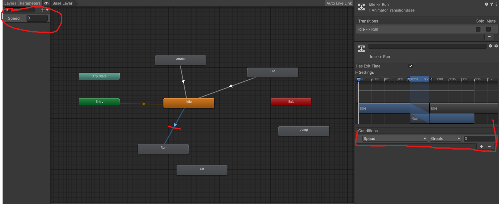

<h1>Введение в 2D платформер</h1>
<br>
<h2>🧠 ЧАСТЬ 1 — Теория</h2>

<h3>🔵 Что такое 2D?</h3>
<p><b>2D (двумерный)</b> — это тип графики, который отображает объекты в плоскости, используя только ширину и высоту. В
    2D
    играх персонажи, объекты и фоны представлены в виде спрайтов (двумерных изображений).</p>

<h3>🔵 Что такое платформер?</h3>
<p><b>Платформер</b> — это жанр видеоигр, в которых игрок управляет персонажем, который прыгает между платформами и
    избегает препятствий. В 2D платформере игровой мир представлен в двух измерениях (ширина и высота), и персонаж может
    двигаться только в этих двух направлениях.</p>

<h3>🔵 Какие компоненты используются в 2D?</h3>
<ul>
    <li><b>Sprite Renderer</b> — компонент, который отображает спрайт на экране.</li>
    <li><b>Rigidbody2D</b> — компонент, который добавляет физику к объекту (гравитация, столкновения).</li>
    <li><b>Collider2D</b> — компонент, который определяет форму объекта для столкновений.</li>
    <li><b>Script</b> — файл с кодом, который управляет поведением объекта.</li>
    <li><b>OnCollisionEnter</b> — метод, вызываемый при столкновении с другим объектом.</li>
</ul>
<hr>
<br>

<h2>🛠 ЧАСТЬ 2 — Создание проекта</h2>

<h3>🔹 Шаг 1 — Новый проект</h3>
<p>Для создания 2D платформера в Unity, выполните следующие шаги:</p>
<ol>
    <li>Откройте Unity Hub и создайте новый проект, выбрав шаблон 2D.</li>
    <li>Назовите проект, например, <b>"2DPlatformer"</b> и выберите папку для сохранения.</li>
    <li>Нажмите <b>"Create"</b> для создания проекта.</li>
</ol>
<p>После создания проекта, вы увидите интерфейс Unity с различными панелями, такими как Scene, Game, Hierarchy, Project
    и Inspector. Это основное рабочее пространство для разработки вашей игры.</p>

<h3>🔹 Шаг 2 — Сохраняем сцену</h3>
<p>Сохраните текущую сцену, выбрав <b>File → Save As</b> и назовите её <b>"MainScene"</b>. Это будет наша основная
    сцена, на которой мы будем создавать игру.</p>
<hr>
<br>

<h2>🟢 ЧАСТЬ 3 — Создаем уровень</h2>
<p>Теперь, когда у нас есть новый проект и сохранённая сцена, мы можем начать создавать уровень для нашего 2D
    платформера. Мы
    будем использовать простые спрайты для создания платформ и фона.</p>

<h3>🔹 Шаг 1 — Создание платформ при помощи Tile Palette</h3>
<p>Создадим карту при помощи <b>Tile Palette</b> и <b>TileMap</b>. Для этого:</p>
<ol>
<li>В панели <b>Project</b>, щёлкните правой кнопкой мыши и выберите <b>Create → 2D → Tile Palette</b>. Назовите её <b>"PlatformPalette"</b>.</li>

>> Tile Palette — это инструмент для создания и редактирования тайловых карт. Он позволяет вам рисовать уровни, используя спрайты, которые вы превращаете в тайлы.

<li>Откройте окно <b>Tile Palette</b>, выбрав <b>Window → 2D → Tile Palette</b>.</li>
<li>Создайте новый слой для тайлов, нажав на кнопку <b>Create New Layer</b> в окне Tile Palette.</li>
<li>Выберите спрайты для платформ и перетащите их в окно Tile Palette, чтобы создать тайлы.</li>

>>Если у вас вместо картинок Texture 2D, то в настройках Import Settings установите <b>Texture Type</b> → <b>Sprite (2D and UI)</b> и перетащите его в окно Tile Palette.

<li>Выберите инструмент <b>Brush</b> в окне Tile Palette и начните рисовать платформы на сцене, используя созданные тайлы.</li>
</ol>
<hr>
<br>

<h3>Настройка Texture2D</h3>
<p>Если у вас вместо картинок Texture 2D, то в настройках Import Settings установите:</p>
<ul>
    <li><b>Texture Type</b> → <b>Sprite (2D and UI)</b></li>
    <li><b>Filter Mode</b> → <b>Point (no filter)</b></li>
    <li><b>Compression</b> → <b>None</b></li>
    <li><b>Apply</b></li>
</ul>
<hr>
<br>

<h3>Шаг 2 - Создание сетки для тайлов</h3>
<p>Для создания сетки тайлов, выполните следующие шаги:</p>
<ol>
    <li>В панели <b>Project</b>, щёлкните правой кнопкой мыши и выберите <b>Create → 2D → Tilemap</b>. Назовите его <b>"PlatformTilemap"</b>.</li>
    <li>Выберите созданный объект <b>Tilemap</b> в панели Hierarchy.</li>
    <li>В панели Inspector установите параметр <b>Tile Palette</b>, указав ранее созданный <b>"PlatformPalette"</b>.</li>
    <li>Используйте инструменты в окне Tile Palette для рисования сетки тайлов на сцене.</li>
</ol>

>> Tilemap — это компонент, который позволяет вам создавать уровни, используя тайлы. Он работает вместе с Tile Palette для рисования и редактирования уровней.

<p>Для того, чтобы игрок мог взаимодействовать с тайловыми платформами, необходимо убедиться, что:</p>
<ul>
    <li>У тайлов установлен компонент <b>Tilemap Collider 2D</b>.</li>
    <li>У игрока установлен компонент <b>BoxCollider2D</b>.</li>
    <li>У игрока установлен компонент <b>Rigidbody2D</b>.</li>
</ul>

<hr>
<br>

<h2>🟢 ЧАСТЬ 4 — Создаем игрока</h2>
<p>Теперь, когда у нас есть платформы, мы можем создать игрока для нашего 2D платформера. Игрок будет представлен в виде
    спрайта, который может двигаться и прыгать по платформам.</p>

<h3>🔹 Шаг 1 — Создание спрайта игрока</h3>
<p>Для создания спрайта игрока, выполните следующие шаги:</p>
<ol>
    <li>В панели <b>Project</b>, щёлкните правой кнопкой мыши и выберите <b>Create → 2D → Sprite</b>. Назовите его <b>"Player"</b>.</li>
    <li>Выберите созданный спрайт <b>"Player"</b> в панели Project и перетащите его на сцену, чтобы создать игровой объект.</li>
    <li>Убедитесь, что у игрока установлен компонент <b>Sprite Renderer</b>, который отображает спрайт на экране.</li>
    <li>Добавьте компонент <b>BoxCollider2D</b> к игроку, чтобы он мог взаимодействовать с платформами.</li>
    <li>Добавьте компонент <b>Rigidbody2D</b> к игроку, чтобы он мог двигаться и прыгать по платформам.</li>
</ol>

<h4>Добавление текстуры к игроку</h4>
<p>Есть два варианта добавления текстуры к игроку:</p>

<h5><mark>Вариант 1</mark> — Отдельные картинки</h5>
<p>Вы можете создать или загрузить отдельные изображения для разных состояний игрока (например, стоя, бег, прыжок) и
    переключать их в зависимости от действий игрока.</p>

<hr>

<h5><mark>Вариант 2</mark> — Один большой файл (Sprite Sheet)</h5>
<p>Вы можете создать или загрузить один большой файл, который содержит все состояния игрока (называемый <b>Sprite
        Sheet</b>), и использовать его для анимации персонажа.</p>
<ol>
<li>Выбираем файл в Project
    <p>Кликаем на картинку. В Inspector открываются Import Settings.</p>
</li>
<li>Настраиваем Import Settings
    <p>Устанавливаем:</p>
<ul>
    <li><b>Texture Type</b> → <b>Sprite (2D and UI)</b></li>
    <li><b>Filter Mode</b> → <b>Point (no filter)</b></li>
    <li><b>Sprite Mode</b> → <b>Multiple</b></li>
    <li><b>Compression</b> → <b>None</b></li>
    <li><b>Apply</b></li>
</ul>
</li>
<li>Открываем Sprite Editor
<p>В Inspector нажимаем <b>Sprite Editor</b>. В открывшемся окне нажимаем <b>Slice</b>. Выбираем <b>Type</b> → <b>Grid
        By Cell Size</b>. Устанавливаем размер ячейки (например, 32x32 пикселя) и нажимаем <b>Slice</b>.</p>
</li>
<li>Сохраняем спрайты
<p>После нарезки, в окне Sprite Editor нажимаем <b>Apply</b>. Теперь в панели Project у вас будет несколько отдельных
    спрайтов, которые можно использовать для анимации игрока.</p>
</li>
</ol>

<hr>
<br>

<h3>🔹 Шаг 2 - Создание анимации игрока</h3>
<ul>
    <li>выберите игровой объект персонажа в иерархии</li>
    <li>перейдите в меню <b>Window</b> → <b>Animation</b>, чтобы открыть окно Animation</li>
    <li>нажмите Create и укажите путь сохранения анимации</li>
    <li>перетащите необходимые спрайты на временную шкалу</li>
    <li>ля каждого состояния (Idle, Run, Jump, Attack) создайте отдельную анимацию</li>
</ul>

<h3>🔹 Шаг 3 — Настройка анимации игрока</h3>
<p>Для создания анимации игрока, выполните следующие шаги:</p>
<ol>
    <li>Выберите спрайты, которые вы хотите использовать для анимации (например, спрайты для бега), для этого раскройте стрелочку рядом с названием спрайта в панели Project.</li>
    <li>Перетащите выбранные спрайты на сцену. Unity автоматически создаст новый объект с компонентом <b>Animator</b>.</li>
    <li>В окне <b>Animator</b>, вы увидите созданный анимационный клип. Вы можете настроить его параметры, такие как скорость
        анимации и переходы между различными состояниями (например, стоя, бег, прыжок).</li>
</ol>

<p>Теперь ваш игрок будет анимироваться в зависимости от его действий, таких как движение и прыжки. Мы добавили следующие анимации к игроку:</p>
<ul>
    <li><b>Idle</b> — анимация стояния.</li>
    <li><b>Run</b> — анимация бега.</li>
    <li><b>Jump</b> — анимация прыжка.</li>
</ul>

<p>Unity автоматически создаст:</p>
<ul>
    <li><b>Animator Controller</b> — контроллер, который управляет анимациями персонажа.</li>
    <li><b>Animation Clip</b> — клип, который содержит последовательность кадров для анимации.</li>
</ul>

<h3>Работа с параметрами анимации</h3>
<p>Чтобы создать условия перехода между анимациями в Unity, вам нужно выполнить несколько шагов:</p>
<ol>
    <li><b>Создать переменные в Parameters:</b>
<ul>
    <li>в окне Animator перейдите в раздел Parameters;</li>
    <li>нажмите на «+» для добавления новой переменной;</li>
    <li>выберите тип переменной (например, Bool для логических значений, Float для числовых);</li>
    <li>укажите имя переменной (например, moveX для отслеживания движения или Jumping для прыжка).</li>
</ul>
    </li>
    <li>
<b>Настроить переходы между анимациями:</b>
<ul>
    <li>выберите переход между анимациями (например, от Idle к Run);</li>
    <li>в разделе Conditions добавьте условие, используя созданные переменные (например, moveX > 0.1 для перехода от Idle к Run);</li>
    <li>настройте другие параметры перехода, такие как время перехода и приоритет анимации.</li>
</ul>
    </li>
</ol>



<br>
<h4>Создаём параметр Speed</h4>
<p>В окне <b>Animator</b>, нажмите на вкладку <b>Parameters</b>. Нажмите на кнопку <b>+</b> и выберите <b>Float</b>. Назовите параметр <b>"Speed"</b>.</p>

> Параметры — это сигналы для анимации.

<p>Параметры могут быть как числовыми (например, Speed, JumpPower), так и логическими (например, IsRunning, IsJumping).</p>

<br>
<h4>Создаём переход Idle → Run</h4>
<ul>
    <li>В окне <b>Animator</b>, щёлкните правой кнопкой мыши на состоянии <b>Idle</b> и выберите <b>Make Transition</b>. Затем щёлкните на состояние <b>Run</b>, чтобы создать переход между ними.</li>
    <li>Выберите созданный переход и в инспекторе нажмите на кнопку <b>+</b> в разделе <b>Conditions</b>.</li>
    <li>Выберите параметр <b>"Speed"</b> и установите условие, например, <b>Greater than 0.1</b>. Это означает, что когда значение Speed будет больше 0.1, анимация будет переключаться с Idle на Run.</li>
</ul>

<br>
<h4>Создаём переход Run → Idle</h4>
<ul>
    <li>В окне <b>Animator</b>, щёлкните правой кнопкой мыши на состоянии <b>Run</b> и выберите <b>Make Transition</b>. Затем щёлкните на состояние <b>Idle</b>, чтобы создать переход между ними.</li>
    <li>Выберите созданный переход и в инспекторе нажмите на кнопку <b>+</b> в разделе <b>Conditions</b>.</li>
    <li>Выберите параметр <b>"Speed"</b> и установите условие, например, <b>Less than or equal to 0.1</b>. Это означает, что когда значение Speed будет меньше или равно 0.1, анимация будет переключаться с Run на Idle.</li>
</ul>
<br>

<h4>Создаем переход для атаки</h4>
<ul>
    <li>В окне <b>Animator</b>, щёлкните правой кнопкой мыши на состоянии <b>Idle</b> и выберите <b>Make Transition</b>. Затем щёлкните на состоянии <b>Attack</b>, чтобы создать переход между ними.</li>
    <li>Выберите созданный переход и в инспекторе нажмите на кнопку <b>+</b> в разделе <b>Conditions</b>.</li>
    <li>Выберите параметр <b>"Attack"</b> и установите условие, например, <b>Trigger</b>. Это означает, что когда параметр Attack будет установлен, анимация будет переключаться с Idle на Attack.</li>
</ul>

<h4>Создаем переход для прыжка</h4>
<ul>
    <li>В окне <b>Animator</b>, щёлкните правой кнопкой мыши на состоянии <b>Idle</b> и выберите <b>Make Transition</b>. Затем щёлкните на состоянии <b>Jump</b>, чтобы создать переход между ними.</li>
    <li>Выберите созданный переход и в инспекторе нажмите на кнопку <b>+</b> в разделе <b>Conditions</b>.</li>
    <li>Выберите параметр <b>"IsJumping"</b> и установите условие, например, <b>True</b>. Это означает, что когда параметр IsJumping будет установлен в true, анимация будет переключаться с Idle на Jump.</li>
</ul>

<hr>
<br>

<h2>🟢 ЧАСТЬ 5 — Движение игрока</h2>
<p>Теперь, когда у нас есть анимация для нашего игрока, мы можем добавить код для управления его движением. Мы будем использовать
    компонент <b>Rigidbody2D</b> для физики и создавать скрипт для обработки ввода пользователя.</p>

<h3>🔹 Создаем папки</h3>
<p>Для организации проекта, создайте следующие папки в панели <b>Project</b>:</p>
<ul>
    <li><b>Scripts</b> — для хранения всех скриптов.</li>
    <li><b>Animations</b> — для хранения всех анимаций.</li>
    <li><b>Prefabs</b> — для хранения всех префабов (готовых объектов).</li>
</ul>

<h3>🔹 Объясняем перед кодом</h3>
<p>Перед тем, как писать код для движения игрока, давайте обсудим, что нам нужно реализовать:</p>
<ul>
    <li><b>Горизонтальное движение</b> — игрок должен уметь двигаться влево и вправо с помощью клавиш стрелок или клавиш A и D.</li>
    <li><b>Прыжок</b> — игрок должен уметь прыгать, нажимая клавишу пробела. Прыжок должен работать только тогда, когда игрок находится на земле.</li>
    <li><b>Анимация</b> — анимация должна переключаться между состояниями Idle, Run и Jump в зависимости от действий игрока.</li>
</ul>

<p>Также:</p>
<ul>
    <li><b>Update()</b> — вызывается каждый кадр.</li>
    <li><b>FixedUpdate()</b> — вызывается с фиксированным интервалом времени, используется для работы с физикой.</li>
    <li><b>Input.GetAxis("Horizontal")</b> — возвращает значение от -1 до 1, в зависимости от нажатых клавиш (A/D или стрелки).</li>
    <li><b>Rigidbody2D.velocity</b> — позволяет управлять скоростью объекта.</li>
    <li><b>OnCollisionEnter2D()</b> — метод, который вызывается при столкновении с другим объектом. Мы будем использовать его для определения, когда игрок находится на земле.</li>
</ul>

<br>
<h3>🔹 Создаем скрипт для движения игрока</h3>
<p>Для создания скрипта для движения игрока, выполните следующие шаги:</p>
<ol>
    <li>В папке <b>Scripts</b>, щёлкните правой кнопкой мыши и выберите <b>Create → C# Script</b>. Назовите скрипт <b>"PlayerController"</b>.</li>
    <li>Дважды щёлкните на скрипте, чтобы открыть его в редакторе кода (например, Visual Studio).</li>
    <li>Напишите код для управления движением игрока. Вот пример базового кода для движения и прыжков:</li>
</ol>

```c#
using UnityEngine;

public class PlayerMovement : MonoBehaviour
{
    public float speed = 5f;

    private Rigidbody2D rb;

    void Start()
    {
        rb = GetComponent<Rigidbody2D>();
    }

    void Update()
    {
        float move = Input.GetAxis("Horizontal");

        rb.velocity = new Vector2(move * speed, rb.velocity.y);
    }
}
```

<p>Этот код позволяет игроку двигаться влево и вправо с помощью клавиш A/D или стрелок. Вы можете добавить код для прыжков и анимации, используя аналогичный подход.</p>

<h4>🧠 Разбираем код построчно</h4>
<ul>
    <li><b>using UnityEngine;</b> — подключаем пространство имён Unity, чтобы использовать его функции и классы.</li>
    <li><b>public class PlayerMovement : MonoBehaviour</b> — объявляем новый класс PlayerMovement, который наследуется от MonoBehaviour, что позволяет ему быть компонентом в Unity.</li>
    <li><b>public float speed = 5f;</b> — объявляем публичную переменную speed, которая определяет скорость движения игрока. Она доступна для настройки в инспекторе Unity.</li>
    <li><b>private Rigidbody2D rb;</b> — объявляем приватную переменную rb для хранения ссылки на компонент Rigidbody2D игрока.</li>
    <li><b>void Start()</b> — метод Start вызывается один раз при запуске игры. Здесь мы получаем ссылку на компонент Rigidbody2D с помощью GetComponent.</li>
    <li><b>void Update()</b> — метод Update вызывается каждый кадр. Здесь мы обрабатываем ввод пользователя и обновляем скорость игрока.</li>
    <li><b>float move = Input.GetAxis("Horizontal");</b> — получаем значение от -1 до 1 в зависимости от нажатых клавиш (A/D или стрелки).</li>
    <li><b>rb.velocity = new Vector2(move * speed, rb.velocity.y);</b> — устанавливаем новую скорость игрока по горизонтали, умножая ввод на скорость, а вертикальную скорость оставляем без изменений.</li>
</ul>

<p>Теперь, когда вы добавите этот скрипт к вашему игроку в Unity, он сможет двигаться влево и вправо. Вы можете расширить этот код, добавив функциональность для прыжков и анимации, используя аналогичный подход.</p>

<hr>
<br>
<h2>🟢 ЧАСТЬ 6 — Прыжок</h2>

<h3>🔹 Добавляем переменные</h3>

```c#
public float jumpForce = 7f;
```

<h3>🔹 Добавляем метод для прыжка</h3>

```c#
void Update()
{
    float move = Input.GetAxis("Horizontal");
    rb.velocity = new Vector2(move * speed, rb.velocity.y);

// Прыжок
    if (Input.GetKeyDown(KeyCode.Space))
    {
        rb.AddForce(Vector2.up * jumpForce, ForceMode2D.Impulse);
    }
}
```

<h4>🧠 Объяснение</h4>
<ul>
    <li><b>public float jumpForce = 7f;</b> — объявляем публичную переменную jumpForce, которая определяет силу прыжка. Она доступна для настройки в инспекторе Unity.</li>
    <li><b>if (Input.GetKeyDown(KeyCode.Space))</b> — проверяем, была ли нажата клавиша пробела. Если да, то выполняем код внутри блока if.</li>
    <li><b>rb.AddForce(Vector2.up * jumpForce, ForceMode2D.Impulse);</b> — добавляем силу к Rigidbody2D игрока в направлении вверх (Vector2.up) с силой, умноженной на jumpForce. ForceMode2D.Impulse означает, что сила применяется мгновенно, создавая эффект прыжка.</li>
</ul>

<hr>
<br>
<h2>🟢 ЧАСТЬ 7 — Проверка на землю</h2>
<p>Чтобы игрок мог прыгать только тогда, когда он находится на земле, нам нужно добавить проверку на землю. Для этого мы будем использовать метод <b>OnCollisionEnter2D()</b>.</p>

<h3>🔹 Добавляем переменную для проверки на землю</h3>

```c#
public Transform groundCheck;
public float checkRadius = 0.2f;
public LayerMask groundLayer;

private bool isGrounded;
```

<h3>🔹 В Update добавляем</h3>

```c#
isGrounded = Physics2D.OverlapCircle(
    groundCheck.position,
    checkRadius,
    groundLayer
);

if (Input.GetKeyDown(KeyCode.Space) && isGrounded)
{
    rb.velocity = new Vector2(rb.velocity.x, jumpForce);
}
```

<h4>🧠 Объяснение</h4>
<ul>
    <li><b>public Transform groundCheck;</b> — объявляем публичную переменную groundCheck, которая будет использоваться для определения позиции проверки на землю. Вы должны создать пустой объект в Unity и назначить его этой переменной.</li>
    <li><b>public float checkRadius = 0.2f;</b> — объявляем публичную переменную checkRadius, которая определяет радиус проверки на землю.</li>
    <li><b>public LayerMask groundLayer;</b> — объявляем публичную переменную groundLayer, которая позволяет указать, какие слои считаются землей.</li>
    <li><b>private bool isGrounded;</b> — объявляем приватную булеву переменную isGrounded, которая будет хранить результат проверки на землю.</li>
    <li><b>isGrounded = Physics2D.OverlapCircle(groundCheck.position, checkRadius, groundLayer);</b> — используем метод OverlapCircle для проверки наличия коллайдера земли в радиусе вокруг позиции groundCheck. Результат сохраняется в переменной isGrounded.</li>
    <li><b>if (Input.GetKeyDown(KeyCode.Space) && isGrounded)</b> — проверяем, была ли нажата клавиша пробела и находится ли игрок на земле. Если оба условия выполняются, то выполняем код внутри блока if.</li>
    <li><b>rb.velocity = new Vector2(rb.velocity.x, jumpForce);</b> — устанавливаем вертикальную скорость игрока равной jumpForce, что позволяет ему прыгать. Горизонтальная скорость остается без изменений.</li>
</ul>
<hr>

<h3>🔹 Настраиваем groundCheck</h3>
<ol>
    <li>ПКМ по Player → Create Empty</li>
    <li>Назвать: GroundCheck</li>
    <li>Переместить вниз (под ноги)</li>
</ol>
<hr>

<h3>🔹 Настраиваем Layer</h3>
<ol>
    <li>Выделить Ground</li>
    <li>Layer → Add Layer → Ground</li>
    <li>Назначить Ground</li>
    <li>В Player назначить groundLayer</li>
</ol>

<hr>
<br>
<h2>🟢 ЧАСТЬ 8 — Визуализация проверки</h2>
<p>Чтобы дети видели круг проверки:</p>

```c#
void OnDrawGizmos()
{
    Gizmos.color = Color.red;
    Gizmos.DrawWireSphere(groundCheck.position, checkRadius);
}
```

<hr>
<br>
<h2>🟢 ЧАСТЬ 9 — Flip персонажа</h2>
<p>Чтобы персонаж поворачивался в направлении движения, добавьте следующий код в метод Update:</p>

```c#
if (move > 0)
    transform.localScale = new Vector3(1, 1, 1);
else if (move < 0)
    transform.localScale = new Vector3(-1, 1, 1);
```

<p>Этот код изменяет масштаб персонажа по оси X в зависимости от направления движения. Если move больше 0, персонаж смотрит вправо, если меньше 0, персонаж смотрит влево.</p>

<hr>
<br>
<h2>🟢 ЧАСТЬ 10 — Добавляем фон</h2>
<p>Для создания фона для вашего 2D платформера, выполните следующие шаги:</p>

<h3>Шаг 1 — Импортируем фон</h3>
<p>Создайте или загрузите изображение для фона и импортируйте его в Unity, перетащив файл в панель <b>Project</b>. Поместите фон в папку <b>Background</b></p>

<p>Настройки:</p>
<ul>
    <li><b>Texture Type</b> → <b>Sprite (2D and UI)</b></li>
    <li><b>Filter Mode</b> → <b>Point (no filter)</b></li>
    <li><b>Compression</b> → <b>None</b></li>
    <li><b>Apply</b></li>
</ul>
<hr>

<h3>🔹 Шаг 2 — Создаем объект фона</h3>
<p>Перетащите спрайт фона на сцену, чтобы создать игровой объект. Убедитесь, что он находится позади всех других объектов (например, платформ и игрока) в иерархии.</p>

<p>Вы можете использовать инструмент масштабирования, чтобы изменить размер фона и заполнить весь экран. Также можно добавить компонент <b>Sorting Layer</b> и установить его значение ниже, чем у других объектов, чтобы гарантировать, что фон всегда будет позади.</p>
<hr>

<h3>🔹 Шаг 3 — Перемещаем фон назад</h3>
<ol>
    <li>Выделите объект фона</li>
    <li>Добавьте компонент <b>Sorting Layer</b></li>
    <li>Установите значение Sorting Layer ниже, чем у других объектов (например, <b>Default</b> → <b>Background</b>)</li>
</ol>

> Sorting Layer — это как слои в Photoshop.
> Что выше — то рисуется поверх.

<hr>
<h3>🔹 Шаг 4 — Растягиваем фон</h3>
<p>Используйте инструмент масштабирования, чтобы изменить размер фона и заполнить весь экран. Убедитесь, что пропорции фона сохраняются, чтобы избежать искажения изображения.</p>

<hr>
<h2>🟢 ЧАСТЬ 11 — Камера и фон</h2>
<p>Чтобы фон следовал за камерой, выполните следующие шаги:</p>
<ol>
    <li>Выделите объект камеры в иерархии.</li>
    <li>Добавьте компонент <b>Camera Follow</b> (создайте новый скрипт, если его нет).</li>
    <li>В скрипте Camera Follow, добавьте код для следования камеры за игроком:</li>
</ol>

```c#
using UnityEngine;
public class CameraFollow : MonoBehaviour
{
    public Transform target;
    public float smoothSpeed = 0.125f;
    public Vector3 offset = new Vector3(0, 0, -10);

    void LateUpdate()
    {
        Vector3 desiredPosition = target.position + offset;
        Vector3 smoothedPosition = Vector3.Lerp(transform.position, desiredPosition, smoothSpeed);
        transform.position = smoothedPosition;
    }
}
``` 
<p>Этот код позволяет камере плавно следовать за игроком, сохраняя заданное смещение (offset) от него. Вы можете настроить параметры <b>smoothSpeed</b> и <b>offset</b> в инспекторе Unity для достижения желаемого эффекта.</p>

<h4>🧠 Объяснение</h4>
<ul>
    <li><b>public Transform target;</b> — объявляем публичную переменную target, которая будет ссылаться на объект, за которым должна следовать камера (в нашем случае, это игрок).</li>
    <li><b>public float smoothSpeed = 0.125f;</b> — объявляем публичную переменную smoothSpeed, которая определяет скорость сглаживания движения камеры.</li>
    <li><b>public Vector3 offset;</b> — объявляем публичную переменную offset, которая задает смещение камеры относительно цели.</li>
    <li><b>void LateUpdate()</b> — метод LateUpdate вызывается после всех методов Update. Это гарантирует, что камера будет обновляться после того, как игрок переместится.</li>
    <li><b>Vector3 desiredPosition = target.position + offset;</b> — вычисляем желаемую позицию камеры, добавляя смещение к позиции цели.</li>
    <li><b>Vector3 smoothedPosition = Vector3.Lerp(transform.position, desiredPosition, smoothSpeed);</b> — используем функцию Lerp для плавного перехода от текущей позиции камеры к желаемой позиции.</li>
    <li><b>transform.position = smoothedPosition;</b> — устанавливаем позицию камеры на сглаженную позицию.</li>
</ul>

<hr>
<br>
<h2>🟢 ЧАСТЬ 12 - Связываем анимацию с кодом</h2>
<p>Чтобы связать анимацию с кодом, нам нужно использовать компонент <b>Animator</b> и управлять параметрами анимации из нашего скрипта. Вот как это сделать:</p>
<ol>
<li>Убедитесь, что у вашего игрока есть компонент <b>Animator</b>, и что он настроен с анимациями Idle, Run и Jump.</li>
<li>В вашем скрипте PlayerController, добавьте ссылку на компонент Animator:</li>

```c#
private Animator animator;
```

<li>В методе Start(), получите ссылку на компонент Animator:</li>

```c#
animator = GetComponent<щ>();
```

<li>В методе Update(), обновите параметры анимации в зависимости от действий игрока. Например:</li>

```c#
// Горизонтальное движение
float move = Input.GetAxis("Horizontal");
animator.SetFloat("Speed", Mathf.Abs(move));
// Прыжок
if (Input.GetKeyDown(KeyCode.Space) && isGrounded)
{
    rb.velocity = new Vector2(rb.velocity.x, jumpForce);
    animator.SetBool("IsJumping", true);
}
else if (isGrounded)
{
    animator.SetBool("IsJumping", false);
}
``` 

<li>Добавляем анимацию атаки:</li>

```c#
if (Input.GetKeyDown(KeyCode.F))
{
    animator.SetTrigger("Attack");
}
```

</ol>

<p>В этом коде мы устанавливаем параметр Speed в зависимости от абсолютного значения горизонтального движения, что позволяет переключаться между анимациями <b>Idle</b> и <b>Run</b>. Также мы устанавливаем параметр <b>IsJumping</b> в зависимости от того, прыгает ли игрок или находится на земле.</p>

<h4>🧠 Объяснение</h4>
<ul>
    <li><b>private Animator animator;</b> — объявляем приватную переменную animator для хранения ссылки на компонент Animator.</li>
    <li><b>animator = GetComponent<Animator>();</b> — в методе Start() получаем ссылку на компонент Animator, который находится на том же объекте, что и скрипт.</li>
    <li><b>animator.SetFloat("Speed", Mathf.Abs(move));</b> — устанавливаем параметр Speed в Animator, используя абсолютное значение горизонтального движения. Это позволяет переключаться между анимациями Idle и Run в зависимости от того, движется ли игрок.</li>
    <li><b>if (Input.GetKeyDown(KeyCode.Space) && isGrounded)</b> — проверяем, была ли нажата клавиша пробела и находится ли игрок на земле. Если оба условия выполняются, то выполняем код внутри блока if.</li>
    <li><b>animator.SetBool("IsJumping", true);</b> — устанавливаем параметр IsJumping в Animator в true, когда игрок начинает прыгать.</li>
    <li><b>else if (isGrounded)</b> — если игрок не прыгает и находится на земле, устанавливаем параметр IsJumping в false.</li>
</ul>