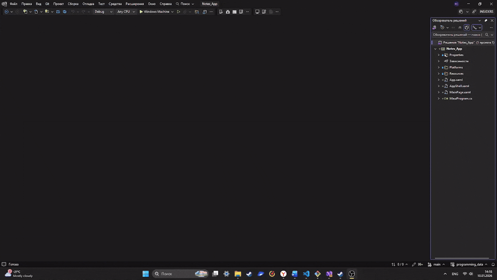

<h1>Справочник С#</h1>

<h2>Оглавление</h2>
<ul>
    <li><a href="./work_in_VS.md">Работа с C# в VS Code</a></li>
    <li>Блок 1 (Повторение и синтаксис C# в консоли)
    </li>
    <li>Блок 2 (C# + MAUI)
    </li>
    <li>БЛОК 3 (SQL + MAUI)
        <ul>
            <li>Занятие 1
                <ul>
                    <li><a href="#work_with_bd">Работа с базой данных SQLite в .NET MAUI</a></li>
                    <li><a href="#link_sqlite">Подключение SQLite к MAUI</a></li>
                    <li><a href="#sql_command">ОСНОВНЫЕ SQL-КОМАНДЫ</a></li>
                </ul>
            </li>
        </ul>
    </li>
</ul>

<h2>БЛОК 3 (SQL + MAUI)</h2>
<h3 name="work_with_bd">Работа с базой данных SQLite в .NET MAUI</h3>

<p><b>База данных (БД)</b> — это место, где приложение хранит данные:</p>
<ul>
    <li>расписание уроков</li>
    <li>список дел</li>
    <li>заметки</li>
    <li>результаты игр</li>
    <li>настройки пользователя</li>
</ul>

<p>Если <b>НЕ использовать БД</b>, то:</p>
<ul>
    <li>данные пропадут после закрытия приложения</li>
</ul>

<p>Если использовать БД, то:</p>
<ul>
    <li>данные сохраняются</li>
    <li>можно добавлять, удалять, изменять записи</li>
</ul>

<br>
<h4>Понятие модели</h4>
<p><b>Model</b> — это класс, который описывает:</p>
<il>
    <li>какие данные мы храним</li>
    <li>как выглядит одна запись в таблице</li>
</il>

<br>
<h4>Почему именно SQLite</h4>
<p><b>SQLite</b> — это:</p>
<ul>
    <li>локальная база данных</li>
    <li>один файл</li>
    <li>работает без интернета</li>
    <li>идеально подходит для мобильных приложений</li>
</ul>

<br>
<p>Почему SQLite в MAUI:</p>
<ul>
    <li>встроена поддержка</li>
    <li>быстро работает</li>
    <li>просто изучать</li>
    <li>не требует сервера</li>
</ul>

<br>
<h4>Как SQLite работает внутри приложения</h4>
<ol>
    <li>Приложение запускается</li>
    <li>Создаётся файл базы данных</li>
    <li>В базе создаются таблицы</li>
    <li>Мы:
        <ul>
            <li>добавляем данные</li>
            <li>читаем данные</li>
            <li>удаляем данные</li>
        </ul>
    </li>
</ol>

<br>
<p>📦 Всё хранится <b>внутри приложения</b></p>

<br>
<h3 name="link_sqlite">Подключение SQLite к MAUI</h3>
<p>Прежде чем работать с <b>SQLite</b> его необходимо подключить. Мы рассмотрим два примера: <a href="#vs">Visual Studio</a> и <a href="#vs_code">VS Code</a></p>

<h4 name="vs">Visual Studio</h4>
<p>Для работы с <b>SQLite</b> нужно подключить библиотеку: </p>

```c#
using SQLite;
```

<br>
<h5>Установка NuGet-пакета</h5>
<p>Чтобы использовать данную библиотеку необходимо установить <b>NuGet-пакет <mark>sqlite-net-pcl</mark></b>.</p>
<p>Для этого:</p>
<ol>
    <li>Нажмите <b>ПКМ</b> по проекту</li>
    <li>Выберите <b>Управление пакетами NuGet для решения...</b></li>
    <li>Найдите <b>sqlite-net-pcl</b></li>
    <li>Установите его</li>
</ol>



<h4 name="vs_code">VS Code</h4>
<p>Для работы с <b>SQLite</b> нужно выполнить следующие шаги:</p>
<ol>
    <li>Открой <b>Extensions</b> (иконка квадратиков слева)</li>
    <li>Установи расширение: <b>SQLite for Visual Studio Code</b> (автор: <i>alexcvzz</i>)</li>
    <li>Установи расширение: <b>SQLite Viewer</b> (автор: <i>qwtel</i>)</li>
</ol>

<br>
<h3 name="sql_command">ОСНОВНЫЕ SQL-КОМАНДЫ</h3>
<p>Мы будем использовать ВСЕГО 5 команд 👇</p>

<h4>1️⃣ CREATE TABLE</h4>
<p> - Создаёт таблицу в базе данных</p>

<br>

> В MAUI мы делаем это один раз, обычно автоматически.

<h5>SQL</h5>
<hr>

```sql
CREATE TABLE Note (
    Id INTEGER PRIMARY KEY AUTOINCREMENT,
    Text TEXT
);
```
> Объяснение: Создание таблицы Note c колонками

<h5>MAUI</h5>
<hr>

```c#
database.CreateTable<Note>();
```

<br>
<h4>2️⃣ INSERT</h4>
<p> - Добавляет данные в таблицу</p>

<h5>SQL</h5>
<hr>

```sql
INSERT INTO Note (Text)
VALUES ('Моя первая заметка');
```

> Объяснение: Добавление новой строки в таблицу Note

<h5>MAUI</h5>
<hr>

```c#
database.Insert(new Note { Text = "Привет" });
```

<br>
<h4>3️⃣ SELECT</h4>
<p> - Получает данные из таблицы</p>

<h5>SQL</h5>
<hr>

```sql
SELECT * FROM Note;
```

> Объяснение: Выбирает все столбцы из таблицы Note и выводит их

```sql
SELECT Text FROM Note;
```

> Объяснение: Выбирает столбец Text из таблицы Note и выводит их

<h5>MAUI</h5>
<hr>

```c#
database.Table<Note>().ToList();
```

<br>
<h4>4️⃣ DELETE</h4>
<p> - Удаление данных из таблицы</p>

<h5>SQL</h5>
<hr>

```sql
DELETE FROM Note WHERE Id = 1;
```

> Объяснение: Удаление строки из таблицы Note с id=1

<h5>MAUI</h5>
<hr>

```c#
database.Delete(note);
```

<br>
<h4>5️⃣ UPDATEE</h4>
<p> - Изменение данных в таблице</p>

<h5>SQL</h5>
<hr>

```sql
UPDATE Note
SET Text = 'Новый текст'
WHERE Id = 1;
```

> Объяснение: Изменение текста заметки

<h5>MAUI</h5>
<hr>

```c#
database.Update(note);
```

<br>
<h4>🧩 Дополнительные команды</h4>
<ul>
    <li><b>WHERE</b> — фильтр
    
```sql
SELECT * FROM Note WHERE Text = 'Привет';
```

<p>Показывает только подходящие строки</p>

</li>
    <li><b>ORDER BY</b> — сортировка
    
```sql
SELECT * FROM Note ORDER BY Id DESC;
```

<p>Сортирует строки таблицы</p>

</li>
    <li><b>LIMIT</b> — ограничение
    
```sql
SELECT * FROM Note LIMIT 5;
```

<p>Выводит только 5 записей из таблицы</p>
    
</li>
</ul>

