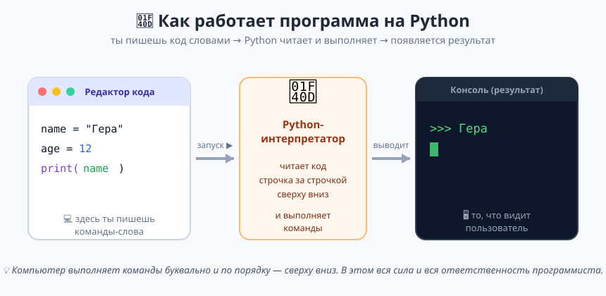
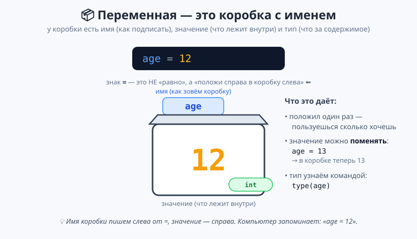
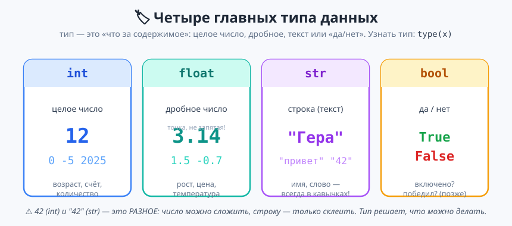
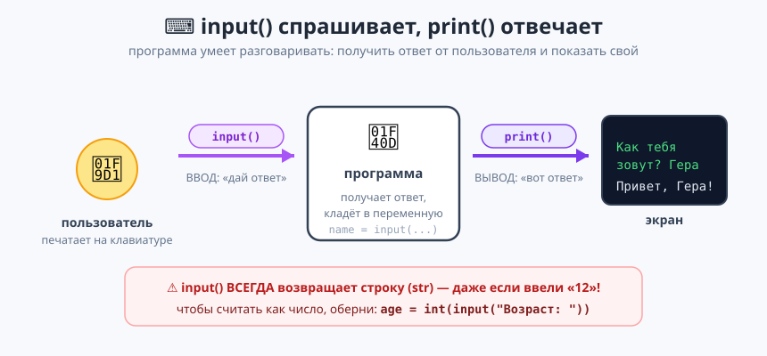

# Урок 1 — «Анкета героя»: первая программа, переменные, ввод 🐍📝

**Модуль 1 · Первые шаги в Python · Урок 1 из 5 | 2 ак.ч. (1,5 часа)**

> ⬅️ [Все уроки модуля](../README.md) · [План курса](../../ПЛАН-КУРСА.md) · Следующий: [Урок 2 «Калькулятор + генератор ников»](../урок-02-калькулятор-и-ники/урок.md) ➡️

> 🔁 В начале — [разминка/повтор](повторение.md) (5 мин).
> 📌 Быстро вспомнить материал урока — [итого.md](итого.md) (шпаргалка).
> 👨‍🏫 Сценарий с хронометражом — в [преподавателю.md](преподавателю.md).
> 🖼 Что показать на проекторе — в [изображения.md](изображения.md).
> 🆘 **Пропустил урок или хочешь закрепить?** Открой [самоучитель.md](самоучитель.md) — теория + задания с подсказками.
> 🧰 Трюки и частые ошибки — в [лайфхак.md](лайфхак.md).

> 🧭 **Как читать урок.** Год назад в Scratch мы собирали программы из **цветных блоков**. Сегодня — первый шаг во «взрослое» программирование: будем **писать команды словами**, как настоящие разработчики. Python специально придумали так, чтобы код читался почти как английский. За урок мы напишем **«Анкету героя»**, которая спросит имя, возраст, город и соберёт персональное приветствие. Новую команду мы будем **сразу закреплять мини-заданием** ✍️ — прямо на уроке, за пару минут. И обязательно **разберём ошибки** — что Python пишет и почему.

---

## 🎮 Что мы сделаем сегодня и что получим

**Задача:** написать программу-анкету, которая **разговаривает с пользователем** — спрашивает имя, возраст, любимую игру и город, а потом собирает из ответов персональное приветствие и считает, сколько тебе будет через 10 лет.

**В итоге получится** твоя **первая настоящая программа на Python** — файл `анкета.py`:

```
Как тебя зовут? Гера
Сколько тебе лет? 12
Любимая игра? Minecraft
Из какого ты города? Казань

===== АНКЕТА ГЕРОЯ =====
Привет, Гера из города Казань!
Тебе сейчас 12 лет, а через 10 будет 22.
Твоя любимая игра — Minecraft. Отличный выбор!
```

**Главные навыки урока:** `print()` · **f-строки** · комментарии · переменные · типы (`int/float/str`) · склейка и повтор строк (`+`, `*`) · `input()` · `int(input())` · **чтение ошибок**.

> 💡 **Главная мысль урока:** **программа — это команды, которые компьютер выполняет буквально и по порядку, сверху вниз.** Он не догадывается, что ты имел в виду, — он делает ровно то, что написано. Поэтому важна точность.

---

## Часть 0 — Готовим рабочее место (5 минут)

Чтобы писать на Python, нужны две вещи: сам **Python** («переводчик» наших команд) и **редактор** (где печатаем код).

- **Python** уже установлен на учебных компьютерах. Дома — [python.org/downloads](https://www.python.org/downloads/), при установке **обязательно галочка «Add Python to PATH»**.
- **Редактор:** 🧩 проще — [Thonny](https://thonny.org/) (одно окно, большая кнопка Run ▶); 🎓 взрослее — [VS Code](https://code.visualstudio.com/) + расширение Python.

Создай файл и сохрани как **`анкета.py`**. Расширение **`.py`** — «паспорт» файла Python.

> ⚠️ **Ошибка:** сохранить как `анкета.py.txt` или без `.py` — тогда программа не запустится. Имя должно заканчиваться **ровно на `.py`**.

---

## Часть 1 — Первая программа: `print()` (8 минут)

Самая знаменитая первая программа — вывести приветствие. Напиши одну строку и нажми **Run ▶**:

```python
print("Привет, мир!")
```

- 👀 **Что видишь:** внизу, в **консоли**, появилось `Привет, мир!` 🎉



- **`print`** — команда «напечатай на экран».
- **Скобки `( )`** — в них кладём, **что** напечатать.
- **Кавычки `" "`** — говорят Python: внутри **текст** (строка), а не команда.

Команды выполняются **по очереди, сверху вниз**:

```python
print("Привет, мир!")
print("Меня зовут Python.")
print("Я выполняю команды по порядку.")
```

> ✍️ **Мини-задание 1 (2 мин):** выведи **три строки** — своё имя, свой класс и любимую игру, каждую с новой строки.
> <details><summary>💡 подсказка</summary>Три отдельные команды <code>print("...")</code>, текст в кавычках.</details>

> ⚠️ **Ошибка:** `print(Привет)` — текст без кавычек → Python решит, что это команда/переменная → `NameError`. Текст — **всегда в кавычках**.

---

## Часть 2 — Комментарии и «ошибок не боимся» (5 минут)

Всё после значка **`#`** Python **игнорирует** — это заметка для человека:

```python
# Это моя первая программа. Python эту строку не выполняет.
print("Привет!")  # комментарий можно и справа от команды
```

Теперь **специально сломаем** программу, чтобы не бояться красного текста:

```python
print("Привет)
```

- 👀 **Что видишь:** `SyntaxError: unterminated string literal` — не закрыта кавычка.

> 💡 **Ошибка (Error) — не поломка, а подсказка.** Python говорит: «я не понял вот это место». Смотри на **последнюю строку** сообщения (там суть) и на **номер строки** (`line 1`). Почти все ошибки новичка — забытая кавычка, скобка или опечатка.

> ✍️ **Мини-задание 2 (1 мин):** убери у рабочего `print` закрывающую скобку `)` и запусти. Прочитай, что написал Python, и **почини**.

---

## Часть 3 — Переменные: коробки для данных (12 минут)

Программа станет полезной, когда начнёт **запоминать** данные. Для этого — **переменные** (подписанные коробки):

```python
name = "Гера"
age = 12
```

«В коробку `name` положи текст `"Гера"`; в коробку `age` — число `12`».



- **Имя** (`name`, `age`) — слева от `=`. Придумываем сами.
- **Знак `=`** — это **НЕ «равно»**, а **«положи»**: значение справа кладётся в коробку слева (справа налево ⬅).
- Дальше имя можно использовать вместо значения:

```python
name = "Гера"
age = 12
print(name)               # Гера
print("Возраст:", age)    # Возраст: 12
```

> 💡 `print` печатает несколько вещей через запятую и сам ставит пробел. Заметь: `"Возраст:"` в кавычках (текст), а `age` без кавычек (печатаем **содержимое** коробки).

**Значение можно менять** — коробка на то и коробка: `age = 13` кладёт новое поверх старого.

**Правила имён:** ✅ латиница, цифры, `_` (`player_score`, `age2`); ❌ нельзя с цифры (`2age`) и с пробелом (`my age` → `my_age`). Имя должно быть **понятным**: `age` лучше, чем `a`.

> ✍️ **Мини-задание 3 (2 мин):** заведи переменные `name` и `age` со своими данными и выведи `Меня зовут ...` и `Мне ... лет` (двумя `print`).
> <details><summary>💡 подсказка</summary><code>print("Меня зовут", name)</code> и <code>print("Мне", age, "лет")</code>.</details>

> ⚠️ **Ошибка:** `name = Гера` (без кавычек справа) → `NameError`. Текст — в кавычках, имя переменной — без.

---

## Часть 4 — Красивый вывод: f-строки (10 минут)

Печатать через запятую не всегда удобно. Есть более удобный способ — **f-строки**. Поставь букву **`f`** перед кавычками и вставляй переменные прямо в текст, в фигурных скобках `{ }`:

```python
name = "Гера"
age = 12
print(f"Меня зовут {name}, мне {age} лет.")
```

- 👀 **Что видишь:** `Меня зовут Гера, мне 12 лет.` Python подставил значения переменных на места `{name}` и `{age}`.

> 💡 **Почему f-строки удобнее:** весь текст пишется как одна фраза, а переменные — прямо на своих местах. Не нужно расставлять запятые и следить за пробелами. Мы будем пользоваться f-строками **постоянно**.

Можно вставлять и **выражения** — Python сначала посчитает, потом подставит:

```python
age = 12
print(f"Через 10 лет тебе будет {age + 10}.")   # Через 10 лет тебе будет 22.
```

> ✍️ **Мини-задание 4 (2 мин):** одной f-строкой выведи `Привет, <имя>! Тебе <возраст> лет, а в прошлом году было <возраст−1>.`
> <details><summary>💡 подсказка</summary>Внутри <code>{ }</code> можно писать <code>age - 1</code>: <code>f"...было {age - 1}"</code>.</details>

> ⚠️ **Ошибка:** забыть букву `f` — `print("Мне {age} лет")` выведет **буквально** `Мне {age} лет` (без подстановки). Буква `f` — «включатель» подстановки.

---

## Часть 5 — Типы данных и действия со строками (12 минут)

В коробках лежат **разные виды** данных, и Python их различает. Четыре главных типа:



| Тип | Что это | Примеры |
|-----|---------|---------|
| **`int`** | целое число | `12`, `0`, `-5` |
| **`float`** | дробное (с **точкой**!) | `3.14`, `1.5` |
| **`str`** | строка (в **кавычках**) | `"Гера"`, `"42"` |
| **`bool`** | «да/нет» (Модуль 2) | `True`, `False` |

Узнать тип — командой **`type()`**: `print(type(12))` → `<class 'int'>`.

**Со строками можно делать два интересных действия:**

```python
# Склейка (+) — соединить строки
first = "Гарри"
last = "Поттер"
print(first + " " + last)     # Гарри Поттер

# Повтор (*) — размножить строку
print("ха" * 3)               # хахаха
print("=" * 20)               # ==================== (удобно для рамок!)
```

> 💡 **`+` для строк — это склейка, а не сложение.** `"2" + "2"` даёт `"22"` (склеили два текста), а не `4`. А `"=" * 20` рисует линию из 20 знаков — пригодится для красивых «рамок» в выводе.

> ✍️ **Мини-задание 5 (2 мин):** выведи «рамку» из 15 звёздочек `*`, под ней своё имя, под ним — ещё одну такую рамку.
> <details><summary>💡 подсказка</summary><code>print("*" * 15)</code>, потом <code>print(name)</code>, потом снова рамка.</details>

> ⚠️ **Важно: `42` и `"42"` — РАЗНОЕ.** `42` (int) можно сложить (`42 + 8 = 50`), `"42"` (str) можно только склеить (`"42" + "8" = "428"`). **Тип решает, что можно делать** — это причина большинства ошибок новичков.

---

## Часть 6 — `input()`: спрашиваем у пользователя (12 минут)

Настоящая программа **спрашивает** пользователя командой **`input()`**:

```python
name = input("Как тебя зовут? ")
print(f"Привет, {name}!")
```

Запусти ▶. В консоли появится вопрос и курсор — программа **ждёт**. Напечатай имя, нажми **Enter**.



- **`input("вопрос")`** — показывает вопрос и **ждёт** ответ (до нажатия Enter).
- Ответ надо **положить в переменную**: `name = input(...)`, иначе он потеряется.

> ✍️ **Мини-задание 6 (2 мин):** спроси у пользователя **имя и возраст** (два `input`) и выведи одной f-строкой: `<имя>, тебе <возраст>!` — как в примере из задания учителя.
> <details><summary>💡 подсказка</summary><code>name = input("Имя: ")</code>, <code>age = input("Возраст: ")</code>, затем <code>print(f"{name}, тебе {age}!")</code>.</details>

> ⚠️ **ГЛАВНАЯ ловушка урока:** `input()` **всегда возвращает строку (`str`)** — даже если ввели число! Проверь: `age = input("Возраст: ")`, потом `print(type(age))` → `<class 'str'>`. Почему это важно — в следующей части.

---

## Часть 7 — Разбираем ошибку `str + int` и чиним типом (12 минут)

Попробуем **посчитать** возраст через 10 лет «в лоб»:

```python
age = input("Сколько тебе лет? ")
print(age + 10)      # ❌ ОШИБКА!
```

- 👀 **Что видишь:**
  ```
  TypeError: can only concatenate str (not "int") to str
  ```

**Разберём ошибку** (это важный навык!):
- `TypeError` — «ошибка типа»: мы смешали **несовместимые** типы.
- `can only concatenate str ... to str` — «строку можно склеивать только со строкой». А мы попросили склеить строку `age` (это `"12"`) с числом `10`. Python не знает: склеить их как текст или сложить как числа? — и честно останавливается.

**Две причины запомнить:**
1. `input()` дал **строку** `"12"`, а не число.
2. `+` между **строкой и числом** запрещён.

**Чиним** — превращаем ответ в число через **`int()`**:

```python
age = int(input("Сколько тебе лет? "))
print(f"Через 10 лет тебе будет {age + 10}.")   # ✅ работает: 22
```

Читаем «матрёшку» `int(input(...))` **изнутри наружу**: `input(...)` → получили `"12"` → `int("12")` → число `12` → `age = ...`.

| Команда | Из чего | Во что |
|---------|---------|--------|
| `int("12")` | строка | целое `12` |
| `float("1.5")` | строка | дробное `1.5` |
| `str(12)` | число | строка `"12"` |

> 💡 **Лайфхак:** f-строка **сама** превращает число в текст при подстановке, поэтому `f"будет {age + 10}"` работает и не требует `str()`. Ошибка была именно из-за `+`, а не из-за печати.

> ✍️ **Мини-задание 7 (3 мин):** спроси число (`int(input())`) и выведи его **квадрат** (число × само на себя) f-строкой. Потом убери `int()` и посмотри, какая ошибка появится.
> <details><summary>💡 подсказка</summary><code>n = int(input("Число: "))</code>, затем <code>print(f"Квадрат: {n * n}")</code>. Без <code>int()</code> умножение строки на строку даст ошибку.</details>

> ⚠️ **Ошибка:** `int("привет")` — нельзя превратить слово в число → `ValueError: invalid literal for int()`. Оборачивай в `int()` только то, где ждёшь число (возраст, количество), а не имя или город.

---

## Часть 8 — Собираем «Анкету героя» 🏆 (14 минут)

Соединяем всё. Печатай по блокам, запускай после каждого.

```python
# ===== АНКЕТА ГЕРОЯ =====

# 1. Спрашиваем данные
name = input("Как тебя зовут? ")
age = int(input("Сколько тебе лет? "))   # int() — чтобы считать
game = input("Любимая игра? ")
city = input("Из какого ты города? ")

# 2. Считаем возраст через 10 лет
age_future = age + 10

# 3. Красиво выводим анкету (f-строки + рамка)
print()
print("=" * 27)
print("АНКЕТА ГЕРОЯ")
print("=" * 27)
print(f"Привет, {name} из города {city}!")
print(f"Тебе сейчас {age} лет, а через 10 будет {age_future}.")
print(f"Твоя любимая игра — {game}. Отличный выбор!")
```

- 👀 **Что видишь:** программа задаёт 4 вопроса и собирает персональную анкету с рамкой и подсчётом — **настоящее приложение**, которое можно показать другу.

> 💡 **Разбор:** только `age` обёрнут в `int()` (с ним считаем); `name`, `game`, `city` — строки (их не считаем). `"=" * 27` рисует рамку. `age_future` посчитали заранее и подставили в f-строку.

> 🧩 **Для 5–7 классов (проще):** хватит трёх вопросов (имя, возраст, игра) без подсчёта через 10 лет — главное, чтобы программа спрашивала и здоровалась по имени f-строкой.

---

## 🐞 Разбор частых ошибок (читаем, что пишет Python)

| Сообщение Python | Что случилось | Как починить |
|------------------|---------------|--------------|
| `SyntaxError: unterminated string literal` | не закрыл кавычку | проверь пары `" "` |
| `SyntaxError` возле `(` | не закрыл скобку | каждой `(` — своя `)` |
| `NameError: name 'Гера' is not defined` | текст без кавычек | текст бери в кавычки |
| `TypeError: can only concatenate str ... to str` | склеил строку и число через `+` | оберни число в `str()` или ввод в `int()` |
| `ValueError: invalid literal for int()` | `int()` от слова, а не числа | `int()` только для чисел |
| выводит `Мне {age} лет` буквально | забыл букву `f` перед строкой | поставь `f"..."` |

> ⚠️ Не запускается? Проверь по порядку: **кавычки**, **скобки**, **латиница** в командах, буква **`f`** у f-строк, **номер строки** из ошибки.

---

## 🎓 Часть 9 — Для тех, кто хочет глубже (по времени)

- **`\n` — перенос строки** внутри одной строки: `print("Строка1\nСтрока2")` → две строки.
- **Форматирование в f-строке:** `f"{3.14159:.2f}"` → `3.14` (два знака после точки) — пригодится для денег и дробей.
- **Год рождения:** добавь `print(f"Ты родился примерно в {2026 - age} году.")` (на уроке 4 возьмём текущий год автоматически через `datetime`).
- **Проверка типов:** после каждого `input` выведи `type(...)` — убедись, где строка, а где число.

---

## 🏁 Итог урока (5 минут)

Сегодня ты написал **первую программу на Python** и сделал говорящую анкету:

- ✅ **`print()`** и **f-строки** `f"...{имя}..."` — красивый вывод.
- ✅ **Комментарии `#`** и **чтение ошибок** (последняя строка + номер строки).
- ✅ **Переменные** — коробки; `=` значит «положи».
- ✅ **Типы** — `int/float/str/bool`; `42` ≠ `"42"`; строки: `+` склейка, `*` повтор.
- ✅ **`input()`** — всегда возвращает строку.
- ✅ **`int(input())`** — превратить ответ в число; разобрали `TypeError` и `ValueError`.

> 🏆 Главное: **программа хранит данные в переменных и выполняет команды по порядку.** Быстро повторить всё — в [итого.md](итого.md).

> 🎤 **Блиц:** зачем буква `f` перед строкой? что даёт `"="*20`? чем `42` отличается от `"42"`? почему `input()` ломает подсчёты и как чинить? что значит `TypeError`?

### 🎮 Викторина-закрепление
Открой **[викторина.html](викторина.html)** — 16 вопросов + смешные и «на подумать».

➡️ **Практика урока** — **[практика.md](практика.md)**: 24 задачи в 3 уровнях с подсказками.
🆘 **Пропустил / хочешь ещё?** — [самоучитель.md](самоучитель.md) (теория + 15–20 заданий).
🧰 **Трюки и ошибки** — [лайфхак.md](лайфхак.md). 📌 **Шпаргалка** — [итого.md](итого.md).

---

## 🔗 Навигация и материалы

⬅️ [Все уроки модуля](../README.md) · [План курса](../../ПЛАН-КУРСА.md) · **Следующий:** [Урок 2 «Калькулятор + генератор ников»](../урок-02-калькулятор-и-ники/урок.md) ➡️

**🧰 Инструменты:** [Python](https://www.python.org/downloads/) · [Thonny](https://thonny.org/) (🧩) / [VS Code](https://code.visualstudio.com/) (🎓).
**📄 Готовый код:** [`материалы/анкета.py`](материалы/анкета.py) (проверен запуском).
**⚙️ Учителю:** сценарий и частые ошибки — в [преподавателю.md](преподавателю.md).
