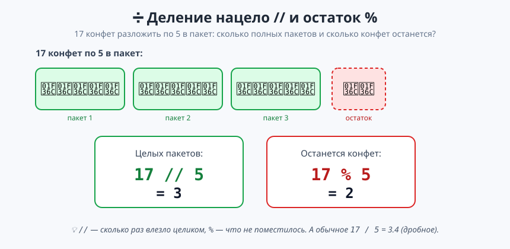
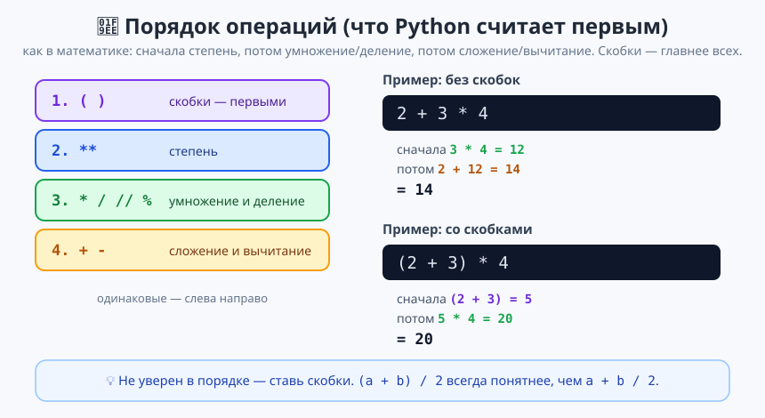
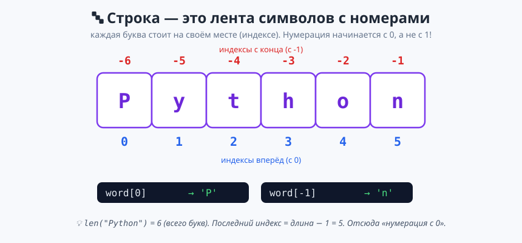

# Урок 2 — «Калькулятор + генератор ников»: числа и строки 🧮🔤

**Модуль 1 · Первые шаги в Python · Урок 2 из 5 | 2 ак.ч. (1,5 часа)**

> ⬅️ Предыдущий: [Урок 1 «Анкета героя»](../урок-01-анкета-героя/урок.md) · [Все уроки модуля](../README.md) · Следующий: [Урок 3 «Библиотека random»](../урок-03-random/урок.md) ➡️

> 🔁 В начале — [разминка/повтор](повторение.md) (5 мин).
> 📌 Быстро вспомнить материал — [итого.md](итого.md).
> 👨‍🏫 Хронометраж — [преподавателю.md](преподавателю.md). 🖼 Что показать — [изображения.md](изображения.md).
> 🆘 Пропустил? — [самоучитель.md](самоучитель.md). 🧰 Трюки — [лайфхак.md](лайфхак.md).

> 🧭 **Как читать урок.** На прошлом уроке мы научились вводить и выводить данные. Сегодня заставим Python **считать** (он отличный калькулятор!) и **играть с текстом**. Сделаем два проекта: **умный калькулятор** (вводишь два числа — получаешь все операции сразу) и **генератор ников** (собираем крутое прозвище из твоего имени). Каждую новую команду закрепляем мини-заданием ✍️ и разбираем ошибки, которые Python может выдать.

---

## 🎮 Что мы сделаем сегодня

**Два проекта:**
1. 🧮 **Калькулятор** — спрашивает два числа и показывает сумму, разность, произведение, деление, целое деление, остаток и степень.
2. 🔤 **Генератор ников** — берёт имя и превращает в игровой ник: `Гера` → `xX_ГЕРА_777_Xx`.

**Главные навыки:** арифметика `+ - * / // % **` · приоритет операций и скобки · деление нацело `//` и остаток `%` · методы строк `.upper() .lower() .title() .strip()` · длина `len()` · символы по индексу `строка[0]` · разбор ошибок (`ZeroDivisionError`, `ValueError`).

> 💡 **Главная мысль:** у **чисел** и **строк** — **разные действия**. `+` для чисел складывает, для строк склеивает; `*` для чисел умножает, для строк повторяет. Тип данных решает, что произойдёт.

---

## Часть 1 — Арифметика: Python-калькулятор (12 минут)

Python считает лучше любого школьника. Пять базовых операций:

```python
a = 17
b = 5
print(a + b)    # 22   сложение
print(a - b)    # 12   вычитание
print(a * b)    # 85   умножение (звёздочка, не «х»!)
print(a / b)    # 3.4  деление (всегда даёт дробное число — float!)
```

- 👀 **Что видишь:** четыре результата. Обрати внимание: `17 / 5` дало `3.4`, а не `3` — **обычное деление `/` всегда возвращает дробное число** (`float`), даже если делится ровно (`10 / 2` = `5.0`).

> ✍️ **Мини-задание 1 (2 мин):** заведи `price = 250` и `count = 3`, выведи f-строкой общую стоимость `Итого: ... руб.`
> <details><summary>💡 подсказка</summary><code>print(f"Итого: {price * count} руб.")</code></details>

> ⚠️ **Ошибка:** написать умножение как `a x b` или `a·b`. В Python умножение — **только звёздочка** `*`. Буква `x` будет воспринята как переменная.

---

## Часть 2 — Деление нацело `//` и остаток `%` (12 минут)

Иногда дробный результат не нужен — нужно «сколько влезло целиком» и «сколько осталось». Для этого есть две особые операции:

- **`//`** — деление **нацело** (сколько раз делитель влез целиком).
- **`%`** — **остаток** от деления (что не поместилось).



```python
print(17 // 5)   # 3   (три полных пакета по 5)
print(17 % 5)    # 2   (две конфеты остались)
```

Это очень полезно на практике:

```python
seconds = 130
print(f"{seconds} сек = {seconds // 60} мин {seconds % 60} сек")   # 130 сек = 2 мин 10 сек
```

> 💡 **Где пригодится `%`:** проверить чётность (`n % 2` == 0 → чётное), «зациклить» значение (часы: `25 % 24` = 1), разложить на разряды. Одна из самых частых операций в программировании.

> ✍️ **Мини-задание 2 (3 мин):** спроси общее число минут и выведи, сколько это полных часов и сколько минут остаётся (`120` → `2 ч 0 мин`).
> <details><summary>💡 подсказка</summary><code>m = int(input(...))</code>, затем <code>{m // 60}</code> часов и <code>{m % 60}</code> минут.</details>

---

## Часть 3 — Степень `**` и порядок операций (12 минут)

**Возведение в степень** — две звёздочки `**`:

```python
print(2 ** 3)     # 8    (2 в кубе: 2*2*2)
print(5 ** 2)     # 25   (5 в квадрате)
print(9 ** 0.5)   # 3.0  (корень: степень 1/2)
```

Когда операций несколько, Python считает **не слева направо**, а по **приоритету** — как в математике:



```python
print(2 + 3 * 4)     # 14  (сначала 3*4=12, потом +2)
print((2 + 3) * 4)   # 20  (скобки первыми: 5*4)
```

> 💡 **Правило спокойствия:** не уверен в порядке — **ставь скобки**. `(a + b) / 2` читается однозначно, а `a + b / 2` посчитает сначала `b / 2`. Скобки не ошибка, а забота о ясности.

> ✍️ **Мини-задание 3 (2 мин):** посчитай площадь квадрата со стороной, которую введёт пользователь (сторона в степени 2).
> <details><summary>💡 подсказка</summary><code>s = int(input("Сторона: "))</code>, затем <code>print(f"Площадь: {s ** 2}")</code>.</details>

---

## Часть 4 — Проект «Калькулятор» 🏆 (10 минут)

Соберём калькулятор, который делает всё сразу:

```python
# ===== КАЛЬКУЛЯТОР =====
a = int(input("Первое число: "))
b = int(input("Второе число: "))

print("=" * 24)
print(f"{a} + {b} = {a + b}")
print(f"{a} - {b} = {a - b}")
print(f"{a} * {b} = {a * b}")
print(f"{a} / {b} = {a / b}")
print(f"{a} // {b} = {a // b}   (нацело)")
print(f"{a} % {b} = {a % b}   (остаток)")
print(f"{a} ** {b} = {a ** b}   (степень)")
```

- 👀 **Что видишь:** ввёл `17` и `5` — получил все семь операций красивой табличкой. Настоящий калькулятор!

> ⚠️ **Ошибка `ZeroDivisionError`:** если ввести второе число `0`, то `a / b` и `a % b` упадут с `ZeroDivisionError: division by zero` — **на ноль делить нельзя** (и в математике тоже). Пока просто не вводи 0; как это красиво обработать — узнаем в Модуле 2 (условия).

> ✍️ **Мини-задание 4 (2 мин):** добавь в калькулятор восьмую строку — **среднее** двух чисел `(a + b) / 2`.
> <details><summary>💡 подсказка</summary><code>print(f"Среднее: {(a + b) / 2}")</code> — не забудь скобки!</details>

---

## Часть 5 — Строки: методы (12 минут)

У строк есть встроенные **умения — методы**. Метод вызывается через **точку** после строки: `строка.метод()`.

```python
name = "гЕрА бОгАтЫрЁв"
print(name.upper())    # ГЕРА БОГАТЫРЁВ   — всё БОЛЬШИМИ
print(name.lower())    # гера богатырёв   — всё маленькими
print(name.title())    # Гера Богатырёв   — Каждое Слово С Большой
print(len(name))       # 13              — сколько символов (с пробелом)
```

Ещё один частый метод — **`.strip()`** — убирает лишние пробелы по краям (очень нужно после `input`, если пользователь случайно нажал пробел):

```python
messy = "   привет   "
print(messy.strip())   # "привет" (без пробелов по краям)
```

> 💡 **Метод vs функция:** `len(name)` — функция (имя, потом скобки с аргументом). `name.upper()` — метод (через точку у самой строки). Оба «что-то делают со строкой», просто записываются по-разному.

> ✍️ **Мини-задание 5 (3 мин):** спроси имя и выведи приветствие, где имя написано БОЛЬШИМИ буквами: `ПРИВЕТ, ГЕРА!`
> <details><summary>💡 подсказка</summary><code>name = input("Имя: ")</code>, затем <code>print(f"ПРИВЕТ, {name.upper()}!")</code>.</details>

> ⚠️ **Ошибка:** методы строк работают только со строками. `age = 12; age.upper()` → `AttributeError: 'int' object has no attribute 'upper'` — у числа нет метода `.upper()`. Сначала преврати в строку: `str(age)`.

---

## Часть 6 — Символы по индексу и длина (10 минут)

Каждая буква строки стоит на своём **месте — индексе**. Нумерация начинается **с нуля**:



```python
word = "Python"
print(word[0])    # 'P'  — первый символ (индекс 0!)
print(word[1])    # 'y'  — второй
print(word[-1])   # 'n'  — последний (с конца)
print(len(word))  # 6    — всего символов
```

> 💡 **Почему с нуля?** Компьютер считает «отступ от начала»: первый символ — 0 отступов. Поэтому **последний индекс = длина − 1**. Это одна из главных идей в программировании — привыкай считать с 0.

> ✍️ **Мини-задание 6 (2 мин):** спроси слово и выведи его первую и последнюю буквы.
> <details><summary>💡 подсказка</summary><code>w = input("Слово: ")</code>, затем <code>w[0]</code> и <code>w[-1]</code>.</details>

> ⚠️ **Ошибка `IndexError`:** если у строки 6 букв (индексы 0–5), а попросить `word[10]`, будет `IndexError: string index out of range` — такого места нет. Максимальный индекс — `len − 1`.

---

## Часть 7 — Проект «Генератор ников» 🏆 (10 минут)

Соберём генератор игровых прозвищ:

```python
# ===== ГЕНЕРАТОР НИКОВ =====
name = input("Введи своё имя: ").strip()   # strip() уберёт случайные пробелы
number = input("Любимое число: ")

# Собираем ник из частей
nick = "xX_" + name.upper() + "_" + number + "_Xx"

print("=" * 24)
print(f"Твой игровой ник: {nick}")
print(f"Длина ника: {len(nick)} символов")
```

- 👀 **Что видишь:** ввёл `Гера` и `777` → `xX_ГЕРА_777_Xx`. Готовый ник для игры!

> 💡 **Разбор:** ник собираем **склейкой строк** (`+`). Заметь: `number` мы НЕ оборачивали в `int()` — здесь оно нам нужно как **текст** для склейки, считать его не надо. Тип выбираем под задачу.

> ✍️ **Мини-задание 7 (3 мин):** сделай второй вариант ника маленькими буквами с точками вместо `_`: `гера.777`.
> <details><summary>💡 подсказка</summary><code>name.lower() + "." + number</code>.</details>

---

## 🐞 Разбор частых ошибок

| Сообщение Python | Что случилось | Как починить |
|------------------|---------------|--------------|
| `ZeroDivisionError: division by zero` | деление `/`, `//`, `%` на 0 | не делить на 0 (проверку — в Модуле 2) |
| `AttributeError: 'int' object has no attribute 'upper'` | метод строки вызван у числа | сначала `str(число)` |
| `IndexError: string index out of range` | индекс больше `len − 1` | помни: нумерация с 0, максимум `len−1` |
| `ValueError: invalid literal for int()` | `int()` от не-числа | оборачивай в `int()` только числа |
| `17 / 5` дало `3.4`, ждал `3` | `/` всегда даёт дробное | нужен целый результат — используй `//` |

---

## 🎓 Часть 8 — Глубже (по времени)

- **Округление:** `round(3.4)` → `3`, `round(3.14159, 2)` → `3.14`. Пригодится для денег.
- **Форматирование дробей в f-строке:** `f"{a / b:.2f}"` — покажет 2 знака после точки (`3.40`).
- **Срез строки (превью следующих уроков):** `word[0:3]` → первые 3 символа (`Pyt`). Подробно — в Модуле 4.
- **Замена в строке:** `"привет".replace("и", "!")` → `"пр!вет"`.

---

## 🧩 Для 5–7 классов (проще)

- В калькуляторе хватит четырёх операций (`+ - * /`) без `//`, `%`, `**`.
- В генераторе ников — только `upper()` и склейка, без длины.
- `//` и `%` показать на одном наглядном примере (конфеты/минуты), не углубляясь.

---

## 🏁 Итог урока

- ✅ **Арифметика:** `+ - * /` (деление всегда дробное), `//` нацело, `%` остаток, `**` степень.
- ✅ **Приоритет операций** и скобки.
- ✅ **Методы строк:** `.upper() .lower() .title() .strip()`, длина `len()`.
- ✅ **Индексы:** `строка[0]` (с нуля!), `строка[-1]` (с конца).
- ✅ Разобрали `ZeroDivisionError`, `AttributeError`, `IndexError`.

> 🏆 Главное: **числа и строки — разные миры со своими действиями.** Быстрое повторение — в [итого.md](итого.md).

> 🎤 **Блиц:** чем `/` отличается от `//`? что даёт `17 % 5` и почему? какой индекс у последней буквы слова из 6 букв? что сделает `name.upper()`? почему нельзя делить на 0?

### 🎮 Викторина-закрепление
Открой **[викторина.html](викторина.html)** — вопросы про операции, приоритет, строки и индексы + смешные и «на подумать».

➡️ **Практика** — **[практика.md](практика.md)**: задачи в 3 уровнях с подсказками.
🆘 [самоучитель.md](самоучитель.md) · 🧰 [лайфхак.md](лайфхак.md) · 📌 [итого.md](итого.md)

---

## 🔗 Навигация и материалы

⬅️ [Урок 1](../урок-01-анкета-героя/урок.md) · [Все уроки модуля](../README.md) · **Следующий:** [Урок 3 «Библиотека random»](../урок-03-random/урок.md) ➡️

**📄 Готовый код:** [`материалы/калькулятор.py`](материалы/калькулятор.py) · [`материалы/генератор_ников.py`](материалы/генератор_ников.py) (проверены запуском).
