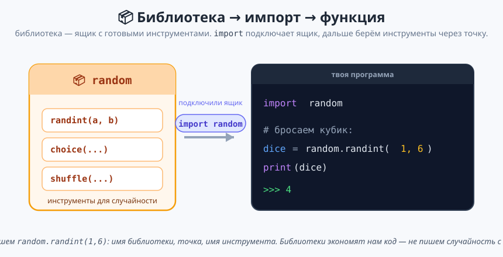
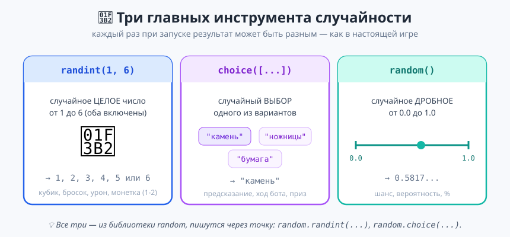

# Урок 3 — «Библиотека random»: случайность в программах 🎲🔮

**Модуль 1 · Первые шаги в Python · Урок 3 из 5 | 2 ак.ч. (1,5 часа)**

> ⬅️ Предыдущий: [Урок 2 «Калькулятор + генератор ников»](../урок-02-калькулятор-и-ники/урок.md) · [Все уроки модуля](../README.md) · Следующий: [Урок 4 «Дата и время»](../урок-04-дата-и-время/урок.md) ➡️

> 🔁 В начале — [разминка/повтор](повторение.md) (5 мин).
> 📌 Быстро вспомнить — [итого.md](итого.md). 👨‍🏫 Хронометраж — [преподавателю.md](преподавателю.md). 🖼 Что показать — [изображения.md](изображения.md).
> 🆘 Пропустил? — [самоучитель.md](самоучитель.md). 🧰 Трюки — [лайфхак.md](лайфхак.md).

> 🧭 **Как читать урок.** Сегодня — важный день: мы подключаем **первую библиотеку**! Библиотека — это **ящик с готовыми инструментами**, который написали за нас другие программисты. Мы возьмём библиотеку **`random`** («случайность») и научим программу **бросать кубик, гадать, выбирать случайный вариант и придумывать пароли**. Без случайности не бывает игр — так что это фундамент для будущего Godot-блока. По ходу — мини-задания ✍️ и разбор ошибок.

---

## 🎮 Что мы сделаем сегодня

**Проекты:**
1. 🔮 **Предсказатель судьбы / Магический шар** — задаёшь вопрос, программа даёт случайный ответ.
2. 🔐 **Генератор паролей** — создаёт случайный PIN и пароль.

**Главные навыки:** что такое **библиотека** и `import` · `random.randint(a, b)` (случайное число) · `random.choice(...)` (случайный выбор) · `random.random()` (дробное 0–1) · немного библиотеки **`math`** (`sqrt`, `pi`, `floor`, `ceil`) · разбор ошибок (`NameError` без импорта, `ModuleNotFoundError`).

> 💡 **Главная мысль:** **не нужно писать всё с нуля — многое уже готово в библиотеках.** Программист сначала спрашивает: «а нет ли готового инструмента?» — и часто он есть. `import` подключает такой инструмент к твоей программе.

---

## Часть 1 — Что такое библиотека и `import` (10 минут)

Представь ящик с инструментами: молоток, отвёртка, пила. В программировании такой ящик называется **библиотека (модуль)** — набор готовых команд-инструментов на одну тему. Чтобы им пользоваться, ящик надо **подключить** — командой **`import`**:



```python
import random          # подключили ящик "random" (обычно — в самой первой строке)

dice = random.randint(1, 6)   # берём инструмент из ящика через точку
print(dice)
```

- 👀 **Что видишь:** случайное число от 1 до 6. **Запусти ещё раз** — число, скорее всего, **изменится**! В этом вся суть случайности.

Как читается `random.randint(1, 6)`:
- **`random`** — имя библиотеки (ящика).
- **точка `.`** — «возьми из него...».
- **`randint(1, 6)`** — инструмент «случайное целое от 1 до 6».

> 💡 **`import` пишут в самом верху файла**, один раз. После этого все инструменты библиотеки доступны через `random.` до конца программы.

> ✍️ **Мини-задание 1 (1 мин):** подключи `random` и выведи случайное число от 1 до 100.
> <details><summary>💡 подсказка</summary><code>import random</code>, затем <code>print(random.randint(1, 100))</code>.</details>

> ⚠️ **Ошибка `NameError: name 'random' is not defined`:** забыл `import random` в начале. Библиотеку нужно **сперва подключить**, иначе Python не знает такого слова.

---

## Часть 2 — `randint`: случайное число (10 минут)

**`random.randint(a, b)`** возвращает случайное **целое** число от `a` до `b` — **оба конца включены**:



```python
import random

print(random.randint(1, 6))     # кубик: 1..6
print(random.randint(0, 1))     # монетка: 0 или 1
print(random.randint(100, 999)) # трёхзначный код
```

Можно сохранять в переменную и использовать:

```python
import random
damage = random.randint(10, 20)
print(f"Удар нанёс {damage} урона!")
```

> 💡 **`randint(a, b)` включает ОБА числа.** `randint(1, 6)` может выдать и 1, и 6 — как настоящий кубик. Это важно: `randint(1, 6)` даёт 6 вариантов, а не 5.

> 🧰 **Проверь, что случайно:** запусти программу 3–4 раза — число должно **меняться**. Если оно всегда одинаковое, скорее всего, ты сохранил его в переменную один раз и печатаешь повторно. Нужно новое число — вызови `randint` **снова**.

> ✍️ **Мини-задание 2 (2 мин):** «бросок кубика» — выведи f-строкой `Выпало: N` для случайного N от 1 до 6.
> <details><summary>💡 подсказка</summary><code>n = random.randint(1, 6)</code>, затем <code>print(f"Выпало: {n}")</code>.</details>

---

## Часть 3 — `choice`: случайный выбор (10 минут)

Часто нужно выбрать не число, а **один вариант из нескольких**. Для этого — **`random.choice(...)`**. Варианты перечисляем в **квадратных скобках через запятую** — это **список** (подробно про списки будет в Модуле 4, пока просто «набор вариантов»):

```python
import random

answer = random.choice(["Да", "Нет", "Может быть", "Спроси позже"])
print(answer)
```

- 👀 **Что видишь:** один случайный ответ из четырёх. Запусти несколько раз — ответы меняются.

`choice` работает с любым набором вариантов:

```python
color = random.choice(["красный", "синий", "зелёный", "жёлтый"])
hero = random.choice(["воин", "маг", "лучник"])
print(f"Сегодня твой цвет — {color}, а класс героя — {hero}.")
```

> 💡 **`choice` — сердце многих игр:** ход бота в «камень-ножницы-бумага», случайный приз, случайная фраза NPC, выбор карты. Запомни его — будем использовать постоянно.

> ✍️ **Мини-задание 3 (2 мин):** сделай «случайный комплимент» — программа выбирает одну из 3–4 приятных фраз и выводит её.
> <details><summary>💡 подсказка</summary><code>random.choice(["Ты умница!", "Отличная работа!", "Так держать!"])</code>.</details>

> ⚠️ **Ошибка:** забыть квадратные скобки — `random.choice("Да", "Нет")` даст ошибку. Варианты должны быть **внутри одного списка**: `random.choice(["Да", "Нет"])`.

---

## Часть 4 — Проект «Предсказатель судьбы» 🏆 (10 минут)

Соберём магический шар предсказаний:

```python
import random

# ===== МАГИЧЕСКИЙ ШАР =====
print("Задай мне вопрос, на который можно ответить да/нет...")
question = input("Твой вопрос: ")

answer = random.choice([
    "Определённо да!",
    "Скорее всего, да",
    "Хм... спроси позже",
    "Мои источники говорят: нет",
    "Даже не думай",
    "Возможно, если постараешься",
])

print("=" * 30)
print(f"Ты спросил: {question}")
print(f"Шар отвечает: {answer}")
```

- 👀 **Что видишь:** программа принимает любой вопрос и даёт случайный «мистический» ответ. Классика!

> 💡 **Разбор:** список ответов можно писать **в несколько строк** (так удобнее читать) — Python понимает, что список не закончился, пока не встретит закрывающую `]`. Сам вопрос мы не анализируем (для этого нужны условия — Модуль 2), а просто выдаём случайный ответ.

> ✍️ **Мини-задание 4 (2 мин):** добавь в шар ещё 2 своих ответа (смешных).

---

## Часть 5 — Библиотека `math`: точные вычисления (10 минут)

Ещё один полезный ящик — **`math`** (математика). В нём — то, чего нет в обычных операциях:

```python
import math

print(math.sqrt(16))     # 4.0   — квадратный корень
print(math.pi)           # 3.141592653589793 — число π
print(math.floor(4.7))   # 4     — округление ВНИЗ (пол)
print(math.ceil(4.2))    # 5     — округление ВВЕРХ (потолок)
```

Пример — длина окружности:

```python
import math
r = 5
print(f"Длина окружности: {2 * math.pi * r:.2f}")   # 31.42
```

**Ещё пример — сколько нужно коробок** (здесь всегда округляем ВВЕРХ):

```python
import math
apples = 23
in_box = 10
print(math.ceil(apples / in_box))   # 3 — на 23 яблока нужно 3 коробки
```

- 👀 `23 / 10 = 2.3`, но двух коробок мало — поэтому `ceil` (потолок) даёт `3`. Правило: для «сколько нужно» (коробки, машины, страницы) бери `ceil`, а не `round`.

> 💡 **`floor` vs `ceil` vs `round`:** `floor` всегда вниз (4.9 → 4), `ceil` всегда вверх (4.1 → 5), `round` — к ближайшему (4.5 → 4 или 5). Выбирай по смыслу: «сколько целых коробок нужно» — это `ceil`.

> ✍️ **Мини-задание 5 (2 мин):** спроси число и выведи его квадратный корень (`math.sqrt`).
> <details><summary>💡 подсказка</summary><code>import math</code>, <code>n = int(input(...))</code>, <code>print(math.sqrt(n))</code>.</details>

> ⚠️ **Ошибка `ModuleNotFoundError: No module named 'maths'`:** опечатка в имени библиотеки (`maths` вместо `math`). Имена библиотек пишем точно.

---

## Часть 6 — Проект «Генератор паролей» 🏆 (12 минут)

Сделаем генератор: случайный **PIN-код** и **пароль** из случайных символов.

```python
import random

# ===== ГЕНЕРАТОР ПАРОЛЕЙ =====
name = input("Введи имя (для основы пароля): ").strip()

# 1. Случайный 4-значный PIN
pin = random.randint(1000, 9999)

# 2. Пароль: имя + случайный символ + случайное число
symbol = random.choice(["!", "@", "#", "$", "%", "&", "*"])
password = name.lower() + symbol + str(random.randint(10, 99))

print("=" * 30)
print(f"Твой PIN-код: {pin}")
print(f"Твой пароль:  {password}")
print("(запиши и никому не показывай!)")
```

- 👀 **Что видишь:** например, PIN `4821` и пароль `гера@57`. Каждый запуск — новые.

> 💡 **Разбор:** `random.randint(1000, 9999)` даёт ровно 4 цифры. Пароль собираем **склейкой строк**, поэтому число оборачиваем в `str(...)` (склеивать можно только строки — помнишь `TypeError` из урока 1?). Пароль настоящей длины (с циклом) сделаем в Модуле 3.

> ✍️ **Мини-задание 6 (3 мин):** добавь в конец пароля ещё один случайный символ, чтобы он стал надёжнее.
> <details><summary>💡 подсказка</summary>ещё раз <code>random.choice([...])</code> и приклей через <code>+</code>.</details>

---

## 🐞 Разбор частых ошибок

| Сообщение Python | Что случилось | Как починить |
|------------------|---------------|--------------|
| `NameError: name 'random' is not defined` | забыл `import random` | добавь `import random` в начало |
| `ModuleNotFoundError: No module named 'randon'` | опечатка в имени библиотеки | пиши точно: `random`, `math` |
| `TypeError` при склейке пароля | склеил число со строкой | оберни число в `str(...)` |
| `choice` выдаёт ошибку | забыл `[ ]` вокруг вариантов | `random.choice(["a", "b"])` |
| число «не меняется» | одно и то же значение сохранено в переменную | случайность вызывается один раз — вызови `randint` снова |

---

## 🎓 Часть 7 — Глубже (по времени)

- **`random.shuffle(колода)`** — перемешивает список на месте (пригодится для карт; списки — Модуль 4).
- **`random.random()`** — дробное от 0.0 до 1.0. Шанс события: `if random.random() < 0.3` → «30% вероятность» (условия — Модуль 2).
- **`random.uniform(1.5, 6.5)`** — случайное **дробное** в диапазоне.
- **`import random as r`** — короткое имя (псевдоним): потом пишешь `r.randint(...)`. Подробнее про `import ... as` — в Модуле 6.
- **Зерно `random.seed(42)`** — «фиксирует» случайность (одинаковые результаты для отладки).

---

## 🧩 Для 5–7 классов (проще)

- Хватит `randint` и `choice` — этого достаточно для кубика, предсказателя и простого пароля.
- `math` показать на одном примере (корень или π), не углубляясь во `floor/ceil`.
- Генератор паролей — только PIN через `randint`, без склейки символов.

---

## 🏁 Итог урока

- ✅ **Библиотека** — ящик готовых инструментов; **`import`** подключает его.
- ✅ **`random.randint(a, b)`** — случайное целое (оба конца включены).
- ✅ **`random.choice([...])`** — случайный выбор из вариантов.
- ✅ **`random.random()`** — дробное 0–1 (для шансов).
- ✅ **`math`** — `sqrt`, `pi`, `floor`, `ceil`.
- ✅ Разобрали `NameError` (без импорта) и `ModuleNotFoundError`.

> 🏆 Главное: **готовый код живёт в библиотеках — подключай и пользуйся.** Быстрое повторение — [итого.md](итого.md).

> 🎤 **Блиц:** что делает `import`? сколько вариантов даёт `randint(1, 6)`? чем `choice` отличается от `randint`? какая ошибка, если забыть `import`? что вернёт `math.sqrt(9)`?

### 🎮 Викторина-закрепление
Открой **[викторина.html](викторина.html)** — про библиотеки, `randint`, `choice`, `math` + смешные и «на подумать».

➡️ **Практика** — **[практика.md](практика.md)** (задачи с подсказками).
🆘 [самоучитель.md](самоучитель.md) · 🧰 [лайфхак.md](лайфхак.md) · 📌 [итого.md](итого.md)

---

## 🔗 Навигация и материалы

⬅️ [Урок 2](../урок-02-калькулятор-и-ники/урок.md) · [Все уроки модуля](../README.md) · **Следующий:** [Урок 4 «Дата и время»](../урок-04-дата-и-время/урок.md) ➡️

**📄 Готовый код:** [`материалы/предсказатель.py`](материалы/предсказатель.py) · [`материалы/генератор_паролей.py`](материалы/генератор_паролей.py) (проверены запуском).
