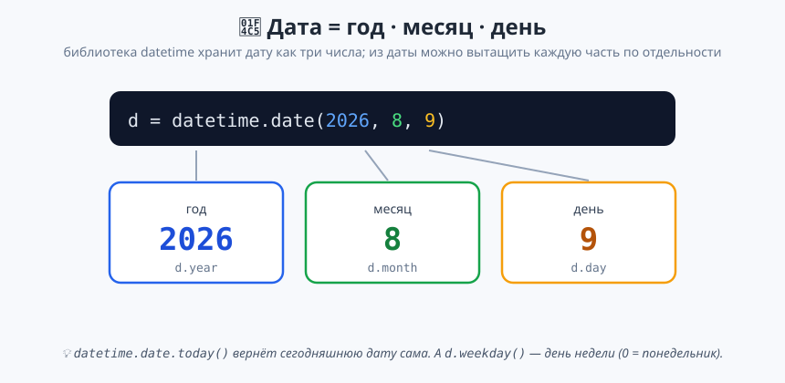
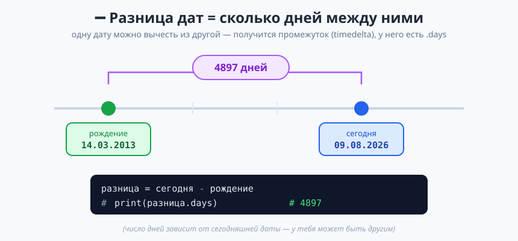

# Урок 4 — «Дата и время»: библиотеки datetime и time 📅⏰

**Модуль 1 · Первые шаги в Python · Урок 4 из 5 | 2 ак.ч. (1,5 часа)**

> ⬅️ Предыдущий: [Урок 3 «Библиотека random»](../урок-03-random/урок.md) · [Все уроки модуля](../README.md) · Следующий: [Урок 5 «Бот-знакомец»](../урок-05-бот-знакомец/урок.md) ➡️

> 🔁 В начале — [разминка/повтор](повторение.md) (5 мин).
> 📌 Быстро вспомнить — [итого.md](итого.md). 👨‍🏫 Хронометраж — [преподавателю.md](преподавателю.md). 🖼 Что показать — [изображения.md](изображения.md).
> 🆘 Пропустил? — [самоучитель.md](самоучитель.md). 🧰 Трюки — [лайфхак.md](лайфхак.md).

> 🧭 **Как читать урок.** Программа может **знать текущую дату и время** — как часы на телефоне. Сегодня подключим библиотеку **`datetime`** и научимся: узнавать сегодняшнюю дату, считать **разницу между датами** (сколько дней ты уже прожил, сколько осталось до праздника), определять **день недели**. А библиотека **`time`** даст нам **паузы** — сделаем таймер обратного отсчёта. Всё как всегда: мини-задания ✍️ и разбор ошибок.

---

## 🎮 Что мы сделаем сегодня

**Проекты:**
1. 🎂 **«Возраст в днях»** — сколько дней ты живёшь на свете (число впечатляет!).
2. 🎉 **«Сколько дней до…»** — обратный счётчик до дня рождения / Нового года.
3. 🚀 **«Таймер запуска»** — обратный отсчёт с паузами (3… 2… 1… Пуск!).

**Главные навыки:** библиотека `datetime` · `date.today()` (сегодня) · создание даты `date(год, месяц, день)` · части даты `.year/.month/.day` · **разница дат** (`.days`) · день недели `.weekday()` · библиотека `time` и `time.sleep()` · разбор ошибок.

> 💡 **Главная мысль:** **дата — это не просто текст, а особый тип данных, с которым можно считать.** `"9 августа"` — просто строка, а `date(2026, 8, 9)` — настоящая дата: её можно сравнить с другой, вычесть, узнать день недели.

---

## Часть 1 — Библиотека `datetime`: какое сегодня число (10 минут)

Подключаем библиотеку и спрашиваем сегодняшнюю дату:

```python
import datetime

today = datetime.date.today()
print(today)          # 2026-08-09  (год-месяц-день)
```

- 👀 **Что видишь:** сегодняшнюю дату в формате `ГГГГ-ММ-ДД`. У тебя будет **своя** — та, что стоит на компьютере.

Дата состоит из **трёх чисел**, и каждое можно вытащить отдельно:



```python
import datetime

today = datetime.date.today()
print(f"Год: {today.year}")     # Год: 2026
print(f"Месяц: {today.month}")  # Месяц: 8
print(f"День: {today.day}")     # День: 9
```

> 💡 **`.year`, `.month`, `.day` — без скобок!** Это не команды-действия, а **свойства** даты (как у коробки «переменная» — её содержимое). Скобки нужны у действий вроде `today()`, а у свойств — нет.

**Красивый формат даты.** Вид `ГГГГ-ММ-ДД` — не привычный нам. Метод `.strftime(...)` собирает дату в любом виде:

```python
import datetime
today = datetime.date.today()
print(today.strftime("%d.%m.%Y"))   # 09.08.2026 — день.месяц.год, как в России
```

- 👀 `%d` — день, `%m` — месяц, `%Y` — год (4 цифры). Порядок и разделители выбираешь сам: `"%d.%m.%Y"` или `"%Y/%m/%d"`. Удобно показывать дату пользователю.

> ✍️ **Мини-задание 1 (2 мин):** выведи f-строкой `Сегодня 9 число 8 месяца 2026 года` (числа бери из `today`).
> <details><summary>💡 подсказка</summary><code>f"Сегодня {today.day} число {today.month} месяца {today.year} года"</code>.</details>

> ⚠️ **Ошибка `NameError: name 'datetime'`:** забыл `import datetime` в начале. И помни: пишем `datetime.date.today()` — сначала библиотека, потом `date`, потом `today()`.

---

## Часть 2 — Создаём свою дату (10 минут)

Любую дату можно «собрать» вручную командой `datetime.date(год, месяц, день)`:

```python
import datetime

birthday = datetime.date(2013, 3, 14)   # 14 марта 2013
print(birthday)                          # 2013-03-14
print(f"Родился в {birthday.year} году") # Родился в 2013 году
```

> 💡 **Порядок строгий: год, месяц, день.** `date(2013, 3, 14)` — это 14 марта. Не перепутай: сначала год (4 цифры), потом месяц (1–12), потом день (1–31).

> ✍️ **Мини-задание 2 (2 мин):** создай дату своего рождения и выведи, в каком году и месяце ты родился.
> <details><summary>💡 подсказка</summary><code>bd = datetime.date(ГОД, МЕСЯЦ, ДЕНЬ)</code>, потом <code>bd.year</code> и <code>bd.month</code>.</details>

> ⚠️ **Ошибка `ValueError: day is out of range for month`:** попросил несуществующую дату, например `date(2013, 2, 30)` (30 февраля не бывает). Python проверяет реальность даты.

---

## Часть 3 — Разница дат: считаем дни (12 минут)

Самое интересное: **одну дату можно вычесть из другой** — получится промежуток, у которого есть **`.days`** (сколько дней между ними):



```python
import datetime

today = datetime.date.today()
birthday = datetime.date(2013, 3, 14)

diff = today - birthday      # разница двух дат
print(diff.days)             # например, 4897 — сколько дней между датами
```

- 👀 **Что видишь:** число дней между датой рождения и сегодня. Это твой **возраст в днях**!

> 💡 **Почему это работает:** даты — особый тип, Python «под капотом» знает, сколько дней в каждом месяце и году (даже про високосные!). Нам не нужно это считать — просто `today - birthday`, и берём `.days`.

> ✍️ **Мини-задание 3 (2 мин):** посчитай, сколько дней прошло с 1 января этого года до сегодня.
> <details><summary>💡 подсказка</summary><code>start = datetime.date(2026, 1, 1)</code>, затем <code>(today - start).days</code>.</details>

---

## Часть 4 — Проект «Возраст в днях» 🏆 (10 минут)

```python
import datetime

# ===== ВОЗРАСТ В ДНЯХ =====
print("Введи дату рождения.")
year = int(input("Год (например 2013): "))
month = int(input("Месяц (1-12): "))
day = int(input("День (1-31): "))

birthday = datetime.date(year, month, day)
today = datetime.date.today()

age_days = (today - birthday).days
age_years = age_days // 365

print("=" * 30)
print(f"Ты живёшь на свете уже {age_days} дней!")
print(f"Это примерно {age_years} лет.")
print(f"А ещё это около {age_days * 24} часов.")
```

- 👀 **Что видишь:** программа берёт дату рождения и выдаёт впечатляющее число прожитых дней и часов.

> 💡 **Разбор:** возраст в годах считаем `age_days // 365` (деление нацело из урока 2!). Это приблизительно (без учёта високосных), но для «сколько тебе лет» — то что надо. Видишь, как навыки из прошлых уроков (`//`, f-строки, `int(input)`) складываются вместе.

> ✍️ **Мини-задание 4 (2 мин):** добавь строку — сколько примерно **недель** ты прожил.
> <details><summary>💡 подсказка</summary>недели — это дни делить на 7: <code>age_days // 7</code>.</details>

---

## Часть 5 — День недели (10 минут)

У даты есть метод **`.weekday()`** — он возвращает **номер дня недели**: 0 = понедельник, 1 = вторник, ... 6 = воскресенье.

```python
import datetime

today = datetime.date.today()
print(today.weekday())   # например, 6 (воскресенье)
```

Номер — это хорошо, но хочется **название**. Возьмём список названий и обратимся по номеру-индексу (индексы мы уже умеем, урок 2!):

```python
import datetime

names = ["понедельник", "вторник", "среда", "четверг", "пятница", "суббота", "воскресенье"]
today = datetime.date.today()
print(f"Сегодня {names[today.weekday()]}")   # Сегодня воскресенье
```

> 💡 **Как это работает:** `today.weekday()` даёт число 0–6, а `names[число]` берёт из списка название на этом месте. Здесь встречаются две темы: индексы (урок 2) и списки (лёгкое знакомство, урок 3). Списки полностью изучим в Модуле 4.

> ✍️ **Мини-задание 5 (2 мин):** создай дату своего дня рождения в этом году и узнай, на какой день недели он выпадает.
> <details><summary>💡 подсказка</summary><code>bd = datetime.date(2026, МЕСЯЦ, ДЕНЬ)</code>, затем <code>names[bd.weekday()]</code>.</details>

---

## Часть 6 — Проект «Сколько дней до…» 🏆 (10 минут)

Обратный счётчик до важной даты:

```python
import datetime

# ===== СКОЛЬКО ДНЕЙ ДО НОВОГО ГОДА =====
today = datetime.date.today()
new_year = datetime.date(2027, 1, 1)

left = (new_year - today).days
print(f"До Нового года осталось {left} дней! 🎄")   # эмодзи — только в комментарии/тексте, не в print
```

⚠️ В коде выше эмодзи стоит внутри `print` — **на Windows-консоли это уронит программу**. В рабочем коде эмодзи из `print` убираем (см. [лайфхак](лайфхак.md)). Правильная строка:

```python
print(f"До Нового года осталось {left} дней!")
```

**А до дня рождения?** Соберём дату ДР в этом году и посчитаем разницу:

```python
import datetime

today = datetime.date.today()
bday_this_year = datetime.date(2026, 12, 25)   # твой ДР в этом году
left = (bday_this_year - today).days
print(f"До дня рождения (в этом году) осталось {left} дней.")
```

> 💡 **Честное ограничение:** если ДР в этом году **уже прошёл**, число будет **отрицательным** (например, `-30`). Чтобы программа сама понимала «прошёл → считаем до следующего года», нужны **условия** (`if`) — это ровно следующий модуль. Пока считаем «в этом году» — и это отличный повод перейти к Модулю 2!

**Можно не только вычитать, но и прибавлять дни.** Узнать, какая дата будет через N дней, помогает `datetime.timedelta`:

```python
import datetime

today = datetime.date.today()
through_100 = today + datetime.timedelta(days=100)
print(f"Через 100 дней будет {through_100}")
```

- 👀 `timedelta(days=100)` — это «промежуток в 100 дней». Прибавили к сегодня — получили будущую дату. Так же можно `- timedelta(days=7)` (неделю назад).

> ✍️ **Мини-задание 6 (2 мин):** посчитай, сколько дней осталось до летних каникул (1 июня 2027).
> <details><summary>💡 подсказка</summary><code>datetime.date(2027, 6, 1)</code> минус <code>today</code>, взять <code>.days</code>.</details>

---

## Часть 7 — Библиотека `time`: паузы и таймер (10 минут)

Библиотека **`time`** умеет **делать паузу** командой `time.sleep(секунды)`:

```python
import time

print("Приготовься...")
time.sleep(2)          # пауза 2 секунды
print("Начали!")
```

- 👀 **Что видишь:** `Приготовься...`, затем через 2 секунды — `Начали!`. Программа реально ждёт.

Сделаем **таймер запуска ракеты** (обратный отсчёт с паузами):

```python
import time

print("Запуск через:")
print(3)
time.sleep(1)
print(2)
time.sleep(1)
print(1)
time.sleep(1)
print("ПУСК!")
```

- 👀 **Что видишь:** числа 3, 2, 1 появляются **по одному в секунду**, потом «ПУСК!». Настоящий отсчёт!

> 💡 **`time.sleep(1)` = пауза 1 секунда.** Можно и дробное: `time.sleep(0.5)` — полсекунды. Пока отсчёт мы пишем «руками» (три раза), а красиво в цикле — в Модуле 3.

> ✍️ **Мини-задание 7 (2 мин):** сделай отсчёт от 5 до 1 с паузами по 1 секунде, потом выведи «Старт!».
> <details><summary>💡 подсказка</summary>пять раз: <code>print(число)</code> и <code>time.sleep(1)</code>, затем финальная строка.</details>

---

## 🐞 Разбор частых ошибок

| Сообщение Python | Что случилось | Как починить |
|------------------|---------------|--------------|
| `NameError: name 'datetime'` | забыл `import datetime` | добавь импорт в начало |
| `ValueError: day is out of range for month` | несуществующая дата (30 февраля) | проверь день/месяц |
| `ValueError: month must be in 1..12` | месяц вне 1–12 | месяц — число от 1 до 12 |
| `TypeError: ... 'datetime.date'` при `today.day()` | у свойства поставил скобки | `.day`, `.year`, `.month` — **без** скобок |
| эмодзи в `print` роняет на Windows | эмодзи в выводе | эмодзи только в тексте/комментариях |

---

## 🎓 Часть 8 — Глубже (по времени)

- **Дата и время вместе:** `datetime.datetime.now()` — не только дата, но и часы-минуты-секунды (`.hour`, `.minute`).
- **Красивый формат:** `today.strftime("%d.%m.%Y")` → `09.08.2026` (день.месяц.год как в России).
- **Прибавить дни:** `today + datetime.timedelta(days=100)` — какая дата будет через 100 дней.
- **Секундомер:** `start = time.time()` в начале, `time.time() - start` в конце — сколько секунд прошло.

---

## 🧩 Для 5–7 классов (проще)

- Хватит `date.today()`, `.year/.month/.day` и разницы дат (возраст в днях) — это уже «вау».
- День недели — показать номер `.weekday()`, список названий дать готовым (не углубляться).
- Таймер `time.sleep` — самый весёлый момент, оставить время на него.

---

## 🏁 Итог урока

- ✅ **`datetime`** — библиотека дат; `date.today()` — сегодня.
- ✅ **Создание даты** `date(год, месяц, день)`; части `.year/.month/.day` (без скобок!).
- ✅ **Разница дат** — вычитание, `.days` (возраст в днях, дни до праздника).
- ✅ **День недели** `.weekday()` (0 = понедельник) + список названий по индексу.
- ✅ **`time.sleep(секунды)`** — пауза, таймер обратного отсчёта.

> 🏆 Главное: **дата — тип данных, с которым можно считать.** Быстрое повторение — [итого.md](итого.md).

> 🎤 **Блиц:** как узнать сегодняшнюю дату? почему у `.day` нет скобок? как посчитать дни между двумя датами? что вернёт `.weekday()` в среду? что делает `time.sleep(3)`?

### 🎮 Викторина-закрепление
Открой **[викторина.html](викторина.html)** — про `datetime`, разницу дат, день недели, `time.sleep` + смешные и «на подумать».

➡️ **Практика** — **[практика.md](практика.md)** (задачи с подсказками).
🆘 [самоучитель.md](самоучитель.md) · 🧰 [лайфхак.md](лайфхак.md) · 📌 [итого.md](итого.md)

---

## 🔗 Навигация и материалы

⬅️ [Урок 3](../урок-03-random/урок.md) · [Все уроки модуля](../README.md) · **Следующий:** [Урок 5 «Бот-знакомец»](../урок-05-бот-знакомец/урок.md) ➡️

**📄 Готовый код:** [`материалы/возраст_в_днях.py`](материалы/возраст_в_днях.py) · [`материалы/таймер.py`](материалы/таймер.py) (проверены запуском).
