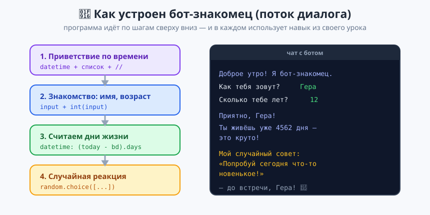
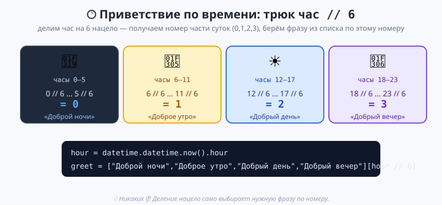

# Урок 5 — «Бот-знакомец»: собираем всё вместе 🤖🎉

**Модуль 1 · Первые шаги в Python · Урок 5 из 5 (итоговый) | 2 ак.ч. (1,5 часа)**

> ⬅️ Предыдущий: [Урок 4 «Дата и время»](../урок-04-дата-и-время/урок.md) · [Все уроки модуля](../README.md) · Дальше — Модуль 2 «Условия и логика» ➡️

> 🔁 В начале — [разминка/повтор](повторение.md) (5 мин).
> 📌 Быстро вспомнить — [итого.md](итого.md). 👨‍🏫 Хронометраж — [преподавателю.md](преподавателю.md). 🖼 Что показать — [изображения.md](изображения.md).
> 🆘 Пропустил? — [самоучитель.md](самоучитель.md). 🧰 Трюки — [лайфхак.md](лайфхак.md).

> 🧭 **Как читать урок.** Это **итоговый урок модуля** — почти без новой теории. Сегодня мы **соберём один большой проект**, в котором работают ВСЕ навыки: `input`, f-строки, числа, строки, `random` и `datetime`. Построим **бота-знакомца** — программу, которая здоровается по времени суток, знакомится, считает, сколько дней ты живёшь, и даёт случайный совет. Строим по шагам, каждый шаг запускаем и проверяем.

---

## 🎮 Что мы сделаем сегодня

**Проект «Бот-знакомец»** — программа-собеседник:

```
Доброе утро! Я бот-знакомец. 🤖
Как тебя зовут? Гера
Сколько тебе лет? 12
------------------------------
Приятно познакомиться, Гера!
Ты живёшь на свете уже 4562 дня — вот это да!
Через 10 лет тебе будет 22.
Мой случайный совет: Попробуй сегодня что-то новенькое!
До встречи, Гера!
```

**Главные навыки (всё из модуля вместе):** `input`/`int(input)` · f-строки · арифметика и `//` · склейка строк · `random.choice` · `datetime` (дата, разница дат, `.now().hour`). **Новый приём:** приветствие по времени суток **без условий** — через трюк `час // 6` и список.

> 💡 **Главная мысль модуля:** **большая программа собирается из маленьких кирпичиков, которые ты уже знаешь.** Не нужно уметь «всё сразу» — нужно соединять простые шаги по порядку.

---

## Часть 1 — План бота (5 минут)

Прежде чем писать код, набросаем **план** — что бот делает по шагам:



1. **Поздороваться** по времени суток (утро/день/вечер/ночь).
2. **Познакомиться** — спросить имя и возраст.
3. **Посчитать** — сколько дней живёт, сколько будет через 10 лет.
4. **Отреагировать** — дать случайный совет/комплимент.
5. **Попрощаться** по имени.

> 💡 **Так работают настоящие программисты:** сначала план (что и в каком порядке), потом код. План — это карта, по которой легко писать и не запутаться.

---

## Часть 2 — Приветствие по времени суток (12 минут)

Бот должен здороваться правильно: утром «Доброе утро», вечером «Добрый вечер». Узнаем **текущий час** через `datetime`:

```python
import datetime

hour = datetime.datetime.now().hour   # текущий час: 0..23
print(hour)
```

- 👀 **Что видишь:** число от 0 до 23 — сколько сейчас часов.

Теперь — **красивый трюк без условий** (условия будут в Модуле 2). Разделим час на 6 нацело — получим номер части суток, и возьмём фразу из списка по этому номеру:



```python
import datetime

hour = datetime.datetime.now().hour
greetings = ["Доброй ночи", "Доброе утро", "Добрый день", "Добрый вечер"]
greeting = greetings[hour // 6]
print(greeting)
```

- 👀 **Что видишь:** приветствие, подходящее текущему времени. Утром (6–11) — «Доброе утро», днём (12–17) — «Добрый день» и т.д.

> 💡 **Как работает трюк:** `hour // 6` для часов 0–5 даёт `0`, для 6–11 даёт `1`, для 12–17 — `2`, для 18–23 — `3`. Ровно четыре части суток! А `greetings[номер]` берёт нужную фразу. Здесь вместе работают **деление нацело** (урок 2), **списки** (урок 3) и **индексы** (урок 2).

> ✍️ **Мини-задание 1 (2 мин):** проверь трюк — временно поставь `hour = 20` вручную и убедись, что выводится «Добрый вечер».
> <details><summary>💡 подсказка</summary>Замени строку на <code>hour = 20</code>, запусти. <code>20 // 6 = 3</code> → «Добрый вечер».</details>

---

## Часть 3 — Знакомство (10 минут)

Спросим имя и возраст (это мы умеем с урока 1):

```python
name = input("Как тебя зовут? ").strip()
age = int(input("Сколько тебе лет? "))

print(f"Приятно познакомиться, {name}!")
print(f"Через 10 лет тебе будет {age + 10}.")
```

- 👀 **Что видишь:** бот здоровается по имени и считает возраст через 10 лет.

> 💡 `.strip()` убирает случайные пробелы (урок 2), `int(...)` делает возраст числом (урок 1), f-строки красиво выводят. Каждый навык — на своём месте.

> ✍️ **Мини-задание 2 (2 мин):** добавь вопрос про любимую игру и реплику бота `О, <игра> — отличный выбор!`
> <details><summary>💡 подсказка</summary><code>game = input(...)</code>, потом f-строка с <code>{game}</code>.</details>

---

## Часть 4 — Сколько дней ты живёшь (10 минут)

Добавим «вау-факт» — сколько дней прожил (datetime, урок 4). Спросим дату рождения:

```python
import datetime

year = int(input("Год рождения (например 2013): "))
month = int(input("Месяц рождения (1-12): "))
day = int(input("День рождения (1-31): "))

birthday = datetime.date(year, month, day)
today = datetime.date.today()
days_lived = (today - birthday).days

print(f"Ты живёшь на свете уже {days_lived} дней — вот это да!")
```

- 👀 **Что видишь:** большое число прожитых дней — всегда впечатляет.

> ✍️ **Мини-задание 3 (2 мин):** добавь строку — сколько это примерно недель (`// 7`).

---

## Часть 5 — Случайная реакция (8 минут)

Пусть бот каждый раз даёт **разный** совет (random, урок 3):

```python
import random

advice = random.choice([
    "Попробуй сегодня что-то новенькое!",
    "Не забудь улыбнуться сегодня.",
    "Ты справишься с чем угодно.",
    "Сделай перерыв и попей воды.",
    "Позвони другу, которого давно не слышал.",
])
print(f"Мой случайный совет: {advice}")
```

- 👀 **Что видишь:** случайный совет — при каждом запуске новый.

> ✍️ **Мини-задание 4 (2 мин):** добавь боту 2 своих совета в список.

---

## Часть 6 — Собираем полного бота 🏆 (18 минут)

Теперь соединим все части в одну программу. **Импорты — вверху один раз.** Строим сверху вниз по плану:

```python
import datetime
import random
import time

# ===== БОТ-ЗНАКОМЕЦ =====

# 1. Приветствие по времени суток
hour = datetime.datetime.now().hour
greetings = ["Доброй ночи", "Доброе утро", "Добрый день", "Добрый вечер"]
print(f"{greetings[hour // 6]}! Я бот-знакомец.")
time.sleep(1)   # небольшая пауза для эффекта

# 2. Знакомство
name = input("Как тебя зовут? ").strip()
age = int(input("Сколько тебе лет? "))
year = int(input("Год рождения (например 2013): "))
month = int(input("Месяц рождения (1-12): "))
day = int(input("День рождения (1-31): "))

# 3. Считаем
birthday = datetime.date(year, month, day)
today = datetime.date.today()
days_lived = (today - birthday).days

# 4. Случайный совет
advice = random.choice([
    "Попробуй сегодня что-то новенькое!",
    "Не забудь улыбнуться сегодня.",
    "Ты справишься с чем угодно.",
    "Сделай перерыв и попей воды.",
])

# 5. Выводим всё красиво
print("=" * 34)
print(f"Приятно познакомиться, {name}!")
print(f"Ты живёшь на свете уже {days_lived} дней — вот это да!")
print(f"Через 10 лет тебе будет {age + 10}.")
print(f"Мой случайный совет: {advice}")
print(f"До встречи, {name}!")
```

- 👀 **Что видишь:** полноценный бот-собеседник, который здоровается по времени, знакомится, считает и советует. **Твоя самая большая программа на данный момент!**

> 💡 **Разбор архитектуры:** заметь структуру — сначала все `import`, потом код по шагам плана (приветствие → ввод → расчёт → вывод). Такой порядок («ввод → обработка → вывод») — основа почти любой программы.

> 🧰 **Отладка большой программы:** если что-то пошло не так — **вставь `print()` посередине**, чтобы подсмотреть промежуточные значения: `print("hour =", hour)` или `print("days_lived =", days_lived)`. Сразу видно, на каком шаге «сломалось». Это главный инструмент, когда программа большая: не гадай — распечатай.

> ✍️ **Мини-задание 5 (3 мин):** запусти бота и покажи соседу. Потом поменяй что-нибудь своё: имя бота, тексты, добавь ещё один вопрос.

---

## ✅ Как правильно / ❌ Как НЕ надо (большая программа)

| ❌ Как НЕ надо | ✅ Как правильно |
|----------------|------------------|
| `import` в середине кода | Все `import` — **вверху**, один раз |
| Писать всё сразу и запускать в конце | Строить **по шагам**, запускать после каждого |
| Считать возраст из `input` без `int()` | `int(input(...))` для чисел |
| Эмодзи внутри `print(...)` | Эмодзи — только в тексте урока, не в коде |
| Путаные имена `a`, `b`, `x` | Понятные: `name`, `age`, `days_lived` |
| Один гигантский `print` | Несколько `print` по смыслу + рамка `"="*34` |

---

## 🎓 Часть 7 — Глубже (по времени)

- **Эффект «бот печатает…»:** ставь `time.sleep(0.7)` между репликами — диалог оживёт.
- **Случайное имя бота:** `bot_name = random.choice(["Рекс", "Пиксель", "Бип"])`.
- **Больше фактов:** добавь «сколько дней до Нового года» (урок 4).
- **Заглядывая вперёд:** сейчас бот не проверяет ответы (любой возраст ок). В Модуле 2 научим его **реагировать по-разному** через условия (`if`) — например, по-разному отвечать взрослым и детям.

---

## 🧩 Для 5–7 классов (проще)

- Хватит частей 2, 3 и 5 (приветствие + знакомство + случайный совет) без даты рождения.
- Приветствие по времени можно упростить: просто `print("Привет! Я бот-знакомец.")`.
- Главное — чтобы бот **спрашивал, считал и отвечал** по имени.

---

## 🏁 Итог урока и модуля 1

Ты собрал **самую большую программу за модуль** — бота-знакомца! И это значит, что **весь Модуль 1 пройден**:

- ✅ **Урок 1:** `print`, f-строки, переменные, типы, `input`, `int(input())`.
- ✅ **Урок 2:** арифметика `+ - * / // % **`, методы строк, индексы.
- ✅ **Урок 3:** библиотека `random` — случайность.
- ✅ **Урок 4:** `datetime`/`time` — даты и паузы.
- ✅ **Урок 5:** собрали всё вместе в один проект.

> 🏆 Главное открытие: **большие программы = маленькие знакомые шаги по порядку.** Ты уже умеешь вводить, считать, работать с текстом, случайностью и датами. Быстрое повторение модуля — в [итого.md](итого.md).

> 🎤 **Блиц:** как узнать текущий час? как трюк `час // 6` выбирает приветствие без `if`? почему `import` пишут вверху? из каких 5 шагов состоит наш бот?

### 🎮 Викторина-закрепление
Открой **[викторина.html](викторина.html)** — итоговая по всему модулю 1 + смешные и «на подумать».

➡️ **Практика** — **[практика.md](практика.md)**: доработки и свои боты-программы.
🆘 [самоучитель.md](самоучитель.md) · 🧰 [лайфхак.md](лайфхак.md) · 📌 [итого.md](итого.md)

> ➡️ **Что дальше:** **Модуль 2 «Условия и логика»** — научим программу **принимать решения** (`if/elif/else`): бот начнёт отвечать по-разному, появятся викторины и игра «камень-ножницы-бумага».

---

## 🔗 Навигация и материалы

⬅️ [Урок 4](../урок-04-дата-и-время/урок.md) · [Все уроки модуля](../README.md) · [План курса](../../ПЛАН-КУРСА.md)

**📄 Готовый код:** [`материалы/бот_знакомец.py`](материалы/бот_знакомец.py) (проверен запуском).
