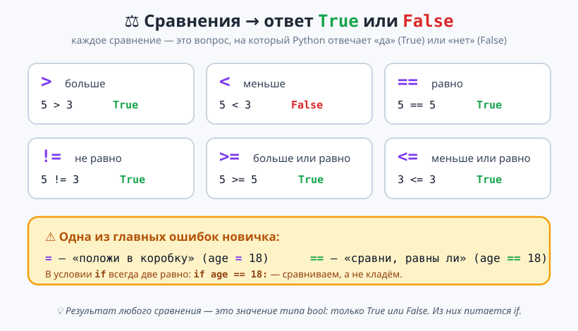
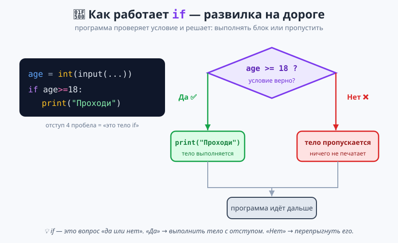
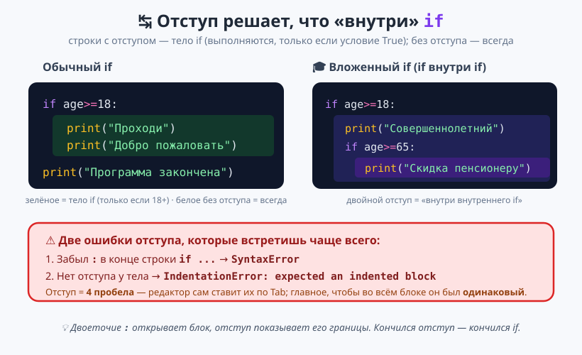

# Урок 1 — «Фейс-контроль»: `if` и сравнения 🔀🚪

**Модуль 2 · Условия и логика · Урок 1 из 5 | 2 ак.ч. (1,5 часа)**

> ⬅️ [Все уроки модуля](../README.md) · [План курса](../../ПЛАН-КУРСА.md) · Следующий: [Урок 2 «else / elif: Оценка по баллам»](../урок-02-else-elif/урок.md) ➡️
> Предыдущий модуль: [Модуль 1 «Первые шаги»](../../модуль-01-первые-шаги/README.md).

> 🔁 В начале — [разминка/повтор](повторение.md) (5 мин).
> 📌 Быстро вспомнить материал урока — [итого.md](итого.md) (шпаргалка).
> 👨‍🏫 Сценарий с хронометражом — в [преподавателю.md](преподавателю.md).
> 🖼 Что показать на проекторе — в [изображения.md](изображения.md).
> 🆘 **Пропустил урок или хочешь закрепить?** Открой [самоучитель.md](самоучитель.md) — теория + задания с подсказками.
> 🧰 Трюки и частые ошибки — в [лайфхак.md](лайфхак.md).

> 🧭 **Как читать урок.** В Модуле 1 наши программы всегда делали **одно и то же**, что бы ты ни ввёл: спросили — посчитали — вывели. Но настоящие программы **принимают решения**: игра проверяет, хватило ли жизней; сайт — верный ли пароль; банкомат — есть ли деньги на карте. Сегодня мы научим программу **выбирать**, что делать, — с помощью **`if`** («если») и **сравнений**. Соберём **«Фейс-контроль»** — программу-охранника, которая решает, пускать гостя или нет. Каждую новую команду сразу закрепляем мини-заданием ✍️ и разбираем ошибки.

---

## 🎮 Что мы сделаем сегодня и что получим

**Задача:** написать программу-«охранника» на вход мероприятия. Она спрашивает имя и возраст, а потом **сама решает**, что ответить: пускать, не пускать, поздравить с совершеннолетием, дать бесплатный вход пожилому гостю.

**В итоге получится** файл `фейс_контроль.py`:

```
================================
ВХОД НА КИБЕР-ТУРНИР
================================
Имя гостя: Гера
Сколько тебе лет? 18
Гера, проходи! Тебе уже есть 18.
О, тебе ровно 18 — поздравляем с совершеннолетием!
--------------------------------
Проверка завершена.
```

**Главные навыки урока:** `if` · сравнения `> < == != >= <=` · тип `bool` (`True`/`False`) · **двоеточие и отступ** · несколько `if` подряд · 🎓 вложенный `if`.

> 💡 **Главная мысль урока:** **`if` — это вопрос «да или нет».** Python проверяет условие, получает `True` или `False`, и **только на `True`** выполняет блок с отступом. Программа впервые может пойти **разными путями**.

---

## Часть 0 — Разминка: программа, которая не выбирает (3 минуты)

Вспомним программу из Модуля 1 — она всегда делает одно и то же:

```python
age = int(input("Сколько тебе лет? "))
print(f"Тебе {age} лет.")
```

Что бы ты ни ввёл — `5`, `18`, `90` — программа ответит **одинаково устроенной** фразой. Она не умеет сказать «а тебе рано» или «а ты уже взрослый». Сегодня добавим ей **выбор**.

---

## Часть 1 — Сравнения: вопросы, на которые Python отвечает `True`/`False` (12 минут)

Прежде чем что-то выбирать, надо уметь **задавать вопрос**. В Python вопрос — это **сравнение**. Открой файл `проба.py` и попробуй прямо в нём:

```python
print(5 > 3)      # True  — 5 больше 3? да
print(5 < 3)      # False — 5 меньше 3? нет
print(10 == 10)   # True  — 10 равно 10? да
print(7 != 3)     # True  — 7 не равно 3? да
```

- 👀 **Что видишь:** `True`, `False`, `True`, `True`. Python **отвечает** на каждый вопрос.

Всего **шесть** операторов сравнения:



| Оператор | Вопрос | Пример | Ответ |
|----------|--------|--------|-------|
| `>` | больше? | `5 > 3` | `True` |
| `<` | меньше? | `5 < 3` | `False` |
| `>=` | больше или равно? | `5 >= 5` | `True` |
| `<=` | меньше или равно? | `3 <= 3` | `True` |
| `==` | **равно?** (две равно!) | `5 == 5` | `True` |
| `!=` | не равно? | `5 != 3` | `True` |

**Ответ сравнения — это новый тип данных `bool`** (от «Boolean», в честь математика Джорджа Буля). У него всего два значения: **`True`** (правда) и **`False`** (ложь). Проверь:

```python
result = 5 > 3
print(result)         # True
print(type(result))   # <class 'bool'>
```

> 💡 **Сравнивать можно и строки** — на равенство: `"admin" == "admin"` → `True`, `"Гера" == "гера"` → `False` (заглавная и строчная — **разные** буквы!).

> ✍️ **Мини-задание 1 (2 мин):** заведи `age = 14` и выведи ответы на три вопроса: `age >= 18`, `age < 10`, `age == 14`. Сначала **предскажи** каждый ответ, потом проверь.
> <details><summary>💡 подсказка</summary><code>print(age >= 18)</code> и т.д. Ожидаем <code>False</code>, <code>False</code>, <code>True</code>.</details>

> ⚠️ **Ошибка №1 всего курса:** `=` и `==` — **разное!** `=` кладёт значение в переменную (`age = 18`), `==` **сравнивает** (`age == 18`). Если в вопросе поставить одну равно — Python не поймёт и выдаст `SyntaxError`.

---

## Часть 2 — `if`: программа принимает решение (15 минут)

Теперь соединим вопрос с действием. Конструкция **`if`** («если») выполняет блок кода, **только если** условие истинно (`True`):

```python
age = 20

if age >= 18:
    print("Проходи!")
```

- 👀 **Что видишь:** `Проходи!` Условие `20 >= 18` → `True` → блок выполнился.

Поменяй `age = 15` и запусти снова — **ничего не напечатается**: условие `15 >= 18` → `False`, блок пропущен.



**Разберём конструкцию по частям — здесь три обязательные детали:**

```python
if age >= 18:          # 1. слово if + условие + ДВОЕТОЧИЕ :
    print("Проходи!")  # 2. ОТСТУП (4 пробела) — это «тело» if
```

1. **`if` + условие + `:`** — двоеточие в конце **обязательно**. Оно значит «дальше идёт блок».
2. **Отступ** (4 пробела) у строк тела. Отступ — не для красоты: он **показывает Python**, какие строки относятся к `if`. Редактор ставит 4 пробела сам, когда ты жмёшь **Enter** после `:`.
3. Строки **без отступа** после блока выполняются **всегда** — они уже «вне» `if`.

```python
age = 15

if age >= 18:
    print("Проходи!")        # с отступом — только если 18+
print("Проверка окончена.")  # без отступа — печатается ВСЕГДА
```

- 👀 При `age = 15` увидишь только `Проверка окончена.` — первая строка пропущена, вторая нет.

> ✍️ **Мини-задание 2 (3 мин):** спроси у пользователя число (`int(input())`) и, **если оно больше 100**, выведи `Ого, большое число!`. После `if` (без отступа) всегда выводи `Готово.`
> <details><summary>💡 подсказка</summary><code>n = int(input("Число: "))</code>, затем <code>if n > 100:</code> с отступом <code>print(...)</code>, и в конце без отступа <code>print("Готово.")</code>.</details>

> ⚠️ **Ошибка (забыл двоеточие):** `if age >= 18` без `:` → `SyntaxError: expected ':'`. Python ждёт двоеточие в конце строки `if`.
> ⚠️ **Ошибка (забыл отступ):** написал `print(...)` вплотную к левому краю → `IndentationError: expected an indented block`. После `:` тело **обязательно** с отступом.

---

## Часть 3 — Несколько `if` и почему отступ так важен (12 минут)

В программе может быть **сколько угодно** независимых `if` — Python проверяет каждый по очереди:

```python
age = 70

if age >= 18:
    print("Совершеннолетний.")
if age >= 65:
    print("Тебе положена скидка.")
if age < 18:
    print("Вход с 18 лет.")
```

- 👀 При `age = 70` сработают **два** первых `if` (70 ≥ 18 **и** 70 ≥ 65), третий — нет. Каждый `if` решает **сам за себя**.

**В теле `if` может быть несколько строк** — все с одинаковым отступом:

```python
if age >= 18:
    print("Проходи!")
    print("Приятного турнира!")
    print("Удачи в игре!")
```

Все три строки — тело одного `if`: либо выполнятся все три, либо ни одной.



> ✍️ **Мини-задание 3 (3 мин):** спроси возраст. Сделай **два** `if`: если `age >= 18` — выведи `Взрослый`; если `age < 18` — выведи `Ребёнок`. Проверь на числах 10 и 40.
> <details><summary>💡 подсказка</summary>Два отдельных <code>if</code> с противоположными условиями <code>&gt;= 18</code> и <code>&lt; 18</code>. (В следующем уроке узнаем, как это же сделать короче через <code>else</code>.)</details>

> ⚠️ **Ошибка (разный отступ):** если в теле одного блока одна строка с 4 пробелами, а другая с 2 — `IndentationError: unindent does not match...`. Внутри блока отступ должен быть **одинаковый** у всех строк.

---

## Часть 4 — Сравнения со строками: проверяем пароль/имя (8 минут)

`if` работает не только с числами. Сравним **строки** через `==`:

```python
password = input("Пароль: ")

if password == "python123":
    print("Доступ разрешён.")
if password != "python123":
    print("Неверный пароль!")
```

- 👀 Введёшь ровно `python123` — «Доступ разрешён». Любой другой текст — «Неверный пароль!».

> 💡 **Регистр важен!** `"Python123"` ≠ `"python123"` (большая `P`). Чтобы не мучить пользователя регистром, можно сравнивать в одном регистре: `if password.lower() == "python123":` — приведём ввод к строчным буквам (метод `.lower()` из Модуля 1).

> ✍️ **Мини-задание 4 (2 мин):** спроси секретное слово. Если оно равно `"друг"` — выведи `Добро пожаловать!`. Добавь `.lower()`, чтобы `"Друг"` и `"ДРУГ"` тоже подходили.
> <details><summary>💡 подсказка</summary><code>word = input("Слово: ")</code>, затем <code>if word.lower() == "друг":</code>.</details>

---

## Часть 5 — Собираем «Фейс-контроль» 🏆 (15 минут)

Соединяем всё в программу-охранника. Печатай по блокам, запускай после каждого.

```python
# ===== ФЕЙС-КОНТРОЛЬ НА МЕРОПРИЯТИЕ =====

print("=" * 32)
print("ВХОД НА КИБЕР-ТУРНИР")
print("=" * 32)

name = input("Имя гостя: ")
age = int(input("Сколько тебе лет? "))   # int() — чтобы сравнивать как число

# 1. Главная проверка возраста
if age >= 18:
    print(f"{name}, проходи! Тебе уже есть 18.")

if age < 18:
    print(f"{name}, извини, вход с 18 лет.")

# 2. Особый случай: ровно на границе
if age == 18:
    print("О, тебе ровно 18 — поздравляем с совершеннолетием!")

# 3. Приятные мелочи
if age >= 65:
    print("Для тебя вход бесплатный.")

print("-" * 32)
print("Проверка завершена.")
```

- 👀 **Что видишь:** программа сама выбирает нужные фразы. Введи 15, потом 18, потом 70 — каждый раз ответ **разный**. Это твоя первая программа, которая **думает**.

> 💡 **Разбор:** обрати внимание — `if age == 18` и `if age >= 18` могут сработать **вместе** (когда ровно 18): выполнятся оба блока. А `age >= 18` и `age < 18` — **никогда вместе**: они противоположны, всегда сработает ровно один.

> 🧩 **Для 5–7 классов (проще):** достаточно двух проверок — `if age >= 18` («проходи») и `if age < 18` («вход с 18 лет»). Границу `== 18` и скидку `>= 65` можно не добавлять.

> 📄 Полный проверенный код — [`материалы/фейс_контроль.py`](материалы/фейс_контроль.py).

---

## 🎓 Часть 6 — Для тех, кто хочет глубже: вложенный `if` (по времени)

Внутри тела `if` может стоять **ещё один `if`** — тогда у него **двойной отступ** (8 пробелов). Внутренний `if` проверяется, **только если** сработал внешний:

```python
age = int(input("Возраст: "))

if age >= 18:
    print("Совершеннолетний.")
    if age >= 65:                    # проверяется, только если age >= 18
        print("И тебе положена скидка пенсионеру.")
```

Читается как матрёшка: «если взрослый… и при этом ещё и 65+… то скидка». Для гостя 40 лет сработает только внешний блок; для 70 — оба.

> 🎓 Часто вложенность можно заменить на **логику `and`** (`if age >= 18 and age >= 65:`) — это тема Урока 3 «Логика». Пока достаточно понимать, что `if` можно вкладывать.

> ✍️ **Мини-задание 5 🎓 (3 мин):** спроси число. Если оно положительное (`> 0`), выведи `Плюс`; и **внутри** этого же `if` проверь: если оно ещё и больше 1000 — выведи `Очень большое`.

---

## 🐞 Разбор частых ошибок (читаем, что пишет Python)

| Сообщение Python | Что случилось | Как починить |
|------------------|---------------|--------------|
| `SyntaxError: expected ':'` | забыл двоеточие после `if` | поставь `:` в конце строки `if` |
| `IndentationError: expected an indented block` | нет отступа у тела | сделай тело с отступом (4 пробела) |
| `IndentationError: unindent does not match...` | разный отступ в блоке | одинаковый отступ у всех строк тела |
| `SyntaxError` возле `=` в `if` | написал `if age = 18:` (одна равно) | сравнение — это `==` (две равно) |
| условие всегда «не так, как ждал» | сравниваешь строку с числом или разный регистр | `int(input())` для чисел; `.lower()` для строк |

> ⚠️ **Главное правило урока:** `:` в конце `if`, отступ у тела, `==` для сравнения. Три вещи — три самые частые ошибки.

---

## 🏁 Итог урока (5 минут)

Сегодня программа впервые научилась **выбирать**:

- ✅ **Сравнения** `> < >= <= == !=` — задают вопрос, отвечают `True`/`False` (тип **`bool`**).
- ✅ **`if условие:`** — выполняет блок **только если** условие `True`.
- ✅ **Двоеточие `:`** и **отступ** — обязательны; отступ показывает границы тела.
- ✅ Несколько **независимых `if`**; в теле — сколько угодно строк.
- ✅ Сравнение строк через `==`; регистр важен, спасает `.lower()`.
- ✅ 🎓 **Вложенный `if`** — проверка внутри проверки (двойной отступ).

> 🏆 Главное: **`if` — вопрос «да/нет», и на «да» выполняется блок с отступом.** Быстро повторить всё — в [итого.md](итого.md).

> 🎤 **Блиц:** чем `=` отличается от `==`? что вернёт `7 != 7`? что обязательно стоит в конце строки `if`? что будет, если убрать отступ у тела? сработают ли вместе `if age == 18` и `if age >= 18` при возрасте 18?

### 🎮 Викторина-закрепление
Открой **[викторина.html](викторина.html)** — 16 вопросов + смешные и «на подумать».

➡️ **Практика урока** — **[практика.md](практика.md)**: задачи в 3 уровнях с подсказками.
🆘 **Пропустил / хочешь ещё?** — [самоучитель.md](самоучитель.md) (теория + 15–20 заданий).
🧰 **Трюки и ошибки** — [лайфхак.md](лайфхак.md). 📌 **Шпаргалка** — [итого.md](итого.md).

---

## 🔗 Навигация и материалы

⬅️ [Все уроки модуля](../README.md) · [План курса](../../ПЛАН-КУРСА.md) · **Следующий:** [Урок 2 «else / elif: Оценка по баллам»](../урок-02-else-elif/урок.md) ➡️

**🧰 Инструменты:** [Python](https://www.python.org/downloads/) · среда: [PyCharm Community](https://www.jetbrains.com/pycharm/download/) или [VS Code](https://code.visualstudio.com/).
**📄 Готовый код:** [`материалы/фейс_контроль.py`](материалы/фейс_контроль.py) (проверен запуском).
**⚙️ Учителю:** сценарий и частые ошибки — в [преподавателю.md](преподавателю.md).
