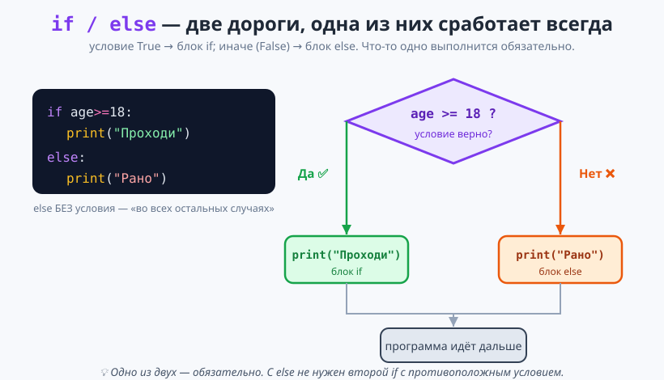
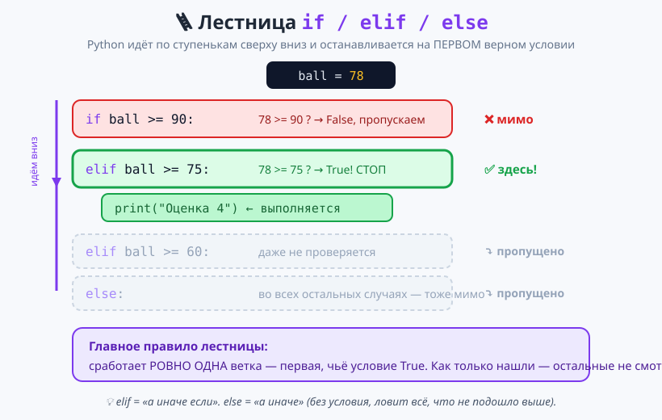
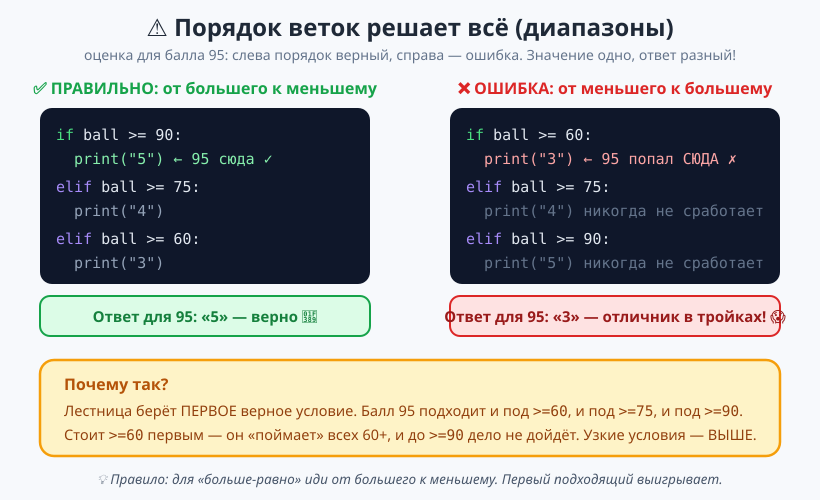

# Урок 2 — «Оценка по баллам»: `else` и `elif` 🪜📊

**Модуль 2 · Условия и логика · Урок 2 из 5 | 2 ак.ч. (1,5 часа)**

> ⬅️ Предыдущий: [Урок 1 «if и сравнения»](../урок-01-if-и-сравнения/урок.md) · [Все уроки модуля](../README.md) · [План курса](../../ПЛАН-КУРСА.md) · Следующий: [Урок 3 «Логика and/or/not»](../урок-03-логика/урок.md) ➡️

> 🔁 В начале — [разминка/повтор](повторение.md) (5 мин).
> 📌 Быстро вспомнить материал урока — [итого.md](итого.md) (шпаргалка).
> 👨‍🏫 Сценарий с хронометражом — в [преподавателю.md](преподавателю.md).
> 🖼 Что показать на проекторе — в [изображения.md](изображения.md).
> 🆘 **Пропустил урок или хочешь закрепить?** Открой [самоучитель.md](самоучитель.md) — теория + задания с подсказками.
> 🧰 Трюки и частые ошибки — в [лайфхак.md](лайфхак.md).

> 🧭 **Как читать урок.** В прошлый раз мы писали **два `if` с противоположными условиями** (`if age >= 18` и `if age < 18`) — и это было неудобно: два раза думать над границей, легко ошибиться. Сегодня научимся делать выбор **красиво и надёжно**: `else` («а иначе») и `elif` («а иначе если») строят **лестницу веток**, из которой срабатывает **ровно одна**. Соберём «Электронный журнал», который сам ставит оценку 2–5 по баллу, и разберём **главную ловушку диапазонов** — порядок веток.

---

## 🎮 Что мы сделаем сегодня и что получим

**Задача:** программа-журнал получает балл за тест (0–100) и сама выставляет оценку: 90+ → «5», 75+ → «4», 60+ → «3», ниже → «2». А ещё отсекает неправильный ввод (балл больше 100 или меньше 0).

**В итоге получится** файл `оценка.py`:

```
================================
ЭЛЕКТРОННЫЙ ЖУРНАЛ: ОЦЕНКА
================================
Введи балл за тест (0-100): 78
Балл 78 -> оценка 4. Хорошо.
--------------------------------
Оценка выставлена.
```

**Главные навыки урока:** `else` · `elif` · лестница веток · «срабатывает ровно одна» · **порядок условий для диапазонов** · `elif` со строками.

> 💡 **Главная мысль урока:** **`if/elif/else` — это лестница: Python идёт по ступенькам сверху вниз и останавливается на ПЕРВОМ верном условии.** Остальные ветки даже не проверяются. Поэтому **порядок веток решает всё.**

---

## Часть 0 — Разминка: почему двух `if` мало (4 минуты)

Вспомним конец прошлого урока — «взрослый или ребёнок»:

```python
age = int(input("Возраст: "))
if age >= 18:
    print("Взрослый")
if age < 18:
    print("Ребёнок")
```

Работает, но неудобно: мы **дважды** пишем про границу 18 и **дважды** проверяем условие. А если забыть второй `if` или ошибиться в нём — программа промолчит. Хочется сказать проще: «если взрослый — одно, **иначе** — другое». Для этого есть `else`.

---

## Часть 1 — `else`: «а иначе» (12 минут)

**`else`** добавляет к `if` **вторую ветку** — на случай, когда условие оказалось `False`:

```python
age = int(input("Возраст: "))

if age >= 18:
    print("Взрослый")
else:
    print("Ребёнок")
```

- 👀 Введи 40 → `Взрослый`. Введи 12 → `Ребёнок`. Ровно **одна** ветка — всегда.



**Разберём по частям:**
- `else` пишется **на том же уровне**, что и `if` (без отступа), и тоже с **двоеточием** `:`.
- У `else` **нет условия** — это «во всех остальных случаях».
- Тело `else` — с отступом, как у `if`.

> 💡 **`else` не бывает без `if`.** Он всегда пара к стоящему выше `if`. Отдельный `else:` → `SyntaxError`.

> ✍️ **Мини-задание 1 (2 мин):** спроси число. Если оно чётное (`% 2 == 0`) — выведи `Чётное`, иначе — `Нечётное`. Теперь без второго `if`!
> <details><summary>💡 подсказка</summary><code>if n % 2 == 0:</code> → <code>print("Чётное")</code>, затем <code>else:</code> → <code>print("Нечётное")</code>.</details>

> ⚠️ **Ошибка:** поставить у `else` условие — `else age < 18:` → `SyntaxError`. У `else` условия нет. Нужно условие — это `elif` (следующая часть).

---

## Часть 2 — `elif`: цепочка альтернатив (15 минут)

Часто вариантов **больше двух**. Оценка бывает 5, 4, 3, 2 — четыре ветки. Для промежуточных вариантов есть **`elif`** (сокращение от *else if* — «а иначе если»):

```python
ball = int(input("Балл: "))

if ball >= 90:
    print("Оценка 5")
elif ball >= 75:
    print("Оценка 4")
elif ball >= 60:
    print("Оценка 3")
else:
    print("Оценка 2")
```

- 👀 Введи 95 → `5`; 80 → `4`; 65 → `3`; 40 → `2`. Каждый балл получает **ровно одну** оценку.



**Как Python читает лестницу** (на примере балла 78):
1. `if ball >= 90:` → `78 >= 90`? **Нет** → пропускаем.
2. `elif ball >= 75:` → `78 >= 75`? **Да!** → выполняем `print("Оценка 4")` и **выходим из лестницы**.
3. `elif ball >= 60:` и `else:` — **даже не проверяются**. Ветка уже найдена.

> 💡 **Ключевая идея — «первый True выигрывает».** Как только одно условие сработало, Python выполняет его блок и **пропускает всю остальную лестницу**. Это главное отличие от нескольких отдельных `if` (там проверялся каждый).

**Сравни:**

| Несколько `if` (Урок 1) | Лестница `if/elif` |
|--------------------------|--------------------|
| проверяется **каждый** `if` | проверка идёт **до первого True** |
| могут сработать **несколько** | срабатывает **ровно одна** ветка |
| ветки **независимы** | ветки — **альтернативы** |

> ✍️ **Мини-задание 2 (3 мин):** спроси возраст и выведи категорию: `< 7` → `Дошкольник`, `< 18` → `Школьник`, иначе → `Взрослый`. Три ветки: `if`, `elif`, `else`.
> <details><summary>💡 подсказка</summary><code>if age &lt; 7:</code> → <code>elif age &lt; 18:</code> → <code>else:</code>. Идём от меньшего порога к большему — с <code>&lt;</code> это правильный порядок.</details>

> ⚠️ **`elif`, а не `else if`.** В Python пишется **слитно**: `elif`. Вариант `else if` — это уже другой язык, в Python → `SyntaxError`.

---

## Часть 3 — Ловушка диапазонов: порядок веток (14 минут)

Вот **самая частая ошибка** с `elif`. Возьмём ту же оценку, но переставим ветки «снизу вверх»:

```python
ball = 95
if ball >= 60:
    print("Оценка 3")     # ← отличник с баллом 95 попадёт СЮДА!
elif ball >= 75:
    print("Оценка 4")
elif ball >= 90:
    print("Оценка 5")
```

- 👀 Балл 95 даст… **«Оценка 3»**! Почему? `95 >= 60` — правда, лестница берёт **первую** подходящую ветку и останавливается. До `>= 90` дело не доходит.



> 💡 **Правило порядка.** Для условий «больше-равно» (`>=`) иди **от большего порога к меньшему** (90 → 75 → 60). Тогда узкие, «строгие» условия проверяются раньше широких. Общее правило: **более частный случай — выше, более общий — ниже.**

**Проверка ввода — тоже наверх.** В нашем журнале балл 0–100. Что если ввели 120? Поставим «защиту» первыми ветками:

```python
ball = int(input("Балл: "))

if ball > 100:
    print("Балл не может быть больше 100.")
elif ball < 0:
    print("Балл не может быть меньше 0.")
elif ball >= 90:
    print("Оценка 5")
# ... и так далее
```

Сначала отсекаем «мусор», потом считаем оценку.

> ✍️ **Мини-задание 3 (3 мин):** сделай «термометр по ощущениям»: `>= 30` → `Жара`, `>= 20` → `Тепло`, `>= 10` → `Прохладно`, иначе → `Холодно`. Проверь на 35, 25, 5. **Следи за порядком!**
> <details><summary>💡 подсказка</summary>От большего к меньшему: <code>if t &gt;= 30:</code> → <code>elif t &gt;= 20:</code> → <code>elif t &gt;= 10:</code> → <code>else:</code>.</details>

> ⚠️ **Ошибка-невидимка:** программа **не падает**, но выдаёт **неверный** ответ (отличник в «тройках»). Такие ошибки самые коварные — Python молчит. Лечение: проверь **порядок** веток и прогони граничные значения (90, 89, 75…).

---

## Часть 4 — `elif` со строками: «Светофор» (10 минут)

Ветки сравнивают не только числа. Разберём выбор по **строке** — цвету светофора:

```python
color = input("Какой горит свет? ").lower().strip()

if color == "красный":
    print("Стой на месте.")
elif color == "жёлтый":
    print("Внимание, приготовься.")
elif color == "зелёный":
    print("Можно идти!")
else:
    print(f"'{color}' — это не цвет светофора.")
```

- 👀 Введи `Красный`, `ЖЁЛТЫЙ`, ` зелёный ` — всё сработает: `.lower()` убирает регистр, `.strip()` — лишние пробелы. А `else` ловит любой неизвестный ответ.

> 💡 **`else` как «страховка».** Когда варианты перечислены (`==` по значениям), `else` ловит **всё непредусмотренное** — опечатки, пустой ввод, ерунду. Полезно всегда добавлять его последним.

> ✍️ **Мини-задание 4 (2 мин):** «выбор оружия» в игре: спроси `меч`/`лук`/`магия` и выведи урон (например, 10/7/12). Незнакомое слово — `else` с фразой `Нет такого оружия`.
> <details><summary>💡 подсказка</summary><code>weapon = input(...).lower()</code>, затем три ветки <code>==</code> и <code>else</code>.</details>

---

## Часть 5 — Собираем «Электронный журнал» 🏆 (14 минут)

Соединяем всё: защита ввода + оценка от большего к меньшему. Печатай по блокам, запускай.

```python
# ===== ОЦЕНКА ПО БАЛЛАМ =====

print("=" * 32)
print("ЭЛЕКТРОННЫЙ ЖУРНАЛ: ОЦЕНКА")
print("=" * 32)

ball = int(input("Введи балл за тест (0-100): "))

if ball > 100:
    print("Балл не может быть больше 100.")
elif ball < 0:
    print("Балл не может быть меньше 0.")
elif ball >= 90:
    print(f"Балл {ball} -> оценка 5. Отлично!")
elif ball >= 75:
    print(f"Балл {ball} -> оценка 4. Хорошо.")
elif ball >= 60:
    print(f"Балл {ball} -> оценка 3. Зачёт.")
else:
    print(f"Балл {ball} -> оценка 2. Нужно подготовиться.")

print("-" * 32)
print("Оценка выставлена.")
```

- 👀 **Что видишь:** один балл — одна оценка. Проверь границы: 90 (→5), 89 (→4), 60 (→3), 59 (→2), 120 (отсечёт). Программа **надёжна**.

> 💡 **Разбор:** вся логика — **одна лестница** из 6 веток. Две верхние — защита ввода, четыре нижние — оценки от большего к меньшему, `else` — «двойка» для всех, кто ниже 60. Ровно одна ветка на любой ввод.

> 🧩 **Для 5–7 классов (проще):** достаточно трёх оценок без защиты ввода: `>= 90` → 5, `>= 70` → 4, `else` → 3. Главное — понять лестницу и порядок.

> 📄 Полный проверенный код — [`материалы/оценка.py`](материалы/оценка.py) и [`материалы/светофор.py`](материалы/светофор.py).

---

## 🎓 Часть 6 — Для тех, кто хочет глубже (по времени)

- **Точный диапазон через цепочку:** `elif 75 <= ball < 90:` — «от 75 до 90». Тогда порядок веток не так критичен, но код длиннее. Обычно способ «от большего к меньшему» короче.
- **`elif` без `else`:** `else` не обязателен. Если ни одна ветка не подошла и `else` нет — просто ничего не выполнится.
- **Сколько угодно `elif`:** между `if` и `else` их может быть хоть десять (меню игры, дни недели, категории).
- **Вернись к Уроку 1:** помнишь вложенный `if`? Часто вложенность можно «развернуть» в аккуратную лестницу `elif` — читается лучше.

> ✍️ **Мини-задание 5 🎓 (3 мин):** переделай «оценку» на **точные диапазоны** через цепочку (`90 <= ball <= 100`, `75 <= ball < 90`, …). Сравни, где короче.

---

## 🐞 Разбор частых ошибок (читаем, что пишет Python)

| Сообщение Python | Что случилось | Как починить |
|------------------|---------------|--------------|
| `SyntaxError` на `else if` | написал `else if` вместо `elif` | в Python — слитно `elif` |
| `SyntaxError` на `else ...:` | дал `else` условие | у `else` условия нет; нужно — бери `elif` |
| `SyntaxError: invalid syntax` (одинокий `else`) | `else`/`elif` без `if` выше | они всегда идут после `if` |
| программа **не падает**, но ответ неверный | неправильный **порядок** веток | частные условия — выше, общие — ниже |
| `IndentationError` | сбит отступ у ветки | `if/elif/else` — без отступа, тела — с отступом |

> ⚠️ **Главная ловушка урока — не ошибка, а «молчаливый» неверный ответ** из-за порядка веток. Всегда прогоняй **граничные** значения.

---

## 🏁 Итог урока (5 минут)

Сегодня выбор стал красивым и надёжным:

- ✅ **`else`** — «а иначе», вторая ветка без условия; одна из двух срабатывает всегда.
- ✅ **`elif`** — «а иначе если», сколько угодно альтернатив между `if` и `else`.
- ✅ **Лестница** `if/elif/else`: срабатывает **ровно одна** ветка — первая с `True`.
- ✅ **Порядок веток решает всё:** для `>=` — от большего к меньшему; защита ввода — наверх.
- ✅ `elif` работает и со **строками** (`.lower()`, `.strip()`, `else`-страховка).
- ✅ 🎓 Точные диапазоны через цепочку `75 <= ball < 90`.

> 🏆 Главное: **`if/elif/else` — лестница, где выигрывает первое верное условие.** Быстро повторить всё — в [итого.md](итого.md).

> 🎤 **Блиц:** чем `elif` отличается от второго `if`? почему у балла 95 при неправильном порядке вышла «3»? бывает ли `else` с условием? сколько веток лестницы сработает? зачем защиту ввода ставят первой?

### 🎮 Викторина-закрепление
Открой **[викторина.html](викторина.html)** — 16 вопросов + смешные и «на подумать».

➡️ **Практика урока** — **[практика.md](практика.md)**: задачи в 3 уровнях с подсказками.
🆘 **Пропустил / хочешь ещё?** — [самоучитель.md](самоучитель.md) (теория + 15–20 заданий).
🧰 **Трюки и ошибки** — [лайфхак.md](лайфхак.md). 📌 **Шпаргалка** — [итого.md](итого.md).

---

## 🔗 Навигация и материалы

⬅️ **Предыдущий:** [Урок 1 «if и сравнения»](../урок-01-if-и-сравнения/урок.md) · [Все уроки модуля](../README.md) · [План курса](../../ПЛАН-КУРСА.md) · **Следующий:** [Урок 3 «Логика and/or/not»](../урок-03-логика/урок.md) ➡️

**🧰 Инструменты:** [Python](https://www.python.org/downloads/) · среда: [PyCharm Community](https://www.jetbrains.com/pycharm/download/) или [VS Code](https://code.visualstudio.com/).
**📄 Готовый код:** [`материалы/оценка.py`](материалы/оценка.py), [`материалы/светофор.py`](материалы/светофор.py) (проверены запуском).
**⚙️ Учителю:** сценарий и частые ошибки — в [преподавателю.md](преподавателю.md).
