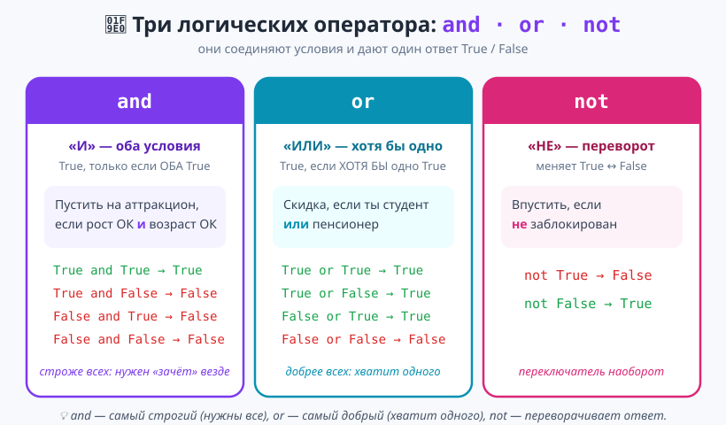
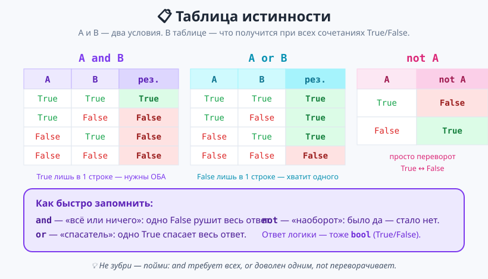
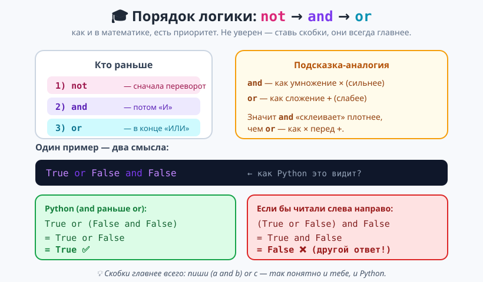

# Урок 3 — «Пускать на аттракцион?»: логика `and` / `or` / `not` 🧠🎢

**Модуль 2 · Условия и логика · Урок 3 из 5 | 2 ак.ч. (1,5 часа)**

> ⬅️ Предыдущий: [Урок 2 «else / elif»](../урок-02-else-elif/урок.md) · [Все уроки модуля](../README.md) · [План курса](../../ПЛАН-КУРСА.md) · Следующий: [Урок 4 «Проект Викторина + pyjokes»](../урок-04-викторина/урок.md) ➡️

> 🔁 В начале — [разминка/повтор](повторение.md) (5 мин).
> 📌 Быстро вспомнить материал урока — [итого.md](итого.md) (шпаргалка).
> 👨‍🏫 Сценарий с хронометражом — в [преподавателю.md](преподавателю.md).
> 🖼 Что показать на проекторе — в [изображения.md](изображения.md).
> 🆘 **Пропустил урок или хочешь закрепить?** Открой [самоучитель.md](самоучитель.md) — теория + задания с подсказками.
> 🧰 Трюки и частые ошибки — в [лайфхак.md](лайфхак.md).

> 🧭 **Как читать урок.** В прошлых уроках каждое `if` проверяло **одно** условие. Но в жизни правила сложнее: на аттракцион пускают, если рост **И** возраст подходят; скидку дают студентам **ИЛИ** пенсионерам; в клуб не пускают, если ты **НЕ** в списке. Сегодня научимся **соединять условия** словами `and`, `or`, `not` — и одно `if` сможет проверить сразу несколько вещей. Соберём контролёра на входе «Пускать на аттракцион?».

---

## 🎮 Что мы сделаем сегодня и что получим

**Задача:** написать «контролёра» на американские горки. Он спрашивает рост, возраст, есть ли рядом взрослый и как самочувствие — и по **нескольким правилам сразу** решает, пускать или нет.

**В итоге получится** файл `аттракцион.py`:

```
==================================
КОНТРОЛЬ: АМЕРИКАНСКИЕ ГОРКИ
==================================
Твой рост (см): 150
Твой возраст: 12
Рядом взрослый? (да/нет) нет
Хорошо себя чувствуешь? (да/нет) да
Проходи, пристёгивайся — приятного полёта!
```

**Главные навыки урока:** `and` · `or` · `not` · тип `bool` · `bool`-переменные · объединение условий · 🎓 приоритет логики и скобки.

> 💡 **Главная мысль урока:** **логические операторы соединяют условия в одно.** `and` требует, чтобы **всё** было `True`; `or` — чтобы **хотя бы одно**; `not` **переворачивает** `True`↔`False`. Результат — снова `True`/`False`, и им «питается» `if`.

---

## Часть 0 — Разминка: неудобная вложенность (4 минуты)

Вспомни задачу «пустить на аттракцион, если рост ≥ 140 **и** возраст ≥ 10». В Уроке 1 мы делали это **вложенным** `if`:

```python
if height >= 140:
    if age >= 10:
        print("Проходи")
```

Работает, но громоздко: два уровня отступа, а «иначе» вообще неудобно приписать. Хочется сказать в **одну** строку: «если рост ≥ 140 **И** возраст ≥ 10». Именно это делает `and`.

---

## Часть 1 — `bool`: значения True и False (8 минут)

Мы уже видели: сравнение возвращает **`True`** или **`False`** — это тип **`bool`**. Такое значение можно **положить в переменную**:

```python
is_adult = age >= 18       # в переменной лежит True или False
print(is_adult)            # True (если age 18+)
print(type(is_adult))      # <class 'bool'>
```

Это очень удобно: даём условию **понятное имя** и читаем потом как обычный текст.

```python
height = 150
tall_enough = height >= 140     # tall_enough = True
```

> 💡 **`bool`-переменную удобно читать в `if`:** `if tall_enough:` звучит как «если достаточно высокий». Не нужно `== True` — переменная **уже** `True` или `False`.

> ✍️ **Мини-задание 1 (2 мин):** заведи `age = 15`, создай `is_teen = age >= 13` и `is_child = age < 13`, выведи обе переменные. Предскажи, что получится.
> <details><summary>💡 подсказка</summary><code>is_teen = age &gt;= 13</code> → True, <code>is_child = age &lt; 13</code> → False.</details>

> ⚠️ **`True`/`False` — с большой буквы и без кавычек.** `true` (маленькая) → `NameError`; `"True"` (в кавычках) — это **строка**, а не логическое значение.

---

## Часть 2 — `and`: нужны ОБА условия (16 минут)

**`and`** («и») соединяет два условия и даёт `True`, **только если оба** истинны. Разберём **два разных примера** — так виднее, что `and` работает и с числами, и со строками.

**Пример 1 — аттракцион (два числовых условия):**

```python
height = int(input("Рост (см): "))
age = int(input("Возраст: "))

if height >= 140 and age >= 10:
    print("Проходи на аттракцион!")
else:
    print("Пока нельзя.")
```

- 👀 Рост 150 и возраст 12 → «Проходи» (оба верны). Рост 150, но возраст 8 → «Пока нельзя» (второе условие ложно).

**Пример 2 — вход по логину и паролю (два строковых условия):**

```python
login = input("Логин: ")
password = input("Пароль: ")

if login == "admin" and password == "1234":
    print("Доступ открыт.")
else:
    print("Отказано.")
```

- 👀 Пустят, только если верны **и** логин, **и** пароль. Ошибся в одном — «Отказано». Это ровно та проверка, что стоит на входе в почту, игры и соцсети: мало знать логин — нужен ещё и пароль.



**Как думать про `and`:** это «всё или ничего». Достаточно **одного** `False` — и весь ответ `False`. Как в жизни: чтобы поехать, нужны **и** права, **и** бензин, **и** машина — не хватило чего-то одного, поездки нет.

> 💡 **Каждая сторона `and` — полное условие.** Пиши `age >= 10 and age <= 15`, а **не** `10 <= age and <= 15`. Слева и справа от `and` — самостоятельные сравнения.

**Короткий способ для диапазона — цепочка сравнений.** Проверку «число между двумя границами» Python разрешает записать как в математике — сразу двойным сравнением:

```python
a = 7
if 5 < a < 10:            # то же самое, что: a > 5 and a < 10
    print("a в диапазоне от 5 до 10")
```

- 👀 `5 < 7 < 10` → `True`. Python сам понимает это как `5 < a and a < 10`. Коротко и читается как неравенство из математики.

> 💡 **Когда это удобно:** цепочка `20 <= t <= 25` короче, чем `t >= 20 and t <= 25`. Но работает **только для одной переменной**: «возраст от 10 до 15» — можно; «рост И возраст» — нет, там нужен полноценный `and`.

> ✍️ **Мини-задание 2 (3 мин):** спроси температуру и выведи `Комфортно`, если она **от 20 до 25**. Запиши **двумя способами**: через `and` и через цепочку — и убедись, что ответ одинаковый.
> <details><summary>💡 подсказка</summary><code>t &gt;= 20 and t &lt;= 25</code> ИЛИ короче <code>20 &lt;= t &lt;= 25</code> — оба верны.</details>

> ✍️ **Мини-задание 2б (2 мин):** сделай «двойной замок»: спроси кодовое слово и PIN-код. Открой сейф, только если слово `== "сезам"` **и** PIN `== "777"`.
> <details><summary>💡 подсказка</summary><code>if word == "сезам" and pin == "777":</code> — как пример с логином и паролем.</details>

> ⚠️ **Ошибка:** написать `if age >= 10 and 15:` в смысле «от 10 до 15». Это НЕ диапазон! Нужно два полных сравнения `age >= 10 and age <= 15` **или** цепочку `10 <= age <= 15`.

---

## Часть 3 — `or`: хватит ХОТЯ БЫ одного (12 минут)

**`or`** («или») даёт `True`, если истинно **хотя бы одно** из условий. Снова два разных примера.

**Пример 1 — скидка (льгота по любому основанию):**

```python
is_student = input("Ты студент? (да/нет) ").lower() == "да"
is_senior = input("Ты пенсионер? (да/нет) ").lower() == "да"

if is_student or is_senior:
    print("Тебе положена скидка!")
else:
    print("Скидки нет.")
```

- 👀 Достаточно ответить «да» на **любой** вопрос — скидка будет. «Нет» на оба → скидки нет.

**Пример 2 — доступ по промокоду ИЛИ подписке:**

```python
has_promo = input("Есть промокод? (да/нет) ").lower() == "да"
has_sub = input("Есть подписка? (да/нет) ").lower() == "да"

if has_promo or has_sub:
    print("Фильм доступен.")
else:
    print("Нужен промокод или подписка.")
```

- 👀 Хватит **чего-то одного** — промокода или подписки. Это типичная логика онлайн-кинотеатров и игр.

**Как думать про `or`:** это «спасатель». Одно `True` **спасает** весь ответ. `False` получится, только если **всё** ложно.

> 💡 **`and` vs `or` — не перепутай!** `and` — строгий (нужны все), `or` — добрый (хватит одного). Частая ошибка: поставить `or`, где по смыслу нужно `and`. Проверь себя вопросом: «нужны ОБА или достаточно ОДНОГО?»

> ✍️ **Мини-задание 3 (3 мин):** «выходной?»: спроси день недели (текстом). Если это `суббота` **или** `воскресенье` — выведи `Отдыхаем!`, иначе `Рабочий день`.
> <details><summary>💡 подсказка</summary><code>if day == "суббота" or day == "воскресенье":</code>. Не забудь <code>.lower()</code>.</details>

> ⚠️ **Обе стороны — полные условия и здесь.** `if day == "суббота" or "воскресенье":` работает НЕ так, как ждёшь (вторая часть всегда «истинна»). Правильно: `day == "суббота" or day == "воскресенье"`.

---

## Часть 4 — `not`: переворот (8 минут)

**`not`** («не») **переворачивает** логическое значение: `True` становится `False` и наоборот.

**Пример 1 — пускаем, если НЕ в чёрном списке:**

```python
is_banned = input("Ты в чёрном списке? (да/нет) ").lower() == "да"

if not is_banned:
    print("Добро пожаловать!")
else:
    print("Вход запрещён.")
```

- 👀 `is_banned = False` → `not is_banned = True` → «Добро пожаловать». Читается как «если **не** забанен».

**Пример 2 — не пускаем пустой ответ:**

```python
name = input("Как тебя зовут? ").strip()

if not name == "":          # то же, что: name != ""
    print(f"Привет, {name}!")
else:
    print("Ты не ввёл имя.")
```

- 👀 Если имя не пустое — здороваемся. `not` часто читается вслух как «если не…».



> 💡 **`not` делает код читаемым.** `if not feel_ok:` понятнее, чем `if feel_ok == False:`. Пиши так, как сказал бы словами: «если **не** здоров — отдыхай».

> ✍️ **Мини-задание 4 (2 мин):** спроси, идёт ли дождь (`да/нет`). Если **не** идёт (`not`) — выведи `Идём гулять!`, иначе `Останемся дома`.
> <details><summary>💡 подсказка</summary><code>rain = input(...).lower() == "да"</code>, затем <code>if not rain:</code>.</details>

Три оператора можно **комбинировать** — вот вся таблица истинности разом:

| A | B | `A and B` | `A or B` | `not A` |
|---|---|-----------|----------|---------|
| True | True | True | True | False |
| True | False | False | True | False |
| False | True | False | True | True |
| False | False | False | False | True |

---

## Часть 5 — Собираем «Контролёра» 🏆 (15 минут)

Соединяем всё. Правила парка: кататься одному можно при росте ≥ 140 **и** возрасте ≥ 10; **или** со взрослым при росте ≥ 120; и только если **не** плохо себя чувствуешь.

```python
# ===== ПУСКАТЬ НА АТТРАКЦИОН? =====

print("=" * 34)
print("КОНТРОЛЬ: АМЕРИКАНСКИЕ ГОРКИ")
print("=" * 34)

height = int(input("Твой рост (см): "))
age = int(input("Твой возраст: "))
with_adult = input("Рядом взрослый? (да/нет) ").lower().strip() == "да"
feel_ok = input("Хорошо себя чувствуешь? (да/нет) ").lower().strip() == "да"

# считаем допуск отдельными понятными bool-переменными
solo_ok = height >= 140 and age >= 10       # сам, без взрослого
adult_ok = with_adult and height >= 120     # со взрослым — мягче

if not feel_ok:
    print("Сегодня отдохни: пускаем только здоровых.")
elif solo_ok or adult_ok:
    print("Проходи, пристёгивайся — приятного полёта!")
else:
    print("Извини, по росту/возрасту пока нельзя.")

print("-" * 34)
print("Следующий!")
```

- 👀 **Что видишь:** контролёр учитывает **сразу четыре** ответа. Проверь: 150/12/нет/да → «Проходи»; 130/9/да/да → «Проходи» (со взрослым); 130/9/нет/да → «нельзя»; 150/12/нет/нет → «отдохни».

> 💡 **Разбор приёма:** мы вынесли сложные условия в **отдельные bool-переменные** (`solo_ok`, `adult_ok`) с понятными именами. Теперь строка `if` читается почти по-русски: «если не здоров… иначе если можно сам или со взрослым…». Это профессиональный приём — так код понятнее, чем длинное условие в одну строку.

> 🧩 **Для 5–7 классов (проще):** возьми только одно правило — `if height >= 140 and age >= 10:` («Проходи») и `else` («нельзя»). Взрослого и самочувствие можно не добавлять.

> 📄 Полный проверенный код — [`материалы/аттракцион.py`](материалы/аттракцион.py).

---

## 🎓 Часть 6 — Для тех, кто хочет глубже: приоритет и скобки (по времени)

Когда в одном условии есть и `and`, и `or`, важен **порядок**. У Python приоритет: сначала **`not`**, потом **`and`**, потом **`or`**.

```python
print(True or False and False)   # → True
```

Python читает это как `True or (False and False)` — сначала `and`. Если бы читал слева направо, вышло бы `False`. **Разные ответы!**



> 💡 **Аналогия:** `and` — как умножение `×`, `or` — как сложение `+`. Умножение раньше сложения, значит `and` раньше `or`.

> 💡 **Золотое правило: не уверен — ставь скобки.** `(solo_ok or adult_ok) and feel_ok` — читается однозначно и тобой, и Python. Скобки главнее любого приоритета.

- **`bool` — это числа:** `True` равно `1`, `False` равно `0`. `True + True` → `2`. Пригодится в Уроке 4, когда будем **считать** правильные ответы викторины.

> ✍️ **Мини-задание 5 🎓 (3 мин):** предскажи и проверь: `not (5 > 3)`, `(2 > 1) and (3 > 5)`, `(2 > 1) or (3 > 5)`. Запиши ожидаемый ответ до запуска.

---

## 🐞 Разбор частых ошибок

| Симптом | Что случилось | Как починить |
|---------|---------------|--------------|
| `if age >= 10 and 15:` не так работает | вторая часть не сравнение | `age >= 10 and age <= 15` |
| `if x == "суб" or "вс":` всегда True | справа от `or` строка, а не условие | `x == "суб" or x == "вс"` |
| `NameError: name 'true'` | `true`/`false` с маленькой буквы | `True`/`False` с большой |
| `if x == True:` работает, но лишнее | сравнение bool с True | просто `if x:` (или `if not x:`) |
| логика даёт не тот ответ | перепутал `and`/`or` | спроси: «нужны ОБА или ХВАТИТ одного?» |
| странный ответ с `and`+`or` | не учёл приоритет | поставь **скобки** |

> ⚠️ **Главное правило:** по обе стороны `and`/`or` — **полные условия**. И спрашивай себя, `and` тут или `or`.

---

## 🏁 Итог урока (5 минут)

Сегодня условия стали по-настоящему мощными:

- ✅ **`bool`** — тип `True`/`False`; условие можно **положить в переменную** с понятным именем.
- ✅ **`and`** — нужны **оба** условия (строгий, «всё или ничего»).
- ✅ **`or`** — хватит **хотя бы одного** (добрый, «спасатель»).
- ✅ **`not`** — **переворачивает** `True`↔`False`; `if not x:` читается как «если не».
- ✅ По обе стороны `and`/`or` — **полные** сравнения.
- ✅ 🎓 Приоритет `not → and → or`; **скобки** решают всё; `True == 1`.

> 🏆 Главное: **`and` требует всех, `or` доволен одним, `not` переворачивает.** Быстро повторить — в [итого.md](итого.md).

> 🎤 **Блиц:** когда `and` даёт `True`? когда `or` даёт `False`? что делает `not`? чем `and` отличается от `or` по смыслу? почему `x == "а" or "б"` — ошибка? что раньше — `and` или `or`?

### 🎮 Викторина-закрепление
Открой **[викторина.html](викторина.html)** — 16 вопросов + смешные и «на подумать».

➡️ **Практика урока** — **[практика.md](практика.md)**: задачи в 3 уровнях с подсказками.
🆘 **Пропустил / хочешь ещё?** — [самоучитель.md](самоучитель.md) (теория + 15–20 заданий).
🧰 **Трюки и ошибки** — [лайфхак.md](лайфхак.md). 📌 **Шпаргалка** — [итого.md](итого.md).

---

## 🔗 Навигация и материалы

⬅️ **Предыдущий:** [Урок 2 «else / elif»](../урок-02-else-elif/урок.md) · [Все уроки модуля](../README.md) · [План курса](../../ПЛАН-КУРСА.md) · **Следующий:** [Урок 4 «Проект Викторина + pyjokes»](../урок-04-викторина/урок.md) ➡️

**🧰 Инструменты:** [Python](https://www.python.org/downloads/) · среда: [PyCharm Community](https://www.jetbrains.com/pycharm/download/) или [VS Code](https://code.visualstudio.com/).
**📄 Готовый код:** [`материалы/аттракцион.py`](материалы/аттракцион.py) (проверен запуском).
**⚙️ Учителю:** сценарий и частые ошибки — в [преподавателю.md](преподавателю.md).
