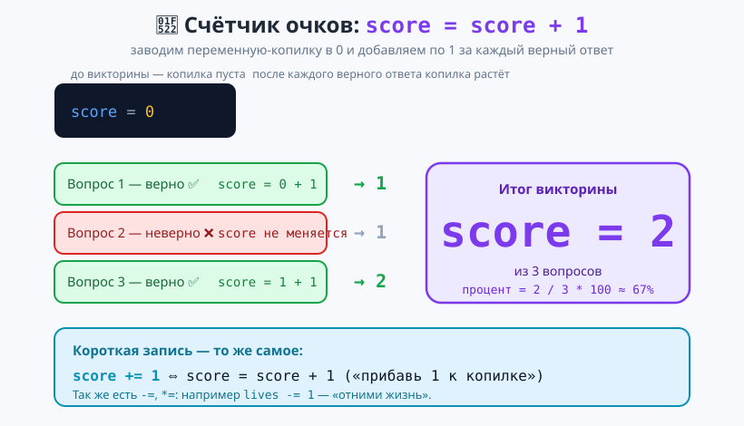
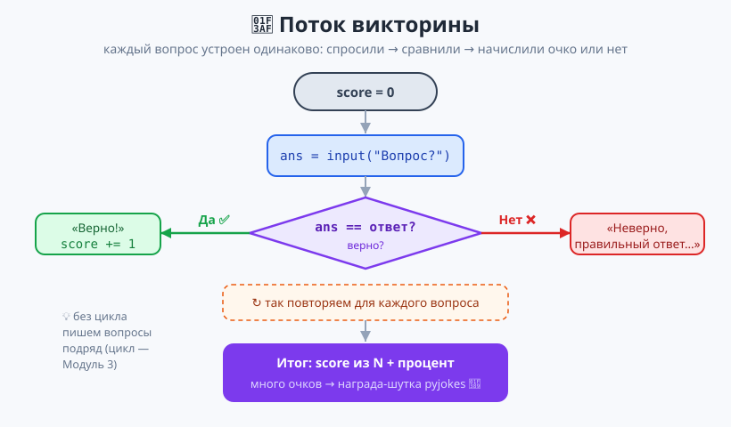
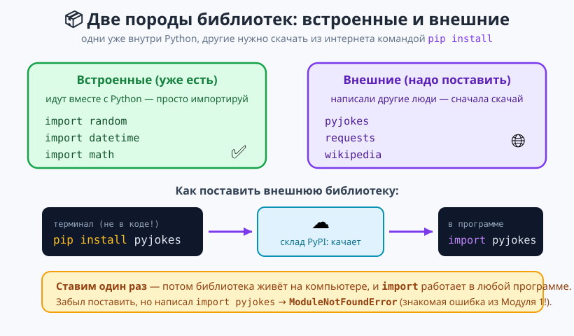

# Урок 4 — Проект «Викторина» + первая библиотека из интернета `pyjokes` 🎯📦

**Модуль 2 · Условия и логика · Урок 4 из 5 | 2 ак.ч. (1,5 часа)**

> ⬅️ Предыдущий: [Урок 3 «Логика and/or/not»](../урок-03-логика/урок.md) · [Все уроки модуля](../README.md) · [План курса](../../ПЛАН-КУРСА.md) · Следующий: [Урок 5 «Камень-ножницы-бумага»](../урок-05-кнб/урок.md) ➡️

> 🔁 В начале — [разминка/повтор](повторение.md) (5 мин).
> 📌 Быстро вспомнить материал урока — [итого.md](итого.md) (шпаргалка).
> 👨‍🏫 Сценарий с хронометражом — в [преподавателю.md](преподавателю.md).
> 🖼 Что показать на проекторе — в [изображения.md](изображения.md).
> 🆘 **Пропустил урок или хочешь закрепить?** Открой [самоучитель.md](самоучитель.md) — теория + задания с подсказками.
> 🧰 Трюки и частые ошибки — в [лайфхак.md](лайфхак.md).

> 🧭 **Как читать урок.** Пора собрать всё, что мы знаем об условиях, в **настоящий проект — викторину**. Программа будет задавать вопросы, **проверять ответы** (`if/else`) и **вести счёт** правильных. А ещё сегодня важное событие: мы поставим **первую библиотеку из интернета** — `pyjokes` (шутки про программистов) — командой `pip install` и выдадим её как **награду за победу**. Работаем по новому стандарту: несколько примеров на каждый приём.

---

## 🎮 Что мы сделаем сегодня и что получим

**Проект «Викторина эрудита»:** 5 вопросов, программа проверяет ответы, считает очки, показывает результат в процентах и — при хорошем счёте — выдаёт шутку-награду из библиотеки `pyjokes`.

**В итоге получится** файл `викторина.py`:

```
==================================
ВИКТОРИНА ЭРУДИТА (5 вопросов)
==================================
1. Столица Франции? париж
Верно!
...
----------------------------------
Результат: 4 из 5  (80%)
Хорошо! Крепкий результат.

Твоя награда — шутка про программистов:
In C we had to code our own bugs. In C++ we can inherit them.
```

**Главные навыки урока:** проверка ответа через `if/else` · **счётчик очков** `score += 1` · подсчёт **процента** · `pip install` (внешняя библиотека) · `pyjokes.get_joke()` · сборка всего модуля в проект.

> 💡 **Главная мысль урока:** **чтобы что-то посчитать по ходу программы, заводят переменную-«копилку»** (`score = 0`) и **добавляют** в неё по мере надобности (`score += 1`). Это один из самых частых приёмов в программировании.

---

## Часть 1 — Счётчик: переменная-копилка (12 минут)

Чтобы вести счёт правильных ответов, нам нужна переменная, которая **растёт**. Заведём её в `0` и будем прибавлять:

```python
score = 0        # копилка пуста
score = score + 1    # стало 1
score = score + 1    # стало 2
print(score)         # 2
```

Читается справа налево (как всегда с `=`): «возьми старое `score`, прибавь 1, положи обратно в `score`».



**Короткая запись — то же самое.** `score = score + 1` пишут короче: **`score += 1`** («прибавь 1 к score»):

```python
score = 0
score += 1       # то же, что score = score + 1
score += 1
print(score)     # 2
```

- 👀 Оба варианта дают `2`. `+=` — просто удобное сокращение, программисты пишут так постоянно.

**Так же работают и другие операции:**

```python
lives = 3
lives -= 1       # отняли жизнь → 2   (то же, что lives = lives - 1)
coins = 10
coins += 5       # собрал монеты → 15
money = 100
money *= 2       # удвоил → 200
```

> 💡 **Где пригодится копилка:** счёт очков в игре, число правильных ответов, здоровье героя, деньги, собранные монеты. Приём один: завести в начале, менять по ходу.

> ✍️ **Мини-задание 1 (2 мин):** заведи `points = 0`, прибавь `10`, потом ещё `5` через `+=`, выведи результат. Потом отними `3`.
> <details><summary>💡 подсказка</summary><code>points += 10</code>, <code>points += 5</code>, <code>points -= 3</code> → 12.</details>

> ⚠️ **Ошибка:** забыть завести копилку до использования: сразу `score += 1` без `score = 0` выше → `NameError: name 'score' is not defined`. Сначала создаём (`= 0`), потом прибавляем.

---

## Часть 2 — Проверяем ответ: `if/else` + счёт (14 минут)

Один вопрос викторины устроен так: спросили → сравнили ответ с правильным → если верно, прибавили очко.

**Пример 1 — вопрос со строковым ответом:**

```python
score = 0

answer = input("Столица Франции? ").lower().strip()
if answer == "париж":
    print("Верно!")
    score += 1
else:
    print("Неверно. Правильно: Париж.")

print(f"Очков: {score}")
```

- 👀 Ответишь `Париж`, `париж` или ` ПАРИЖ ` — засчитает: `.lower().strip()` убирает регистр и пробелы (приём из Модуля 1). Иначе — `else` покажет правильный ответ.

**Пример 2 — вопрос с числовым ответом и несколькими верными вариантами:**

```python
score = 0

answer = input("Сколько будет 7 * 8? ").strip()
if answer == "56":
    print("Верно!")
    score += 1
else:
    print("Неверно. Правильно: 56.")
```

- 👀 Здесь мы сравниваем **как строку** (`== "56"`) — ведь `input()` и так даёт строку, а нам не нужно считать, только сравнить.

**А если верных ответов несколько?** Соединим их через `or` (логика из Урока 3):

```python
answer = input("Цвет неба днём? ").lower().strip()
if answer == "голубое" or answer == "синее":
    print("Верно!")
    score += 1
```

- 👀 Засчитает и «голубое», и «синее». Помни правило Урока 3: по обе стороны `or` — **полные** сравнения (`answer == "синее"`, не просто `"синее"`).



> ✍️ **Мини-задание 2 (3 мин):** сделай один вопрос-викторину на свой вкус: заведи `score = 0`, спроси, проверь `if/else`, при верном ответе `score += 1`, в конце выведи очки.
> <details><summary>💡 подсказка</summary>Не забудь <code>.lower().strip()</code> у строкового ответа и <code>score += 1</code> внутри ветки <code>if</code>.</details>

> 💡 **Почему вопросы пишем подряд, а не в цикле?** Пока — потому что цикл (`for`/`while`) мы ещё не проходили (это Модуль 3). Там 5 вопросов сожмутся в несколько строк. Сегодня честно пишем по блоку на вопрос — заодно видно, что каждый устроен одинаково.

---

## Часть 3 — Первая библиотека из интернета: `pip install` (14 минут)

Библиотеки бывают **двух пород:**
- **Встроенные** — идут вместе с Python: `random`, `datetime`, `math`. Просто `import`, и всё.
- **Внешние** — их написали другие люди и выложили в интернет. Такую надо сначала **скачать и установить** — командой **`pip`**.



**`pip`** — это «магазин библиотек» Python. Команду пишут **не в коде, а в терминале** (внизу PyCharm — вкладка *Terminal*; в VS Code — меню *Terminal → New Terminal*):

```bash
pip install pyjokes
```

- 👀 Пойдёт скачивание, и в конце — `Successfully installed pyjokes`. **Ставим один раз** — потом библиотека живёт на компьютере и доступна любой программе.

Теперь `pyjokes` можно импортировать и использовать, как любую библиотеку:

```python
import pyjokes

joke = pyjokes.get_joke(language="en")   # взять случайную шутку (на английском)
print(joke)
```

- 👀 Каждый запуск — новая шутка про программистов. `language="en"` — язык шуток (английский; заодно и язык подтянешь).

> 💡 **Аналогия с телефоном:** встроенные библиотеки — как приложения, что уже стоят на новом телефоне. Внешние — как приложения из магазина: сначала «установить» (`pip install`), потом пользоваться (`import`).

> ✍️ **Мини-задание 3 (2 мин):** поставь `pyjokes` (`pip install pyjokes`) и выведи одну случайную шутку. Запусти пару раз — шутка меняется.
> <details><summary>💡 подсказка</summary>Сначала в терминале <code>pip install pyjokes</code>, потом в коде <code>import pyjokes</code> и <code>print(pyjokes.get_joke(language="en"))</code>.</details>

> ⚠️ **Ошибка `ModuleNotFoundError: No module named 'pyjokes'`:** написал `import pyjokes`, но забыл сначала `pip install pyjokes`. Знакомая ошибка из Модуля 1 — Python не нашёл библиотеку. Лечение: поставь её командой `pip`.

> 🧰 **Если `pip` не срабатывает** (или нет интернета): попробуй `python -m pip install pyjokes`. А чтобы проект работал совсем без установки — есть запасная версия [`материалы/викторина_без_pip.py`](материалы/викторина_без_pip.py): там награда-шутка берётся из встроенного `random.choice` (без внешних библиотек).

---

## Часть 4 — Собираем «Викторину эрудита» 🏆 (18 минут)

Соединяем: счётчик + проверки + процент + награда. Печатай по блокам, запускай.

```python
# ===== ВИКТОРИНА ЭРУДИТА =====
# перед запуском один раз: pip install pyjokes

import pyjokes

print("=" * 34)
print("ВИКТОРИНА ЭРУДИТА (5 вопросов)")
print("=" * 34)

score = 0   # копилка правильных ответов

# --- Вопрос 1 ---
a1 = input("1. Столица Франции? ").lower().strip()
if a1 == "париж":
    print("Верно!")
    score += 1
else:
    print("Неверно. Правильно: Париж.")

# --- Вопрос 2 ---
a2 = input("2. Сколько будет 7 * 8? ").strip()
if a2 == "56":
    print("Верно!")
    score += 1
else:
    print("Неверно. Правильно: 56.")

# --- Вопрос 3 ---
a3 = input("3. Цвет неба днём? ").lower().strip()
if a3 == "голубое" or a3 == "синее":
    print("Верно!")
    score += 1
else:
    print("Неверно. Правильно: голубое.")

# --- Итог: процент ---
percent = score / 3 * 100
print("-" * 34)
print(f"Результат: {score} из 3  ({percent:.0f}%)")

# --- Оценка результата лестницей ---
if score == 3:
    print("Идеально!")
elif score >= 2:
    print("Хорошо!")
else:
    print("Ещё подучись и попробуй снова.")

# --- Награда: шутка за 2+ правильных ---
if score >= 2:
    print("\nТвоя награда:")
    print(pyjokes.get_joke(language="en"))
```

- 👀 **Что видишь:** программа задаёт вопросы, считает очки, показывает процент и при хорошем счёте выдаёт шутку. Это твой **первый проект с внешней библиотекой**! (В полной версии на 5 вопросов — [`материалы/викторина.py`](материалы/викторина.py).)

> 💡 **Разбор:** `score / 3 * 100` даёт процент; `:.0f` округляет до целого (без знаков после точки — приём форматирования из Модуля 1). Оценка результата — знакомая **лестница** `if/elif/else` (Урок 2). Награду показываем по условию `score >= 2`.

> 🧩 **Для 5–7 классов (проще):** хватит **3 вопросов** и награды-шутки без подсчёта процента. Главное — увидеть, как `score += 1` считает правильные ответы.

---

## 🎓 Часть 5 — Для тех, кто хочет глубже (по времени)

- **Категория шуток:** `pyjokes.get_joke(language="en", category="neutral")` — приличные шутки; бывают `chuck` (про Чака Норриса) и `all`.
- **Процент без дробей:** `percent = score * 100 // 5` — целочисленный процент через `//` (Модуль 1), тоже без точки.
- **Своя оценка словом:** добавь больше веток `elif` (отлично/хорошо/неплохо/попробуй ещё) по проценту.
- **Больше вопросов = больше повторений** одинакового кода. Это и есть повод для **цикла** — в Модуле 3 викторина станет короче в разы.

> ✍️ **Мини-задание 4 🎓 (3 мин):** добавь в викторину 4-й и 5-й вопросы и пересчитай процент на `/ 5`. Проверь границы: 5/5 → 100%, 0/5 → 0%.

---

## 🐞 Разбор частых ошибок

| Сообщение / симптом | Что случилось | Как починить |
|---------------------|---------------|--------------|
| `ModuleNotFoundError: No module named 'pyjokes'` | забыл `pip install pyjokes` | поставь библиотеку командой `pip` в терминале |
| `NameError: name 'score' is not defined` | прибавляешь в копилку, которой нет | заведи `score = 0` **до** `score += 1` |
| очки не растут | `score += 1` стоит **вне** ветки `if` (нет отступа) | прибавляй очко **внутри** `if` (с отступом) |
| ответ не засчитывается | забыл `.lower()`/`.strip()` — регистр или пробел | приведи ввод: `input(...).lower().strip()` |
| `pip` пишет ошибку | не тот терминал/нет интернета | попробуй `python -m pip install pyjokes` или версию без pip |

> ⚠️ **Главное:** `score += 1` работает, только если он **внутри** ветки `if` (с отступом) и копилка заведена **выше** (`score = 0`).

---

## 🏁 Итог урока

Сегодня мы собрали настоящий проект и научились ставить библиотеки:

- ✅ **Счётчик-копилка:** `score = 0`, затем `score += 1` (и `-=`, `*=`).
- ✅ **Проверка ответа** через `if/else`, начисление очка внутри `if`.
- ✅ **Несколько верных вариантов** — через `or`.
- ✅ **Процент:** `score / N * 100`, вывод `:.0f`.
- ✅ **`pip install`** — установка внешней библиотеки; **`pyjokes.get_joke()`** — награда.
- ✅ Разобрали `ModuleNotFoundError` и `NameError` для копилки.

> 🏆 Главное: **копилка `+=` считает по ходу программы, а внешние библиотеки ставятся через `pip`.** Быстро повторить — в [итого.md](итого.md).

> 🎤 **Блиц:** что делает `score += 1`? зачем `score = 0` в начале? чем встроенная библиотека отличается от внешней? какой командой ставят `pyjokes`? какая ошибка, если забыть `pip install`?

### 🎮 Викторина-закрепление
Открой **[викторина.html](викторина.html)** — 16 вопросов + смешные и «на подумать».

➡️ **Практика урока** — **[практика.md](практика.md)**: задачи в 3 уровнях с подсказками.
🆘 **Пропустил / хочешь ещё?** — [самоучитель.md](самоучитель.md) (теория + 15–20 заданий).
🧰 **Трюки и ошибки** — [лайфхак.md](лайфхак.md). 📌 **Шпаргалка** — [итого.md](итого.md).

---

## 🔗 Навигация и материалы

⬅️ **Предыдущий:** [Урок 3 «Логика and/or/not»](../урок-03-логика/урок.md) · [Все уроки модуля](../README.md) · [План курса](../../ПЛАН-КУРСА.md) · **Следующий:** [Урок 5 «Камень-ножницы-бумага»](../урок-05-кнб/урок.md) ➡️

**🧰 Инструменты:** [Python](https://www.python.org/downloads/) · среда: [PyCharm Community](https://www.jetbrains.com/pycharm/download/) или [VS Code](https://code.visualstudio.com/).
**📄 Готовый код:** [`материалы/викторина.py`](материалы/викторина.py) (с `pyjokes`) и [`материалы/викторина_без_pip.py`](материалы/викторина_без_pip.py) (без установки) — проверены запуском.
**⚙️ Учителю:** сценарий и частые ошибки — в [преподавателю.md](преподавателю.md).
