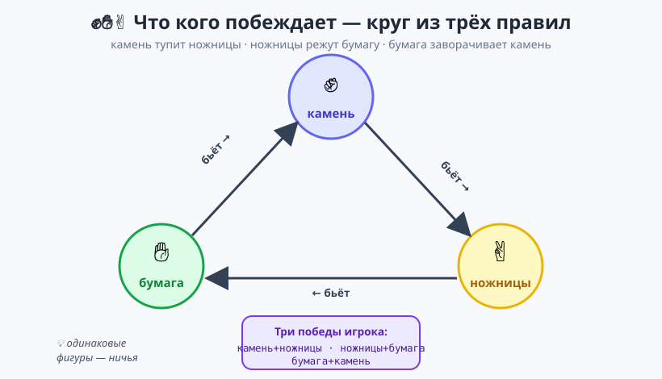
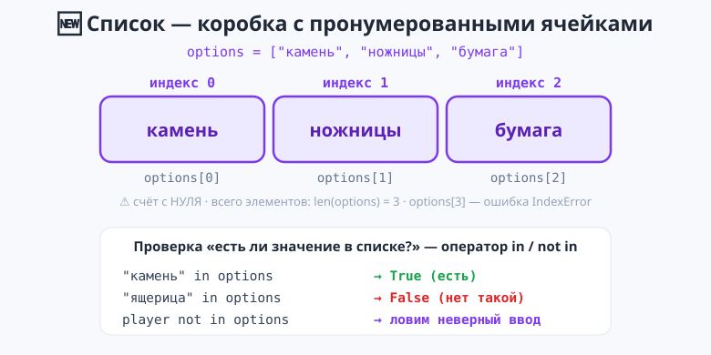
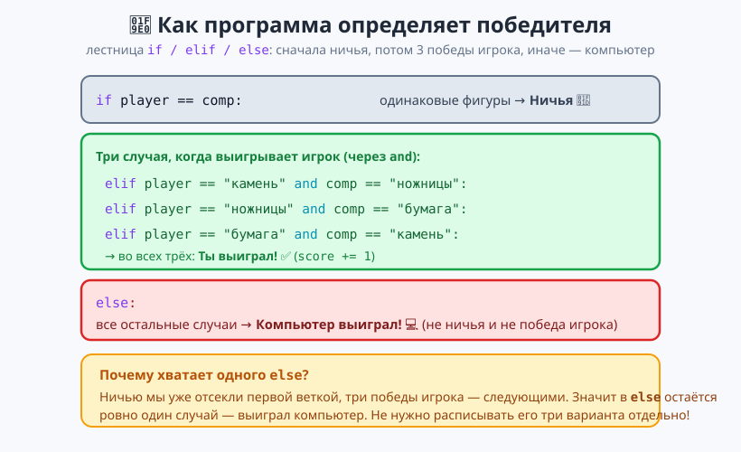
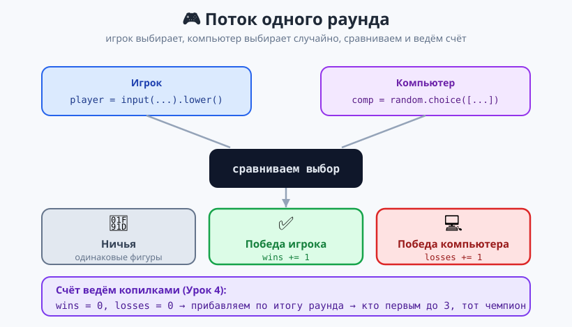

# Урок 5 — 🏆 «Камень-ножницы-бумага»: финал модуля ✊✋✌️

**Модуль 2 · Условия и логика · Урок 5 из 5 (итоговый) | 2 ак.ч. (1,5 часа)**

> ⬅️ Предыдущий: [Урок 4 «Викторина + pyjokes»](../урок-04-викторина/урок.md) · [Все уроки модуля](../README.md) · [План курса](../../ПЛАН-КУРСА.md) · Дальше — [Модуль 3 «Циклы»](../../ПЛАН-КУРСА.md) ➡️

> 🔁 В начале — [разминка/повтор](повторение.md) (5 мин).
> 📌 Быстро вспомнить материал урока — [итого.md](итого.md) (шпаргалка).
> 👨‍🏫 Сценарий с хронометражом — в [преподавателю.md](преподавателю.md).
> 🖼 Что показать на проекторе — в [изображения.md](изображения.md).
> 🆘 **Пропустил урок или хочешь закрепить?** Открой [самоучитель.md](самоучитель.md) — теория + задания с подсказками.
> 🧰 Трюки и частые ошибки — в [лайфхак.md](лайфхак.md).

> 🧭 **Как читать урок.** Это **итоговый урок модуля**: соберём настоящую **игру против компьютера** — «Камень-ножницы-бумага», где работает **всё** из модуля (`random.choice`, лестница `if/elif/else`, логика `and`/`or`, счётчик `+=`, «умный `else`»). И познакомимся с **одной новой важной вещью — списками**: три фигуры удобно хранить в списке `["камень", "ножницы", "бумага"]`. Это первое знакомство — списки нам очень скоро пригодятся в **циклах (Модуль 3)**, а по-настоящему глубоко разберём их в **Модуле 4**.

---

## 🎮 Что мы сделаем сегодня и что получим

**Проект «Камень-ножницы-бумага»:** ты выбираешь фигуру, компьютер — случайно, программа сравнивает и объявляет победителя. А в расширенной версии — играем серию и ведём счёт.

**В итоге получится** файл `кнб.py`:

```
==================================
КАМЕНЬ - НОЖНИЦЫ - БУМАГА
==================================
Твой выбор (камень/ножницы/бумага): камень
Ты выбрал:        камень
Компьютер выбрал: ножницы
----------------------------------
Ты выиграл! Камень тупит ножницы.
```

**Главные навыки урока (всё из модуля вместе + новое):** 🆕 **список `[...]`** · индекс `[0]` · `len()` · `in` / `not in` · `random.choice` из списка · сравнение выборов · лестница `if/elif/else` · логика `and`/`or` · счётчик `+=` · «умный `else`».

> 💡 **Главная мысль урока:** **сложное правило игры раскладывается на простые условия по порядку.** Сначала отсекаем ничью, потом три случая победы игрока, а всё остальное (`else`) — победа компьютера. Порядок веток снова решает всё (Урок 2).

---

## Часть 1 — Правила игры: что кого бьёт (8 минут)

Вспомним правила. Три фигуры образуют **круг**, где каждая побеждает следующую:



- ✊ **камень** тупит ✌️ **ножницы**
- ✌️ **ножницы** режут ✋ **бумагу**
- ✋ **бумага** заворачивает ✊ **камень**

Значит, у игрока **ровно три** выигрышных сочетания:

| Игрок | Компьютер | Итог |
|-------|-----------|------|
| камень | ножницы | игрок победил |
| ножницы | бумага | игрок победил |
| бумага | камень | игрок победил |
| одинаковые | | ничья |
| всё остальное | | победил компьютер |

> 💡 **Ключевое наблюдение:** случаев всего 9 (3 × 3). Три — победа игрока, три — ничья, три — победа компьютера. Нам не нужно расписывать все девять — хватит отсечь ничью и три победы игрока, а остаток отдать компьютеру.

---

## Часть 2 — 🆕 Список фигур и ход компьютера (12 минут)

Три фигуры удобно хранить не в трёх отдельных переменных, а в **одном списке**. **Список** (`list`) — это «коробка с пронумерованными ячейками», где по порядку лежат несколько значений:

```python
options = ["камень", "ножницы", "бумага"]
```

- Квадратные скобки `[]`, значения через запятую. Теперь все три фигуры — в одной переменной `options`.



**Ячейки нумеруются с нуля** — это **индекс**. Берём элемент по индексу в квадратных скобках:

```python
print(options[0])    # камень   (первая ячейка — индекс 0!)
print(options[1])    # ножницы
print(options[2])    # бумага
print(len(options))  # 3  — сколько элементов в списке
```

> 💡 **Счёт с нуля.** `options[0]` — первый элемент, `options[1]` — второй. Это правило всего Python: нумерация с 0. А `len(список)` говорит, сколько в нём элементов.

Компьютер выбирает фигуру **случайно из списка** — тем же `random.choice` из Модуля 1, только теперь передаём ему **имя списка**:

```python
import random
comp = random.choice(options)   # случайный элемент списка options
```

- 👀 Каждый запуск — случайная фигура. `random.choice` любит списки: возвращает любой их элемент.

А ещё список умеет отвечать на вопрос «**есть ли значение внутри?**» — оператором `in` (и `not in`):

```python
print("камень" in options)       # True  — есть в списке
print("ящерица" in options)      # False — такой фигуры нет
print("ящерица" not in options)  # True  — «нет в списке»
```

- 👀 Это пригодится, чтобы **проверить ввод игрока**: если `player not in options` — значит, ввели что-то постороннее.

Игрок вводит свой выбор — приведём к нижнему регистру и уберём пробелы (приём из прошлых уроков):

```python
player = input("Твой выбор (камень/ножницы/бумага): ").lower().strip()
```

> 💡 **Это только знакомство со списками.** Мы научились: создать список `[...]`, взять элемент по индексу `[0]`, узнать длину `len()`, проверить наличие через `in`/`not in`. **Перебрать** весь список циклом — научимся в **Модуле 3** (циклы), а добавлять/удалять/сортировать и многое другое — в **Модуле 4**. Пока этого хватит для игры.

> ✍️ **Мини-задание 1 (2 мин):** создай список `options`, выведи его длину `len(options)` и элемент `options[1]`. Предскажи ответ **до** запуска.
> <details><summary>💡 подсказка</summary><code>len(options)</code> → 3; <code>options[1]</code> → «ножницы» (счёт с нуля!).</details>

> ✍️ **Мини-задание 2 (2 мин):** спроси у игрока фигуру и проверь через `in`: если `player in options` — выведи «Такая фигура есть!», иначе «Нет такой фигуры».
> <details><summary>💡 подсказка</summary><code>player = input(...).lower().strip()</code>, затем <code>if player in options:</code> … <code>else:</code>.</details>

> ⚠️ **Индекс с нуля и границы.** `options[0]` — первый; а `options[3]` для списка из 3 элементов — ошибка `IndexError` (такой ячейки нет, максимум `options[2]`).

---

## Часть 3 — Кто победил: лестница условий (16 минут)

Теперь — сердце игры. Определяем победителя лестницей `if/elif/else` **в правильном порядке**.



**Шаг 1 — ничья** (одинаковые фигуры):

```python
if player == comp:
    print("Ничья!")
```

**Шаг 2 — три случая победы игрока** (через `and` из Урока 3):

```python
elif player == "камень" and comp == "ножницы":
    print("Ты выиграл! Камень тупит ножницы.")
elif player == "ножницы" and comp == "бумага":
    print("Ты выиграл! Ножницы режут бумагу.")
elif player == "бумага" and comp == "камень":
    print("Ты выиграл! Бумага заворачивает камень.")
```

**Шаг 3 — всё остальное** — победа компьютера:

```python
else:
    print("Компьютер выиграл! В этот раз не повезло.")
```

> 💡 **Почему хватает одного `else`?** Ничью мы уже отсекли первой веткой, три победы игрока — следующими тремя. Значит в `else` остаётся **ровно** один вариант — выиграл компьютер. Не нужно расписывать три победы компьютера отдельно — это тот самый «умный `else`». Порядок веток критичен: убери ничью наверх — и `else` перестанет быть точным.

> ✍️ **Мини-задание 3 (3 мин):** собери полную проверку победителя (ничья → 3 победы игрока → `else`). Проверь три случая: сыграй так, чтобы вышла ничья, победа и поражение.
> <details><summary>💡 подсказка</summary>Скопируй три ветки <code>elif ... and ...</code> из примеров выше. Чтобы получить нужный исход при отладке, временно замени <code>comp = random.choice(...)</code> на <code>comp = "ножницы"</code>.</details>

> ⚠️ **Ошибка:** написать `elif player == "камень" and comp == "ножницы"` без второго `player ==`/`comp ==`, например `elif player == "камень" and "ножницы"`. Помни правило Урока 3: по обе стороны `and` — **полное** сравнение.

---

## Часть 4 — Собираем игру 🏆 (14 минут)

Соединяем всё. Добавим и **защиту от опечатки** (если ввели не фигуру) — первой веткой, как учились в Уроке 2.

```python
# ===== КАМЕНЬ-НОЖНИЦЫ-БУМАГА =====
import random

options = ["камень", "ножницы", "бумага"]   # список фигур

print("=" * 34)
print("КАМЕНЬ - НОЖНИЦЫ - БУМАГА")
print("=" * 34)

player = input("Твой выбор (камень/ножницы/бумага): ").lower().strip()
comp = random.choice(options)

print(f"Ты выбрал:        {player}")
print(f"Компьютер выбрал: {comp}")
print("-" * 34)

if player not in options:
    print("Не понял выбор. Пиши: камень, ножницы или бумага.")
elif player == comp:
    print("Ничья!")
elif player == "камень" and comp == "ножницы":
    print("Ты выиграл! Камень тупит ножницы.")
elif player == "ножницы" and comp == "бумага":
    print("Ты выиграл! Ножницы режут бумагу.")
elif player == "бумага" and comp == "камень":
    print("Ты выиграл! Бумага заворачивает камень.")
else:
    print("Компьютер выиграл! В этот раз не повезло.")
```

- 👀 **Что видишь:** полноценная игра против компьютера! Первая ветка ловит опечатки одной короткой проверкой `player not in options`, дальше — знакомая лестница. Это сборка всего модуля в одном файле.

> 💡 **Разбор защиты ввода:** `player not in options` — «игрок ввёл значение, которого **нет** в списке фигур». Одна короткая проверка вместо трёх `player != ...` через `and`! Вот зачем удобны списки — и это только начало. Ставим её **первой** веткой (правило порядка из Урока 2).

> 🧩 **Для 5–7 классов (проще):** можно без защиты ввода — только ничья, три победы игрока и `else`. Главное — понять «умный `else`» и порядок веток.

> 📄 Полный проверенный код — [`материалы/кнб.py`](материалы/кнб.py).

---

## Часть 5 — Ведём счёт: играем серию 🏆 (12 минут)

Одна игра — хорошо, но интереснее сыграть **несколько раундов и вести счёт**. Заведём две копилки из Урока 4:

```python
wins = 0     # победы игрока
losses = 0   # победы компьютера
```

После каждого раунда прибавляем очко победителю:

```python
# ... определили, что выиграл игрок:
    print("Раунд за тобой!")
    wins += 1
# ... или компьютер:
    print("Раунд за компьютером.")
    losses += 1
```



А в конце сравним копилки лестницей и объявим чемпиона:

```python
print(f"СЧЁТ: ты {wins} : {losses} компьютер")
if wins > losses:
    print("ЧЕМПИОН - ТЫ!")
elif losses > wins:
    print("Победил компьютер. Реванш?")
else:
    print("Ничья по серии!")
```

> 💡 **Честное ограничение:** чтобы сыграть 3 раунда, в готовом файле [`материалы/кнб_три_раунда.py`](материалы/кнб_три_раунда.py) мы **повторили** блок раунда три раза. Заметь, сколько одинакового кода! А чтобы играть «до 3 побед» (пока кто-то не наберёт 3) — вообще нужен **цикл**. И то, и другое — тема Модуля 3: там раунды сожмутся в несколько строк. Отличный повод идти дальше!

> ✍️ **Мини-задание 4 🎓 (3 мин):** открой `кнб_три_раунда.py`, сыграй серию и объясни соседу, где в коде растут копилки `wins`/`losses` и где используется список `options`.

---

## 🎓 Часть 6 — Для тех, кто хочет глубже (по времени)

- **Короче через `or`:** три победы игрока можно слить в одну ветку: `elif (player=="камень" and comp=="ножницы") or (player=="ножницы" and comp=="бумага") or (player=="бумага" and comp=="камень"):` — скобки обязательны (приоритет из Урока 3). Так сделано в `кнб_три_раунда.py`.
- **Эмодзи-фигуры в тексте:** можно показывать `✊/✋/✌️` в подсказке-вопросе — но **не** внутри `print` на Windows-консоли (уронит программу). В коде — только слова.
- **«Ящерица и Спок»:** расширенная версия с 5 фигурами (из «Теории большого взрыва») — больше веток, та же идея.
- **Статистика:** веди ещё и `draws` (ничьи) третьей копилкой.

> ✍️ **Мини-задание 5 🎓 (3 мин):** перепиши три ветки победы игрока в **одну** через `or` со скобками. Проверь, что результат не изменился.

---

## 🐞 Разбор частых ошибок

| Симптом | Что случилось | Как починить |
|---------|---------------|--------------|
| победа считается неверно | перепутан порядок веток (ничья не первой) | сначала ничья, потом победы игрока, потом `else` |
| `elif player=="камень" and "ножницы"` | справа от `and` не сравнение | пиши `and comp == "ножницы"` |
| «Компьютер выиграл» при ничьей | забыл ветку `player == comp` | ничья — **первой** (после защиты ввода) |
| ввод не распознан | забыл `.lower()`/`.strip()` | `input(...).lower().strip()` |
| `NameError: wins` | прибавляешь в копилку без `wins = 0` | заведи копилки до раундов |
| `IndexError: list index out of range` | взял `options[3]` у списка из 3 | индексы 0..2; максимум `options[2]` |
| `options[1]` дал не то, что ждал | забыл, что счёт **с нуля** | `options[0]` — первый элемент |

> ⚠️ **Главное:** порядок веток (ничья → игрок → `else`) и полные сравнения по обе стороны `and`.

---

## 🏁 Итог урока и Модуля 2

Ты собрал **игру против компьютера** — и это значит, что **весь Модуль 2 пройден**:

- ✅ **Урок 1:** `if` и сравнения `> < == != >= <=`.
- ✅ **Урок 2:** `else`/`elif` — лестница веток, порядок для диапазонов.
- ✅ **Урок 3:** логика `and`/`or`/`not`, тип `bool`.
- ✅ **Урок 4:** счётчик `+=`, `pip install`, `pyjokes`.
- ✅ **Урок 5:** собрали игру КНБ — random + условия + логика + счёт, и 🆕 **познакомились со списками** (`[...]`, индекс `[0]`, `len`, `in`/`not in`).

> 🏆 Главное открытие модуля: **программа принимает решения — и из простых условий по порядку складываются сложные правила.** А данные (наши фигуры) удобно держать в **списке** — с этого начнётся Модуль 4. Быстрое повторение — в [итого.md](итого.md).

> 🎤 **Блиц:** что такое список и как взять его первый элемент? почему нумерация с 0? зачем `not in`? как компьютер делает случайный ход из списка? почему ничью проверяют первой? почему хватает одного `else` для всех побед компьютера? почему серию «до 3 побед» пока не сделать без цикла?

### 🎮 Викторина-закрепление
Открой **[викторина.html](викторина.html)** — 21 вопрос (включая 🆕 про списки) + смешные и «на подумать».

➡️ **Практика урока** — **[практика.md](практика.md)**: задачи в 3 уровнях с подсказками.
🆘 **Пропустил / хочешь ещё?** — [самоучитель.md](самоучитель.md) (теория + 15–20 заданий).
🧰 **Трюки и ошибки** — [лайфхак.md](лайфхак.md). 📌 **Шпаргалка** — [итого.md](итого.md).

---

## 🔗 Навигация и материалы

⬅️ **Предыдущий:** [Урок 4 «Викторина + pyjokes»](../урок-04-викторина/урок.md) · [Все уроки модуля](../README.md) · [План курса](../../ПЛАН-КУРСА.md)

> ➡️ **Что дальше:** **Модуль 3 «Циклы»** — научим программу **повторять** действия (`while`, `for`) и делать интересные программы. Там же списки, с которыми мы только познакомились, заработают в полную силу: `for` умеет **перебирать список** элемент за элементом. Викторина, отсчёты и раунды КНБ станут короче в разы!

**🧰 Инструменты:** [Python](https://www.python.org/downloads/) · среда: [PyCharm Community](https://www.jetbrains.com/pycharm/download/) или [VS Code](https://code.visualstudio.com/).
**📄 Готовый код:** [`материалы/кнб.py`](материалы/кнб.py) (один раунд) и [`материалы/кнб_три_раунда.py`](материалы/кнб_три_раунда.py) (серия со счётом) — проверены запуском.
**⚙️ Учителю:** сценарий и частые ошибки — в [преподавателю.md](преподавателю.md).
