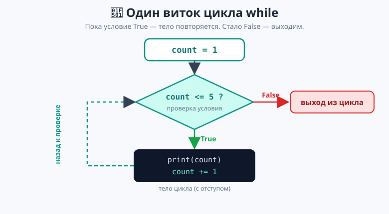
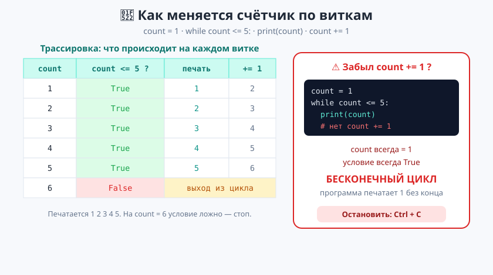
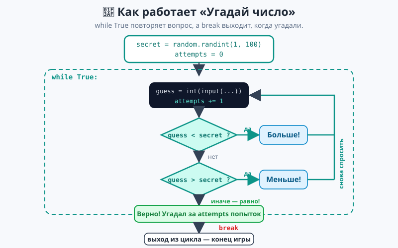

# Урок 1 — «Угадай число»: цикл `while` и `break` 🔁🎯

**Модуль 3 · Циклы · Урок 1 из 6 | 2 ак.ч. (1,5 часа)**

> ⬅️ Предыдущий: [Модуль 2 «Условия и логика»](../../модуль-02-условия-и-логика/README.md) · [Все уроки модуля](../README.md) · [План курса](../../ПЛАН-КУРСА.md) · Следующий: [Урок 2 «for и range»](../урок-02-for-и-range/урок.md) ➡️

> 🔁 В начале — [разминка/повтор](повторение.md) (5 мин).
> 📌 Быстро вспомнить материал урока — [итого.md](итого.md) (шпаргалка).
> 👨‍🏫 Сценарий с хронометражом — в [преподавателю.md](преподавателю.md).
> 🖼 Что показать на проекторе — в [изображения.md](изображения.md).
> 🆘 **Пропустил урок или хочешь закрепить?** Открой [самоучитель.md](самоучитель.md) — теория + задания с подсказками.
> 🧰 Трюки и частые ошибки — в [лайфхак.md](лайфхак.md).

> 🧭 **Как читать урок.** До сих пор программа выполняла каждую строку **один раз** сверху вниз. Но компьютер силён именно в **повторении**: сыграть раунд ещё раз, спросить пароль снова, посчитать от 1 до 100. Копировать код 100 раз — безумие. Сегодня научим программу **повторять** действия сама — это называется **цикл**. Начнём с цикла `while` («пока»), познакомимся с выходом `break` — и соберём настоящую игру «Угадай число», в которую можно играть по-настоящему.

---

## 🎮 Что мы сделаем сегодня и что получим

**Задача:** компьютер загадывает число от 1 до 100, а мы угадываем. После каждой попытки он подсказывает «Больше!» или «Меньше!», считает попытки — и радуется вместе с нами, когда мы угадали.

**В итоге получится** файл `угадай_число.py`:

```
================================
УГАДАЙ ЧИСЛО ОТ 1 ДО 100
================================
Твой вариант: 50
Меньше!
Твой вариант: 25
Больше!
Твой вариант: 37
Меньше!
Твой вариант: 31
Верно! Ты угадал число 31 за 4 попыток.
--------------------------------
Спасибо за игру!
```

**Главные навыки урока:** цикл `while` · условие продолжения · тело цикла и отступ · изменение переменной внутри цикла · `while True` · выход `break` · 🎓 счётчик и лимит попыток.

> 💡 **Главная мысль урока:** **цикл `while` повторяет тело, пока условие True.** Три обязательные детали: (1) с чего начать, (2) условие продолжения, (3) **что-то менять внутри**, чтобы условие однажды стало False — иначе цикл будет крутиться вечно.

---

## Часть 0 — Разминка: почему `if` не хватает (4 минуты)

Вот игра «Угадай число» **без цикла**, только на том, что мы уже знаем:

```python
secret = 42
guess = int(input("Число: "))
if guess == secret:
    print("Угадал!")
else:
    print("Не угадал.")   # и всё — программа закончилась
```

Проблема: **одна попытка — и конец**. Чтобы дать три попытки, пришлось бы скопировать этот кусок три раза. А чтобы дать «сколько нужно, пока не угадает» — это вообще невозможно скопировать: мы же не знаем заранее, сколько раз!

> 🎯 Нам нужна конструкция, которая говорит: «**повторяй** спрашивать, **пока** не угадал». Это и есть цикл `while`.

---

## Часть 1 — Первый `while`: счётчик (12 минут)

`while` переводится как «**пока**». Читается как условие: «**пока** условие истинно — повторяй тело».

```python
count = 1                 # 1) с чего начинаем
while count <= 5:         # 2) условие: пока count не больше 5
    print(count)          # 3) тело цикла (с отступом!)
    count += 1            #    меняем count, иначе зациклимся
print("Поехали!")         # это уже ВНЕ цикла (без отступа)
```

Вывод:

```
1
2
3
4
5
Поехали!
```

**Как Python это выполняет** (обязательно проговори вслух):

1. `count = 1`. Проверяет `1 <= 5`? Да → печатает `1`, делает `count = 2`.
2. Проверяет `2 <= 5`? Да → печатает `2`, `count = 3`. …и так далее.
3. На `count = 6`: проверяет `6 <= 5`? **Нет** → выходит из цикла и печатает «Поехали!».



> 💡 **Три части любого `while`.** (1) **начало** — переменная до цикла (`count = 1`); (2) **условие** — после `while`, с двоеточием; (3) **изменение** — внутри тела что-то приближает условие к False (`count += 1`). Нет третьей части — будет вечный цикл (об этом в Части 2).

> 💡 **Отступ решает всё.** Строки с отступом — это **тело цикла**, они повторяются. Строка без отступа (`print("Поехали!")`) — уже после цикла, выполнится один раз. Двоеточие после условия — обязательно, как у `if`.

Один и тот же `while` умеет считать в любую сторону — покажем **два разных примера**.

**Пример 1 — обратный отсчёт (запуск ракеты):**

```python
n = 5
while n > 0:
    print(n)
    n -= 1                # уменьшаем на 1
print("Старт!")
```

- 👀 Печатает `5 4 3 2 1`, потом «Старт!». Здесь условие приближается к False через `n -= 1`.

**Пример 2 — накопитель суммы (копилка):**

```python
total = 0                 # копилка суммы
num = 1
while num <= 5:
    total += num          # прибавляем num к копилке
    num += 1
print(f"Сумма 1..5 = {total}")   # 15
```

- 👀 Складывает `1+2+3+4+5 = 15`. Приём «копилка» (`total += num`) мы уже видели со счётом очков — теперь он работает **внутри цикла**.

**Пример 3 — идём по списку (мостик к спискам):**

Списки мы **уже видели** в Модуле 2 (КНБ: `options = ["камень", "ножницы", "бумага"]`). Цикл умеет пройти по списку — брать элементы по индексу `0, 1, 2 …`, пока индекс не дошёл до конца (`len`):

```python
games = ["Minecraft", "Roblox", "Sims"]   # список из 3 строк
i = 0
while i < len(games):        # пока индекс меньше длины списка
    print(games[i])          # элемент по индексу: games[0], games[1], games[2]
    i += 1
```

- 👀 Печатает все три названия. `i` играет роль счётчика-индекса: 0 → 1 → 2, а на `3` условие `3 < len(games)` ложно — выходим.

> 💡 **Список + цикл = друзья.** Так мы «оживляем» список из КНБ: перебираем его элемент за элементом. Через `while` это делается по индексу; но есть **ещё удобнее** способ — цикл `for`, который сам пройдёт по списку без счётчика. Это тема **следующего урока**.

> ✍️ **Мини-задание 1 (3 мин):** выведи числа от 1 до 10 с помощью `while`. Потом переделай, чтобы выводило только **чётные**: 2, 4, 6, 8, 10.
> <details><summary>💡 подсказка</summary>Для чётных начни с <code>n = 2</code> и делай шаг <code>n += 2</code>. Условие — <code>while n &lt;= 10:</code>.</details>

> ✍️ **Мини-задание 2 (3 мин):** посчитай сумму чисел от 1 до 100 (не складывая руками!). Заведи `total = 0` и накапливай в цикле.
> <details><summary>💡 подсказка</summary><code>num = 1</code>, <code>while num &lt;= 100:</code>, внутри <code>total += num</code> и <code>num += 1</code>. Ответ должен быть 5050.</details>

> ⚠️ **Не забудь двоеточие и отступ.** `while count <= 5` без `:` → `SyntaxError`. Тело без отступа → `IndentationError`.

---

## Часть 2 — Вечный цикл и как его НЕ сделать (6 минут)

Что будет, если **забыть** `count += 1`?

```python
count = 1
while count <= 5:
    print(count)      # ← забыли count += 1
```

`count` навсегда останется `1`, условие `1 <= 5` **всегда True** — и программа будет печатать `1` **бесконечно**. Это **вечный (бесконечный) цикл** — самая частая ошибка новичка.



> 🆘 **Если программа зависла и печатает без конца** — нажми **`Ctrl + C`** в окне запуска (терминале). Это аварийная остановка. Запомни эту комбинацию — она спасает от любого вечного цикла.

> 💡 **Правило спасения от вечного цикла:** в теле `while` **обязательно** должно быть что-то, что приближает условие к False. Обычно это `+= 1`, `-= 1` или ввод пользователя (в Части 3). Написал `while` — сразу спроси себя: «а что здесь однажды сделает условие ложным?»

> 💡 **Трюк «трассировка на бумаге».** Не уверен, что цикл остановится — выпиши в столбик значения переменной по виткам (как в схеме выше): 1, 2, 3, 4, 5, 6 → стоп. Если столбик не приближается к границе — цикл вечный.

> ✍️ **Мини-задание 3 (2 мин):** посмотри на код и **не запуская** скажи, остановится ли он. `x = 10` / `while x > 0:` / `    print(x)` — что забыли?
> <details><summary>💡 подсказка</summary>Забыли <code>x -= 1</code>. Без изменения <code>x</code> условие <code>x &gt; 0</code> всегда True — вечный цикл.</details>

---

## Часть 3 — `while True` и выход `break` (12 минут)

Часто мы **не знаем заранее**, сколько раз повторять: «спрашивай пароль, **пока** не введут верный». Сколько попыток сделает человек — неизвестно. Для таких случаев есть приём: `while True` + `break`.

- **`while True`** — «повторяй **всегда**» (условие буквально всегда истинно).
- **`break`** — команда «**выйти из цикла прямо сейчас**». Как только Python встречает `break`, цикл заканчивается.

Снова **два разных примера**.

**Пример 1 — ввод пароля, пока не верный:**

```python
while True:
    password = input("Пароль: ")
    if password == "1234":
        print("Доступ открыт!")
        break                     # верно — выходим из цикла
    print("Неверно, попробуй ещё раз.")
```

- 👀 Пока вводят не то — цикл крутится и просит снова. Ввели `1234` → печать «Доступ открыт!» и `break` завершает цикл. Здесь **условие выхода — не счётчик, а действие пользователя**.

**Пример 2 — «Сыграем ещё?» (повтор по желанию):**

```python
while True:
    print("...(здесь была бы игра)...")
    again = input("Сыграем ещё? (да/нет) ").lower().strip()
    if again != "да":
        print("Пока!")
        break                     # ответил не «да» — выходим
```

- 👀 Игра повторяется, пока игрок отвечает «да». Любой другой ответ → `break` и выход. Это классический «игровой цикл»: играем раунд за раундом, пока хочется.

> 💡 **`while True` + `break` — рабочая пара.** `while True` сам никогда не остановится — выход даёт **только** `break` внутри `if`. Это самый частый способ сделать цикл «повторяй, пока не случится вот это».

> 💡 **`break` выходит сразу.** Строки тела **после** `break` не выполнятся — Python мгновенно покидает цикл. Поэтому `break` обычно ставят последним в своей ветке `if`.

> ✍️ **Мини-задание 4 (3 мин):** спрашивай у пользователя слово, пока он не введёт `стоп`. Каждое слово (кроме «стоп») выводи с восклицательным знаком: `Привет!`.
> <details><summary>💡 подсказка</summary><code>while True:</code> → <code>word = input(...)</code> → <code>if word == "стоп": break</code> → иначе <code>print(word + "!")</code>.</details>

> ⚠️ **`break` работает только внутри цикла.** Написать `break` вне `while`/`for` → `SyntaxError`. И помни: `break` выходит только из **своего** цикла.

---

## Часть 4 — Собираем «Угадай число» 🏆 (16 минут)

Теперь всё вместе. Компьютер загадывает число через `random.randint` (помним из Модуля 1), а мы в цикле угадываем, пока не попадём.

```python
import random

secret = random.randint(1, 100)   # секретное число (сам его не видишь)
attempts = 0                      # копилка попыток

print("=" * 32)
print("УГАДАЙ ЧИСЛО ОТ 1 ДО 100")
print("=" * 32)

while True:
    guess = int(input("Твой вариант: "))
    attempts += 1                 # была ещё одна попытка

    if guess < secret:
        print("Больше!")
    elif guess > secret:
        print("Меньше!")
    else:
        print(f"Верно! Ты угадал число {secret} за {attempts} попыток.")
        break                     # угадали — выходим из цикла

print("-" * 32)
print("Спасибо за игру!")
```



- 👀 **Что видишь:** цикл спрашивает снова и снова. Три исхода на каждой попытке: `guess < secret` → «Больше!» (твоё число меньше загаданного, целься выше); `guess > secret` → «Меньше!»; равно → победа и `break`. Счётчик `attempts` растёт на каждой попытке.

> 💡 **Разбор приёма.** «Больше!» означает «**загаданное больше** твоего» — значит, называй бОльшее число. Ветки `if/elif/else` внутри цикла — это встреча двух тем: **условия из Модуля 2** теперь работают **внутри цикла**. `break` в ветке `else` — единственный выход.

> 💡 **Умная стратегия (расскажи детям).** Всегда называй **середину**: 50, потом 25 или 75, и так далее — так любое число от 1 до 100 угадывается максимум за **7 попыток**. Это метод «деления пополам». Проверьте на схеме из примера вывода: 50 → 25 → 37 → 31.

> 🧩 **Для 5–7 классов (проще):** сузь диапазон до 1–10 (`random.randint(1, 10)`) и убери счётчик `attempts` — оставь только «Больше/Меньше/Верно» и `break`.

> 📄 Полный проверенный код — [`материалы/угадай_число.py`](материалы/угадай_число.py).

---

## 🎓 Часть 5 — Для тех, кто хочет глубже: лимит попыток (по времени)

Сейчас игрок может гадать бесконечно. Сделаем честнее: **только 7 попыток**, иначе побеждает компьютер. Здесь у цикла **два** условия выхода: угадал (`break`) **или** попытки кончились (условие `while`).

```python
import random

secret = random.randint(1, 100)
attempts = 0
max_attempts = 7                  # больше 7 не даём
won = False                       # флаг победы: пока не угадал

print("У тебя 7 попыток. Я загадал число от 1 до 100.")

while attempts < max_attempts:    # пока есть попытки
    guess = int(input("Твой вариант: "))
    attempts += 1
    left = max_attempts - attempts    # сколько осталось

    if guess < secret:
        print(f"Больше! Осталось попыток: {left}")
    elif guess > secret:
        print(f"Меньше! Осталось попыток: {left}")
    else:
        print(f"Верно! Ты угадал за {attempts} попыток.")
        won = True
        break                     # угадал раньше лимита

if not won:
    print(f"Попытки кончились. Я загадал {secret}. Компьютер победил!")
```

- 👀 Условие `attempts < max_attempts` само остановит цикл, когда попыток не останется. Флаг `won` (тип `bool` из Модуля 2!) помнит, победил ли игрок. После цикла `if not won:` печатает поражение только если не угадал.

> 💡 **Флаг-переменная `won`.** Простой и мощный приём: завести `bool`-переменную «случилось ли что-то» и проверить её после цикла. Пригодится очень часто.

> ✍️ **Мини-задание 5 🎓 (4 мин):** добавь в основную игру подсчёт и выводи в конце разную похвалу: за 1–4 попытки «Отлично!», за 5–7 «Неплохо», больше — «Долго думал». Используй `if/elif` после `break`.

---

## 🐞 Разбор частых ошибок

| Симптом | Что случилось | Как починить |
|---------|---------------|--------------|
| программа печатает без конца | забыл менять переменную (`count += 1`) | добавь изменение в тело; аварийно — `Ctrl+C` |
| `SyntaxError` на строке `while` | нет двоеточия `:` | `while count <= 5:` |
| `IndentationError` | тело без отступа | сделай отступ (4 пробела) у строк тела |
| цикл не запускается ни разу | условие ложно с самого начала | проверь стартовое значение переменной |
| `break` вне цикла → `SyntaxError` | `break` написан не внутри `while`/`for` | `break` только внутри цикла |
| `while True` не выходит | нет `break` внутри | добавь `if ...: break` |
| игра не считает попытки | `attempts += 1` не в теле или забыт | ставь `attempts += 1` сразу после ввода |

> ⚠️ **Главное правило:** в каждом `while` спроси себя — «**что** здесь однажды сделает условие ложным (или где `break`)?» Нет ответа — будет вечный цикл.

---

## 🏁 Итог урока (5 минут)

Программа научилась **повторять** — это огромный шаг:

- ✅ **`while условие:`** повторяет тело, **пока** условие True.
- ✅ Три части цикла: **начало** → **условие** → **изменение** внутри тела.
- ✅ Без изменения переменной — **вечный цикл**; аварийная остановка — **`Ctrl+C`**.
- ✅ **`while True` + `break`** — повторять, пока не случится нужное; `break` выходит сразу.
- ✅ Условия `if/elif/else` и счётчики `+=` теперь работают **внутри** цикла.
- ✅ 🎓 Лимит попыток через условие `while` + флаг `won`.

> 🏆 Главное: **`while` — это «повторяй, пока…»; `break` — «выйти сейчас».** Быстро повторить — в [итого.md](итого.md).

> 🎤 **Блиц:** как читается `while`? какие три части обязательны у цикла? отчего бывает вечный цикл и как его остановить? зачем `while True`? что делает `break`? где в игре стоит `break` и почему?

### 🎮 Викторина-закрепление
Открой **[викторина.html](викторина.html)** — 16 вопросов + смешные и «на подумать».

➡️ **Практика урока** — **[практика.md](практика.md)**: задачи в 3 уровнях с подсказками.
🆘 **Пропустил / хочешь ещё?** — [самоучитель.md](самоучитель.md) (теория + 15–20 заданий).
🧰 **Трюки и ошибки** — [лайфхак.md](лайфхак.md). 📌 **Шпаргалка** — [итого.md](итого.md).

---

## 🔗 Навигация и материалы

⬅️ **Предыдущий:** [Модуль 2 «Условия и логика»](../../модуль-02-условия-и-логика/README.md) · [Все уроки модуля](../README.md) · [План курса](../../ПЛАН-КУРСА.md) · **Следующий:** [Урок 2 «for и range»](../урок-02-for-и-range/урок.md) ➡️

**🧰 Инструменты:** [Python](https://www.python.org/downloads/) · среда: [PyCharm Community](https://www.jetbrains.com/pycharm/download/) или [VS Code](https://code.visualstudio.com/).
**📄 Готовый код:** [`материалы/угадай_число.py`](материалы/угадай_число.py) · [`материалы/угадай_число_лимит.py`](материалы/угадай_число_лимит.py) (оба проверены запуском).
**⚙️ Учителю:** сценарий и частые ошибки — в [преподавателю.md](преподавателю.md).
