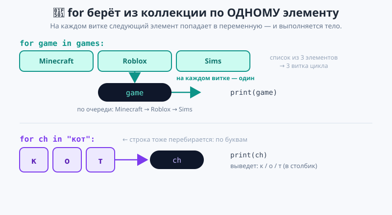
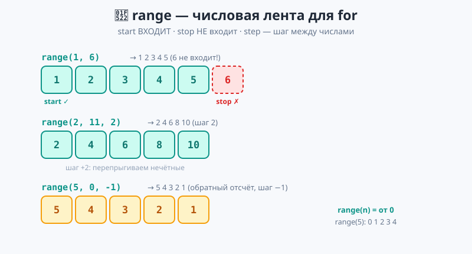
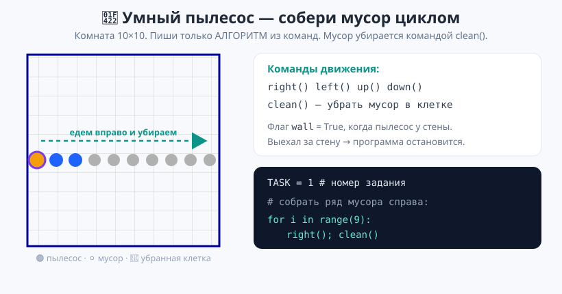

# Урок 2 — «Таблица умножения и Ёлочка»: цикл `for`, перебор списков, строк и `range` 🔁📋

**Модуль 3 · Циклы · Урок 2 из 6 | 2 ак.ч. (1,5 часа)**

> ⬅️ Предыдущий: [Урок 1 «while: Угадай число»](../урок-01-while-угадай-число/урок.md) · [Все уроки модуля](../README.md) · [План курса](../../ПЛАН-КУРСА.md) · Следующий: [Урок 3 «for мощнее: enumerate, zip»](../урок-03-enumerate-zip/урок.md) ➡️

> 🔁 В начале — [разминка/повтор](повторение.md) (5 мин).
> 📌 Быстро вспомнить материал урока — [итого.md](итого.md) (шпаргалка).
> 👨‍🏫 Сценарий с хронометражом — в [преподавателю.md](преподавателю.md).
> 🖼 Что показать на проекторе — в [изображения.md](изображения.md).
> 🆘 **Пропустил урок или хочешь закрепить?** Открой [самоучитель.md](самоучитель.md) — теория + задания с подсказками.
> 🧰 Трюки и частые ошибки — в [лайфхак.md](лайфхак.md).
> 🐢 В конце — **практика-игра «Умный пылесос»** (собираем мусор циклом).

> 🧭 **Как читать урок.** В прошлом уроке `while` повторял, **пока** выполнялось условие. Но чаще мы знаем **точно, сколько раз** нужно повторить или **что именно перебрать**: все игры в списке, все буквы в слове, числа от 1 до 10. Для этого есть цикл **`for`** — он сам берёт из коллекции элементы **по одному**, без ручного счётчика. Сегодня разберём, **как устроен перебор**, научимся ходить по спискам, строкам и числам (`range`) — и соберём таблицу умножения и ёлочку из звёздочек. А в конце поиграем в «Умный пылесос»: будем собирать мусор циклом.

---

## 🎮 Что мы сделаем сегодня и что получим

**Задача:** напечатать таблицу умножения на любое число и нарисовать ёлочку из звёздочек — коротким циклом `for`.

**В итоге получатся** `таблица_умножения.py` и `ёлочка.py`:

```
На какое число таблицу умножения? 7
Таблица умножения на 7:
7 x 1 = 7
7 x 2 = 14
...
7 x 10 = 70
```
```
Высота ёлочки: 5
    *
   ***
  *****
 *******
*********
    |
```

**Главные навыки урока:** `for` — перебор **без счётчика** · перебор **списка** · перебор **строки** · `range(n)` / `range(a, b)` / `range(a, b, шаг)` · приём `print(end=)` · 🐢 игра «Умный пылесос» (собрать мусор циклом).

> 💡 **Главная мысль урока:** **`for` берёт из коллекции по одному элементу и выполняет тело для каждого.** Коллекция — это список, строка или `range`. Не нужен ручной индекс: `for` сам проходит всё до конца.

---

## Часть 0 — Разминка: `while` по списку неудобен (4 минуты)

В прошлом уроке мы ходили по списку через `while` и **индекс**:

```python
games = ["Minecraft", "Roblox", "Sims"]
i = 0
while i < len(games):
    print(games[i])
    i += 1
```

Работает, но три лишние строки: завести `i`, проверять `i < len(...)`, не забыть `i += 1`. Забыл `+= 1` — вечный цикл. Хочется просто сказать: «**для каждой** игры в списке — выведи её». Именно это делает `for`.

---

## Часть 1 — `for`: перебор списка без счётчика (14 минут)

**`for`** переводится как «**для каждого**». Читается по-русски: «**для каждого** элемента в коллекции — выполни тело».

```python
games = ["Minecraft", "Roblox", "Sims"]
for game in games:          # для каждой игры в списке games
    print("-", game)
```

Вывод:
```
- Minecraft
- Roblox
- Sims
```

**Как работает перебор** (проговори вслух):
1. `for` берёт **первый** элемент списка (`"Minecraft"`), кладёт его в переменную `game`, выполняет тело.
2. Берёт **второй** (`"Roblox"`) → в `game` → тело. Потом третий.
3. Элементы кончились — цикл сам заканчивается. **Никакого `i`, никакого `+= 1`.**



> 💡 **Переменная цикла — «коробочка на один элемент».** Имя (`game`) выбираешь сам; на каждом витке в ней **следующий** элемент. Удобно называть в единственном числе: `for game in games`, `for name in names`.

> 💡 **`for` vs `while`.** `while` — когда **неизвестно**, сколько повторов («пока не угадает»). `for` — когда **есть что перебрать** или известно число повторов. По списку почти всегда берут `for` — он короче и не зациклится.

> ✍️ **Мини-задание 1 (2 мин):** заведи список из 4 любимых блюд и выведи каждое с новой строки через `for`.
> <details><summary>💡 подсказка</summary><code>food = ["...", "...", "...", "..."]</code>, затем <code>for dish in food:</code> → <code>print(dish)</code>.</details>

> ⚠️ **Двоеточие и отступ — как у `while`/`if`.** `for game in games` без `:` → `SyntaxError`. Тело — с отступом.

---

## Часть 2 — Перебор строки: по буквам (10 минут)

Строка — это тоже **последовательность**, только из символов. `for` проходит её **по буквам**:

```python
word = "Привет"
for letter in word:
    print(letter)
```

- 👀 Выведет каждую букву в столбик: `П`, `р`, `и`, `в`, `е`, `т`. `for` не различает список и строку — он перебирает **любую последовательность** по одному элементу.

**Второй пример — считаем буквы `а` в слове** (счётчик из Модуля 2 внутри цикла):

```python
word = input("Введи слово: ").lower()
count = 0
for letter in word:
    if letter == "а":
        count += 1
print(f"Букв 'а': {count}")
```

- 👀 На каждой букве проверяем условие и растим копилку. Это соединение тем: **перебор + `if` + счётчик**.

> 💡 **`len()` работает и со строкой.** `len("Привет")` → 6 (число символов). А `for` избавляет от индексов: не надо `word[0]`, `word[1]` — просто `for letter in word`.

> ✍️ **Мини-задание 2 (3 мин):** спроси слово и выведи, сколько в нём букв (`len`). Потом перебором посчитай, сколько в нём букв `о`.
> <details><summary>💡 подсказка</summary><code>len(word)</code> для длины; для подсчёта — <code>for letter in word:</code> и <code>if letter == "о": count += 1</code>.</details>

---

## Часть 3 — `range`: числа по порядку (18 минут)

А если нужно перебрать **числа** или повторить действие **N раз**? Для этого есть `range` — он выдаёт числа по порядку.

```python
for i in range(1, 6):     # числа 1, 2, 3, 4, 5
    print(i)
```

**Три формы `range`:**

| Запись | Что даёт | Пример |
|--------|----------|--------|
| `range(n)` | от **0** до n−1 | `range(5)` → 0 1 2 3 4 |
| `range(a, b)` | от a до **b−1** | `range(1, 6)` → 1 2 3 4 5 |
| `range(a, b, шаг)` | от a до b−1 с шагом | `range(2, 11, 2)` → 2 4 6 8 10 |



> 💡 **Золотое правило `range`: `start` входит, `stop` НЕ входит.** `range(1, 6)` — это 1…5, шестёрки нет. Поэтому для «от 1 до 10» пишут `range(1, 11)`. Это ошибка №1 новичка — «потерять последнее число».

**Обратный отсчёт — отрицательный шаг:**
```python
for i in range(5, 0, -1):   # 5, 4, 3, 2, 1
    print(i)
print("Пуск!")
```

**Приём `print(end=" ")` — печать в одну строку.** Обычно `print` переводит строку. Если хочешь всё в ряд — задай `end`:

```python
for i in range(1, 6):
    print(i, end=" ")       # 1 2 3 4 5 в одну строку
print()                     # пустой print() — перевод строки в конце
```

- 👀 `end=" "` ставит после числа **пробел** вместо перевода строки. В конце пустой `print()` завершает строку.

> ✍️ **Мини-задание 3 (3 мин):** выведи в **одну строку** числа от 1 до 20 через пробел. Потом — только те, что кратны 3 (`range(3, 21, 3)`).
> <details><summary>💡 подсказка</summary><code>for i in range(1, 21): print(i, end=" ")</code>. Для кратных 3 — шаг 3.</details>

**Проект «Таблица умножения» 🏆.** Соединяем `for` + `range` + f-строку:

```python
n = int(input("На какое число таблицу умножения? "))

print(f"Таблица умножения на {n}:")
for i in range(1, 11):          # i = 1, 2, ..., 10
    print(f"{n} x {i} = {n * i}")

print("Готово!")
```

- 👀 `i` пробегает 1…10, а `n * i` считает произведение. Десять строк таблицы — тремя строками кода. Полный файл — [`материалы/таблица_умножения.py`](материалы/таблица_умножения.py).

> ⚠️ **`range(1, 10)` даст только до 9!** Для таблицы до ×10 нужно `range(1, 11)` — помни, что `stop` не входит.

---

## Часть 4 — Проект «Ёлочка» 🏆 (12 минут)

Строку можно **умножать**: `"*" * 3` даёт `"***"`, `" " * 4` — четыре пробела. Соединим это с `for` и `range` — нарисуем ёлочку:

```python
height = int(input("Высота ёлочки (например 5): "))

for i in range(1, height + 1):
    spaces = " " * (height - i)     # отступ слева
    stars = "*" * (2 * i - 1)       # 1, 3, 5, 7, ... звёзд
    print(spaces + stars)

print(" " * (height - 1) + "|")     # ствол
```

- 👀 На витке `i` печатаем `height - i` пробелов и `2*i - 1` звёзд — получается треугольник. Проверь на высоте 5. Полный файл — [`материалы/ёлочка.py`](материалы/ёлочка.py).

> 💡 **Разбор формулы.** Нечётные числа звёзд `1, 3, 5, 7…` дают симметричную ёлку — это `2*i - 1`. А убывающие пробелы `height - i` сдвигают каждую строку к центру. Поиграй числами — увидишь, как меняется форма.

> ✍️ **Мини-задание 4 (3 мин):** выведи «лесенку» из звёзд (без пробелов): строка 1 — `*`, строка 2 — `**`, … строка 5 — `*****`.
> <details><summary>💡 подсказка</summary><code>for i in range(1, 6): print("*" * i)</code>.</details>

---

## Часть 5 — 🐢 Практика: Умный пылесос (15 минут)

Теперь применим `for` к настоящей **игре**. В каркасе [`материалы/пылесос.py`](материалы/пылесос.py) — комната 10×10, по которой ездит пылесос и собирает мусор (серые точки). **Черепашку изучать не нужно** — окно и команды уже готовы. Твоя задача: выбрать **номер задания** и написать **алгоритм из команд**, чтобы собрать весь мусор.

**Команды движения:** `right()`, `left()`, `up()`, `down()` — переехать на клетку; `clean()` — убрать мусор в текущей клетке. Есть флаг `wall` (True, когда пылесос у стены). Выедешь за стену — программа остановится.

**Номер задания** — переменная `TASK` вверху файла (меняй: 1, 2, 3 …).

Задание 1 — ряд мусора справа от пылесоса. Собираем его циклом:

```python
TASK = 1

for i in range(9):
    right()      # на клетку вправо
    clean()      # убрать мусор в этой клетке
```



- 🐢 Запусти на **своём компьютере** (PyCharm/VS Code) — пылесос проедет по ряду и закрасит клетки синим, а окно покажет «ЧИСТО!». Меняй `TASK` и решай новые задания (их 12): столбец вверх, нижний ряд, диагональ, Г-образно, рамка по периметру…

> 💡 **Тут виден смысл цикла.** Собрать ряд из 9 клеток без цикла — это 9 раз `right(); clean()` (18 строк). Циклом `for` — три строки. Чем длиннее ряд, тем сильнее выигрыш.

> 💡 **Как думать над заданием.** Посмотри, ГДЕ лежит мусор (ряд? столбец? диагональ?), и повтори нужное движение циклом. Диагональ — это `right(); up(); clean()` в цикле. Г-образная фигура — два цикла подряд.

> 💡 **Анимация.** Пылесос двигается по клеткам **с паузой** — видно каждый шаг твоего алгоритма. Хочешь быстрее или медленнее — измени `_STEP_DELAY` вверху файла (например, `0.1` — быстро).

> 🧩 **Для 5–7 классов:** задания 1–4 (прямые ряды, столбцы, диагональ). 🎓 **Глубже:** задания 6–8 (Г-образно, два ряда, рамка) — нужно несколько циклов подряд.

> ⚠️ **Запускать на компьютере**, не в онлайн-консоли: пылесос рисуется в отдельном окне (его держит `turtle.done()` в конце — не трогай).

---

## 🐞 Разбор частых ошибок

| Симптом | Что случилось | Как починить |
|---------|---------------|--------------|
| в таблице нет ×10 | `range(1, 10)` — 10 не входит | `range(1, 11)` |
| «потерялось» последнее число | забыл, что `stop` не входит | верхнюю границу бери на 1 больше |
| `SyntaxError` на `for` | нет двоеточия `:` | `for i in range(...):` |
| `IndentationError` | тело без отступа | отступ у строк тела |
| всё печатается в столбик | не задал `end` | `print(x, end=" ")` |
| `range(5)` начал с 0, а ждал 1 | `range(n)` идёт от 0 | `range(1, n+1)` |
| строка не перебирается по буквам | перебираешь список из одной строки | `for c in "слово"`, не `for c in ["слово"]` |

> ⚠️ **Главное правило `range`:** `start` входит, `stop` — нет. Проверяй верхнюю границу.

---

## 🏁 Итог урока (5 минут)

Цикл `for` сделал перебор простым:

- ✅ **`for x in коллекция:`** — берёт элементы **по одному**, без счётчика.
- ✅ Перебирать можно **список** (по элементам) и **строку** (по буквам) — любую последовательность.
- ✅ **`range`**: `range(n)` (с 0), `range(a, b)` (b не входит!), `range(a, b, шаг)` (в т.ч. отрицательный).
- ✅ Приём **`print(end=" ")`** — печать в одну строку; `"*" * k` — повтор строки.
- ✅ Внутри `for` живут `if` и счётчики (посчитать буквы, суммировать).
- ✅ 🐢 Игра «Умный пылесос»: собираем ряд/столбец/диагональ мусора циклом.

> 🏆 Главное: **`for` — это «для каждого элемента»; `range` даёт числа (start входит, stop нет).** Быстро повторить — в [итого.md](итого.md).

> 🎤 **Блиц:** как читается `for`? чем `for` удобнее `while` для списка? что перебирает `for` в строке? что даёт `range(1, 6)`? почему в таблице нужен `range(1, 11)`? зачем `print(end=" ")`? как собрать ряд мусора пылесосом одним циклом?

### 🎮 Викторина-закрепление
Открой **[викторина.html](викторина.html)** — 18 вопросов + смешные и «на подумать».

➡️ **Практика урока** — **[практика.md](практика.md)**: задачи в 3 уровнях + 🐢 turtle.
🆘 **Пропустил / хочешь ещё?** — [самоучитель.md](самоучитель.md) (теория + 15–20 заданий).
🧰 **Трюки и ошибки** — [лайфхак.md](лайфхак.md). 📌 **Шпаргалка** — [итого.md](итого.md).

---

## 🔗 Навигация и материалы

⬅️ **Предыдущий:** [Урок 1 «while: Угадай число»](../урок-01-while-угадай-число/урок.md) · [Все уроки модуля](../README.md) · [План курса](../../ПЛАН-КУРСА.md) · **Следующий:** [Урок 3 «for мощнее: enumerate, zip»](../урок-03-enumerate-zip/урок.md) ➡️

**🧰 Инструменты:** [Python](https://www.python.org/downloads/) · среда: [PyCharm Community](https://www.jetbrains.com/pycharm/download/) или [VS Code](https://code.visualstudio.com/).
**📄 Готовый код:** [`таблица_умножения.py`](материалы/таблица_умножения.py) · [`ёлочка.py`](материалы/ёлочка.py) · [`перебор_демо.py`](материалы/перебор_демо.py) · 🐢 [`пылесос.py`](материалы/пылесос.py) (все проверены).
**⚙️ Учителю:** сценарий и частые ошибки — в [преподавателю.md](преподавателю.md).
