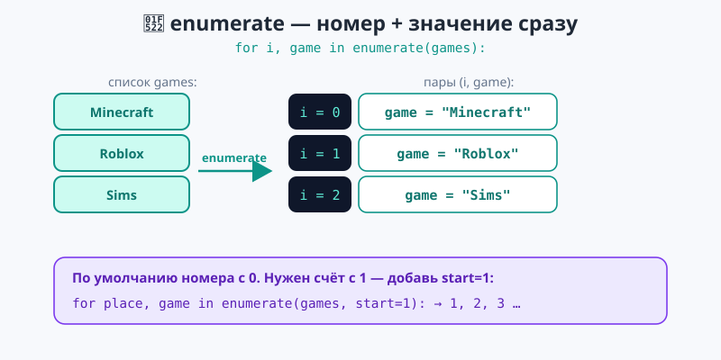
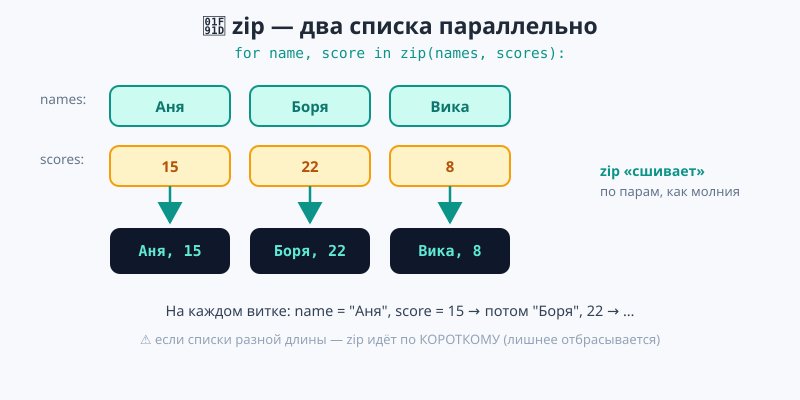
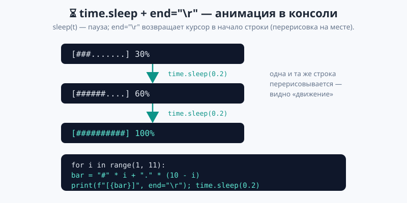
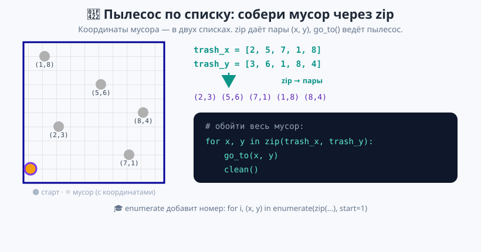

# Урок 3 — «Табло результатов»: `enumerate`, `zip`, накопители и анимация `time.sleep` 🔁🏆

**Модуль 3 · Циклы · Урок 3 из 6 | 2 ак.ч. (1,5 часа)**

> ⬅️ Предыдущий: [Урок 2 «for и range»](../урок-02-for-и-range/урок.md) · [Все уроки модуля](../README.md) · [План курса](../../ПЛАН-КУРСА.md) · Следующий: [Урок 4 «Вложенные циклы»](../урок-04-вложенные-циклы/урок.md) ➡️

> 🔁 В начале — [разминка/повтор](повторение.md) (5 мин).
> 📌 Быстро вспомнить материал урока — [итого.md](итого.md) (шпаргалка).
> 👨‍🏫 Сценарий с хронометражом — в [преподавателю.md](преподавателю.md).
> 🖼 Что показать на проекторе — в [изображения.md](изображения.md).
> 🆘 **Пропустил урок или хочешь закрепить?** Открой [самоучитель.md](самоучитель.md) — теория + задания с подсказками.
> 🧰 Трюки и частые ошибки — в [лайфхак.md](лайфхак.md).
> 🐢 В конце — **игра «Умный пылесос по списку»** (собираем мусор по двум спискам координат через `zip`).

> 🧭 **Как читать урок.** Обычный `for` перебирает **один** список. Но в жизни данные ходят парами: игрок **и** его очки, товар **и** цена, ученик **и** оценка. И часто нужен **номер** элемента: «1-е место», «2-е место». Сегодня добавим к `for` два помощника — **`enumerate`** (номер + значение) и **`zip`** (два списка сразу), научимся считать итоги списка (`sum`, `max`) и оживим программу паузами **`time.sleep`** — сделаем прогресс-бар и бегущую строку. Соберём «Табло результатов».

---

## 🎮 Что мы сделаем сегодня и что получим

**Задача:** показать табло игроков — с местами и очками, посчитать итоги (сумма, лучший), и добавить «загрузку» с прогресс-баром.

**В итоге получится** `табло.py`:

```
=== РЕЗУЛЬТАТЫ ===
Аня: 15 очков
Боря: 22 очков
Вика: 8 очков
--- итоговая таблица ---
1. Аня — 15
2. Боря — 22
3. Вика — 8
Всего очков: 45
Лучший результат: 22
```
и анимация:
```
[##########] 100%
Готово!
```

**Главные навыки урока:** `enumerate` (номер + значение) · `start=1` · `zip` (два списка) · накопители `sum`/`max`/`min`/`len` · `time.sleep` (паузы) · приём `end="\r"` (перерисовка строки).

> 💡 **Главная мысль урока:** **`enumerate` даёт номер вместе с элементом, `zip` идёт по двум спискам сразу.** А `time.sleep` ставит паузу — с ним и приёмом `end="\r"` консоль «оживает».

---

## Часть 0 — Разминка: а где номер элемента? (4 минуты)

`for` по списку удобен, но не даёт **номер**. Хочешь пронумеровать список — приходится заводить счётчик вручную:

```python
games = ["Minecraft", "Roblox", "Sims"]
i = 1
for game in games:
    print(i, game)
    i += 1
```

Снова `i = 1` и `i += 1` — как в `while`. Легко забыть увеличить. Есть встроенный помощник, который **сам** ведёт номер, — `enumerate`.

---

## Часть 1 — `enumerate`: номер + значение (14 минут)

**`enumerate`** на каждом витке даёт **пару**: номер и сам элемент.

```python
games = ["Minecraft", "Roblox", "Sims"]
for i, game in enumerate(games):
    print(i, game)
```

Вывод:
```
0 Minecraft
1 Roblox
2 Sims
```



- 👀 Две переменные через запятую: `i` — номер, `game` — элемент. Python сам их заполняет. Никакого ручного `i += 1`.

**Номера с нуля — а нужно с 1?** Добавь `start=1`:

```python
for place, game in enumerate(games, start=1):
    print(f"{place}. {game}")
```
```
1. Minecraft
2. Roblox
3. Sims
```

- 👀 `start=1` — «нумеруй с единицы». Идеально для мест, списков, пунктов меню.

> 💡 **Две переменные — потому что элемент теперь пара.** `for i, game in ...` — слева **две** переменные (номер и значение). Если написать `for game in enumerate(games):`, в `game` попадёт вся пара `(0, "Minecraft")` — обычно это не то, что нужно.

> ✍️ **Мини-задание 1 (3 мин):** заведи список из 5 любимых фильмов и выведи их пронумерованным списком: `1. ...`, `2. ...` через `enumerate(..., start=1)`.
> <details><summary>💡 подсказка</summary><code>for n, film in enumerate(films, start=1): print(f"{n}. {film}")</code>.</details>

---

## Часть 2 — `zip`: два списка параллельно (14 минут)

Часто данные лежат в **двух** списках: имена и очки. `zip` идёт по ним **одновременно**, «сшивая» в пары — как застёжка-молния.

```python
names = ["Аня", "Боря", "Вика"]
scores = [15, 22, 8]

for name, score in zip(names, scores):
    print(f"{name}: {score} очков")
```
```
Аня: 15 очков
Боря: 22 очков
Вика: 8 очков
```



- 👀 На каждом витке `name` и `score` берутся из **одинаковой позиции** двух списков: сначала (Аня, 15), потом (Боря, 22)…

**Второй пример — товары и цены:**

```python
goods = ["хлеб", "молоко", "сыр"]
prices = [40, 80, 300]

for good, price in zip(goods, prices):
    print(f"{good} — {price} руб.")
```

- 👀 Тот же приём для магазина: список товаров и список цен идут в ногу.

> 💡 **`zip` — «в ногу».** Списки должны описывать **одно и то же по позициям**: `names[0]` и `scores[0]` — про одного игрока. Если списки разной длины, `zip` остановится по **короткому** (лишнее отбросит).

> ✍️ **Мини-задание 2 (3 мин):** два списка — города и их население. Выведи строки `Москва: 13 млн` через `zip`.
> <details><summary>💡 подсказка</summary><code>for city, pop in zip(cities, nums): print(f"{city}: {pop} млн")</code>.</details>

> ⚠️ **Разная длина — потеря данных.** `zip(["a","b","c"], [1,2])` даст только `("a",1),("b",2)` — «c» без пары отбрасывается. Следи, чтобы списки были одной длины.

---

## Часть 3 — Итоги списка: `sum`, `max`, `min`, `len` (10 минут)

Чтобы посчитать итоги, не нужен цикл — у списков чисел есть **встроенные** функции:

```python
scores = [15, 22, 8, 22]
print("Всего:", sum(scores))     # 67
print("Лучший:", max(scores))    # 22
print("Худший:", min(scores))    # 8
print("Игроков:", len(scores))   # 4
```

- 👀 `sum` складывает, `max`/`min` — наибольшее/наименьшее, `len` — количество. Одной строкой каждое.

А если нужно посчитать **по условию** (например, сколько игроков набрали ≥ 20) — тут пригодится **цикл со счётчиком** (приём из Модуля 2):

```python
count = 0
for score in scores:
    if score >= 20:
        count += 1
print("Набрали 20+:", count)     # 2
```

> 💡 **Готовое или руками?** Простая сумма/максимум — бери `sum`/`max`. Подсчёт **по условию** («сколько таких-то») — цикл `for` + `if` + счётчик. Это соединение всех тем: перебор + условие + копилка.

> ✍️ **Мини-задание 3 (3 мин):** дан список оценок. Выведи среднюю оценку (`sum / len`) и сколько среди них пятёрок (цикл + счётчик).
> <details><summary>💡 подсказка</summary>Среднее — <code>sum(marks) / len(marks)</code>; пятёрки — <code>for m in marks: if m == 5: count += 1</code>.</details>

---

## Часть 4 — `time.sleep`: оживляем консоль (14 минут)

Библиотека **`time`** (знаем из Модуля 1) умеет **делать паузу**: `time.sleep(секунды)`. С ней программа перестаёт «мигать мгновенно» и начинает двигаться.

**Пример 1 — обратный отсчёт с паузой:**

```python
import time

for i in range(3, 0, -1):
    print(i)
    time.sleep(1)        # пауза 1 секунда
print("Поехали!")
```

- 👀 Числа появляются **по одному в секунду** — как настоящий отсчёт.

**Приём `end="\r"` — перерисовать строку на месте.** Обычно `print` уходит на новую строку. А `"\r"` (возврат каретки) возвращает курсор в **начало текущей** строки — и следующий `print` пишет поверх. Так делают **прогресс-бар**:

```python
import time

print("Загрузка:")
for i in range(1, 11):
    bar = "#" * i + "." * (10 - i)          # 10 клеток
    print(f"[{bar}] {i * 10}%", end="\r")   # перерисовываем ту же строку
    time.sleep(0.2)
print()                                      # перевод строки после бара
print("Готово!")
```



- 👀 Полоска `[####......]` растёт на месте, а не печатается 10 раз в столбик. Секрет — `end="\r"` + `time.sleep`.

> 💡 **`\r` работает в настоящем терминале** (PyCharm/VS Code/консоль). Это спецсимвол «в начало строки» — как `\n` означает «новая строка», так `\r` — «вернись в начало».

> ✍️ **Мини-задание 4 (3 мин):** сделай «загрузку» из 20 шагов: полоска из `=` растёт, в конце «Загружено!». Пауза `time.sleep(0.1)`.
> <details><summary>💡 подсказка</summary><code>for i in range(1, 21): print("=" * i, end="\r"); time.sleep(0.1)</code>, потом <code>print()</code>.</details>

---

## Часть 5 — 🐢 Практика: Умный пылесос по списку (15 минут)

Применим `zip` к **игре**. В каркасе [`материалы/пылесос_список.py`](материалы/пылесос_список.py) мусор разбросан по комнате, а его координаты лежат в **двух списках**: `trash_x` (столбцы) и `trash_y` (строки). Первая точка мусора — в клетке `(trash_x[0], trash_y[0])`. Твоя задача — обойти **весь** мусор через `zip` и убрать его.

**Команды:** `go_to(x, y)` — телепортировать пылесос в клетку `(x, y)`; `clean()` — убрать мусор в текущей клетке. Номер задания — `TASK` (1..8).

```python
for x, y in zip(trash_x, trash_y):    # пары координат (x, y)
    go_to(x, y)
    clean()
```



- 🐢 Запусти на **своём компьютере** — пылесос обойдёт все точки и закрасит их синим, окно покажет «ЧИСТО!». Меняй `TASK` (8 заданий: разбросанный мусор, диагональ, зигзаг…).

> 💡 **Тут виден смысл `zip`.** Координаты X и Y каждой точки лежат в **разных** списках, но идут «в ногу». `zip` соединяет их в пары `(x, y)` — ровно то, что нужно команде `go_to`. Без `zip` пришлось бы возиться с индексами `trash_x[i]`, `trash_y[i]`.

> 💡 **Анимация.** Пылесос перемещается к каждой точке **с паузой** — видно, как `zip` ведёт его по списку. Скорость меняется через `_STEP_DELAY` вверху файла.

> 🧩 **Для 5–7 классов:** задания 1–4 (собрать мусор через `zip`). 🎓 **Глубже (задание 5):** через `enumerate` пронумеруй мусор — выводи `Мусор №1 в (3,2)`, `№2 в (6,7)`…:
> ```python
> for i, (x, y) in enumerate(zip(trash_x, trash_y), start=1):
>     go_to(x, y); clean()
>     print(f"Мусор №{i} в ({x}, {y})")
> ```

---

## 🐞 Разбор частых ошибок

| Симптом | Что случилось | Как починить |
|---------|---------------|--------------|
| в паре лежит `(0, 'Minecraft')` | одна переменная вместо двух | `for i, x in enumerate(...)` — две |
| номера с 0, а нужно с 1 | забыл `start=1` | `enumerate(..., start=1)` |
| `zip` вывел меньше строк | списки разной длины | сделай списки одной длины |
| прогресс-бар печатается в столбик | забыл `end="\r"` | `print(..., end="\r")` |
| бар «съел» текст после | не сделал `print()` в конце | добавь пустой `print()` |
| `NameError: time` | забыл `import time` | подключи в начале |
| `sum(names)` — ошибка | `sum` только для чисел | суммируй список чисел |

> ⚠️ **Главное:** `enumerate`/`zip` дают **пару** — слева от `in` пиши **две** переменные.

---

## 🏁 Итог урока (5 минут)

Циклы стали мощнее:

- ✅ **`enumerate`** — номер + значение; `start=1` для счёта с 1.
- ✅ **`zip`** — два списка **параллельно**, в пары (по короткому, если длины разные).
- ✅ Итоги списка: **`sum` / `max` / `min` / `len`**; подсчёт по условию — цикл + `if` + счётчик.
- ✅ **`time.sleep(t)`** — пауза; приём **`end="\r"`** — прогресс-бар и бегущая строка.
- ✅ 🐢 `zip` в игре: координаты мусора из двух списков → пары `(x, y)` для `go_to`.

> 🏆 Главное: **`enumerate` = номер+значение, `zip` = два списка сразу.** Быстро повторить — в [итого.md](итого.md).

> 🎤 **Блиц:** что даёт `enumerate`? зачем `start=1`? что делает `zip`? что будет, если списки в `zip` разной длины? как посчитать сумму списка? зачем `time.sleep`? что делает `end="\r"`?

### 🎮 Викторина-закрепление
Открой **[викторина.html](викторина.html)** — 18 вопросов + смешные и «на подумать».

➡️ **Практика урока** — **[практика.md](практика.md)**: задачи в 3 уровнях + 🐢 turtle.
🆘 **Пропустил / хочешь ещё?** — [самоучитель.md](самоучитель.md) (теория + задания).
🧰 **Трюки и ошибки** — [лайфхак.md](лайфхак.md). 📌 **Шпаргалка** — [итого.md](итого.md).

---

## 🔗 Навигация и материалы

⬅️ **Предыдущий:** [Урок 2 «for и range»](../урок-02-for-и-range/урок.md) · [Все уроки модуля](../README.md) · [План курса](../../ПЛАН-КУРСА.md) · **Следующий:** [Урок 4 «Вложенные циклы»](../урок-04-вложенные-циклы/урок.md) ➡️

**🧰 Инструменты:** [Python](https://www.python.org/downloads/) · среда: [PyCharm Community](https://www.jetbrains.com/pycharm/download/) или [VS Code](https://code.visualstudio.com/).
**📄 Готовый код:** [`табло.py`](материалы/табло.py) · [`анимация.py`](материалы/анимация.py) · 🐢 [`пылесос_список.py`](материалы/пылесос_список.py) (все проверены).
**⚙️ Учителю:** сценарий и частые ошибки — в [преподавателю.md](преподавателю.md).
