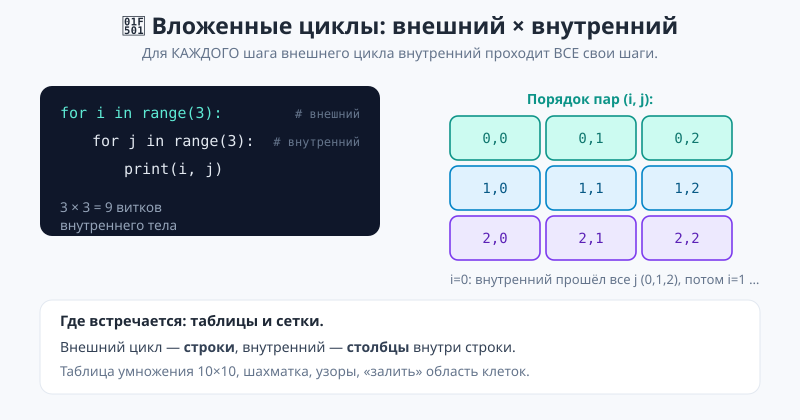
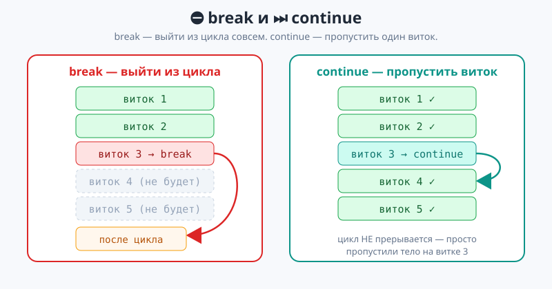
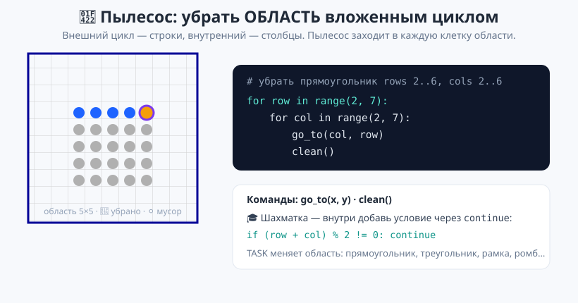

# Урок 4 — «Таблицы и узоры»: вложенные циклы, `break` и `continue` 🔁🔳

**Модуль 3 · Циклы · Урок 4 из 6 | 2 ак.ч. (1,5 часа)**

> ⬅️ Предыдущий: [Урок 3 «enumerate, zip»](../урок-03-enumerate-zip/урок.md) · [Все уроки модуля](../README.md) · [План курса](../../ПЛАН-КУРСА.md) · Следующий: [Урок 5 «Умный пылесос» (практикум)](../урок-05-умный-пылесос/урок.md) ➡️

> 🔁 В начале — [разминка/повтор](повторение.md) (5 мин).
> 📌 Быстро вспомнить материал урока — [итого.md](итого.md) (шпаргалка).
> 👨‍🏫 Сценарий с хронометражом — в [преподавателю.md](преподавателю.md).
> 🖼 Что показать на проекторе — в [изображения.md](изображения.md).
> 🆘 **Пропустил урок или хочешь закрепить?** Открой [самоучитель.md](самоучитель.md) — теория + задания с подсказками.
> 🧰 Трюки и частые ошибки — в [лайфхак.md](лайфхак.md).
> 🐢 В конце — **игра «Умный пылесос: убрать область»** (заливаем область вложенным циклом).

> 🧭 **Как читать урок.** Один цикл проходит **линию**: ряд чисел, буквы слова, ряд клеток. Но таблица умножения, шахматное поле, залитый прямоугольник — это **строки И столбцы** сразу. Чтобы пройти их, нужен **цикл внутри цикла** — вложенный цикл. Сегодня научимся строить таблицы и узоры вложенными циклами, а также управлять циклом на ходу: `break` (выйти досрочно) и `continue` (пропустить виток). В конце пылесос будет **заливать целые области** двойным циклом.

---

## 🎮 Что мы сделаем сегодня и что получим

**Задача:** напечатать таблицу умножения 10×10, нарисовать узоры (треугольник, шахматку) и научить пылесос убирать целую область комнаты.

**В итоге получатся** `таблица_2d.py` и `узоры.py`:

```
   1   2   3   4   5   6   7   8   9  10
   2   4   6   8  10  12  14  16  18  20
   ...
```
```
Треугольник:      Шахматка:
*                 #.#.#.#.
**                .#.#.#.#
***               #.#.#.#.
```

**Главные навыки урока:** вложенный цикл `for` в `for` · внешний × внутренний · таблицы и узоры · `break` (выйти) · `continue` (пропустить) · 🐢 залить область двойным циклом.

> 💡 **Главная мысль урока:** **вложенный цикл — это цикл внутри цикла.** Для **каждого** шага внешнего цикла внутренний проходит **все** свои шаги. Внешний — строки, внутренний — столбцы.

---

## Часть 0 — Разминка: одной строки мало (4 минуты)

Одним циклом легко напечатать **одну** строку звёзд:

```python
for col in range(8):
    print("*", end="")   # 8 звёзд в одну строку
print()
```

Но что, если нужно **5 таких строк**? Скопировать код 5 раз? А если 100? Нужно повторить **сам цикл** несколько раз — то есть поставить **цикл внутрь другого цикла**.

---

## Часть 1 — Вложенные циклы: цикл в цикле (16 минут)

**Вложенный цикл** — это когда внутри тела одного цикла стоит другой цикл.

```python
for row in range(3):        # внешний: 3 строки
    for col in range(3):    # внутренний: 3 столбца
        print(row, col)     # тело внутреннего
```

Вывод:
```
0 0
0 1
0 2
1 0
1 1
1 2
2 0
2 1
2 2
```



**Как работает** (обязательно проговори):
1. Внешний берёт `row = 0`. Внутренний проходит **весь**: `col = 0, 1, 2`.
2. Внешний берёт `row = 1`. Внутренний снова проходит **весь**: `col = 0, 1, 2`.
3. И так для `row = 2`. Итого `3 × 3 = 9` раз выполнилось тело.

> 💡 **Внутренний цикл проходит полностью на КАЖДОМ шаге внешнего.** Если внешний — 3 шага, внутренний — 3, тело выполнится 3 × 3 = 9 раз. Это как часы: часовая стрелка сдвинулась на 1 — минутная прошла полный круг.

> 💡 **Каждому циклу — свой отступ.** Тело внутреннего цикла — на **два** отступа. Перепутаешь отступ — и код попадёт не в тот цикл.

**Проект «Таблица умножения 10×10».** Внешний цикл — строки, внутренний — столбцы:

```python
for row in range(1, 11):                 # строки 1..10
    for col in range(1, 11):             # столбцы 1..10
        print(f"{row * col:4}", end="")  # число в поле шириной 4, без переноса
    print()                              # конец строки — перевод строки
```

- 👀 `{row * col:4}` печатает произведение в «клетке» шириной 4 символа (ровные столбцы), `end=""` держит строку, а `print()` **после внутреннего** цикла переводит на новую строку. Полный файл — [`материалы/таблица_2d.py`](материалы/таблица_2d.py).

> 💡 **Где `print()` для перевода строки?** После **внутреннего** цикла, но внутри **внешнего** — чтобы каждая строка таблицы завершалась переносом. Это ключ ко всем таблицам и узорам.

> ✍️ **Мини-задание 1 (3 мин):** выведи прямоугольник из `#`: 4 строки по 10 символов. Внешний цикл — строки, внутренний — печать `#`.
> <details><summary>💡 подсказка</summary><code>for row in range(4): for col in range(10): print("#", end="")</code>, затем <code>print()</code>.</details>

> ⚠️ **Забыл `print()` после внутреннего** — вся таблица склеится в **одну** строку. Перенос строки делает именно внешний `print()`.

---

## Часть 2 — Узоры: внутренний зависит от внешнего (12 минут)

Самое интересное — когда **внутренний цикл зависит от внешнего**. Тогда строки получаются разной длины.

**Треугольник:** в строке номер `row` печатаем `row` звёзд:

```python
for row in range(1, 6):        # строки 1..5
    for col in range(row):     # столько звёзд, какой номер строки
        print("*", end="")
    print()
```
```
*
**
***
****
*****
```

- 👀 `range(row)` — вот связь: на 1-й строке 1 звезда, на 5-й — 5. Внутренний цикл «слушается» внешнего.

**Шахматка:** цвет клетки зависит от суммы координат:

```python
for row in range(8):
    for col in range(8):
        if (row + col) % 2 == 0:
            print("#", end="")
        else:
            print(".", end="")
    print()
```

- 👀 Если `(row + col)` чётное — `#`, иначе `.`. Внутри вложенного цикла спокойно живёт `if`. Полный файл — [`материалы/узоры.py`](материалы/узоры.py).

> 💡 **Приём «строка = внутренний цикл».** Хочешь узор — think «сколько строк (внешний) и что в каждой строке (внутренний)». Почти любой значок-арт строится так.

> ✍️ **Мини-задание 2 (3 мин):** выведи **перевёрнутый** треугольник: строка 1 — 5 звёзд, строка 2 — 4, … строка 5 — 1.
> <details><summary>💡 подсказка</summary>Внешний <code>for row in range(5, 0, -1):</code>, внутренний <code>for col in range(row):</code>.</details>

---

## Часть 3 — `break` и `continue`: управляем циклом (12 минут)

Иногда нужно **прервать** цикл или **пропустить** один шаг.

**`break` — выйти из цикла досрочно.** Нашли нужное — дальше искать не надо:

```python
for n in range(1, 100):
    if n % 7 == 0:
        print("Первое кратное 7:", n)
        break                # выходим — дальше незачем
```

- 👀 Как только нашли 7 — `break` завершает цикл, до 100 не досчитываем.

**`continue` — пропустить текущий виток** и перейти к следующему:

```python
for n in range(1, 11):
    if n % 3 == 0:
        continue             # пропускаем кратные 3
    print(n, end=" ")
```
```
1 2 4 5 7 8 10
```

- 👀 На кратных 3 `continue` перескакивает `print` — но цикл **продолжается**.



> 💡 **`break` vs `continue`.** `break` — «**стоп**, выхожу из цикла совсем». `continue` — «**пропущу** этот виток, но цикл идёт дальше». Не путай: break прекращает, continue пропускает.

> 💡 **`break` во вложенном цикле выходит только из СВОЕГО (внутреннего) цикла.** Внешний продолжит работу. Это частый источник путаницы.

> ✍️ **Мини-задание 3 (3 мин):** пройди числа 1..20 и выведи только те, что **не** кратны 5, через `continue`. Потом отдельно: найди первое число, большее 50, из списка `[12, 45, 60, 8, 90]`, и выйди по `break`.
> <details><summary>💡 подсказка</summary>Пропуск: <code>if n % 5 == 0: continue</code>. Поиск: <code>for x in nums: if x > 50: print(x); break</code>.</details>

> ⚠️ **`break`/`continue` работают только внутри цикла.** Вне цикла → `SyntaxError`.

---

## Часть 4 — 🐢 Практика: Умный пылесос убирает область (15 минут)

Теперь пылесос убирает не линию, а **целую область**. В каркасе [`материалы/пылесос_область.py`](материалы/пылесос_область.py) мусор заполняет прямоугольник (и другие фигуры). Убрать его удобно **вложенным циклом**: внешний — строки, внутренний — столбцы.

**Команды:** `go_to(x, y)` — переместить пылесос в клетку; `clean()` — убрать мусор. Номер задания — `TASK` (1..8). Область каждого задания описана вверху файла.

Задание 1 — прямоугольник `rows 2..6`, `cols 2..6`. Заливаем двойным циклом:

```python
for row in range(2, 7):          # строки области
    for col in range(2, 7):      # столбцы области
        go_to(col, row)
        clean()
```



- 🐢 Запусти на **своём компьютере** — пылесос обойдёт всю область клетка за клеткой. Меняй `TASK` (8 заданий): широкий прямоугольник, вся комната, треугольник, рамка, два блока…

> 💡 **Тут вложенный цикл виден руками.** Внешний цикл ведёт пылесос по строкам, внутренний — по столбцам внутри строки. Ровно то, что на схеме «внешний × внутренний».

> 💡 **Шахматка через `continue` (задание 5).** Чтобы убрать только «чёрные» клетки, добавь внутрь условие:
> ```python
> for row in range(10):
>     for col in range(10):
>         if (row + col) % 2 != 0:
>             continue          # пропускаем «белые»
>         go_to(col, row)
>         clean()
> ```

> 🧩 **Для 5–7 классов:** задания 1–3 (прямоугольники, вся комната). 🎓 **Глубже:** задания 4–8 (треугольник, шахматка `continue`, рамка, ромб) — где внутренний цикл или условие зависят от строки.

> 💡 **Анимация.** Клеток много, поэтому пауза сделана короткой (`_STEP_DELAY = 0.08`). Хочешь медленнее — увеличь значение вверху файла.

---

## 🐞 Разбор частых ошибок

| Симптом | Что случилось | Как починить |
|---------|---------------|--------------|
| таблица в одну строку | нет `print()` после внутреннего | добавь `print()` внутри внешнего |
| строки одинаковой длины (а нужен треугольник) | внутренний не зависит от `row` | `for col in range(row):` |
| тело не в том цикле | перепутан отступ | внутреннее тело — на 2 отступа |
| `break` вышел «слишком рано» | он выходит из **внутреннего** цикла | вынеси условие или используй флаг |
| `continue`/`break` вне цикла | `SyntaxError` | они только внутри цикла |
| область убрана не вся | не те границы `range` | сверь `range` с областью (stop не входит) |

> ⚠️ **Главное про вложенные:** внутренний цикл проходит **полностью** на каждом шаге внешнего; перенос строки — `print()` **после** внутреннего.

---

## 🏁 Итог урока (5 минут)

Циклы вышли на второй уровень:

- ✅ **Вложенный цикл** — цикл в цикле; внутренний проходит **весь** на каждом шаге внешнего.
- ✅ Внешний — **строки**, внутренний — **столбцы**: так строятся таблицы и узоры.
- ✅ Внутренний может **зависеть** от внешнего (`range(row)`) — получаются треугольники.
- ✅ **`break`** — выйти из цикла досрочно; **`continue`** — пропустить виток.
- ✅ `break`/`continue` действуют на **свой** (ближайший) цикл.
- ✅ 🐢 Пылесос заливает **область** двойным циклом; шахматка — через `continue`.

> 🏆 Главное: **вложенный цикл = строки × столбцы; `break` выходит, `continue` пропускает.** Быстро повторить — в [итого.md](итого.md).

> 🎤 **Блиц:** сколько раз выполнится тело при `3 × 4`? где ставят `print()` для переноса строки? как сделать треугольник? чем `break` отличается от `continue`? из какого цикла выходит `break` во вложенном? как залить область пылесосом?

### 🎮 Викторина-закрепление
Открой **[викторина.html](викторина.html)** — 18 вопросов + смешные и «на подумать».

➡️ **Практика урока** — **[практика.md](практика.md)**: задачи в 3 уровнях + 🐢 turtle.
🆘 **Пропустил / хочешь ещё?** — [самоучитель.md](самоучитель.md) (теория + задания).
🧰 **Трюки и ошибки** — [лайфхак.md](лайфхак.md). 📌 **Шпаргалка** — [итого.md](итого.md).

---

## 🔗 Навигация и материалы

⬅️ **Предыдущий:** [Урок 3 «enumerate, zip»](../урок-03-enumerate-zip/урок.md) · [Все уроки модуля](../README.md) · [План курса](../../ПЛАН-КУРСА.md) · **Следующий:** [Урок 5 «Умный пылесос» (практикум)](../урок-05-умный-пылесос/урок.md) ➡️

**🧰 Инструменты:** [Python](https://www.python.org/downloads/) · среда: [PyCharm Community](https://www.jetbrains.com/pycharm/download/) или [VS Code](https://code.visualstudio.com/).
**📄 Готовый код:** [`таблица_2d.py`](материалы/таблица_2d.py) · [`узоры.py`](материалы/узоры.py) · [`break_continue.py`](материалы/break_continue.py) · 🐢 [`пылесос_область.py`](материалы/пылесос_область.py) (все проверены).
**⚙️ Учителю:** сценарий и частые ошибки — в [преподавателю.md](преподавателю.md).
