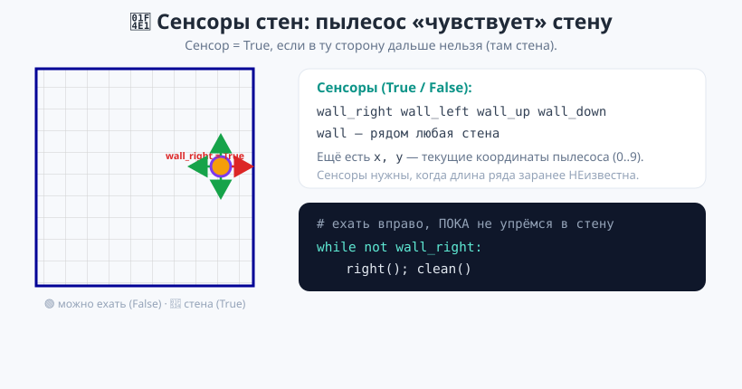
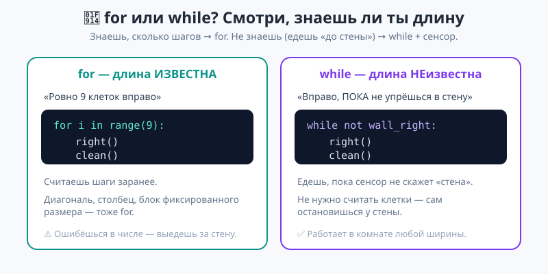
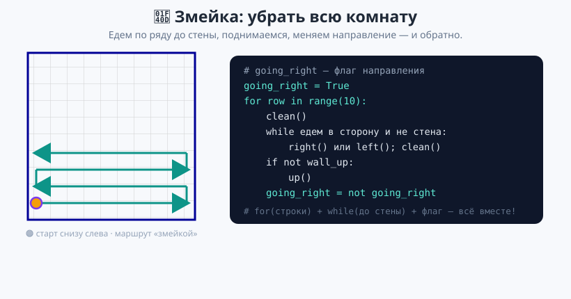

# Урок 5 — 🏆 «Умный пылесос»: большой практикум (16 заданий) 🐢🧹

**Модуль 3 · Циклы · Урок 5 из 6 (практикум) | 2 ак.ч. (1,5 часа)**

> ⬅️ Предыдущий: [Урок 4 «Вложенные циклы»](../урок-04-вложенные-циклы/урок.md) · [Все уроки модуля](../README.md) · [План курса](../../ПЛАН-КУРСА.md) · Следующий: [Урок 6 «Интересные программы»](../урок-06-интересные-программы/урок.md) ➡️

> 🔁 В начале — [разминка/повтор](повторение.md) (5 мин).
> 📌 Быстро вспомнить — [итого.md](итого.md) (шпаргалка).
> 👨‍🏫 Сценарий с хронометражом — в [преподавателю.md](преподавателю.md).
> 🖼 Что показать на проекторе — в [изображения.md](изображения.md).
> 🆘 Разбор с нуля — [самоучитель.md](самоучитель.md).
> 🧰 Трюки и частые ошибки — в [лайфхак.md](лайфхак.md).
> 🎮 **Весь урок — игра:** 16 заданий пылесосу в [`материалы/пылесос_практикум.py`](материалы/пылесос_практикум.py).

> 🧭 **Как читать урок.** Это **большой практикум** — почти без новой теории. Мы соберём вместе **всё**, что выучили про циклы: `for` (когда знаем число повторов), `while` (когда едем «до стены»), **вложенные циклы** (когда заливаем область), `break`/`continue`. Пылесос получит **сенсоры стен** — и научится ездить в комнате, не считая клетки. 16 заданий растут в сложности: от простого ряда до заливки всей комнаты «змейкой».

---

## 🎮 Что мы сделаем сегодня

**Практикум:** в файле [`пылесос_практикум.py`](материалы/пылесос_практикум.py) — **16 заданий**. В каждом мусор расставлен по-своему; ты меняешь `TASK` и пишешь **алгоритм**, чтобы собрать весь мусор. Когда чисто — окно пишет «ЧИСТО!».

**Главные навыки урока (всё вместе):** `for` (известная длина) · `while` + **сенсоры стен** (неизвестная длина) · вложенные циклы (области) · `break`/`continue` · выбор «какой цикл взять».

> 💡 **Главная мысль урока:** **под каждую задачу — свой цикл.** Знаешь, сколько шагов → `for`. Едешь «пока не упрёшься в стену» → `while` + сенсор. Заливаешь область → вложенный цикл. Практикум учит **выбирать** инструмент.

---

## Часть 1 — Команды и новое: сенсоры стен (10 минут)

Команды движения те же, что и раньше:

```
right()  left()  up()  down()    # переехать на клетку
clean()                          # убрать мусор в текущей клетке
```

**Новое — сенсоры стен.** Пылесос «чувствует», есть ли рядом стена. Это переменные-флаги `True`/`False`, которые можно читать в условии `while`:

```
wall_right  — справа стена (дальше вправо нельзя)
wall_left   — слева стена
wall_up      — сверху стена
wall_down    — снизу стена
wall         — рядом ЛЮБАЯ стена
x, y         — текущие координаты пылесоса (0..9)
```



> 💡 **Зачем сенсоры?** Раньше мы знали длину ряда (9 клеток → `range(9)`). Но что, если длина **неизвестна**? Тогда едем, **пока** сенсор не скажет «стена»: `while not wall_right:`. Пылесос сам остановится у стены — считать клетки не нужно.

> ⚠️ **Выедешь за стену — пылесос покраснеет и остановится.** Это сигнал, что в алгоритме лишний шаг. Считай клетки (для `for`) или используй сенсор (для `while`).

---

## Часть 2 — `for` или `while`? Выбираем инструмент (12 минут)

Главный вопрос практикума — **какой цикл взять**.



**Знаешь число шагов → `for`:**
```python
# ровно 9 клеток вправо
for i in range(9):
    right()
    clean()
```

**Не знаешь (едешь «до стены») → `while` + сенсор:**
```python
# вправо, ПОКА не упрёмся в стену
while not wall_right:
    right()
    clean()
```

- 👀 Второй вариант работает в комнате **любой** ширины — не важно, 5 клеток до стены или 9.

> 💡 **Как выбрать за 1 секунду.** Спроси: «Я знаю, сколько шагов?» Да → `for range(...)`. Нет, но знаю «до чего ехать» → `while not сенсор:`.

> 💡 **Убрать весь ряд, где стоишь.** Сначала доедь до левой стены, потом иди вправо до правой, убирая:
> ```python
> while not wall_left:      # к левому краю
>     left()
> clean()
> while not wall_right:     # и обратно вправо, убирая
>     right()
>     clean()
> ```

> ✍️ **Мини-задание 1 (3 мин):** открой `пылесос_практикум.py`, поставь `TASK = 5` и убери ряд мусора одним `while not wall_right`.

---

## Часть 3 — Змейка: убрать всю комнату (14 минут)

Самое сложное — убрать **всю комнату**. Это соединение трёх приёмов: `for` (по строкам), `while` (по строке до стены) и **флаг направления** — чтобы идти то вправо, то влево («змейкой»).

```python
going_right = True
for row in range(10):                 # 10 строк
    clean()
    # едем по строке до стены в нужную сторону
    while (going_right and not wall_right) or (not going_right and not wall_left):
        right() if going_right else left()
        clean()
    if not wall_up:                   # поднимаемся на следующую строку
        up()
    going_right = not going_right     # меняем направление
```



- 👀 Строка убирается вправо, поднимаемся, следующую — влево, снова поднимаемся. Так пылесос обходит **все 100 клеток**, ни разу не выехав за стену. Здесь `for` + `while` + флаг работают вместе — вершина модуля!

> 💡 **Флаг `going_right`** хранит направление. `going_right = not going_right` переключает его после каждой строки — как выключатель.

> 🧩 **Для 5–7 классов:** достаточно заданий 1–8 (ряды, столбцы, «до стены»). Змейка (11–16) — 🎓 для тех, кто хочет вызов.

---

## Часть 4 — 16 заданий 🏆

Все задания — в [`материалы/пылесос_практикум.py`](материалы/пылесос_практикум.py). Меняй `TASK` от 1 до 16. Полный список с подсказками — в **[практика.md](практика.md)**. Кратко по группам:

| Задания | Тема | Какой цикл |
|---------|------|-----------|
| 1–4 | ряды, столбцы, диагонали (длина известна) | `for` |
| 5–8 | «до стены», весь ряд от края до края | `while` + сенсор |
| 9–10 | периметр, два ряда змейкой | `while` ×4 |
| 11–13 | залить всю комнату / блок «змейкой» | `for` + `while` + флаг |
| 14–16 | 🎓 чётные столбцы, шахматка, ромб | вложенные + `continue` + `x, y` |

> 💡 **Шахматка и ромб (задания 12, 16)** — убираем только нужные клетки. Читаем координаты `x, y` и пропускаем лишние через `continue`:
> ```python
> if (x + y) % 2 != 0:
>     continue          # пропускаем «белую» клетку
> ```

> 📄 Файл — **стартер**: пример решения задания 1 лежит в комментарии. Раскомментируй, запусти, потом решай остальные.

---

## 🐞 Разбор частых ошибок

| Симптом | Что случилось | Как починить |
|---------|---------------|--------------|
| пылесос покраснел (за стеной) | лишний шаг / не тот `range` | считай клетки или бери `while not сенсор` |
| «Осталось мусора: N» | обошёл не все клетки | проверь маршрут/границы |
| `while` крутится вечно | забыл двигаться внутри (`right()`) | в теле `while` обязательно движение |
| змейка сбилась | не переключил `going_right` | `going_right = not going_right` в конце строки |
| убрал лишние клетки | нет условия | добавь `if ...: continue` |

> ⚠️ **Главное правило `while`:** в теле обязательно должно быть движение к стене — иначе сенсор никогда не станет True и цикл зациклится.

---

## 🏁 Итог урока (5 минут)

Ты собрал **все циклы** в одном практикуме:

- ✅ `for` — когда число шагов **известно**.
- ✅ `while` + **сенсоры стен** — когда едешь «до стены» (длина неизвестна).
- ✅ Вложенные циклы + флаг — залить **область** и всю комнату «змейкой».
- ✅ `continue` + координаты `x, y` — убрать только нужные клетки (шахматка, ромб).
- ✅ Главное умение — **выбрать** правильный цикл под задачу.

> 🏆 Главное: **под каждую задачу — свой цикл; сенсоры позволяют не считать клетки.** Быстро повторить — в [итого.md](итого.md).

> 🎤 **Блиц:** когда берут `for`, а когда `while`? что такое `wall_right`? как убрать ряд неизвестной длины? как убрать всю комнату? зачем флаг `going_right`? как пропустить «белые» клетки в шахматке?

### 🎮 Викторина-закрепление
Открой **[викторина.html](викторина.html)** — 18 вопросов + смешные и «на подумать».

➡️ **Все 16 заданий с подсказками** — **[практика.md](практика.md)**.
🆘 **Разбор с нуля** — [самоучитель.md](самоучитель.md). 🧰 **Трюки** — [лайфхак.md](лайфхак.md). 📌 **Шпаргалка** — [итого.md](итого.md).

---

## 🔗 Навигация и материалы

⬅️ **Предыдущий:** [Урок 4 «Вложенные циклы»](../урок-04-вложенные-циклы/урок.md) · [Все уроки модуля](../README.md) · [План курса](../../ПЛАН-КУРСА.md) · **Следующий:** [Урок 6 «Интересные программы»](../урок-06-интересные-программы/урок.md) ➡️

**🧰 Инструменты:** [Python](https://www.python.org/downloads/) · среда: [PyCharm Community](https://www.jetbrains.com/pycharm/download/) или [VS Code](https://code.visualstudio.com/).
**📄 Готовый код:** 🐢 [`пылесос_практикум.py`](материалы/пылесос_практикум.py) (16 заданий, проверен).
**⚙️ Учителю:** сценарий и решения — в [преподавателю.md](преподавателю.md).
