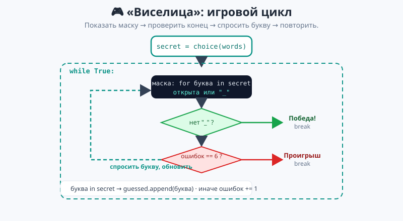
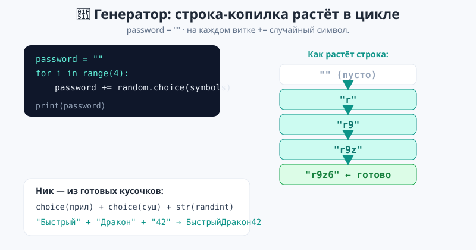
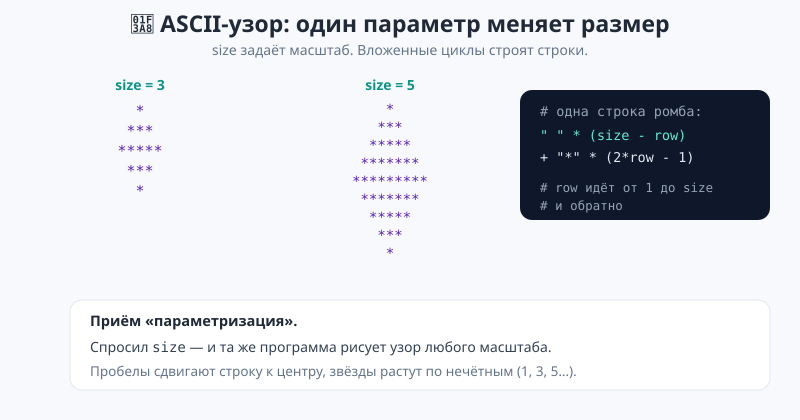

# Урок 6 — 🏆 «Интересные программы на циклах»: Виселица, генератор, ASCII-арт 🎮🔑🎨

**Модуль 3 · Циклы · Урок 6 из 6 (финал модуля) | 2 ак.ч. (1,5 часа)**

> ⬅️ Предыдущий: [Урок 5 «Умный пылесос»](../урок-05-умный-пылесос/урок.md) · [Все уроки модуля](../README.md) · [План курса](../../ПЛАН-КУРСА.md) · Дальше — [Модуль 4 «Коллекции»](../../ПЛАН-КУРСА.md) ➡️

> 🔁 В начале — [разминка/повтор](повторение.md) (5 мин).
> 📌 Быстро вспомнить — [итого.md](итого.md) (шпаргалка).
> 👨‍🏫 Сценарий с хронометражом — в [преподавателю.md](преподавателю.md).
> 🖼 Что показать на проекторе — в [изображения.md](изображения.md).
> 🆘 Разбор с нуля — [самоучитель.md](самоучитель.md).
> 🧰 Трюки и частые ошибки — в [лайфхак.md](лайфхак.md).

> 🧭 **Как читать урок.** Это **итоговый урок модуля** — почти без новой теории. Мы соберём из циклов **три настоящие программы**, которые хочется показать друзьям: текстовую игру **«Виселица»**, **генератор паролей и ников** и **ASCII-арт** (узоры любого размера). В каждой работает всё, что мы выучили: `while` + `break`, `for` по строке/списку, вложенные циклы, `if`, счётчики, `random`. Это финал — покажи, на что способны циклы!

---

## 🎮 Что мы сделаем сегодня

Три проекта:
1. **Виселица** — угадай слово по буквам ([`виселица.py`](материалы/виселица.py)).
2. **Генератор** — пароли и ники ([`генератор.py`](материалы/генератор.py)).
3. **ASCII-арт** — ромбы, треугольники, рамки любого размера ([`ascii_арт.py`](материалы/ascii_арт.py)).

**Главные навыки (всё вместе):** игровой цикл `while` + `break` · маска слова через `for` + `in` · строка-копилка `+=` · `random.choice` · вложенные циклы для узоров · параметризация.

> 💡 **Главная мысль урока:** **из простых циклов собираются настоящие программы.** Игра — это цикл «показать → спросить → проверить». Генератор — цикл «добавь случайный кусочек». Узор — вложенные циклы «строка за строкой».

---

## Часть 1 — Игра «Виселица» 🎮 (18 минут)

Компьютер загадывает слово, ты открываешь его **по одной букве**. За каждую ошибку — минус попытка.

**Как устроена игра — это цикл** «показать маску → проверить конец → спросить букву»:



**Шаг 1 — маска слова** (открытые буквы + `_`). Собираем циклом `for` по буквам:

```python
mask = ""
for letter in secret:
    if letter in guessed:      # эту букву уже угадали
        mask += letter
    else:
        mask += "_"
print("Слово:", mask)
```

**Шаг 2 — условия конца** (внутри `while True`):

```python
if "_" not in mask:            # все буквы открыты
    print("Победа!")
    break
if mistakes >= max_mistakes:   # ошибки кончились
    print("Проигрыш. Слово:", secret)
    break
```

**Шаг 3 — ход игрока:**

```python
guess = input("Назови букву: ").lower().strip()
if guess in secret:
    guessed.append(guess)      # запоминаем угаданную
else:
    mistakes += 1              # счётчик ошибок
```

- 👀 Вся игра — это `while True` с тремя частями: маска (`for`), проверка (`if ... break`), ход (`if/else`). Полный код — [`материалы/виселица.py`](материалы/виселица.py).

> 💡 **Список `guessed`** копит угаданные буквы (знаем списки из Модуля 2). А `letter in guessed` / `guess in secret` — оператор `in` проверяет вхождение (буква в слове? буква в списке?).

> ✍️ **Мини-задание 1 (3 мин):** добавь в игру подсчёт: сколько букв уже открыто. Или добавь свои слова в список `words`.

---

## Часть 2 — Генератор паролей и ников 🔑 (14 минут)

**Пароль** собираем как **строку-копилку**: пустая строка, а цикл `for` добавляет случайный символ:

```python
import random
symbols = "abcdefghijklmnopqrstuvwxyz0123456789!@#$%"

password = ""                        # копилка-строка
for i in range(length):
    password += random.choice(symbols)   # добавляем случайный символ
print("Пароль:", password)
```



- 👀 На каждом витке строка **растёт** на один символ: `""` → `"r"` → `"r9"` → … Приём «копилка», но копим не число, а строку.

**Ники** собираем из готовых кусочков — прилагательное + существительное + число:

```python
adjectives = ["Быстрый", "Тёмный", "Дикий", "Хитрый"]
nouns = ["Волк", "Дракон", "Ниндзя", "Феникс"]

for i in range(3):
    nick = random.choice(adjectives) + random.choice(nouns) + str(random.randint(1, 99))
    print("-", nick)
```

- 👀 `random.choice` берёт случайный элемент из списка, `+` склеивает, `str(...)` превращает число в строку. Три ника за три витка. Полный код — [`материалы/генератор.py`](материалы/генератор.py).

> 💡 **`str(число)` обязателен при склейке.** `"ник" + 42` → ошибка (нельзя складывать строку и число). Нужно `"ник" + str(42)`.

> ✍️ **Мини-задание 2 (3 мин):** сделай генератор «кодовых имён»: цвет + животное (`"Красный Тигр"`). Заведи два списка и склей случайные элементы.

---

## Часть 3 — ASCII-арт: узоры любого размера 🎨 (14 минут)

Вложенные циклы рисуют узоры, а **один параметр `size`** меняет их масштаб.



**Ромб** — верхняя половина растёт, нижняя убывает:

```python
size = int(input("Размер: "))

for row in range(1, size + 1):                 # верх
    print(" " * (size - row) + "*" * (2 * row - 1))
for row in range(size - 1, 0, -1):             # низ
    print(" " * (size - row) + "*" * (2 * row - 1))
```

- 👀 Пробелы `" " * (size - row)` сдвигают строку к центру, звёзды `"*" * (2*row - 1)` растут по нечётным (1, 3, 5…). Меняешь `size` — меняется весь ромб.

**Числовой треугольник** (вложенные циклы):

```python
for row in range(1, size + 1):
    line = ""
    for col in range(1, row + 1):
        line += str(col)
    print(line)
```

- 👀 `1`, `12`, `123`, … — внутренний цикл строит строку из цифр. Полный код (ромб + треугольник + рамка) — [`материалы/ascii_арт.py`](материалы/ascii_арт.py).

> 💡 **Параметризация — суперсила.** Одна программа с параметром `size` рисует узор **любого** размера. Так работают все генераторы графики.

> ✍️ **Мини-задание 3 (3 мин):** нарисуй «ёлку» из нескольких треугольников разной ширины, поставленных друг под другом. Или квадрат из `#` со стороной `size`.

---

## 🐞 Разбор частых ошибок

| Симптом | Что случилось | Как починить |
|---------|---------------|--------------|
| Виселица не заканчивается | забыл `break` при победе/проигрыше | `if ...: break` |
| маска не обновляется | собирал `mask` вне цикла | строить маску **каждый** виток |
| `"ник" + 42` — ошибка | склейка строки и числа | `"ник" + str(42)` |
| пароль всегда пустой | `password += ...` вне цикла | добавлять **внутри** `for` |
| узор кривой | перепутал пробелы/звёзды | `" "*(size-row)` + `"*"*(2*row-1)` |
| буква засчитана дважды | не проверил `in guessed` | добавить проверку «уже называли» |

> ⚠️ **Главное:** игра = цикл с выходом `break`; генератор = копилка `+=`; узор = вложенные циклы + параметр.

---

## 🏁 Итог урока и Модуля 3 (5 минут)

Ты собрал **три настоящие программы** — и это значит, что **весь Модуль 3 пройден**:

- ✅ **Урок 1:** `while` — «Угадай число», `break`, вечный цикл.
- ✅ **Урок 2:** `for` — перебор списков, строк, `range`.
- ✅ **Урок 3:** `enumerate`, `zip`, накопители, `time.sleep`.
- ✅ **Урок 4:** вложенные циклы, `break`/`continue`.
- ✅ **Урок 5:** большой практикум «Умный пылесос».
- ✅ **Урок 6:** интересные программы — Виселица, генератор, ASCII-арт.

> 🏆 Главное открытие модуля: **из простых циклов собираются игры, генераторы и графика.** Быстрое повторение — в [итого.md](итого.md).

> 🎤 **Блиц:** из каких трёх частей состоит игровой цикл Виселицы? как растёт строка-пароль? зачем `str()` при склейке ника? что делает `size` в узоре? какой цикл строит одну строку узора, а какой — все строки?

### 🎮 Викторина-закрепление
Открой **[викторина.html](викторина.html)** — 18 вопросов + смешные и «на подумать».

➡️ **Практика урока** — **[практика.md](практика.md)**: свои игры, генераторы и узоры.
🆘 **Разбор с нуля** — [самоучитель.md](самоучитель.md). 🧰 **Трюки** — [лайфхак.md](лайфхак.md). 📌 **Шпаргалка** — [итого.md](итого.md).

---

## 🔗 Навигация и материалы

⬅️ **Предыдущий:** [Урок 5 «Умный пылесос»](../урок-05-умный-пылесос/урок.md) · [Все уроки модуля](../README.md) · [План курса](../../ПЛАН-КУРСА.md)

> ➡️ **Что дальше:** **Модуль 4 «Коллекции»** — научимся хранить много данных вместе: списки по-взрослому, кортежи, срезы, словари, множества. Циклы + коллекции = настоящая обработка данных!

**🧰 Инструменты:** [Python](https://www.python.org/downloads/) · среда: [PyCharm Community](https://www.jetbrains.com/pycharm/download/) или [VS Code](https://code.visualstudio.com/).
**📄 Готовый код:** [`виселица.py`](материалы/виселица.py) · [`генератор.py`](материалы/генератор.py) · [`ascii_арт.py`](материалы/ascii_арт.py) (все проверены).
**⚙️ Учителю:** сценарий и частые ошибки — в [преподавателю.md](преподавателю.md).
