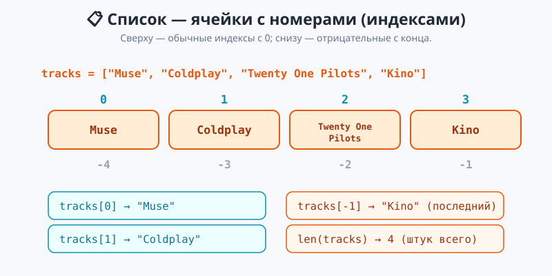
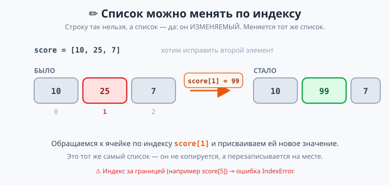
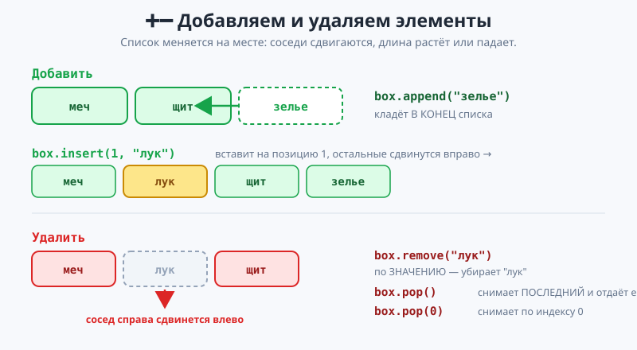

# Урок 1 — «Плейлист и Список дел»: списки вглубь — добавляем, удаляем, меняем 📋✏️

**Модуль 4 · Коллекции · Урок 1 из 7 | 2 ак.ч. (1,5 часа)**

> ⬅️ Предыдущий модуль: [Модуль 3 «Циклы»](../../модуль-03-циклы/README.md) · [Все уроки модуля](../README.md) · [План курса](../../ПЛАН-КУРСА.md) · Следующий: Урок 2 «Действия со списками: Топ игроков» ➡️

> 🔁 В начале — [разминка/повтор](повторение.md) (5 мин).
> 📌 Быстро вспомнить материал урока — [итого.md](итого.md) (шпаргалка).
> 👨‍🏫 Сценарий с хронометражом — в [преподавателю.md](преподавателю.md).
> 🖼 Что показать на проекторе — в [изображения.md](изображения.md).
> 🆘 **Пропустил урок или хочешь закрепить?** Открой [самоучитель.md](самоучитель.md) — теория + задания с подсказками.
> 🧰 Трюки и частые ошибки — в [лайфхак.md](лайфхак.md).

> 🧭 **Как читать урок.** Со **списками** мы уже знакомы: заводили их в квадратных скобках (`["камень", "ножницы", "бумага"]`), брали элемент по индексу, считали `len`, проверяли `in` (Модуль 2), а в Модуле 3 перебирали циклом `for`. Но до сих пор список был «только для чтения»: создали — и смотрим. Сегодня научимся его **менять**: добавлять новые элементы, удалять ненужные, править на месте по индексу. Это превращает список в живой инструмент — плейлист, в который докидываешь треки, и список дел, который вычёркиваешь по мере выполнения. К концу урока соберём настоящее консольное приложение «Список дел» с меню.

---

## 🎮 Что мы сделаем сегодня и что получим

**Задача:** научиться редактировать список — и собрать приложение «Список дел», куда можно добавлять задачи, удалять и отмечать выполненные.

**В итоге получатся** `плейлист.py` (демонстрация всех операций) и `список_дел.py` (рабочее приложение с меню):

```
=== СПИСОК ДЕЛ ===

  1. [ ] Сделать домашку
  2. [x] Погулять с собакой

Меню: [1] добавить  [2] удалить  [3] выполнено  [4] выход
Что делаем? _
```

**Главные навыки урока:** индекс и **отрицательный индекс** (`lst[-1]`) · изменение элемента по индексу (`lst[i] = ...`) · **`append` / `insert` / `extend`** (добавить) · **`remove` / `pop` / `del` / `clear`** (удалить) · методы `index` / `count` / `sort` / `reverse` / `sorted` · сборка приложения «Список дел» (меню в цикле `while`).

> 💡 **Главная мысль урока:** **список — ИЗМЕНЯЕМЫЙ.** Его не нужно пересоздавать: один список живёт от начала до конца программы, а мы добавляем, удаляем и правим его элементы. Строку так менять нельзя, а список — можно.

---

## Часть 0 — Разминка: что список уже умеет (5 минут)

Быстро вспомним, что мы про списки **уже знаем**:

```python
games = ["Minecraft", "Roblox", "Sims"]
print(games[0])          # Minecraft — элемент по индексу (нумерация с 0)
print(len(games))        # 3 — сколько элементов
print("Roblox" in games) # True — есть ли такой
for game in games:       # перебор циклом (Модуль 3)
    print(game)
```

Всё это — **чтение**. Сегодня добавляем **запись**: как этот же список пополнить и почистить.

> 💡 **Список vs строка.** И то, и другое можно перебирать и брать по индексу. Но список **изменяемый** (можно `games[0] = ...`), а строка — **нет** (`word[0] = "X"` даст ошибку). В этом ключевая разница, ради неё и берут список.

---

## Часть 1 — Список изменяемый: индекс и правка на месте (16 минут)

**Индекс — это номер ячейки.** Нумерация начинается с **0**:

```python
tracks = ["Muse", "Coldplay", "Twenty One Pilots", "Kino"]
print(tracks[0])   # Muse       — первый
print(tracks[2])   # Twenty One Pilots
```



**Отрицательный индекс — счёт с конца.** Очень удобно, когда не хочешь считать длину:

```python
print(tracks[-1])  # Kino  — последний
print(tracks[-2])  # Twenty One Pilots — предпоследний
```

> 💡 **`[-1]` — «последний», всегда.** Не важно, сколько в списке элементов: `tracks[-1]` — последний, `tracks[-2]` — за ним. Это короче, чем `tracks[len(tracks) - 1]`.

> ✍️ **Мини-задание 1 (2 мин):** заведи список из 5 любимых игр. Выведи первую (`[0]`), последнюю (`[-1]`) и предпоследнюю (`[-2]`).
> <details><summary>💡 подсказка</summary><code>games[0]</code>, <code>games[-1]</code>, <code>games[-2]</code>.</details>

**Изменение по индексу — правка на месте.** Обращаемся к ячейке и присваиваем ей новое значение:

```python
tracks[1] = "Linkin Park"   # заменили Coldplay на Linkin Park
print(tracks)               # ['Muse', 'Linkin Park', 'Twenty One Pilots', 'Kino']
```



- 👀 Список **не пересоздался** — это тот же `tracks`, просто ячейка `[1]` теперь хранит другое значение. В этом и есть «изменяемость».

> ⚠️ **Индекс за границей → `IndexError`.** В списке из 4 элементов есть индексы 0, 1, 2, 3. Обращение к `tracks[4]` или `tracks[10]` → `IndexError: list index out of range`. Последний доступный индекс — `len(list) - 1` (или просто `-1`).

> ✍️ **Мини-задание 2 (2 мин):** в списке оценок `[3, 4, 5]` исправь первую оценку на `5`, а последнюю — на `4`. Выведи результат.
> <details><summary>💡 подсказка</summary><code>marks[0] = 5</code> и <code>marks[-1] = 4</code>.</details>

---

## Часть 2 — Добавляем элементы: `append`, `insert`, `extend` (16 минут)

**`append` — добавить в конец.** Самый частый способ:

```python
tracks = ["Muse", "Coldplay"]
tracks.append("Kino")
print(tracks)   # ['Muse', 'Coldplay', 'Kino']
```

**`insert(индекс, элемент)` — вставить на конкретную позицию.** Соседи сдвигаются вправо:

```python
tracks.insert(0, "The Weeknd")   # в самое начало
print(tracks)   # ['The Weeknd', 'Muse', 'Coldplay', 'Kino']
```



**`extend` — добавить сразу несколько** (из другого списка):

```python
tracks.extend(["Sting", "U2"])   # два трека одним махом
print(tracks)
```

> 💡 **`append` кладёт ОДИН элемент, `extend` — РАСПАКОВЫВАЕТ список.** Если написать `tracks.append(["Sting", "U2"])`, в список попадёт **список внутри списка** — один элемент-список `['Sting', 'U2']`. Чтобы добавить их по отдельности — `extend`.

> ⚠️ **Частая ошибка: `tracks = tracks.append("Kino")`.** `append` меняет список **на месте** и возвращает `None`. Если присвоить результат обратно — в `tracks` окажется `None`, и список потеряется. Правильно — просто `tracks.append("Kino")`, без `tracks =`.

> ✍️ **Мини-задание 3 (3 мин):** заведи пустой список `cart = []`. Добавь через `append` три товара. Потом вставь `insert(0, ...)` товар в начало. Выведи корзину и её длину.
> <details><summary>💡 подсказка</summary><code>cart = []</code>, затем три <code>cart.append("...")</code>, потом <code>cart.insert(0, "...")</code>, <code>print(cart, len(cart))</code>.</details>

---

## Часть 3 — Удаляем элементы: `remove`, `pop`, `del`, `clear` (15 минут)

Четыре способа убрать элемент — под разные ситуации:

**`remove(значение)` — удалить по ЗНАЧЕНИЮ** (первое совпадение):

```python
tracks = ["Muse", "Coldplay", "Kino"]
tracks.remove("Coldplay")
print(tracks)   # ['Muse', 'Kino']
```

**`pop()` — снять ПОСЛЕДНИЙ и вернуть его** (или по индексу `pop(i)`):

```python
last = tracks.pop()     # снимает 'Kino' и отдаёт его в переменную
print("Сняли:", last)   # Сняли: Kino
first = tracks.pop(0)   # по индексу — снимает первый
```

**`del` — удалить по индексу** (ничего не возвращает):

```python
nums = [10, 20, 30]
del nums[1]     # убрать элемент с индексом 1
print(nums)     # [10, 30]
```

**`clear()` — очистить весь список:**

```python
nums.clear()
print(nums)     # []
```

> 💡 **Как выбрать?** Знаешь **значение** («убери Coldplay») → `remove`. Знаешь **позицию** и хочешь забрать элемент («сними верхнюю карту») → `pop`. Просто удалить по индексу → `del`. Всё стереть → `clear`.

> ⚠️ **`remove` не нашёл значение → `ValueError`.** Если удаляемого элемента в списке нет — программа упадёт. Перед удалением полезно проверить: `if "Coldplay" in tracks:` — а потом `tracks.remove(...)`.

> ✍️ **Мини-задание 4 (3 мин):** дан список `["хлеб", "молоко", "сыр", "молоко"]`. Удали первое `"молоко"` через `remove`. Потом сними последний элемент через `pop` в переменную и выведи, что сняли.
> <details><summary>💡 подсказка</summary><code>food.remove("молоко")</code> уберёт ПЕРВОЕ молоко; <code>taken = food.pop()</code>.</details>

---

## Часть 4 — Полезные методы: `index`, `count`, `sort`, `reverse` (12 минут)

Список умеет и «считать по себе»:

```python
nums = [4, 1, 7, 1, 9, 1]
print(nums.count(1))    # 3 — сколько раз встречается 1
print(nums.index(7))    # 2 — на какой позиции первое совпадение
```

**Сортировка — `sort` (меняет список) и `sorted` (новый список):**

```python
nums.sort()             # меняет САМ nums: [1, 1, 1, 4, 7, 9]
nums.sort(reverse=True) # по убыванию: [9, 7, 4, 1, 1, 1]

data = [3, 1, 2]
new = sorted(data)      # new = [1, 2, 3], а data остался [3, 1, 2]
```

**`reverse()` — развернуть список задом наперёд:**

```python
letters = ["а", "б", "в"]
letters.reverse()       # ['в', 'б', 'а']
```

> 💡 **`sort()` vs `sorted()` — важное различие.** `nums.sort()` **меняет** сам список и возвращает `None`. `sorted(nums)` **не трогает** оригинал, а отдаёт **новый** отсортированный список. Нужно сохранить исходный порядок — бери `sorted`.

> ✍️ **Мини-задание 5 (2 мин):** дан список очков `[50, 90, 70, 90, 30]`. Выведи, сколько раз встречается `90` (`count`), и отсортируй список по убыванию (`sort(reverse=True)`).
> <details><summary>💡 подсказка</summary><code>scores.count(90)</code>; <code>scores.sort(reverse=True)</code>.</details>

Полный разбор всех методов с примерами «было → стало» — в файле [`материалы/методы_демо.py`](материалы/методы_демо.py), а живой плейлист со всеми операциями — [`материалы/плейлист.py`](материалы/плейлист.py).

---

## Часть 5 — Проект «Список дел» 🏆 (18 минут)

Соберём всё вместе в приложение. Идея: список `tasks` хранит дела, а **меню в цикле `while`** позволяет добавлять, удалять и отмечать их. Это соединяет тему урока с циклами (Модуль 3) и условиями (Модуль 2).

```python
tasks = ["Сделать домашку", "Погулять с собакой"]
done = []   # сюда складываем выполненные (для галочки)

while True:
    # показать список с номерами и галочками
    for number, task in enumerate(tasks, start=1):
        mark = "[x]" if task in done else "[ ]"
        print(f"  {number}. {mark} {task}")

    print("Меню: [1] добавить  [2] удалить  [3] выполнено  [4] выход")
    choice = input("Что делаем? ")

    if choice == "1":
        tasks.append(input("Новое дело: "))       # добавили в конец
    elif choice == "2":
        number = int(input("Номер для удаления: "))
        tasks.pop(number - 1)                      # номер 1 -> индекс 0
    elif choice == "3":
        number = int(input("Номер выполненного: "))
        done.append(tasks[number - 1])             # отметили галочкой
    elif choice == "4":
        break
```

- 👀 Обрати внимание на **`number - 1`**: человек вводит номер `1`, а в списке это индекс `0`. Пользователь считает с единицы, Python — с нуля, поэтому вычитаем 1. Полный файл с проверками ввода — [`материалы/список_дел.py`](материалы/список_дел.py).

> 💡 **Здесь список показывает свою силу.** Одна переменная `tasks` хранит сколько угодно дел; `append` и `pop` держат её актуальной. Без списка пришлось бы заводить `task1`, `task2`, `task3`… и код бы не работал для произвольного числа дел.

> ⚠️ **Ввод удаления вне диапазона.** Если пользователь введёт номер `9`, а дел всего 2 — `pop(8)` даст `IndexError`. В полном файле стоит проверка `if 1 <= number <= len(tasks):` — так приложение не падает. Всегда проверяй пользовательский ввод.

> 🧩 **Для 5–7 классов:** хватит команд «добавить» и «показать». 🎓 **Глубже:** добавь команду «очистить всё» (`tasks.clear()`), сортировку дел по алфавиту (`tasks.sort()`) или счётчик выполненных.

---

## 🐞 Разбор частых ошибок

| Симптом | Что случилось | Как починить |
|---------|---------------|--------------|
| `IndexError: list index out of range` | индекс за границей списка | последний индекс — `len(lst)-1` или `-1` |
| `ValueError: x not in list` | `remove` не нашёл значение | сначала `if x in lst:` |
| после `append` список стал `None` | написал `lst = lst.append(x)` | просто `lst.append(x)`, без `lst =` |
| `append(["a","b"])` создал список в списке | добавлял несколько через `append` | для нескольких — `extend([...])` |
| `sort()` вернул `None` | `new = lst.sort()` | `sort()` меняет на месте; для копии — `sorted(lst)` |
| удаляется не тот элемент | путаница номер/индекс | пользователь с 1, Python с 0 → `pop(number-1)` |

> ⚠️ **Золотое правило урока:** методы-«изменялки» (`append`, `sort`, `reverse`, `remove`) работают **на месте** и возвращают `None`. Не присваивай их результат обратно в переменную.

---

## 🏁 Итог урока (5 минут)

Список стал по-настоящему живым:

- ✅ **Список изменяемый:** `lst[i] = ...` меняет элемент на месте; `lst[-1]` — последний.
- ✅ **Добавить:** `append` (в конец), `insert(i, x)` (по позиции), `extend([...])` (несколько).
- ✅ **Удалить:** `remove(значение)`, `pop()`/`pop(i)` (снять и вернуть), `del lst[i]`, `clear()`.
- ✅ **Методы:** `count`, `index`, `sort`/`sorted`, `reverse`.
- ✅ Методы-изменялки работают **на месте** и возвращают `None`.
- ✅ Проект «Список дел»: меню в цикле `while` + `append`/`pop` + галочки.

> 🏆 Главное: **один список живёт всю программу — его добавляют, удаляют и правят.** Быстро повторить — в [итого.md](итого.md).

> 🎤 **Блиц:** чем список отличается от строки? что даёт `lst[-1]`? разница `append` и `insert`? разница `remove` и `pop`? чем `sort` отличается от `sorted`? почему в «Списке дел» пишут `pop(number - 1)`?

### 🎮 Викторина-закрепление
Открой **[викторина.html](викторина.html)** — 18 вопросов + смешные и «на подумать».

➡️ **Практика урока** — **[практика.md](практика.md)**: задачи в 3 уровнях.
🆘 **Пропустил / хочешь ещё?** — [самоучитель.md](самоучитель.md) (теория + 15–20 заданий).
🧰 **Трюки и ошибки** — [лайфхак.md](лайфхак.md). 📌 **Шпаргалка** — [итого.md](итого.md).

---

## 🔗 Навигация и материалы

⬅️ **Предыдущий модуль:** [Модуль 3 «Циклы»](../../модуль-03-циклы/README.md) · [Все уроки модуля](../README.md) · [План курса](../../ПЛАН-КУРСА.md) · **Следующий:** Урок 2 «Действия со списками: Топ игроков» ➡️

**🧰 Инструменты:** [Python](https://www.python.org/downloads/) · среда: [PyCharm Community](https://www.jetbrains.com/pycharm/download/) или [VS Code](https://code.visualstudio.com/).
**📄 Готовый код:** [`плейлист.py`](материалы/плейлист.py) · [`методы_демо.py`](материалы/методы_демо.py) · [`список_дел.py`](материалы/список_дел.py) (все проверены).
**⚙️ Учителю:** сценарий и частые ошибки — в [преподавателю.md](преподавателю.md).
