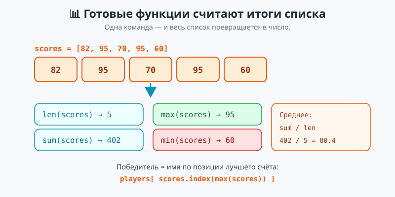
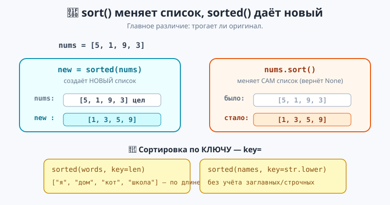
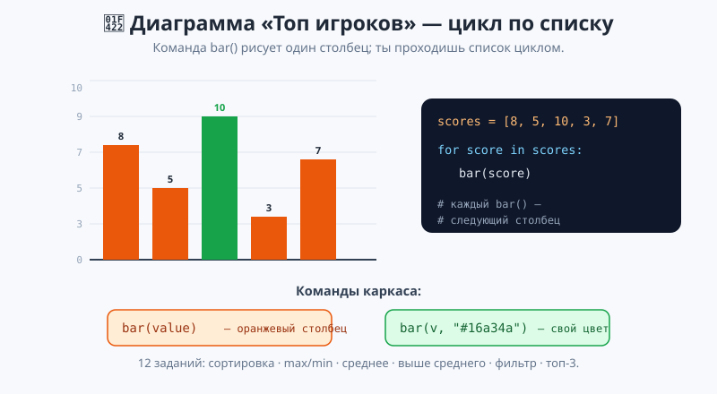

# Урок 2 — «Топ игроков»: действия со списками — итоги, сортировка, фильтр 📊🏆

**Модуль 4 · Коллекции · Урок 2 из 7 | 2 ак.ч. (1,5 часа)**

> ⬅️ Предыдущий: [Урок 1 «Списки вглубь»](../урок-01-списки/урок.md) · [Все уроки модуля](../README.md) · [План курса](../../ПЛАН-КУРСА.md) · Следующий: Урок 3 «Срезы: Нарезка данных» ➡️

> 🔁 В начале — [разминка/повтор](повторение.md) (5 мин).
> 📌 Быстро вспомнить материал урока — [итого.md](итого.md) (шпаргалка).
> 👨‍🏫 Сценарий с хронометражом — в [преподавателю.md](преподавателю.md).
> 🖼 Что показать на проекторе — в [изображения.md](изображения.md).
> 🆘 **Пропустил урок или хочешь закрепить?** Открой [самоучитель.md](самоучитель.md) — теория + задания с подсказками.
> 🧰 Трюки и частые ошибки — в [лайфхак.md](лайфхак.md).
> 🐢 В конце — **turtle-практика «Диаграмма»**: строим столбчатую диаграмму по списку.

> 🧭 **Как читать урок.** Список мы уже умеем менять (Урок 1). Но чаще список — это **данные, из которых нужно что-то посчитать**: сумму очков, лучший результат, среднее, рейтинг. Писать это руками циклом (как в Модуле 3) — долго. У Python есть готовые «одной командой»: `sum`, `max`, `min`, `len`, а ещё умная сортировка `sort`/`sorted` — в том числе **по ключу** (по длине, по алфавиту без учёта регистра). Сегодня соберём таблицу «Топ игроков» и построим по ней **столбчатую диаграмму** черепашкой, пройдя список циклом.

---

## 🎮 Что мы сделаем сегодня и что получим

**Задача:** посчитать итоги турнира по списку очков, определить победителя и рейтинг — и нарисовать диаграмму.

**В итоге получится** `топ_игроков.py`:

```
Всего очков: 402
Лучший счёт: 95
Средний счёт: 80.4
Победитель: Борис со счётом 95
Очки по убыванию: [95, 95, 82, 70, 60]
Топ-3: 95 95 82
Счёт 80 и выше: [82, 95, 95] -> таких игроков: 3
```

**Главные навыки урока:** `len` / `sum` / `max` / `min` · среднее (`sum/len`) · `sort` / `sorted` (напомним и углубим) · **сортировка по ключу** `sort(key=len)`, `key=str.lower` · поиск победителя (`index` + `max`) · **фильтр** (собрать подсписок циклом) · 🐢 диаграмма по списку.

> 💡 **Главная мысль урока:** **список — это данные, а `sum/max/min/len/sorted` — готовые инструменты, которые считают итоги одной командой.** Не нужно писать цикл вручную — Python уже умеет.

---

## Часть 0 — Разминка: итоги руками — это долго (4 минуты)

В Модуле 3 сумму списка мы считали циклом:

```python
scores = [82, 95, 70, 95, 60]
total = 0
for s in scores:
    total += s
print(total)   # 402
```

Работает, но это 4 строки ради одной суммы. Сегодня — короче: `sum(scores)`. И так почти для всего.

---

## Часть 1 — Итоги списка: `len`, `sum`, `max`, `min`, среднее (14 минут)

Четыре готовые функции берут **весь список** и возвращают **одно число**:

```python
scores = [82, 95, 70, 95, 60]
print(len(scores))   # 5   — сколько элементов
print(sum(scores))   # 402 — сумма
print(max(scores))   # 95  — наибольший
print(min(scores))   # 60  — наименьший
```



**Среднее — это сумма, делённая на количество:**

```python
average = sum(scores) / len(scores)
print(round(average, 1))   # 80.4  (round округляет до 1 знака)
```

> 💡 **`max`/`min` работают и со строками** — по алфавиту: `max(["кот", "яблоко", "аист"])` → `"яблоко"` (буква «я» самая «большая»). Но чаще их берут для чисел.

> ✍️ **Мини-задание 1 (2 мин):** дан список температур `[12, 19, 7, 25, 16]`. Выведи самую высокую, самую низкую и среднюю (округли до 1 знака).
> <details><summary>💡 подсказка</summary><code>max(t)</code>, <code>min(t)</code>, <code>round(sum(t)/len(t), 1)</code>.</details>

**Победитель — имя по позиции лучшего счёта.** Соединяем `max` и `index` (из Урока 1):

```python
players = ["Аня", "Борис", "Вика", "Глеб", "Даша"]
scores  = [82, 95, 70, 95, 60]

best = max(scores)                    # 95 — лучший счёт
winner = players[scores.index(best)]  # index(95) -> 1 -> players[1] -> "Борис"
print("Победитель:", winner)
```

- 👀 `scores.index(best)` находит **позицию** лучшего счёта, а по этой позиции берём имя из второго списка. Списки идут «параллельно»: у кого какой счёт — по одному индексу.

> ⚠️ **`max([])` на пустом списке → `ValueError`.** У пустого списка нет ни максимума, ни минимума. Если список может быть пустым — сначала проверь `if len(scores) > 0:`.

---

## Часть 2 — Сортировка: `sort` и `sorted`, рейтинг (14 минут)

Сортировку мы видели в Уроке 1 — вспомним и углубим. Есть **два способа**, и разница важная:

```python
scores = [82, 95, 70, 95, 60]

ranking = sorted(scores, reverse=True)   # НОВЫЙ список по убыванию
print(ranking)   # [95, 95, 82, 70, 60]
print(scores)    # [82, 95, 70, 95, 60] — оригинал ЦЕЛ

scores.sort()    # меняет САМ список (по возрастанию)
print(scores)    # [60, 70, 82, 95, 95]
```



> 💡 **`sort()` vs `sorted()` — золотое правило.** `sort()` **меняет** сам список и возвращает `None`. `sorted()` **не трогает** оригинал, а отдаёт **новый** отсортированный список. Нужен исходный порядок (например, чтобы имена и очки не «разъехались») — бери `sorted`.

**Топ-3 — первые три элемента отсортированного списка** (по индексу):

```python
ranking = sorted(scores, reverse=True)
print("Топ-3:", ranking[0], ranking[1], ranking[2])
```

> ✍️ **Мини-задание 2 (3 мин):** дан список `[40, 90, 70, 90, 30]`. Получи новый список по убыванию через `sorted` и выведи первые два места. Проверь, что оригинал не изменился.
> <details><summary>💡 подсказка</summary><code>top = sorted(scores, reverse=True)</code>; <code>top[0]</code>, <code>top[1]</code>; потом <code>print(scores)</code>.</details>

---

## Часть 3 — Сортировка по ключу: `key=` (10 минут)

Обычно список сортируется «естественно»: числа по величине, строки по алфавиту. Но можно задать **свой признак** через `key=` — по чему сравнивать.

```python
words = ["дом", "кот", "радуга", "я", "школа"]
print(sorted(words))            # ['дом', 'кот', 'радуга', 'школа', 'я'] — по алфавиту
print(sorted(words, key=len))   # ['я', 'дом', 'кот', 'школа', 'радуга'] — по ДЛИНЕ
```

**`key=str.lower` — сортировка без учёта регистра.** Обычно заглавные буквы идут **перед** строчными (у них меньше код), и получается «неправильно»:

```python
names = ["аня", "Борис", "вика", "Глеб"]
print(sorted(names))                # ['Борис', 'Глеб', 'аня', 'вика'] — заглавные первыми
print(sorted(names, key=str.lower)) # ['аня', 'Борис', 'вика', 'Глеб'] — по-человечески
```

- 👀 `key=len` — «сравнивай по длине», `key=str.lower` — «сравнивай, как будто всё строчными». Сам список при этом не портится (`sorted`), меняется только **порядок сравнения**.

> 💡 **`key=` — это ИМЯ функции без скобок.** Пишем `key=len`, а не `key=len()`. Python сам применит её к каждому элементу, чтобы понять, по чему сортировать.

> ✍️ **Мини-задание 3 (2 мин):** дан список городов разной длины. Отсортируй их по длине названия (`key=len`), потом по алфавиту без учёта регистра (`key=str.lower`).
> <details><summary>💡 подсказка</summary><code>sorted(cities, key=len)</code> и <code>sorted(cities, key=str.lower)</code>.</details>

Полный разбор `sort`/`sorted`/`key` — в [`материалы/сортировка_демо.py`](материалы/сортировка_демо.py).

---

## Часть 4 — Фильтр: собрать подсписок циклом (10 минут)

Часто нужно **выбрать из списка только нужное** — например, сильных игроков (счёт ≥ 80). Собираем **новый список** циклом с условием:

```python
scores = [82, 95, 70, 95, 60]

strong = []                 # пустой список-накопитель
for score in scores:
    if score >= 80:
        strong.append(score)
print(strong)               # [82, 95, 95]
print("Таких игроков:", len(strong))
```

- 👀 Схема «пустой список → перебор → `if` → `append`» — база фильтрации. Так отбирают чётные числа, длинные слова, дорогие товары — что угодно по условию.

> 💡 **Это соединение всех тем модуля:** пустой список (`[]`), перебор (`for`, Модуль 3), условие (`if`, Модуль 2), добавление (`append`, Урок 1). Фильтр — рабочая лошадка обработки данных.

> ✍️ **Мини-задание 4 (3 мин):** дан список чисел. Собери в новый список только **чётные** и выведи, сколько их.
> <details><summary>💡 подсказка</summary><code>evens = []</code>; <code>for n in nums: if n % 2 == 0: evens.append(n)</code>.</details>

Полный проект «Топ игроков» со всеми частями — [`материалы/топ_игроков.py`](материалы/топ_игроков.py).

---

## Часть 5 — 🐢 Практика: Диаграмма «Топ игроков» (15 минут)

Применим список к **картинке**. В каркасе [`материалы/диаграмма.py`](материалы/диаграмма.py) — готовое поле с осями и шкалой. Команда `bar(value)` рисует **один столбец** высотой `value`, а ты строишь диаграмму, пройдя список **циклом**. Всего в практикуме **12 заданий** — каждое применяет действие со списком (сортировка, `max`/`min`, среднее, фильтр).

**Команды:** `bar(value)` — оранжевый столбец высотой `value` (0–10); `bar(value, "#16a34a")` — тот же столбец своим цветом; `mark_line(value)` — пунктирная линия (например, на среднем). Каждый вызов `bar` рисует следующий столбец правее.

Задание 1 — построить диаграмму по списку очков:

```python
TASK = 1
scores = [8, 5, 10, 3, 7, 6]

for score in scores:      # проходим список
    bar(score)            # рисуем столбец за столбцом
```



- 🐢 Запусти на **своём компьютере** — столбцы вырастают по одному (анимация). Меняй `TASK` и решай следующие: по убыванию («лесенка»), подсветить `max`/`min`, линия среднего, «выше среднего — зелёным», только значения ≥ 6 (фильтр), топ-3… Всего **12 заданий** — полный список в [практике](практика.md).

> 💡 **Тут виден смысл «цикла по коллекции».** Одна строка `for score in scores: bar(score)` строит диаграмму любой длины. Добавил игрока в список — столбец появился сам, код менять не надо.

> 🧩 **Для 5–7 классов:** задание 1 (просто по списку). 🎓 **Глубже:** задания 2–3 (сортировка перед выводом, подсветка максимума через `max`).

> ⚠️ **Запускать на компьютере**, не в онлайн-консоли: диаграмма рисуется в отдельном окне (его держит `turtle.done()` в конце — не трогай). Значения бери 0–10 (шкала до 10).

---

## 🐞 Разбор частых ошибок

| Симптом | Что случилось | Как починить |
|---------|---------------|--------------|
| `new = lst.sort()` → `None` | `sort` меняет на месте | для копии — `sorted(lst)` |
| `ValueError: max() arg is an empty sequence` | `max`/`min`/`sum` на пустом списке | сначала `if len(lst) > 0:` |
| `sorted(words, key=len())` не работает | скобки у ключа | `key=len` (имя функции без скобок) |
| среднее вышло целым, теряет дробь | целочисленное деление `//` | используй `/`, потом `round(x, 1)` |
| имена и очки «разъехались» | отсортировал только один из двух списков | сортируй копию (`sorted`) или не сортируй параллельные списки порознь |
| фильтр вернул пусто | забыл `append` в `if` | внутри условия — `result.append(x)` |

> ⚠️ **Главное правило:** `sum/max/min` — для чисел и одной командой; сортировку исходных данных делай через `sorted`, чтобы не испортить оригинал.

---

## 🏁 Итог урока (5 минут)

Список стал источником данных:

- ✅ **Итоги одной командой:** `len`, `sum`, `max`, `min`; среднее — `sum/len` + `round`.
- ✅ **Победитель:** `players[scores.index(max(scores))]` — позиция лучшего → имя.
- ✅ **Сортировка:** `sort` меняет список, `sorted` даёт новый (оригинал цел).
- ✅ **По ключу:** `key=len` (по длине), `key=str.lower` (без учёта регистра).
- ✅ **Фильтр:** пустой список → перебор → `if` → `append`.
- ✅ 🐢 Диаграмма: `for value in scores: bar(value)` — цикл по коллекции.

> 🏆 Главное: **`sum/max/min/len/sorted` считают итоги списка готовыми командами; фильтр собирает нужное циклом.** Быстро повторить — в [итого.md](итого.md).

> 🎤 **Блиц:** как найти сумму и среднее списка? как определить имя победителя? чем `sort` отличается от `sorted`? что делает `key=len`? как собрать в новый список только чётные? как построить диаграмму по списку черепашкой?

### 🎮 Викторина-закрепление
Открой **[викторина.html](викторина.html)** — 18 вопросов + смешные и «на подумать».

➡️ **Практика урока** — **[практика.md](практика.md)**: задачи в 3 уровнях + 🐢 turtle.
🆘 **Пропустил / хочешь ещё?** — [самоучитель.md](самоучитель.md) (теория + 15–20 заданий).
🧰 **Трюки и ошибки** — [лайфхак.md](лайфхак.md). 📌 **Шпаргалка** — [итого.md](итого.md).

---

## 🔗 Навигация и материалы

⬅️ **Предыдущий:** [Урок 1 «Списки вглубь»](../урок-01-списки/урок.md) · [Все уроки модуля](../README.md) · [План курса](../../ПЛАН-КУРСА.md) · **Следующий:** Урок 3 «Срезы: Нарезка данных» ➡️

**🧰 Инструменты:** [Python](https://www.python.org/downloads/) · среда: [PyCharm Community](https://www.jetbrains.com/pycharm/download/) или [VS Code](https://code.visualstudio.com/).
**📄 Готовый код:** [`топ_игроков.py`](материалы/топ_игроков.py) · [`сортировка_демо.py`](материалы/сортировка_демо.py) · 🐢 [`диаграмма.py`](материалы/диаграмма.py) (все проверены).
**⚙️ Учителю:** сценарий и частые ошибки — в [преподавателю.md](преподавателю.md).
