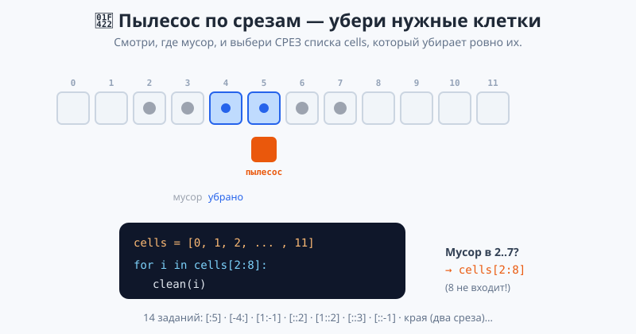

# Урок 3 — «Нарезка данных»: срезы списков и строк `a[start:stop:step]` ✂️📊

**Модуль 4 · Коллекции · Урок 3 из 7 | 2 ак.ч. (1,5 часа)**

> ⬅️ Предыдущий: [Урок 2 «Действия со списками»](../урок-02-действия-со-списками/урок.md) · [Все уроки модуля](../README.md) · [План курса](../../ПЛАН-КУРСА.md) · Следующий: Урок 4 «Кортежи: Координаты и константы» ➡️

> 🔁 В начале — [разминка/повтор](повторение.md) (5 мин).
> 📌 Быстро вспомнить материал урока — [итого.md](итого.md) (шпаргалка).
> 👨‍🏫 Сценарий с хронометражом — в [преподавателю.md](преподавателю.md).
> 🖼 Что показать на проекторе — в [изображения.md](изображения.md).
> 🆘 **Пропустил урок или хочешь закрепить?** Открой [самоучитель.md](самоучитель.md) — теория + задания с подсказками.
> 🧰 Трюки и частые ошибки — в [лайфхак.md](лайфхак.md).
> 🐢 В конце — **turtle-практикум «Пылесос по срезам»** (14 заданий).

> 🧭 **Как читать урок.** По индексу мы берём **один** элемент: `data[0]`, `data[-1]`. Но часто нужен **кусок**: первые три песни, последние пять сообщений, каждый второй день, слово наоборот. Для этого есть **срез** — `data[start:stop:step]`. Одной короткой записью можно вырезать любую часть списка **или строки**, перевернуть её и сделать безопасную копию. Сегодня разберём срезы по косточкам и закрепим их в игре «Пылесос по срезам»: будем убирать ровно те клетки, которые задаёт срез.

---

## 🎮 Что мы сделаем сегодня и что получим

**Задача:** научиться вырезать из списка любую часть — и собрать «Нарезку данных»: будни/выходные, топ-3, каждый второй день, неделю задом наперёд, проверку палиндрома.

**В итоге получится** `нарезка.py`:

```
Шаги за неделю: [8200, 5400, 12000, 9100, 7600, 15300, 6800]
Будни (Пн-Пт): [8200, 5400, 12000, 9100, 7600]
Последние 3 дня: [7600, 15300, 6800]
Топ-3 по шагам: [15300, 12000, 9100]
С конца недели: [6800, 15300, 7600, 9100, 12000, 5400, 8200]
топот - палиндром!
```

**Главные навыки урока:** `a[start:stop]` (stop не входит) · пропуск границ `[:3]`, `[7:]`, `[:]` · отрицательные границы `[-3:]`, `[1:-1]` · **шаг** `[::2]`, `[1::2]` · **реверс** `[::-1]` · **копия** `[:]` · срез строки · 🐢 «Пылесос по срезам» (14 заданий).

> 💡 **Главная мысль урока:** **срез `a[start:stop:step]` вырезает НОВЫЙ кусок — от start до stop−1 с шагом step.** Оригинал не меняется. Правило то же, что у `range`: start входит, stop нет.

---

## Часть 0 — Разминка: индекс даёт один, а нужен кусок (4 минуты)

По индексу мы берём **один** элемент:

```python
tracks = ["Muse", "Coldplay", "Kino", "U2", "Sting"]
print(tracks[0])    # Muse — один
print(tracks[-1])   # Sting — один
```

А как взять **первые три**? Писать `tracks[0], tracks[1], tracks[2]` долго и не гибко. Нужен **срез** — `tracks[:3]`.

---

## Часть 1 — `a[start:stop]`: вырезаем кусок (14 минут)

**Срез** берёт часть списка: от индекса `start` до `stop` — но **`stop` НЕ входит** (как у `range`):

```python
data = [0, 1, 2, 3, 4, 5, 6, 7, 8, 9]
print(data[2:5])    # [2, 3, 4] — со 2-го по 4-й (5 не входит!)
```

![Схема: срез a[start:stop] — start входит, stop не входит](изображения/срез-границы.svg)

> 💡 **Сколько элементов в срезе?** Ровно `stop - start`. `data[2:5]` → 5−2 = 3 элемента. Удобно прикинуть длину, не считая по пальцам.

**Пропуск границ.** Если границу не написать — Python подставит «с начала» или «до конца»:

```python
print(data[:3])     # [0, 1, 2]   — с начала до 3
print(data[7:])     # [7, 8, 9]   — с 7 до конца
print(data[:])      # весь список (копия!)
```

> ⚠️ **Срез НЕ падает при выходе за край.** `data[5:100]` вернёт `[5, 6, 7, 8, 9]` — просто «сколько есть». Это не `IndexError` (в отличие от `data[100]`). Срез безопаснее индекса.

> ✍️ **Мини-задание 1 (2 мин):** заведи список из 6 чисел. Выведи первые 3 (`[:3]`), последние 2 (`[4:]` или проще — в следующей части), и всё через `[:]`.
> <details><summary>💡 подсказка</summary><code>nums[:3]</code>; <code>nums[4:]</code>; <code>nums[:]</code>.</details>

---

## Часть 2 — Отрицательные границы: считаем с конца (12 минут)

Границы среза, как и индексы, могут быть **отрицательными** — счёт с конца:

```python
data = [0, 1, 2, 3, 4, 5, 6, 7, 8, 9]
print(data[-3:])    # [7, 8, 9]   — последние три
print(data[:-2])    # [0..7]      — всё, кроме последних двух
print(data[1:-1])   # [1..8]      — без первого и последнего
```

- 👀 `[-3:]` — «последние три» без подсчёта длины. `[1:-1]` — «обрезать края». Это самые частые срезы на практике.

> 💡 **`[-3:]` — «хвост из 3», `[:3]` — «голова из 3».** Минус спереди у stop (`[:-2]`) — «отрезать хвост». Комбинируй: `[1:-1]` убирает по одному с каждого края.

> ✍️ **Мини-задание 2 (3 мин):** дан список сообщений. Выведи последние 3 (`[-3:]`) и все, кроме последнего (`[:-1]`).
> <details><summary>💡 подсказка</summary><code>msgs[-3:]</code>; <code>msgs[:-1]</code>.</details>

---

## Часть 3 — Шаг: третье число `a[start:stop:step]` (12 минут)

Третье число среза — **шаг**: через сколько брать элементы.

```python
data = [0, 1, 2, 3, 4, 5, 6, 7, 8, 9]
print(data[::2])    # [0, 2, 4, 6, 8]  — каждый второй
print(data[1::2])   # [1, 3, 5, 7, 9]  — каждый второй, начиная с 1
print(data[::3])    # [0, 3, 6, 9]     — каждый третий
```

![Схема: шаг [::2] и реверс [::-1] (отрицательный шаг)](изображения/срез-шаг-реверс.svg)

- 👀 `[::2]` — «через один» (чётные индексы), `[1::2]` — нечётные. Пустые start и stop = «весь список», а `step` задаёт частоту.

> ✍️ **Мини-задание 3 (2 мин):** дан список из 10 чисел. Выведи каждый второй (`[::2]`) и каждый третий (`[::3]`).
> <details><summary>💡 подсказка</summary><code>nums[::2]</code>; <code>nums[::3]</code>.</details>

---

## Часть 4 — Реверс `[::-1]` и копия `[:]` (10 минут)

**Отрицательный шаг** идёт задом наперёд. `[::-1]` — «весь список наоборот»:

```python
data = [1, 2, 3, 4]
print(data[::-1])         # [4, 3, 2, 1]
```

**Срез работает и со строкой** — значит, `[::-1]` переворачивает слово. Отсюда — проверка **палиндрома**:

```python
word = "топот"
if word == word[::-1]:
    print("палиндром!")   # читается одинаково в обе стороны
```

**Копия списка `[:]`.** Это важно: `new = data` даёт **второе имя** тому же списку (изменишь одно — «изменятся оба»). А `new = data[:]` — **настоящая копия**:

```python
backup = data[:]     # независимая копия
backup.sort()        # меняем копию
print(data)          # оригинал ЦЕЛ
```

![Схема повторно: [::-1] переворот и [:] копия](изображения/срез-шаг-реверс.svg)

> 💡 **Три частых приёма:** `[::-1]` — перевернуть (список/строку), `[:]` — скопировать, `[1:-1]` — обрезать края. Запомни эти три — они встречаются постоянно.

> ⚠️ **`new = data` — НЕ копия!** Это ловушка: два имени, один список. Нужна копия — пиши `data[:]` (или `data.copy()`). Проверка: измени `new` и посмотри на `data`.

> ✍️ **Мини-задание 4 (3 мин):** спроси слово и проверь, палиндром ли оно (`word == word[::-1]`). Проверь на «шалаш» и «привет».
> <details><summary>💡 подсказка</summary><code>if word == word[::-1]: print("палиндром")</code>.</details>

Полный разбор всех срезов — в [`материалы/срезы_демо.py`](материалы/срезы_демо.py); проект «Нарезка данных» — [`материалы/нарезка.py`](материалы/нарезка.py).

---

## Часть 5 — 🐢 Практикум: Пылесос по срезам (18 минут)

Закрепим срезы в игре. В каркасе [`материалы/пылесос_срез.py`](материалы/пылесос_срез.py) — ряд из 12 клеток (номера 0–11). В некоторых лежит мусор. Готов список `cells = [0, 1, ..., 11]`. Твоя задача — убрать **ровно замусоренные** клетки, задав нужный **срез**:

```python
for i in cells[2:8]:      # клетки 2..7
    clean(i)
```

**Команда:** `clean(i)` — убрать мусор в клетке номер `i` (пылесос подъезжает и красит её синим). Меняй `TASK` (1–14). Внизу окно напишет «ЧИСТО!» или сколько мусора осталось.



- 🐢 Запусти на **своём компьютере**. Смотри, ГДЕ мусор, и подбери срез: первые 5 → `cells[:5]`; последние 4 → `cells[-4:]`; каждая вторая → `cells[::2]`; все, кроме краёв → `cells[1:-1]`; всё справа налево → `cells[::-1]`. Всего **14 заданий**.

> 💡 **Здесь срез виден руками.** Замусорены клетки 2–7? Это `cells[2:8]` (8 не входит!). Каждая вторая? `cells[::2]`. Игра превращает абстрактный срез в наглядное «какие клетки убрать».

> 💡 **Задание 11 — два среза подряд.** Мусор по краям (первые 3 и последние 3)? Убери `cells[:3]`, потом `cells[-3:]` — два цикла подряд.

> 🧩 **Для 5–7 классов:** задания 1–5 (первые/последние/диапазон). 🎓 **Глубже:** 6–14 (шаг, реверс, края, `[1:-1:2]`).

> ⚠️ **Запускать на компьютере**, не в онлайн-консоли: пылесос рисуется в окне (его держит `turtle.done()` — не трогай). Выйдешь за границу (индекс ≥ 12) — пылесос покраснеет.

---

## 🐞 Разбор частых ошибок

| Симптом | Что случилось | Как починить |
|---------|---------------|--------------|
| в срезе на 1 элемент меньше | забыл, что `stop` не входит | верхнюю границу бери на 1 больше |
| `data[5]` упал, а `data[5:99]` нет | индекс за краем падает, срез — нет | для «сколько есть» бери срез |
| `new = data` — меняются «оба» | это одно имя, не копия | копия — `data[:]` или `data.copy()` |
| `[::-1]` не перевернул | написал `[-1]` (один элемент) | переворот — `[::-1]` (три двоеточия… то есть два) |
| `[2:8:2]` дал не то | забыл про шаг | это со 2 до 7 через один: 2, 4, 6 |
| срез строки не сработал | пытался изменить `word[0]=...` | строку менять нельзя, но срез читать — можно |

> ⚠️ **Главное правило среза:** `start` входит, `stop` — нет; шаг задаёт частоту; `[::-1]` — переворот; `[:]` — копия.

---

## 🏁 Итог урока (5 минут)

Срез стал универсальным ножом для данных:

- ✅ **`a[start:stop]`** — кусок от start до stop−1 (stop не входит), длина `stop-start`.
- ✅ Пропуск границ: `[:3]` (с начала), `[7:]` (до конца), `[:]` (копия).
- ✅ Отрицательные: `[-3:]` (хвост), `[:-2]` (без хвоста), `[1:-1]` (обрезать края).
- ✅ **Шаг:** `[::2]` (через один), `[1::2]`, `[::3]`.
- ✅ **`[::-1]`** — переворот списка/строки (палиндром); **`[:]`** — безопасная копия.
- ✅ Срез не падает за краем и не меняет оригинал.
- ✅ 🐢 «Пылесос по срезам»: убрать ровно нужные клетки срезом.

> 🏆 Главное: **`a[start:stop:step]` вырезает новый кусок; `[::-1]` переворачивает, `[:]` копирует.** Быстро повторить — в [итого.md](итого.md).

> 🎤 **Блиц:** что даёт `data[2:5]`? сколько в нём элементов? что делает `[-3:]`? что такое `[::2]`? как перевернуть список? чем `data[:]` отличается от `new = data`? как убрать пылесосом клетки 2–7?

### 🎮 Викторина-закрепление
Открой **[викторина.html](викторина.html)** — 18 вопросов + смешные и «на подумать».

➡️ **Практика урока** — **[практика.md](практика.md)**: задачи в 3 уровнях + 🐢 turtle.
🆘 **Пропустил / хочешь ещё?** — [самоучитель.md](самоучитель.md) (теория + 15–20 заданий).
🧰 **Трюки и ошибки** — [лайфхак.md](лайфхак.md). 📌 **Шпаргалка** — [итого.md](итого.md).

---

## 🔗 Навигация и материалы

⬅️ **Предыдущий:** [Урок 2 «Действия со списками»](../урок-02-действия-со-списками/урок.md) · [Все уроки модуля](../README.md) · [План курса](../../ПЛАН-КУРСА.md) · **Следующий:** Урок 4 «Кортежи: Координаты и константы» ➡️

**🧰 Инструменты:** [Python](https://www.python.org/downloads/) · среда: [PyCharm Community](https://www.jetbrains.com/pycharm/download/) или [VS Code](https://code.visualstudio.com/).
**📄 Готовый код:** [`срезы_демо.py`](материалы/срезы_демо.py) · [`нарезка.py`](материалы/нарезка.py) · 🐢 [`пылесос_срез.py`](материалы/пылесос_срез.py) (все проверены).
**⚙️ Учителю:** сценарий и частые ошибки — в [преподавателю.md](преподавателю.md).
