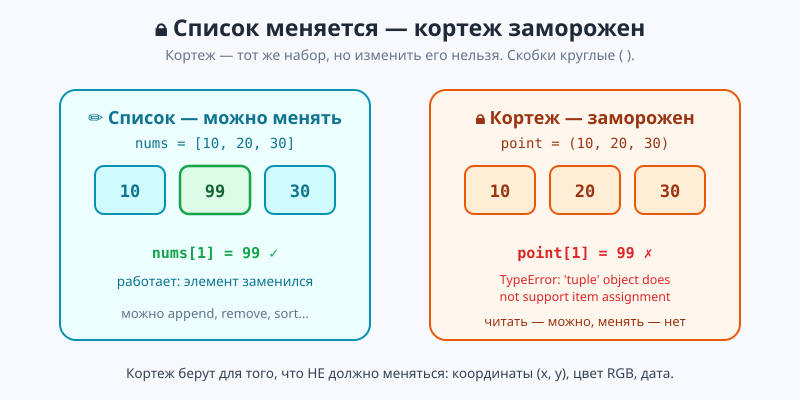
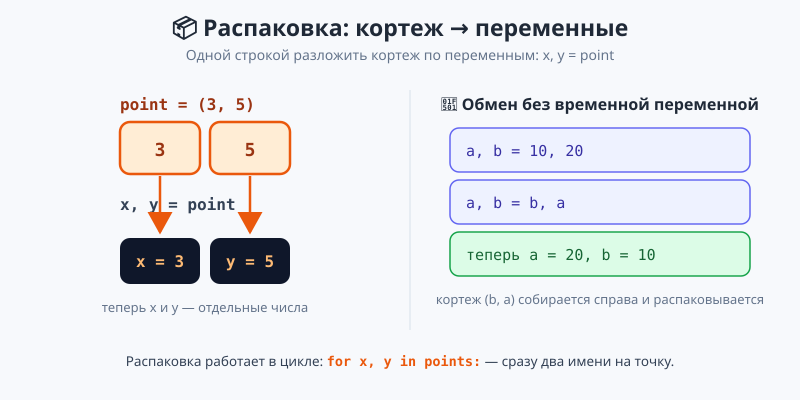
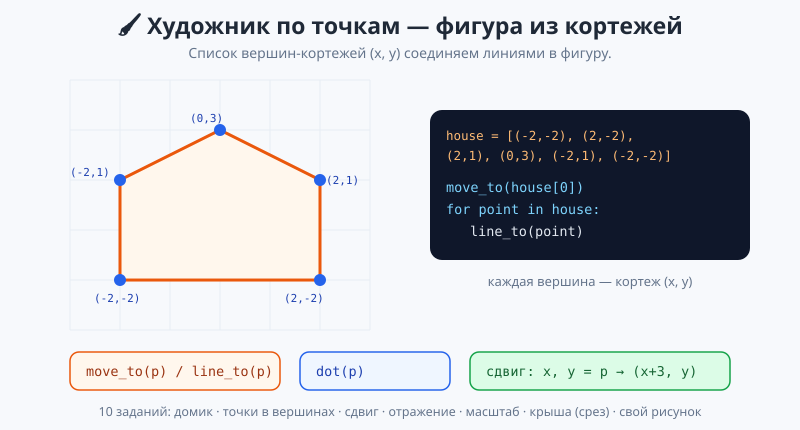

# Урок 4 — «Координаты и константы»: кортежи `(x, y)`, неизменяемость, распаковка 🔒📍

**Модуль 4 · Коллекции · Урок 4 из 7 | 2 ак.ч. (1,5 часа)**

> ⬅️ Предыдущий: [Урок 3 «Срезы»](../урок-03-срезы/урок.md) · [Все уроки модуля](../README.md) · [План курса](../../ПЛАН-КУРСА.md) · Следующий: Урок 5 «Словари: Телефонная книга» ➡️

> 🔁 В начале — [разминка/повтор](повторение.md) (5 мин).
> 📌 Быстро вспомнить материал урока — [итого.md](итого.md) (шпаргалка).
> 👨‍🏫 Сценарий с хронометражом — в [преподавателю.md](преподавателю.md).
> 🖼 Что показать на проекторе — в [изображения.md](изображения.md).
> 🆘 **Пропустил урок или хочешь закрепить?** Открой [самоучитель.md](самоучитель.md) — теория + задания с подсказками.
> 🧰 Трюки и частые ошибки — в [лайфхак.md](лайфхак.md).
> 🐢 В конце — **turtle-практикум «Художник по точкам»** (10 заданий).

> 🧭 **Как читать урок.** Список — гибкий: добавляй, удаляй, меняй. Но иногда набор данных **не должен меняться**: координаты точки `(x, y)`, цвет `(255, 128, 0)`, дата `(2026, 8, 15)`. Для такого есть **кортеж** (`tuple`) — «замороженный» список в круглых скобках. Его нельзя случайно испортить, зато удобно **распаковывать** по переменным (`x, y = point`) и хранить как пару/тройку. Сегодня разберём кортежи и нарисуем фигуры по списку точек-кортежей.

---

## 🎮 Что мы сделаем сегодня и что получим

**Задача:** научиться хранить фиксированные наборы (точки, цвета) кортежами, раскладывать их по переменным — и рисовать фигуры по списку вершин.

**В итоге получатся** `кортежи_демо.py` и `координаты.py`:

```
Кортеж: (3, 5)
Изменить нельзя: 'tuple' object does not support item assignment
Распаковка: x = 3 , y = 5
После обмена: a = 20 , b = 10
Точки треугольника: (0,0) (3,4) (6,0)
```

**Главные навыки урока:** кортеж `(...)` · индекс и `len` · **неизменяемость** · **распаковка** `x, y = point` · обмен `a, b = b, a` · распаковка в цикле `for x, y in points` · множественный возврат функции · кортеж как ключ (🎓) · 🐢 «Художник по точкам».

> 💡 **Главная мысль урока:** **кортеж — это список, который нельзя менять.** Круглые скобки вместо квадратных. Берут его для того, что должно оставаться постоянным: координаты, цвет, пара «ключ-значение».

---

## Часть 0 — Разминка: список можно испортить (4 минуты)

Список удобен, но его **легко изменить по ошибке**:

```python
point = [3, 5]      # координата как список
point[0] = 999      # упс — случайно сдвинули точку
```

А координата точки, цвет или дата меняться **не должны**. Хочется «заморозить» набор. Для этого — **кортеж**.

---

## Часть 1 — Кортеж: замороженный список (14 минут)

**Кортеж** записывают в **круглых** скобках. Всё остальное — как у списка (индекс, `len`, перебор), кроме одного: **менять нельзя**.

```python
point = (3, 5)         # кортеж из двух чисел
print(point[0])        # 3 — по индексу, как в списке
print(len(point))      # 2
```

**Неизменяемость** — главное свойство:

```python
point[0] = 99          # ❌ TypeError: 'tuple' object does not support item assignment
```



> 💡 **Список `[ ]` — квадратные скобки, кортеж `( )` — круглые.** Список меняется (`append`, `sort`, `lst[0]=...`), кортеж — нет. Читать кортеж (индекс, срез, `in`, перебор) можно, а изменять — нельзя.

> ⚠️ **Кортеж из одного элемента — с запятой!** `(5)` — это просто число 5 в скобках. Кортеж из одного элемента — `(5,)` (с запятой). Мелочь, но легко забыть.

> ✍️ **Мини-задание 1 (2 мин):** заведи кортеж `color = (255, 128, 0)`. Выведи первый и последний элемент и длину. Попробуй `color[0] = 0` — увидишь ошибку.
> <details><summary>💡 подсказка</summary><code>color[0]</code>, <code>color[-1]</code>, <code>len(color)</code>; присваивание даст TypeError.</details>

---

## Часть 2 — Распаковка: разложить по переменным (14 минут)

Главное удобство кортежа — **распаковка**: одной строкой разложить его по переменным.

```python
point = (3, 5)
x, y = point           # x = 3, y = 5
print(x, y)
```



**Обмен значениями без временной переменной** — тоже распаковка кортежа:

```python
a, b = 10, 20
a, b = b, a            # теперь a = 20, b = 10
```

- 👀 Справа собирается кортеж `(b, a)`, слева он распаковывается в `a, b`. Классический трюк «поменять местами».

**Распаковка прямо в цикле** — очень удобно для списка кортежей:

```python
points = [(0, 0), (3, 4), (6, 0)]
for x, y in points:    # каждый кортеж сразу разложен в x, y
    print(f"x={x}, y={y}")
```

> 💡 **`for x, y in points` — читай «для каждой точки (x, y)».** Не нужно писать `point[0]`, `point[1]` — Python сам раскладывает пару в два имени. Так удобно ходить по координатам.

> ✍️ **Мини-задание 2 (3 мин):** дан список `people = [("Аня", 12), ("Боря", 13)]`. Выведи через распаковку `for name, age in people:` строки вида `Аня — 12 лет`.
> <details><summary>💡 подсказка</summary><code>for name, age in people: print(f"{name} — {age} лет")</code>.</details>

---

## Часть 3 — Зачем кортеж: координаты, цвета, возврат (12 минут)

Где кортежи незаменимы:

**Координаты и цвета — константы:**
```python
start = (0, 0)             # точка на карте
ORANGE = (234, 88, 12)     # цвет RGB — не меняется
```

**Функция возвращает несколько значений — это кортеж:**
```python
def min_max(numbers):
    return min(numbers), max(numbers)   # вернётся кортеж (min, max)

low, high = min_max([7, 2, 9, 4])       # распаковываем результат
print(low, high)                        # 2 9
```

- 👀 `return a, b` отдаёт кортеж, а `low, high = ...` его распаковывает. Так функция «возвращает две вещи».

> 💡 **🎓 Кортеж может быть КЛЮЧОМ словаря** (список — не может, потому что меняется). Например, счёт матча: `scores[("Спартак", "Зенит")] = (2, 1)`. Словари — следующий урок, но кортеж-ключ пригодится.

> ✍️ **Мини-задание 3 (3 мин):** напиши функцию `divmod2(a, b)`, которая возвращает частное и остаток (`a // b, a % b`). Распакуй результат в `q, r` и выведи.
> <details><summary>💡 подсказка</summary><code>return a // b, a % b</code>; <code>q, r = divmod2(17, 5)</code>.</details>

Полный разбор — в [`материалы/кортежи_демо.py`](материалы/кортежи_демо.py); проект с координатами и цветами — [`материалы/координаты.py`](материалы/координаты.py).

---

## Часть 4 — 🐢 Практикум: Художник по точкам (18 минут)

Кортежи идеальны для **точек**. В каркасе [`материалы/художник.py`](материалы/художник.py) — координатное поле и готовая фигура `house` — **список вершин-кортежей** `(x, y)`. Соединяя точки линиями, рисуем фигуру.

```python
move_to(house[0])          # встали в первую вершину
for point in house:        # проходим список кортежей
    line_to(point)         # ведём линию в каждую вершину
```

**Команды:** `move_to(point)` — перо в точку без линии; `line_to(point)` — линия в точку; `dot(point)` — маркер в вершине. `point` — это кортеж `(x, y)`.



- 🐢 Запусти на **своём компьютере** — появится домик. Дальше **преобразуй фигуру**, раскладывая кортеж: сдвинуть вправо (`x, y = point` → `line_to((x + 4, y))`), отразить (`(x, -y)`), увеличить (`(x*2, y*2)`), нарисовать только крышу (`house[2:5]` — срез из Урока 3!). Всего **10 заданий**.

> 💡 **Тут кортеж работает как точка.** `house` — список кортежей-вершин. Чтобы двигать фигуру, кортеж нельзя изменить — но можно **собрать новый**: `(x + 4, y)`. Именно так работают с неизменяемыми данными: не меняем, а создаём новое.

> 🧩 **Для 5–7 классов:** задания 1–2 (нарисовать домик, точки в вершинах). 🎓 **Глубже:** 3–10 (сдвиг, отражение, масштаб, крыша срезом, свой рисунок).

> ⚠️ **Запускать на компьютере**, не в онлайн-консоли: рисунок в отдельном окне (его держит `turtle.done()` — не трогай).

---

## 🐞 Разбор частых ошибок

| Симптом | Что случилось | Как починить |
|---------|---------------|--------------|
| `TypeError: ... item assignment` | пытался изменить кортеж | кортеж менять нельзя; собери новый |
| `(5)` оказалось числом | кортеж из 1 элемента без запятой | пиши `(5,)` |
| `ValueError: too many values to unpack` | переменных меньше, чем в кортеже | слева столько же имён, сколько элементов |
| фигура не сдвинулась | менял `point[0]` (нельзя) | распакуй `x, y = point`, собери `(x+4, y)` |
| перепутал скобки | список в круглых / кортеж в квадратных | список `[ ]`, кортеж `( )` |

> ⚠️ **Главное правило:** кортеж не меняют — из него берут (индекс, распаковка) и на его основе **создают новое**.

---

## 🏁 Итог урока (5 минут)

Кортеж — надёжный «замороженный» набор:

- ✅ **Кортеж `(...)`** — как список, но **менять нельзя** (круглые скобки).
- ✅ Читать можно: индекс, `len`, срез, `in`, перебор.
- ✅ **Распаковка** `x, y = point`; обмен `a, b = b, a`; в цикле `for x, y in points`.
- ✅ Функция возвращает несколько значений — это кортеж (`return a, b`).
- ✅ Берут для констант: координаты, цвет RGB, пара-ключ (🎓).
- ✅ 🐢 «Художник по точкам»: фигура по списку вершин-кортежей; сдвиг/отражение — через новый кортеж.

> 🏆 Главное: **кортеж — неизменяемый набор; его распаковывают (`x, y = point`) и на его основе создают новый.** Быстро повторить — в [итого.md](итого.md).

> 🎤 **Блиц:** чем кортеж отличается от списка? какие скобки у кортежа? что такое распаковка? как поменять `a` и `b` местами? как функция возвращает два значения? почему координаты удобно хранить кортежем?

### 🎮 Викторина-закрепление
Открой **[викторина.html](викторина.html)** — 18 вопросов + смешные и «на подумать».

➡️ **Практика урока** — **[практика.md](практика.md)**: задачи в 3 уровнях + 🐢 turtle.
🆘 **Пропустил / хочешь ещё?** — [самоучитель.md](самоучитель.md) (теория + 15–20 заданий).
🧰 **Трюки и ошибки** — [лайфхак.md](лайфхак.md). 📌 **Шпаргалка** — [итого.md](итого.md).

---

## 🔗 Навигация и материалы

⬅️ **Предыдущий:** [Урок 3 «Срезы»](../урок-03-срезы/урок.md) · [Все уроки модуля](../README.md) · [План курса](../../ПЛАН-КУРСА.md) · **Следующий:** Урок 5 «Словари: Телефонная книга» ➡️

**🧰 Инструменты:** [Python](https://www.python.org/downloads/) · среда: [PyCharm Community](https://www.jetbrains.com/pycharm/download/) или [VS Code](https://code.visualstudio.com/).
**📄 Готовый код:** [`кортежи_демо.py`](материалы/кортежи_демо.py) · [`координаты.py`](материалы/координаты.py) · 🐢 [`художник.py`](материалы/художник.py) (все проверены).
**⚙️ Учителю:** сценарий и частые ошибки — в [преподавателю.md](преподавателю.md).
