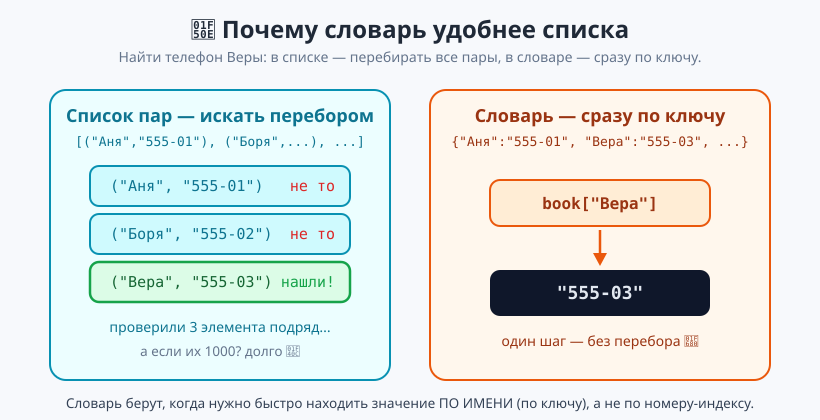
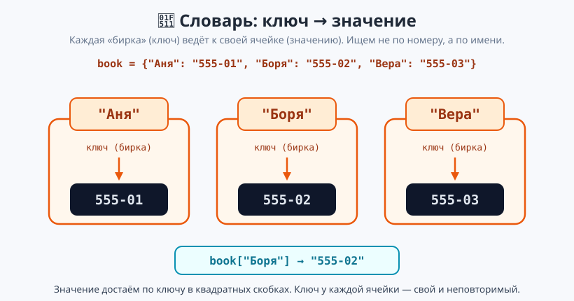
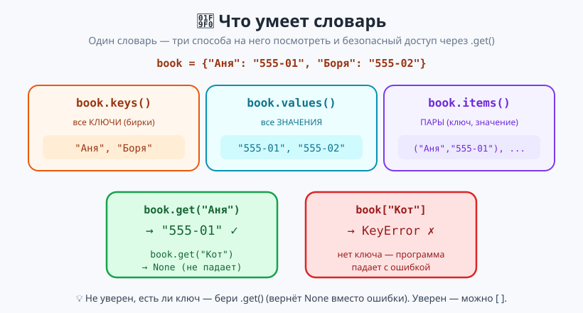

# Урок 5 — «Телефонная книга / Инвентарь»: словари `{ключ: значение}` 🔑📇

**Модуль 4 · Коллекции · Урок 5 из 7 | 2 ак.ч. (1,5 часа)**

> ⬅️ Предыдущий: [Урок 4 «Кортежи»](../урок-04-кортежи/урок.md) · [Все уроки модуля](../README.md) · [План курса](../../ПЛАН-КУРСА.md) · Следующий: Урок 6 «Множества + перебор словаря» ➡️

> 🔁 В начале — [разминка/повтор](повторение.md) (5 мин).
> 📌 Быстро вспомнить материал урока — [итого.md](итого.md) (шпаргалка).
> 👨‍🏫 Сценарий с хронометражом — в [преподавателю.md](преподавателю.md).
> 🖼 Что показать на проекторе — в [изображения.md](изображения.md).
> 🆘 **Пропустил урок или хочешь закрепить?** Открой [самоучитель.md](самоучитель.md) — теория + задания с подсказками.
> 🧰 Трюки и частые ошибки — в [лайфхак.md](лайфхак.md).

> 🧭 **Как читать урок.** В списке данные лежат по номерам: `phones[0]`, `phones[1]`... Но телефон Ани мы помним не как «элемент №3», а как **«телефон Ани»**. Хочется искать **по имени**, а не по номеру. Для этого есть **словарь** (`dict`): он хранит пары **ключ → значение** (`"Аня" → "555-01"`) и достаёт значение сразу по ключу. Сегодня соберём телефонную книгу и инвентарь героя.

---

## 🎮 Что мы сделаем сегодня и что получим

**Задача:** научиться хранить данные парами «ключ → значение» и мгновенно находить нужное по ключу — на примере телефонной книги и инвентаря.

**В итоге получатся** `телефонная_книга.py` и `инвентарь.py`:

```
=== ТЕЛЕФОННАЯ КНИГА ===
Все контакты:
  Аня: 555-01-23
  Боря: 555-04-56
Телефон Вера: 555-07-89
Телефон Женя: не найден
=== ИНВЕНТАРЬ ===
  монета: 4 шт.
Больше всего: монета (4 шт.)
```

**Главные навыки урока:** словарь `{ключ: значение}` · доступ `d[key]` · безопасный `.get()` · добавить/изменить/удалить (`d[k]=v`, `del`, `.pop`) · `in`, `len` · `.keys() / .values() / .items()` · перебор по ключам · счётчик на словаре.

> 💡 **Главная мысль урока:** **словарь хранит пары «ключ → значение».** Ключ — как бирка (имя, название), значение — что за ней спрятано (телефон, количество). Достаём не по номеру-индексу, а сразу **по ключу**.

---

## Часть 0 — Разминка: список ищет плохо (5 минут)

Представь телефоны в **списке пар**:

```python
book = [("Аня", "555-01"), ("Боря", "555-02"), ("Вера", "555-03")]
```

Чтобы найти телефон Веры, придётся **перебирать** список и сравнивать имена — а если контактов тысяча? Долго и неудобно.



Хочется сказать просто: «дай телефон **Веры**». Именно это умеет **словарь**.

---

## Часть 1 — Словарь: пары «ключ → значение» (15 минут)

Словарь пишут в **фигурных** скобках `{ }`, внутри — пары `ключ: значение` через запятую:

```python
book = {"Аня": "555-01", "Боря": "555-02", "Вера": "555-03"}
print(book["Боря"])     # 555-02 — достаём значение по ключу
print(len(book))        # 3 — сколько пар в словаре
```

- 👀 Слева от `:` — **ключ** (по нему ищем), справа — **значение** (что храним). Достаём в **квадратных** скобках, как у списка, но внутри не номер, а ключ: `book["Боря"]`.



> 💡 **Три вида скобок — три коллекции.** Список `[ ]` (по номерам), кортеж `( )` (заморожен), словарь `{ }` (по ключам). У словаря доступ — `book["ключ"]`.

**⚠️ Нет такого ключа — ошибка `KeyError`.** Дай ученику наткнуться:

```python
print(book["Кот"])     # ❌ KeyError: 'Кот' — такого ключа в словаре нет
```

Python не находит бирку «Кот» и **роняет программу**. Как искать безопасно — в Части 3.

**Ключи бывают не только строками.** Значение — что угодно (число, строка). Ключ — чаще строка или число:

```python
inventory = {"меч": 1, "зелье": 5, "монета": 120}   # предмет -> количество
print(inventory["монета"])     # 120
```

> ✍️ **Мини-задание 1 (3 мин):** заведи словарь `ages = {"Аня": 12, "Боря": 13, "Вера": 11}` (имя → возраст). Выведи возраст Бори по ключу и общее число людей через `len`.
> <details><summary>💡 подсказка</summary><code>ages["Боря"]</code> и <code>len(ages)</code>.</details>

---

## Часть 2 — Добавить, изменить, удалить (14 минут)

Словарь — как список — **изменяемый**. Добавление и изменение пишутся **одинаково**: `d[ключ] = значение`.

```python
book = {"Аня": "555-01"}
book["Боря"] = "555-02"     # ключа не было -> ДОБАВИЛИ пару
book["Аня"] = "555-99"      # ключ был -> ЗАМЕНИЛИ значение
print(book)                 # {'Аня': '555-99', 'Боря': '555-02'}
```

- 👀 Одна и та же строка `d[k] = v`: если ключа не было — пара добавится, если был — значение заменится. Второго телефона у «Ани» не появится: **ключ в словаре один**.

**Удаление** — два способа:

```python
del book["Боря"]            # удалить пару по ключу
gone = book.pop("Аня")      # удалить И вернуть значение ("555-99")
```

- 👀 `del` просто выкидывает пару. `.pop(ключ)` — выкидывает и **отдаёт** значение (удобно, если оно ещё нужно).

**Второй пример — инвентарь (значение-число можно менять «на месте»):**

```python
inventory = {"зелье": 5}
inventory["зелье"] += 2     # стало 7 — то же, что inventory["зелье"] = inventory["зелье"] + 2
inventory["щит"] = 1        # нового ключа не было -> добавился
```

> 💡 **Ключ уникален.** Если добавить пару с уже существующим ключом — старое значение просто заменится. Дублей ключей в словаре не бывает.

> ✍️ **Мини-задание 2 (3 мин):** возьми словарь `inventory = {"меч": 1, "зелье": 3}`. Добавь ключ `"монета"` со значением `50`, увеличь число зелий на 2 и удали `"меч"`. Выведи словарь.
> <details><summary>💡 подсказка</summary><code>inventory["монета"] = 50</code>, <code>inventory["зелье"] += 2</code>, <code>del inventory["меч"]</code>.</details>

---

## Часть 3 — Безопасный доступ `.get()` и проверка `in` (12 минут)

Квадратные скобки `book["Кот"]` роняют программу, если ключа нет. Чтобы не падать — метод **`.get()`**:

```python
book = {"Аня": "555-01"}
print(book.get("Аня"))            # 555-01 — ключ есть
print(book.get("Кот"))            # None — ключа нет, но НЕ ошибка
print(book.get("Кот", "нет"))     # нет — можно задать запасное значение
```

- 👀 `.get(ключ)` возвращает значение, а если ключа нет — `None` (или то, что дашь вторым аргументом). Программа не падает.



**Проверить, есть ли ключ, можно словом `in`** (как в списке — но проверяет именно ключи):

```python
print("Аня" in book)      # True
print("Кот" in book)      # False
```

Отсюда — привычный приём с `if`:

```python
name = "Боря"
if name in book:
    print(book[name])
else:
    print("Нет такого контакта")
```

> 💡 **Правило выбора.** Не уверен, есть ли ключ, — бери `.get()` (вернёт `None` вместо ошибки) или проверь `in`. Уверен, что ключ есть, — можно квадратные скобки.

> ✍️ **Мини-задание 3 (3 мин):** для `book = {"Аня": "555-01", "Боря": "555-02"}` выведи через `.get` телефон Ани и телефон Гены с запасным значением `"не найден"`. Затем проверь через `in`, есть ли в книге «Боря».
> <details><summary>💡 подсказка</summary><code>book.get("Гена", "не найден")</code> и <code>"Боря" in book</code>.</details>

---

## Часть 4 — Три взгляда на словарь и перебор (14 минут)

У словаря есть три метода, чтобы достать его «содержимое пачкой»:

```python
book = {"Аня": "555-01", "Боря": "555-02"}
print(book.keys())        # dict_keys(['Аня', 'Боря'])     — все КЛЮЧИ
print(book.values())      # dict_values(['555-01', '555-02']) — все ЗНАЧЕНИЯ
print(book.items())       # dict_items([('Аня', '555-01'), ...]) — ПАРЫ (ключ, значение)
```

- 👀 `keys()` — бирки, `values()` — что за ними, `items()` — пары целиком. Каждая пара — знакомый **кортеж** `(ключ, значение)` из Урока 4.

**Перебор словаря.** Цикл `for` по словарю идёт **по ключам**, а значение берём по ключу:

```python
for name in book:               # name пробегает КЛЮЧИ: "Аня", "Боря"
    print(f"{name}: {book[name]}")
```

Вывод:
```
Аня: 555-01
Боря: 555-02
```

> 💡 **`for name in book` — это перебор ключей.** Внутри цикла значение достаём как обычно: `book[name]`. Так удобно распечатать всю книгу.

Второй пример — перебор **инвентаря** с подсчётом суммы (значения — числа):

```python
inventory = {"меч": 1, "зелье": 5, "монета": 120}
total = sum(inventory.values())     # sum по значениям
print("Всего предметов:", total)    # 126
```

> 🔜 Пары `items()` в цикле красиво раскладываются распаковкой `for k, v in ...` — но это **следующий урок** (Урок 6), там же познакомимся с множествами. Пока перебираем по ключам.

> ✍️ **Мини-задание 4 (3 мин):** для `ages = {"Аня": 12, "Боря": 13, "Вера": 11}` выведи всех циклом в виде `Аня — 12 лет`, а затем — сумму всех возрастов через `sum(ages.values())`.
> <details><summary>💡 подсказка</summary><code>for name in ages: print(f"{name} — {ages[name]} лет")</code>; сумма — <code>sum(ages.values())</code>.</details>

---

## Часть 5 — 🏆 Проекты: Телефонная книга и Инвентарь (16 минут)

Собираем всё вместе.

**Телефонная книга** [`материалы/телефонная_книга.py`](материалы/телефонная_книга.py): стартовые контакты, добавление новых, поиск через `.get` (не падает на незнакомом имени), проверка `in`, смена номера и удаление, печать всей книги циклом.

```python
book = {"Аня": "555-01-23", "Боря": "555-04-56"}
book["Гена"] = "555-10-11"                 # добавили контакт
print(book.get("Вера", "не найден"))       # безопасный поиск
for name in book:                          # печать всей книги
    print(f"  {name}: {book[name]}")
```

**Инвентарь героя** [`материалы/инвентарь.py`](материалы/инвентарь.py): считаем добычу приёмом-**счётчиком**. `.get(item, 0) + 1` — «сколько было (или 0) плюс один»:

```python
loot = ["монета", "зелье", "монета", "меч", "монета"]
inventory = {}
for item in loot:
    inventory[item] = inventory.get(item, 0) + 1   # копим количество
print(inventory)     # {'монета': 3, 'зелье': 1, 'меч': 1}
```

- 👀 Это классический приём: словарь-**счётчик**. Для нового предмета `.get(item, 0)` даёт 0, для знакомого — текущее число; прибавляем 1. Так словарь считает, сколько раз что встретилось.

Полный разбор — в [`материалы/словарь_демо.py`](материалы/словарь_демо.py) (все операции по шагам).

> 🧩 **Для 5–7 классов:** создать книгу/инвентарь, добавить и найти по ключу, `.get`. 🎓 **Глубже:** счётчик добычи, `sum(values())`, поиск «рекордсмена» циклом.

> ✍️ **Мини-задание 5 (3 мин):** дан список голосов `votes = ["кот", "пёс", "кот", "кот", "пёс"]`. Посчитай словарём, сколько голосов у каждого, и выведи результат.
> <details><summary>💡 подсказка</summary>Тот же счётчик: <code>counts[v] = counts.get(v, 0) + 1</code>.</details>

---

## 🐞 Разбор частых ошибок

| Симптом | Что случилось | Как починить |
|---------|---------------|--------------|
| `KeyError: 'Кот'` | обратился к ключу, которого нет | проверь `in` или бери `.get(ключ, запасное)` |
| словарь в `[ ]` или `( )` | перепутал скобки | словарь — фигурные `{ }` |
| `d["Аня"]` вернул не то | ключ с опечаткой/регистром (`"аня"` ≠ `"Аня"`) | ключи чувствительны к регистру и пробелам |
| два одинаковых ключа | второй «затёр» первый | ключ в словаре один; дублей не бывает |
| `for k in d` дал ключи, а нужны значения | цикл идёт по ключам | значение бери `d[k]` (или `d.values()`) |
| `TypeError: unhashable type: 'list'` | сделал ключом список | ключ должен быть неизменяемым (строка, число, кортеж) |

> ⚠️ **Главное правило:** к неизвестному ключу — через `.get()` или проверку `in`, иначе `KeyError` уронит программу.

---

## 🎓 Глубже

**Вложенные словари** — значением может быть целый словарь. Так хранят «карточку» на каждого:

```python
heroes = {
    "Рыцарь": {"hp": 100, "меч": "стальной"},
    "Маг":    {"hp": 70,  "заклинание": "огонь"},
}
print(heroes["Маг"]["hp"])      # 70 — сначала по внешнему ключу, потом по внутреннему
```

Достаём в два шага: `heroes["Маг"]` даёт словарь мага, затем `["hp"]` — его здоровье. Это фундамент **Урока 7** (мини-база данных персонажей).

**Кортеж как ключ.** Ключом может быть неизменяемый кортеж — удобно для координат:

```python
field = {(0, 0): "старт", (2, 3): "клад"}
print(field[(2, 3)])            # клад
```

Список ключом быть не может (`unhashable`), а кортеж — может: он «заморожен» (Урок 4).

---

## 🧩 Для 5–7 классов

- Словарь — это **пары «имя → значение»**: `{"Аня": "555-01"}`.
- Достаём по ключу: `book["Аня"]`. Добавляем/меняем: `book["Гена"] = "555-04"`.
- Нет ключа — `.get("Гена", "нет")`, чтобы не было ошибки.
- Перебор: `for name in book: print(name, book[name])`.
- Проекты: телефонная книга (имя → номер), инвентарь (предмет → количество).

---

## 🏁 Итог урока (5 минут)

Словарь — коллекция «по имени»:

- ✅ **Словарь `{ключ: значение}`** — фигурные скобки, доступ `d[key]`.
- ✅ Нет ключа → `KeyError`; безопасно — `.get(key, запасное)` и проверка `in`.
- ✅ Добавить/изменить — `d[k] = v` (одинаково), удалить — `del d[k]` или `.pop(k)`.
- ✅ `len(d)`, `.keys()`, `.values()`, `.items()` (пары — кортежи).
- ✅ Перебор по ключам: `for k in d: ... d[k]`.
- ✅ Проекты: телефонная книга, инвентарь-счётчик `d[x] = d.get(x, 0) + 1`.

> 🏆 Главное: **словарь ищет по ключу, а не по номеру.** Не уверен в ключе — `.get()` или `in`. Быстро повторить — в [итого.md](итого.md).

> 🎤 **Блиц:** в каких скобках словарь? как достать значение по ключу? что будет от `d["нет_такого"]`? чем `.get()` лучше? как добавить пару? что вернёт `.items()`? как перебрать словарь циклом?

### 🎮 Викторина-закрепление
Открой **[викторина.html](викторина.html)** — 18 вопросов + смешные и «на подумать».

➡️ **Практика урока** — **[практика.md](практика.md)**: задачи в 3 уровнях.
🆘 **Пропустил / хочешь ещё?** — [самоучитель.md](самоучитель.md) (теория + 15–20 заданий).
🧰 **Трюки и ошибки** — [лайфхак.md](лайфхак.md). 📌 **Шпаргалка** — [итого.md](итого.md).

---

## 🔗 Навигация и материалы

⬅️ **Предыдущий:** [Урок 4 «Кортежи»](../урок-04-кортежи/урок.md) · [Все уроки модуля](../README.md) · [План курса](../../ПЛАН-КУРСА.md) · **Следующий:** Урок 6 «Множества + перебор словаря» ➡️

**🧰 Инструменты:** [Python](https://www.python.org/downloads/) · среда: [PyCharm Community](https://www.jetbrains.com/pycharm/download/) или [VS Code](https://code.visualstudio.com/).
**📄 Готовый код:** [`словарь_демо.py`](материалы/словарь_демо.py) · [`телефонная_книга.py`](материалы/телефонная_книга.py) · [`инвентарь.py`](материалы/инвентарь.py) (все проверены).
**⚙️ Учителю:** сценарий и частые ошибки — в [преподавателю.md](преподавателю.md).
