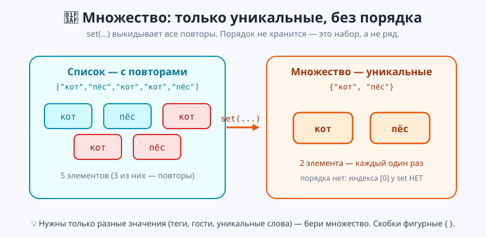
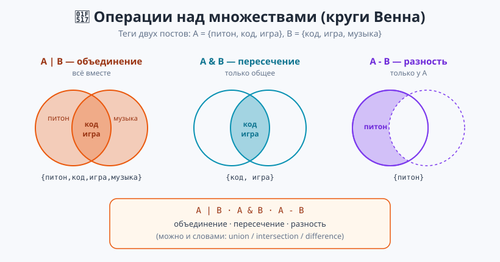
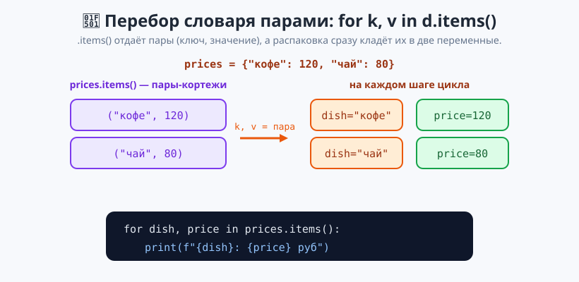

# Урок 6 — «Уникальные теги»: множества `set` и перебор словаря `for k, v` 🎯🔗

**Модуль 4 · Коллекции · Урок 6 из 7 | 2 ак.ч. (1,5 часа)**

> ⬅️ Предыдущий: [Урок 5 «Словари»](../урок-05-словари/урок.md) · [Все уроки модуля](../README.md) · [План курса](../../ПЛАН-КУРСА.md) · Следующий: Урок 7 «🏆 Мини-база данных персонажей» ➡️

> 🔁 В начале — [разминка/повтор](повторение.md) (5 мин).
> 📌 Быстро вспомнить материал урока — [итого.md](итого.md) (шпаргалка).
> 👨‍🏫 Сценарий с хронометражом — в [преподавателю.md](преподавателю.md).
> 🖼 Что показать на проекторе — в [изображения.md](изображения.md).
> 🆘 **Пропустил урок или хочешь закрепить?** Открой [самоучитель.md](самоучитель.md) — теория + задания с подсказками.
> 🧰 Трюки и частые ошибки — в [лайфхак.md](лайфхак.md).

> 🧭 **Как читать урок.** Список хранит всё подряд, даже повторы: `["кот", "пёс", "кот"]`. Но иногда важны только **разные** значения — уникальные теги поста, список гостей без дублей, разные слова в тексте. Для этого есть **множество** (`set`): оно само выкидывает повторы и умеет «складывать» и «пересекать» наборы. А ещё сегодня освоим **красивый перебор словаря** сразу парами — `for ключ, значение in словарь.items()`.

---

## 🎮 Что мы сделаем сегодня и что получим

**Задача:** научиться хранить **уникальные** наборы и сравнивать их (объединение, пересечение), а также удобно перебирать словарь парами — на примере системы тегов блога.

**В итоге получится** `теги.py`:

```
Всего уникальных тегов: 5
Общие теги post1 и post2: {'код', 'игра'}
Только у post1: {'питон'}
Популярность тегов:
  код: в 3 постах
Самый популярный тег: код (3 постов)
```

**Главные навыки урока:** множество `{...}` · `set(список)` убирает дубли · `in`, `len`, `add`, `discard` · операции `|` `&` `-` · **перебор словаря** `for k, v in d.items()` · словарь-счётчик + вывод парами.

> 💡 **Главная мысль урока:** **множество — набор уникальных элементов без порядка.** Повторы исчезают сами. А `.items()` даёт перебрать словарь сразу парами «ключ — значение».

---

## Часть 0 — Разминка: убирать дубли вручную неудобно (5 минут)

Чтобы оставить в списке только разные значения, в Уроке 5 мы бы городили проверку `not in`:

```python
words = ["кот", "пёс", "кот", "кот", "пёс"]
unique = []
for w in words:
    if w not in unique:      # длинно и вручную
        unique.append(w)
```

Работает, но многословно. В Python для «только уникальные» есть готовый инструмент — **множество**.

---

## Часть 1 — Множество `set`: только уникальные (15 минут)

Множество пишут в **фигурных** скобках `{ }` (как словарь, но без пар — просто значения). Повторы отбрасываются:

```python
tags = {"питон", "код", "питон", "игра", "код"}
print(tags)          # {'питон', 'код', 'игра'} — каждый один раз
print(len(tags))     # 3
```

**Убрать дубли из списка — одной командой `set(...)`:**

```python
words = ["кот", "пёс", "кот", "кот", "пёс"]
print(set(words))    # {'кот', 'пёс'}
print(len(set(words)))   # 2 — сколько разных
```



> ⚠️ **Пустое множество — это `set()`, а не `{}`!** Пустые фигурные скобки `{}` — это пустой **словарь**. Запомни: `set()` — пустое множество.

> ⚠️ **У множества НЕТ порядка и индексов.** `tags[0]` даст ошибку — элементы не пронумерованы. Множество отвечает на вопрос «есть или нет», а не «какой по счёту».

**Проверка `in`, добавить, удалить:**

```python
print("код" in tags)     # True — очень быстро
tags.add("java")         # добавить элемент
tags.add("код")          # дубль не добавится — уже есть
tags.discard("игра")     # удалить (без ошибки, даже если нет)
```

- 👀 `add` добавляет один элемент; повтор просто игнорируется. `discard` безопасно удаляет. Проверка `in` у множества очень быстрая — это его суперсила.

> ✍️ **Мини-задание 1 (3 мин):** дан список оценок `[5, 4, 5, 3, 4, 5, 2]`. Преврати его в множество и выведи, какие РАЗНЫЕ оценки встречались и сколько их видов.
> <details><summary>💡 подсказка</summary><code>set(оценки)</code>, затем <code>len(...)</code>.</details>

---

## Часть 2 — Операции: объединение, пересечение, разность (15 минут)

Главная сила множеств — их можно **складывать и сравнивать**. Возьмём теги двух постов:

```python
post1 = {"питон", "код", "игра"}
post2 = {"код", "игра", "музыка"}

print(post1 | post2)   # объединение: {'питон','код','игра','музыка'} — ВСЕ теги
print(post1 & post2)   # пересечение: {'код','игра'} — только ОБЩИЕ
print(post1 - post2)   # разность:    {'питон'} — только у post1
```



- 👀 `|` — «всё вместе» (объединение), `&` — «только общее» (пересечение), `-` — «только у первого» (разность). Те же операции есть словами: `post1.union(post2)`, `.intersection(...)`, `.difference(...)`.

**Второй пример — общие друзья:**
```python
друзья_ани = {"Боря", "Вера", "Гена"}
друзья_димы = {"Вера", "Гена", "Женя"}
print(друзья_ани & друзья_димы)   # {'Вера', 'Гена'} — общие
print(друзья_ани | друзья_димы)   # все друзья двоих вместе, без повторов
```

> 💡 **Множества отвечают на вопросы «что общего?» и «чем отличаются?».** Общие теги, общие друзья, разные слова в двух текстах — это всё `&`, `|`, `-`.

> ✍️ **Мини-задание 2 (3 мин):** даны два множества любимых предметов: `{"матем", "физика", "ИЗО"}` и `{"физика", "музыка", "матем"}`. Выведи общие предметы и все предметы вместе.
> <details><summary>💡 подсказка</summary>Общие — <code>&</code>, все вместе — <code>|</code>.</details>

---

## Часть 3 — Красивый перебор словаря: `for k, v in d.items()` (14 минут)

В Уроке 5 мы ходили по словарю **по ключам** и доставали значение отдельно. Теперь возьмём сразу **пару** — так короче и понятнее:

```python
prices = {"кофе": 120, "чай": 80, "сок": 150}
for dish, price in prices.items():     # dish — ключ, price — значение
    print(f"{dish}: {price} руб")
```



- 👀 `.items()` отдаёт **пары** `(ключ, значение)` — это знакомые **кортежи** из Урока 4. А `for dish, price in ...` сразу их **распаковывает** в две переменные. Не нужно писать `prices[dish]`.

> 💡 **`for k, v in d.items()` — читай «для каждой пары ключ-значение».** Это самый удобный способ пройти словарь, когда нужны и ключ, и значение.

**Соберём вместе со счётчиком из Урока 5:**
```python
votes = ["кот", "пёс", "кот", "кот", "пёс"]
counts = {}
for animal in votes:
    counts[animal] = counts.get(animal, 0) + 1
for animal, n in counts.items():       # красивый вывод парами
    print(f"{animal} — {n} голос(ов)")
```

Полный разбор — в [`материалы/словарь_перебор.py`](материалы/словарь_перебор.py) и [`материалы/множества_демо.py`](материалы/множества_демо.py).

> ✍️ **Мини-задание 3 (3 мин):** дан словарь `ages = {"Аня": 12, "Боря": 13, "Вера": 11}`. Пройди его через `.items()` и выведи строки `Аня — 12 лет`.
> <details><summary>💡 подсказка</summary><code>for name, age in ages.items(): print(f"{name} — {age} лет")</code>.</details>

---

## Часть 4 — 🏆 Проект «Уникальные теги» (16 минут)

Соберём всё вместе в [`материалы/теги.py`](материалы/теги.py). У каждого поста — своё множество тегов:

```python
post1 = {"питон", "код", "игра"}
post2 = {"код", "музыка", "игра", "арт"}
post3 = {"питон", "арт", "код"}
posts = [post1, post2, post3]
```

**Все уникальные теги блога** — объединяем все множества в цикле:
```python
all_tags = set()
for post in posts:
    all_tags = all_tags | post      # копим объединение
print("Всего тегов:", len(all_tags))
```

**Популярность тега** — словарь-счётчик по всем постам, вывод парами:
```python
popularity = {}
for post in posts:
    for tag in post:                # проходим теги поста
        popularity[tag] = popularity.get(tag, 0) + 1
for tag, n in popularity.items():
    print(f"{tag}: в {n} постах")
```

- 👀 Здесь множества дают уникальность (`| &`), а словарь-счётчик — «сколько раз встретился тег». Два инструмента Модуля 4 работают вместе.

> 🧩 **Для 5–7 классов:** создать множества, убрать дубли, `|` и `&`, перебор `for k, v`. 🎓 **Глубже:** объединение в цикле, счётчик популярности, самый популярный тег.

> ✍️ **Мини-задание 4 (3 мин):** даны теги двух постов `{"еда","рецепт","фото"}` и `{"фото","путешествие","еда"}`. Выведи общие теги и объединённый набор всех тегов.
> <details><summary>💡 подсказка</summary>Общие — <code>&</code>, все — <code>|</code>.</details>

---

## 🐞 Разбор частых ошибок

| Симптом | Что случилось | Как починить |
|---------|---------------|--------------|
| `{}` оказался словарём | пустое `{}` — это dict, не set | пустое множество — `set()` |
| `TypeError: ... not subscriptable` | обратился `s[0]` к множеству | у set нет индексов; проверяй через `in` |
| дубли не исчезли | сравнивал строки с разным регистром | `"Кот"` и `"кот"` — разные элементы |
| `KeyError` при `.remove()` | удалял то, чего нет | бери `.discard()` — он не падает |
| перепутал `|` и `&` | взял не ту операцию | `|` — всё вместе, `&` — только общее |
| `for k, v in d` без `.items()` | забыл `.items()` | пары даёт именно `d.items()` |

> ⚠️ **Главное правило:** множество — про уникальность и «есть/нет», а не про порядок. За пары словаря отвечает `.items()`.

---

## 🎓 Глубже

**Убрать дубли, но сохранить порядок.** `set()` порядок теряет. Если нужен и порядок, и уникальность — веди множество «уже видел» рядом со списком:
```python
seen = set()
result = []
for x in ["б", "а", "б", "в", "а"]:
    if x not in seen:
        seen.add(x)
        result.append(x)
print(result)     # ['б', 'а', 'в'] — порядок сохранён, дублей нет
```

**Симметрическая разность `^`** — что есть только у одного из двух (общее выкидывается):
```python
print({1, 2, 3} ^ {2, 3, 4})   # {1, 4}
```

**Множество из строки** — уникальные буквы:
```python
print(set("математика"))   # {'м','а','т','е','и','к'} — какие буквы есть
```

---

## 🧩 Для 5–7 классов

- Множество `{ }` — только **разные** значения, без повторов и без порядка.
- Убрать повторы из списка: `set(список)`.
- `in` — проверить, есть ли элемент; `add`/`discard` — добавить/убрать.
- `|` — всё вместе, `&` — только общее.
- Перебор словаря парами: `for k, v in d.items()`.

---

## 🏁 Итог урока (5 минут)

Множества и удобный перебор словаря:

- ✅ **Множество `{...}`** — уникальные элементы, без порядка и индексов.
- ✅ `set(список)` — быстрый способ убрать дубли; пустое — `set()`.
- ✅ `in`, `len`, `add`, `discard`; операции `|` (объединение), `&` (пересечение), `-` (разность).
- ✅ **Перебор словаря парами:** `for k, v in d.items()` — сразу ключ и значение.
- ✅ Проект «Теги»: `|`/`&` для наборов + словарь-счётчик для популярности.

> 🏆 Главное: **множество = уникальные без порядка; `.items()` = перебор словаря парами.** Быстро повторить — в [итого.md](итого.md).

> 🎤 **Блиц:** какие скобки у множества? как убрать дубли из списка? как записать пустое множество? что даёт `|`, а что `&`? почему `s[0]` — ошибка? что вернёт `.items()`?

### 🎮 Викторина-закрепление
Открой **[викторина.html](викторина.html)** — 18 вопросов + смешные и «на подумать».

➡️ **Практика урока** — **[практика.md](практика.md)**: задачи в 3 уровнях.
🆘 **Пропустил / хочешь ещё?** — [самоучитель.md](самоучитель.md) (теория + 15–20 заданий).
🧰 **Трюки и ошибки** — [лайфхак.md](лайфхак.md). 📌 **Шпаргалка** — [итого.md](итого.md).

---

## 🔗 Навигация и материалы

⬅️ **Предыдущий:** [Урок 5 «Словари»](../урок-05-словари/урок.md) · [Все уроки модуля](../README.md) · [План курса](../../ПЛАН-КУРСА.md) · **Следующий:** Урок 7 «🏆 Мини-база данных персонажей» ➡️

**🧰 Инструменты:** [Python](https://www.python.org/downloads/) · среда: [PyCharm Community](https://www.jetbrains.com/pycharm/download/) или [VS Code](https://code.visualstudio.com/).
**📄 Готовый код:** [`множества_демо.py`](материалы/множества_демо.py) · [`словарь_перебор.py`](материалы/словарь_перебор.py) · [`теги.py`](материалы/теги.py) (все проверены).
**⚙️ Учителю:** сценарий и частые ошибки — в [преподавателю.md](преподавателю.md).
